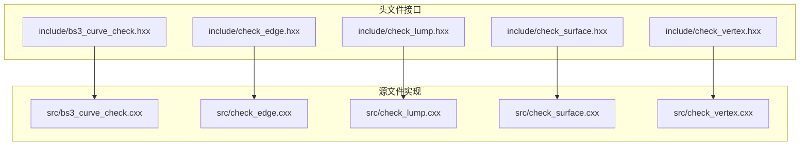
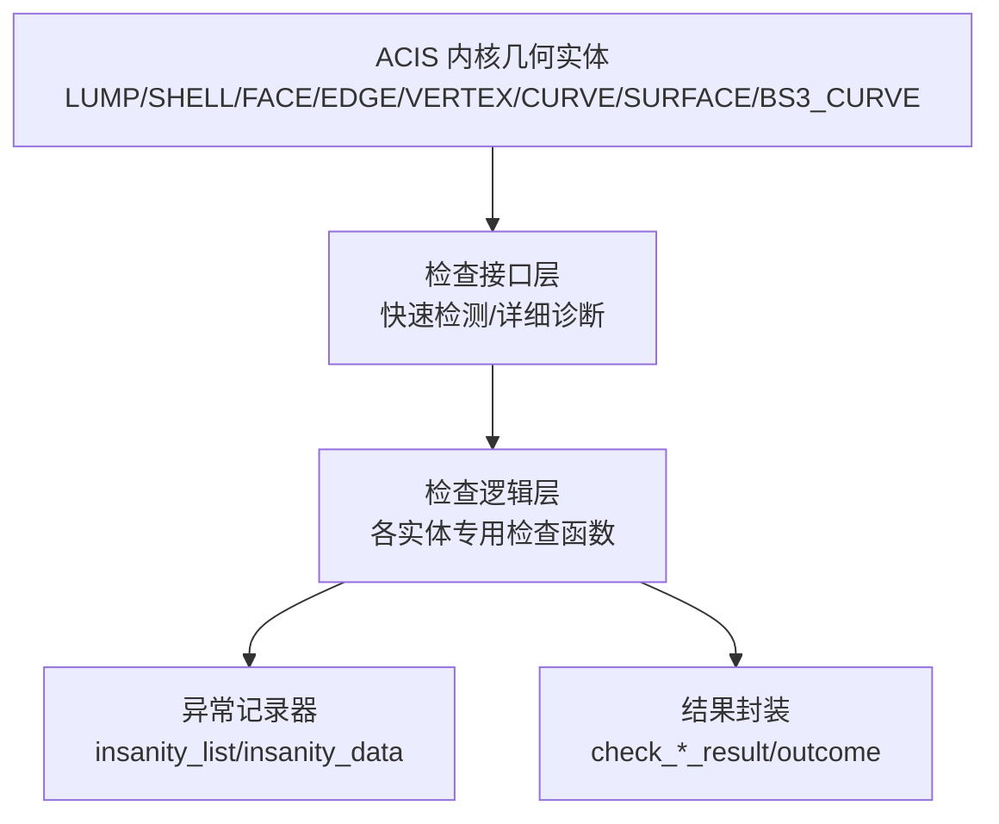
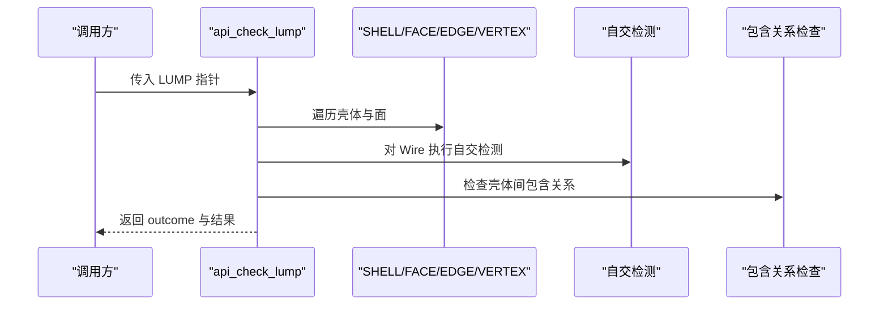
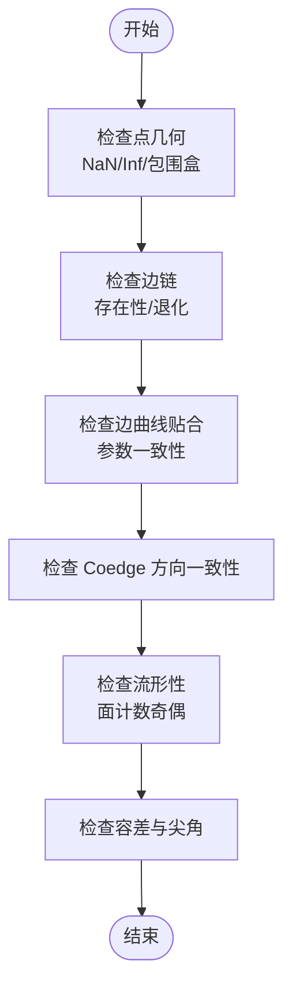
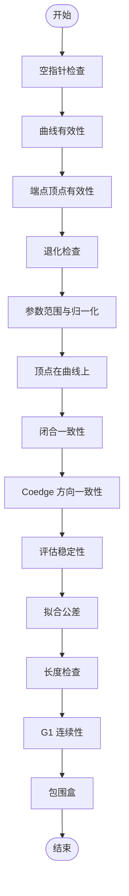
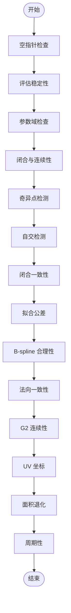
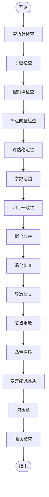
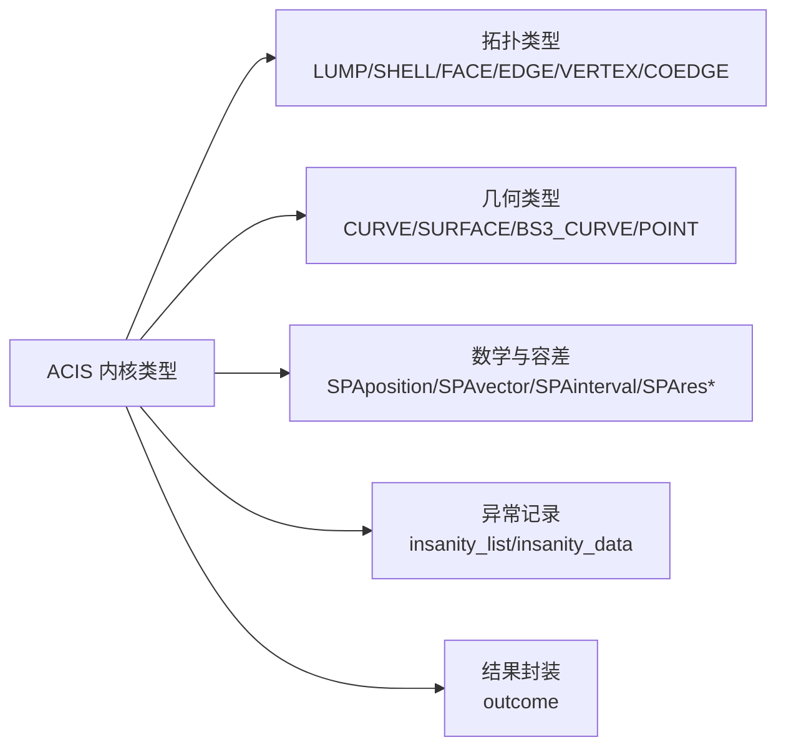

# ACIS 内核集成

<cite>
**本文档引用的文件**
- [bs3_curve_check.hxx](file://include/bs3_curve_check.hxx)
- [check_edge.hxx](file://include/check_edge.hxx)
- [check_lump.hxx](file://include/check_lump.hxx)
- [check_surface.hxx](file://include/check_surface.hxx)
- [check_vertex.hxx](file://include/check_vertex.hxx)
- [bs3_curve_check.cxx](file://src/bs3_curve_check.cxx)
- [check_edge.cxx](file://src/check_edge.cxx)
- [check_lump.cxx](file://src/check_lump.cxx)
- [check_surface.cxx](file://src/check_surface.cxx)
- [check_vertex.cxx](file://src/check_vertex.cxx)
- [TASK_SUMMARY.md](file://TASK_SUMMARY.md)
</cite>

## 目录
1. [简介](#简介)
2. [项目结构](#项目结构)
3. [核心组件](#核心组件)
4. [架构总览](#架构总览)
5. [详细组件分析](#详细组件分析)
6. [依赖分析](#依赖分析)
7. [性能考虑](#性能考虑)
8. [故障排查指南](#故障排查指南)
9. [结论](#结论)
10. [附录](#附录)

## 简介
本项目面向 ACIS 3D 内核，提供了对几何实体的系统性检查与诊断能力，覆盖 LUMP（实体）、SHELL（壳体）、FACE（面）、EDGE（边）、VERTEX（顶点）、CURVE（曲线）、SURFACE（曲面）以及 BS3_CURVE（B样条曲线）等关键几何类型。通过统一的检查接口与结果封装，实现拓扑正确性、几何连续性、数值稳定性与容差控制的多维验证，帮助用户快速定位模型问题并指导修复。

## 项目结构
项目采用“头文件声明 + 源文件实现”的分层组织，按几何实体类型划分模块，每个模块提供两类接口：
- 快速检测接口：返回整型状态码，便于快速判断
- 详细诊断接口：返回带结果对象的 outcome，支持收集详细的“异常”列表

图表来源
- [bs3_curve_check.hxx:1-138](file://include/bs3_curve_check.hxx#L1-L138)
- [check_edge.hxx:1-130](file://include/check_edge.hxx#L1-L130)
- [check_lump.hxx:1-117](file://include/check_lump.hxx#L1-L117)
- [check_surface.hxx:1-133](file://include/check_surface.hxx#L1-L133)
- [check_vertex.hxx:1-111](file://include/check_vertex.hxx#L1-L111)

章节来源
- [TASK_SUMMARY.md:1-306](file://TASK_SUMMARY.md#L1-L306)

## 核心组件
- LUMP 检查模块：校验壳体集合、包含关系、体积、方向一致性、面邻接与边流形性等
- VERTEX 检查模块：校验点几何、边链、曲线贴合、共点、方向一致性、流形性、包围盒、法向一致性、容差与尖角
- EDGE 检查模块：校验曲线几何、端点顶点、参数范围、闭合一致性、Coedge 方向、评估稳定性、拟合公差、长度、G1 连续性、包围盒与参数归一化
- SURFACE 检查模块：校验空指针、评估稳定性、参数域、闭合连续性、奇异点、闭合一致性、拟合公差、B-spline 合理性、自交、法向一致性、G2 连续性、UV 坐标、面积退化与周期性
- BS3_CURVE 检查模块：校验空指针、阶数、控制点、节点向量、评估稳定性、参数范围、闭合、拟合公差、退化、导数、节点重数、凸包性质、变差缩减性质、包围盒与弧长

章节来源
- [check_lump.hxx:1-117](file://include/check_lump.hxx#L1-L117)
- [check_vertex.hxx:1-111](file://include/check_vertex.hxx#L1-L111)
- [check_edge.hxx:1-130](file://include/check_edge.hxx#L1-L130)
- [check_surface.hxx:1-133](file://include/check_surface.hxx#L1-L133)
- [bs3_curve_check.hxx:1-138](file://include/bs3_curve_check.hxx#L1-L138)

## 架构总览
整体架构围绕 ACIS 几何内核数据结构展开，通过统一的“异常列表”记录器（insanity_list）收集各类检查发现的问题，最终由结果对象封装状态与统计信息，供上层调用者选择快速或详细诊断路径。

图表来源
- [check_lump.cxx:58-106](file://src/check_lump.cxx#L58-L106)
- [check_vertex.cxx:59-137](file://src/check_vertex.cxx#L59-L137)
- [check_edge.cxx:47-142](file://src/check_edge.cxx#L47-L142)
- [check_surface.cxx:49-144](file://src/check_surface.cxx#L49-L144)
- [bs3_curve_check.cxx:50-150](file://src/bs3_curve_check.cxx#L50-L150)

## 详细组件分析

### LUMP 检查模块
- 功能要点
  - 壳体有效性与空壳检测
  - 面有效性与环/线框遍历
  - 边曲线与顶点一致性
  - Coedge 方向一致性
  - Wire 自交检测
  - 包含关系与体积检查
  - 包围盒与方向一致性
  - 面邻接与边流形性

图表来源
- [check_lump.cxx:58-106](file://src/check_lump.cxx#L58-L106)
- [check_lump.cxx:346-413](file://src/check_lump.cxx#L346-L413)
- [check_lump.cxx:173-238](file://src/check_lump.cxx#L173-L238)

章节来源
- [check_lump.hxx:1-117](file://include/check_lump.hxx#L1-L117)
- [check_lump.cxx:1-766](file://src/check_lump.cxx#L1-L766)

### VERTEX 检查模块
- 功能要点
  - 点几何有效性（NaN/Inf）
  - 关联边链存在性与退化
  - 边曲线贴合与参数一致性
  - 共点检测
  - Coedge 方向一致性
  - 流形性（奇偶面计数）
  - 包围盒与法向一致性
  - 容差与尖角检测

图表来源
- [check_vertex.cxx:139-171](file://src/check_vertex.cxx#L139-L171)
- [check_vertex.cxx:173-230](file://src/check_vertex.cxx#L173-L230)
- [check_vertex.cxx:232-288](file://src/check_vertex.cxx#L232-L288)
- [check_vertex.cxx:339-374](file://src/check_vertex.cxx#L339-L374)
- [check_vertex.cxx:376-413](file://src/check_vertex.cxx#L376-L413)
- [check_vertex.cxx:515-551](file://src/check_vertex.cxx#L515-L551)

章节来源
- [check_vertex.hxx:1-111](file://include/check_vertex.hxx#L1-L111)
- [check_vertex.cxx:1-714](file://src/check_vertex.cxx#L1-L714)

### EDGE 检查模块
- 功能要点
  - 曲线与端点顶点有效性
  - 参数范围与归一化
  - 顶点在曲线上的贴合
  - 闭合一致性（位置与切向）
  - Coedge 方向一致性
  - 评估稳定性与拟合公差
  - 长度与 G1 连续性
  - 包围盒与参数归一化

图表来源
- [check_edge.cxx:144-157](file://src/check_edge.cxx#L144-L157)
- [check_edge.cxx:159-177](file://src/check_edge.cxx#L159-L177)
- [check_edge.cxx:179-263](file://src/check_edge.cxx#L179-L263)
- [check_edge.cxx:265-300](file://src/check_edge.cxx#L265-L300)
- [check_edge.cxx:302-344](file://src/check_edge.cxx#L302-L344)
- [check_edge.cxx:346-397](file://src/check_edge.cxx#L346-L397)
- [check_edge.cxx:399-453](file://src/check_edge.cxx#L399-L453)
- [check_edge.cxx:455-489](file://src/check_edge.cxx#L455-L489)
- [check_edge.cxx:491-545](file://src/check_edge.cxx#L491-L545)
- [check_edge.cxx:547-574](file://src/check_edge.cxx#L547-L574)
- [check_edge.cxx:576-621](file://src/check_edge.cxx#L576-L621)
- [check_edge.cxx:623-667](file://src/check_edge.cxx#L623-L667)
- [check_edge.cxx:669-719](file://src/check_edge.cxx#L669-L719)
- [check_edge.cxx:721-760](file://src/check_edge.cxx#L721-L760)

章节来源
- [check_edge.hxx:1-130](file://include/check_edge.hxx#L1-L130)
- [check_edge.cxx:1-890](file://src/check_edge.cxx#L1-L890)

### SURFACE 检查模块
- 功能要点
  - 空指针与评估稳定性
  - 参数域与闭合连续性
  - 奇异点与自交检测
  - 闭合一致性与拟合公差
  - B-spline 合理性与周期性
  - 法向一致性与 G2 连续性
  - UV 坐标与面积退化

图表来源
- [check_surface.cxx:146-159](file://src/check_surface.cxx#L146-L159)
- [check_surface.cxx:161-220](file://src/check_surface.cxx#L161-L220)
- [check_surface.cxx:222-275](file://src/check_surface.cxx#L222-L275)
- [check_surface.cxx:277-336](file://src/check_surface.cxx#L277-L336)
- [check_surface.cxx:338-403](file://src/check_surface.cxx#L338-L403)
- [check_surface.cxx:405-464](file://src/check_surface.cxx#L405-L464)
- [check_surface.cxx:466-493](file://src/check_surface.cxx#L466-L493)
- [check_surface.cxx:495-576](file://src/check_surface.cxx#L495-L576)
- [check_surface.cxx:578-650](file://src/check_surface.cxx#L578-L650)
- [check_surface.cxx:652-719](file://src/check_surface.cxx#L652-L719)
- [check_surface.cxx:721-800](file://src/check_surface.cxx#L721-L800)

章节来源
- [check_surface.hxx:1-133](file://include/check_surface.hxx#L1-L133)
- [check_surface.cxx:1-1075](file://src/check_surface.cxx#L1-L1075)

### BS3_CURVE 检查模块
- 功能要点
  - 空指针与阶数检查
  - 控制点与节点向量
  - 评估稳定性与参数范围
  - 闭合与拟合公差
  - 退化与导数
  - 节点重数与凸包性质
  - 变差缩减性质与包围盒
  - 弧长检查

图表来源
- [bs3_curve_check.cxx:152-165](file://src/bs3_curve_check.cxx#L152-L165)
- [bs3_curve_check.cxx:167-193](file://src/bs3_curve_check.cxx#L167-L193)
- [bs3_curve_check.cxx:195-244](file://src/bs3_curve_check.cxx#L195-L244)
- [bs3_curve_check.cxx:246-296](file://src/bs3_curve_check.cxx#L246-L296)
- [bs3_curve_check.cxx:298-347](file://src/bs3_curve_check.cxx#L298-L347)
- [bs3_curve_check.cxx:349-391](file://src/bs3_curve_check.cxx#L349-L391)
- [bs3_curve_check.cxx:393-440](file://src/bs3_curve_check.cxx#L393-L440)
- [bs3_curve_check.cxx:442-470](file://src/bs3_curve_check.cxx#L442-L470)
- [bs3_curve_check.cxx:471-536](file://src/bs3_curve_check.cxx#L471-L536)
- [bs3_curve_check.cxx:538-609](file://src/bs3_curve_check.cxx#L538-L609)
- [bs3_curve_check.cxx:611-649](file://src/bs3_curve_check.cxx#L611-L649)
- [bs3_curve_check.cxx:651-723](file://src/bs3_curve_check.cxx#L651-L723)
- [bs3_curve_check.cxx:725-781](file://src/bs3_curve_check.cxx#L725-L781)
- [bs3_curve_check.cxx:783-821](file://src/bs3_curve_check.cxx#L783-L821)
- [bs3_curve_check.cxx:823-874](file://src/bs3_curve_check.cxx#L823-L874)

章节来源
- [bs3_curve_check.hxx:1-138](file://include/bs3_curve_check.hxx#L1-L138)
- [bs3_curve_check.cxx:1-1011](file://src/bs3_curve_check.cxx#L1-L1011)

## 依赖分析
- ACIS 几何内核类型
  - 拓扑：LUMP、SHELL、FACE、EDGE、VERTEX、COEDGE、LOOP、WIRE
  - 几何：CURVE、SURFACE、BS3_CURVE、bs3_surface、POINT
  - 数学与容差：SPAposition、SPAvector、SPAinterval、SPApar_box、SPApar_pos、SPAresabs、SPAresnor
- 结果与报告
  - insanity_list/insanity_data：用于收集检查发现的异常项
  - outcome：统一的返回结果封装

图表来源
- [TASK_SUMMARY.md:282-293](file://TASK_SUMMARY.md#L282-L293)

章节来源
- [TASK_SUMMARY.md:282-293](file://TASK_SUMMARY.md#L282-L293)

## 性能考虑
- 采样密度与计算复杂度
  - 曲线/曲面评估采用固定采样步数，采样越多越精确但耗时增加
  - 自交检测对每段边进行配对比较，复杂度随边数平方增长
- 容差与数值稳定性
  - 使用 SPAresabs、SPAresnor 等内核容差常量作为阈值，避免硬编码导致的数值不稳定
  - 对 NaN/Inf 的早期检测可减少后续昂贵计算
- 早停策略
  - 发现致命错误（如空指针、空壳）立即返回，避免无意义的后续检查
  - 对于非致命警告（如高阶数、大容差），继续执行以收集完整信息

## 故障排查指南
- 常见错误类别与定位
  - 拓扑错误：壳体为空、包含关系错误、非流形边/顶点、Coedge 方向不一致
  - 几何错误：参数域异常、闭合不一致、自交、退化/零长度、拟合公差过大
  - 数值错误：NaN/Inf 坐标、评估异常、法向不一致、尖角
- 排查步骤
  - 使用快速检测接口先判断整体状态，再针对特定标志位使用详细诊断接口获取异常列表
  - 从最外层实体（LUMP）到子实体（SHELL/FACE/EDGE/VERTEX）逐级缩小范围
  - 对于曲线/曲面，优先检查参数域与闭合一致性，再进行导数与连续性检查
- 修复建议
  - 调整几何参数（如节点重数、控制点分布）以满足 B-spline 合理性
  - 修正拓扑方向与 Coedge 感觉，确保相邻边/面方向一致
  - 降低拟合公差或优化网格密度，避免过大的容差导致误判

章节来源
- [check_lump.cxx:108-136](file://src/check_lump.cxx#L108-L136)
- [check_edge.cxx:144-157](file://src/check_edge.cxx#L144-L157)
- [check_surface.cxx:146-159](file://src/check_surface.cxx#L146-L159)
- [bs3_curve_check.cxx:152-165](file://src/bs3_curve_check.cxx#L152-L165)

## 结论
本项目通过模块化的检查接口与完善的异常记录机制，为 ACIS 内核几何模型提供了系统性的质量保障。各模块既可独立使用进行快速筛查，也可组合使用进行深度诊断；既关注拓扑正确性，也重视几何连续性与数值稳定性。结合容差控制与早停策略，能够在保证准确性的同时兼顾效率，适用于 CAD/CAE 工程应用中的几何模型验证与修复流程。

## 附录
- 接口模式
  - 快速检测：返回整型状态码，适合批量扫描与自动化流程
  - 详细诊断：返回 outcome 并携带结果对象，适合交互式调试与问题定位
- 术语说明
  - G0/G1/G2：几何连续性等级，分别表示位置、切线、曲率连续
  - 流形性：拓扑局部结构良好，满足二维流形的基本约束
  - 容差：数值计算中的误差阈值，影响判断的严格程度