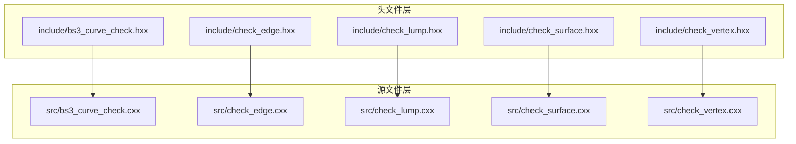
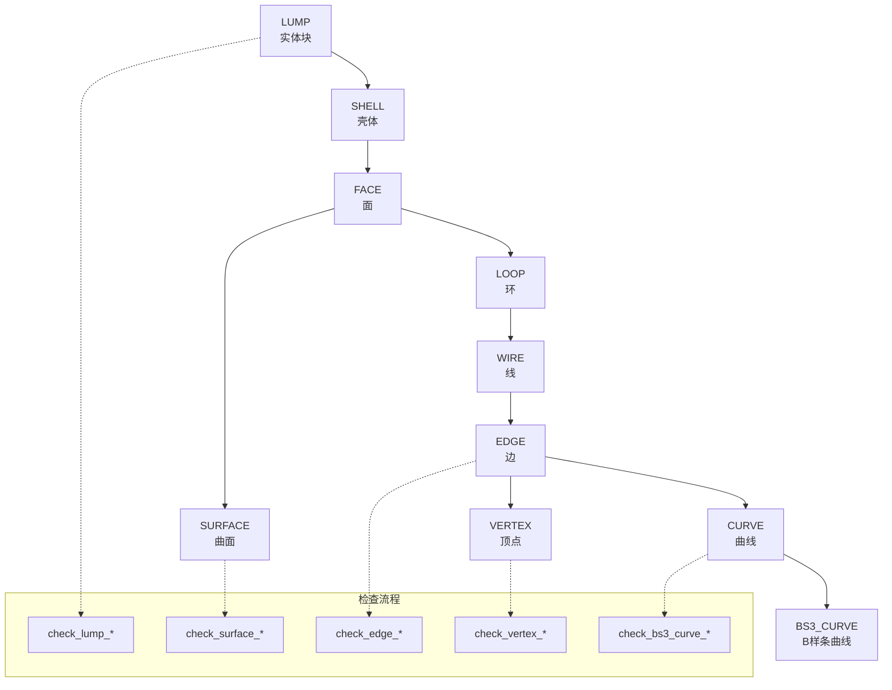
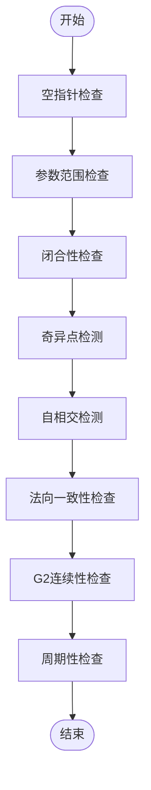
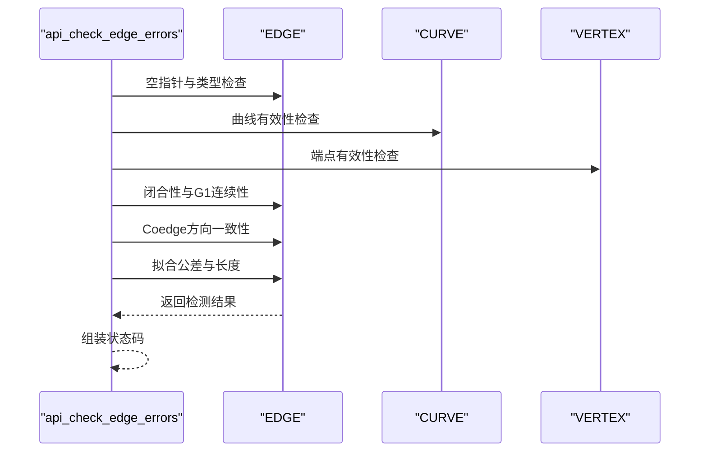
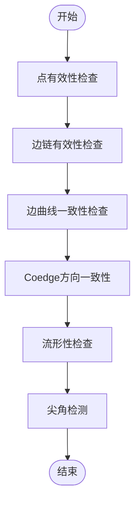
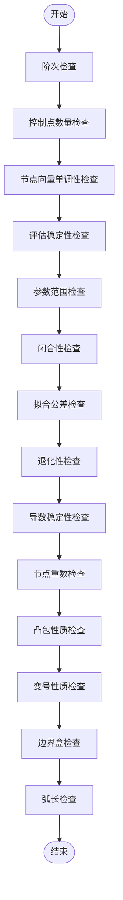
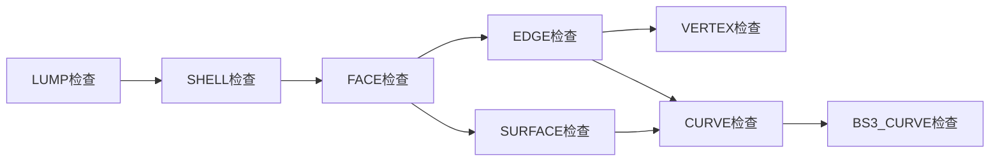

# 几何实体类型关系

<cite>
**本文档引用的文件**
- [bs3_curve_check.hxx](file://include/bs3_curve_check.hxx)
- [check_edge.hxx](file://include/check_edge.hxx)
- [check_lump.hxx](file://include/check_lump.hxx)
- [check_surface.hxx](file://include/check_surface.hxx)
- [check_vertex.hxx](file://include/check_vertex.hxx)
- [bs3_curve_check.cxx](file://src/bs3_curve_check.cxx)
- [check_edge.cxx](file://src/check_edge.cxx)
- [check_lump.cxx](file://src/check_lump.cxx)
- [check_surface.cxx](file://src/check_surface.cxx)
- [check_vertex.cxx](file://src/check_vertex.cxx)
</cite>

## 目录
1. [引言](#引言)
2. [项目结构](#项目结构)
3. [核心组件](#核心组件)
4. [架构概览](#架构概览)
5. [详细组件分析](#详细组件分析)
6. [依赖关系分析](#依赖关系分析)
7. [性能考虑](#性能考虑)
8. [故障排除指南](#故障排除指南)
9. [结论](#结论)

## 引言

本文件针对ACIS内核中的几何实体类型关系进行深入技术分析，重点覆盖以下实体：LUMP（实体块）、SHELL（壳体）、FACE（面）、EDGE（边）、VERTEX（顶点）、CURVE（曲线）、SURFACE（曲面）、BS3_CURVE（B样条曲线）。文档从层次关系、包含关系、属性与约束、拓扑连接规则、方向性要求、连续性限制等维度进行全面阐述，并结合几何检查的作用与重要性给出实践指导。

## 项目结构

该代码库采用按功能模块划分的组织方式，每个几何实体类型均配有独立的检查接口头文件与实现源文件：

- 头文件层（include）：定义各实体检查的枚举状态、结果类、API函数原型
- 源文件层（src）：实现具体的检查逻辑，包括几何验证、拓扑校验、连续性检测等



**图表来源**
- [bs3_curve_check.hxx:1-138](file://include/bs3_curve_check.hxx#L1-L138)
- [check_edge.hxx:1-130](file://include/check_edge.hxx#L1-L130)
- [check_lump.hxx:1-117](file://include/check_lump.hxx#L1-L117)
- [check_surface.hxx:1-133](file://include/check_surface.hxx#L1-L133)
- [check_vertex.hxx:1-111](file://include/check_vertex.hxx#L1-L111)

**章节来源**
- [bs3_curve_check.hxx:1-138](file://include/bs3_curve_check.hxx#L1-L138)
- [check_edge.hxx:1-130](file://include/check_edge.hxx#L1-L130)
- [check_lump.hxx:1-117](file://include/check_lump.hxx#L1-L117)
- [check_surface.hxx:1-133](file://include/check_surface.hxx#L1-L133)
- [check_vertex.hxx:1-111](file://include/check_vertex.hxx#L1-L111)

## 核心组件

本节概述各几何实体类型及其在ACIS内核中的角色定位与相互关系：

- LUMP（实体块）
  - 定义：三维几何体的基本构造单元，由一个或多个SHELL组成
  - 属性：包含壳体集合、体积、边界盒等
  - 约束：壳体数量、包含关系一致性、壳体定向匹配、面邻接完整性、边流形性等
- SHELL（壳体）
  - 定义：由多个FACE组成的封闭或开放表面集合，表示实体的外表面
  - 属性：包含面集合、环集合、线集合等
  - 约束：面有效性、环有效性、无自相交、壳体定向一致性
- FACE（面）
  - 定义：由SURFACE参数域上的区域构成，通过LOOP/WIRE/EDGE/VERTEX连接
  - 属性：包含曲面、环、边链等
  - 约束：曲面有效性、Coedge方向一致性、无自相交、邻接完整性
- EDGE（边）
  - 定义：由CURVE参数域上的线段构成，连接两个VERTEX
  - 属性：起止参数、闭合状态、拟合公差、长度等
  - 约束：曲线有效性、端点位于曲线上、闭合一致性、G1连续性、方向一致性
- VERTEX（顶点）
  - 定义：几何离散点，作为EDGE的端点
  - 属性：位置点、容差、关联边链
  - 约束：点坐标有效性、无退化边、Coedge方向一致性、流形性、尖角检测
- CURVE（曲线）
  - 定义：二维或三维空间中的曲线几何对象
  - 属性：参数范围、闭合状态、拟合公差、导数等
  - 约束：参数范围有效性、评估稳定性、闭合一致性、G1连续性
- SURFACE（曲面）
  - 定义：二维参数空间到三维欧氏空间的映射
  - 属性：U/V参数范围、闭合性、法向一致性、G2连续性
  - 约束：参数范围有效性、自相交检测、法向一致性、周期性检查
- BS3_CURVE（B样条曲线）
  - 定义：特殊的CURVE，基于B样条基函数
  - 属性：阶次、控制点、节点向量、拟合公差
  - 约束：阶次与控制点数量关系、节点向量单调性、凸包性质、弧长有效性

**章节来源**
- [check_lump.hxx:9-25](file://include/check_lump.hxx#L9-L25)
- [check_surface.hxx:9-27](file://include/check_surface.hxx#L9-L27)
- [check_edge.hxx:9-26](file://include/check_edge.hxx#L9-L26)
- [check_vertex.hxx:9-23](file://include/check_vertex.hxx#L9-L23)
- [bs3_curve_check.hxx:9-27](file://include/bs3_curve_check.hxx#L9-L27)

## 架构概览

下图展示ACIS几何实体的层次与包含关系，以及主要检查流程的调用关系：



**图表来源**
- [check_lump.cxx:58-106](file://src/check_lump.cxx#L58-L106)
- [check_surface.cxx:49-144](file://src/check_surface.cxx#L49-L144)
- [check_edge.cxx:47-142](file://src/check_edge.cxx#L47-L142)
- [check_vertex.cxx:59-137](file://src/check_vertex.cxx#L59-L137)
- [bs3_curve_check.cxx:50-150](file://src/bs3_curve_check.cxx#L50-L150)

## 详细组件分析

### LUMP（实体块）检查

- 职责：验证实体块的壳体集合、包含关系、体积、边界盒、壳体定向一致性、面邻接完整性、边流形性
- 关键检查项：
  - 壳体有效性与空壳检测
  - 包含关系一致性（内外壳关系）
  - 体积与边界盒有效性
  - 壳体定向匹配
  - 面邻接完整性（自由边检测）
  - 边流形性（奇偶性检测）

```mermaid
sequenceDiagram
participant API as "api_check_lump"
participant Shell as "SHELL"
participant Face as "FACE"
participant Loop as "LOOP"
participant Wire as "WIRE"
API->>Shell : 遍历壳体
API->>Face : 校验面有效性
API->>Loop : 校验环有效性
API->>Wire : 自相交检测
Wire-->>API : 返回检测结果
Face-->>API : 返回检测结果
Shell-->>API : 返回检测结果
API-->>API : 组装状态码
```

**图表来源**
- [check_lump.cxx:58-106](file://src/check_lump.cxx#L58-L106)
- [check_lump.cxx:346-413](file://src/check_lump.cxx#L346-L413)

**章节来源**
- [check_lump.hxx:9-25](file://include/check_lump.hxx#L9-L25)
- [check_lump.cxx:58-106](file://src/check_lump.cxx#L58-L106)
- [check_lump.cxx:173-238](file://src/check_lump.cxx#L173-L238)

### SURFACE（曲面）检查

- 职责：验证曲面的参数范围、闭合性、自相交、法向一致性、G2连续性、周期性等
- 关键检查项：
  - 参数范围有效性（U/V分别检测）
  - 闭合性一致性（边界位置与切向匹配）
  - 导数与法向评估稳定性
  - G2连续性（仅在闭合边界处）
  - 周期性检查（周期性曲面）



**图表来源**
- [check_surface.cxx:49-144](file://src/check_surface.cxx#L49-L144)
- [check_surface.cxx:277-336](file://src/check_surface.cxx#L277-L336)

**章节来源**
- [check_surface.hxx:9-27](file://include/check_surface.hxx#L9-L27)
- [check_surface.cxx:49-144](file://src/check_surface.cxx#L49-L144)
- [check_surface.cxx:578-650](file://src/check_surface.cxx#L578-L650)

### EDGE（边）检查

- 职责：验证边的曲线几何、端点、闭合性、G1连续性、方向一致性、拟合公差等
- 关键检查项：
  - 曲线有效性与参数范围
  - 端点位于曲线上且参数一致
  - 闭合一致性（位置与切向）
  - Coedge方向一致性（同Sense错误）
  - G1连续性（闭合边界处）
  - 边长与拟合公差



**图表来源**
- [check_edge.cxx:47-142](file://src/check_edge.cxx#L47-L142)
- [check_edge.cxx:399-453](file://src/check_edge.cxx#L399-L453)

**章节来源**
- [check_edge.hxx:9-26](file://include/check_edge.hxx#L9-L26)
- [check_edge.cxx:47-142](file://src/check_edge.cxx#L47-L142)
- [check_edge.cxx:623-667](file://src/check_edge.cxx#L623-L667)

### VERTEX（顶点）检查

- 职责：验证顶点位置、关联边链、Coedge方向、流形性、尖角等
- 关键检查项：
  - 点坐标有效性（NaN/Inf）
  - 无退化边（零长度）
  - Coedge方向一致性
  - 流形性（面计数奇偶性）
  - 尖角检测（多边形角度异常）



**图表来源**
- [check_vertex.cxx:59-137](file://src/check_vertex.cxx#L59-L137)
- [check_vertex.cxx:376-413](file://src/check_vertex.cxx#L376-L413)

**章节来源**
- [check_vertex.hxx:9-23](file://include/check_vertex.hxx#L9-L23)
- [check_vertex.cxx:59-137](file://src/check_vertex.cxx#L59-L137)
- [check_vertex.cxx:553-609](file://src/check_vertex.cxx#L553-L609)

### BS3_CURVE（B样条曲线）检查

- 职责：验证B样条曲线的阶次、控制点、节点向量、凸包性质、拟合公差、弧长等
- 关键检查项：
  - 阶次与控制点数量关系
  - 节点向量单调性与重数限制
  - 控制点坐标有效性（NaN/Inf）
  - 凸包包含性与变号性质
  - 弧长有效性与拟合公差



**图表来源**
- [bs3_curve_check.cxx:50-150](file://src/bs3_curve_check.cxx#L50-L150)
- [bs3_curve_check.cxx:298-347](file://src/bs3_curve_check.cxx#L298-L347)

**章节来源**
- [bs3_curve_check.hxx:9-27](file://include/bs3_curve_check.hxx#L9-L27)
- [bs3_curve_check.cxx:50-150](file://src/bs3_curve_check.cxx#L50-L150)
- [bs3_curve_check.cxx:823-874](file://src/bs3_curve_check.cxx#L823-L874)

## 依赖关系分析

各检查模块之间存在明确的依赖关系与调用链：

- LUMP检查依赖于SHELL/FACE/EDGE/VERTEX的子检查
- EDGE检查依赖于CURVE与VERTEX的子检查
- SURFACE检查可直接对CURVE进行B样条特化检查（BS3_CURVE）



**图表来源**
- [check_lump.cxx:58-106](file://src/check_lump.cxx#L58-L106)
- [check_edge.cxx:47-142](file://src/check_edge.cxx#L47-L142)
- [check_surface.cxx:49-144](file://src/check_surface.cxx#L49-L144)
- [bs3_curve_check.cxx:50-150](file://src/bs3_curve_check.cxx#L50-L150)

**章节来源**
- [check_lump.cxx:58-106](file://src/check_lump.cxx#L58-L106)
- [check_edge.cxx:47-142](file://src/check_edge.cxx#L47-L142)
- [check_surface.cxx:49-144](file://src/check_surface.cxx#L49-L144)
- [bs3_curve_check.cxx:50-150](file://src/bs3_curve_check.cxx#L50-L150)

## 性能考虑

- 采样策略：多数检查采用固定步长采样（如10~20个样本），平衡精度与性能
- 异常处理：对评估抛出异常的情况进行捕获并记录，避免中断整体检查流程
- 提前终止：当发现严重问题（如空指针、参数范围无效）时立即返回，减少后续计算
- 数值稳定性：使用相对容差与绝对容差组合（如SPAresabs、SPAresnor）确保数值稳健性

## 故障排除指南

- 常见错误类型
  - 空指针/空壳：LUMP无壳体、SHELL无面、EDGE无曲线/端点
  - 参数范围无效：参数区间为空或包含NaN/Inf
  - 闭合不一致：闭合标记与边界位置/切向不匹配
  - 方向错误：Coedge与其伙伴具有相同Sense
  - 退化性：边长为零、控制点重合、曲面面积退化
  - 连续性破坏：G1/G2不满足要求
- 排查步骤
  - 优先检查LUMP的壳体集合与包含关系
  - 检查SURFACE的参数范围与闭合性
  - 校验EDGE的曲线与端点一致性
  - 验证VERTEX的点坐标与流形性
  - 对BS3_CURVE执行阶次、节点向量与凸包检查

**章节来源**
- [check_lump.hxx:9-25](file://include/check_lump.hxx#L9-L25)
- [check_surface.hxx:9-27](file://include/check_surface.hxx#L9-L27)
- [check_edge.hxx:9-26](file://include/check_edge.hxx#L9-L26)
- [check_vertex.hxx:9-23](file://include/check_vertex.hxx#L9-L23)
- [bs3_curve_check.hxx:9-27](file://include/bs3_curve_check.hxx#L9-L27)

## 结论

通过对ACIS内核中几何实体类型关系的系统分析，可以清晰地看到LUMP/SHELL/FACE/EDGE/VERTEX/CURVE/SURFACE/BS3_CURVE之间的层次与包含关系。每个实体都有其特定的属性、约束与检查重点，而检查模块则围绕这些关键点构建了完整的质量保障体系。实践中应重点关注拓扑连通性、方向一致性与连续性要求，以确保几何模型的正确性与可用性。