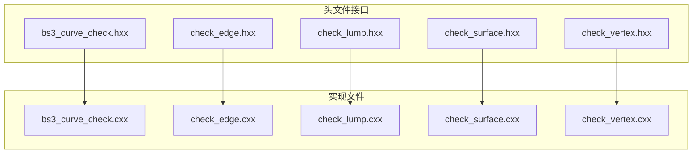
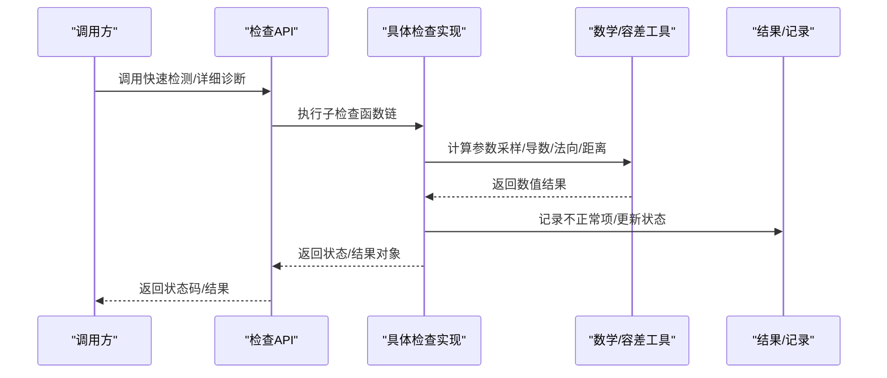
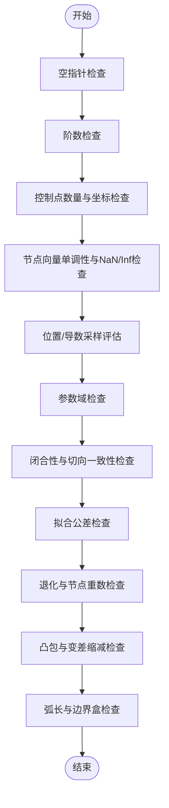
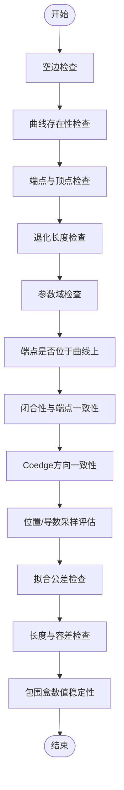
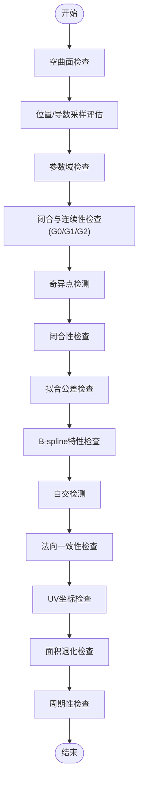
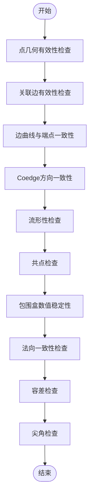
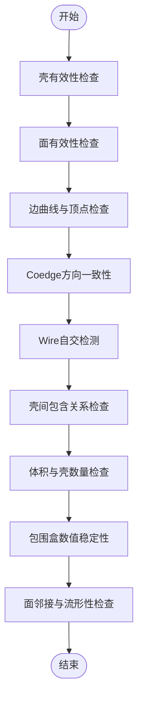
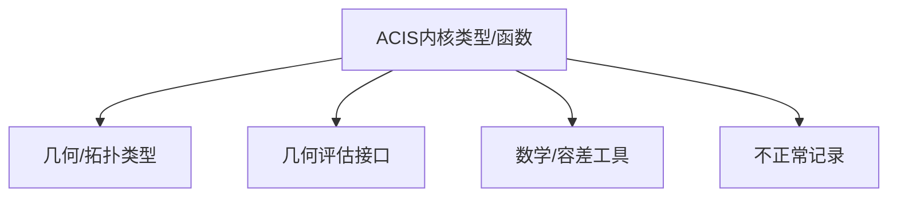

# 几何评估接口

<cite>
**本文档引用的文件**
- [bs3_curve_check.hxx](file://include/bs3_curve_check.hxx)
- [check_edge.hxx](file://include/check_edge.hxx)
- [check_lump.hxx](file://include/check_lump.hxx)
- [check_surface.hxx](file://include/check_surface.hxx)
- [check_vertex.hxx](file://include/check_vertex.hxx)
- [bs3_curve_check.cxx](file://src/bs3_curve_check.cxx)
- [check_edge.cxx](file://src/check_edge.cxx)
- [check_lump.cxx](file://src/check_lump.cxx)
- [check_surface.cxx](file://src/check_surface.cxx)
- [check_vertex.cxx](file://src/check_vertex.cxx)
- [TASK_SUMMARY.md](file://TASK_SUMMARY.md)
</cite>

## 目录
1. [简介](#简介)
2. [项目结构](#项目结构)
3. [核心组件](#核心组件)
4. [架构总览](#架构总览)
5. [详细组件分析](#详细组件分析)
6. [依赖分析](#依赖分析)
7. [性能考虑](#性能考虑)
8. [故障排查指南](#故障排查指南)
9. [结论](#结论)
10. [附录](#附录)

## 简介
本项目基于 ACIS 3D 内核，提供了针对几何实体的系统化评估与检查接口，覆盖 LUMP（实体）、VERTEX（顶点）、EDGE（边）、SURFACE（曲面）以及 BS3_CURVE（B样条曲线）五类几何对象。接口以“快速检测”和“详细诊断”两种模式提供，既可快速判定几何对象是否满足基本要求，也可输出详细的“不正常记录”列表用于定位问题。所有检查均围绕几何评估、参数化表示、边界与闭合性、法向一致性、曲率与自交、数值稳定性等关键主题展开，并通过统一的容差常量与数学工具进行数值精度控制。

## 项目结构
项目采用头文件声明与实现文件分离的组织方式：
- include 目录：各几何类型的检查接口声明、状态枚举、结果封装类与辅助类型。
- src 目录：对应接口的具体实现，包含完整的检查逻辑、异常处理与容差判断。
- TASK_SUMMARY.md：项目概览、接口清单、统计信息与依赖说明。

图表来源
- [bs3_curve_check.hxx:1-138](file://include/bs3_curve_check.hxx#L1-L138)
- [check_edge.hxx:1-130](file://include/check_edge.hxx#L1-L130)
- [check_lump.hxx:1-117](file://include/check_lump.hxx#L1-L117)
- [check_surface.hxx:1-133](file://include/check_surface.hxx#L1-L133)
- [check_vertex.hxx:1-111](file://include/check_vertex.hxx#L1-L111)

章节来源
- [TASK_SUMMARY.md:1-306](file://TASK_SUMMARY.md#L1-L306)

## 核心组件
- 结果封装类：每类检查均提供一个结果类，用于保存检查状态、统计计数与“不正常记录”列表，支持查询状态、添加记录与获取统计信息。
- 检查状态枚举：为每类几何对象定义了专用的状态位，涵盖空指针、参数域、闭合性、拟合公差、退化、自交、法向一致性、周期性等常见问题。
- 检查函数族：提供两类调用入口：
  - 快速检测：返回整型状态码，便于快速判断。
  - 详细诊断：返回 outcome 并填充结果对象，包含详细的“不正常记录”，便于定位与修复。
- 容差与数学工具：统一使用 ACIS 提供的容差常量（如绝对容差、法向容差）与数学类型（位置、向量、区间、参数盒），确保数值稳定性与一致性。

章节来源
- [bs3_curve_check.hxx:29-49](file://include/bs3_curve_check.hxx#L29-L49)
- [check_edge.hxx:28-46](file://include/check_edge.hxx#L28-L46)
- [check_lump.hxx:27-48](file://include/check_lump.hxx#L27-L48)
- [check_surface.hxx:29-49](file://include/check_surface.hxx#L29-L49)
- [check_vertex.hxx:25-47](file://include/check_vertex.hxx#L25-L47)

## 架构总览
整体架构遵循“接口声明 + 实现”的分层设计，检查流程包括：
- 输入校验：确认几何对象类型与非空性。
- 参数化评估：对参数域、闭合性、导数与法向进行采样评估。
- 拓扑一致性：检查边/面/壳之间的邻接、方向与流形性。
- 数值稳定性：通过容差常量与异常捕获保障评估过程稳健。
- 结果汇总：将检查结果映射到状态位或“不正常记录”。

图表来源
- [bs3_curve_check.cxx:50-150](file://src/bs3_curve_check.cxx#L50-L150)
- [check_edge.cxx:47-142](file://src/check_edge.cxx#L47-L142)
- [check_lump.cxx:58-106](file://src/check_lump.cxx#L58-L106)
- [check_surface.cxx:49-144](file://src/check_surface.cxx#L49-L144)
- [check_vertex.cxx:59-137](file://src/check_vertex.cxx#L59-L137)

## 详细组件分析

### BS3_CURVE 检查模块
- 功能要点
  - 参数化表示：检查阶数、节点向量、控制点数量与分布、凸包与变差缩减性质。
  - 数值评估：对位置、导数进行采样评估，检测 NaN/Inf 与异常抛出。
  - 闭合性与拟合公差：验证闭合曲线的端点与切向一致性，检查拟合公差范围。
  - 退化与自交：识别退化控制点、过高的节点重数与弧长异常。
- 关键算法
  - 参数采样：均匀采样参数空间，评估位置与导数，统计异常次数。
  - 凸包检验：比较采样点与控制点凸包的关系，发现越界情况。
  - 变差缩减性质：通过切向夹角变化趋势判断曲线局部行为。
- 使用建议
  - 对高阶曲线优先关注节点重数与控制点分布，避免过度拟合导致退化。
  - 在闭合曲线场景下，重点检查端点与切向的 G1 连续性。

图表来源
- [bs3_curve_check.cxx:152-781](file://src/bs3_curve_check.cxx#L152-L781)
- [bs3_curve_check.hxx:51-135](file://include/bs3_curve_check.hxx#L51-L135)

章节来源
- [bs3_curve_check.hxx:9-27](file://include/bs3_curve_check.hxx#L9-L27)
- [bs3_curve_check.cxx:152-781](file://src/bs3_curve_check.cxx#L152-L781)

### EDGE 检查模块
- 功能要点
  - 几何与拓扑：检查边的曲线、端点顶点、参数范围与归一化。
  - 闭合性与连续性：验证闭合边的端点与切向一致性，检查 G1 连续性。
  - Coedge 方向：确保相邻 Coedge 的方向一致性。
  - 长度与容差：检查长度非负、容差合理与包围盒数值稳定性。
- 关键算法
  - 参数采样：沿参数域均匀采样，评估位置与导数，捕获异常。
  - 闭合性验证：比较端点位置与切向夹角，容忍容差范围内的偏差。
- 使用建议
  - 在闭合边场景中，优先检查端点与切向一致性，避免 G1 不连续导致的渲染或求交问题。

图表来源
- [check_edge.cxx:144-760](file://src/check_edge.cxx#L144-L760)
- [check_edge.hxx:48-127](file://include/check_edge.hxx#L48-L127)

章节来源
- [check_edge.hxx:9-26](file://include/check_edge.hxx#L9-L26)
- [check_edge.cxx:144-760](file://src/check_edge.cxx#L144-L760)

### SURFACE 检查模块
- 功能要点
  - 参数化与闭合：检查 U/V 参数域、闭合性与边界位置一致性。
  - 连续性与法向：评估 G0/G1/G2 连续性，检查法向一致性与数值稳定性。
  - 自交与奇异：通过网格采样与导数叉积判断可能的自交与奇异点。
  - B-spline 特性：检查阶数、控制点数量与相邻控制点一致性。
- 关键算法
  - 参数网格采样：在 U/V 参数域上生成网格，评估位置与导数，统计异常。
  - 法向一致性：计算二阶导数叉积，归一化后检查 NaN/Inf。
  - 自交检测：比较四角点最大距离与中心到角点最小距离，判断潜在自交。
- 使用建议
  - 在闭合曲面场景中，重点检查 U/V 方向的闭合缝处连续性。
  - 对于复杂曲面，适当增加采样密度以提高检测可靠性。

图表来源
- [check_surface.cxx:146-800](file://src/check_surface.cxx#L146-L800)
- [check_surface.hxx:51-130](file://include/check_surface.hxx#L51-L130)

章节来源
- [check_surface.hxx:9-27](file://include/check_surface.hxx#L9-L27)
- [check_surface.cxx:146-800](file://src/check_surface.cxx#L146-L800)

### VERTEX 检查模块
- 功能要点
  - 几何有效性：检查点几何是否存在、坐标数值稳定性与容差。
  - 拓扑一致性：检查关联边的存在性、方向一致性与流形性。
  - 顶点与曲线：验证顶点是否位于关联曲线的端点参数位置。
  - 角度与尖角：统计关联边数量，评估可能的尖角特征。
- 关键算法
  - 边遍历：沿顶点的边链表遍历，统计边数与面数，判断流形性。
  - Coedge 方向：检查相邻 Coedge 的方向一致性，避免同向错误。
  - 角度估计：通过边链表计算相邻边之间的夹角，识别尖角。
- 使用建议
  - 在复杂拓扑中，优先检查流形性与 Coedge 方向一致性，避免非流形引发的后续问题。

图表来源
- [check_vertex.cxx:139-609](file://src/check_vertex.cxx#L139-L609)
- [check_vertex.hxx:25-108](file://include/check_vertex.hxx#L25-L108)

章节来源
- [check_vertex.hxx:9-23](file://include/check_vertex.hxx#L9-L23)
- [check_vertex.cxx:139-609](file://src/check_vertex.cxx#L139-L609)

### LUMP 检查模块
- 功能要点
  - 壳与包含关系：检查壳的存在性、空壳、壳间相交与包含关系一致性。
  - 面与边：检查面的表面存在性、边曲线与顶点、Coedge 方向一致性。
  - 自交与邻接：检测 Wire 自交、自由边与非流形边。
  - 体积与包围盒：检查壳数量与包围盒数值稳定性。
- 关键算法
  - 壳遍历：逐壳检查面链表，统计面数与边数。
  - 包含关系：通过点在壳中的包含测试判断壳间关系一致性。
  - 自交检测：对 Wire 中的 Coedge 进行交叉检测，排除端点相交情形。
- 使用建议
  - 在多壳实体中，优先检查包含关系与壳方向一致性，避免内外倒置。

图表来源
- [check_lump.cxx:108-765](file://src/check_lump.cxx#L108-L765)
- [check_lump.hxx:50-114](file://include/check_lump.hxx#L50-L114)

章节来源
- [check_lump.hxx:9-25](file://include/check_lump.hxx#L9-L25)
- [check_lump.cxx:108-765](file://src/check_lump.cxx#L108-L765)

## 依赖分析
- ACIS 几何内核类型与函数
  - 拓扑类型：LUMP/SHELL/FACE/EDGE/VERTEX/CURVE/SURFACE/POINT/COEDGE/WIRE/LOOP 等。
  - 几何评估：位置、导数、参数盒、点在壳中的包含测试等。
  - 数学工具：位置、向量、区间、参数盒与容差常量。
- 容差与精度
  - 使用绝对容差与法向容差常量，作为判断闭合性、连续性与数值稳定性的阈值。
- 错误报告机制
  - “不正常记录”列表用于收集详细诊断信息，支持遍历与统计。

图表来源
- [TASK_SUMMARY.md:282-293](file://TASK_SUMMARY.md#L282-L293)

章节来源
- [TASK_SUMMARY.md:282-293](file://TASK_SUMMARY.md#L282-L293)

## 性能考虑
- 采样密度与时间复杂度
  - BS3_CURVE/EDGE/SURFACE 的采样次数直接影响评估耗时；可根据模型规模动态调整采样密度。
- 异常捕获与短路
  - 评估过程中遇到异常会立即记录并短路，避免无效计算；建议在大规模检查前先做快速预检。
- 容差选择
  - 容差过大可能导致漏检，过小则可能误报；应结合模型尺度与应用场景选择合适的容差。
- 并发与批处理
  - 当前实现为串行检查；在批量处理场景中，可按几何类型分组并发执行，但需注意共享资源的互斥。

## 故障排查指南
- 常见错误类型与定位
  - 空指针与空几何：检查输入对象是否正确构造与初始化。
  - 参数域异常：检查参数范围是否为空或包含 NaN/Inf。
  - 闭合性与连续性：重点关注闭合缝处的位置与切向一致性。
  - 拟合公差异常：检查拟合公差是否为负或过大。
  - 自交与奇异：通过网格采样与导数叉积判断潜在问题区域。
- 诊断流程
  - 使用详细诊断接口获取“不正常记录”，逐条分析描述与触发条件。
  - 对于复杂问题，可逐步启用更严格的检查子集，缩小问题范围。
- 修复建议
  - 对于退化与自交问题，优先优化几何建模或放宽容差。
  - 对于拓扑不一致问题，修正 Coedge 方向或重新构建邻接关系。

章节来源
- [bs3_curve_check.cxx:50-150](file://src/bs3_curve_check.cxx#L50-L150)
- [check_edge.cxx:47-142](file://src/check_edge.cxx#L47-L142)
- [check_surface.cxx:49-144](file://src/check_surface.cxx#L49-L144)
- [check_vertex.cxx:59-137](file://src/check_vertex.cxx#L59-L137)
- [check_lump.cxx:58-106](file://src/check_lump.cxx#L58-L106)

## 结论
本项目以 ACIS 内核为基础，构建了覆盖五大几何类型的系统化评估与检查接口。通过统一的结果封装、状态枚举与“不正常记录”机制，既能满足快速检测的需求，也能提供深入的诊断能力。在实际应用中，应根据模型特点与精度需求合理选择采样密度与容差，并结合拓扑与几何特性进行针对性优化，以获得稳定可靠的评估结果。

## 附录
- 接口模式与调用建议
  - 快速检测：适用于批量验证与自动化流程，返回状态码即可。
  - 详细诊断：适用于调试与修复阶段，结合“不正常记录”进行定位。
- 数学与精度控制
  - 使用绝对容差与法向容差常量，确保评估过程的数值稳定性。
- 几何类型特性与性能考量
  - BS3_CURVE：高阶曲线需关注节点重数与控制点分布。
  - EDGE：闭合边需特别关注端点与切向一致性。
  - SURFACE：复杂曲面建议增加采样密度与自交检测强度。
  - VERTEX：非流形与 Coedge 方向是常见问题。
  - LUMP：多壳实体需关注包含关系与壳方向一致性。