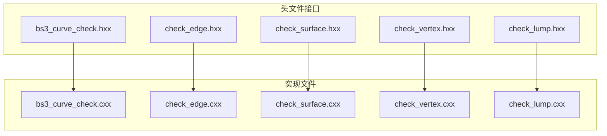
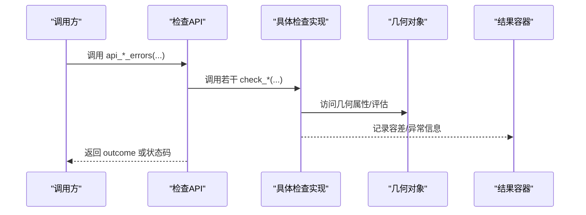
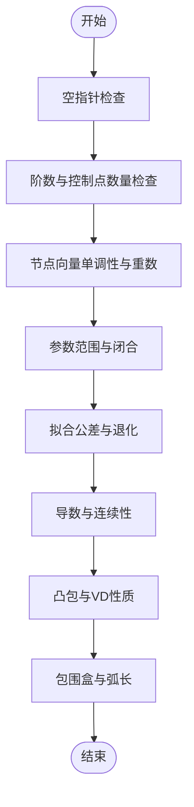
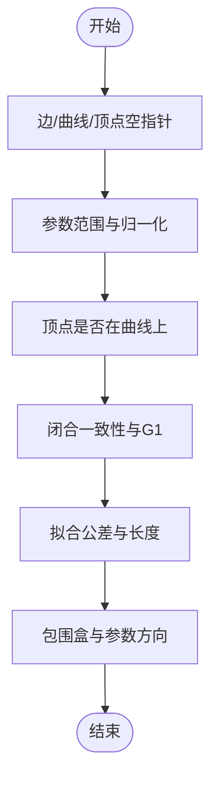
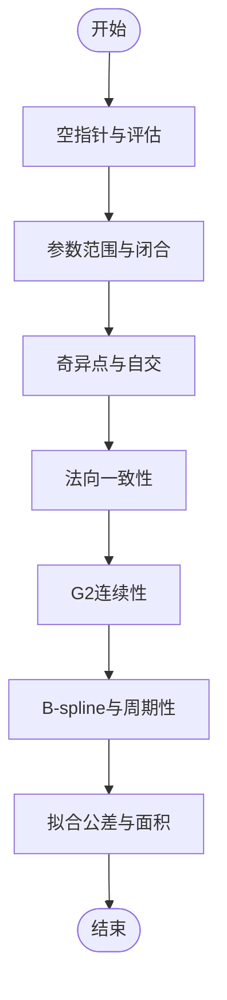
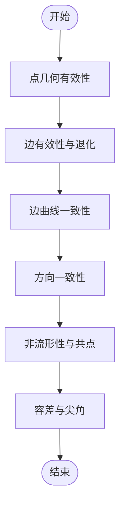
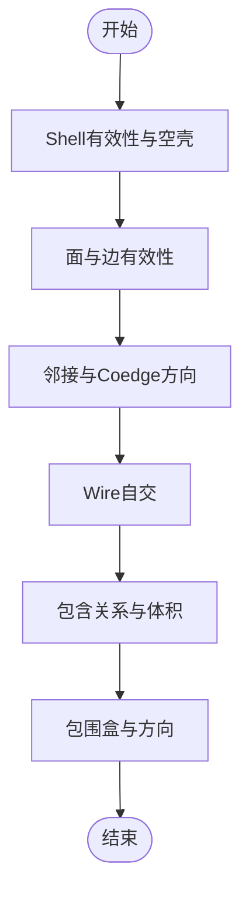
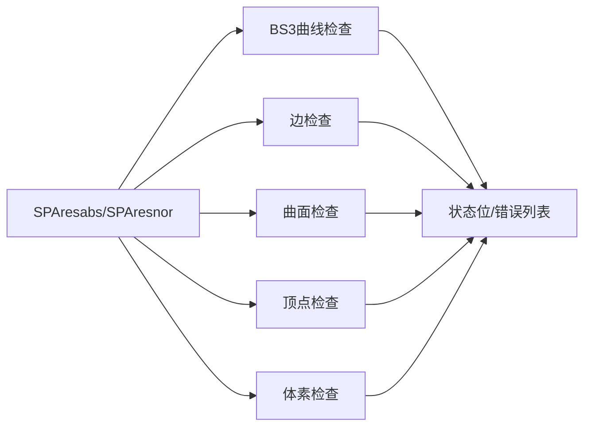

# 容差系统与精度控制

<cite>
**本文引用的文件**
- [bs3_curve_check.hxx](file://include/bs3_curve_check.hxx)
- [check_edge.hxx](file://include/check_edge.hxx)
- [check_surface.hxx](file://include/check_surface.hxx)
- [check_vertex.hxx](file://include/check_vertex.hxx)
- [check_lump.hxx](file://include/check_lump.hxx)
- [bs3_curve_check.cxx](file://src/bs3_curve_check.cxx)
- [check_edge.cxx](file://src/check_edge.cxx)
- [check_surface.cxx](file://src/check_surface.cxx)
- [check_vertex.cxx](file://src/check_vertex.cxx)
- [check_lump.cxx](file://src/check_lump.cxx)
- [TASK_SUMMARY.md](file://TASK_SUMMARY.md)
</cite>

## 目录
1. [引言](#引言)
2. [项目结构](#项目结构)
3. [核心组件](#核心组件)
4. [架构总览](#架构总览)
5. [详细组件分析](#详细组件分析)
6. [依赖关系分析](#依赖关系分析)
7. [性能考量](#性能考量)
8. [故障排查指南](#故障排查指南)
9. [结论](#结论)
10. [附录](#附录)

## 引言
本文件面向使用 ACIS 内核进行几何建模与分析的工程师，系统阐述容差系统与精度控制在几何检查中的应用。内容涵盖：
- 容差概念与数值稳定性控制
- 几何检查中的容差设置、误差传播与收敛判断
- 容差选择原则、性能影响与调试技巧
- 具体容差配置示例、精度测试方法与边界条件处理
- 不同几何操作对容差的要求与最佳实践

## 项目结构
本仓库围绕 ACIS 的几何实体（曲线、边、面、体素、顶点）构建了统一的容差与精度检查框架，采用“头文件声明 + 源文件实现”的分层设计，确保接口稳定、扩展性强。

图表来源
- [bs3_curve_check.hxx:1-138](file://include/bs3_curve_check.hxx#L1-L138)
- [check_edge.hxx:1-130](file://include/check_edge.hxx#L1-L130)
- [check_surface.hxx:1-133](file://include/check_surface.hxx#L1-L133)
- [check_vertex.hxx:1-111](file://include/check_vertex.hxx#L1-L111)
- [check_lump.hxx:1-117](file://include/check_lump.hxx#L1-L117)

章节来源
- [TASK_SUMMARY.md:1-306](file://TASK_SUMMARY.md#L1-L306)

## 核心组件
本节从“容差概念”“精度等级”“数值稳定性控制”三个维度，结合各几何实体的检查接口，系统梳理容差体系。

- 容差概念
  - 拟合公差（fit tolerance）：用于衡量几何近似与实际几何之间的允许偏差，贯穿曲线、边、面、体素等实体的检查。
  - 参数容差（参数域、参数归一化）：用于约束参数范围与方向一致性，避免退化与非物理参数映射。
  - 几何容差（坐标、长度、角度、面积）：用于判定几何对象是否满足数值稳定性要求（如 NaN/Inf、退化、自交、尖角等）。

- 精度等级
  - 通过检查函数返回的状态位组合表达“OK/警告/错误”，并可进一步细分为“低精度（仅基本有效性）”“中精度（含连续性与拓扑）”“高精度（含奇异点与自交）”。

- 数值稳定性控制
  - 使用统一的容差常量（如 SPAresabs、SPAresnor），作为比较阈值，避免浮点误差导致的误判。
  - 在关键路径上进行异常捕获与短路，保证检查流程的鲁棒性与收敛性。

章节来源
- [bs3_curve_check.hxx:9-27](file://include/bs3_curve_check.hxx#L9-L27)
- [check_edge.hxx:9-26](file://include/check_edge.hxx#L9-L26)
- [check_surface.hxx:9-27](file://include/check_surface.hxx#L9-L27)
- [check_vertex.hxx:9-23](file://include/check_vertex.hxx#L9-L23)
- [check_lump.hxx:9-25](file://include/check_lump.hxx#L9-L25)

## 架构总览
下图展示容差系统在几何检查中的总体交互：客户端调用 API，内部按实体类型执行相应检查子函数，最终汇总状态与错误列表。

图表来源
- [bs3_curve_check.cxx:50-150](file://src/bs3_curve_check.cxx#L50-L150)
- [check_edge.cxx:47-142](file://src/check_edge.cxx#L47-L142)
- [check_surface.cxx:49-144](file://src/check_surface.cxx#L49-L144)
- [check_vertex.cxx:59-137](file://src/check_vertex.cxx#L59-L137)
- [check_lump.cxx:58-106](file://src/check_lump.cxx#L58-L106)

## 详细组件分析

### BS3 曲线容差检查
- 关键检查点
  - 空指针与阶数合法性
  - 控制点数量与坐标有效性
  - 节点向量单调性与重数限制
  - 参数范围与闭合一致性
  - 拟合公差与退化判定
  - 导数与凸包、变差缩减性质
  - 包围盒与弧长一致性

- 容差与稳定性要点
  - 使用统一容差常量进行比较（如节点重数不超过阶数、参数范围非退化、导数非零等）。
  - 对异常（NaN/Inf）与异常抛出进行捕获，避免检查中断。

图表来源
- [bs3_curve_check.cxx:152-800](file://src/bs3_curve_check.cxx#L152-L800)

章节来源
- [bs3_curve_check.hxx:29-136](file://include/bs3_curve_check.hxx#L29-L136)
- [bs3_curve_check.cxx:50-150](file://src/bs3_curve_check.cxx#L50-L150)

### 边容差检查
- 关键检查点
  - 边、曲线、端点有效性
  - 参数范围与归一化
  - 顶点是否位于曲线上
  - 闭合一致性与 G1 连续性
  - 拟合公差与长度有效性
  - 包围盒与参数方向一致性

- 容差与稳定性要点
  - 顶点与曲线位置一致性通过容差常量判断；闭合边的切向一致性使用余弦夹角阈值。
  - 对评估异常进行捕获并记录。

图表来源
- [check_edge.cxx:144-800](file://src/check_edge.cxx#L144-L800)

章节来源
- [check_edge.hxx:28-128](file://include/check_edge.hxx#L28-L128)
- [check_edge.cxx:47-142](file://src/check_edge.cxx#L47-L142)

### 曲面容差检查
- 关键检查点
  - 空指针与评估有效性
  - 参数范围与闭合连续性
  - 奇异点与自交检测
  - 法向一致性与 G2 连续性
  - B-spline 控制网格与周期性
  - 拟合公差与面积退化

- 容差与稳定性要点
  - 使用参数网格采样评估曲面，结合导数叉积与夹角判断奇异点与连续性。
  - 对异常抛出与 NaN/Inf 进行捕获与标记。

图表来源
- [check_surface.cxx:146-800](file://src/check_surface.cxx#L146-L800)

章节来源
- [check_surface.hxx:29-131](file://include/check_surface.hxx#L29-L131)
- [check_surface.cxx:49-144](file://src/check_surface.cxx#L49-L144)

### 顶点容差检查
- 关键检查点
  - 点几何有效性与包围盒
  - 关联边的有效性与退化
  - 边曲线一致性与方向一致性
  - 非流形性与共点顶点
  - 容差与尖角检测

- 容差与稳定性要点
  - 顶点容差必须非负且有限；边退化通过长度阈值判断。
  - 非流形性通过边/面计数奇偶性辅助判断。

图表来源
- [check_vertex.cxx:139-714](file://src/check_vertex.cxx#L139-L714)

章节来源
- [check_vertex.hxx:25-109](file://include/check_vertex.hxx#L25-L109)
- [check_vertex.cxx:59-137](file://src/check_vertex.cxx#L59-L137)

### 体素（LUMP）容差检查
- 关键检查点
  - Shell 有效性与空壳
  - 面与边的有效性与邻接
  - Wire 自交检测
  - 包含关系与体积
  - 包围盒与方向一致性

- 容差与稳定性要点
  - 多 Shell 的包含关系通过点在壳内的包含关系一致性判断。
  - 自交检测使用边间相交求解器，排除端点相交情形。

图表来源
- [check_lump.cxx:108-766](file://src/check_lump.cxx#L108-L766)

章节来源
- [check_lump.hxx:27-115](file://include/check_lump.hxx#L27-L115)
- [check_lump.cxx:58-106](file://src/check_lump.cxx#L58-L106)

## 依赖关系分析
- 统一容差常量
  - SPAresabs：绝对容差阈值，用于判断退化、长度、距离等。
  - SPAresnor：相对容差阈值，用于角度、余弦夹角等。

- 检查结果聚合
  - 各模块均提供“快速检测（状态位）”与“详细诊断（结果对象+错误列表）”两种模式，便于不同场景下的性能与可观测性平衡。

图表来源
- [bs3_curve_check.cxx:268-292](file://src/bs3_curve_check.cxx#L268-L292)
- [check_edge.cxx:310-341](file://src/check_edge.cxx#L310-L341)
- [check_surface.cxx:186-215](file://src/check_surface.cxx#L186-L215)
- [check_vertex.cxx:525-548](file://src/check_vertex.cxx#L525-L548)
- [check_lump.cxx:218-229](file://src/check_lump.cxx#L218-L229)

章节来源
- [TASK_SUMMARY.md:282-293](file://TASK_SUMMARY.md#L282-L293)

## 性能考量
- 采样策略
  - 曲线/边：固定采样点数（如 15~20），兼顾精度与速度。
  - 曲面：参数网格采样（如 10×10），在保证覆盖率的同时控制开销。
  - 体素：多 Shell 遍历与自交检测成本较高，建议在必要时启用。

- 异常短路
  - 对空指针、NaN/Inf、异常抛出进行早期返回，减少无效计算。
  - 闭合与连续性检查在非闭合或非必要时跳过，降低复杂度。

- 结果聚合
  - 快速检测仅返回状态位，适合批量校验；详细诊断包含错误列表，适合定位问题。

[本节为通用指导，无需特定文件引用]

## 故障排查指南
- 常见错误类型与定位
  - 拟合公差异常：检查实体的 fit_tolerance 是否合理（非负、不过大）。
  - 参数域异常：检查参数范围是否退化或包含 NaN/Inf。
  - 退化与自交：关注退化边/面、奇异点与 Wire 自交。
  - 方向与邻接：Coedge 方向一致性、自由边、非流形边/顶点。

- 调试技巧
  - 使用详细诊断模式（结果对象）获取完整错误列表，逐条分析。
  - 在关键采样点附近增加局部细化，观察误差传播路径。
  - 对闭合与连续性检查，优先验证端点与切向一致性。

章节来源
- [bs3_curve_check.hxx:9-27](file://include/bs3_curve_check.hxx#L9-L27)
- [check_edge.hxx:9-26](file://include/check_edge.hxx#L9-L26)
- [check_surface.hxx:9-27](file://include/check_surface.hxx#L9-L27)
- [check_vertex.hxx:9-23](file://include/check_vertex.hxx#L9-L23)
- [check_lump.hxx:9-25](file://include/check_lump.hxx#L9-L25)

## 结论
本容差系统通过统一的容差常量与检查流程，实现了对曲线、边、面、体素、顶点的全维度容差与精度控制。其设计兼顾性能与可观测性，既支持快速批量校验，也支持深入的问题定位。在工程实践中，应根据几何复杂度与业务需求选择合适的检查强度，并结合容差选择原则与调试技巧，持续优化模型质量与稳定性。

[本节为总结性内容，无需特定文件引用]

## 附录

### 容差选择原则
- 拟合公差
  - 初始值：依据模型尺度与加工精度设定；过大导致几何失真，过小导致数值不稳定。
  - 上限：参考 SPAresabs 的若干倍，避免异常放大。
- 参数容差
  - 参数范围：确保非退化；端点与切向一致性需满足连续性要求。
- 几何容差
  - NaN/Inf：严格禁止；出现时回溯上游数据来源。
  - 退化：长度/面积/导数阈值需与模型尺度匹配。

### 性能影响分析
- 采样密度与检查强度成正比；建议在模型预处理阶段降低强度，在关键验证阶段提高强度。
- 并行化：对独立实体的检查可并行执行，但需注意共享资源访问。

### 调试技巧
- 分层检查：先快速检测定位高风险实体，再对可疑实体启用详细诊断。
- 局部细化：在边界与奇异区域增加采样密度，观察误差传播。
- 日志与可视化：输出关键采样点与误差指标，结合几何可视化辅助定位。

### 容差配置示例（步骤）
- 设置拟合公差：在实体创建或编辑后，统一设置 fit_tolerance，确保非负且合理。
- 参数归一化：检查参数起止顺序与方向一致性，避免非闭合情况下的异常。
- 连续性验证：对闭合边/面，验证端点位置与切向一致性；对曲面，验证 G1/G2 连续性。
- 自交与奇异：启用曲面自交与奇异点检测，必要时进行局部重构。

### 精度测试方法
- 采样覆盖率测试：对比不同采样密度下的检查结果，评估收敛性。
- 边界条件测试：极端参数、退化几何、尖角与共点顶点等。
- 误差传播测试：对关键路径（如闭合一致性、G1/G2 连续性）进行扰动测试，观察误差传播与收敛。

### 不同几何操作的容差要求
- 曲线拟合：控制点与节点向量需满足最小阶数与非递减条件；拟合公差与退化判定需严格。
- 边连接：端点与曲线一致性、Coedge 方向一致性、长度与参数归一化。
- 曲面拼接：G0/G1/G2 连续性、法向一致性、周期性与自交检测。
- 体素装配：Shell 包含关系一致性、邻接完整性、非流形性与包围盒有效性。

[本节为通用指导，无需特定文件引用]