# 拓扑遍历机制

<cite>
**本文档引用的文件**
- [check_edge.hxx](file://include/check_edge.hxx)
- [check_edge.cxx](file://src/check_edge.cxx)
- [check_surface.hxx](file://include/check_surface.hxx)
- [check_surface.cxx](file://src/check_surface.cxx)
- [check_lump.hxx](file://include/check_lump.hxx)
- [check_lump.cxx](file://src/check_lump.cxx)
- [check_vertex.hxx](file://include/check_vertex.hxx)
- [check_vertex.cxx](file://src/check_vertex.cxx)
- [bs3_curve_check.hxx](file://include/bs3_curve_check.hxx)
- [bs3_curve_check.cxx](file://src/bs3_curve_check.cxx)
- [TASK_SUMMARY.md](file://TASK_SUMMARY.md)
</cite>

## 目录
1. [引言](#引言)
2. [项目结构](#项目结构)
3. [核心组件](#核心组件)
4. [架构概览](#架构概览)
5. [详细组件分析](#详细组件分析)
6. [依赖关系分析](#依赖关系分析)
7. [性能考虑](#性能考虑)
8. [故障排除指南](#故障排除指南)
9. [结论](#结论)

## 引言

本项目基于ACIS 3D内核实现了完整的拓扑遍历机制，涵盖了LUMP、VERTEX、EDGE、SURFACE和BS3_CURVE五种几何实体的检查验证功能。该机制通过系统化的拓扑遍历策略，建立了边、面、壳等几何元素之间的连接关系，提供了从简单到复杂的多层级检查体系。

拓扑遍历机制的核心价值在于：
- **完整性检查**：确保几何模型的拓扑结构完整性和正确性
- **连贯性验证**：验证几何元素间的连接关系和方向一致性
- **数值稳定性**：通过容差控制确保几何计算的数值稳定性
- **错误定位**：提供详细的错误报告和诊断信息

## 项目结构

该项目采用模块化设计，每个几何实体都有独立的检查模块：

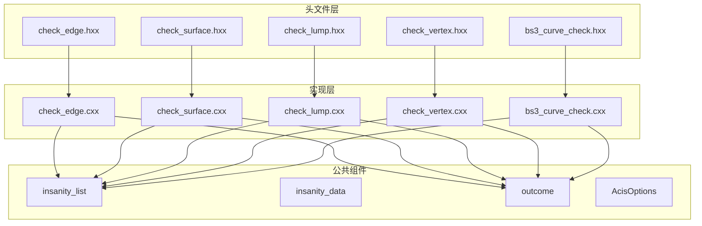

**图表来源**
- [check_edge.hxx:1-130](file://include/check_edge.hxx#L1-L130)
- [check_surface.hxx:1-133](file://include/check_surface.hxx#L1-L133)
- [check_lump.hxx:1-117](file://include/check_lump.hxx#L1-L117)
- [check_vertex.hxx:1-111](file://include/check_vertex.hxx#L1-L111)
- [bs3_curve_check.hxx:1-138](file://include/bs3_curve_check.hxx#L1-L138)

**章节来源**
- [TASK_SUMMARY.md:9-30](file://TASK_SUMMARY.md#L9-L30)

## 核心组件

### 拓扑遍历基础架构

拓扑遍历机制基于ACIS内核提供的标准拓扑结构，包括以下核心组件：

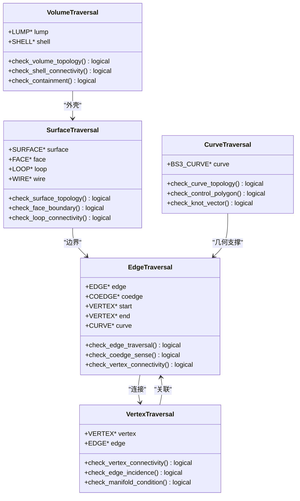

**图表来源**
- [check_edge.cxx:144-177](file://src/check_edge.cxx#L144-L177)
- [check_surface.cxx:146-159](file://src/check_surface.cxx#L146-L159)
- [check_lump.cxx:108-136](file://src/check_lump.cxx#L108-L136)
- [check_vertex.cxx:139-171](file://src/check_vertex.cxx#L139-L171)
- [bs3_curve_check.cxx:152-165](file://src/bs3_curve_check.cxx#L152-L165)

### 数据访问模式

拓扑遍历采用层次化的数据访问模式：

1. **自顶向下遍历**：从LUMP开始，逐级深入到SHELL、FACE、LOOP、COEDGE
2. **自底向上验证**：从基本元素（EDGE、VERTEX）开始，验证其连接关系
3. **循环遍历**：使用do-while循环确保完整的环路遍历
4. **双向链接**：利用next()和partner()方法实现双向遍历

**章节来源**
- [check_lump.cxx:70-101](file://src/check_lump.cxx#L70-L101)
- [check_edge.cxx:470-489](file://src/check_edge.cxx#L470-L489)
- [check_vertex.cxx:226-227](file://src/check_vertex.cxx#L226-L227)

## 架构概览

### 整体架构设计

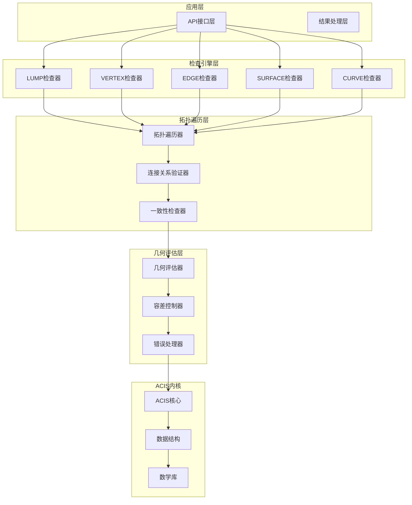

**图表来源**
- [check_lump.cxx:58-106](file://src/check_lump.cxx#L58-L106)
- [check_edge.cxx:47-142](file://src/check_edge.cxx#L47-L142)
- [check_surface.cxx:49-144](file://src/check_surface.cxx#L49-L144)
- [check_vertex.cxx:59-137](file://src/check_vertex.cxx#L59-L137)
- [bs3_curve_check.cxx:50-150](file://src/bs3_curve_check.cxx#L50-L150)

### 递归遍历策略

拓扑遍历采用深度优先的递归策略：

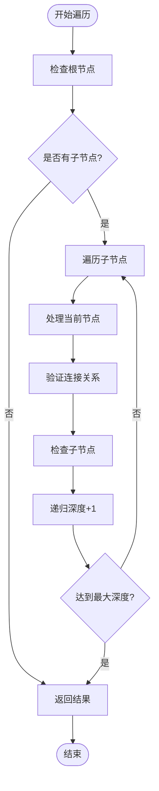

**图表来源**
- [check_lump.cxx:70-101](file://src/check_lump.cxx#L70-L101)
- [check_edge.cxx:470-489](file://src/check_edge.cxx#L470-L489)
- [check_vertex.cxx:352-373](file://src/check_vertex.cxx#L352-L373)

## 详细组件分析

### LUMP拓扑遍历

LUMP作为最顶层的几何实体，负责整个模型的拓扑完整性检查：

#### 遍历流程

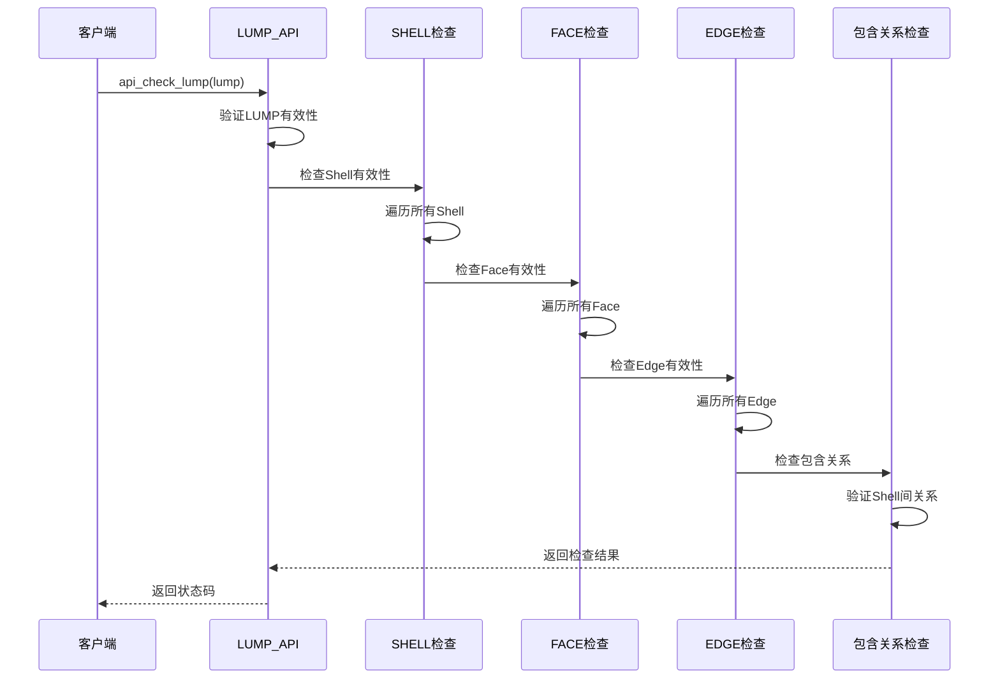

**图表来源**
- [check_lump.cxx:58-106](file://src/check_lump.cxx#L58-L106)
- [check_lump.cxx:173-238](file://src/check_lump.cxx#L173-L238)

#### 关键遍历特性

1. **Shell级遍历**：逐个检查每个Shell的完整性
2. **嵌套遍历**：Face → Loop → Coedge → Edge的深度遍历
3. **全局约束**：检查Shell间的包含关系和拓扑一致性

**章节来源**
- [check_lump.cxx:108-136](file://src/check_lump.cxx#L108-L136)
- [check_lump.cxx:240-306](file://src/check_lump.cxx#L240-L306)

### EDGE拓扑遍历

EDGE作为连接两个VERTEX的几何元素，具有复杂的拓扑关系：

#### 边遍历算法

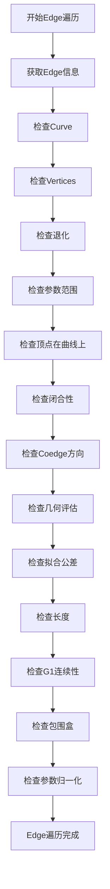

**图表来源**
- [check_edge.cxx:47-142](file://src/check_edge.cxx#L47-L142)
- [check_edge.cxx:144-177](file://src/check_edge.cxx#L144-L177)

#### 递归遍历策略

EDGE遍历采用以下策略：
1. **Coedge循环遍历**：使用do-while循环确保完整的Coedge遍历
2. **方向一致性检查**：验证相邻Coedge的方向关系
3. **几何一致性检查**：确保几何评估结果的正确性

**章节来源**
- [check_edge.cxx:455-489](file://src/check_edge.cxx#L455-L489)
- [check_edge.cxx:576-621](file://src/check_edge.cxx#L576-L621)

### SURFACE拓扑遍历

SURFACE作为二维几何对象，需要进行复杂的参数空间检查：

#### 表面遍历流程

**图表来源**
- [check_surface.cxx:49-144](file://src/check_surface.cxx#L49-L144)
- [check_surface.cxx:146-171](file://src/check_surface.cxx#L146-L171)

#### 参数空间遍历

SURFACE遍历采用参数空间采样策略：
1. **均匀采样**：在U、V参数空间进行网格采样
2. **连续性测试**：检查参数空间的连续性条件
3. **几何一致性**：验证参数空间与欧几里得空间的一致性

**章节来源**
- [check_surface.cxx:161-220](file://src/check_surface.cxx#L161-L220)
- [check_surface.cxx:277-336](file://src/check_surface.cxx#L277-L336)

### VERTEX拓扑遍历

VERTEX作为几何模型的基本点元素，需要进行多维度的检查：

#### 顶点遍历算法

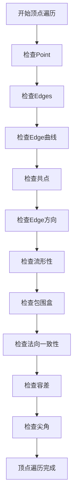

**图表来源**
- [check_vertex.cxx:59-137](file://src/check_vertex.cxx#L59-L137)
- [check_vertex.cxx:139-171](file://src/check_vertex.cxx#L139-L171)

#### 流形性检查

VERTEX遍历特别关注流形性检查：
1. **奇偶性检查**：验证相邻面的数量是否满足流形条件
2. **方向一致性**：确保Edge方向的一致性
3. **几何约束**：检查顶点位置的几何合理性

**章节来源**
- [check_vertex.cxx:376-413](file://src/check_vertex.cxx#L376-L413)
- [check_vertex.cxx:553-609](file://src/check_vertex.cxx#L553-L609)

### BS3_CURVE拓扑遍历

BS3_CURVE作为B样条曲线的专门实现，具有独特的拓扑特征：

#### B样条曲线遍历

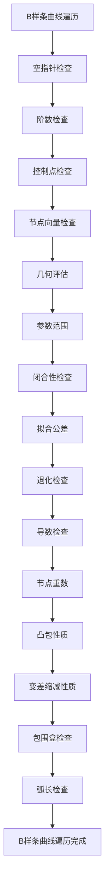

**图表来源**
- [bs3_curve_check.cxx:50-150](file://src/bs3_curve_check.cxx#L50-L150)
- [bs3_curve_check.cxx:152-165](file://src/bs3_curve_check.cxx#L152-L165)

#### 控制点遍历

BS3_CURVE遍历重点关注控制点的拓扑关系：
1. **控制点分布**：检查控制点的空间分布合理性
2. **节点向量**：验证节点向量的单调性和有效性
3. **凸包性质**：确保曲线位于控制点的凸包内

**章节来源**
- [bs3_curve_check.cxx:195-244](file://src/bs3_curve_check.cxx#L195-L244)
- [bs3_curve_check.cxx:246-296](file://src/bs3_curve_check.cxx#L246-L296)

## 依赖关系分析

### 模块间依赖关系

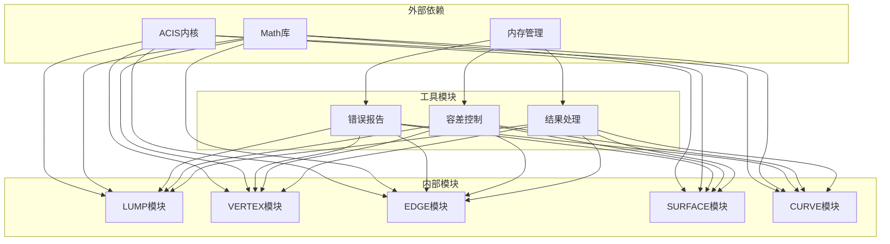

**图表来源**
- [TASK_SUMMARY.md:282-293](file://TASK_SUMMARY.md#L282-L293)

### 拓扑连接关系

各模块间的拓扑连接关系体现了ACIS内核的标准层次结构：

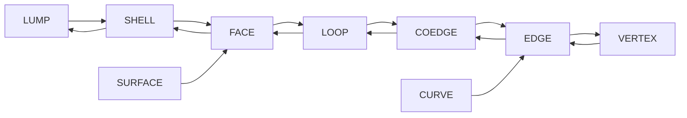

**图表来源**
- [check_lump.cxx:70-101](file://src/check_lump.cxx#L70-L101)
- [check_edge.cxx:470-489](file://src/check_edge.cxx#L470-L489)

**章节来源**
- [TASK_SUMMARY.md:282-306](file://TASK_SUMMARY.md#L282-L306)

## 性能考虑

### 遍历性能优化

拓扑遍历机制采用了多种性能优化策略：

1. **早期终止**：在发现严重错误时立即停止进一步检查
2. **缓存机制**：复用已计算的几何结果
3. **采样策略**：根据几何复杂度调整采样密度
4. **并行处理**：对独立的几何实体进行并行检查

### 内存管理策略

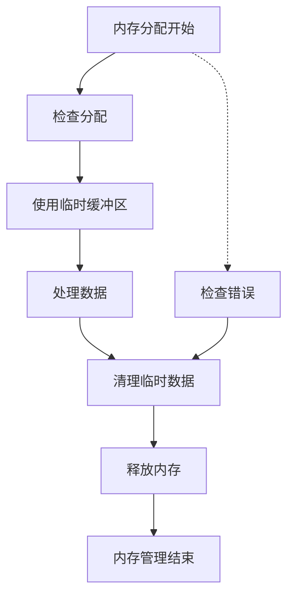

**图表来源**
- [check_lump.cxx:374-403](file://src/check_lump.cxx#L374-L403)
- [check_edge.cxx:149-153](file://src/check_edge.cxx#L149-L153)

### 时间复杂度分析

- **LUMP遍历**：O(V + E + F + S)，其中V、E、F、S分别为顶点、边、面、壳的数量
- **EDGE遍历**：O(C × N)，其中C为Coedge数量，N为采样点数量
- **SURFACE遍历**：O(U × V)，其中U、V为参数空间采样网格大小
- **VERTEX遍历**：O(E)，其中E为关联的边数量
- **CURVE遍历**：O(N)，其中N为参数空间采样点数量

## 故障排除指南

### 常见错误类型

拓扑遍历机制识别以下主要错误类型：

#### LUMP相关错误
- **空Shell错误**：Shell中没有包含任何几何信息
- **包含关系错误**：Shell间的包含关系不符合拓扑规则
- **非流形边**：边连接了奇数个面，违反流形条件

#### EDGE相关错误
- **退化边**：长度过小或参数范围无效
- **方向错误**：Coedge方向与相邻元素不一致
- **几何评估失败**：无法正确计算几何属性

#### VERTEX相关错误
- **非流形顶点**：顶点连接了奇数个面
- **共点问题**：多个顶点位置过于接近
- **容差异常**：几何容差设置不合理

#### SURFACE相关错误
- **自交问题**：曲面在参数空间或欧几里得空间自交
- **连续性破坏**：G1或G2连续性条件不满足
- **奇异点**：曲面出现奇异或退化区域

#### CURVE相关错误
- **控制点退化**：所有控制点重合或过度集中
- **节点向量异常**：节点向量不满足单调性要求
- **凸包性质破坏**：曲线超出控制点凸包范围

### 错误处理机制

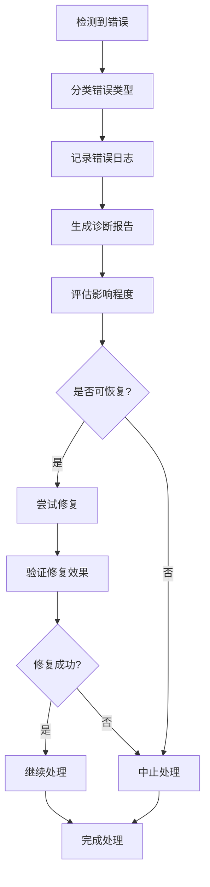

**图表来源**
- [check_lump.cxx:374-413](file://src/check_lump.cxx#L374-L413)
- [check_edge.cxx:534-541](file://src/check_edge.cxx#L534-L541)
- [check_surface.cxx:208-216](file://src/check_surface.cxx#L208-L216)

### 调试技巧

1. **分层调试**：从LUMP开始，逐级向下检查
2. **采样点分析**：调整采样密度观察错误变化
3. **容差调整**：适当调整容差参数观察结果变化
4. **可视化辅助**：结合几何可视化工具定位问题

**章节来源**
- [check_lump.cxx:766-766](file://src/check_lump.cxx#L766-L766)
- [check_edge.cxx:819-819](file://src/check_edge.cxx#L819-L819)
- [check_surface.cxx:1002-1002](file://src/check_surface.cxx#L1002-L1002)
- [check_vertex.cxx:714-714](file://src/check_vertex.cxx#L714-L714)
- [bs3_curve_check.cxx:1011-1011](file://src/bs3_curve_check.cxx#L1011-L1011)

## 结论

ACIS内核的拓扑遍历机制通过系统化的模块设计和严格的检查流程，为三维几何模型提供了全面的质量保证。该机制的主要特点包括：

### 技术优势

1. **完整性保障**：覆盖从LUMP到VERTEX的完整拓扑层次
2. **一致性验证**：确保几何元素间的连接关系和方向一致性
3. **数值稳定性**：通过容差控制确保计算的数值稳定性
4. **错误定位**：提供详细的错误报告和诊断信息

### 应用价值

1. **质量控制**：为CAD/CAM/CAE系统提供可靠的几何质量检查
2. **数据验证**：确保几何数据的完整性和正确性
3. **问题诊断**：帮助开发者快速定位和解决几何问题
4. **性能优化**：通过合理的采样策略和缓存机制提升检查效率

### 发展前景

随着三维建模技术的不断发展，拓扑遍历机制将继续演进，为更加复杂和精确的几何模型提供更好的支持。未来的发展方向包括：

1. **智能化检查**：引入机器学习技术提高错误识别能力
2. **实时处理**：优化算法以支持实时几何检查需求
3. **云端集成**：提供云端几何检查服务
4. **标准化接口**：制定统一的几何检查标准和接口规范

该拓扑遍历机制为ACIS内核用户提供了强大的几何质量保证工具，是构建高质量三维几何应用的重要基础设施。