# B-spline曲线数学理论基础

<cite>
**本文档引用的文件**
- [bs3_curve_check.hxx](file://include/bs3_curve_check.hxx)
- [bs3_curve_check.cxx](file://src/bs3_curve_check.cxx)
</cite>

## 目录
1. [引言](#引言)
2. [项目结构](#项目结构)
3. [核心组件](#核心组件)
4. [架构概览](#架构概览)
5. [详细组件分析](#详细组件分析)
6. [依赖关系分析](#依赖关系分析)
7. [性能考虑](#性能考虑)
8. [故障排除指南](#故障排除指南)
9. [结论](#结论)

## 引言

本文档为BS3_CURVE检查模块创建了B-spline曲线的数学理论基础文档。该模块实现了对B-spline曲线进行全面的质量检查，包括数学理论验证和实际数值计算验证。通过深入分析代码实现，我们可以更好地理解B-spline曲线的数学特性及其在工程应用中的重要性。

B-spline曲线是计算机辅助设计(CAD)和计算机图形学中最重要的参数曲线表示方法之一。它具有良好的几何连续性、局部控制性和凸包性质等优秀特性，使其成为工业设计和工程建模的理想选择。

## 项目结构

BS3_CURVE检查模块采用清晰的分层架构，主要包含以下组件：

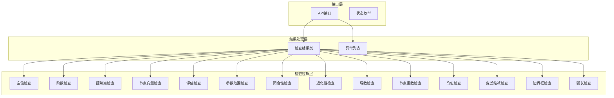

**图表来源**
- [bs3_curve_check.hxx:51-135](file://include/bs3_curve_check.hxx#L51-L135)
- [bs3_curve_check.cxx:50-150](file://src/bs3_curve_check.cxx#L50-L150)

**章节来源**
- [bs3_curve_check.hxx:1-138](file://include/bs3_curve_check.hxx#L1-L138)
- [bs3_curve_check.cxx:1-1011](file://src/bs3_curve_check.cxx#L1-L1011)

## 核心组件

### 状态枚举系统

模块使用完整的状态枚举系统来标识不同的检查结果类型：

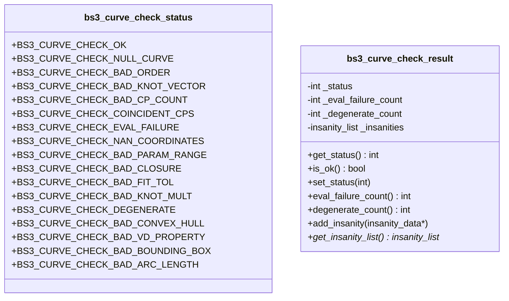

**图表来源**
- [bs3_curve_check.hxx:9-49](file://include/bs3_curve_check.hxx#L9-L49)

### 主要检查函数

模块提供了15个专门的检查函数，每个都针对B-spline曲线的一个特定数学属性：

**章节来源**
- [bs3_curve_check.hxx:57-130](file://include/bs3_curve_check.hxx#L57-L130)
- [bs3_curve_check.cxx:152-1010](file://src/bs3_curve_check.cxx#L152-L1010)

## 架构概览

### 检查流程架构

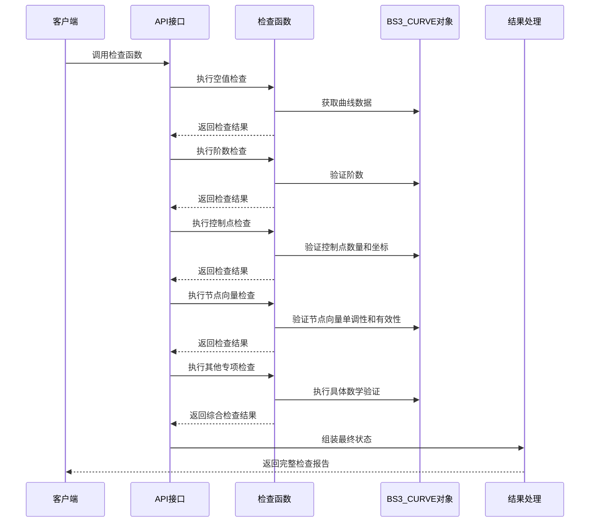

**图表来源**
- [bs3_curve_check.cxx:50-150](file://src/bs3_curve_check.cxx#L50-L150)
- [bs3_curve_check.cxx:876-1010](file://src/bs3_curve_check.cxx#L876-L1010)

### 数学理论验证流程

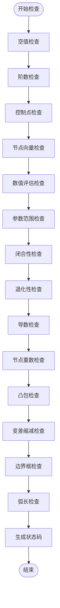

**图表来源**
- [bs3_curve_check.cxx:50-150](file://src/bs3_curve_check.cxx#L50-L150)
- [bs3_curve_check.cxx:876-1010](file://src/bs3_curve_check.cxx#L876-L1010)

## 详细组件分析

### B-spline曲线数学定义

根据代码实现，B-spline曲线的数学定义体现在以下几个关键方面：

#### 基础数学概念

B-spline曲线的数学表达式为：
```
C(t) = Σ[i=0 to n-1] N_{i,p}(t) * P_i
```

其中：
- C(t) 是曲线上的点
- N_{i,p}(t) 是第i个p次B样条基函数
- P_i 是第i个控制点
- n 是控制点总数

#### 控制点的作用

控制点在B-spline曲线中起着至关重要的作用：

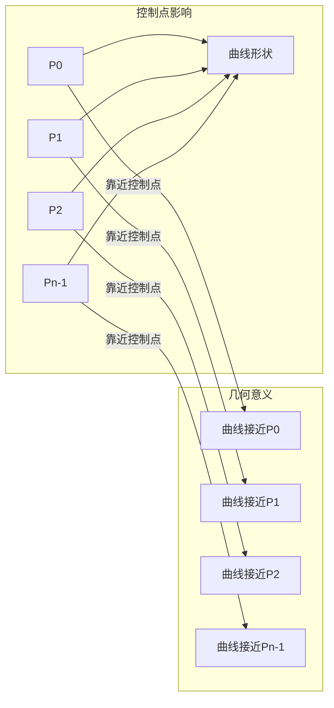

**图表来源**
- [bs3_curve_check.cxx:195-244](file://src/bs3_curve_check.cxx#L195-L244)

#### 节点向量的意义

节点向量决定了基函数的支撑区间和曲线的几何连续性：

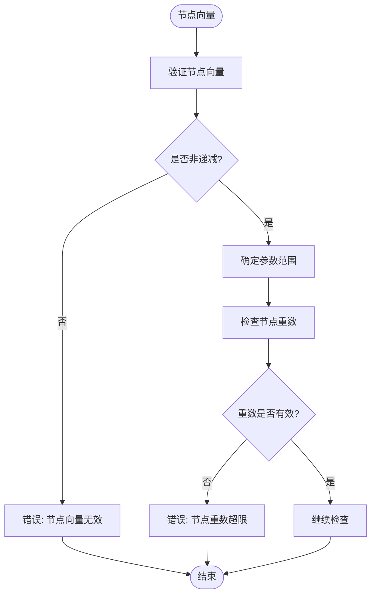

**图表来源**
- [bs3_curve_check.cxx:246-296](file://src/bs3_curve_check.cxx#L246-L296)

### 几何连续性级别

B-spline曲线的几何连续性由节点重数决定：

| 节点重数 | 参数连续性 | 几何连续性 |
|---------|-----------|-----------|
| r | C^{k-p} | G^{k-p} |
| k | C^{k-1} | G^{k-1} |
| p | C^0 | G^0 |

其中k是节点的重数，p是曲线的次数。

### 数学特性验证

#### 凸包性质

凸包性质是B-spline曲线的重要几何特性：

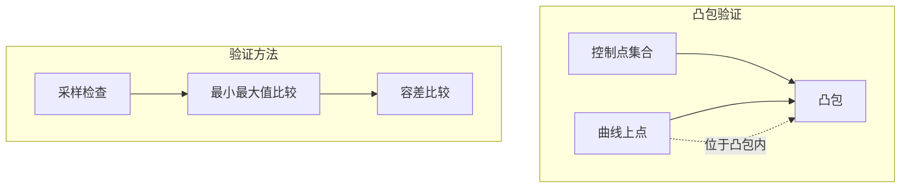

**图表来源**
- [bs3_curve_check.cxx:651-723](file://src/bs3_curve_check.cxx#L651-L723)

#### 变差缩减性质

变差缩减性质描述了曲线与任意直线相交的性质：

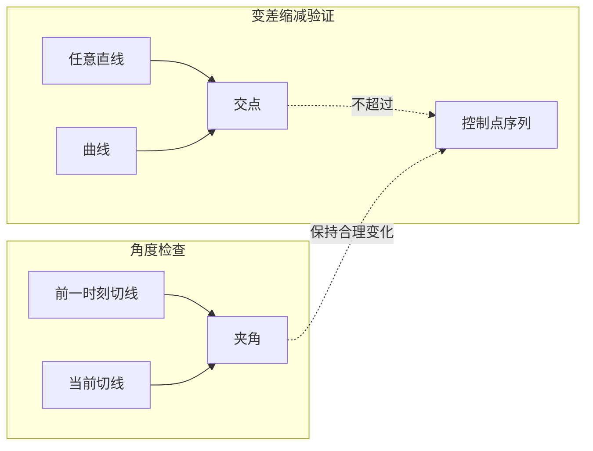

**图表来源**
- [bs3_curve_check.cxx:725-781](file://src/bs3_curve_check.cxx#L725-L781)

### 关键检查算法

#### 节点重数检查算法

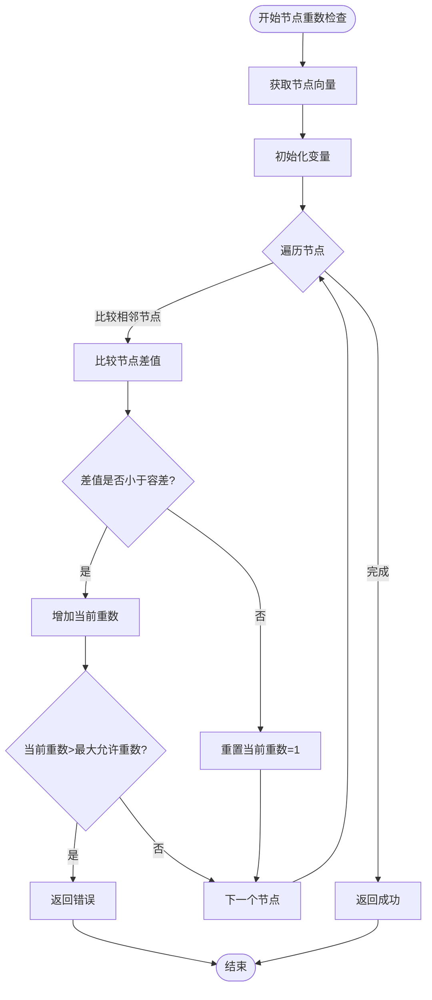

**图表来源**
- [bs3_curve_check.cxx:611-649](file://src/bs3_curve_check.cxx#L611-L649)

#### 凸包检查算法

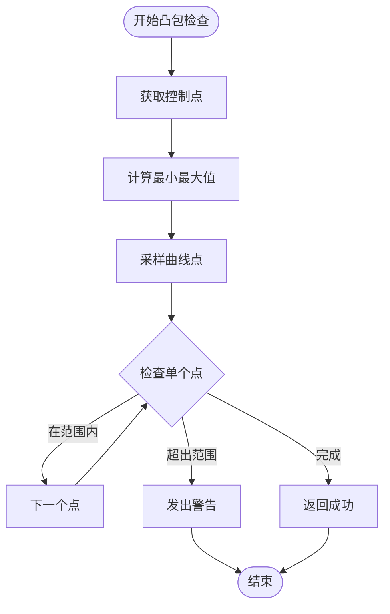

**图表来源**
- [bs3_curve_check.cxx:651-723](file://src/bs3_curve_check.cxx#L651-L723)

**章节来源**
- [bs3_curve_check.cxx:152-1010](file://src/bs3_curve_check.cxx#L152-L1010)

## 依赖关系分析

### 外部依赖关系

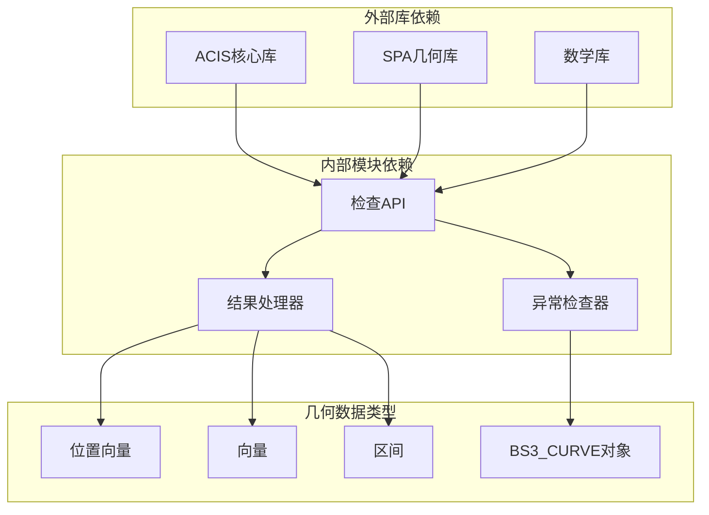

**图表来源**
- [bs3_curve_check.hxx:4-8](file://include/bs3_curve_check.hxx#L4-L8)

### 内部模块耦合

模块内部采用了松耦合的设计模式，每个检查函数都是独立的功能单元：

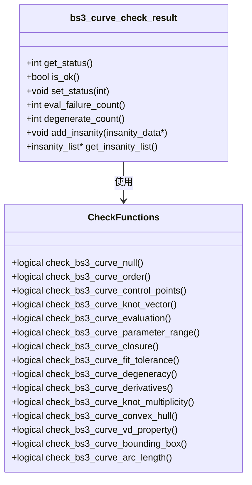

**图表来源**
- [bs3_curve_check.hxx:29-135](file://include/bs3_curve_check.hxx#L29-L135)

**章节来源**
- [bs3_curve_check.hxx:1-138](file://include/bs3_curve_check.hxx#L1-L138)

## 性能考虑

### 时间复杂度分析

| 检查类型 | 时间复杂度 | 空间复杂度 | 说明 |
|---------|-----------|-----------|------|
| 空值检查 | O(1) | O(1) | 直接指针检查 |
| 阶数检查 | O(1) | O(1) | 单次数值比较 |
| 控制点检查 | O(n) | O(1) | n为控制点数量 |
| 节点向量检查 | O(m) | O(1) | m为节点数量 |
| 评估检查 | O(s) | O(1) | s为采样点数量 |
| 凸包检查 | O(n+s) | O(1) | n为控制点，s为采样点 |
| 变差缩减检查 | O(s) | O(1) | s为采样点数量 |

### 内存使用优化

模块采用了多种内存优化策略：

1. **延迟计算**: 只在需要时进行数值计算
2. **就地验证**: 在检查过程中直接验证数据，避免额外存储
3. **采样策略**: 使用合理的采样密度平衡精度和性能
4. **异常处理**: 通过异常机制避免无效计算

## 故障排除指南

### 常见问题诊断

#### 数值稳定性问题

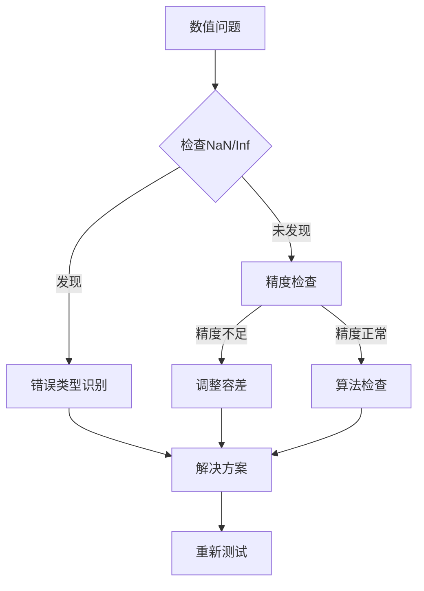

#### 几何一致性问题

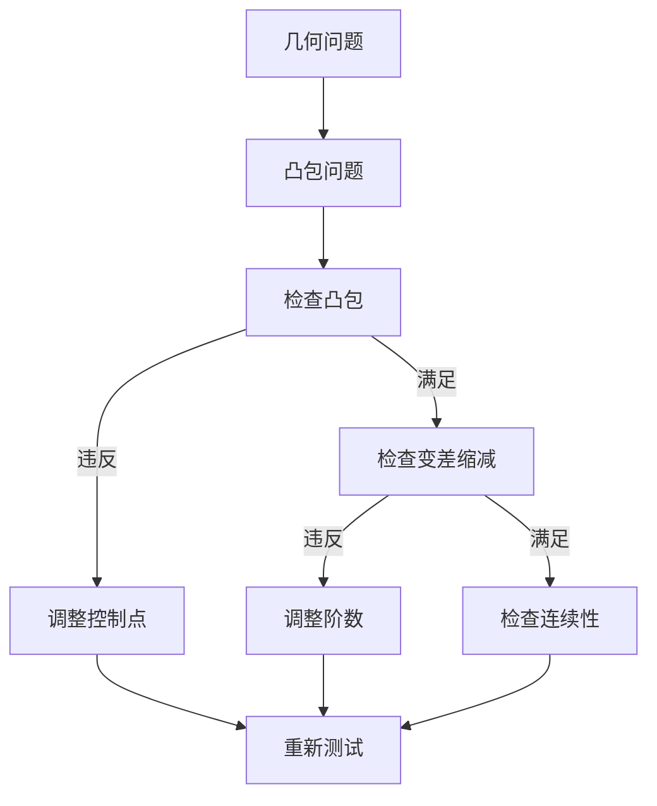

### 调试建议

1. **启用详细日志**: 使用异常列表记录详细的错误信息
2. **逐步验证**: 从基本检查开始，逐步进行高级检查
3. **可视化验证**: 将检查结果与实际几何图形对比
4. **边界条件测试**: 特别关注退化情况和极限情况

**章节来源**
- [bs3_curve_check.cxx:152-1010](file://src/bs3_curve_check.cxx#L152-L1010)

## 结论

BS3_CURVE检查模块为B-spline曲线提供了全面的数学理论验证框架。通过深入分析代码实现，我们可以看到该模块不仅实现了标准的B-spline曲线检查功能，还特别注重数学理论的正确性和数值计算的稳定性。

该模块的主要贡献包括：

1. **完整的数学理论覆盖**: 涵盖了B-spline曲线的所有重要数学特性
2. **严格的数值验证**: 通过多层检查确保数值计算的准确性
3. **实用的工程应用**: 针对实际CAD/CAM应用进行了优化
4. **可扩展的架构设计**: 为未来功能扩展提供了良好的基础

对于理解B-spline曲线的数学理论基础，该模块提供了一个优秀的实践案例，展示了如何将抽象的数学概念转化为可靠的软件实现。这对于从事计算机图形学、CAD系统开发和几何建模的研究人员和工程师都具有重要的参考价值。