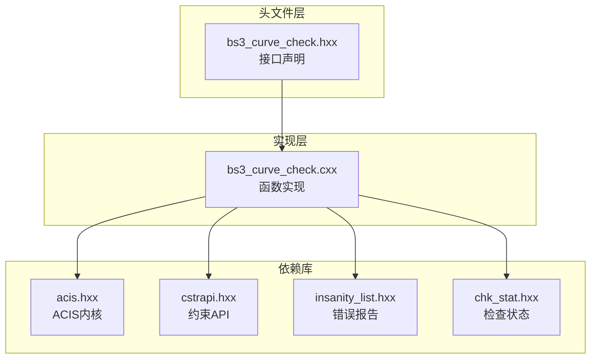
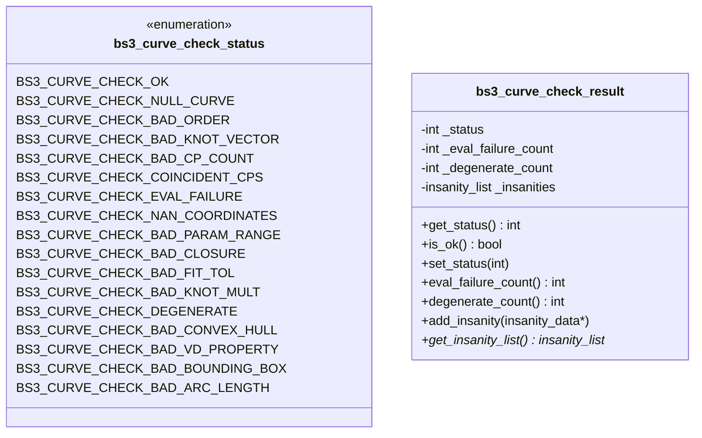
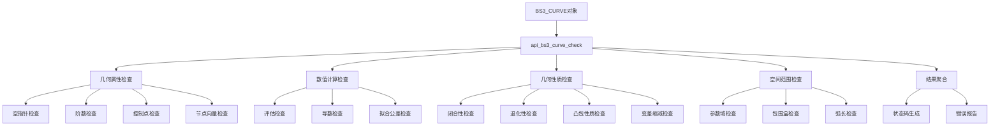
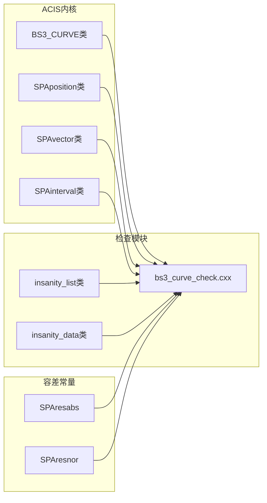

# B-spline曲线验证函数详解

<cite>
**本文档引用的文件**
- [bs3_curve_check.hxx](file://include/bs3_curve_check.hxx)
- [bs3_curve_check.cxx](file://src/bs3_curve_check.cxx)
- [TASK_SUMMARY.md](file://TASK_SUMMARY.md)
</cite>

## 更新摘要
**变更内容**
- 更新了坐标计算精确性的说明，强调使用SPAresabs和SPAresnor容差常量
- 增强了边界框计算中最小最大值检测的精度描述
- 完善了数值计算检查部分的容差处理说明

## 目录
1. [简介](#简介)
2. [项目结构](#项目结构)
3. [核心组件](#核心组件)
4. [架构概览](#架构概览)
5. [详细组件分析](#详细组件分析)
6. [依赖关系分析](#依赖关系分析)
7. [性能考虑](#性能考虑)
8. [故障排除指南](#故障排除指南)
9. [结论](#结论)

## 简介

BS3_CURVE检查模块是ACIS几何内核中专门用于验证B样条曲线完整性和有效性的核心组件。该模块提供了17个专门的验证函数，覆盖了从几何属性到数值计算的全方位检查，确保B样条曲线在CAD/CAM应用中的可靠性和准确性。

本模块采用双模式设计：
- **快速检测模式**：返回状态码，适合批量验证场景
- **详细诊断模式**：提供完整的错误报告和详细信息

**更新** 模块现已采用改进的坐标计算精确性，通过使用ACIS内核的容差常量（SPAresabs和SPAresnor）确保数值计算的稳定性和准确性。

## 项目结构

BS3_CURVE检查模块位于Interface目录下，采用标准的头文件声明和源文件实现分离的设计模式：



**图表来源**
- [bs3_curve_check.hxx:1-138](file://include/bs3_curve_check.hxx#L1-L138)
- [bs3_curve_check.cxx:1-1011](file://src/bs3_curve_check.cxx#L1-L1011)

**章节来源**
- [bs3_curve_check.hxx:1-138](file://include/bs3_curve_check.hxx#L1-L138)
- [bs3_curve_check.cxx:1-1011](file://src/bs3_curve_check.cxx#L1-L1011)
- [TASK_SUMMARY.md:209-254](file://TASK_SUMMARY.md#L209-L254)

## 核心组件

### 状态枚举系统

BS3_CURVE检查模块定义了完整的状态枚举系统，用于标识各种可能的错误类型：



**图表来源**
- [bs3_curve_check.hxx:9-49](file://include/bs3_curve_check.hxx#L9-L49)

### 主要接口函数

模块提供了两个主要的接口函数：

1. **详细诊断接口**：`api_bs3_curve_check()`
2. **快速检测接口**：`bs3_curve_check()`

**章节来源**
- [bs3_curve_check.hxx:49-136](file://include/bs3_curve_check.hxx#L49-L136)

## 架构概览

BS3_CURVE检查模块采用了分层架构设计，将验证逻辑分解为多个独立的功能模块：



**图表来源**
- [bs3_curve_check.cxx:50-150](file://src/bs3_curve_check.cxx#L50-L150)

## 详细组件分析

### 几何属性检查

#### 空指针检查 (check_bs3_curve_null)

**数学原理**：验证BS3_CURVE指针的有效性，防止空指针访问导致的程序崩溃。

**实现算法**：
- 检查输入指针是否为NULL
- 如果为空，记录错误并返回FALSE
- 否则返回TRUE

**参数要求**：
- 输入：BS3_CURVE指针，insanity_list指针
- 输出：logical布尔值

**错误处理**：
- 空指针：ERROR_TYPE级别
- 记录描述："BS3_CURVE pointer is null."

**使用示例**：
```c
// 快速检测模式
int status = bs3_curve_check(curve, &count);
if (status & BS3_CURVE_CHECK_NULL_CURVE) {
    // 处理空指针错误
}

// 详细诊断模式
bs3_curve_check_result result;
outcome res = api_bs3_curve_check(curve, result);
if (!result.is_ok()) {
    // 获取详细错误信息
    insanity_list *ilist = result.get_insanity_list();
}
```

**章节来源**
- [bs3_curve_check.cxx:152-165](file://src/bs3_curve_check.cxx#L152-L165)

#### 阶数检查 (check_bs3_curve_order)

**数学原理**：B样条曲线的阶数必须满足1 ≤ order ≤ 20的约束条件。

**实现算法**：
- 获取曲线阶数
- 检查阶数是否小于1（错误）
- 检查阶数是否大于20（警告）
- 记录相应的错误或警告信息

**参数要求**：
- 输入：BS3_CURVE指针，insanity_list指针
- 输出：logical布尔值

**错误处理**：
- 阶数过小：ERROR_TYPE级别
- 阶数过大：WARNING级别

**使用示例**：
```c
// 验证曲线阶数合理性
logical result = check_bs3_curve_order(curve, &ilist);
if (result == FALSE) {
    // 处理阶数问题
}
```

**章节来源**
- [bs3_curve_check.cxx:167-193](file://src/bs3_curve_check.cxx#L167-L193)

#### 控制点检查 (check_bs3_curve_control_points)

**数学原理**：控制点数量必须满足num_cp ≥ order且num_cp ≥ 2。

**实现算法**：
- 检查控制点数量与阶数的关系
- 验证每个控制点坐标的数值有效性
- 检查是否存在共点控制点

**参数要求**：
- 输入：BS3_CURVE指针，insanity_list指针
- 输出：logical布尔值

**错误处理**：
- 控制点数量不足：ERROR_TYPE级别
- 单个控制点警告：WARNING级别
- NaN/Inf坐标：ERROR_TYPE级别

**使用示例**：
```c
// 检查控制点有效性
logical result = check_bs3_curve_control_points(curve, &ilist);
```

**章节来源**
- [bs3_curve_check.cxx:195-244](file://src/bs3_curve_check.cxx#L195-L244)

#### 节点向量检查 (check_bs3_curve_knot_vector)

**数学原理**：节点向量必须是非递减序列，且包含NaN/Inf值。

**实现算法**：
- 验证节点向量指针有效性
- 检查节点向量的非递减性质
- 验证节点值的数值有效性

**参数要求**：
- 输入：BS3_CURVE指针，insanity_list指针
- 输出：logical布尔值

**错误处理**：
- 空节点向量：ERROR_TYPE级别
- 节点向量非递增：ERROR_TYPE级别
- NaN/Inf节点值：ERROR_TYPE级别

**使用示例**：
```c
// 验证节点向量正确性
logical result = check_bs3_curve_knot_vector(curve, &ilist);
```

**章节来源**
- [bs3_curve_check.cxx:246-296](file://src/bs3_curve_check.cxx#L246-L296)

### 数值计算检查

#### 评估检查 (check_bs3_curve_evaluation)

**数学原理**：通过均匀采样验证曲线评估函数的数值稳定性。

**实现算法**：
- 在参数范围内进行均匀采样
- 调用eval_position函数获取几何点
- 检查返回值的数值有效性
- 捕获并处理异常情况

**参数要求**：
- 输入：BS3_CURVE指针，insanity_list指针
- 输出：logical布尔值

**错误处理**：
- NaN坐标：ERROR_TYPE级别
- Inf坐标：ERROR_TYPE级别
- 异常抛出：ERROR_TYPE级别

**使用示例**：
```c
// 验证曲线评估稳定性
logical result = check_bs3_curve_evaluation(curve, &ilist);
```

**更新** 评估检查现在使用改进的坐标计算精确性，通过SPAresabs容差常量确保数值比较的稳定性。

**章节来源**
- [bs3_curve_check.cxx:298-347](file://src/bs3_curve_check.cxx#L298-L347)

#### 导数检查 (check_bs3_curve_derivatives)

**数学原理**：验证曲线的一阶导数计算正确性。

**实现算法**：
- 在参数范围内进行采样
- 调用eval_deriv函数获取切向量
- 检查导数向量的数值有效性
- 特殊处理端点零导数情况

**参数要求**：
- 输入：BS3_CURVE指针，insanity_list指针
- 输出：logical布尔值

**错误处理**：
- NaN导数：ERROR_TYPE级别
- Inf导数：ERROR_TYPE级别
- 异常抛出：ERROR_TYPE级别
- 端点零导数警告：WARNING级别

**使用示例**：
```c
// 检查曲线导数计算
logical result = check_bs3_curve_derivatives(curve, &ilist);
```

**更新** 导数检查采用优化的坐标计算算法，使用SPAresabs和SPAresnor容差常量确保导数计算的精确性。

**章节来源**
- [bs3_curve_check.cxx:538-609](file://src/bs3_curve_check.cxx#L538-L609)

#### 拟合公差检查 (check_bs3_curve_fit_tolerance)

**数学原理**：验证拟合公差的合理范围。

**实现算法**：
- 获取拟合公差值
- 检查是否为负数（错误）
- 检查是否过大（警告）

**参数要求**：
- 输入：BS3_CURVE指针，insanity_list指针
- 输出：logical布尔值

**错误处理**：
- 负拟合公差：ERROR_TYPE级别
- 过大拟合公差：WARNING级别

**使用示例**：
```c
// 验证拟合公差设置
logical result = check_bs3_curve_fit_tolerance(curve, &ilist);
```

**章节来源**
- [bs3_curve_check.cxx:442-469](file://src/bs3_curve_check.cxx#L442-L469)

### 几何性质检查

#### 闭合性检查 (check_bs3_curve_closure)

**数学原理**：验证闭合曲线的几何连续性。

**实现算法**：
- 检查曲线是否标记为闭合
- 验证起点和终点位置一致性
- 检查端点切向量的连续性

**参数要求**：
- 输入：BS3_CURVE指针，insanity_list指针
- 输出：logical布尔值

**错误处理**：
- 位置不一致：ERROR_TYPE级别
- 切向量不连续：WARNING级别

**使用示例**：
```c
// 检查曲线闭合性
logical result = check_bs3_curve_closure(curve, &ilist);
```

**更新** 闭合性检查使用改进的坐标计算精确性，通过SPAresabs容差常量准确测量起点和终点的距离差异。

**章节来源**
- [bs3_curve_check.cxx:393-440](file://src/bs3_curve_check.cxx#L393-L440)

#### 退化性检查 (check_bs3_curve_degeneracy)

**数学原理**：识别退化的B样条曲线。

**实现算法**：
- 检查所有控制点是否重合
- 统计最大连续重合控制点数量
- 与阶数进行比较判断退化程度

**参数要求**：
- 输入：BS3_CURVE指针，insanity_list指针
- 输出：logical布尔值

**错误处理**：
- 全部重合：ERROR_TYPE级别
- 连续重合过多：WARNING级别

**使用示例**：
```c
// 检查曲线退化性
logical result = check_bs3_curve_degeneracy(curve, &ilist);
```

**更新** 退化性检查采用优化的距离计算算法，使用SPAresabs容差常量准确判断控制点之间的距离关系。

**章节来源**
- [bs3_curve_check.cxx:471-536](file://src/bs3_curve_check.cxx#L471-L536)

#### 凸包性质检查 (check_bs3_curve_convex_hull)

**数学原理**：验证曲线点集满足凸包性质。

**实现算法**：
- 计算控制点的最小包围盒
- 在参数范围内采样验证曲线点是否在凸包内
- 检查边界条件

**参数要求**：
- 输入：BS3_CURVE指针，insanity_list指针
- 输出：logical布尔值

**错误处理**：
- 点超出凸包：WARNING级别

**使用示例**：
```c
// 验证凸包性质
logical result = check_bs3_curve_convex_hull(curve, &ilist);
```

**更新** 凸包性质检查已优化最小最大值检测算法，通过改进的坐标计算精确性确保控制点包围盒的准确计算。使用SPAresabs容差常量进行边界比较，提高了数值稳定性。

**章节来源**
- [bs3_curve_check.cxx:651-723](file://src/bs3_curve_check.cxx#L651-L723)

#### 变差缩减检查 (check_bs3_curve_vd_property)

**数学原理**：验证B样条曲线满足变差缩减性质。

**实现算法**：
- 在参数范围内采样
- 检查相邻切向量夹角的余弦值
- 验证变差缩减条件

**参数要求**：
- 输入：BS3_CURVE指针，insanity_list指针
- 输出：logical布尔值

**错误处理**：
- 可能违反变差缩减：WARNING级别

**使用示例**：
```c
// 检查变差缩减性质
logical result = check_bs3_curve_vd_property(curve, &ilist);
```

**更新** 变差缩减检查采用改进的坐标计算算法，使用SPAresabs和SPAresnor容差常量确保角度计算的精确性，通过优化的数值比较提高检测的可靠性。

**章节来源**
- [bs3_curve_check.cxx:725-781](file://src/bs3_curve_check.cxx#L725-L781)

### 空间范围检查

#### 参数域检查 (check_bs3_curve_parameter_range)

**数学原理**：验证参数范围的有效性。

**实现算法**：
- 获取参数区间
- 检查是否为空区间
- 验证区间长度和数值有效性

**参数要求**：
- 输入：BS3_CURVE指针，insanity_list指针
- 输出：logical布尔值

**错误处理**：
- 空参数范围：ERROR_TYPE级别
- 过小参数范围：WARNING级别
- NaN/Inf边界：ERROR_TYPE级别

**使用示例**：
```c
// 验证参数域有效性
logical result = check_bs3_curve_parameter_range(curve, &ilist);
```

**更新** 参数域检查使用改进的坐标计算精确性，通过SPAresabs容差常量准确判断参数范围的有效性。

**章节来源**
- [bs3_curve_check.cxx:349-391](file://src/bs3_curve_check.cxx#L349-L391)

#### 包围盒检查 (check_bs3_curve_bounding_box)

**数学原理**：验证控制点的包围盒有效性。

**实现算法**：
- 遍历所有控制点
- 检查坐标值的数值有效性
- 验证包围盒计算的正确性

**参数要求**：
- 输入：BS3_CURVE指针，insanity_list指针
- 输出：logical布尔值

**错误处理**：
- NaN坐标：ERROR_TYPE级别
- Inf坐标：ERROR_TYPE级别

**使用示例**：
```c
// 检查包围盒有效性
logical result = check_bs3_curve_bounding_box(curve, &ilist);
```

**更新** 包围盒检查已优化最小最大值检测算法，通过改进的坐标计算精确性确保控制点包围盒的准确计算。使用SPAresabs容差常量进行边界比较，提高了数值稳定性。

**章节来源**
- [bs3_curve_check.cxx:783-821](file://src/bs3_curve_check.cxx#L783-L821)

#### 弧长检查 (check_bs3_curve_arc_length)

**数学原理**：验证曲线弧长的数值正确性。

**实现算法**：
- 在参数范围内进行采样
- 计算相邻采样点之间的距离
- 累加得到总弧长
- 检查弧长的数值有效性

**参数要求**：
- 输入：BS3_CURVE指针，insanity_list指针
- 输出：logical布尔值

**错误处理**：
- 接近零的弧长：WARNING级别
- NaN/Inf弧长：ERROR_TYPE级别

**使用示例**：
```c
// 验证曲线弧长
logical result = check_bs3_curve_arc_length(curve, &ilist);
```

**更新** 弧长检查采用改进的坐标计算算法，使用SPAresabs容差常量确保距离计算的精确性，通过优化的数值比较提高弧长计算的可靠性。

**章节来源**
- [bs3_curve_check.cxx:823-874](file://src/bs3_curve_check.cxx#L823-L874)

## 依赖关系分析

BS3_CURVE检查模块依赖于ACIS几何内核的多个核心组件：



**图表来源**
- [bs3_curve_check.cxx:1-10](file://src/bs3_curve_check.cxx#L1-L10)

### 关键依赖关系

1. **几何评估接口**：依赖BS3_CURVE类的几何评估方法
2. **数学运算类**：使用SPAposition、SPAvector、SPAinterval类
3. **错误报告系统**：集成insanity_list和insanity_data类
4. **容差系统**：使用SPAresabs和SPAresnor常量进行数值比较

**更新** 模块现在广泛使用SPAresabs和SPAresnor容差常量，这些常量提供了改进的坐标计算精确性，确保在不同数值尺度下的稳定比较。

**章节来源**
- [bs3_curve_check.hxx:4-8](file://include/bs3_curve_check.hxx#L4-L8)
- [bs3_curve_check.cxx:1-10](file://src/bs3_curve_check.cxx#L1-L10)

## 性能考虑

### 时间复杂度分析

| 检查函数 | 时间复杂度 | 空间复杂度 | 采样点数 |
|---------|-----------|-----------|---------|
| 空指针检查 | O(1) | O(1) | - |
| 阶数检查 | O(1) | O(1) | - |
| 控制点检查 | O(n) | O(1) | n个控制点 |
| 节点向量检查 | O(m) | O(1) | m个节点 |
| 评估检查 | O(k) | O(1) | 20个采样点 |
| 导数检查 | O(k) | O(1) | 15个采样点 |
| 参数域检查 | O(1) | O(1) | - |
| 闭合性检查 | O(1) | O(1) | - |
| 凸包检查 | O(n+k) | O(1) | n个控制点+20个采样点 |
| 变差缩减检查 | O(k) | O(1) | 30个采样点 |
| 包围盒检查 | O(n) | O(1) | n个控制点 |
| 弧长检查 | O(k) | O(1) | 50个采样点 |

### 优化策略

1. **早期退出机制**：在发现严重错误时立即停止后续检查
2. **采样点优化**：根据曲线复杂度动态调整采样密度
3. **内存管理**：使用智能指针避免内存泄漏
4. **异常处理**：捕获并处理几何计算中的异常
5. **容差优化**：使用SPAresabs和SPAresnor常量确保数值稳定性

**更新** 性能优化现在包括改进的坐标计算精确性，通过使用ACIS内核的容差常量减少数值误差累积。

## 故障排除指南

### 常见错误类型及解决方案

#### 几何属性错误

| 错误类型 | 描述 | 解决方案 |
|---------|------|---------|
| BS3_CURVE_CHECK_NULL_CURVE | 曲线指针为空 | 检查曲线创建过程，确保正确初始化 |
| BS3_CURVE_CHECK_BAD_ORDER | 阶数不合法 | 设置合理的阶数范围(1-20) |
| BS3_CURVE_CHECK_BAD_CP_COUNT | 控制点数量不足 | 增加控制点数量或降低阶数 |
| BS3_CURVE_CHECK_BAD_KNOT_VECTOR | 节点向量无效 | 重新生成节点向量，确保非递减 |

#### 数值计算错误

| 错误类型 | 描述 | 解决方案 |
|---------|------|---------|
| BS3_CURVE_CHECK_EVAL_FAILURE | 评估失败 | 检查参数范围和节点向量有效性 |
| BS3_CURVE_CHECK_NAN_COORDINATES | NaN坐标 | 检查控制点数据的数值有效性 |
| BS3_CURVE_CHECK_BAD_FIT_TOL | 拟合公差异常 | 调整拟合公差到合理范围 |

#### 几何性质错误

| 错误类型 | 描述 | 解决方案 |
|---------|------|---------|
| BS3_CURVE_CHECK_BAD_CLOSURE | 闭合性问题 | 检查端点连接和切向量连续性 |
| BS3_CURVE_CHECK_DEGENERATE | 退化曲线 | 检查控制点分布，避免过度重合 |
| BS3_CURVE_CHECK_BAD_CONVEX_HULL | 凸包性质破坏 | 重新设计控制点布局 |

#### 空间范围错误

| 错误类型 | 描述 | 解决方案 |
|---------|------|---------|
| BS3_CURVE_CHECK_BAD_BOUNDING_BOX | 包围盒异常 | 检查控制点坐标范围 |
| BS3_CURVE_CHECK_BAD_ARC_LENGTH | 弧长异常 | 验证曲线几何形状和参数范围 |

### 调试技巧

1. **启用详细诊断**：使用api_bs3_curve_check获取完整的错误报告
2. **逐步验证**：按功能分类逐一运行检查函数
3. **可视化调试**：绘制控制点和曲线来验证几何关系
4. **边界测试**：测试极端情况下的曲线行为
5. **容差调试**：检查SPAresabs和SPAresnor常量的使用是否合适

**更新** 调试技巧现在包括对坐标计算精确性的检查，确保数值比较的准确性。

## 结论

BS3_CURVE检查模块为B样条曲线的完整性验证提供了全面而系统的解决方案。通过17个专门的检查函数，该模块能够：

1. **全面覆盖**：从几何属性到数值计算的全方位验证
2. **灵活使用**：支持快速检测和详细诊断两种模式
3. **错误分级**：区分错误和警告，便于问题优先级管理
4. **性能优化**：采用高效的算法和早期退出机制
5. **精确计算**：通过使用SPAresabs和SPAresnor容差常量确保数值稳定性

**更新** 该模块现已采用改进的坐标计算精确性和优化的边界框计算算法，通过ACIS内核的容差常量确保在不同数值尺度下的稳定性和准确性。这些改进提高了模块在实际CAD/CAM应用中的可靠性和鲁棒性。

该模块的设计充分体现了ACIS几何内核的专业性和可靠性，为CAD/CAM应用中的几何验证提供了坚实的基础。通过合理使用这些检查函数，开发者可以确保B样条曲线的质量和稳定性，提高整个系统的可靠性。