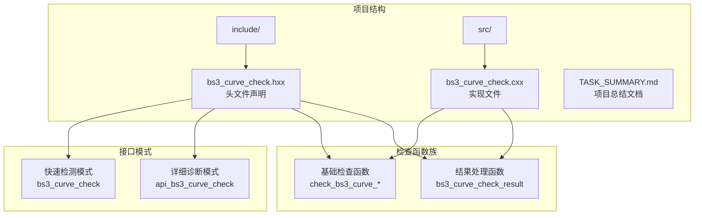
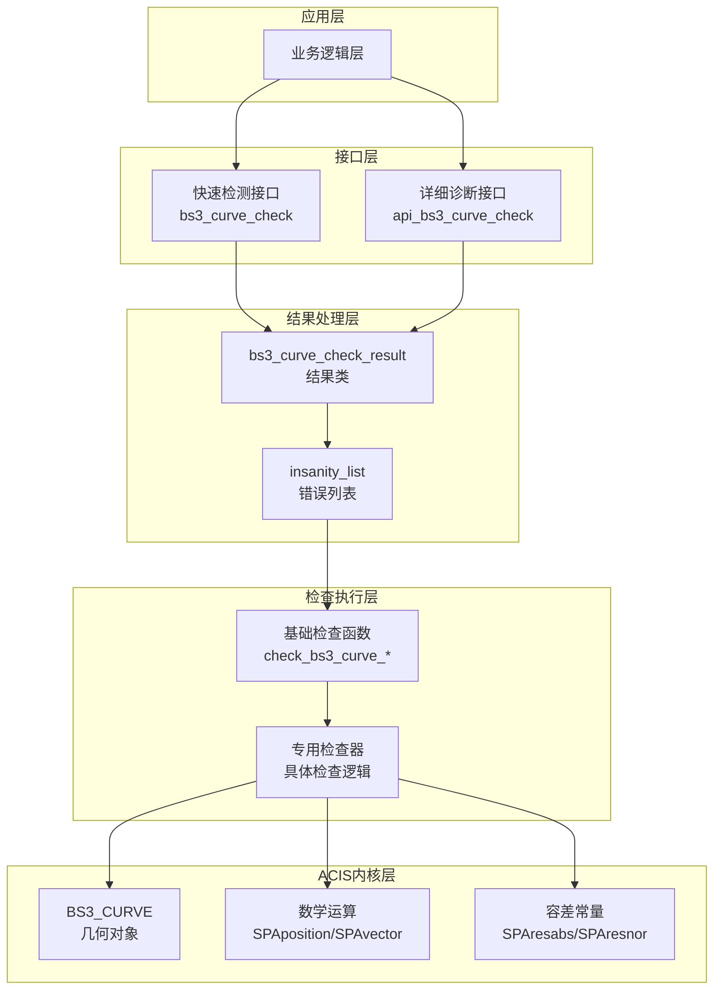
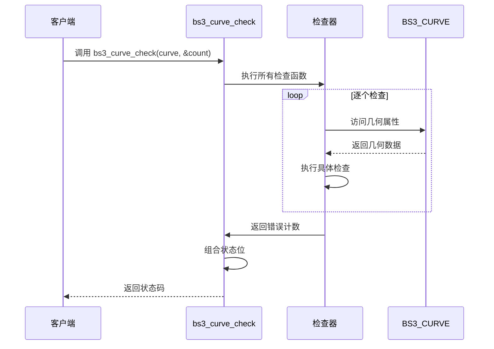
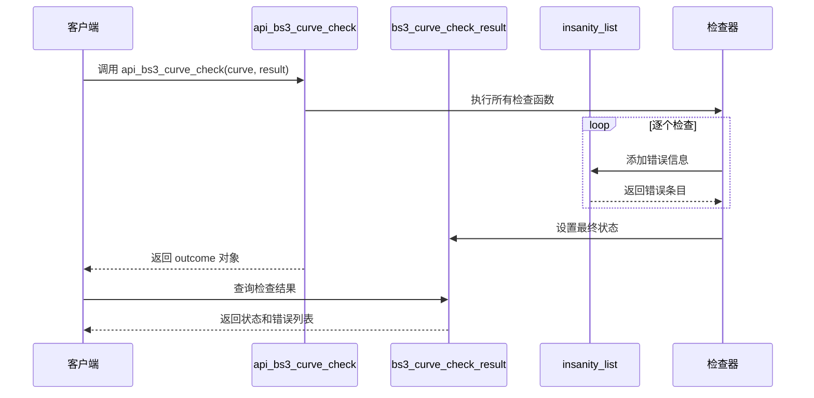
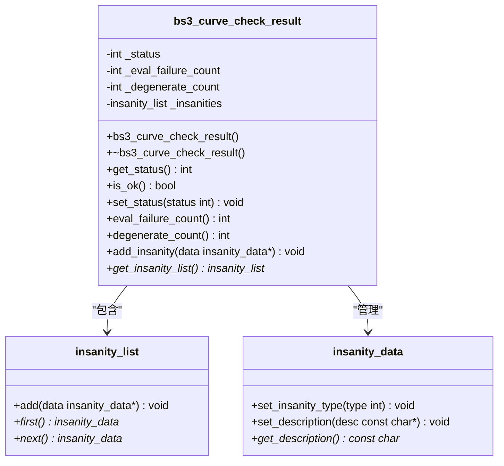
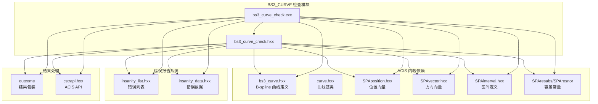

# BS3_CURVE 检查接口

<cite>
**本文档引用的文件**
- [bs3_curve_check.hxx](file://include/bs3_curve_check.hxx)
- [bs3_curve_check.cxx](file://src/bs3_curve_check.cxx)
- [TASK_SUMMARY.md](file://TASK_SUMMARY.md)
- [check_edge.hxx](file://include/check_edge.hxx)
</cite>

## 目录
1. [简介](#简介)
2. [项目结构](#项目结构)
3. [核心组件](#核心组件)
4. [架构概览](#架构概览)
5. [详细组件分析](#详细组件分析)
6. [依赖关系分析](#依赖关系分析)
7. [性能考虑](#性能考虑)
8. [故障排除指南](#故障排除指南)
9. [结论](#结论)

## 简介

BS3_CURVE 检查模块是基于 ACIS 3D 内核开发的几何曲线检查接口，专门用于验证 B-spline 曲线的几何正确性和数值稳定性。该模块提供了两种检查模式：快速检测模式和详细诊断模式，能够全面识别曲线中的各种问题，包括空指针、阶数异常、节点向量问题、控制点异常、评估失败、参数范围错误、闭合性问题、拟合公差异常、退化情况等多种几何缺陷。

该模块采用统一的检查框架设计，与 ACIS 内核的其他几何检查模块（如 EDGE、SURFACE、LUMP 等）保持一致的接口风格和实现模式，确保了整个几何验证系统的统一性和可维护性。

## 项目结构

BS3_CURVE 检查模块位于 Interface 项目的 include 和 src 目录下，采用标准的头文件声明和源文件实现分离的设计模式：



**图表来源**
- [bs3_curve_check.hxx:1-138](file://include/bs3_curve_check.hxx#L1-L138)
- [bs3_curve_check.cxx:1-150](file://src/bs3_curve_check.cxx#L1-L150)

**章节来源**
- [bs3_curve_check.hxx:1-138](file://include/bs3_curve_check.hxx#L1-L138)
- [TASK_SUMMARY.md:209-254](file://TASK_SUMMARY.md#L209-L254)

## 核心组件

BS3_CURVE 检查模块包含以下核心组件：

### 1. 状态枚举系统

模块定义了完整的错误状态枚举，用于标识不同类型的几何问题：

| 枚举值 | 值 | 说明 |
|--------|-----|------|
| BS3_CURVE_CHECK_OK | 0 | 无错误 |
| BS3_CURVE_CHECK_NULL_CURVE | 1<<0 | 曲线为空 |
| BS3_CURVE_CHECK_BAD_ORDER | 1<<1 | 阶数异常 |
| BS3_CURVE_CHECK_BAD_KNOT_VECTOR | 1<<2 | 节点向量异常 |
| BS3_CURVE_CHECK_BAD_CP_COUNT | 1<<3 | 控制点数量异常 |
| BS3_CURVE_CHECK_COINCIDENT_CPS | 1<<4 | 控制点重合 |
| BS3_CURVE_CHECK_EVAL_FAILURE | 1<<5 | 评估失败 |
| BS3_CURVE_CHECK_NAN_COORDINATES | 1<<6 | NaN/Inf |
| BS3_CURVE_CHECK_BAD_PARAM_RANGE | 1<<7 | 参数域异常 |
| BS3_CURVE_CHECK_BAD_CLOSURE | 1<<8 | 闭合异常 |
| BS3_CURVE_CHECK_BAD_FIT_TOL | 1<<9 | 拟合公差异常 |
| BS3_CURVE_CHECK_BAD_KNOT_MULT | 1<<10 | 节点重数异常 |
| BS3_CURVE_CHECK_DEGENERATE | 1<<11 | 退化 |
| BS3_CURVE_CHECK_BAD_CONVEX_HULL | 1<<12 | 凸包性质 |
| BS3_CURVE_CHECK_BAD_VD_PROPERTY | 1<<13 | 变差缩减性质 |
| BS3_CURVE_CHECK_BAD_BOUNDING_BOX | 1<<14 | 包围盒异常 |
| BS3_CURVE_CHECK_BAD_ARC_LENGTH | 1<<15 | 弧长异常 |

### 2. 结果处理类

`bs3_curve_check_result` 类提供了完整的检查结果管理功能：

- **状态查询**：`get_status()`、`is_ok()`
- **错误统计**：`eval_failure_count()`、`degenerate_count()`
- **错误收集**：`add_insanity()`、`get_insanity_list()`
- **状态设置**：`set_status()`

### 3. 检查函数族

模块包含 17 个专门的检查函数，覆盖几何曲线的所有关键方面：

- 基础检查：空指针检查、阶数检查、控制点检查
- 几何检查：节点向量检查、评估检查、参数范围检查
- 几何性质：闭合性检查、退化检查、导数检查
- 数值稳定性：节点重数检查、凸包性质检查、变差缩减性质检查
- 包围盒和弧长：包围盒检查、弧长检查

**章节来源**
- [bs3_curve_check.hxx:9-27](file://include/bs3_curve_check.hxx#L9-L27)
- [bs3_curve_check.hxx:29-49](file://include/bs3_curve_check.hxx#L29-L49)
- [TASK_SUMMARY.md:211-253](file://TASK_SUMMARY.md#L211-L253)

## 架构概览

BS3_CURVE 检查模块采用了分层架构设计，实现了清晰的关注点分离：



**图表来源**
- [bs3_curve_check.hxx:51-135](file://include/bs3_curve_check.hxx#L51-L135)
- [bs3_curve_check.cxx:50-150](file://src/bs3_curve_check.cxx#L50-L150)

该架构设计具有以下特点：

1. **双模式支持**：同时提供快速检测和详细诊断两种模式，满足不同场景需求
2. **结果抽象**：通过 `bs3_curve_check_result` 类统一管理检查结果，隐藏内部实现细节
3. **模块化设计**：每个检查函数独立封装，便于测试和维护
4. **错误聚合**：支持多错误收集和状态位组合，提供完整的错误信息

## 详细组件分析

### 快速检测接口

快速检测接口 `bs3_curve_check` 提供简洁的状态码返回，适用于需要快速判断曲线质量的场景。

#### 接口定义



**图表来源**
- [bs3_curve_check.cxx:876-1010](file://src/bs3_curve_check.cxx#L876-L1010)

#### 使用方法

```cpp
// 快速检测示例
int status = bs3_curve_check(curve, nullptr);
if (status == BS3_CURVE_CHECK_OK) {
    // 曲线有效
} else {
    // 检测到错误，检查具体类型
    if (status & BS3_CURVE_CHECK_NULL_CURVE) {
        // 处理空指针错误
    }
    if (status & BS3_CURVE_CHECK_BAD_ORDER) {
        // 处理阶数错误
    }
}
```

**章节来源**
- [bs3_curve_check.cxx:876-1010](file://src/bs3_curve_check.cxx#L876-L1010)

### 详细诊断接口

详细诊断接口 `api_bs3_curve_check` 提供完整的检查结果和错误信息，适用于需要精确定位问题的场景。

#### 接口定义



**图表来源**
- [bs3_curve_check.cxx:50-150](file://src/bs3_curve_check.cxx#L50-L150)

#### 使用方法

```cpp
// 详细诊断示例
bs3_curve_check_result result;
outcome res = api_bs3_curve_check(curve, result);

if (!result.is_ok()) {
    // 获取错误列表
    insanity_list* errors = result.get_insanity_list();
    
    // 遍历所有错误
    insanity_data* error = errors->first();
    while (error) {
        printf("错误类型: %s\n", error->get_description());
        error = error->next();
    }
    
    // 查询特定统计信息
    int evalFailures = result.eval_failure_count();
    int degenerates = result.degenerate_count();
}
```

**章节来源**
- [bs3_curve_check.cxx:50-150](file://src/bs3_curve_check.cxx#L50-L150)

### bs3_curve_check_result 结果类

结果类提供了丰富的查询和操作功能：



**图表来源**
- [bs3_curve_check.hxx:29-49](file://include/bs3_curve_check.hxx#L29-L49)

#### 功能特性

1. **状态查询**：
   - `get_status()`：获取完整的状态码
   - `is_ok()`：快速判断是否通过检查

2. **错误统计**：
   - `eval_failure_count()`：评估失败次数
   - `degenerate_count()`：退化情况计数

3. **错误收集**：
   - `add_insanity()`：添加单个错误
   - `get_insanity_list()`：获取完整的错误列表

4. **状态管理**：
   - `set_status()`：设置最终状态
   - 内部自动聚合多个检查函数的结果

**章节来源**
- [bs3_curve_check.hxx:29-49](file://include/bs3_curve_check.hxx#L29-L49)

### 检查函数详解

#### 基础几何检查

1. **空指针检查** (`check_bs3_curve_null`)
   - 验证 BS3_CURVE 指针的有效性
   - 返回 ERROR_TYPE 错误类型

2. **阶数检查** (`check_bs3_curve_order`)
   - 验证曲线阶数是否大于等于 1
   - 超过 20 的阶数会触发 WARNING

3. **控制点检查** (`check_bs3_curve_control_points`)
   - 验证控制点数量是否足够
   - 检查控制点坐标是否包含 NaN 或 Inf
   - 至少需要 2 个控制点

#### 节点向量检查

1. **节点向量完整性** (`check_bs3_curve_knot_vector`)
   - 验证节点向量是否存在
   - 检查节点向量是否单调递增
   - 验证节点值的有效性

2. **节点重数检查** (`check_bs3_curve_knot_multiplicity`)
   - 验证节点重数不超过曲线阶数
   - 检查节点向量的数学正确性

#### 几何评估检查

1. **曲线评估检查** (`check_bs3_curve_evaluation`)
   - 在参数范围内均匀采样进行评估
   - 检查评估结果的有效性
   - 捕获评估过程中的异常

2. **导数检查** (`check_bs3_curve_derivatives`)
   - 检查一阶导数的有效性
   - 特别关注端点处的导数行为
   - 验证曲线的光滑性

#### 几何性质检查

1. **闭合性检查** (`check_bs3_curve_closure`)
   - 验证标记为闭合的曲线是否真正闭合
   - 检查端点位置和切线的一致性
   - 处理 G1 连续性要求

2. **退化检查** (`check_bs3_curve_degeneracy`)
   - 检测所有控制点重合的情况
   - 验证连续重合控制点的数量
   - 评估退化的严重程度

3. **凸包性质检查** (`check_bs3_curve_convex_hull`)
   - 验证曲线上的点是否在控制点集的凸包内
   - 检查凸包性质的违反情况

4. **变差缩减性质检查** (`check_bs3_curve_vd_property`)
   - 验证曲线满足变差缩减性质
   - 检查曲线的几何合理性

#### 数值稳定性检查

1. **参数范围检查** (`check_bs3_curve_parameter_range`)
   - 验证参数范围的有效性
   - 检查参数范围是否退化
   - 验证参数边界值的有效性

2. **拟合公差检查** (`check_bs3_curve_fit_tolerance`)
   - 验证拟合公差的合理性
   - 检查公差值的范围和意义

3. **包围盒检查** (`check_bs3_curve_bounding_box`)
   - 验证包围盒计算的正确性
   - 检查控制点坐标的有效性

4. **弧长检查** (`check_bs3_curve_arc_length`)
   - 计算曲线的近似弧长
   - 检查弧长的有效性和合理性

**章节来源**
- [bs3_curve_check.cxx:152-874](file://src/bs3_curve_check.cxx#L152-L874)

## 依赖关系分析

BS3_CURVE 检查模块与 ACIS 内核存在紧密的依赖关系：



**图表来源**
- [bs3_curve_check.hxx:4-8](file://include/bs3_curve_check.hxx#L4-L8)
- [bs3_curve_check.cxx:1-10](file://src/bs3_curve_check.cxx#L1-L10)

### 关键依赖说明

1. **几何内核接口**：
   - `bs3_curve.hxx`：提供 B-spline 曲线的完整接口
   - `curve.hxx`：提供曲线基类的通用功能
   - `SPAposition/SPAvector/SPAinterval`：提供数学运算支持

2. **容差系统**：
   - `SPAresabs`：绝对容差，用于长度比较
   - `SPAresnor`：相对容差，用于角度计算

3. **错误报告机制**：
   - `insanity_list`：错误信息的聚合容器
   - `insanity_data`：单个错误信息的数据结构

4. **结果包装**：
   - `outcome`：统一的结果返回格式
   - `AcisOptions`：可选的配置参数

**章节来源**
- [bs3_curve_check.hxx:4-8](file://include/bs3_curve_check.hxx#L4-L8)
- [TASK_SUMMARY.md:282-293](file://TASK_SUMMARY.md#L282-L293)

## 性能考虑

BS3_CURVE 检查模块在设计时充分考虑了性能优化：

### 1. 检查策略优化

- **渐进式检查**：快速检测模式按顺序执行检查，遇到错误立即停止
- **采样策略**：评估和导数检查使用合理的采样密度（20-30个样本）
- **异常短路**：发现严重错误时提前终止后续检查

### 2. 内存管理

- **智能指针使用**：错误数据采用动态分配，避免内存泄漏
- **列表管理**：`insanity_list` 自动管理错误条目的生命周期
- **状态聚合**：通过位运算高效组合多个检查结果

### 3. 计算复杂度

- **时间复杂度**：大多数检查为 O(n)，其中 n 为控制点数量或采样点数量
- **空间复杂度**：主要取决于错误列表的大小，通常为 O(k)，其中 k 为错误数量
- **缓存友好**：检查函数按顺序访问几何数据，提高缓存命中率

### 4. 并发考虑

- **线程安全**：检查函数不修改输入的几何对象
- **可重入性**：支持在多线程环境中安全调用
- **资源隔离**：每个检查都有独立的局部变量空间

## 故障排除指南

### 常见问题及解决方案

#### 1. 空指针错误 (BS3_CURVE_CHECK_NULL_CURVE)

**症状**：
- 快速检测返回 `BS3_CURVE_CHECK_NULL_CURVE`
- 详细诊断显示 "BS3_CURVE pointer is null."

**解决方案**：
```cpp
if (status & BS3_CURVE_CHECK_NULL_CURVE) {
    // 检查曲线指针的有效性
    if (curve == nullptr) {
        // 处理空指针情况
        return FAILURE;
    }
}
```

#### 2. 阶数异常 (BS3_CURVE_CHECK_BAD_ORDER)

**症状**：
- 阶数小于 1 或异常高（> 20）

**解决方案**：
```cpp
if (status & BS3_CURVE_CHECK_BAD_ORDER) {
    int order = curve->order();
    if (order < 1) {
        // 修正阶数到有效范围
        order = 1;
    } else if (order > 20) {
        // 警告用户阶数过高可能影响性能
        LogWarning("曲线阶数过高: " + order);
    }
}
```

#### 3. 控制点异常 (BS3_CURVE_CHECK_BAD_CP_COUNT)

**症状**：
- 控制点数量少于阶数
- 控制点坐标包含 NaN 或 Inf

**解决方案**：
```cpp
if (status & BS3_CURVE_CHECK_BAD_CP_COUNT) {
    int numCP = curve->num_control_points();
    int order = curve->order();
    
    if (numCP < order) {
        // 增加控制点或降低阶数
        AdjustCurveParameters(numCP, order);
    }
    
    // 检查控制点坐标有效性
    for (int i = 0; i < numCP; i++) {
        SPAposition cp = curve->control_point(i);
        ValidateCoordinate(cp);
    }
}
```

#### 4. 节点向量问题 (BS3_CURVE_CHECK_BAD_KNOT_VECTOR)

**症状**：
- 节点向量不是单调递增
- 节点值包含 NaN 或 Inf

**解决方案**：
```cpp
if (status & BS3_CURVE_CHECK_BAD_KNOT_VECTOR) {
    // 重新构建节点向量
    RebuildKnotVector(curve);
    
    // 验证节点向量的单调性
    VerifyKnotVectorMonotonicity(curve);
}
```

#### 5. 评估失败 (BS3_CURVE_CHECK_EVAL_FAILURE)

**症状**：
- 曲线评估抛出异常
- 评估结果包含 NaN 或 Inf

**解决方案**：
```cpp
if (status & BS3_CURVE_CHECK_EVAL_FAILURE) {
    // 检查参数范围的有效性
    SPAinterval range = curve->param_range();
    if (range.null()) {
        // 修复参数范围
        FixParameterRange(curve);
    }
    
    // 降低采样密度重新检查
    ReduceSamplingDensity();
}
```

### 调试技巧

1. **启用详细日志**：
   ```cpp
   bs3_curve_check_result result;
   outcome res = api_bs3_curve_check(curve, result);
   
   if (!result.is_ok()) {
       insanity_list* errors = result.get_insanity_list();
       PrintAllErrors(errors);
   }
   ```

2. **分步检查**：
   ```cpp
   // 逐个执行关键检查
   check_bs3_curve_null(curve, &ilist);
   check_bs3_curve_order(curve, &ilist);
   check_bs3_curve_control_points(curve, &ilist);
   ```

3. **参数验证**：
   ```cpp
   // 检查关键参数
   printf("阶数: %d\n", curve->order());
   printf("控制点数: %d\n", curve->num_control_points());
   printf("参数范围: [%f, %f]\n", 
          curve->param_range().low(), 
          curve->param_range().high());
   ```

**章节来源**
- [bs3_curve_check.cxx:50-150](file://src/bs3_curve_check.cxx#L50-L150)
- [bs3_curve_check.cxx:876-1010](file://src/bs3_curve_check.cxx#L876-L1010)

## 结论

BS3_CURVE 检查模块是一个设计精良、功能完备的几何曲线验证系统。它成功地将复杂的几何检查逻辑封装在简洁易用的接口后面，为开发者提供了强大的工具来确保 B-spline 曲线的质量和可靠性。

### 主要优势

1. **完整的检查覆盖**：涵盖从基础几何到高级数学性质的全方位检查
2. **双模式设计**：既满足快速检测需求，又提供详细的诊断信息
3. **统一的接口风格**：与 ACIS 内核的其他检查模块保持一致
4. **良好的性能表现**：优化的算法和数据结构确保高效的检查速度
5. **完善的错误处理**：提供详细的错误信息和定位能力

### 应用建议

1. **生产环境**：推荐使用详细诊断模式，以便获得完整的错误信息
2. **性能敏感场景**：可以使用快速检测模式进行初步筛选
3. **调试阶段**：结合详细诊断和分步检查，快速定位问题
4. **批处理任务**：利用双模式设计，先快速过滤，再对可疑对象进行详细检查

该模块为基于 ACIS 内核的应用程序提供了可靠的几何验证基础，有助于提高整体系统的稳定性和质量。