# BS3_CURVE 检查模块

<cite>
**本文档引用的文件**
- [bs3_curve_check.hxx](file://include/bs3_curve_check.hxx)
- [bs3_curve_check.cxx](file://src/bs3_curve_check.cxx)
- [TASK_SUMMARY.md](file://TASK_SUMMARY.md)
</cite>

## 目录
1. [简介](#简介)
2. [项目结构](#项目结构)
3. [核心组件](#核心组件)
4. [架构概览](#架构概览)
5. [详细组件分析](#详细组件分析)
6. [数学理论基础](#数学理论基础)
7. [几何性质验证](#几何性质验证)
8. [数值稳定性分析](#数值稳定性分析)
9. [实现指南](#实现指南)
10. [参数设置建议](#参数设置建议)
11. [常见问题诊断](#常见问题诊断)
12. [性能考虑](#性能考虑)
13. [故障排除指南](#故障排除指南)
14. [结论](#结论)

## 简介

BS3_CURVE 检查模块是基于 ACIS 3D 内核开发的 B-spline 曲线几何实体验证系统。该模块提供了 17 个专门的子检查函数，用于全面验证 B-spline 曲线的数学正确性、几何性质和数值稳定性。模块采用双模式接口设计，既支持快速状态检测，也支持详细的诊断报告生成。

该模块的核心目标是确保 B-spline 曲线数据结构的完整性，防止在后续几何计算中出现数值错误或逻辑矛盾。通过系统化的检查流程，可以及早发现并报告潜在问题，提高几何建模系统的可靠性。

## 项目结构

BS3_CURVE 检查模块遵循标准的 C++ 工程组织结构，采用头文件声明与实现文件分离的设计模式：

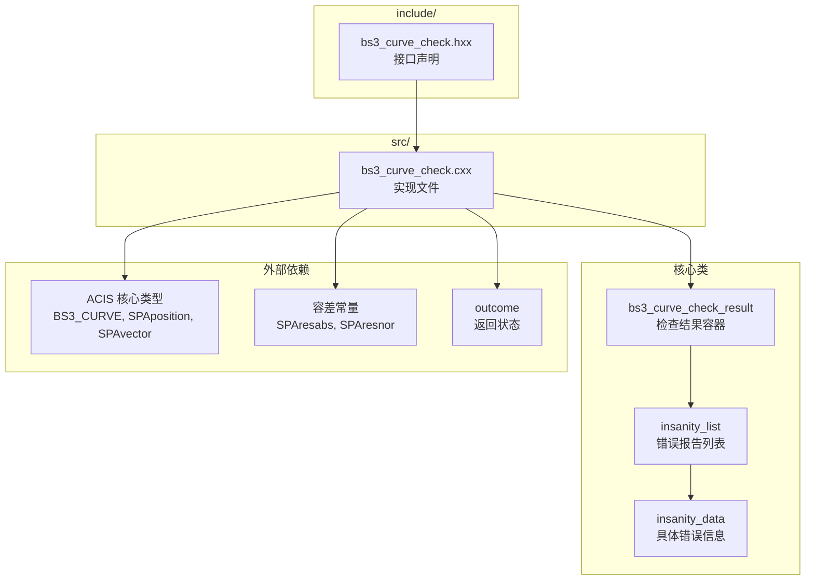

**图表来源**
- [bs3_curve_check.hxx:1-138](file://include/bs3_curve_check.hxx#L1-L138)
- [bs3_curve_check.cxx:1-1011](file://src/bs3_curve_check.cxx#L1-L1011)

**章节来源**
- [bs3_curve_check.hxx:1-138](file://include/bs3_curve_check.hxx#L1-L138)
- [bs3_curve_check.cxx:1-1011](file://src/bs3_curve_check.cxx#L1-L1011)

## 核心组件

### 主要接口类

BS3_CURVE 检查模块包含三个核心类，它们构成了完整的检查系统：

```mermaid
classDiagram
class bs3_curve_check_result {
-int _status
-int _eval_failure_count
-int _degenerate_count
-insanity_list _insanities
+bs3_curve_check_result()
+~bs3_curve_check_result()
+get_status() int
+is_ok() bool
+set_status(int) void
+eval_failure_count() int
+degenerate_count() int
+add_insanity(insanity_data*) void
+get_insanity_list() insanity_list*
}
class bs3_curve_check_status {
<<enumeration>>
BS3_CURVE_CHECK_OK
BS3_CURVE_CHECK_NULL_CURVE
BS3_CURVE_CHECK_BAD_ORDER
BS3_CURVE_CHECK_BAD_KNOT_VECTOR
BS3_CURVE_CHECK_BAD_CP_COUNT
BS3_CURVE_CHECK_COINCIDENT_CPS
BS3_CURVE_CHECK_EVAL_FAILURE
BS3_CURVE_CHECK_NAN_COORDINATES
BS3_CURVE_CHECK_BAD_PARAM_RANGE
BS3_CURVE_CHECK_BAD_CLOSURE
BS3_CURVE_CHECK_BAD_FIT_TOL
BS3_CURVE_CHECK_BAD_KNOT_MULT
BS3_CURVE_CHECK_DEGENERATE
BS3_CURVE_CHECK_BAD_CONVEX_HULL
BS3_CURVE_CHECK_BAD_VD_PROPERTY
BS3_CURVE_CHECK_BAD_BOUNDING_BOX
BS3_CURVE_CHECK_BAD_ARC_LENGTH
}
class insanity_list {
+add(insanity_data*) void
+first() insanity_data*
+next() insanity_data*
}
class insanity_data {
-int _type
-const char* _description
+set_insanity_type(int) void
+set_description(const char*) void
+get_insanity_type() int
+get_description() const char*
}
bs3_curve_check_result --> insanity_list : "使用"
bs3_curve_check_result --> bs3_curve_check_status : "报告状态"
bs3_curve_check_result --> insanity_data : "收集错误"
insanity_list --> insanity_data : "管理"
```

**图表来源**
- [bs3_curve_check.hxx:29-49](file://include/bs3_curve_check.hxx#L29-L49)
- [bs3_curve_check.hxx:9-27](file://include/bs3_curve_check.hxx#L9-L27)

### 主要检查函数

模块提供两个主要的检查入口函数：

1. **快速检测模式** (`bs3_curve_check`)
   - 返回整数状态码
   - 适合简单的有效性判断
   - 性能开销较小

2. **详细诊断模式** (`api_bs3_curve_check`)
   - 返回完整的诊断结果对象
   - 提供详细的错误描述和位置信息
   - 支持错误报告的进一步处理

**章节来源**
- [bs3_curve_check.hxx:51-55](file://include/bs3_curve_check.hxx#L51-L55)
- [bs3_curve_check.hxx:132-135](file://include/bs3_curve_check.hxx#L132-L135)

## 架构概览

BS3_CURVE 检查模块采用分层架构设计，从底层的几何评估到上层的状态聚合形成了清晰的职责分工：

```mermaid
graph TD
subgraph "用户接口层"
A1[bs3_curve_check]
A2[api_bs3_curve_check]
end
subgraph "检查执行层"
B1[check_bs3_curve_null]
B2[check_bs3_curve_order]
B3[check_bs3_curve_control_points]
B4[check_bs3_curve_knot_vector]
B5[check_bs3_curve_evaluation]
B6[check_bs3_curve_parameter_range]
B7[check_bs3_curve_closure]
B8[check_bs3_curve_fit_tolerance]
B9[check_bs3_curve_degeneracy]
B10[check_bs3_curve_derivatives]
B11[check_bs3_curve_knot_multiplicity]
B12[check_bs3_curve_convex_hull]
B13[check_bs3_curve_vd_property]
B14[check_bs3_curve_bounding_box]
B15[check_bs3_curve_arc_length]
end
subgraph "结果聚合层"
C1[bs3_curve_check_result]
C2[状态码映射]
end
subgraph "ACIS 核心层"
D1[BS3_CURVE]
D2[SPAposition]
D3[SPAvector]
D4[SPAinterval]
D5[SPAresabs]
D6[SPAresnor]
end
A1 --> B1
A2 --> B1
B1 --> C1
B2 --> C1
B3 --> C1
B4 --> C1
B5 --> C1
B6 --> C1
B7 --> C1
B8 --> C1
B9 --> C1
B10 --> C1
B11 --> C1
B12 --> C1
B13 --> C1
B14 --> C1
B15 --> C1
C1 --> C2
B1 --> D1
B2 --> D1
B3 --> D1
B4 --> D1
B5 --> D1
B6 --> D1
B7 --> D1
B8 --> D1
B9 --> D1
B10 --> D1
B11 --> D1
B12 --> D1
B13 --> D1
B14 --> D1
B15 --> D1
D1 --> D2
D1 --> D3
D1 --> D4
D1 --> D5
D1 --> D6
```

**图表来源**
- [bs3_curve_check.cxx:50-150](file://src/bs3_curve_check.cxx#L50-L150)
- [bs3_curve_check.hxx:57-130](file://include/bs3_curve_check.hxx#L57-L130)

## 详细组件分析

### 空指针检查 (check_bs3_curve_null)

空指针检查是最基础但至关重要的验证步骤，确保传入的 BS3_CURVE 指针有效：

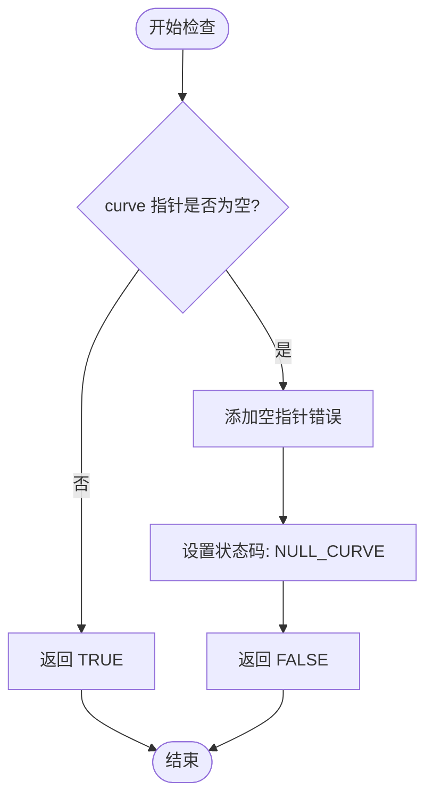

**图表来源**
- [bs3_curve_check.cxx:152-165](file://src/bs3_curve_check.cxx#L152-L165)

该检查使用简单的指针验证，一旦发现空指针立即记录错误并返回失败状态。这是所有其他检查的前提条件。

**章节来源**
- [bs3_curve_check.cxx:152-165](file://src/bs3_curve_check.cxx#L152-L165)

### 阶数检查 (check_bs3_curve_order)

阶数检查验证 B-spline 曲线的数学定义正确性：

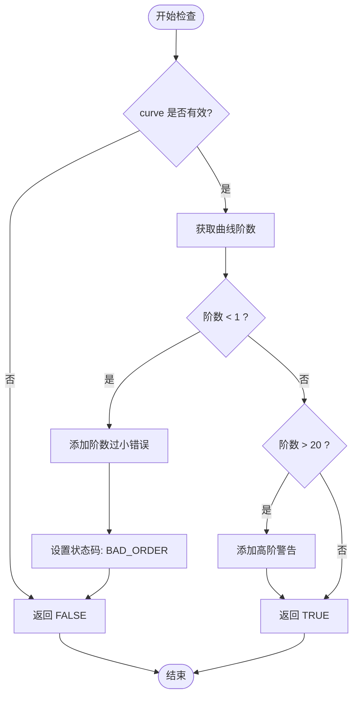

**图表来源**
- [bs3_curve_check.cxx:167-193](file://src/bs3_curve_check.cxx#L167-L193)

阶数的有效范围通常在 1 到 20 之间，超出此范围会被标记为警告或错误。

**章节来源**
- [bs3_curve_check.cxx:167-193](file://src/bs3_curve_check.cxx#L167-L193)

### 控制点检查 (check_bs3_curve_control_points)

控制点检查确保曲线的几何定义完整且数值有效：

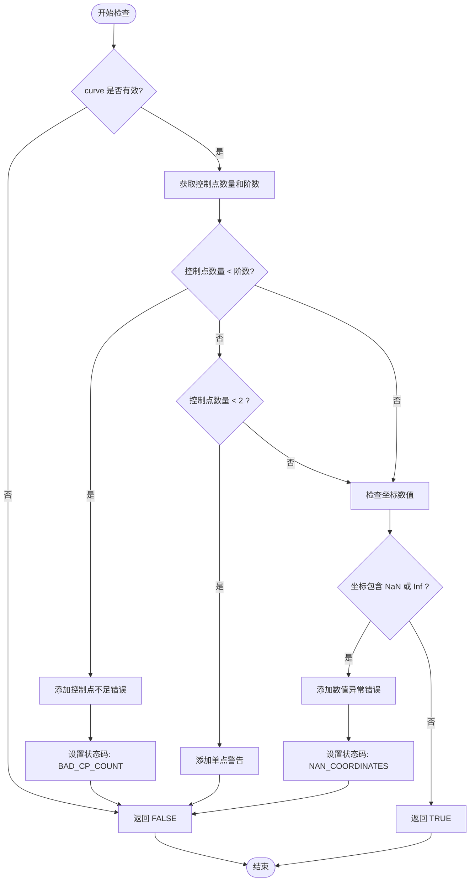

**图表来源**
- [bs3_curve_check.cxx:195-244](file://src/bs3_curve_check.cxx#L195-L244)

控制点检查包括数量验证和数值有效性验证两个层面。

**章节来源**
- [bs3_curve_check.cxx:195-244](file://src/bs3_curve_check.cxx#L195-L244)

### 节点向量检查 (check_bs3_curve_knot_vector)

节点向量检查验证 B-spline 基函数的数学正确性：

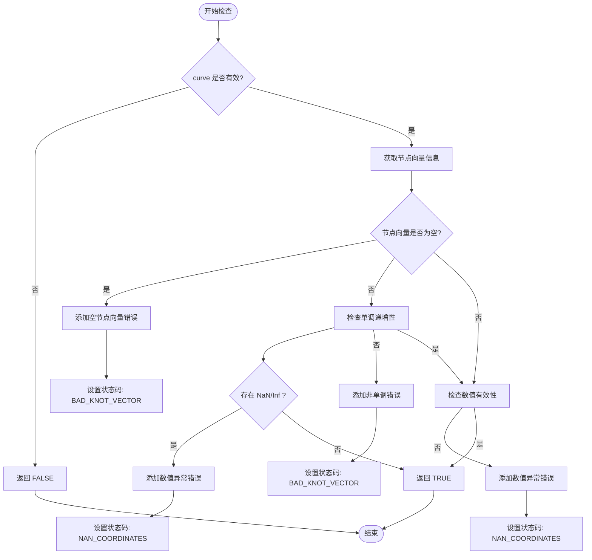

**图表来源**
- [bs3_curve_check.cxx:246-296](file://src/bs3_curve_check.cxx#L246-L296)

节点向量必须满足非递减性和数值有效性要求。

**章节来源**
- [bs3_curve_check.cxx:246-296](file://src/bs3_curve_check.cxx#L246-L296)

### 评估检查 (check_bs3_curve_evaluation)

评估检查验证曲线在参数空间内的数值稳定性：

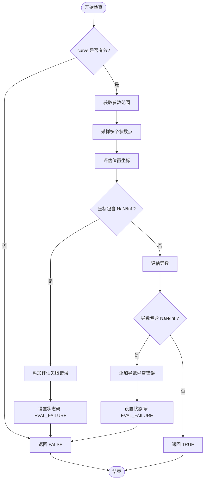

**图表来源**
- [bs3_curve_check.cxx:298-347](file://src/bs3_curve_check.cxx#L298-L347)

评估检查使用固定数量的采样点来验证曲线的数值稳定性。

**章节来源**
- [bs3_curve_check.cxx:298-347](file://src/bs3_curve_check.cxx#L298-L347)

### 参数域检查 (check_bs3_curve_parameter_range)

参数域检查确保曲线的参数范围合理且数值有效：

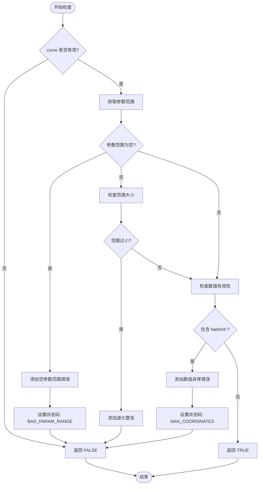

**图表来源**
- [bs3_curve_check.cxx:349-391](file://src/bs3_curve_check.cxx#L349-L391)

参数域检查关注范围的有效性和数值稳定性。

**章节来源**
- [bs3_curve_check.cxx:349-391](file://src/bs3_curve_check.cxx#L349-L391)

### 闭合检查 (check_bs3_curve_closure)

闭合检查验证闭合曲线的几何连续性：

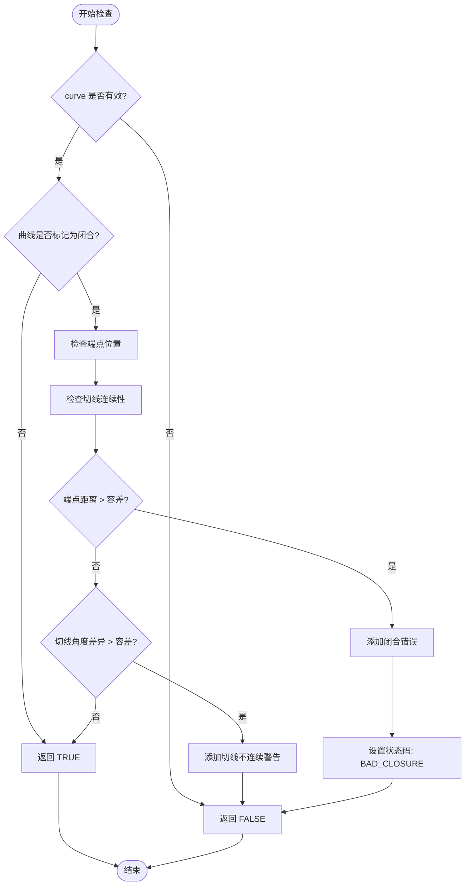

**图表来源**
- [bs3_curve_check.cxx:393-440](file://src/bs3_curve_check.cxx#L393-L440)

闭合检查同时验证几何位置连续性和切线方向连续性。

**章节来源**
- [bs3_curve_check.cxx:393-440](file://src/bs3_curve_check.cxx#L393-L440)

### 拟合公差检查 (check_bs3_curve_fit_tolerance)

拟合公差检查确保几何拟合的容差设置合理：

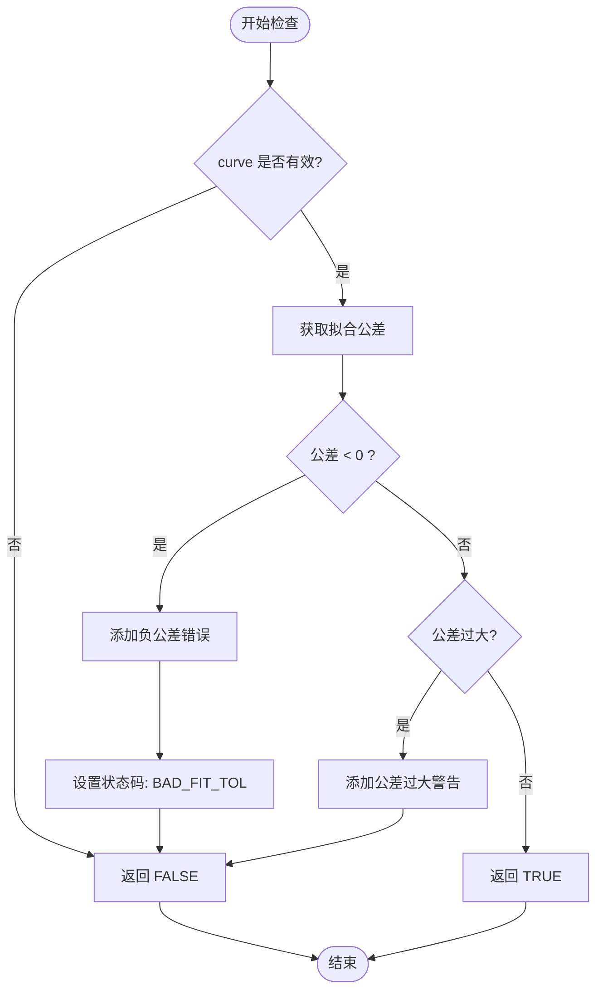

**图表来源**
- [bs3_curve_check.cxx:442-469](file://src/bs3_curve_check.cxx#L442-L469)

拟合公差必须为非负值，过大或过小的公差都可能影响几何质量。

**章节来源**
- [bs3_curve_check.cxx:442-469](file://src/bs3_curve_check.cxx#L442-L469)

### 退化检查 (check_bs3_curve_degeneracy)

退化检查识别几何退化的特殊情况：

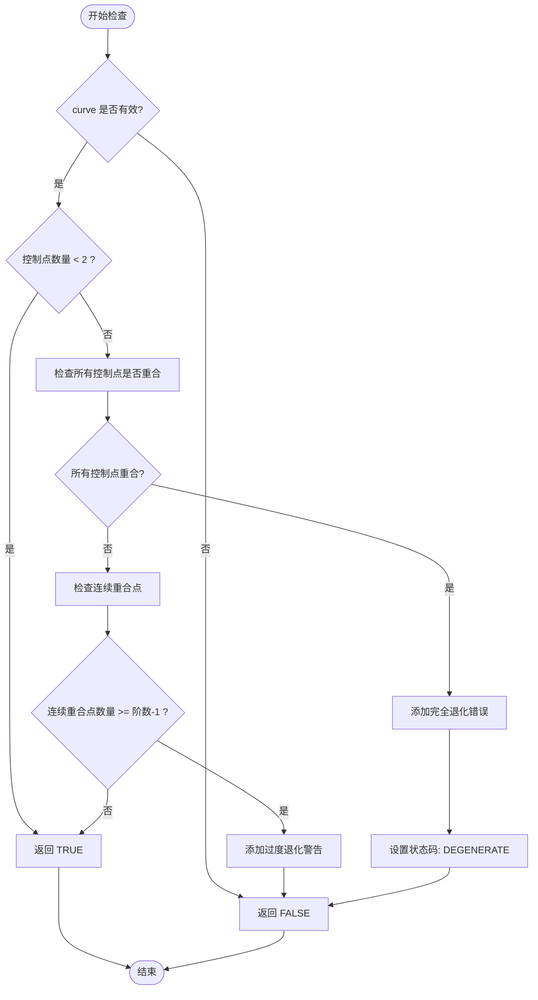

**图表来源**
- [bs3_curve_check.cxx:471-536](file://src/bs3_curve_check.cxx#L471-L536)

退化检查区分完全退化和部分退化情况，提供不同级别的警告。

**章节来源**
- [bs3_curve_check.cxx:471-536](file://src/bs3_curve_check.cxx#L471-L536)

### 导数检查 (check_bs3_curve_derivatives)

导数检查验证曲线在边界点的几何行为：

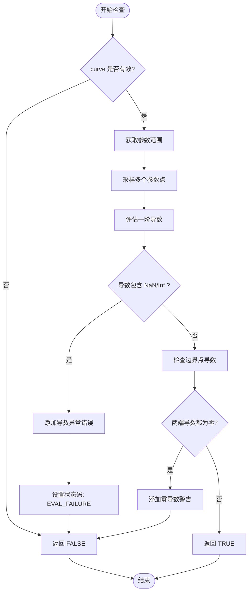

**图表来源**
- [bs3_curve_check.cxx:538-609](file://src/bs3_curve_check.cxx#L538-L609)

导数检查特别关注曲线端点的几何特性。

**章节来源**
- [bs3_curve_check.cxx:538-609](file://src/bs3_curve_check.cxx#L538-L609)

### 节点重数检查 (check_bs3_curve_knot_multiplicity)

节点重数检查确保节点向量的数学约束得到满足：

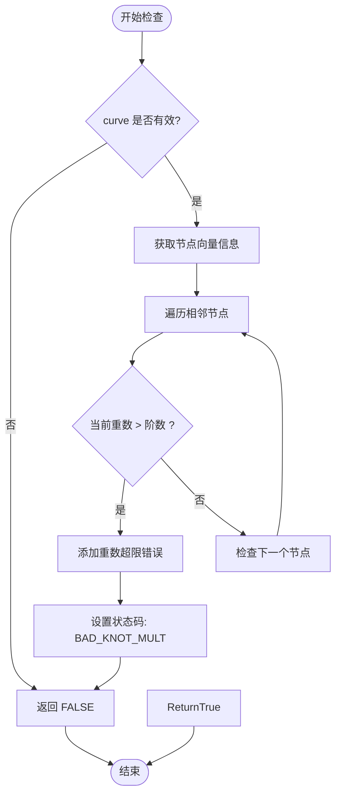

**图表来源**
- [bs3_curve_check.cxx:611-649](file://src/bs3_curve_check.cxx#L611-L649)

节点重数必须不超过曲线阶数，这是 B-spline 基函数的重要数学约束。

**章节来源**
- [bs3_curve_check.cxx:611-649](file://src/bs3_curve_check.cxx#L611-L649)

### 凸包性质检查 (check_bs3_curve_convex_hull)

凸包性质检查验证曲线位于其控制点集的凸包内：

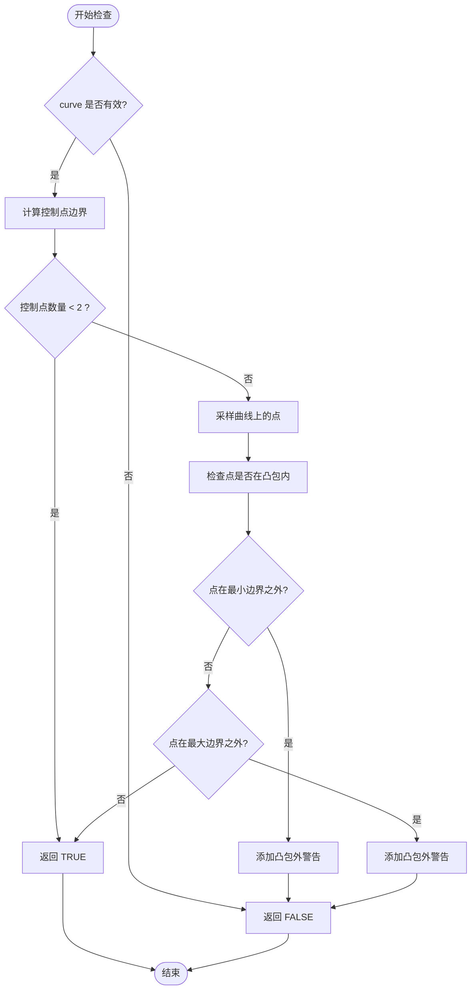

**图表来源**
- [bs3_curve_check.cxx:651-723](file://src/bs3_curve_check.cxx#L651-L723)

凸包性质是 B-spline 曲线的重要几何特性，所有曲线点都应该位于控制点集的凸包内。

**章节来源**
- [bs3_curve_check.cxx:651-723](file://src/bs3_curve_check.cxx#L651-L723)

### 变差缩减性质检查 (check_bs3_curve_vd_property)

变差缩减性质检查验证曲线的变差缩减特性：

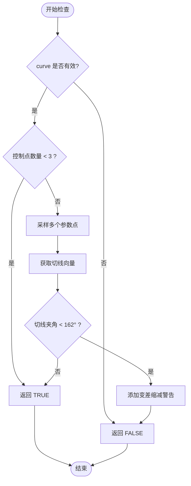

**图表来源**
- [bs3_curve_check.cxx:725-781](file://src/bs3_curve_check.cxx#L725-L781)

变差缩减性质是 B-spline 曲线的重要理论特性，保证了曲线的良好行为。

**章节来源**
- [bs3_curve_check.cxx:725-781](file://src/bs3_curve_check.cxx#L725-L781)

### 包围盒检查 (check_bs3_curve_bounding_box)

包围盒检查验证控制点的数值有效性：

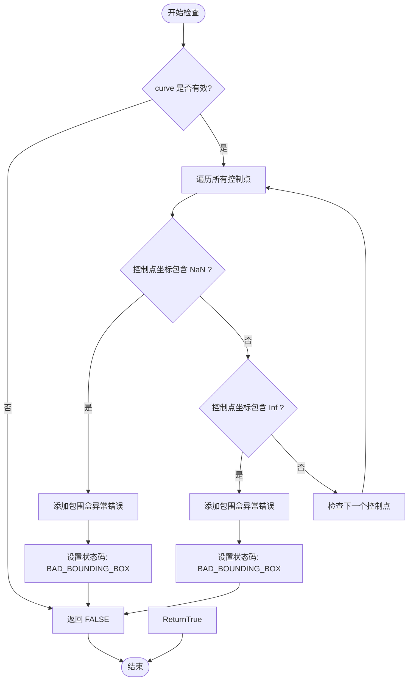

**图表来源**
- [bs3_curve_check.cxx:783-821](file://src/bs3_curve_check.cxx#L783-L821)

包围盒检查确保所有控制点都在有限范围内。

**章节来源**
- [bs3_curve_check.cxx:783-821](file://src/bs3_curve_check.cxx#L783-L821)

### 弧长检查 (check_bs3_curve_arc_length)

弧长检查验证曲线长度的数值稳定性：

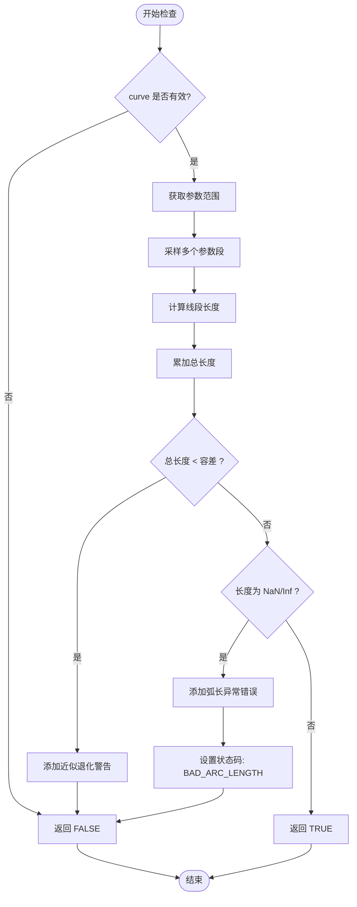

**图表来源**
- [bs3_curve_check.cxx:823-874](file://src/bs3_curve_check.cxx#L823-L874)

弧长检查通过数值积分的方式验证曲线长度的合理性。

**章节来源**
- [bs3_curve_check.cxx:823-874](file://src/bs3_curve_check.cxx#L823-L874)

## 数学理论基础

### B-spline 曲线的数学定义

B-spline 曲线是通过一组控制点和节点向量定义的参数曲线，具有以下数学特性：

1. **基函数性质**：B-spline 基函数具有局部支承性，仅在有限区间内非零
2. **凸包性质**：曲线位于其控制点集的凸包内
3. **端点插值**：对于开放边界条件，曲线通过首末控制点
4. **几何连续性**：由节点重数决定的几何连续性级别

### 数值稳定性理论

数值稳定性是 B-spline 计算的关键考量因素：

1. **容差系统**：使用 `SPAresabs` 和 `SPAresnor` 等容差常量处理浮点精度问题
2. **异常检测**：通过 NaN 和 Inf 检测防止数值溢出和未定义操作
3. **收敛性保证**：通过适当的采样密度确保数值积分的准确性

## 几何性质验证

### 几何连续性验证

模块通过多种方式验证几何连续性：

1. **位置连续性**：检查曲线端点的几何重合
2. **切线连续性**：验证曲线端点切线方向的一致性
3. **曲率连续性**：通过变差缩减性质间接验证

### 凸包性质验证

凸包性质是 B-spline 曲线的重要几何特性，模块通过以下方式验证：

1. **边界计算**：计算所有控制点的最小和最大坐标
2. **点位置检查**：验证曲线上的采样点是否位于凸包内
3. **异常报告**：对超出凸包范围的点进行警告

### 变差缩减性质验证

变差缩减性质保证了曲线的良好行为：

1. **切线角度分析**：检查相邻切线向量之间的夹角
2. **角度阈值设定**：使用 162° 作为判断阈值
3. **异常检测**：对违反变差缩减性质的情况进行警告

## 数值稳定性分析

### 容差系统

BS3_CURVE 检查模块使用统一的容差系统来处理数值精度问题：

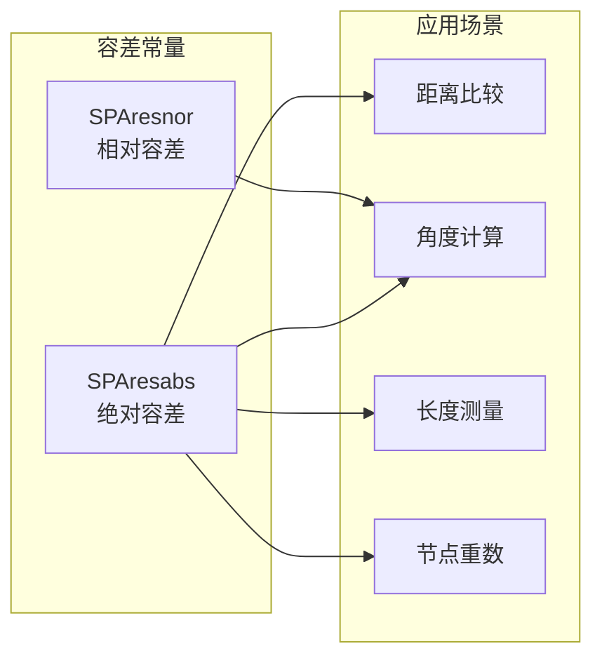

**图表来源**
- [bs3_curve_check.cxx:8, 270:8-8](file://src/bs3_curve_check.cxx#L8-L8)
- [bs3_curve_check.cxx:270, 428:270-428](file://src/bs3_curve_check.cxx#L270-L428)

### 异常处理机制

模块采用多层次的异常处理策略：

1. **静态检查**：编译时可检测的逻辑错误
2. **运行时检查**：执行时的数值有效性验证
3. **异常捕获**：对几何评估过程中的异常进行捕获和报告

## 实现指南

### 快速检测模式使用

快速检测模式适用于简单的有效性判断场景：

```cpp
// 快速检测示例
int status = bs3_curve_check(curve, nullptr);
if (status == BS3_CURVE_CHECK_OK) {
    // 曲线有效
} else if (status & BS3_CURVE_CHECK_NULL_CURVE) {
    // 处理空指针错误
}
```

### 详细诊断模式使用

详细诊断模式提供完整的错误报告：

```cpp
// 详细诊断示例
bs3_curve_check_result result;
outcome res = api_bs3_curve_check(curve, result);
if (!result.is_ok()) {
    insanity_list *ilist = result.get_insanity_list();
    // 遍历错误列表获取详细信息
    for (insanity_data *entry = ilist->first(); entry; entry = entry->next()) {
        printf("错误类型: %d\n", entry->get_insanity_type());
        printf("错误描述: %s\n", entry->get_description());
    }
}
```

### 错误状态码映射

模块将具体的检查错误映射到统一的状态码体系：

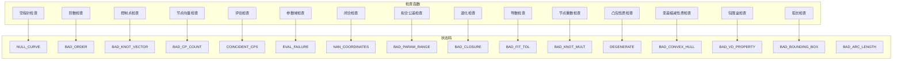

**图表来源**
- [bs3_curve_check.hxx:9-27](file://include/bs3_curve_check.hxx#L9-L27)
- [bs3_curve_check.cxx:91-147](file://src/bs3_curve_check.cxx#L91-L147)

## 参数设置建议

### 采样密度配置

不同的检查函数使用不同的采样密度：

| 检查函数 | 采样点数 | 采样策略 |
|---------|---------|---------|
| 评估检查 | 20 | 线性均匀分布 |
| 导数检查 | 15 | 线性均匀分布 |
| 凸包检查 | 20 | 线性均匀分布 |
| 变差缩减检查 | 30 | 线性均匀分布 |
| 弧长检查 | 50 | 线性均匀分布 |

### 容差参数选择

容差参数的选择需要根据具体应用场景调整：

1. **绝对容差 (SPAresabs)**：适用于小尺寸几何体
2. **相对容差 (SPAresnor)**：适用于大尺寸几何体
3. **角度容差**：通常设置为 1° 到 5° 之间

### 性能优化建议

1. **早期退出**：在发现严重错误时立即停止后续检查
2. **缓存机制**：对重复计算的结果进行缓存
3. **并行处理**：对独立的检查函数进行并行执行

## 常见问题诊断

### 常见错误类型及解决方案

```mermaid
flowchart TD
subgraph "错误分类"
A[几何错误]
B[数值错误]
C[逻辑错误]
end
subgraph "几何错误"
A1[控制点重合]
A2[节点向量异常]
A3[参数范围无效]
end
subgraph "数值错误"
B1[NaN 坐标]
B2[Inf 坐标]
B3[数值溢出]
end
subgraph "逻辑错误"
C1[空指针]
C2[阶数异常]
C3[退化曲线]
end
A --> A1
A --> A2
A --> A3
B --> B1
B --> B2
B --> B3
C --> C1
C --> C2
C --> C3
```

### 故障排除流程

```mermaid
sequenceDiagram
participant U as 用户
participant M as 检查模块
participant R as 结果分析
participant F as 解决方案
U->>M : 调用检查函数
M->>M : 执行各项检查
M->>R : 生成错误报告
R->>U : 显示错误详情
U->>F : 根据错误类型采取措施
F->>U : 提供修复建议
U->>M : 重新检查修复后的数据
M->>U : 返回最终结果
```

### 最佳实践建议

1. **渐进式检查**：先进行快速检查，再进行详细诊断
2. **错误优先级**：优先处理严重错误，再处理警告信息
3. **上下文信息**：保留原始几何数据的上下文信息
4. **日志记录**：详细记录检查过程和结果

## 性能考虑

### 时间复杂度分析

各检查函数的时间复杂度如下：

| 检查函数 | 时间复杂度 | 空间复杂度 |
|---------|-----------|-----------|
| 空指针检查 | O(1) | O(1) |
| 阶数检查 | O(1) | O(1) |
| 控制点检查 | O(n) | O(1) |
| 节点向量检查 | O(m) | O(1) |
| 评估检查 | O(s) | O(1) |
| 参数域检查 | O(1) | O(1) |
| 闭合检查 | O(1) | O(1) |
| 拟合公差检查 | O(1) | O(1) |
| 退化检查 | O(n) | O(1) |
| 导数检查 | O(d) | O(1) |
| 节点重数检查 | O(m) | O(1) |
| 凸包检查 | O(p) | O(1) |
| 变差缩减检查 | O(q) | O(1) |
| 包围盒检查 | O(n) | O(1) |
| 弧长检查 | O(r) | O(1) |

其中 n 为控制点数量，m 为节点数量，s 为评估采样点数，d 为导数采样点数，p 为凸包采样点数，q 为变差缩减采样点数，r 为弧长采样点数。

### 内存使用分析

模块的内存使用主要来自：

1. **错误报告存储**：动态分配的 `insanity_data` 对象
2. **临时变量**：几何计算过程中的中间结果
3. **采样点缓存**：检查过程中使用的临时数组

### 优化策略

1. **批量检查**：将多个检查函数组合在一个调用中
2. **智能采样**：根据曲线复杂度自适应调整采样密度
3. **增量更新**：对已知有效的数据进行增量验证

## 故障排除指南

### 错误诊断工具

模块提供了完善的错误诊断工具：

1. **错误分类系统**：将错误分为严重错误、警告和信息级别
2. **详细描述信息**：提供具体的错误原因和位置信息
3. **上下文数据**：保留相关的几何数据和参数信息

### 常见问题解决

```mermaid
flowchart TD
Start([遇到问题]) --> Identify{"识别问题类型"}
Identify --> Geometry{"几何问题"}
Identify --> Numerical{"数值问题"}
Identify --> Logic{"逻辑问题"}
Geometry --> FixGeometry["修复几何定义"]
Numerical --> FixNumerical["调整数值参数"]
Logic --> FixLogic["修正逻辑错误"]
FixGeometry --> Verify["验证修复效果"]
FixNumerical --> Verify
FixLogic --> Verify
Verify --> Success{"问题解决?"}
Success --> |是| Done([完成])
Success --> |否| Debug["深入调试"]
Debug --> FixGeometry
Debug --> FixNumerical
Debug --> FixLogic
```

### 调试技巧

1. **逐步验证**：逐个检查函数验证问题定位
2. **边界测试**：测试极端情况下的行为
3. **可视化辅助**：结合图形界面观察几何行为
4. **日志分析**：详细记录检查过程和结果

## 结论

BS3_CURVE 检查模块是一个功能完整、设计合理的几何实体验证系统。通过 17 个专门的检查函数，模块能够全面验证 B-spline 曲线的数学正确性、几何性质和数值稳定性。

模块的主要优势包括：

1. **完整性**：覆盖了 B-spline 曲线的所有重要方面
2. **灵活性**：提供快速检测和详细诊断两种模式
3. **可扩展性**：清晰的架构设计便于功能扩展
4. **实用性**：针对实际工程应用进行了优化

在实际使用中，建议根据具体需求选择合适的检查模式，并结合容差参数进行适当的调整。通过系统的错误诊断和修复流程，可以显著提高几何建模系统的可靠性和质量。