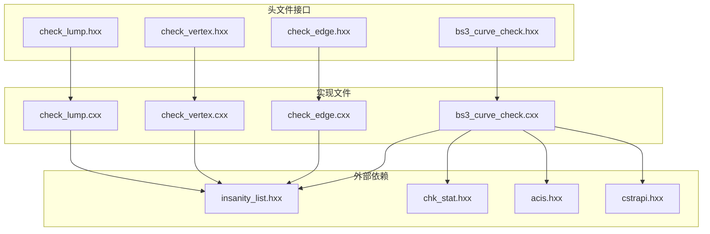
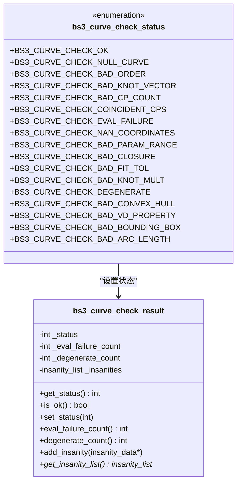
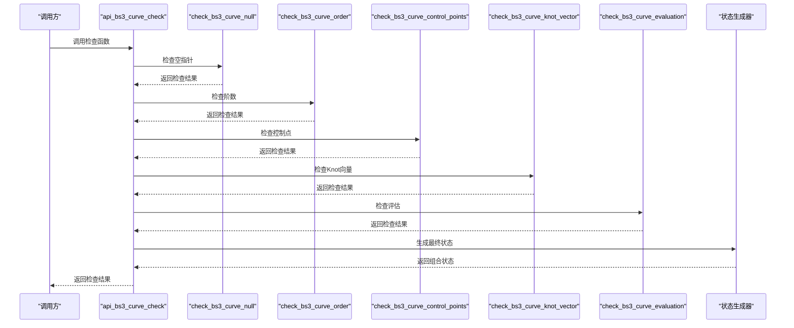
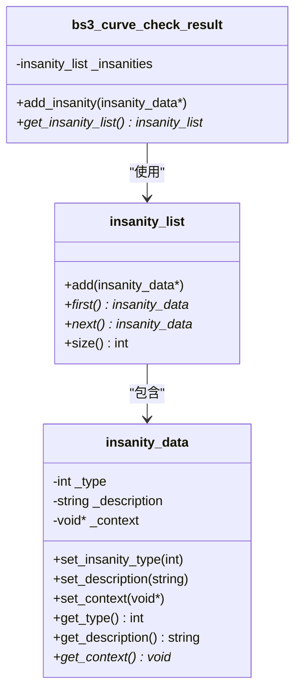
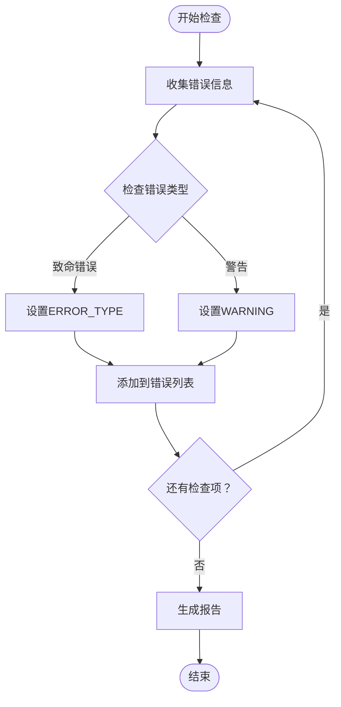
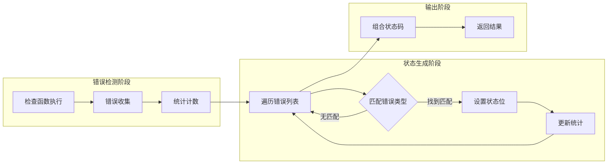
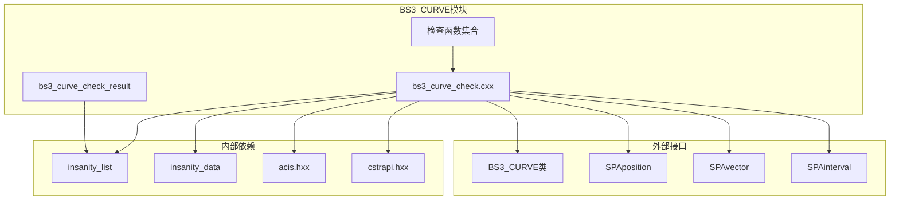

# BS3_CURVE错误处理机制

<cite>
**本文档引用的文件**
- [bs3_curve_check.hxx](file://include/bs3_curve_check.hxx)
- [bs3_curve_check.cxx](file://src/bs3_curve_check.cxx)
- [check_edge.hxx](file://include/check_edge.hxx)
- [check_vertex.hxx](file://include/check_vertex.hxx)
- [check_lump.hxx](file://include/check_lump.hxx)
</cite>

## 目录
1. [简介](#简介)
2. [项目结构](#项目结构)
3. [核心组件](#核心组件)
4. [架构概览](#架构概览)
5. [详细组件分析](#详细组件分析)
6. [依赖关系分析](#依赖关系分析)
7. [性能考虑](#性能考虑)
8. [故障排除指南](#故障排除指南)
9. [结论](#结论)

## 简介

BS3_CURVE检查模块是ACIS几何验证系统中的关键组件，负责对B样条曲线进行全面的质量检查和错误诊断。该模块实现了完整的错误处理和诊断系统，通过状态枚举、错误收集机制和详细的诊断报告，为用户提供精确的几何问题定位和修复指导。

本模块采用分层检查策略，从基础的空指针检查到复杂的几何属性验证，确保B样条曲线的完整性和正确性。错误处理机制包括实时检测、分类统计和详细报告生成，为后续的几何修复和优化提供可靠的数据支持。

## 项目结构

BS3_CURVE检查模块位于Interface项目的include和src目录中，采用标准的头文件声明和实现分离模式：

**图表来源**
- [bs3_curve_check.hxx:1-138](file://include/bs3_curve_check.hxx#L1-L138)
- [bs3_curve_check.cxx:1-1011](file://src/bs3_curve_check.cxx#L1-L1011)

**章节来源**
- [bs3_curve_check.hxx:1-138](file://include/bs3_curve_check.hxx#L1-L138)
- [bs3_curve_check.cxx:1-1011](file://src/bs3_curve_check.cxx#L1-L1011)

## 核心组件

### 错误状态枚举系统

BS3_CURVE检查模块定义了完整的错误状态枚举系统，用于标识不同类型的几何问题：

**图表来源**
- [bs3_curve_check.hxx:9-27](file://include/bs3_curve_check.hxx#L9-L27)
- [bs3_curve_check.hxx:29-49](file://include/bs3_curve_check.hxx#L29-L49)

### 错误优先级排序

根据错误的严重程度和影响范围，BS3_CURVE错误分为三个优先级级别：

**一级错误（致命错误）**：立即阻止几何操作执行
- BS3_CURVE_CHECK_NULL_CURVE：空指针引用
- BS3_CURVE_CHECK_BAD_ORDER：阶数异常
- BS3_CURVE_CHECK_BAD_KNOT_VECTOR： Knot向量无效
- BS3_CURVE_CHECK_BAD_CP_COUNT：控制点数量不足
- BS3_CURVE_CHECK_EVAL_FAILURE：评估失败
- BS3_CURVE_CHECK_NAN_COORDINATES：坐标包含NaN或无穷大
- BS3_CURVE_CHECK_BAD_PARAM_RANGE：参数范围无效
- BS3_CURVE_CHECK_BAD_CLOSURE：闭合性不匹配
- BS3_CURVE_CHECK_DEGENERATE：退化几何

**二级错误（警告）**：可能影响几何质量但不完全阻止操作
- BS3_CURVE_CHECK_BAD_FIT_TOL：拟合公差异常
- BS3_CURVE_CHECK_BAD_KNOT_MULT：Knot重数超限
- BS3_CURVE_CHECK_BAD_CONVEX_HULL：凸包违规
- BS3_CURVE_CHECK_BAD_VD_PROPERTY：变号性质违反
- BS3_CURVE_CHECK_BAD_BOUNDING_BOX：边界框问题
- BS3_CURVE_CHECK_BAD_ARC_LENGTH：弧长异常

**三级错误（信息提示）**：仅提供额外信息
- BS3_CURVE_CHECK_COINCIDENT_CPS：控制点重合

**章节来源**
- [bs3_curve_check.hxx:9-27](file://include/bs3_curve_check.hxx#L9-L27)
- [bs3_curve_check.cxx:50-150](file://src/bs3_curve_check.cxx#L50-L150)

## 架构概览

BS3_CURVE检查模块采用模块化的架构设计，每个检查函数专注于特定的几何属性验证：

**图表来源**
- [bs3_curve_check.cxx:50-150](file://src/bs3_curve_check.cxx#L50-L150)
- [bs3_curve_check.cxx:876-1010](file://src/bs3_curve_check.cxx#L876-L1010)

### 检查流程管理

模块实现了完整的检查流程管理，包括：

1. **输入验证**：检查输入参数的有效性
2. **顺序执行**：按预定义顺序执行各项检查
3. **错误收集**：将发现的问题收集到错误列表中
4. **状态聚合**：根据错误类型生成最终状态码
5. **结果返回**：提供详细的检查结果和统计信息

**章节来源**
- [bs3_curve_check.cxx:50-150](file://src/bs3_curve_check.cxx#L50-L150)
- [bs3_curve_check.cxx:876-1010](file://src/bs3_curve_check.cxx#L876-L1010)

## 详细组件分析

### 错误收集机制（insanity_list）

insanity_list是BS3_CURVE检查模块的核心错误收集组件，负责存储和管理所有发现的几何问题：

**图表来源**
- [bs3_curve_check.hxx:40-48](file://include/bs3_curve_check.hxx#L40-L48)
- [bs3_curve_check.cxx:40-48](file://src/bs3_curve_check.cxx#L40-L48)

#### 错误数据结构

每个insanity_data对象包含以下关键信息：

- **错误类型**：区分错误的严重程度（ERROR_TYPE vs WARNING）
- **描述信息**：人类可读的错误描述
- **上下文数据**：与错误相关的几何信息
- **位置信息**：错误发生的具体位置或参数值

#### 错误报告格式

错误报告采用统一的格式规范：

**图表来源**
- [bs3_curve_check.cxx:152-165](file://src/bs3_curve_check.cxx#L152-L165)
- [bs3_curve_check.cxx:178-183](file://src/bs3_curve_check.cxx#L178-L183)

**章节来源**
- [bs3_curve_check.hxx:40-48](file://include/bs3_curve_check.hxx#L40-L48)
- [bs3_curve_check.cxx:40-48](file://src/bs3_curve_check.cxx#L40-L48)

### 具体检查函数分析

#### 基础属性检查

**空指针检查**：验证BS3_CURVE指针的有效性
- 检查步骤：直接验证指针是否为空
- 错误类型：致命错误（BS3_CURVE_CHECK_NULL_CURVE）
- 处理方式：立即返回错误状态

**阶数检查**：验证B样条曲线的阶数合理性
- 合法范围：1 ≤ 阶数 ≤ 20
- 异常处理：小于1视为致命错误，超过20视为警告

**控制点检查**：验证控制点的数量和有效性
- 数量要求：控制点数量 ≥ 阶数
- 坐标验证：检查NaN和无穷大的存在
- 特殊情况：单个控制点的警告

**章节来源**
- [bs3_curve_check.cxx:152-165](file://src/bs3_curve_check.cxx#L152-L165)
- [bs3_curve_check.cxx:167-193](file://src/bs3_curve_check.cxx#L167-L193)
- [bs3_curve_check.cxx:195-244](file://src/bs3_curve_check.cxx#L195-L244)

#### 几何属性检查

**Knot向量检查**：验证Knot向量的单调性和数值有效性
- 单调性：确保Knot值非递减
- 数值检查：排除NaN和无穷大
- 结构完整性：验证向量长度符合公式n+p+1

**参数范围检查**：验证曲线参数域的有效性
- 空范围：参数范围为空时的处理
- 退化范围：参数范围过小的警告
- 数值验证：检查NaN和无穷大

**闭合性检查**：验证闭合曲线的几何一致性
- 位置一致性：起点和终点距离阈值
- 切线一致性：端点切线方向匹配度
- 角度阈值：切线夹角的容差设置

**章节来源**
- [bs3_curve_check.cxx:246-296](file://src/bs3_curve_check.cxx#L246-L296)
- [bs3_curve_check.cxx:349-391](file://src/bs3_curve_check.cxx#L349-L391)
- [bs3_curve_check.cxx:393-440](file://src/bs3_curve_check.cxx#L393-L440)

#### 数值稳定性检查

**评估稳定性检查**：验证曲线评估过程的数值稳定性
- 采样策略：均匀分布的参数采样
- 异常捕获：捕获评估过程中的异常
- 数值验证：检查评估结果的合理性

**导数检查**：验证一阶导数的数值稳定性
- 导数评估：计算各采样点的一阶导数
- 异常处理：捕获导数计算异常
- 边界条件：检查端点导数的特殊情况

**章节来源**
- [bs3_curve_check.cxx:298-347](file://src/bs3_curve_check.cxx#L298-L347)
- [bs3_curve_check.cxx:538-609](file://src/bs3_curve_check.cxx#L538-L609)

### 状态生成算法

状态生成器实现了从具体错误到通用状态码的映射：

**图表来源**
- [bs3_curve_check.cxx:91-150](file://src/bs3_curve_check.cxx#L91-L150)
- [bs3_curve_check.cxx:951-1010](file://src/bs3_curve_check.cxx#L951-L1010)

**章节来源**
- [bs3_curve_check.cxx:91-150](file://src/bs3_curve_check.cxx#L91-L150)
- [bs3_curve_check.cxx:951-1010](file://src/bs3_curve_check.cxx#L951-L1010)

## 依赖关系分析

BS3_CURVE检查模块与系统其他组件存在紧密的依赖关系：

**图表来源**
- [bs3_curve_check.hxx:4-8](file://include/bs3_curve_check.hxx#L4-L8)
- [bs3_curve_check.cxx:1-10](file://src/bs3_curve_check.cxx#L1-L10)

### 外部依赖分析

模块对外部库的依赖主要体现在：

- **ACIS几何内核**：BS3_CURVE类的几何操作
- **数学库**：SPALib提供的几何计算功能
- **内存管理**：insanity_list的动态内存分配
- **字符串处理**：错误消息的字符串匹配

**章节来源**
- [bs3_curve_check.hxx:4-8](file://include/bs3_curve_check.hxx#L4-L8)
- [bs3_curve_check.cxx:1-10](file://src/bs3_curve_check.cxx#L1-L10)

## 性能考虑

### 计算复杂度分析

BS3_CURVE检查模块的性能特征如下：

**时间复杂度**：
- 基础检查：O(1) - 简单的数值比较
- 控制点检查：O(n) - n为控制点数量
- Knot向量检查：O(m) - m为Knot数量
- 评估检查：O(k) - k为采样点数量
- 整体复杂度：O(n+m+k)

**空间复杂度**：
- 错误列表：O(e) - e为发现的错误数量
- 临时变量：O(1) - 固定数量的局部变量

### 优化策略

1. **早期退出**：在发现致命错误时立即停止进一步检查
2. **采样优化**：根据曲线复杂度调整采样密度
3. **缓存机制**：复用中间计算结果避免重复计算
4. **批量处理**：合并相似的检查操作

### 性能监控指标

- 检查执行时间
- 内存使用量
- 错误发现率
- 平均检查速度

## 故障排除指南

### 常见错误诊断方法

#### 致命错误处理

**空指针错误**：
- 症状：程序崩溃或访问违例
- 诊断：检查BS3_CURVE指针的有效性
- 解决：确保在调用前进行空指针检查

**阶数异常**：
- 症状：几何操作失败或结果异常
- 诊断：验证曲线阶数的合理性
- 解决：调整曲线阶数到合法范围

**Knot向量无效**：
- 症状：评估过程中出现异常
- 诊断：检查Knot向量的单调性和数值
- 解决：重新构造有效的Knot向量

#### 警告处理策略

**拟合公差异常**：
- 影响：可能影响几何精度
- 处理：根据应用场景调整公差值
- 监控：定期检查公差变化趋势

**凸包违规**：
- 影响：几何形状可能不符合预期
- 处理：检查控制点配置和几何约束
- 验证：通过可视化工具确认问题

### 调试技巧

1. **分步调试**：逐个执行检查函数定位问题
2. **日志记录**：启用详细的错误日志输出
3. **可视化辅助**：使用图形界面查看几何问题
4. **边界测试**：针对极端情况进行测试

### 性能优化建议

1. **批处理检查**：将多个曲线的检查合并执行
2. **并行处理**：利用多核处理器并行执行独立检查
3. **智能采样**：根据几何复杂度自适应调整采样密度
4. **缓存复用**：复用计算结果避免重复工作

**章节来源**
- [bs3_curve_check.cxx:50-150](file://src/bs3_curve_check.cxx#L50-L150)
- [bs3_curve_check.cxx:876-1010](file://src/bs3_curve_check.cxx#L876-L1010)

## 结论

BS3_CURVE检查模块通过其完善的错误处理和诊断系统，为ACIS几何验证提供了可靠的基础设施。模块的设计体现了以下特点：

**完整性**：覆盖了B样条曲线的主要几何属性和数值稳定性检查
**准确性**：通过精确的数学算法和阈值判断确保检查结果的可靠性
**效率性**：采用优化的算法和数据结构保证检查过程的高效性
**可维护性**：清晰的模块化设计便于后续的功能扩展和维护

该模块的成功实施为整个ACIS系统的几何完整性提供了重要保障，其设计理念和实现技术可以作为其他几何验证系统的参考模板。通过持续的优化和完善，BS3_CURVE检查模块将继续为CAD/CAM应用提供高质量的几何验证服务。