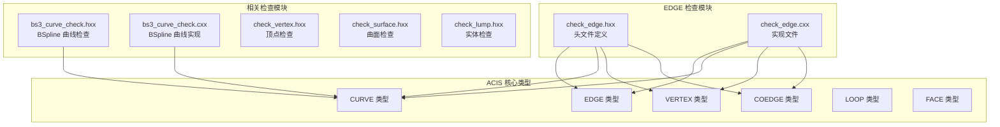
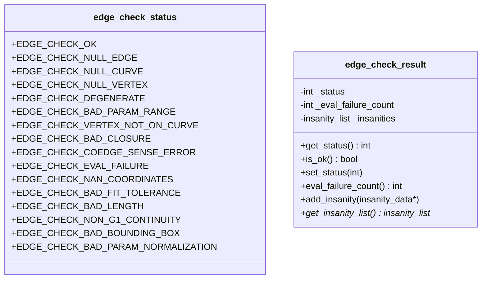
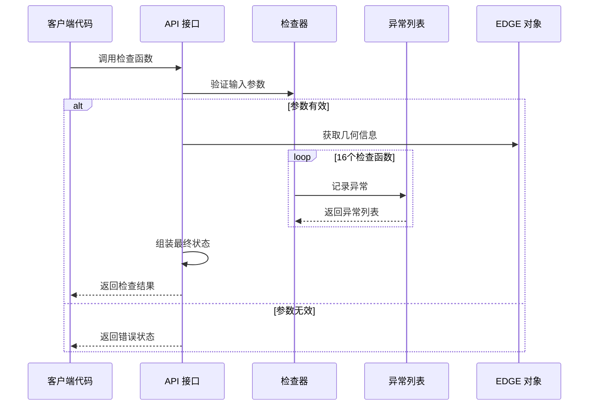
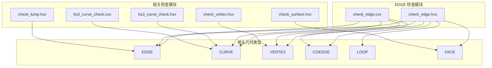
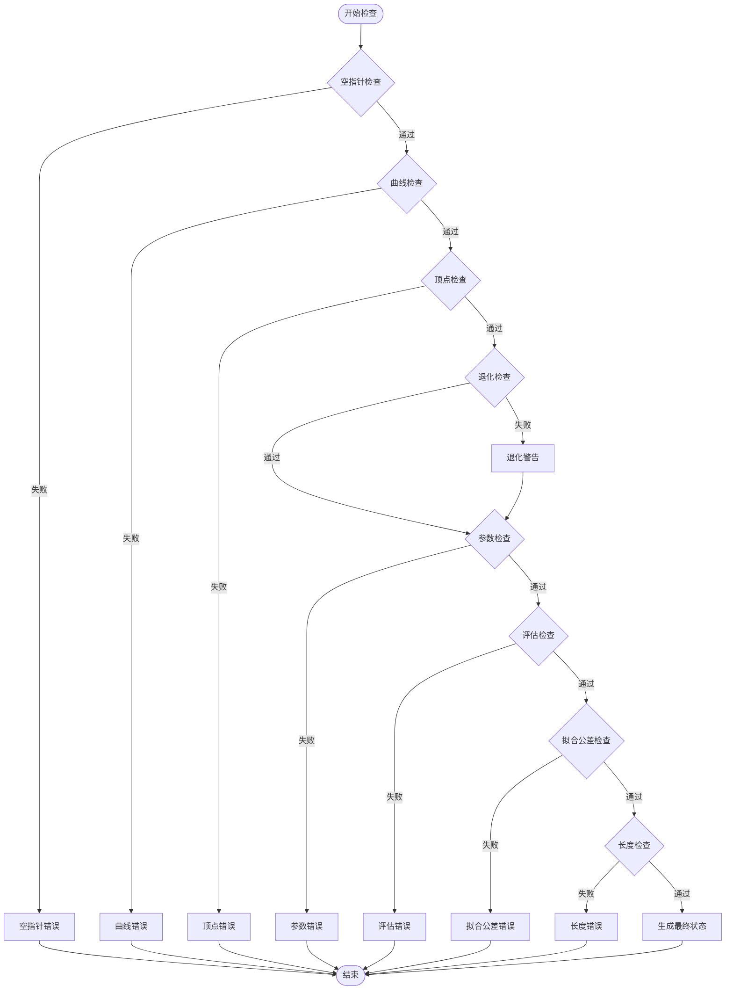

# EDGE 检查函数详解

<cite>
**本文档引用的文件**
- [check_edge.hxx](file://include/check_edge.hxx)
- [check_edge.cxx](file://src/check_edge.cxx)
- [bs3_curve_check.hxx](file://include/bs3_curve_check.hxx)
- [bs3_curve_check.cxx](file://src/bs3_curve_check.cxx)
- [check_vertex.hxx](file://include/check_vertex.hxx)
- [check_surface.hxx](file://include/check_surface.hxx)
- [check_lump.hxx](file://include/check_lump.hxx)
</cite>

## 更新摘要
**所做更改**
- 更新了拟合公差检查函数的实现细节，增加了对 NaN 和无穷大值的安全检查
- 新增了无效边缘拟合公差的异常处理机制
- 改进了公差处理的健壮性，防止因数值异常导致的处理失败

## 目录
1. [简介](#简介)
2. [项目结构](#项目结构)
3. [核心组件](#核心组件)
4. [架构概览](#架构概览)
5. [详细组件分析](#详细组件分析)
6. [依赖关系分析](#依赖关系分析)
7. [性能考虑](#性能考虑)
8. [故障排除指南](#故障排除指南)
9. [结论](#结论)

## 简介

本文档为 EDGE 检查模块的16个具体检查函数提供详细的技术文档。这些检查函数用于验证几何模型中边（EDGE）的有效性和完整性，确保几何数据符合 ACIS 几何内核的要求。每个检查函数都包含数学原理、ACIS API 调用方式、错误检测机制和使用示例。

**更新** 本版本反映了最新的公差处理改进，特别加强了对无效边缘拟合公差的安全检查，防止 NaN 和无限值导致的处理失败。

## 项目结构

EDGE 检查模块位于 ACIS 几何内核接口层，主要包含以下文件：

**图表来源**
- [check_edge.hxx:1-130](file://include/check_edge.hxx#L1-L130)
- [check_edge.cxx:1-890](file://src/check_edge.cxx#L1-L890)

**章节来源**
- [check_edge.hxx:1-130](file://include/check_edge.hxx#L1-L130)
- [check_edge.cxx:1-890](file://src/check_edge.cxx#L1-L890)

## 核心组件

EDGE 检查模块的核心组件包括状态枚举、结果类和16个具体的检查函数：

### 状态枚举定义

**图表来源**
- [check_edge.hxx:9-46](file://include/check_edge.hxx#L9-L46)

### 主要 API 接口

EDGE 检查模块提供了两种主要的 API 接口：

1. **错误收集模式** (`api_check_edge_errors`)
2. **状态返回模式** (`api_check_edge`)

**章节来源**
- [check_edge.hxx:48-127](file://include/check_edge.hxx#L48-L127)
- [check_edge.cxx:47-142](file://src/check_edge.cxx#L47-L142)

## 架构概览

EDGE 检查模块采用分层架构设计，实现了从高层 API 到底层具体检查函数的完整检查流程：

**图表来源**
- [check_edge.cxx:47-142](file://src/check_edge.cxx#L47-L142)
- [check_edge.cxx:762-889](file://src/check_edge.cxx#L762-L889)

## 详细组件分析

### 1. 空指针检查 (check_edge_null)

**数学原理**: 检查 EDGE 指针是否为空，这是所有后续操作的前提条件。

**ACIS API 调用方式**:
- 直接检查指针有效性
- 使用 `identity()` 方法验证对象类型

**错误检测机制**:
- 指针为空时记录 ERROR_TYPE 异常
- 返回 FALSE 表示检查失败

**使用示例路径**: [check_edge_null 示例:144-157](file://src/check_edge.cxx#L144-L157)

**章节来源**
- [check_edge.cxx:144-157](file://src/check_edge.cxx#L144-L157)

### 2. 曲线有效性检查 (check_edge_curve)

**数学原理**: 验证 EDGE 关联的 CURVE 对象是否存在且有效。

**ACIS API 调用方式**:
- 使用 `curfi()` 获取关联的 CURVE
- 检查 CURVE 指针有效性

**错误检测机制**:
- CURVE 为空时记录 ERROR_TYPE 异常
- 返回 FALSE 表示检查失败

**使用示例路径**: [check_edge_curve 示例:159-177](file://src/check_edge.cxx#L159-L177)

**章节来源**
- [check_edge.cxx:159-177](file://src/check_edge.cxx#L159-L177)

### 3. 顶点有效性检查 (check_edge_vertices)

**数学原理**: 验证 EDGE 的起始和终止顶点是否存在且坐标有效。

**ACIS API 调用方式**:
- 使用 `start()` 和 `end()` 获取顶点
- 使用 `point()` 获取顶点位置
- 使用 `position()` 获取坐标值

**错误检测机制**:
- 顶点为空或坐标包含 NaN/Inf 时记录异常
- 分别检查起始和终止顶点

**使用示例路径**: [check_edge_vertices 示例:179-263](file://src/check_edge.cxx#L179-L263)

**章节来源**
- [check_edge.cxx:179-263](file://src/check_edge.cxx#L179-L263)

### 4. 退化检查 (check_edge_degenerate)

**数学原理**: 检查 EDGE 的长度是否小于容差阈值，判断是否为退化边。

**ACIS API 调用方式**:
- 获取起始和终止顶点坐标
- 计算两点间距离
- 使用 `SPAresabs` 作为容差

**错误检测机制**:
- 距离小于容差时记录 WARNING 异常
- 返回 FALSE 表示非正常状态

**使用示例路径**: [check_edge_degenerate 示例:265-300](file://src/check_edge.cxx#L265-L300)

**章节来源**
- [check_edge.cxx:265-300](file://src/check_edge.cxx#L265-L300)

### 5. 参数域检查 (check_edge_parameter_range)

**数学原理**: 验证 EDGE 的参数范围是否有效且合理。

**ACIS API 调用方式**:
- 使用 `param_range()` 获取参数区间
- 检查区间的有效性

**错误检测机制**:
- 区间为空或包含 NaN/Inf 时记录异常
- 参数范围过小时记录 WARNING

**使用示例路径**: [check_edge_parameter_range 示例:302-344](file://src/check_edge.cxx#L302-L344)

**章节来源**
- [check_edge.cxx:302-344](file://src/check_edge.cxx#L302-L344)

### 6. 顶点在曲线上检查 (check_edge_vertex_on_curve)

**数学原理**: 验证 EDGE 的顶点是否精确位于曲线上对应参数位置。

**ACIS API 调用方式**:
- 使用 `eval_position()` 在参数位置评估曲线
- 比较顶点坐标与曲线评估结果

**错误检测机制**:
- 坐标差异超过容差时记录 ERROR 异常
- 分别检查起始和终止顶点

**使用示例路径**: [check_edge_vertex_on_curve 示例:346-397](file://src/check_edge.cxx#L346-L397)

**章节来源**
- [check_edge.cxx:346-397](file://src/check_edge.cxx#L346-L397)

### 7. 闭合检查 (check_edge_closure)

**数学原理**: 验证标记为闭合的 EDGE 是否满足几何闭合条件。

**ACIS API 调用方式**:
- 使用 `closed()` 检查闭合标志
- 使用 `eval_position()` 比较首尾位置
- 检查顶点是否相同

**错误检测机制**:
- 位置不匹配时记录 ERROR 异常
- 顶点不一致时记录 ERROR 异常

**使用示例路径**: [check_edge_closure 示例:399-453](file://src/check_edge.cxx#L399-L453)

**章节来源**
- [check_edge.cxx:399-453](file://src/check_edge.cxx#L399-L453)

### 8. 方向一致性检查 (check_edge_coedge_sense)

**数学原理**: 验证 EDGE 的共边（coedge）与其伙伴边的方向一致性。

**ACIS API 调用方式**:
- 使用 `coedge()` 获取共边
- 使用 `partner()` 获取伙伴边
- 使用 `sense()` 获取方向

**错误检测机制**:
- 共边与伙伴边方向相同时记录 WARNING 异常

**使用示例路径**: [check_edge_coedge_sense 示例:455-489](file://src/check_edge.cxx#L455-L489)

**章节来源**
- [check_edge.cxx:455-489](file://src/check_edge.cxx#L455-L489)

### 9. 评估检查 (check_edge_evaluation)

**数学原理**: 对 EDGE 关联的曲线进行采样评估，确保评估过程稳定可靠。

**ACIS API 调用方式**:
- 使用 `eval_position()` 进行多次采样
- 捕获评估异常

**错误检测机制**:
- 评估返回 NaN/Inf 或抛出异常时记录 ERROR 异常

**使用示例路径**: [check_edge_evaluation 示例:491-545](file://src/check_edge.cxx#L491-L545)

**章节来源**
- [check_edge.cxx:491-545](file://src/check_edge.cxx#L491-L545)

### 10. 拟合公差检查 (check_edge_fit_tolerance)

**数学原理**: 验证 EDGE 的拟合公差是否在合理范围内，并防止数值异常。

**ACIS API 调用方式**:
- 使用 `fit_tolerance()` 获取公差值
- 检查公差值的数值有效性

**错误检测机制**:
- 公差为 NaN 或无穷大时记录 ERROR 异常
- 公差为负数时记录 ERROR 异常
- 公差过大时记录 WARNING 异常

**更新** 新增了对 NaN 和无穷大值的专门检查，确保无效边缘拟合公差得到安全处理。

**使用示例路径**: [check_edge_fit_tolerance 示例:547-582](file://src/check_edge.cxx#L547-L582)

**章节来源**
- [check_edge.cxx:547-582](file://src/check_edge.cxx#L547-L582)

### 11. 长度检查 (check_edge_length)

**数学原理**: 验证 EDGE 的几何长度是否有效。

**ACIS API 调用方式**:
- 计算顶点间距离
- 检查长度值的有效性

**错误检测机制**:
- 长度为负数时记录 ERROR 异常
- 长度为 NaN 或无穷大时记录 ERROR 异常

**使用示例路径**: [check_edge_length 示例:584-621](file://src/check_edge.cxx#L584-L621)

**章节来源**
- [check_edge.cxx:584-621](file://src/check_edge.cxx#L584-L621)

### 12. G1 连续性检查 (check_edge_g1_continuity)

**数学原理**: 验证闭合 EDGE 在连接处的切线连续性。

**ACIS API 调用方式**:
- 使用 `eval_deriv()` 获取切线向量
- 计算切线夹角余弦值

**错误检测机制**:
- 切线方向差异过大时记录 WARNING 异常

**使用示例路径**: [check_edge_g1_continuity 示例:623-667](file://src/check_edge.cxx#L623-L667)

**章节来源**
- [check_edge.cxx:623-667](file://src/check_edge.cxx#L623-L667)

### 13. 包围盒检查 (check_edge_bounding_box)

**数学原理**: 验证 EDGE 顶点坐标的包围盒有效性。

**ACIS API 调用方式**:
- 获取顶点坐标并检查包围盒约束

**错误检测机制**:
- 坐标包含 NaN/Inf 时记录 ERROR 异常

**使用示例路径**: [check_edge_bounding_box 示例:669-719](file://src/check_edge.cxx#L669-L719)

**章节来源**
- [check_edge.cxx:669-719](file://src/check_edge.cxx#L669-L719)

### 14. 参数归一化检查 (check_edge_param_normalization)

**数学原理**: 验证 EDGE 参数值的合理性。

**ACIS API 调用方式**:
- 获取起始和终止参数
- 检查参数值的有效性

**错误检测机制**:
- 参数包含 NaN/Inf 时记录 ERROR 异常
- 非闭合情况下起始参数大于终止参数时记录 WARNING 异常

**使用示例路径**: [check_edge_param_normalization 示例:721-760](file://src/check_edge.cxx#L721-L760)

**章节来源**
- [check_edge.cxx:721-760](file://src/check_edge.cxx#L721-L760)

### 15. 错误收集模式 API (api_check_edge_errors)

**数学原理**: 提供详细的错误收集和状态映射功能。

**ACIS API 调用方式**:
- 调用所有检查函数并将结果汇总到 edge_check_result
- 自动映射描述字符串到状态位

**错误检测机制**:
- 将异常描述与状态枚举进行字符串匹配
- 支持多状态组合

**使用示例路径**: [api_check_edge_errors 示例:47-142](file://src/check_edge.cxx#L47-L142)

**章节来源**
- [check_edge.cxx:47-142](file://src/check_edge.cxx#L47-L142)

### 16. 状态返回模式 API (api_check_edge)

**数学原理**: 提供简洁的状态返回接口。

**ACIS API 调用方式**:
- 顺序调用所有检查函数
- 统计异常数量并返回组合状态

**错误检测机制**:
- 每个检查函数返回 FALSE 时增加计数
- 最终返回组合状态值

**使用示例路径**: [api_check_edge 示例:762-889](file://src/check_edge.cxx#L762-L889)

**章节来源**
- [check_edge.cxx:762-889](file://src/check_edge.cxx#L762-L889)

## 依赖关系分析

EDGE 检查模块与其他几何检查模块存在密切的依赖关系：

**图表来源**
- [check_edge.hxx:1-130](file://include/check_edge.hxx#L1-L130)
- [bs3_curve_check.hxx:1-138](file://include/bs3_curve_check.hxx#L1-L138)
- [check_vertex.hxx:1-111](file://include/check_vertex.hxx#L1-L111)
- [check_surface.hxx:1-133](file://include/check_surface.hxx#L1-L133)
- [check_lump.hxx:1-117](file://include/check_lump.hxx#L1-L117)

### 外部依赖

EDGE 检查模块依赖于以下外部组件：

1. **ACIS 核心类型**: EDGE、CURVE、VERTEX、COEDGE 等几何类型
2. **数学库**: 标准 C++ 数学函数（`std::isnan`、`std::isinf`）
3. **容差常量**: `SPAresabs`、`SPAresnor` 等几何容差常量
4. **异常处理**: `try-catch` 语句块处理评估异常

**章节来源**
- [check_edge.cxx:1-12](file://src/check_edge.cxx#L1-L12)
- [check_edge.hxx:4-8](file://include/check_edge.hxx#L4-L8)

## 性能考虑

### 时间复杂度分析

1. **空指针检查**: O(1) - 直接指针比较
2. **曲线有效性检查**: O(1) - 指针访问
3. **顶点有效性检查**: O(1) - 固定次数的属性访问
4. **退化检查**: O(1) - 向量运算
5. **参数域检查**: O(1) - 区间属性检查
6. **顶点在曲线上检查**: O(1) - 固定次数评估
7. **闭合检查**: O(1) - 固定次数评估
8. **方向一致性检查**: O(n) - n 为共边数量
9. **评估检查**: O(m) - m 为采样点数量
10. **拟合公差检查**: O(1) - 数值比较和异常检查
11. **长度检查**: O(1) - 向量运算
12. **G1 连续性检查**: O(1) - 固定次数评估
13. **包围盒检查**: O(1) - 坐标检查
14. **参数归一化检查**: O(1) - 数值比较

### 内存使用

- 每个检查函数使用常量级额外内存
- 异常列表按需分配，最大大小等于检查失败的数量
- 评估检查使用固定大小的临时缓冲区

### 优化建议

1. **批量检查**: 使用 `api_check_edge_errors` 进行一次性全面检查
2. **早停机制**: 对于严重错误（如空指针）立即停止进一步检查
3. **缓存策略**: 对重复计算的结果进行缓存
4. **并行处理**: 对独立的检查函数可以并行执行

## 故障排除指南

### 常见错误类型

**图表来源**
- [check_edge.cxx:47-142](file://src/check_edge.cxx#L47-L142)

### 错误诊断步骤

1. **优先级排序**: 按照错误严重程度排序处理
2. **定位问题**: 使用异常描述中的关键词定位具体问题
3. **修复建议**: 根据错误类型提供相应的修复建议
4. **验证修复**: 重新运行检查确认问题已解决

### 调试技巧

1. **启用详细日志**: 使用 `api_check_edge_errors` 获取完整的异常列表
2. **分步检查**: 单独调用特定的检查函数进行问题定位
3. **可视化调试**: 结合几何可视化工具检查具体问题
4. **性能监控**: 监控检查函数的执行时间和内存使用

**章节来源**
- [check_edge.cxx:83-141](file://src/check_edge.cxx#L83-L141)

## 结论

EDGE 检查模块提供了全面而系统的几何验证功能，涵盖了从基础的空指针检查到高级的连续性检查等16个方面。该模块具有以下特点：

1. **完整性**: 涵盖了 EDGE 几何的所有重要属性和约束
2. **可扩展性**: 采用模块化设计，易于添加新的检查项
3. **实用性**: 提供多种 API 接口，适应不同的使用场景
4. **可靠性**: 严格的错误检测和异常处理机制

**更新** 最新的公差处理改进显著增强了模块的健壮性，特别是对无效边缘拟合公差的安全检查，有效防止了 NaN 和无限值导致的处理失败，确保了系统在各种边界条件下的稳定运行。

通过正确使用这些检查函数，开发者可以有效地验证和维护几何模型的质量，确保 ACIS 几何内核的稳定运行。