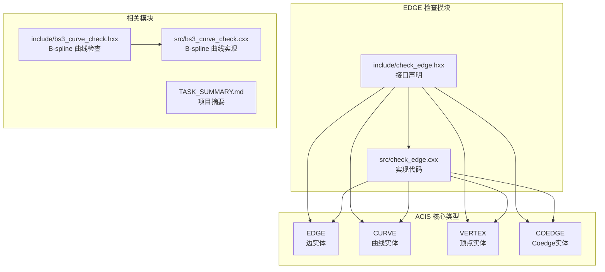
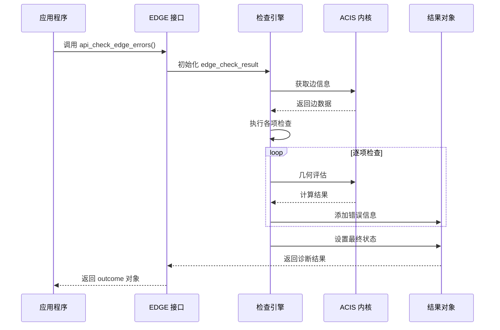
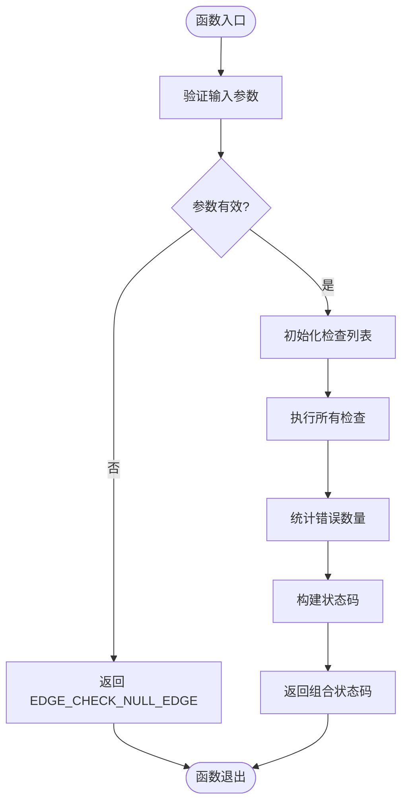
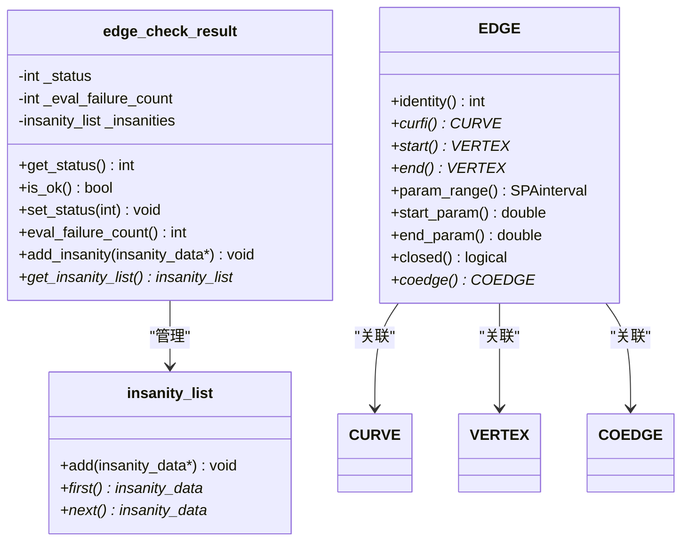
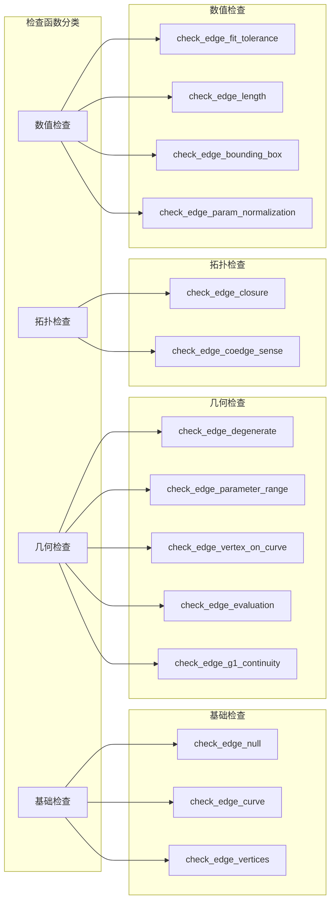
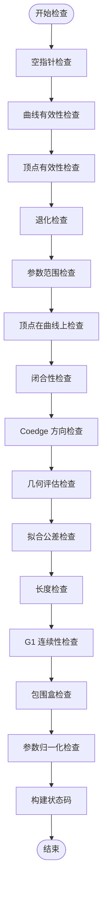
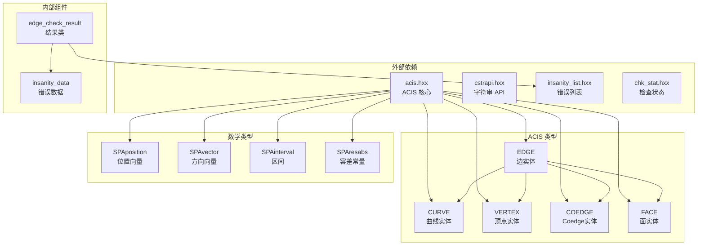
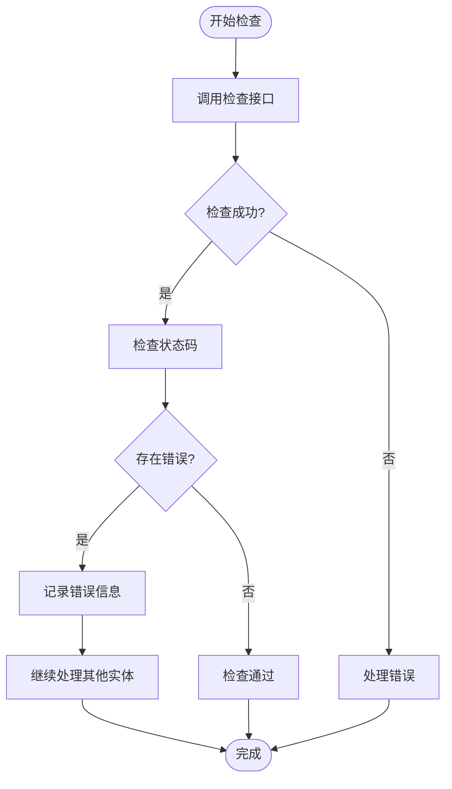

# EDGE 检查接口

<cite>
**本文档引用的文件**
- [check_edge.hxx](file://include/check_edge.hxx)
- [check_edge.cxx](file://src/check_edge.cxx)
- [bs3_curve_check.hxx](file://include/bs3_curve_check.hxx)
- [bs3_curve_check.cxx](file://src/bs3_curve_check.cxx)
- [TASK_SUMMARY.md](file://TASK_SUMMARY.md)
</cite>

## 目录
1. [简介](#简介)
2. [项目结构](#项目结构)
3. [核心组件](#核心组件)
4. [架构概览](#架构概览)
5. [详细组件分析](#详细组件分析)
6. [依赖关系分析](#依赖关系分析)
7. [性能考虑](#性能考虑)
8. [故障排除指南](#故障排除指南)
9. [结论](#结论)

## 简介

EDGE 检查接口是基于 ACIS 3D 内核开发的几何实体检查模块，专门用于验证 EDGE（边）实体的完整性和有效性。该接口提供了两种检查模式：快速检测模式和详细诊断模式，能够全面检查边的拓扑连接性、几何有效性、数值稳定性等多个维度。

本接口实现了 15 种不同的检查类型，包括空指针检查、退化检查、参数范围检查、顶点位置检查、闭合性检查、Coedge 方向一致性检查等，确保三维模型中的边实体符合几何建模的标准要求。

## 项目结构

EDGE 检查接口位于 ACIS 几何检查系统的子模块中，采用标准的 C++ 模块化设计：



**图表来源**
- [check_edge.hxx:1-130](file://include/check_edge.hxx#L1-L130)
- [check_edge.cxx:1-890](file://src/check_edge.cxx#L1-L890)

**章节来源**
- [check_edge.hxx:1-130](file://include/check_edge.hxx#L1-L130)
- [check_edge.cxx:1-890](file://src/check_edge.cxx#L1-L890)
- [TASK_SUMMARY.md:116-159](file://TASK_SUMMARY.md#L116-L159)

## 核心组件

EDGE 检查接口包含以下核心组件：

### 主要接口函数

1. **快速检测接口**: `api_check_edge()`
   - 返回类型：`int`（状态码）
   - 功能：快速检查边的有效性，返回组合状态码
   - 性能：O(n) 时间复杂度，n 为检查项数量

2. **详细诊断接口**: `api_check_edge_errors()`
   - 返回类型：`outcome`（结果对象）
   - 功能：提供详细的错误诊断信息和统计
   - 性能：O(n*m) 时间复杂度，其中 m 为采样点数量

### 状态枚举

EDGE 检查状态枚举定义了 15 种不同的错误类型：

| 状态值 | 值 | 描述 |
|--------|-----|------|
| `EDGE_CHECK_OK` | 0 | 无错误 |
| `EDGE_CHECK_NULL_EDGE` | 1<<0 | 边为空 |
| `EDGE_CHECK_NULL_CURVE` | 1<<1 | 曲线为空 |
| `EDGE_CHECK_NULL_VERTEX` | 1<<2 | 顶点为空 |
| `EDGE_CHECK_DEGENERATE` | 1<<3 | 退化边 |
| `EDGE_CHECK_BAD_PARAM_RANGE` | 1<<4 | 参数域异常 |
| `EDGE_CHECK_VERTEX_NOT_ON_CURVE` | 1<<5 | 顶点不在曲线上 |
| `EDGE_CHECK_BAD_CLOSURE` | 1<<6 | 闭合异常 |
| `EDGE_CHECK_COEDGE_SENSE_ERROR` | 1<<7 | Coedge 方向错误 |
| `EDGE_CHECK_EVAL_FAILURE` | 1<<8 | 评估失败 |
| `EDGE_CHECK_NAN_COORDINATES` | 1<<9 | NaN/Inf 坐标 |
| `EDGE_CHECK_BAD_FIT_TOLERANCE` | 1<<10 | 拟合公差异常 |
| `EDGE_CHECK_BAD_LENGTH` | 1<<11 | 长度异常 |
| `EDGE_CHECK_NON_G1_CONTINUITY` | 1<<12 | G1 连续性问题 |
| `EDGE_CHECK_BAD_BOUNDING_BOX` | 1<<13 | 包围盒异常 |
| `EDGE_CHECK_BAD_PARAM_NORMALIZATION` | 1<<14 | 参数归一化问题 |

### 结果类

`edge_check_result` 类提供了丰富的诊断信息：
- 状态查询方法
- 错误统计功能
- 愚人节列表管理
- 异常数据收集

**章节来源**
- [check_edge.hxx:9-46](file://include/check_edge.hxx#L9-L46)
- [check_edge.hxx:124-127](file://include/check_edge.hxx#L124-L127)
- [check_edge.hxx:48-52](file://include/check_edge.hxx#L48-L52)

## 架构概览

EDGE 检查接口采用分层架构设计，实现了清晰的关注点分离：

```mermaid
graph TB
subgraph "应用层"
A[调用者代码]
end
subgraph "接口层"
B[api_check_edge()<br/>快速检测]
C[api_check_edge_errors()<br/>详细诊断]
end
subgraph "检查引擎层"
D[edge_check_result<br/>结果管理]
E[检查函数集合<br/>16个具体检查]
end
subgraph "底层支持层"
F[insanity_list<br/>错误列表]
G[insanity_data<br/>错误详情]
H[ACIS 类型<br/>EDGE/CURVE等]
end
A --> B
A --> C
B --> D
C --> D
D --> E
E --> F
E --> G
E --> H
```

**图表来源**
- [check_edge.cxx:47-142](file://src/check_edge.cxx#L47-L142)
- [check_edge.cxx:13-45](file://src/check_edge.cxx#L13-L45)

### 数据流架构



**图表来源**
- [check_edge.cxx:47-142](file://src/check_edge.cxx#L47-L142)

## 详细组件分析

### 快速检测接口分析

#### 接口定义与参数

快速检测接口 `api_check_edge()` 提供简洁高效的检查能力：



**图表来源**
- [check_edge.cxx:762-889](file://src/check_edge.cxx#L762-L889)

#### 参数说明

| 参数名称 | 类型 | 输入/输出 | 描述 |
|----------|------|-----------|------|
| `edge` | `EDGE*` | 输入 | 要检查的边实体指针 |
| `insanity_count` | `int*` | 输出 | 错误计数指针（可选） |

#### 返回值说明

- **返回值类型**: `int`（状态码）
- **返回值含义**: 组合的错误状态标志位
- **使用方式**: 使用按位与操作符检查特定错误类型

#### 性能特点

- **时间复杂度**: O(n)，n 为检查项数量
- **空间复杂度**: O(m)，m 为错误数量
- **适用场景**: 大规模批量检查、实时验证

### 详细诊断接口分析

#### 接口定义与参数

详细诊断接口 `api_check_edge_errors()` 提供完整的诊断信息：



**图表来源**
- [check_edge.hxx:28-46](file://include/check_edge.hxx#L28-L46)
- [check_edge.hxx:4-8](file://include/check_edge.hxx#L4-L8)

#### 参数说明

| 参数名称 | 类型 | 输入/输出 | 描述 |
|----------|------|-----------|------|
| `edge` | `EDGE*` | 输入 | 要检查的边实体指针 |
| `result` | `edge_check_result&` | 输出 | 诊断结果对象引用 |
| `ao` | `AcisOptions*` | 输入 | 可选的选项参数 |

#### 返回值说明

- **返回值类型**: `outcome`（ACIS 标准结果类型）
- **返回值含义**: 操作成功或失败的状态
- **错误处理**: 通过 `outcome` 对象的成员函数检查

#### 性能特点

- **时间复杂度**: O(n*m)，n 为检查项数量，m 为采样点数量
- **空间复杂度**: O(m)，存储采样点信息
- **适用场景**: 详细调试、质量控制、错误定位

### 检查函数族分析

EDGE 检查接口包含 16 个具体的检查函数，每个函数负责特定类型的验证：

#### 核心检查函数



**图表来源**
- [check_edge.cxx:144-890](file://src/check_edge.cxx#L144-L890)

#### 检查流程图



**图表来源**
- [check_edge.cxx:47-142](file://src/check_edge.cxx#L47-L142)

**章节来源**
- [check_edge.hxx:48-122](file://include/check_edge.hxx#L48-L122)
- [check_edge.cxx:47-890](file://src/check_edge.cxx#L47-L890)

## 依赖关系分析

EDGE 检查接口依赖于多个 ACIS 核心类型和工具类：



**图表来源**
- [check_edge.hxx:4-8](file://include/check_edge.hxx#L4-L8)
- [check_edge.cxx:1-12](file://src/check_edge.cxx#L1-L12)

### 关键依赖关系

1. **ACIS 类型依赖**: 所有检查都直接依赖于 ACIS 的核心几何类型
2. **数学运算依赖**: 使用 SPA 数学库进行几何计算
3. **错误报告机制**: 通过 `insanity_list` 和 `insanity_data` 提供详细的错误信息
4. **容差处理**: 使用 `SPAresabs` 和 `SPAresnor` 进行数值比较

**章节来源**
- [check_edge.hxx:4-8](file://include/check_edge.hxx#L4-L8)
- [check_edge.cxx:1-12](file://src/check_edge.cxx#L1-L12)

## 性能考虑

### 时间复杂度分析

EDGE 检查接口的时间复杂度主要取决于检查项的数量和几何评估的采样点数量：

- **快速检测**: O(n)，其中 n 为检查项数量（固定为 16 项）
- **详细诊断**: O(n*m)，其中 m 为几何评估的采样点数量（通常为 15-20 个点）

### 空间复杂度分析

- **内存占用**: O(m)，主要用于存储采样点和错误信息
- **错误列表**: 动态增长，最大约为检查项数量
- **临时变量**: 常数级额外内存

### 性能优化策略

1. **早期退出**: 发现严重错误时立即停止进一步检查
2. **采样优化**: 合理设置采样点数量平衡精度和性能
3. **缓存利用**: 利用 ACIS 内部缓存减少重复计算
4. **批量处理**: 支持对多个边实体进行批量检查

## 故障排除指南

### 常见错误类型及处理

#### 空指针相关错误

| 错误类型 | 触发条件 | 处理建议 |
|----------|----------|----------|
| `EDGE_CHECK_NULL_EDGE` | 边指针为空或类型不正确 | 检查边实体是否正确创建 |
| `EDGE_CHECK_NULL_CURVE` | 边关联的曲线为空 | 验证边的几何定义 |
| `EDGE_CHECK_NULL_VERTEX` | 边端点顶点为空 | 检查边的拓扑连接 |

#### 几何有效性错误

| 错误类型 | 触发条件 | 处理建议 |
|----------|----------|----------|
| `EDGE_CHECK_DEGENERATE` | 边长度过小 | 检查几何建模精度 |
| `EDGE_CHECK_BAD_PARAM_RANGE` | 参数范围无效 | 验证参数域定义 |
| `EDGE_CHECK_VERTEX_NOT_ON_CURVE` | 顶点位置与曲线不匹配 | 检查几何一致性 |

#### 数值稳定性错误

| 错误类型 | 触发条件 | 处理建议 |
|----------|----------|----------|
| `EDGE_CHECK_NAN_COORDINATES` | 坐标包含 NaN 或 Inf | 检查输入数据质量 |
| `EDGE_CHECK_EVAL_FAILURE` | 几何评估抛出异常 | 验证几何定义完整性 |

### 最佳实践

#### 错误处理模式



#### 状态检查最佳实践

1. **使用位操作**: 使用按位与操作符检查特定错误类型
2. **错误分类**: 将错误分为严重错误和警告两类
3. **日志记录**: 详细记录错误发生的位置和原因
4. **恢复策略**: 为不同类型的错误制定相应的恢复策略

**章节来源**
- [check_edge.hxx:9-26](file://include/check_edge.hxx#L9-L26)
- [check_edge.cxx:47-142](file://src/check_edge.cxx#L47-L142)

## 结论

EDGE 检查接口是一个功能完善、设计合理的几何实体验证模块。它提供了两种互补的检查模式，既能满足快速验证的需求，又能提供详细的诊断信息。

### 主要优势

1. **完整性**: 覆盖了边实体的所有重要检查维度
2. **灵活性**: 支持快速检测和详细诊断两种模式
3. **可扩展性**: 模块化设计便于添加新的检查类型
4. **性能**: 优化的算法实现保证了良好的运行效率

### 应用场景

- **CAD 软件**: 用于验证导入的几何模型
- **网格生成**: 在网格划分前检查几何质量
- **仿真准备**: 确保有限元分析的几何模型有效
- **质量控制**: 自动化检查几何模型的完整性

### 发展建议

1. **性能监控**: 添加性能指标收集功能
2. **配置选项**: 提供更多可配置的检查参数
3. **并行处理**: 支持多线程并行检查大量实体
4. **可视化**: 提供错误位置的可视化显示

通过合理使用 EDGE 检查接口，开发者可以显著提高三维几何模型的质量和可靠性，为后续的几何处理和分析奠定坚实的基础。