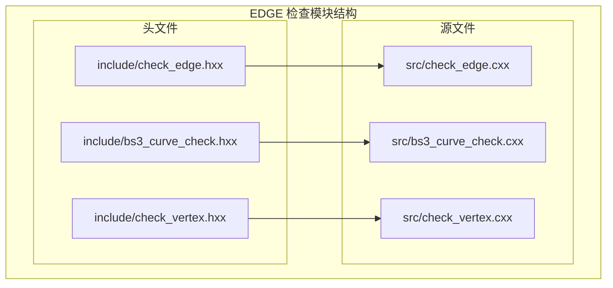
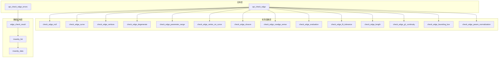
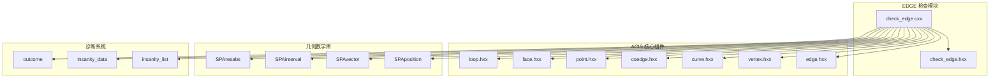

# EDGE 检查模块

<cite>
**本文档引用的文件**
- [check_edge.hxx](file://include/check_edge.hxx)
- [check_edge.cxx](file://src/check_edge.cxx)
- [bs3_curve_check.hxx](file://include/bs3_curve_check.hxx)
- [bs3_curve_check.cxx](file://src/bs3_curve_check.cxx)
- [check_vertex.hxx](file://include/check_vertex.hxx)
</cite>

## 目录
1. [简介](#简介)
2. [项目结构](#项目结构)
3. [核心组件](#核心组件)
4. [架构概览](#架构概览)
5. [详细组件分析](#详细组件分析)
6. [依赖关系分析](#依赖关系分析)
7. [性能考虑](#性能考虑)
8. [故障排除指南](#故障排除指南)
9. [结论](#结论)

## 简介

EDGE 检查模块是 ACIS 几何建模系统中的关键组件，专门负责验证 EDGE 实体的完整性和有效性。该模块提供了16个专门的检查函数，涵盖了从基础的空指针检查到高级的几何连续性分析等各个方面。每个检查函数都针对特定的几何属性进行验证，确保 EDGE 实体符合 ACIS 的数据结构要求和几何约束条件。

本模块采用模块化设计，通过独立的检查函数实现单一职责原则，便于维护和扩展。所有检查结果以统一的错误状态枚举进行管理，支持详细的诊断信息收集和报告功能。

## 项目结构

EDGE 检查模块位于 Interface 目录下，采用标准的头文件/源文件分离结构：

**图表来源**
- [check_edge.hxx:1-130](file://include/check_edge.hxx#L1-L130)
- [check_edge.cxx:1-890](file://src/check_edge.cxx#L1-L890)

**章节来源**
- [check_edge.hxx:1-130](file://include/check_edge.hxx#L1-L130)
- [check_edge.cxx:1-890](file://src/check_edge.cxx#L1-L890)

## 核心组件

### 错误状态枚举

EDGE 检查模块定义了完整的错误状态枚举，用于标识不同类型的检查失败情况：

| 枚举值 | 值 | 说明 |
|--------|-----|------|
| `EDGE_CHECK_OK` | 0 | 无错误 |
| `EDGE_CHECK_NULL_EDGE` | 1<<0 | 边为空 |
| `EDGE_CHECK_NULL_CURVE` | 1<<1 | 曲线为空 |
| `EDGE_CHECK_NULL_VERTEX` | 1<<2 | 顶点为空 |
| `EDGE_CHECK_DEGENERATE` | 1<<3 | 退化边 |
| `EDGE_CHECK_BAD_PARAM_RANGE` | 1<<4 | 参数域异常 |
| `EDGE_CHECK_VERTEX_NOT_ON_CURVE` | 1<<5 | 顶点不在曲线上 |
| `EDGE_CHECK_BAD_CLOSURE` | 1<<6 | 闭合异常 |
| `EDGE_CHECK_COEDGE_SENSE_ERROR` | 1<<7 | Coedge 方向错误 |
| `EDGE_CHECK_EVAL_FAILURE` | 1<<8 | 评估失败 |
| `EDGE_CHECK_NAN_COORDINATES` | 1<<9 | NaN/Inf |
| `EDGE_CHECK_BAD_FIT_TOLERANCE` | 1<<10 | 拟合公差异常 |
| `EDGE_CHECK_BAD_LENGTH` | 1<<11 | 长度异常 |
| `EDGE_CHECK_NON_G1_CONTINUITY` | 1<<12 | G1 连续性 |
| `EDGE_CHECK_BAD_BOUNDING_BOX` | 1<<13 | 包围盒异常 |
| `EDGE_CHECK_BAD_PARAM_NORMALIZATION` | 1<<14 | 参数归一化 |

### 主要接口类

模块提供了两个主要的接口类来支持不同的使用场景：

1. **edge_check_result**: 提供详细的检查结果和诊断信息
2. **bs3_curve_check_result**: 专门用于 BS3 曲线检查的结果管理

**章节来源**
- [check_edge.hxx:9-46](file://include/check_edge.hxx#L9-L46)

## 架构概览

EDGE 检查模块采用分层架构设计，实现了清晰的关注点分离：

**图表来源**
- [check_edge.hxx:48-127](file://include/check_edge.hxx#L48-L127)
- [check_edge.cxx:47-890](file://src/check_edge.cxx#L47-L890)

## 详细组件分析

### 1. 空指针检查 (check_edge_null)

**功能**: 验证 EDGE 指针的有效性，防止空指针访问

**数学原理**: 
- 检查 EDGE 对象是否为 NULL
- 验证对象类型标识符是否正确

**ACIS API 调用方式**:
- 使用 `edge->identity()` 获取对象类型
- 比较与 `EDGE_TYPE` 常量

**错误检测机制**:
- 返回逻辑值表示检查结果
- 添加详细的错误描述到 insanity_list

**章节来源**
- [check_edge.cxx:144-157](file://src/check_edge.cxx#L144-L157)

### 2. 曲线有效性检查 (check_edge_curve)

**功能**: 验证 EDGE 关联的 CURVE 对象的有效性

**数学原理**: 
- 检查曲线对象是否存在
- 验证曲线几何的有效性

**ACIS API 调用方式**:
- 使用 `edge->curfi()` 获取关联曲线
- 检查返回值是否为 NULL

**错误检测机制**:
- 空曲线时添加 ERROR_TYPE 条目
- 支持异常处理机制

**章节来源**
- [check_edge.cxx:159-177](file://src/check_edge.cxx#L159-L177)

### 3. 顶点有效性检查 (check_edge_vertices)

**功能**: 验证 EDGE 的起始和终止顶点的有效性

**数学原理**: 
- 检查顶点指针有效性
- 验证顶点位置坐标的数值有效性
- 使用 `std::isnan()` 和 `std::isinf()` 进行数值检查

**ACIS API 调用方式**:
- 使用 `edge->start()` 和 `edge->end()` 获取顶点
- 通过 `v_start->point()` 获取点坐标
- 使用 `pt->position()` 获取 SPAposition

**错误检测机制**:
- 分别检查起始和终止顶点
- 检测 NaN 和 Inf 值
- 记录具体的错误类型

**章节来源**
- [check_edge.cxx:179-263](file://src/check_edge.cxx#L179-L263)

### 4. 退化检查 (check_edge_degenerate)

**功能**: 检测 EDGE 是否为退化（零长度）边

**数学原理**: 
- 计算起始和终止顶点之间的欧几里得距离
- 使用 `SPAresabs` 作为相对容差阈值

**ACIS API 调用方式**:
- 获取顶点位置坐标
- 使用 `SPAposition` 的 `length()` 方法

**错误检测机制**:
- 距离小于 `SPAresabs` 视为退化
- 添加 WARNING 类型错误

**章节来源**
- [check_edge.cxx:265-300](file://src/check_edge.cxx#L265-L300)

### 5. 参数域检查 (check_edge_parameter_range)

**功能**: 验证 EDGE 参数范围的有效性

**数学原理**: 
- 获取参数区间 `SPAinterval`
- 检查区间的非空性、有限性和数值有效性

**ACIS API 调用方式**:
- 使用 `edge->param_range()` 获取参数范围
- 检查 `range.null()`、`range.low()`、`range.high()`

**错误检测机制**:
- 检测空参数范围
- 检测 NaN 和 Inf 值
- 检测退化参数范围

**章节来源**
- [check_edge.cxx:302-344](file://src/check_edge.cxx#L302-L344)

### 6. 顶点在曲线上检查 (check_edge_vertex_on_curve)

**功能**: 验证 EDGE 顶点是否位于关联曲线上指定参数位置

**数学原理**: 
- 在曲线上调用 `eval_position()` 获取参数位置
- 比较顶点位置与曲线计算位置的距离
- 使用 `SPAresabs` 作为容差

**ACIS API 调用方式**:
- 使用 `edge->start_param()` 和 `edge->end_param()` 获取参数
- 使用 `curve->eval_position(t)` 计算曲线位置

**错误检测机制**:
- 分别检查起始和终止顶点
- 距离超过容差时标记错误

**章节来源**
- [check_edge.cxx:346-397](file://src/check_edge.cxx#L346-L397)

### 7. 闭合检查 (check_edge_closure)

**功能**: 验证 EDGE 的闭合状态是否一致

**数学原理**: 
- 对于闭合 EDGE，检查几何闭合性
- 比较起始和结束位置以及顶点的一致性

**ACIS API 调用方式**:
- 使用 `edge->closed()` 检查闭合标志
- 使用 `curve->eval_position()` 获取端点位置

**错误检测机制**:
- 检查几何闭合性（位置一致性）
- 检查拓扑闭合性（顶点一致性）

**章节来源**
- [check_edge.cxx:399-453](file://src/check_edge.cxx#L399-L453)

### 8. 方向一致性检查 (check_edge_coedge_sense)

**功能**: 验证 EDGE 的 Coedge 方向一致性

**数学原理**: 
- 遍历所有 Coedge 并检查其方向
- 确保配对 Coedge 具有相反的方向

**ACIS API 调用方式**:
- 使用 `edge->coedge()` 获取第一个 Coedge
- 使用 `coedge->partner()` 获取配对 Coedge
- 使用 `coedge->sense()` 获取方向

**错误检测机制**:
- 检测相同方向的配对 Coedge
- 添加 WARNING 类型错误

**章节来源**
- [check_edge.cxx:455-489](file://src/check_edge.cxx#L455-L489)

### 9. 评估检查 (check_edge_evaluation)

**功能**: 验证曲线评估的稳定性

**数学原理**: 
- 在参数范围内均匀采样多个点
- 检查评估结果的数值有效性
- 使用异常处理机制捕获评估失败

**ACIS API 调用方式**:
- 使用 `curve->eval_position(t)` 进行位置评估
- 使用 `curve->eval_deriv(t)` 进行导数评估

**错误检测机制**:
- 检测 NaN 和 Inf 结果
- 捕获评估异常
- 统计评估失败次数

**章节来源**
- [check_edge.cxx:491-545](file://src/check_edge.cxx#L491-L545)

### 10. 拟合公差检查 (check_edge_fit_tolerance)

**功能**: 验证 EDGE 拟合公差的有效性

**数学原理**: 
- 检查拟合公差的数值范围
- 标识异常大或异常小的公差值

**ACIS API 调用方式**:
- 使用 `edge->fit_tolerance()` 获取公差值

**错误检测机制**:
- 检测负值公差
- 标识异常大的公差值

**章节来源**
- [check_edge.cxx:547-574](file://src/check_edge.cxx#L547-L574)

### 11. 长度检查 (check_edge_length)

**功能**: 验证 EDGE 计算长度的有效性

**数学原理**: 
- 计算顶点间几何距离
- 检查长度的数值有效性

**ACIS API 调用方式**:
- 使用 `POINT->position()` 获取顶点坐标
- 计算欧几里得距离

**错误检测机制**:
- 检测负长度
- 检测 NaN 和 Inf 长度

**章节来源**
- [check_edge.cxx:576-621](file://src/check_edge.cxx#L576-L621)

### 12. G1 连续性检查 (check_edge_g1_continuity)

**功能**: 验证 EDGE 在闭合处的 G1 连续性

**数学原理**: 
- 检查闭合 EDGE 的切向连续性
- 计算端点切向量的夹角余弦值

**ACIS API 调用方式**:
- 使用 `curve->eval_deriv(t)` 获取切向量
- 使用向量点积计算夹角

**错误检测机制**:
- 检测切向量不匹配
- 标识 G1 不连续性

**章节来源**
- [check_edge.cxx:623-667](file://src/check_edge.cxx#L623-L667)

### 13. 包围盒检查 (check_edge_bounding_box)

**功能**: 验证 EDGE 顶点坐标的包围盒有效性

**数学原理**: 
- 检查顶点坐标在包围盒内的有效性
- 使用数值检查确保坐标有限性

**ACIS API 调用方式**:
- 使用 `POINT->position()` 获取坐标
- 检查 x、y、z 坐标分量

**错误检测机制**:
- 检测 NaN 坐标
- 检测 Inf 坐标

**章节来源**
- [check_edge.cxx:669-719](file://src/check_edge.cxx#L669-L719)

### 14. 参数归一化检查 (check_edge_param_normalization)

**功能**: 验证 EDGE 参数值的归一化状态

**数学原理**: 
- 检查起始和结束参数的数值有效性
- 对非闭合 EDGE 检查参数顺序

**ACIS API 调用方式**:
- 使用 `edge->start_param()` 和 `edge->end_param()` 获取参数

**错误检测机制**:
- 检测 NaN 和 Inf 参数
- 检测参数顺序问题

**章节来源**
- [check_edge.cxx:721-760](file://src/check_edge.cxx#L721-L760)

### 15. 快速检查接口 (api_check_edge)

**功能**: 提供简化的检查接口，返回组合状态码

**实现特点**:
- 调用所有检查函数
- 统计检查失败数量
- 返回组合的状态码

**章节来源**
- [check_edge.cxx:762-890](file://src/check_edge.cxx#L762-L890)

### 16. 详细检查接口 (api_check_edge_errors)

**功能**: 提供详细的检查结果和诊断信息

**实现特点**:
- 使用 `edge_check_result` 对象
- 支持详细的错误分类
- 提供诊断列表

**章节来源**
- [check_edge.cxx:47-142](file://src/check_edge.cxx#L47-L142)

## 依赖关系分析

EDGE 检查模块与其他 ACIS 组件存在以下依赖关系：

**图表来源**
- [check_edge.cxx:1-12](file://src/check_edge.cxx#L1-L12)
- [check_edge.hxx:4-8](file://include/check_edge.hxx#L4-L8)

**章节来源**
- [check_edge.cxx:1-12](file://src/check_edge.cxx#L1-L12)
- [check_edge.hxx:4-8](file://include/check_edge.hxx#L4-L8)

## 性能考虑

### 时间复杂度分析

1. **空指针检查**: O(1) - 单次指针比较
2. **曲线有效性检查**: O(1) - 对象类型验证
3. **顶点有效性检查**: O(1) - 基本数值检查
4. **退化检查**: O(1) - 向量长度计算
5. **参数域检查**: O(1) - 区间属性检查
6. **顶点在曲线上检查**: O(1) - 单点评估
7. **闭合检查**: O(1) - 基本几何比较
8. **方向一致性检查**: O(n) - n 为 Coedge 数量
9. **评估检查**: O(m) - m 为采样点数量
10. **拟合公差检查**: O(1) - 数值比较
11. **长度检查**: O(1) - 距离计算
12. **G1 连续性检查**: O(1) - 切向量计算
13. **包围盒检查**: O(1) - 基本数值检查
14. **参数归一化检查**: O(1) - 数值比较

### 内存使用优化

- 所有检查函数使用栈变量，避免动态内存分配
- 使用局部变量存储中间结果
- 及时释放临时对象

### 并行处理可能性

当前实现为串行执行，但可以考虑：
- 对独立的检查函数进行并行化
- 对评估检查中的采样点进行并行处理

## 故障排除指南

### 常见错误类型及解决方案

#### 空指针相关错误
- **EDGE_CHECK_NULL_EDGE**: 确保 EDGE 指针有效且类型正确
- **EDGE_CHECK_NULL_CURVE**: 检查 EDGE 是否正确关联曲线
- **EDGE_CHECK_NULL_VERTEX**: 验证 EDGE 的起始和终止顶点

#### 几何有效性错误
- **EDGE_CHECK_DEGENERATE**: 检查 EDGE 长度是否合理
- **EDGE_CHECK_BAD_PARAM_RANGE**: 验证参数范围的有效性
- **EDGE_CHECK_VERTEX_NOT_ON_CURVE**: 检查顶点与曲线的几何关系

#### 数值稳定性错误
- **EDGE_CHECK_EVAL_FAILURE**: 检查曲线评估的数值稳定性
- **EDGE_CHECK_NAN_COORDINATES**: 验证几何坐标的有限性
- **EDGE_CHECK_BAD_LENGTH**: 检查长度计算的合理性

#### 连续性错误
- **EDGE_CHECK_BAD_CLOSURE**: 验证闭合 EDGE 的几何闭合性
- **EDGE_CHECK_NON_G1_CONTINUITY**: 检查切向连续性
- **EDGE_CHECK_COEDGE_SENSE_ERROR**: 确保 Coedge 方向正确

### 调试建议

1. **启用详细诊断**: 使用 `api_check_edge_errors` 获取完整诊断信息
2. **逐步检查**: 按照检查函数的依赖关系逐步排查
3. **数值精度**: 注意 `SPAresabs` 和 `SPAresnor` 等精度常量的使用
4. **异常处理**: 捕获并记录评估过程中的异常

**章节来源**
- [check_edge.cxx:47-142](file://src/check_edge.cxx#L47-L142)

## 结论

EDGE 检查模块是一个设计精良的几何验证系统，具有以下特点：

1. **完整性**: 覆盖了 EDGE 实体的所有关键属性检查
2. **模块化**: 每个检查函数职责单一，便于维护和测试
3. **可扩展性**: 支持新的检查类型的添加
4. **诊断能力**: 提供详细的错误信息和诊断数据
5. **性能优化**: 采用高效的算法和内存管理策略

该模块为 ACIS 几何建模系统提供了可靠的 EDGE 实体质量保证，确保几何模型的完整性和有效性。通过合理的错误分类和详细的诊断信息，开发者可以快速定位和解决几何问题。