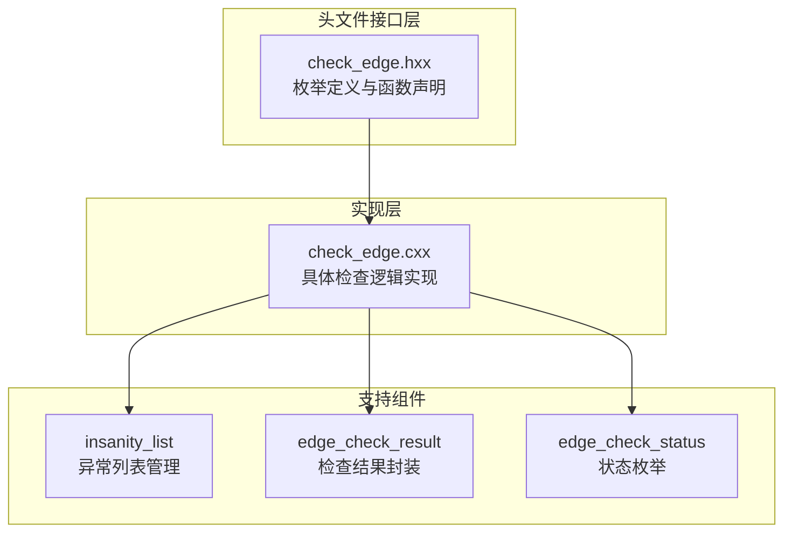
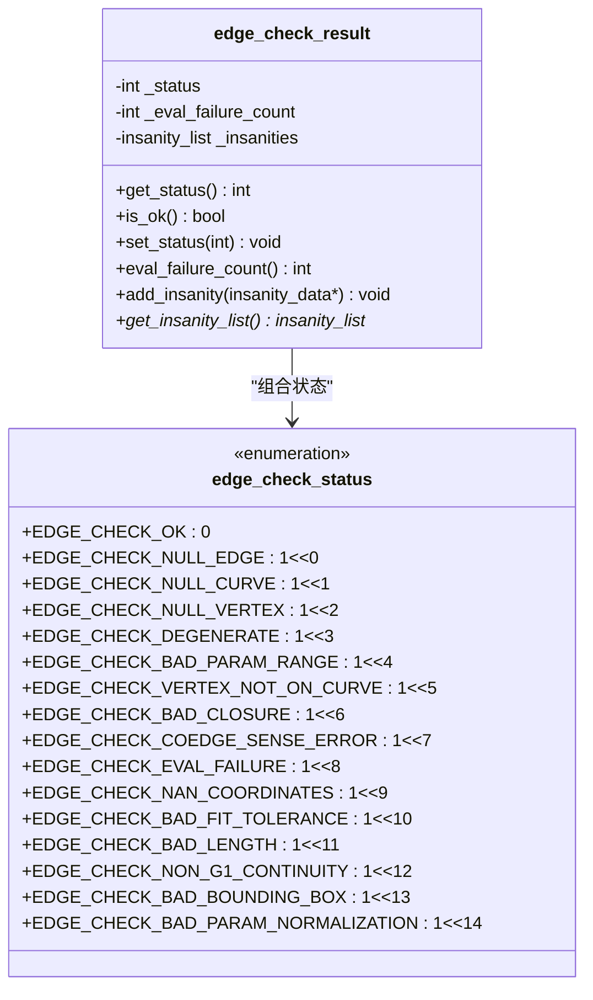
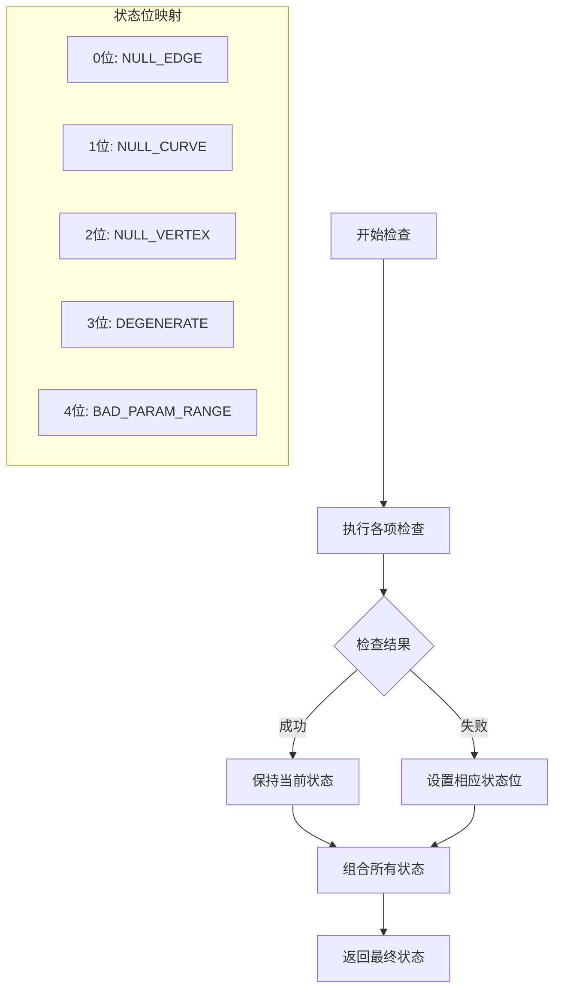
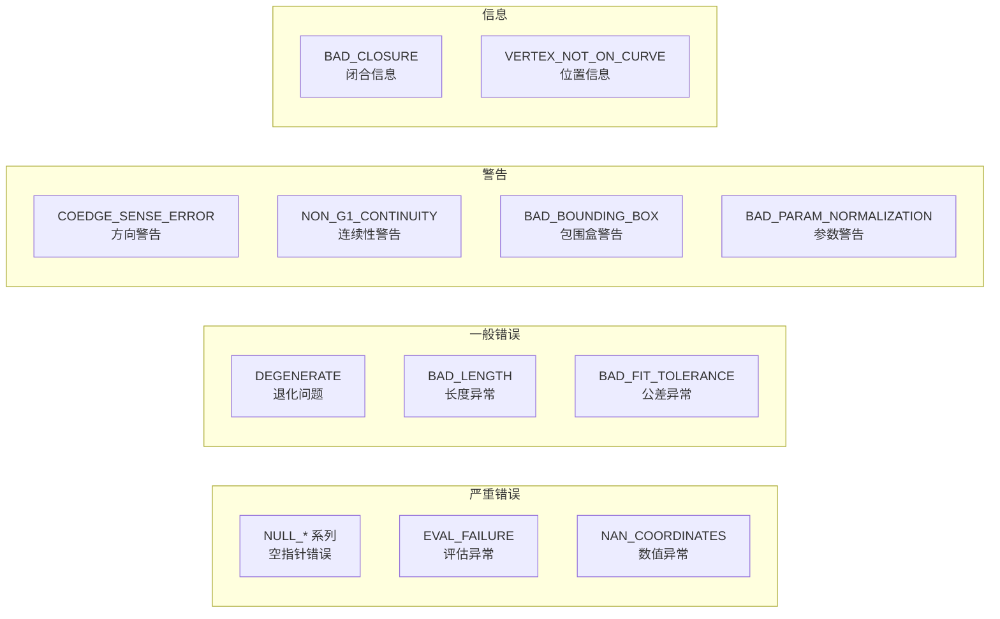
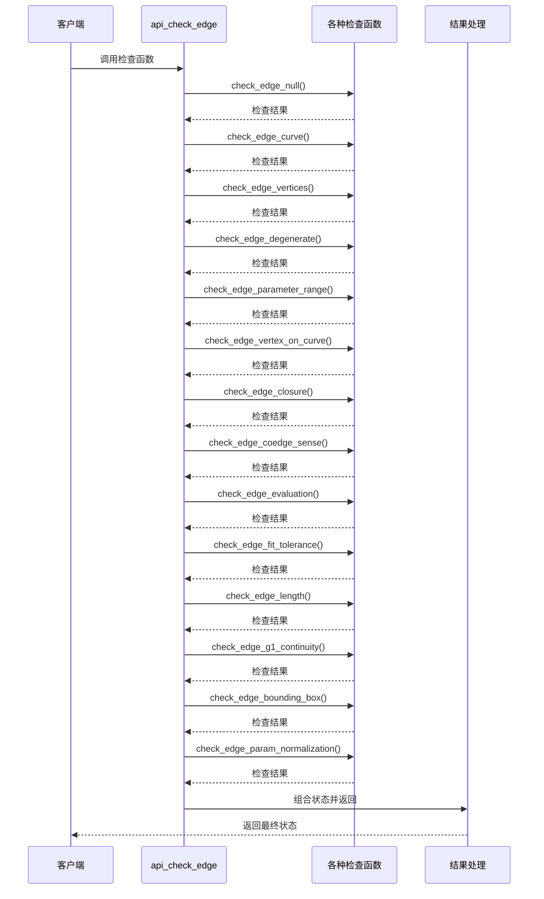

# EDGE 检查状态枚举

<cite>
**本文档引用的文件**
- [check_edge.hxx](file://include/check_edge.hxx)
- [check_edge.cxx](file://src/check_edge.cxx)
- [TASK_SUMMARY.md](file://TASK_SUMMARY.md)
</cite>

## 目录
1. [简介](#简介)
2. [项目结构概览](#项目结构概览)
3. [核心组件分析](#核心组件分析)
4. [枚举状态详解](#枚举状态详解)
5. [架构设计分析](#架构设计分析)
6. [实现细节分析](#实现细节分析)
7. [性能考虑](#性能考虑)
8. [故障排除指南](#故障排除指南)
9. [最佳实践建议](#最佳实践建议)
10. [总结](#总结)

## 简介

EDGE 检查状态枚举是 ACIS（Advanced Computer Integrated Systems）几何建模库中用于描述边（Edge）几何实体完整性状态的重要机制。该枚举系统通过位掩码方式定义了15种不同的检查状态，每种状态对应特定的几何问题或验证失败场景。这些状态不仅标识了问题的存在，还为开发者提供了精确的问题定位和诊断能力。

本技术文档将深入分析 EDGE 检查状态枚举的每个状态值，详细解释其含义、触发条件、可能的解决方案以及在实际工程应用中的意义。

## 项目结构概览

EDGE 检查模块采用标准的头文件声明与实现分离的设计模式：

**图表来源**
- [check_edge.hxx:1-130](file://include/check_edge.hxx#L1-L130)
- [check_edge.cxx:1-890](file://src/check_edge.cxx#L1-L890)

**章节来源**
- [check_edge.hxx:1-130](file://include/check_edge.hxx#L1-L130)
- [check_edge.cxx:1-890](file://src/check_edge.cxx#L1-L890)

## 核心组件分析

### 枚举定义结构

EDGE 检查状态枚举采用位掩码设计，每个状态值都是2的幂次方，允许组合多个状态：

**图表来源**
- [check_edge.hxx:9-46](file://include/check_edge.hxx#L9-L46)

### 主要检查函数族

系统提供两套主要的检查接口：

1. **快速检查接口**：`api_check_edge()` - 返回单一整数状态
2. **详细诊断接口**：`api_check_edge_errors()` - 提供完整的诊断信息

**章节来源**
- [check_edge.hxx:48-127](file://include/check_edge.hxx#L48-L127)
- [check_edge.cxx:47-142](file://src/check_edge.cxx#L47-L142)

## 枚举状态详解

### EDGE_CHECK_OK (0)
**含义**：无错误状态，表示边几何实体完全有效

**触发条件**：
- 所有检查项均通过验证
- 边实体结构完整且参数正常

**解决方案**：无需处理，继续正常流程

**章节来源**
- [check_edge.hxx:10](file://include/check_edge.hxx#L10)
- [check_edge.cxx:25-27](file://src/check_edge.cxx#L25-L27)

### EDGE_CHECK_NULL_EDGE (1)
**含义**：边实体为空指针状态

**触发条件**：
- 输入的 EDGE 指针为 NULL
- 边实体类型验证失败

**解决方案**：
- 检查输入参数的有效性
- 确保边实体已正确创建和初始化
- 添加空指针检查前置条件

**章节来源**
- [check_edge.hxx:11](file://include/check_edge.hxx#L11)
- [check_edge.cxx:54-56](file://src/check_edge.cxx#L54-L56)
- [check_edge.cxx:766-768](file://src/check_edge.cxx#L766-L768)

### EDGE_CHECK_NULL_CURVE (2)
**含义**：边关联的曲线几何为空状态

**触发条件**：
- 边实体的 curfi() 方法返回 NULL
- 边没有关联有效的曲线几何对象

**解决方案**：
- 检查边的几何关联是否正确建立
- 验证曲线几何对象的创建和初始化
- 确保边与曲线的拓扑关系完整

**章节来源**
- [check_edge.hxx:12](file://include/check_edge.hxx#L12)
- [check_edge.cxx:167-174](file://src/check_edge.cxx#L167-L174)

### EDGE_CHECK_NULL_VERTEX (4)
**含义**：边的顶点为空状态

**触发条件**：
- 边的起始顶点或结束顶点为 NULL
- 顶点实体未正确创建或关联

**解决方案**：
- 检查顶点实体的创建和初始化
- 验证边与顶点的拓扑连接关系
- 确保顶点几何数据的完整性

**章节来源**
- [check_edge.hxx:13](file://include/check_edge.hxx#L13)
- [check_edge.cxx:189-262](file://src/check_edge.cxx#L189-L262)

### EDGE_CHECK_DEGENERATE (8)
**含义**：退化边状态，表示边长度过小

**触发条件**：
- 起始顶点与结束顶点位置相同或几乎相同
- 边长小于最小容差阈值 SPAresabs

**解决方案**：
- 检查几何建模精度
- 调整几何约束和参数设置
- 在建模过程中避免产生过于细小的边

**章节来源**
- [check_edge.hxx:14](file://include/check_edge.hxx#L14)
- [check_edge.cxx:289-297](file://src/check_edge.cxx#L289-L297)

### EDGE_CHECK_BAD_PARAM_RANGE (16)
**含义**：参数范围异常状态

**触发条件**：
- 边的参数范围为空（null）
- 参数范围包含 NaN 或无穷大值
- 参数范围过小（接近退化）

**解决方案**：
- 检查参数化曲线的定义
- 验证参数范围的有效性和合理性
- 确保参数化的一致性和连续性

**章节来源**
- [check_edge.hxx:15](file://include/check_edge.hxx#L15)
- [check_edge.cxx:310-344](file://src/check_edge.cxx#L310-L344)

### EDGE_CHECK_VERTEX_NOT_ON_CURVE (32)
**含义**：顶点不在曲线上状态

**触发条件**：
- 顶点位置与曲线在对应参数处的位置不匹配
- 误差超过容差阈值 SPAresabs

**解决方案**：
- 检查参数化映射的正确性
- 验证顶点几何数据的准确性
- 重新计算或调整参数值

**章节来源**
- [check_edge.hxx:16](file://include/check_edge.hxx#L16)
- [check_edge.cxx:364-396](file://src/check_edge.cxx#L364-L396)

### EDGE_CHECK_BAD_CLOSURE (64)
**含义**：闭合异常状态

**触发条件**：
- 边标记为闭合但起点和终点位置不一致
- 闭合边的几何端点不重合
- 闭合边的顶点不相同且位置不同

**解决方案**：
- 检查几何建模的闭合性要求
- 验证闭合边的几何连续性
- 调整几何参数确保端点重合

**章节来源**
- [check_edge.hxx:17](file://include/check_edge.hxx#L17)
- [check_edge.cxx:407-453](file://src/check_edge.cxx#L407-L453)

### EDGE_CHECK_COEDGE_SENSE_ERROR (128)
**含义**：共边方向错误状态

**触发条件**：
- 共边（Coedge）与其伙伴边具有相同的方向
- 方向一致性检查失败

**解决方案**：
- 检查拓扑结构的方向定义
- 验证共边关系的正确性
- 确保方向规则的一致性

**章节来源**
- [check_edge.hxx:18](file://include/check_edge.hxx#L18)
- [check_edge.cxx:470-489](file://src/check_edge.cxx#L470-L489)

### EDGE_CHECK_EVAL_FAILURE (256)
**含义**：曲线评估失败状态

**触发条件**：
- 曲线评估抛出异常
- 评估过程中出现 NaN 或 Inf 值
- 参数超出有效范围

**解决方案**：
- 检查曲线定义的数学有效性
- 验证参数范围的合理性
- 处理数值计算中的异常情况

**章节来源**
- [check_edge.hxx:19](file://include/check_edge.hxx#L19)
- [check_edge.cxx:512-545](file://src/check_edge.cxx#L512-L545)

### EDGE_CHECK_NAN_COORDINATES (512)
**含义**：坐标包含 NaN 或 Inf 状态

**触发条件**：
- 顶点坐标包含 NaN 值
- 顶点坐标包含无穷大值
- 曲线评估返回无效数值

**解决方案**：
- 检查几何数据的数值有效性
- 验证输入数据的质量
- 实施数值稳定性检查

**章节来源**
- [check_edge.hxx:20](file://include/check_edge.hxx#L20)
- [check_edge.cxx:208-224](file://src/check_edge.cxx#L208-L224)
- [check_edge.cxx:515-533](file://src/check_edge.cxx#L515-L533)

### EDGE_CHECK_BAD_FIT_TOLERANCE (1024)
**含义**：拟合公差异常状态

**触发条件**：
- 拟合公差为负值
- 拟合公差过大（超过合理范围）
- 公差设置不合理

**解决方案**：
- 检查公差设置的合理性
- 验证几何拟合算法的参数
- 调整公差到合适的数值范围

**章节来源**
- [check_edge.hxx:21](file://include/check_edge.hxx#L21)
- [check_edge.cxx:556-574](file://src/check_edge.cxx#L556-L574)

### EDGE_CHECK_BAD_LENGTH (2048)
**含义**：长度异常状态

**触发条件**：
- 计算得到的边长为负值
- 长度为 NaN 或无穷大
- 长度计算出现数值错误

**解决方案**：
- 检查几何建模的正确性
- 验证长度计算的数值稳定性
- 处理边界情况和特殊几何形状

**章节来源**
- [check_edge.hxx:22](file://include/check_edge.hxx#L22)
- [check_edge.cxx:602-621](file://src/check_edge.cxx#L602-L621)

### EDGE_CHECK_NON_G1_CONTINUITY (4096)
**含义**：G1 连续性状态

**触发条件**：
- 闭合边在端点处切线方向不连续
- G1 连续性条件不满足
- 切线角度差异超过容差

**解决方案**：
- 检查几何建模的连续性要求
- 验证曲线的导数连续性
- 调整几何参数确保平滑过渡

**章节来源**
- [check_edge.hxx:23](file://include/check_edge.hxx#L23)
- [check_edge.cxx:642-667](file://src/check_edge.cxx#L642-L667)

### EDGE_CHECK_BAD_BOUNDING_BOX (8192)
**含义**：包围盒异常状态

**触发条件**：
- 顶点坐标在包围盒中包含 NaN
- 顶点坐标在包围盒中包含 Inf
- 包围盒计算出现数值问题

**解决方案**：
- 检查包围盒计算的数值稳定性
- 验证几何数据的有效性
- 处理边界情况下的坐标计算

**章节来源**
- [check_edge.hxx:24](file://include/check_edge.hxx#L24)
- [check_edge.cxx:683-718](file://src/check_edge.cxx#L683-L718)

### EDGE_CHECK_BAD_PARAM_NORMALIZATION (16384)
**含义**：参数归一化异常状态

**触发条件**：
- 参数值包含 NaN 或 Inf
- 非闭合边的起始参数大于结束参数
- 参数归一化过程出现异常

**解决方案**：
- 检查参数归一化的正确性
- 验证参数范围的合理性
- 确保参数映射的一致性

**章节来源**
- [check_edge.hxx:25](file://include/check_edge.hxx#L25)
- [check_edge.cxx:731-760](file://src/check_edge.cxx#L731-L760)

## 架构设计分析

### 状态组合机制

EDGE 检查状态采用位掩码设计，允许多个状态同时存在：

**图表来源**
- [check_edge.cxx:833-888](file://src/check_edge.cxx#L833-L888)

### 错误分类体系

系统按照错误严重程度进行分类：

**图表来源**
- [check_edge.hxx:9-26](file://include/check_edge.hxx#L9-L26)

**章节来源**
- [check_edge.cxx:833-888](file://src/check_edge.cxx#L833-L888)

## 实现细节分析

### 检查流程序列

**图表来源**
- [check_edge.cxx:762-888](file://src/check_edge.cxx#L762-L888)

### 数值稳定性处理

系统实现了多层数值稳定性保护：

1. **容差阈值检查**：使用 SPAresabs 和 SPAresnor 等全局容差常量
2. **异常捕获机制**：对曲线评估操作使用 try-catch 处理
3. **边界值验证**：检查 NaN 和 Inf 值的存在
4. **连续性测试**：对 G1 连续性进行角度余弦检验

**章节来源**
- [check_edge.cxx:291-297](file://src/check_edge.cxx#L291-L297)
- [check_edge.cxx:512-545](file://src/check_edge.cxx#L512-L545)
- [check_edge.cxx:648-660](file://src/check_edge.cxx#L648-L660)

## 性能考虑

### 时间复杂度分析

- **单次检查复杂度**：O(n)，其中 n 为采样点数量（通常为15）
- **整体检查复杂度**：O(k×n)，k 为检查项数量（13项），n 为平均采样点数
- **空间复杂度**：O(m)，m 为发现的异常数量

### 优化策略

1. **早期退出机制**：某些检查（如空指针检查）在失败时立即返回
2. **采样点优化**：评估检查使用固定数量的均匀分布采样点
3. **内存管理**：使用智能指针和异常安全的内存管理
4. **缓存友好**：检查函数按逻辑分组，减少不必要的重复计算

## 故障排除指南

### 常见问题诊断

| 症状 | 可能原因 | 解决方案 |
|------|----------|----------|
| EDGE_CHECK_NULL_EDGE | 输入参数为空 | 添加参数验证，确保边实体有效 |
| EDGE_CHECK_NULL_CURVE | 曲线未正确关联 | 检查几何建模流程，重新关联曲线 |
| EDGE_CHECK_DEGENERATE | 几何精度不足 | 调整建模参数，提高几何精度 |
| EDGE_CHECK_EVAL_FAILURE | 数值计算异常 | 检查曲线定义，验证参数范围 |
| EDGE_CHECK_NAN_COORDINATES | 数据污染 | 清洗输入数据，实施数据验证 |

### 调试技巧

1. **逐步检查**：使用单独的检查函数逐项排查问题
2. **日志记录**：利用 insanity_list 获取详细的诊断信息
3. **可视化验证**：结合图形界面验证几何实体的正确性
4. **单元测试**：为关键检查函数编写针对性的测试用例

**章节来源**
- [check_edge.cxx:37-45](file://src/check_edge.cxx#L37-L45)
- [check_edge.cxx:833-888](file://src/check_edge.cxx#L833-L888)

## 最佳实践建议

### 开发规范

1. **参数验证**：始终在调用前验证输入参数的有效性
2. **状态检查**：使用 is_ok() 方法检查整体状态
3. **异常处理**：正确处理 api_check_edge_errors() 的返回值
4. **资源管理**：及时清理 insanity_list 中的异常数据

### 性能优化

1. **批量检查**：对于大量边实体，考虑批处理检查以提高效率
2. **缓存策略**：对频繁访问的几何数据实施缓存机制
3. **并行处理**：在多核环境下并行处理独立的边实体检查
4. **内存池**：使用内存池管理频繁分配的 insanity_data 对象

### 质量保证

1. **单元测试**：为每个检查函数编写覆盖率达到80%以上的测试用例
2. **集成测试**：验证整个检查流程的正确性和稳定性
3. **回归测试**：定期运行历史问题的回归测试
4. **性能监控**：监控检查函数的执行时间和内存使用情况

## 总结

EDGE 检查状态枚举系统通过精心设计的状态定义和完善的检查机制，为 ACIS 几何建模库提供了强大的几何实体完整性保障。该系统不仅能够准确识别各种几何问题，还能提供详细的诊断信息和合理的解决方案指导。

系统的主要优势包括：

1. **全面性**：涵盖了从基本结构完整性到高级几何连续性的各个方面
2. **精确性**：通过位掩码设计能够精确定位问题类型和严重程度
3. **可扩展性**：模块化的设计便于添加新的检查项和改进现有检查逻辑
4. **实用性**：提供了清晰的解决方案指导，有助于快速修复几何问题

通过深入理解和正确使用 EDGE 检查状态枚举，开发者可以显著提高几何建模的质量和可靠性，减少因几何问题导致的建模失败和计算错误。