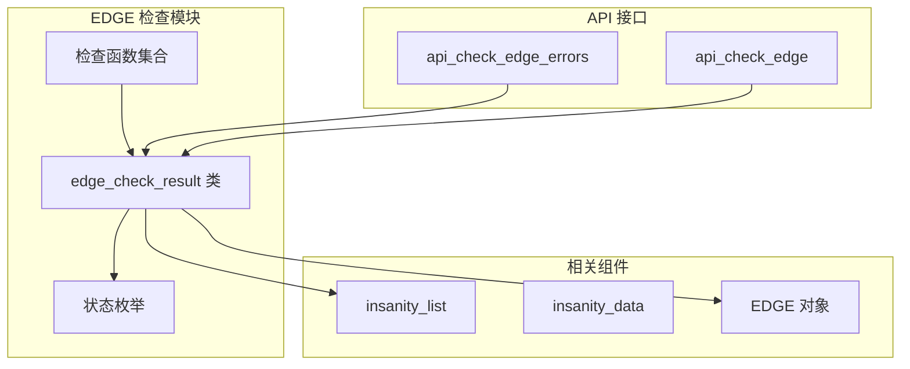
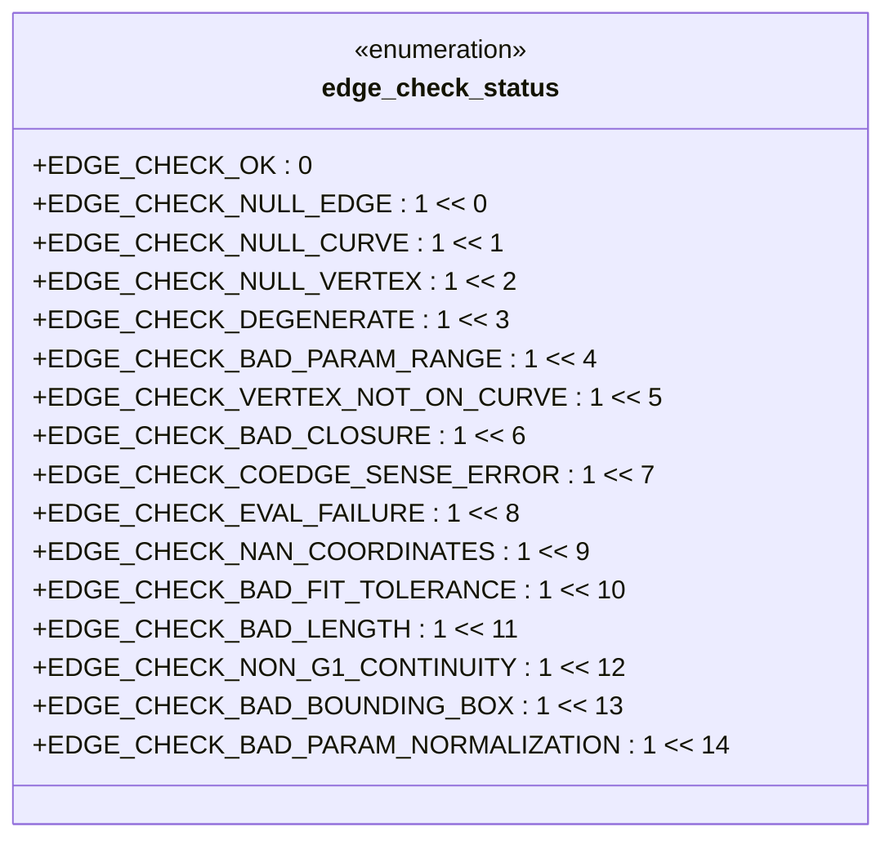
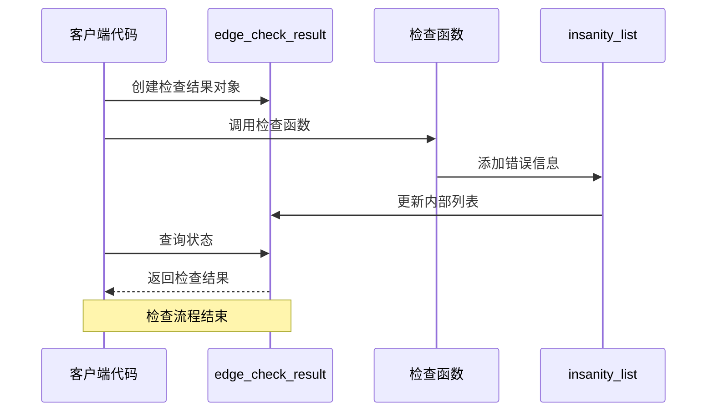
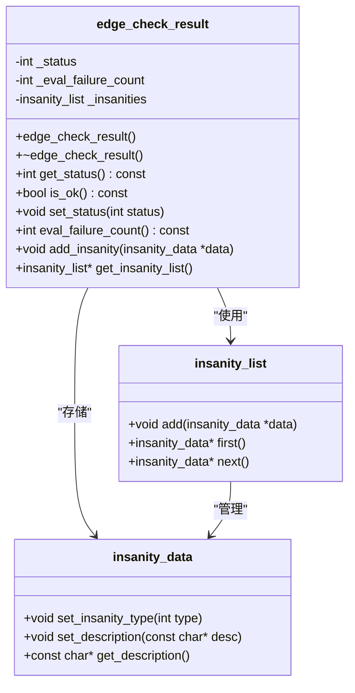
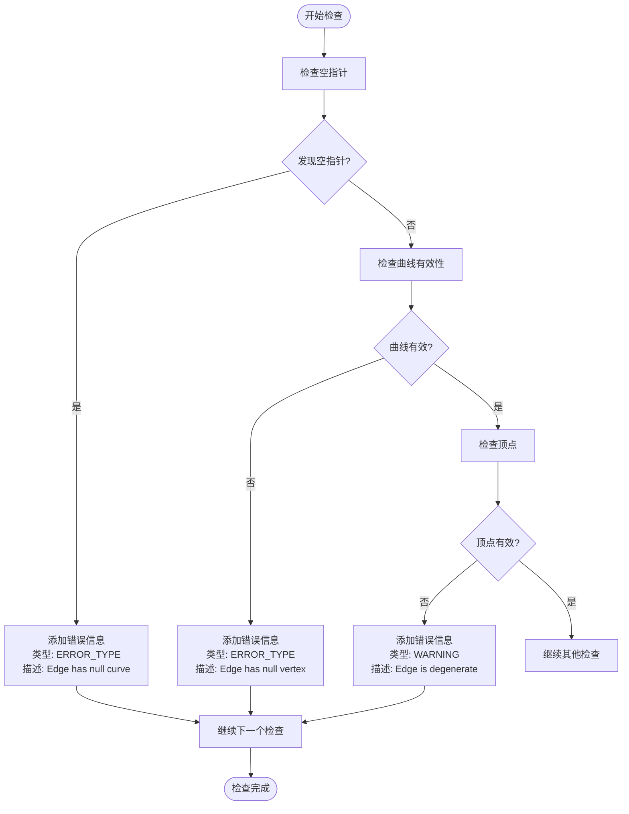
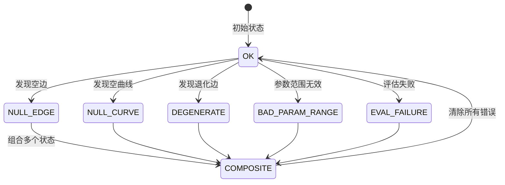
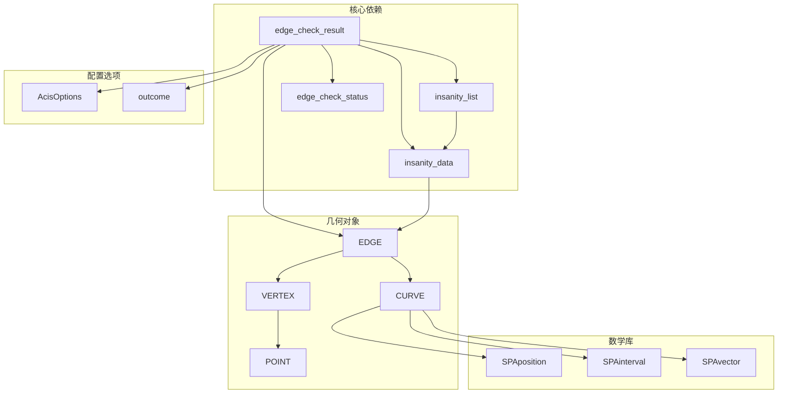

# EDGE 检查结果类

<cite>
**本文档引用的文件**
- [check_edge.hxx](file://include/check_edge.hxx)
- [check_edge.cxx](file://src/check_edge.cxx)
</cite>

## 目录
1. [简介](#简介)
2. [项目结构](#项目结构)
3. [核心组件](#核心组件)
4. [架构概览](#架构概览)
5. [详细组件分析](#详细组件分析)
6. [依赖关系分析](#依赖关系分析)
7. [性能考虑](#性能考虑)
8. [故障排除指南](#故障排除指南)
9. [结论](#结论)

## 简介

EDGE 检查结果类 `edge_check_result` 是一个专门用于处理 EDGE 对象验证和检查结果的数据容器类。该类提供了统一的状态管理和错误收集机制，支持多种 EDGE 验证规则的检查结果存储和查询。

该类的核心功能包括：
- 状态管理：跟踪 EDGE 检查的整体状态
- 错误收集：收集和存储各种类型的检查错误信息
- 结果查询：提供便捷的方法来查询检查结果状态
- 统计信息：记录评估失败次数等统计信息

## 项目结构

EDGE 检查结果类位于 ACIS 几何验证系统的边缘检查模块中，与相关的检查类共同构成完整的几何验证体系。

**图表来源**
- [check_edge.hxx:28-52](file://include/check_edge.hxx#L28-L52)
- [check_edge.cxx:47-142](file://src/check_edge.cxx#L47-L142)

**章节来源**
- [check_edge.hxx:1-130](file://include/check_edge.hxx#L1-L130)
- [check_edge.cxx:1-890](file://src/check_edge.cxx#L1-L890)

## 核心组件

### 状态枚举定义

EDGE 检查结果类使用位掩码枚举来表示不同的检查状态，每个状态位代表特定类型的检查问题：

**图表来源**
- [check_edge.hxx:9-26](file://include/check_edge.hxx#L9-L26)

### 主要数据结构

EDGE 检查结果类包含以下核心成员变量：

| 成员变量 | 类型 | 描述 | 默认值 |
|---------|------|------|--------|
| `_status` | `int` | 当前检查状态的位掩码 | `EDGE_CHECK_OK` |
| `_eval_failure_count` | `int` | 曲线评估失败次数统计 | `0` |
| `_insanities` | `insanity_list` | 存储所有检查错误信息的列表 | 空列表 |

**章节来源**
- [check_edge.hxx:42-46](file://include/check_edge.hxx#L42-L46)
- [check_edge.hxx:28-46](file://include/check_edge.hxx#L28-L46)

## 架构概览

EDGE 检查结果类在整个检查系统中扮演着关键的数据容器角色，它与多个检查函数协作完成完整的 EDGE 验证流程。

**图表来源**
- [check_edge.cxx:47-142](file://src/check_edge.cxx#L47-L142)
- [check_edge.cxx:13-45](file://src/check_edge.cxx#L13-L45)

## 详细组件分析

### edge_check_result 类设计

该类采用简洁的设计模式，专注于数据存储和状态管理，不包含复杂的业务逻辑。

**图表来源**
- [check_edge.hxx:28-46](file://include/check_edge.hxx#L28-L46)
- [check_edge.hxx:38-40](file://include/check_edge.hxx#L38-L40)

### 公共接口方法详解

#### get_status() 方法
- **功能**：返回当前 EDGE 检查的完整状态
- **返回值**：整数类型的位掩码，表示所有已检测到的问题类型
- **使用场景**：查询整体检查结果状态

#### is_ok() 方法
- **功能**：判断 EDGE 检查是否通过
- **返回值**：布尔值，当状态为 `EDGE_CHECK_OK` 时返回 `true`
- **使用场景**：快速判断检查结果是否正常

#### set_status() 方法
- **功能**：设置 EDGE 检查状态
- **参数**：`int status` - 新的状态值（位掩码）
- **使用场景**：手动更新检查状态或从错误列表生成状态

#### eval_failure_count() 方法
- **功能**：获取曲线评估失败的次数统计
- **返回值**：整数，表示评估失败的总次数
- **使用场景**：监控几何计算过程中的异常情况

#### add_insanity() 方法
- **功能**：向检查结果中添加新的错误信息
- **参数**：`insanity_data* data` - 错误信息对象指针
- **使用场景**：在检查过程中收集具体的错误详情

#### get_insanity_list() 方法
- **功能**：获取内部错误列表的访问权限
- **返回值**：`insanity_list*` - 错误列表的指针
- **使用场景**：直接操作错误列表或传递给其他检查函数

**章节来源**
- [check_edge.hxx:33-45](file://include/check_edge.hxx#L33-L45)
- [check_edge.cxx:21-45](file://src/check_edge.cxx#L21-L45)

### 检查结果存储机制

EDGE 检查结果类采用了分层存储策略：

1. **状态位掩码存储**：使用单一整数变量存储所有检查状态
2. **错误列表存储**：使用 `insanity_list` 对象存储详细的错误信息
3. **统计信息存储**：维护评估失败次数等数值统计

这种设计允许开发者：
- 快速查询整体状态（通过位运算）
- 获取详细的错误信息（通过遍历错误列表）
- 进行灵活的状态组合和比较

### 错误收集系统

错误收集系统通过 `insanity_list` 和 `insanity_data` 协同工作：

**图表来源**
- [check_edge.cxx:144-177](file://src/check_edge.cxx#L144-L177)
- [check_edge.cxx:179-263](file://src/check_edge.cxx#L179-L263)

### 状态管理机制

状态管理采用位掩码技术，允许多个状态同时存在：

**图表来源**
- [check_edge.hxx:9-26](file://include/check_edge.hxx#L9-L26)
- [check_edge.cxx:86-142](file://src/check_edge.cxx#L86-L142)

## 依赖关系分析

EDGE 检查结果类依赖于多个外部组件：

**图表来源**
- [check_edge.hxx:4-7](file://include/check_edge.hxx#L4-L7)
- [check_edge.cxx:1-11](file://src/check_edge.cxx#L1-L11)

**章节来源**
- [check_edge.hxx:1-130](file://include/check_edge.hxx#L1-L130)
- [check_edge.cxx:1-890](file://src/check_edge.cxx#L1-L890)

## 性能考虑

EDGE 检查结果类在设计时充分考虑了性能优化：

### 内存管理
- 使用浅拷贝策略，避免不必要的内存分配
- 错误数据通过指针共享，减少内存占用
- 析构函数简单，无复杂资源清理逻辑

### 计算效率
- 状态检查使用位运算，时间复杂度 O(1)
- 错误列表操作采用链表结构，插入操作 O(1)
- 评估失败计数器独立维护，避免重复计算

### 缓存策略
- 状态值缓存在内存中，避免频繁的计算
- 错误列表按需构建，只在需要时进行遍历

## 故障排除指南

### 常见问题诊断

#### 状态查询问题
如果 `is_ok()` 返回 `false` 但无法确定具体原因，可以使用以下方法：

1. **检查状态位**：使用 `get_status()` 获取完整状态信息
2. **遍历错误列表**：通过 `get_insanity_list()` 获取详细错误信息
3. **检查评估失败**：使用 `eval_failure_count()` 监控评估异常

#### 内存泄漏排查
虽然 `edge_check_result` 类本身不负责内存管理，但在使用时需要注意：

1. **确保正确释放**：检查函数调用后正确释放 `insanity_data` 对象
2. **避免双重删除**：不要对同一个 `insanity_data` 对象调用多次删除
3. **检查空指针**：在调用 `add_insanity()` 前检查指针有效性

#### 性能问题诊断
如果检查过程运行缓慢：

1. **检查错误数量**：大量错误可能导致状态计算变慢
2. **监控评估失败**：频繁的评估失败可能影响性能
3. **优化检查顺序**：根据具体需求调整检查函数的执行顺序

**章节来源**
- [check_edge.cxx:47-142](file://src/check_edge.cxx#L47-L142)
- [check_edge.cxx:13-45](file://src/check_edge.cxx#L13-L45)

## 结论

EDGE 检查结果类 `edge_check_result` 是一个设计精良的数据容器类，它成功地将状态管理、错误收集和统计信息整合在一个简洁的接口中。该类的主要优势包括：

1. **清晰的接口设计**：提供直观的方法来查询和管理检查结果
2. **高效的存储机制**：使用位掩码和链表结构实现高性能的数据存储
3. **灵活的状态管理**：支持多状态组合和精确的状态查询
4. **良好的扩展性**：易于添加新的检查类型和错误类别

该类为 EDGE 几何验证系统提供了坚实的基础，使得复杂的几何检查任务能够以统一、高效的方式进行处理。通过合理使用该类提供的接口，开发者可以轻松地集成 EDGE 检查功能到更大的几何处理管道中。