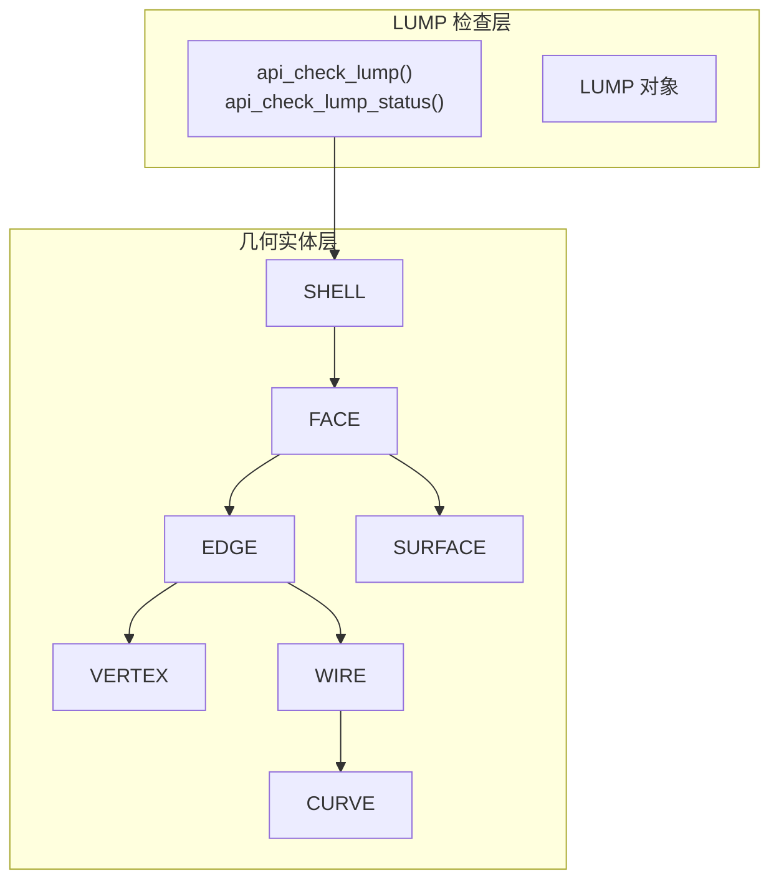
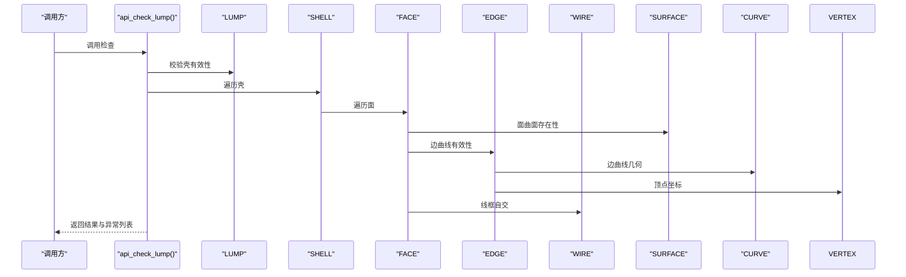

# LUMP 检查函数详解

<cite>
**本文档引用的文件**
- [check_lump.hxx](file://include/check_lump.hxx)
- [check_lump.cxx](file://src/check_lump.cxx)
- [check_edge.hxx](file://include/check_edge.hxx)
- [check_edge.cxx](file://src/check_edge.cxx)
- [check_surface.hxx](file://include/check_surface.hxx)
- [check_surface.cxx](file://src/check_surface.cxx)
- [check_vertex.hxx](file://include/check_vertex.hxx)
- [check_vertex.cxx](file://src/check_vertex.cxx)
- [bs3_curve_check.hxx](file://include/bs3_curve_check.hxx)
- [bs3_curve_check.cxx](file://src/bs3_curve_check.cxx)
</cite>

## 目录
1. [简介](#简介)
2. [项目结构](#项目结构)
3. [核心组件](#核心组件)
4. [架构总览](#架构总览)
5. [详细组件分析](#详细组件分析)
6. [依赖分析](#依赖分析)
7. [性能考虑](#性能考虑)
8. [故障排除指南](#故障排除指南)
9. [结论](#结论)

## 简介
本文件针对 LUMP 检查的13个具体检查函数进行深入技术解析，涵盖拓扑有效性、空间关系、几何连续性与几何特征四大类。文档基于仓库中的 ACIS 接口实现，系统阐述每个检查函数的检查原理、使用的 ACIS API、错误条件判断与返回值含义，并提供可视化图示帮助理解。

## 项目结构
该模块围绕 LUMP 及其子对象（SHELL、FACE、EDGE、VERTEX、WIRE、CURVE、SURFACE）构建检查体系，采用分层设计：
- 头文件定义状态枚举、结果封装类与对外接口
- 源文件实现具体检查逻辑，使用 ACIS API 进行几何验证
- 每个检查函数返回逻辑值表示是否通过，同时收集“异常记录”用于后续统计与诊断

图表来源
- [check_lump.hxx:50-114](file://include/check_lump.hxx#L50-L114)
- [check_lump.cxx:58-106](file://src/check_lump.cxx#L58-L106)

章节来源
- [check_lump.hxx:1-117](file://include/check_lump.hxx#L1-L117)
- [check_lump.cxx:1-766](file://src/check_lump.cxx#L1-L766)

## 核心组件
- 状态枚举与结果封装
  - LUMP 检查状态位：包含壳数量、空壳、自相交、包含关系、体积、包围盒、方向一致性、面邻接、流形性等
  - 结果类提供状态查询、计数器与异常列表访问
- 对外接口
  - 面向 LUMP 的完整检查流程与快速状态查询接口
  - 面向单个实体的检查接口（如 EDGE/SURFACE/VERTEX/BS3_CURVE）

章节来源
- [check_lump.hxx:9-48](file://include/check_lump.hxx#L9-L48)
- [check_lump.hxx:50-114](file://include/check_lump.hxx#L50-L114)

## 架构总览
LUMP 检查以 LUMP 为中心，遍历其内部 SHELL/FACE/EDGE/WIRE/CURVE/SURFACE/VERTEX，按类别执行多项检查。整体流程如下：

图表来源
- [check_lump.cxx:58-106](file://src/check_lump.cxx#L58-L106)
- [check_lump.cxx:108-136](file://src/check_lump.cxx#L108-L136)
- [check_lump.cxx:138-171](file://src/check_lump.cxx#L138-L171)
- [check_lump.cxx:240-306](file://src/check_lump.cxx#L240-L306)
- [check_lump.cxx:346-413](file://src/check_lump.cxx#L346-L413)

## 详细组件分析

### 拓扑有效性检查

#### 1. 壳有效性检查（check_lump_shells_valid）
- 检查目标：LUMP 是否包含壳；空壳警告
- ACIS API 使用：遍历 LUMP 的 SHELL 列表，检查是否存在空壳或仅含空循环的情况
- 错误条件判断：无壳返回失败；空壳记录警告
- 返回值含义：逻辑真表示通过；逻辑假表示存在错误或警告

章节来源
- [check_lump.cxx:108-136](file://src/check_lump.cxx#L108-L136)

#### 2. 面有效性检查（check_shell_faces_valid）
- 检查目标：每个 FACE 是否关联有效 SURFACE；LOOP 是否包含 COEDGE
- ACIS API 使用：遍历 SHELL 中的 FACE，检查 surfi() 与 loop->coedge()
- 错误条件判断：面无表面或循环无共边则记录错误
- 返回值含义：逻辑真表示通过；逻辑假表示存在错误

章节来源
- [check_lump.cxx:138-171](file://src/check_lump.cxx#L138-L171)

#### 3. 边流形检查（check_lump_edge_manifold）
- 检查目标：每条 EDGE 的共边计数是否为偶数（非流形边）
- ACIS API 使用：遍历 SHELL->FACE->LOOP->COEDGE，统计 EDGE 上的 COEDGE 数量
- 错误条件判断：若某 EDGE 的 COEDGE 数量为奇数，则记录非流形警告
- 返回值含义：逻辑真表示通过；逻辑假表示存在非流形边

章节来源
- [check_lump.cxx:612-665](file://src/check_lump.cxx#L612-L665)

### 空间关系检查

#### 4. 包含关系检查（check_lump_containment）
- 检查目标：多个壳之间的包含关系是否一致（内外嵌套方向）
- ACIS API 使用：对每对外壳，计算其面上的采样点并判断点在壳内的包含关系
- 错误条件判断：若两壳的包含关系相同（均内或均外），则记录错误
- 返回值含义：逻辑真表示通过；逻辑假表示包含关系不一致

章节来源
- [check_lump.cxx:173-238](file://src/check_lump.cxx#L173-L238)

#### 5. 体积检查（check_lump_volume）
- 检查目标：LUMP 是否拥有 BODY；壳数量是否为正
- ACIS API 使用：检查 LUMP->body() 是否为空；统计壳数量
- 错误条件判断：无 BODY 记录警告；零壳记录错误
- 返回值含义：逻辑真表示通过；逻辑假表示输入无效或缺少壳

章节来源
- [check_lump.cxx:415-454](file://src/check_lump.cxx#L415-L454)

#### 6. 包围盒检查（check_lump_bounding_box）
- 检查目标：LUMP 中所有顶点坐标的有限性
- ACIS API 使用：遍历 SHELL->FACE->LOOP->COEDGE->EDGE->VERTEX，检查点位置
- 错误条件判断：任一顶点坐标为 NaN/Inf 则记录错误
- 返回值含义：逻辑真表示通过；逻辑假表示输入无效

章节来源
- [check_lump.cxx:456-520](file://src/check_lump.cxx#L456-L520)

### 几何连续性检查

#### 7. Coedge 方向（check_coedge_sense）
- 检查目标：同一 LOOP 内的 COEDGE 与其对偶伙伴的定向是否相反
- ACIS API 使用：遍历 FACE->LOOP->COEDGE，比较 partner->sense() 与当前 sense()
- 错误条件判断：同向则记录警告
- 返回值含义：逻辑真表示通过；逻辑假表示存在同向情况

章节来源
- [check_lump.cxx:308-344](file://src/check_lump.cxx#L308-L344)

#### 8. 面邻接（check_lump_face_adjacency）
- 检查目标：每个 FACE 的 COEDGE 是否都有对偶伙伴（自由边检测）
- ACIS API 使用：遍历 SHELL->FACE->LOOP->COEDGE，检查 partner 是否存在
- 错误条件判断：无对偶伙伴则记录警告
- 返回值含义：逻辑真表示通过；逻辑假表示存在自由边

章节来源
- [check_lump.cxx:569-610](file://src/check_lump.cxx#L569-L610)

#### 9. Shell 方向（check_lump_shell_orientation）
- 检查目标：单个 LOOP 内前向/反向 COEDGE 的混合情况
- ACIS API 使用：遍历 SHELL->FACE->LOOP->COEDGE，统计 sense 分布
- 错误条件判断：同一 LOOP 内同时存在前向与反向 COEDGE
- 返回值含义：逻辑真表示通过；逻辑假表示方向混合

章节来源
- [check_lump.cxx:522-567](file://src/check_lump.cxx#L522-L567)

### 几何特征检查

#### 10. 边曲线有效性（check_edge_curves_valid）
- 检查目标：EDGE 的 CURVE、起终点 VERTEX、顶点点位是否有效
- ACIS API 使用：遍历 FACE->LOOP->COEDGE->EDGE，检查 curfi()/start()/end()/point()
- 错误条件判断：CURVE/VERTEX 为空或点为 NaN/Inf 则记录错误
- 返回值含义：逻辑真表示通过；逻辑假表示存在无效边

章节来源
- [check_lump.cxx:240-306](file://src/check_lump.cxx#L240-L306)

#### 11. Wire 自交检查（check_wire_self_intersect）
- 检查目标：WIRE 内不同 EDGE 在参数域上的交点是否为内部交点
- ACIS API 使用：遍历 WIRE 的 COEDGE 对，调用求交接口 find_intersections() 并过滤端点
- 错误条件判断：存在非端点交点则记录错误
- 返回值含义：逻辑真表示通过；逻辑假表示存在自交

章节来源
- [check_lump.cxx:346-413](file://src/check_lump.cxx#L346-L413)

#### 12. 边有效性（check_edge_null、check_edge_curve、check_edge_vertices、check_edge_degenerate、check_edge_parameter_range、check_edge_vertex_on_curve、check_edge_closure、check_edge_coedge_sense、check_edge_evaluation、check_edge_fit_tolerance、check_edge_length、check_edge_g1_continuity、check_edge_bounding_box、check_edge_param_normalization）
- 检查目标：EDGE 的完整性与几何一致性（空指针、曲线、顶点、退化、参数范围、闭合性、导数连续性、边界盒等）
- ACIS API 使用：CURVE、VERTEX、POINT、COEDGE、EDGE 的相关方法
- 错误条件判断：依据各子检查函数的判定标准记录相应错误或警告
- 返回值含义：逻辑真表示通过；逻辑假表示存在对应问题

章节来源
- [check_edge.cxx:47-142](file://src/check_edge.cxx#L47-L142)
- [check_edge.cxx:144-800](file://src/check_edge.cxx#L144-L800)

#### 13. 曲面有效性（check_surface_null、check_surface_evaluation、check_surface_parameter_range、check_surface_continuity、check_surface_singularity、check_surface_closure、check_surface_fit_tolerance、check_bspline_surface、check_surface_self_intersection、check_surface_normal_consistency、check_surface_g2_continuity、check_surface_uv_coordinates、check_surface_area_degenerate、check_surface_periodicity）
- 检查目标：SURFACE 的完整性与几何性质（空指针、评估、参数范围、闭合性、奇异点、法向一致性、G2 连续性、周期性等）
- ACIS API 使用：SURFACE、BS3_SURFACE、POINT、SPApar_box、SPAinterval 等
- 错误条件判断：依据各子检查函数的判定标准记录相应错误或警告
- 返回值含义：逻辑真表示通过；逻辑假表示存在对应问题

章节来源
- [check_surface.cxx:49-144](file://src/check_surface.cxx#L49-L144)
- [check_surface.cxx:146-1075](file://src/check_surface.cxx#L146-L1075)

## 依赖分析

```mermaid
graph LR
LUMP_API["api_check_lump()"] --> SHELL_VALID["check_lump_shells_valid()"]
LUMP_API --> SHELL_FACE["check_shell_faces_valid()"]
LUMP_API --> EDGE_CURVE["check_edge_curves_valid()"]
LUMP_API --> COEDGE_SENSE["check_coedge_sense()"]
LUMP_API --> WIRE_SELF["check_wire_self_intersect()"]
LUMP_API --> CONTAIN["check_lump_containment()"]
EDGE_API["api_check_edge_errors()"] --> EDGE_NULL["check_edge_null()"]
EDGE_API --> EDGE_CURVE2["check_edge_curve()"]
EDGE_API --> EDGE_VTX["check_edge_vertices()"]
EDGE_API --> EDGE_DEGEN["check_edge_degenerate()"]
EDGE_API --> EDGE_RANGE["check_edge_parameter_range()"]
EDGE_API --> EDGE_VTX_ON_CURVE["check_edge_vertex_on_curve()"]
EDGE_API --> EDGE_CLOSE["check_edge_closure()"]
EDGE_API --> EDGE_SENSE["check_edge_coedge_sense()"]
EDGE_API --> EDGE_EVAL["check_edge_evaluation()"]
EDGE_API --> EDGE_FIT["check_edge_fit_tolerance()"]
EDGE_API --> EDGE_LEN["check_edge_length()"]
EDGE_API --> EDGE_G1["check_edge_g1_continuity()"]
EDGE_API --> EDGE_BB["check_edge_bounding_box()"]
EDGE_API --> EDGE_PARAM_NORM["check_edge_param_normalization()"]
SURF_API["api_check_surface_ok()"] --> SURF_NULL["check_surface_null()"]
SURF_API --> SURF_EVAL["check_surface_evaluation()"]
SURF_API --> SURF_RANGE["check_surface_parameter_range()"]
SURF_API --> SURF_CONT["check_surface_continuity()"]
SURF_API --> SURF_SING["check_surface_singularity()"]
SURF_API --> SURF_CLOSE["check_surface_closure()"]
SURF_API --> SURF_FIT["check_surface_fit_tolerance()"]
SURF_API --> SURF_BSPLINE["check_bspline_surface()"]
SURF_API --> SURF_SELFINT["check_surface_self_intersection()"]
SURF_API --> SURF_NORMAL["check_surface_normal_consistency()"]
SURF_API --> SURF_G2["check_surface_g2_continuity()"]
SURF_API --> SURF_UV["check_surface_uv_coordinates()"]
SURF_API --> SURF_AREA["check_surface_area_degenerate()"]
SURF_API --> SURF_PERIOD["check_surface_periodicity()"]
```

图表来源
- [check_lump.cxx:58-106](file://src/check_lump.cxx#L58-L106)
- [check_edge.cxx:47-142](file://src/check_edge.cxx#L47-L142)
- [check_surface.cxx:49-144](file://src/check_surface.cxx#L49-L144)

章节来源
- [check_lump.cxx:58-106](file://src/check_lump.cxx#L58-L106)
- [check_edge.cxx:47-142](file://src/check_edge.cxx#L47-L142)
- [check_surface.cxx:49-144](file://src/check_surface.cxx#L49-L144)

## 性能考虑
- 检查粒度与复杂度
  - LUMP 主流程为 O(N_shell × N_face × N_loop × N_coedge)，注意在大型模型中应优先使用快速状态接口进行粗筛
  - Wire 自交检查涉及成对 EDGE 的求交，复杂度较高，建议在必要时启用或限制采样密度
- 采样策略
  - 表面与曲线检查普遍采用均匀采样，采样点数量可作为性能与精度的权衡参数
- 异常处理
  - 多处使用 try/catch 捕获几何评估异常，避免因个别点异常导致整个检查失败
- 内存管理
  - 求交接口返回的数组需显式释放，确保内存安全

## 故障排除指南
- 常见错误类型
  - 空指针：LUMP/SHELL/FACE/EDGE/CURVE/VERTEX/SURFACE 为空
  - 参数范围异常：NaN/Inf 或退化区间
  - 几何退化：零长度边、零面积面、退化控制点等
  - 连续性问题：G1/G2 不连续、闭合不匹配、奇异点
- 定位步骤
  - 使用 api_check_lump_status 快速定位主要问题类别
  - 逐项启用子检查函数，缩小问题范围
  - 查看异常列表中的描述字符串，结合状态位判断严重程度
- 修复建议
  - 对于空壳/空面：重建几何或清理无效实体
  - 对于退化：调整参数范围或重新拟合
  - 对于非流形边：修改拓扑连接或拆分共享边
  - 对于自交：修正 Wire 路径或移除冗余段

## 结论
本文件系统梳理了 LUMP 检查的13个关键函数，覆盖拓扑、空间关系、几何连续性与几何特征四类。通过明确的检查原理、ACIS API 使用与错误条件判断，可有效支撑几何模型的质量保障与自动化修复。建议在实际工程中结合业务需求选择合适的检查组合，并根据模型规模调整采样策略以平衡性能与精度。