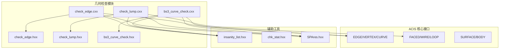
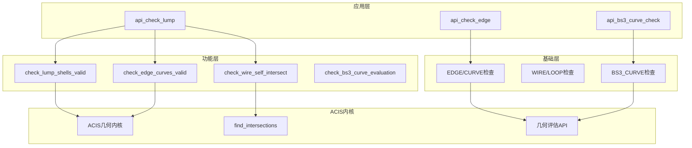
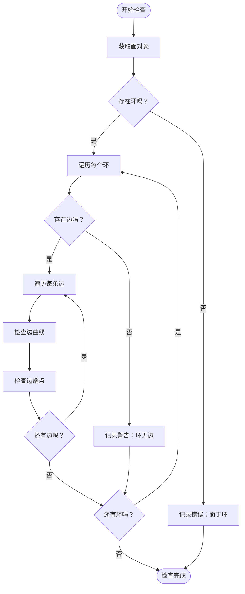
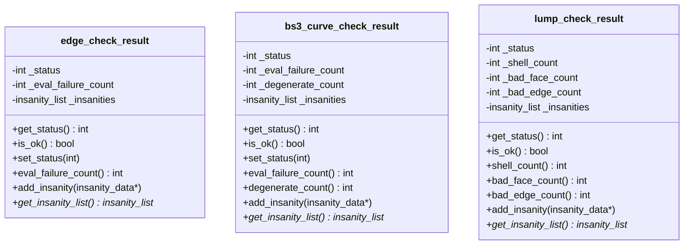
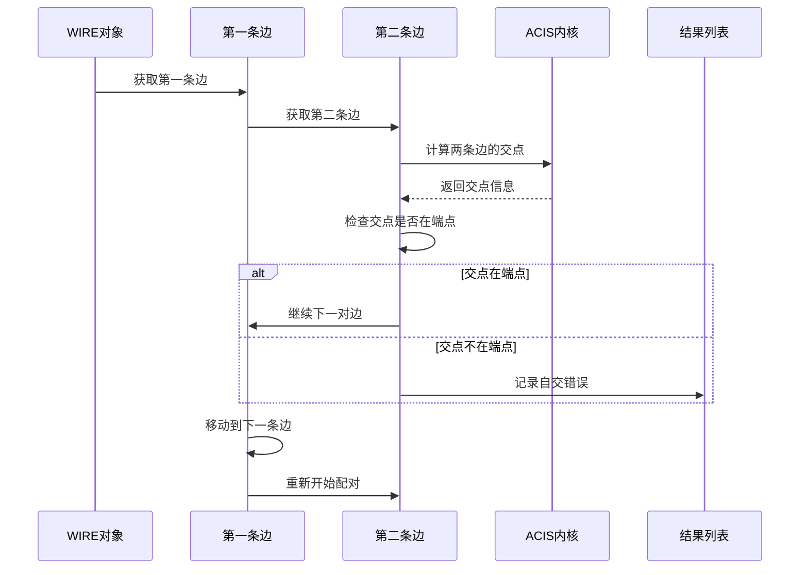
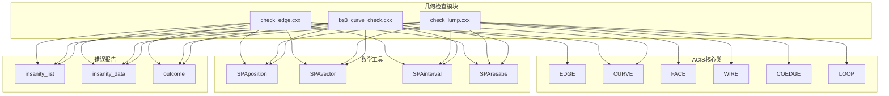

# Wire 几何特征检查

<cite>
**本文档引用的文件**
- [check_edge.hxx](file://include/check_edge.hxx)
- [check_edge.cxx](file://src/check_edge.cxx)
- [check_lump.hxx](file://include/check_lump.hxx)
- [check_lump.cxx](file://src/check_lump.cxx)
- [bs3_curve_check.hxx](file://include/bs3_curve_check.hxx)
- [bs3_curve_check.cxx](file://src/bs3_curve_check.cxx)
- [TASK_SUMMARY.md](file://TASK_SUMMARY.md)
</cite>

## 目录
1. [简介](#简介)
2. [项目结构](#项目结构)
3. [核心组件](#核心组件)
4. [架构概览](#架构概览)
5. [详细组件分析](#详细组件分析)
6. [依赖关系分析](#依赖关系分析)
7. [性能考虑](#性能考虑)
8. [故障排除指南](#故障排除指南)
9. [结论](#结论)

## 简介

本文件详细介绍了 Wire 几何特征检查相关的两个核心函数：`check_edge_curves_valid`（边曲线有效性检查）和 `check_wire_self_intersect`（Wire 自交检查）。这些检查在确保边界几何质量和避免几何退化方面发挥着至关重要的作用。

Wire 几何检查是三维几何建模中的关键环节，特别是在使用 ACIS 内核进行 CAD 建模时。通过系统性的几何验证，可以及早发现和修复几何模型中的问题，从而提高后续加工、仿真和制造过程的成功率。

## 项目结构

该项目采用模块化的几何检查架构，主要包含以下核心模块：



**图表来源**
- [check_edge.cxx:1-50](file://src/check_edge.cxx#L1-L50)
- [check_lump.cxx:1-20](file://src/check_lump.cxx#L1-L20)
- [bs3_curve_check.cxx:1-15](file://src/bs3_curve_check.cxx#L1-L15)

**章节来源**
- [TASK_SUMMARY.md:1-306](file://TASK_SUMMARY.md#L1-L306)

## 核心组件

### 边曲线有效性检查 (check_edge_curves_valid)

`check_edge_curves_valid` 函数负责验证面中所有边的曲线几何有效性。该函数遍历面的所有环（loop），然后遍历每个环中的所有边（edge），检查每个边的几何属性。

**函数签名与参数：**
- 输入：`FACE *face` - 要检查的面对象
- 输出：`insanity_list *ilist` - 存储检查结果的错误列表
- 返回：`logical` - 检查是否通过

**检查流程：**
1. 遍历面的所有环（LOOP）
2. 对每个环遍历其所有边（EDGE）
3. 验证每条边的曲线几何有效性
4. 检查边的端点顶点有效性
5. 记录所有发现的问题到错误列表

### Wire 自交检查 (check_wire_self_intersect)

`check_wire_self_intersect` 函数专门用于检测 Wire 的自相交问题。该函数通过比较 Wire 中不同边之间的交点来识别潜在的自交情况。

**函数签名与参数：**
- 输入：`WIRE *wire` - 要检查的 Wire 对象
- 输出：`insanity_list *ilist` - 存储检查结果的错误列表
- 返回：`logical` - 检查是否通过

**检查算法：**
1. 遍历 Wire 中的所有边（COEDGE）
2. 对每对不同的边计算交点
3. 排除端点处的正常交点
4. 标记非端点处的交点为自交问题

**章节来源**
- [check_lump.hxx:71-84](file://include/check_lump.hxx#L71-L84)
- [check_lump.cxx:240-306](file://src/check_lump.cxx#L240-L306)
- [check_lump.cxx:346-413](file://src/check_lump.cxx#L346-L413)

## 架构概览

整个几何检查系统采用分层架构设计，从底层的几何实体检查到上层的复合体检查：



**图表来源**
- [check_lump.cxx:58-106](file://src/check_lump.cxx#L58-L106)
- [check_edge.cxx:47-142](file://src/check_edge.cxx#L47-L142)
- [bs3_curve_check.cxx:50-150](file://src/bs3_curve_check.cxx#L50-L150)

## 详细组件分析

### 边曲线有效性检查算法

#### 核心检查流程



**图表来源**
- [check_lump.cxx:240-306](file://src/check_lump.cxx#L240-L306)

#### 边曲线检查的具体实现

边曲线有效性检查包含多个层次的验证：

1. **空指针检查**：确保边、曲线和顶点对象都存在
2. **几何完整性检查**：验证曲线的数学定义完整性
3. **拓扑正确性检查**：确认边与顶点的连接关系正确
4. **数值稳定性检查**：检测 NaN 和无穷大等数值问题

#### 关键数据结构



**图表来源**
- [check_edge.hxx:28-46](file://include/check_edge.hxx#L28-L46)
- [bs3_curve_check.hxx:29-49](file://include/bs3_curve_check.hxx#L29-L49)
- [check_lump.hxx:27-48](file://include/check_lump.hxx#L27-L48)

**章节来源**
- [check_edge.cxx:13-45](file://src/check_edge.cxx#L13-L45)
- [bs3_curve_check.cxx:11-48](file://src/bs3_curve_check.cxx#L11-L48)
- [check_lump.cxx:18-56](file://src/check_lump.cxx#L18-L56)

### Wire 自交检查算法

#### 自交检测流程



**图表来源**
- [check_lump.cxx:346-413](file://src/check_lump.cxx#L346-L413)

#### 自交检测的关键技术

1. **参数范围检查**：使用 `SPAintervalRange` 确定每条边的有效参数范围
2. **交点计算**：调用 ACIS 的 `find_intersections` API 计算两条边的交点
3. **端点识别**：排除边的端点处的自然交点
4. **错误分类**：将非端点交点标记为自交问题

#### 性能优化策略

- **早期退出**：当找到第一个自交点时立即停止检查
- **重复检测避免**：通过合理的遍历顺序避免重复检查同一对边
- **内存管理**：正确释放 `find_intersections` 分配的内存资源

**章节来源**
- [check_lump.cxx:365-403](file://src/check_lump.cxx#L365-L403)

### ACIS API 遍历方法

#### 边缘几何遍历

ACIS 提供了丰富的几何遍历接口，支持从高层几何对象到低层几何元素的完整访问：

```mermaid
graph LR
subgraph "几何层次结构"
A[LUMP] --> B[SHELL]
B --> C[FACE]
C --> D[LOOP]
D --> E[WIRE]
E --> F[COEDGE]
F --> G[EDGE]
G --> H[CURVE]
end
subgraph "遍历方法"
I[next()方法]
J[coedge()方法]
K[edge()方法]
L[curfi()方法]
end
A -.-> I
B -.-> I
C -.-> I
D -.-> I
E -.-> I
F -.-> J
G -.-> K
H -.-> L
```

**图表来源**
- [check_lump.cxx:77-101](file://src/check_lump.cxx#L77-L101)
- [check_edge.cxx:159-177](file://src/check_edge.cxx#L159-L177)

#### 遍历模式

1. **线性遍历**：使用 `next()` 方法按顺序访问同级元素
2. **父子遍历**：通过 `coedge()`、`edge()` 等方法访问子级元素
3. **循环遍历**：对于环状结构使用 `do-while` 循环确保完整遍历

**章节来源**
- [check_lump.cxx:76-101](file://src/check_lump.cxx#L76-L101)
- [check_edge.cxx:159-177](file://src/check_edge.cxx#L159-L177)

## 依赖关系分析

### 核心依赖关系



**图表来源**
- [check_edge.cxx:1-12](file://src/check_edge.cxx#L1-L12)
- [check_lump.cxx:1-17](file://src/check_lump.cxx#L1-L17)
- [bs3_curve_check.cxx:1-9](file://src/bs3_curve_check.cxx#L1-L9)

### 外部依赖分析

1. **ACIS 内核依赖**：所有检查函数都直接依赖 ACIS 的几何内核
2. **数学常量依赖**：使用 `SPAresabs`、`SPAresnor` 等容差常量
3. **内存管理依赖**：使用 `ACIS_DELETE` 进行内存清理
4. **异常处理依赖**：通过 `try-catch` 处理几何评估异常

**章节来源**
- [TASK_SUMMARY.md:282-293](file://TASK_SUMMARY.md#L282-L293)

## 性能考虑

### 时间复杂度分析

1. **边曲线检查**：O(n)，其中 n 是边的数量
2. **Wire 自交检查**：O(m²)，其中 m 是 Wire 中边的数量
3. **整体检查**：取决于几何模型的复杂程度

### 内存使用优化

1. **延迟分配**：只在需要时分配临时缓冲区
2. **及时释放**：使用 `ACIS_DELETE` 确保内存及时回收
3. **错误短路**：发现严重错误时立即停止进一步检查

### 并行化可能性

当前实现采用串行检查方式，但在某些情况下可以考虑：
- 对独立的几何组件进行并行检查
- 使用多线程处理大型装配体的不同部件

## 故障排除指南

### 常见问题诊断

#### 边曲线相关问题

| 问题类型 | 错误代码 | 可能原因 | 解决方案 |
|---------|---------|---------|---------|
| 空边 | EDGE_CHECK_NULL_EDGE | 边对象为空 | 检查拓扑完整性 |
| 空曲线 | EDGE_CHECK_NULL_CURVE | 边的曲线为空 | 重建或修复曲线 |
| 退化边 | EDGE_CHECK_DEGENERATE | 边长度过小 | 检查几何精度 |
| 参数范围异常 | EDGE_CHECK_BAD_PARAM_RANGE | 参数域无效 | 修正参数范围 |

#### Wire 自交问题

| 问题类型 | 检测位置 | 影响分析 | 修复建议 |
|---------|---------|---------|---------|
| 内部自交 | Wire 内部 | 制造困难 | 重新设计几何 |
| 端点自交 | 边界点 | 装配问题 | 调整边的连接 |
| 重叠边 | 几何重叠 | 表面质量 | 优化网格划分 |

### 调试技巧

1. **逐步检查**：先运行快速检查，再进行详细诊断
2. **错误分类**：区分错误、警告和信息级别
3. **可视化辅助**：结合几何可视化工具定位问题
4. **日志记录**：详细记录检查过程和结果

**章节来源**
- [check_edge.cxx:833-888](file://src/check_edge.cxx#L833-L888)
- [check_lump.cxx:390-398](file://src/check_lump.cxx#L390-L398)

## 结论

Wire 几何特征检查系统提供了全面而深入的几何验证能力。通过 `check_edge_curves_valid` 和 `check_wire_self_intersect` 两个核心函数，系统能够有效识别和报告几何模型中的各种问题。

### 主要优势

1. **全面性**：涵盖几何、拓扑和数值等多个维度的检查
2. **可扩展性**：模块化设计便于添加新的检查规则
3. **性能优化**：合理的算法选择和内存管理
4. **错误分类**：清晰的错误级别区分有助于问题定位

### 应用价值

- **质量保证**：在设计阶段及早发现几何问题
- **成本控制**：避免后期修改带来的高昂成本
- **生产准备**：确保几何模型适合后续加工和制造
- **标准化**：建立统一的几何质量标准

通过持续改进和扩展，这个检查系统将成为确保三维几何模型质量的重要工具，在 CAD/CAM/CAE 工作流中发挥越来越重要的作用。