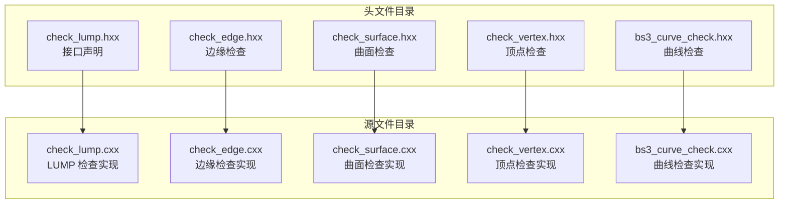
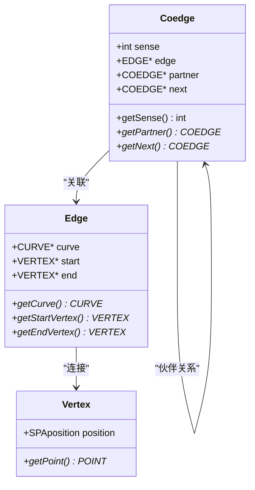
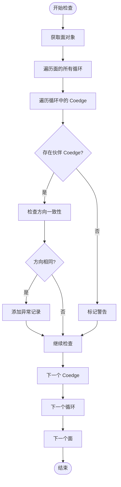
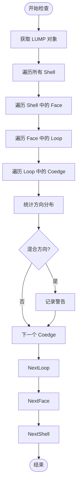
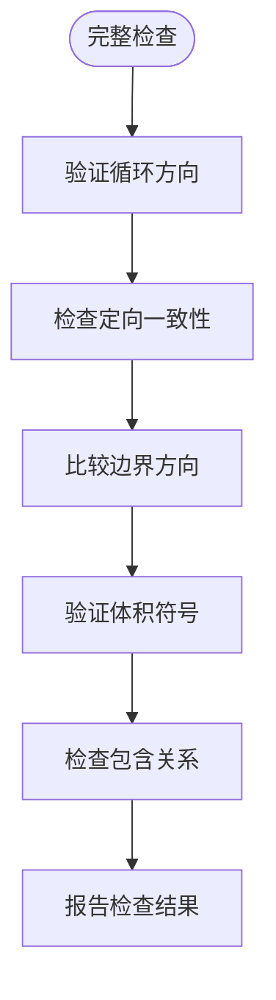
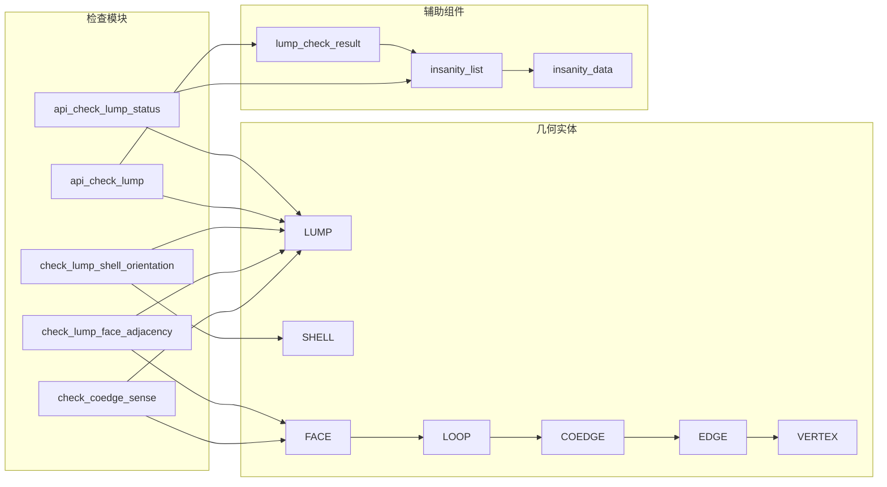

# 几何连续性检查

<cite>
**本文档引用的文件**
- [check_lump.hxx](file://include/check_lump.hxx)
- [check_lump.cxx](file://src/check_lump.cxx)
</cite>

## 目录
1. [简介](#简介)
2. [项目结构](#项目结构)
3. [核心组件](#核心组件)
4. [架构概览](#架构概览)
5. [详细组件分析](#详细组件分析)
6. [依赖关系分析](#依赖关系分析)
7. [性能考虑](#性能考虑)
8. [故障排除指南](#故障排除指南)
9. [结论](#结论)

## 简介

本文件针对 LUMP 几何连续性检查中的三个关键函数进行深入技术分析，包括：
- `check_coedge_sense`（Coedge 方向检查）
- `check_lump_face_adjacency`（面邻接检查）
- `check_lump_shell_orientation`（Shell 方向检查）

这些检查在确保几何模型的连续性和方向正确性方面发挥着至关重要的作用，是三维几何建模和 CAD 系统中质量保证的核心组成部分。

## 项目结构

LUMP 几何连续性检查模块位于 Interface 项目的 `include` 和 `src` 目录下，采用标准的 C++ 头文件声明与实现分离的设计模式：



**图表来源**
- [check_lump.hxx:1-117](file://include/check_lump.hxx#L1-L117)
- [check_lump.cxx:1-766](file://src/check_lump.cxx#L1-L766)

**章节来源**
- [check_lump.hxx:1-117](file://include/check_lump.hxx#L1-L117)
- [check_lump.cxx:1-766](file://src/check_lump.cxx#L1-L766)

## 核心组件

### 几何连续性基础概念

几何连续性是指几何对象在连接处保持平滑过渡的性质，主要分为：

- **G0 连续性**：位置连续，几何对象在连接处相接触
- **G1 连续性**：切线连续，几何对象在连接处具有相同的切线方向
- **G2 连续性**：曲率连续，几何对象在连接处具有相同的曲率

### Coedge 方向系统

Coedge（有向边）是几何建模中的基本元素，它结合了边（EDGE）和方向（SENSE）的概念：



**图表来源**
- [check_lump.cxx:308-344](file://src/check_lump.cxx#L308-L344)
- [check_lump.cxx:569-610](file://src/check_lump.cxx#L569-L610)

### 检查状态枚举

系统使用位掩码方式定义检查状态，便于组合多种错误类型的检测：

| 枚举值 | 值 | 说明 |
|--------|----|------|
| LUMP_CHECK_OK | 0 | 无错误 |
| LUMP_CHECK_NO_SHELL | 1<<0 | LUMP 无 Shell |
| LUMP_CHECK_EMPTY_SHELL | 1<<1 | 空 Shell |
| LUMP_CHECK_SHELL_SELF_INT | 1<<2 | Shell 自相交 |
| LUMP_CHECK_BAD_CONTAINMENT | 1<<3 | 包含关系错误 |
| LUMP_CHECK_INTERSECT_SHELLS | 1<<4 | Shell 相互交叉 |
| LUMP_CHECK_DEGENERATE_FACE | 1<<5 | 退化面 |
| LUMP_CHECK_BAD_COEDGE_SENSE | 1<<6 | Coedge 方向错误 |
| LUMP_CHECK_NULL_EDGE_CURVE | 1<<7 | 边缘曲线为空 |
| LUMP_CHECK_NON_MANIFOLD_VTX | 1<<8 | 非流形顶点 |
| LUMP_CHECK_BAD_VOLUME | 1<<9 | 体积错误 |
| LUMP_CHECK_BAD_BOUNDING_BOX | 1<<10 | 包围盒错误 |
| LUMP_CHECK_SHELL_ORIENT_MISMATCH | 1<<11 | Shell 方向不匹配 |
| LUMP_CHECK_BAD_FACE_ADJACENCY | 1<<12 | 面邻接错误 |
| LUMP_CHECK_NON_MANIFOLD_EDGE | 1<<13 | 非流形边缘 |

**章节来源**
- [check_lump.hxx:9-25](file://include/check_lump.hxx#L9-L25)

## 架构概览

LUMP 几何连续性检查采用分层架构设计，从整体到局部逐级验证：

```mermaid
graph TD
A[api_check_lump] --> B[check_lump_shells_valid]
A --> C[check_shell_faces_valid]
A --> D[check_coedge_sense]
A --> E[check_wire_self_intersect]
A --> F[check_lump_containment]
G[api_check_lump_status] --> H[check_lump_shells_valid]
G --> I[check_lump_containment]
G --> J[check_lump_volume]
G --> K[check_lump_bounding_box]
G --> L[check_lump_shell_orientation]
G --> M[check_lump_face_adjacency]
G --> N[check_lump_edge_manifold]
O[lump_check_result] --> P[insanity_list]
O --> Q[状态统计]
```



**图表来源**
- [check_lump.cxx:58-106](file://src/check_lump.cxx#L58-L106)
- [check_lump.cxx:667-765](file://src/check_lump.cxx#L667-L765)

## 详细组件分析

### check_coedge_sense（Coedge 方向检查）

#### 功能概述

Coedge 方向检查负责验证几何模型中每个面的边界循环（Loop）内 Coedge 的方向一致性。该检查确保相邻面之间的边界方向正确匹配，这是维持几何连续性的关键。

#### 实现原理



**图表来源**
- [check_lump.cxx:308-344](file://src/check_lump.cxx#L308-L344)

#### 关键算法步骤

1. **遍历层次结构**：从 LUMP 开始，逐级访问 Shell、Face、Loop、Coedge
2. **伙伴关系验证**：每个 Coedge 都应该有一个对应的伙伴 Coedge
3. **方向一致性检查**：伙伴 Coedge 的方向必须相反
4. **异常记录**：发现不一致时记录详细信息

#### 性能特征

- **时间复杂度**：O(N)，其中 N 是 Coedge 的总数
- **空间复杂度**：O(1)，仅使用常量额外空间
- **优化策略**：跳过空节点，避免重复计算

**章节来源**
- [check_lump.cxx:308-344](file://src/check_lump.cxx#L308-L344)

### check_lump_face_adjacency（面邻接检查）

#### 功能概述

面邻接检查专门验证几何模型中面与面之间的连接关系完整性。该检查确保所有边界都正确连接，没有"自由边"（Free Edge）的存在。

#### 实现原理

```mermaid
sequenceDiagram
participant LUMP as LUMP 对象
participant SHELL as Shell 遍历器
participant FACE as Face 遍历器
participant LOOP as Loop 遍历器
participant COEDGE as Coedge 遍历器
participant PARTNER as 伙伴 Coedge
LUMP->>SHELL : 获取第一个 Shell
SHELL->>FACE : 获取第一个 Face
FACE->>LOOP : 获取第一个 Loop
LOOP->>COEDGE : 获取第一个 Coedge
loop 遍历所有 Coedge
COEDGE->>PARTNER : 获取伙伴 Coedge
alt 存在伙伴
PARTNER-->>COEDGE : 返回伙伴
else 不存在伙伴
COEDGE->>COEDGE : 标记为自由边
COEDGE->>LUMP : 记录异常
end
COEDGE->>COEDGE : 移动到下一个 Coedge
end
```

**图表来源**
- [check_lump.cxx:569-610](file://src/check_lump.cxx#L569-L610)

#### 检查逻辑

1. **完整遍历**：系统会遍历整个几何模型的所有面
2. **伙伴关系验证**：每个 Coedge 必须有且仅有一个伙伴
3. **自由边检测**：发现没有伙伴的 Coedge 即为自由边
4. **流形性保证**：确保几何体满足流形条件

#### 错误处理机制

- **WARNING 级别**：自由边通常标记为警告而非错误
- **详细描述**：提供具体的几何位置信息
- **累积统计**：统计自由边的数量用于报告

**章节来源**
- [check_lump.cxx:569-610](file://src/check_lump.cxx#L569-L610)

### check_lump_shell_orientation（Shell 方向检查）

#### 功能概述

Shell 方向检查验证几何模型中 Shell 的定向一致性。该检查确保所有 Shell 的内部和外部边界方向正确，这对于正确的体积计算和布尔运算至关重要。

#### 实现原理



**图表来源**
- [check_lump.cxx:522-567](file://src/check_lump.cxx#L522-L567)

#### 当前实现特点

当前的 Shell 方向检查实现相对简化，主要功能包括：

1. **方向计数**：统计单个循环中前进和后退方向的数量
2. **混合检测**：识别同一循环中同时存在正反方向的情况
3. **扩展潜力**：为更复杂的定向一致性检查预留空间

#### 完整实现建议

为了提供更全面的 Shell 方向检查，建议实现以下功能：



**章节来源**
- [check_lump.cxx:522-567](file://src/check_lump.cxx#L522-L567)

## 依赖关系分析

### 组件耦合关系



**图表来源**
- [check_lump.hxx:27-48](file://include/check_lump.hxx#L27-L48)
- [check_lump.cxx:18-56](file://src/check_lump.cxx#L18-L56)

### 数据流分析

几何连续性检查遵循严格的自顶向下数据流模式：

1. **输入层**：LUMP 对象作为唯一输入参数
2. **遍历层**：按 Shell → Face → Loop → Coedge 的层次结构遍历
3. **检查层**：对每个几何元素执行相应的连续性检查
4. **输出层**：收集异常信息并返回检查结果

**章节来源**
- [check_lump.cxx:58-106](file://src/check_lump.cxx#L58-L106)

## 性能考虑

### 时间复杂度分析

三种核心检查函数都具有线性时间复杂度 O(N)，其中 N 是几何模型中 Coedge 的总数：

- **check_coedge_sense**：O(N) - 每个 Coedge 执行常数时间检查
- **check_lump_face_adjacency**：O(N) - 每个 Coedge 检查伙伴关系
- **check_lump_shell_orientation**：O(N) - 统计方向分布

### 空间复杂度优化

- **原地检查**：所有检查都在内存中进行，不需要额外的几何存储
- **增量收集**：异常信息通过链表结构增量收集，避免预分配开销
- **短路求值**：发现错误后继续检查以收集更多信息

### 并行化可能性

虽然当前实现是串行的，但理论上可以进行以下优化：

1. **多线程遍历**：不同 Shell 可以并行检查
2. **批量处理**：同类型的检查可以批量执行
3. **缓存优化**：重复访问的几何信息可以缓存

## 故障排除指南

### 常见问题诊断

#### Coedge 方向错误

**症状**：出现大量 WARNING 级别的"Coedge 和其伙伴具有相同方向"消息

**可能原因**：
- 几何建模过程中方向设置错误
- 边界连接不正确
- 曲面参数化问题

**解决方案**：
1. 检查相关面的边界连接
2. 验证曲面的 U/V 参数方向
3. 重新构建有问题的几何区域

#### 面邻接错误

**症状**：出现"面缺少伙伴 Coedge（自由边）"的警告

**可能原因**：
- 边界未正确连接
- 几何建模过程中的断开
- 数值精度问题导致的匹配失败

**解决方案**：
1. 使用网格修复工具
2. 检查相邻面的几何对齐
3. 调整几何公差设置

#### Shell 方向不匹配

**症状**：体积计算或布尔运算结果异常

**可能原因**：
- 内外表面方向不一致
- 孔洞边界方向错误
- 复杂几何体的拓扑问题

**解决方案**：
1. 手动检查并修正表面方向
2. 使用自动定向工具
3. 简化复杂几何体

### 调试技巧

1. **逐步检查**：从 LUMP 开始，逐级检查到 Coedge
2. **可视化定位**：利用几何可视化工具精确定位问题区域
3. **统计分析**：分析异常数量和分布模式
4. **回归测试**：建立基准测试集验证修复效果

**章节来源**
- [check_lump.cxx:308-344](file://src/check_lump.cxx#L308-L344)
- [check_lump.cxx:569-610](file://src/check_lump.cxx#L569-L610)
- [check_lump.cxx:522-567](file://src/check_lump.cxx#L522-L567)

## 结论

LUMP 几何连续性检查模块通过三个核心函数实现了对三维几何模型质量的全面保障：

1. **check_coedge_sense** 确保相邻面之间的边界方向正确匹配
2. **check_lump_face_adjacency** 验证面与面连接的完整性
3. **check_lump_shell_orientation** 保证 Shell 的定向一致性

这些检查在现代 CAD 系统中发挥着不可替代的作用，不仅能够及时发现几何建模中的问题，还能为后续的网格生成、有限元分析等应用提供高质量的几何基础。随着几何建模技术的不断发展，这些检查函数还需要持续改进和完善，以适应更加复杂和精确的几何要求。

通过合理的架构设计、高效的算法实现和完善的错误处理机制，LUMP 几何连续性检查模块为三维几何建模的质量保证提供了坚实的技术支撑。