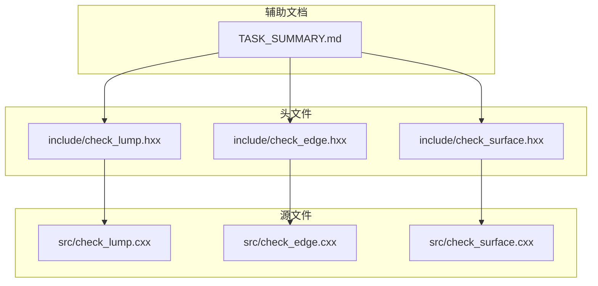
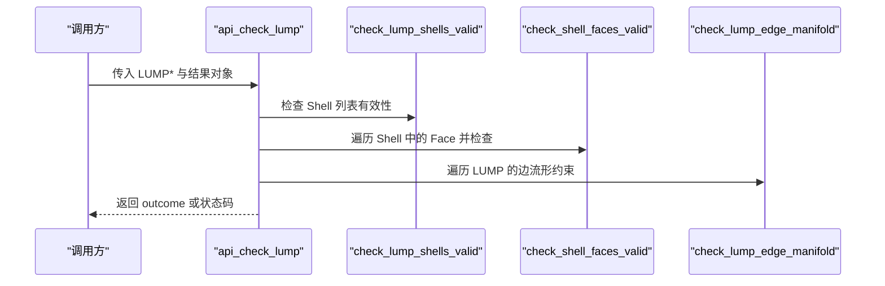
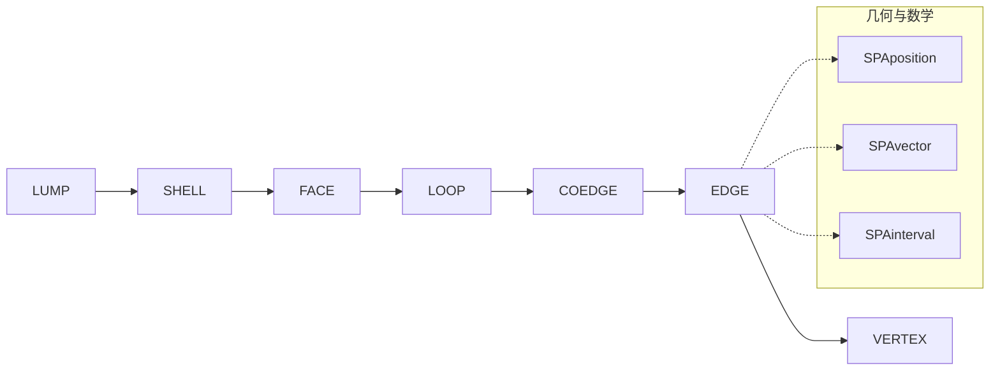

# 拓扑有效性检查

<cite>
**本文引用的文件**
- [check_lump.hxx](file://include/check_lump.hxx)
- [check_lump.cxx](file://src/check_lump.cxx)
- [check_edge.hxx](file://include/check_edge.hxx)
- [check_edge.cxx](file://src/check_edge.cxx)
- [TASK_SUMMARY.md](file://TASK_SUMMARY.md)
</cite>

## 目录
1. [简介](#简介)
2. [项目结构](#项目结构)
3. [核心组件](#核心组件)
4. [架构总览](#架构总览)
5. [详细组件分析](#详细组件分析)
6. [依赖关系分析](#依赖关系分析)
7. [性能考量](#性能考量)
8. [故障排查指南](#故障排查指南)
9. [结论](#结论)

## 简介
本文件聚焦于 LUMP 检查中的拓扑有效性相关函数，系统性地解析以下三个关键函数：
- check_lump_shells_valid（Shell 有效性检查）
- check_shell_faces_valid（面有效性检查）
- check_lump_edge_manifold（边流形检查）

文档将从检查原理、ACIS API 调用方式、拓扑规则验证逻辑、错误条件判断标准与返回值含义等方面进行深入说明，并解释流形拓扑的概念、Shell 与 Face 的连接规则，以及如何通过 ACIS API 遍历和验证几何拓扑结构。

## 项目结构
该模块位于 Interface 工程中，采用“头文件声明 + 源文件实现”的分层组织：
- 头文件提供对外接口与枚举状态定义
- 源文件实现具体检查逻辑与 ACIS API 调用
- 与 TASK_SUMMARY.md 协同，明确各模块的职责与接口模式

图表来源
- [check_lump.hxx:1-117](file://include/check_lump.hxx#L1-L117)
- [check_edge.hxx:1-130](file://include/check_edge.hxx#L1-L130)
- [TASK_SUMMARY.md:1-306](file://TASK_SUMMARY.md#L1-L306)

章节来源
- [check_lump.hxx:1-117](file://include/check_lump.hxx#L1-L117)
- [check_edge.hxx:1-130](file://include/check_edge.hxx#L1-L130)
- [TASK_SUMMARY.md:1-306](file://TASK_SUMMARY.md#L1-L306)

## 核心组件
本节概述与拓扑有效性检查直接相关的数据结构与状态枚举，便于理解后续函数的行为与返回语义。

- 拓扑检查结果类（lump_check_result）
  - 提供状态查询、统计信息（Shell/坏面/坏边数量）与错误收集容器
  - 用于封装检查过程中的各类“异常”记录

- LUMP 检查状态枚举（lump_check_status）
  - 覆盖 Shell 有效性、包含关系、体积、包围盒、方向一致性、面邻接、边流形等多个维度
  - 位掩码形式便于组合多类错误

- 边流形检查专用状态（来自 EDGE 检查）
  - EDGE_CHECK_NON_G1_CONTINUITY、EDGE_CHECK_COEDGE_SENSE_ERROR 等，体现流形与方向一致性要求

章节来源
- [check_lump.hxx:9-48](file://include/check_lump.hxx#L9-L48)
- [check_lump.hxx:106-109](file://include/check_lump.hxx#L106-L109)
- [check_edge.hxx:9-26](file://include/check_edge.hxx#L9-L26)

## 架构总览
下图展示 LUMP 检查主流程与三个目标函数的关系，以及它们如何与 ACIS 拓扑对象交互。

图表来源
- [check_lump.cxx:58-106](file://src/check_lump.cxx#L58-L106)
- [check_lump.cxx:108-136](file://src/check_lump.cxx#L108-L136)
- [check_lump.cxx:138-171](file://src/check_lump.cxx#L138-L171)
- [check_lump.cxx:612-665](file://src/check_lump.cxx#L612-L665)

章节来源
- [check_lump.cxx:58-106](file://src/check_lump.cxx#L58-L106)

## 详细组件分析

### Shell 有效性检查：check_lump_shells_valid
- 功能定位
  - 验证 LUMP 是否包含至少一个 SHELL；若无 Shell，记录严重错误
  - 若某个 SHELL 不包含任何 FACE/WIRE，记录警告
  - 返回逻辑值指示整体有效性

- 检查原理与规则
  - 顶层规则：LUMP 至少应有一个 SHELL
  - SHELL 规则：空 SHELL（既无 FACE 也无 WIRE）属于警告级别，不影响整体成功但提示潜在问题
  - 通过 LUMP->shell() 进行链式遍历，逐个 SHELL 执行校验

- ACIS API 调用方式
  - 使用 LUMP 的迭代器访问 SHELL 链表
  - 对每个 SHELL，使用 shell->face()/shell->wire() 判断是否存在几何元素

- 错误条件与返回值
  - 无 Shell：返回 FALSE，并在错误列表中添加严重错误
  - 存在空 SHELL：返回 FALSE（整体有效性受影响），同时记录警告
  - 正常情况：返回 TRUE

- 适用场景
  - 构建几何模型后，快速确认 LUMP 的基本拓扑完整性
  - 作为更细粒度检查的前置条件

章节来源
- [check_lump.cxx:108-136](file://src/check_lump.cxx#L108-L136)

### 面有效性检查：check_shell_faces_valid
- 功能定位
  - 验证 SHELL 中每个 FACE 的表面信息是否有效
  - 验证每个 FACE 的 LOOP 是否至少包含一个 COEDGE
  - 返回逻辑值指示有效性

- 检查原理与规则
  - FACE 规则：必须存在有效的 SURFACE（surfi() 非空）
  - LOOP 规则：每个 LOOP 至少应有 1 个 COEDGE，否则视为错误
  - 通过 SHELL->face() 遍历所有 FACE，再对每个 FACE 的 LOOP 链表进行遍历

- ACIS API 调用方式
  - 使用 SHELL->face() 获取 FACE 链表
  - 使用 FACE->loop() 获取 LOOP 链表
  - 使用 FACE->surfi() 检查表面有效性
  - 使用 LOOP->coedge() 检查环内边元

- 错误条件与返回值
  - FACE 缺失 SURFACE：记录严重错误，返回 FALSE
  - LOOP 缺失 COEDGE：记录严重错误，返回 FALSE
  - 正常情况：返回 TRUE

- 适用场景
  - 面片构建阶段的拓扑完整性校验
  - 为后续边流形与邻接检查提供基础

章节来源
- [check_lump.cxx:138-171](file://src/check_lump.cxx#L138-L171)

### 边流形检查：check_lump_edge_manifold
- 功能定位
  - 检查 LUMP 中每条 EDGE 的流形性质
  - 在流形拓扑中，任意 EDGE 最多被两个 COEDGE 共享（即边最多连接两个面）
  - 通过统计某 EDGE 上 COEDGE 的数量来判断是否满足流形条件

- 检查原理与规则
  - 流形拓扑概念：对于三维几何，若每条边最多被两个面共享，则称该几何为边流形（edge-manifold）
  - 计算方法：对每条 EDGE，遍历其 coedge() 链表，统计出现次数
  - 判定标准：若某 EDGE 的 COEDGE 数量为奇数或非零但不是偶数（例如 1、3、5…），则判定为非流形
  - 注意：此处采用“偶数”作为流形的近似判据，实际工程中通常要求每个 EDGE 的 COEDGE 数量为 0 或 2

- ACIS API 调用方式
  - 使用 LUMP->shell() 遍历 SHELL
  - 使用 SHELL->face() 遍历 FACE
  - 使用 FACE->loop() 遍历 LOOP
  - 使用 LOOP->coedge() 遍历 COEDGE
  - 使用 COEDGE->edge() 获取所属 EDGE
  - 使用 EDGE->coedge() 遍历该 EDGE 关联的所有 COEDGE，统计数量

- 错误条件与返回值
  - 发现非流形 EDGE（COEDGE 数量为奇数或非零但非偶数）：记录警告，返回 FALSE
  - 正常情况：返回 TRUE

- 适用场景
  - 生成网格或进行布尔运算前，确保几何满足流形要求
  - 识别潜在的拓扑缺陷（如悬挂边、三面或更多面共享同一边）

章节来源
- [check_lump.cxx:612-665](file://src/check_lump.cxx#L612-L665)

### 边流形检查与 ACIS API 的关系
- 与 EDGE 检查模块的对比
  - EDGE 模块关注单条边的局部属性（如参数范围、闭合性、方向一致性等）
  - LUMP 边流形检查关注全局拓扑连通性（每条边的邻接数量）
- 与 Coedge 的关系
  - Coedge 是 EDGE 在 FACE 边界上的定向表示，是判断流形性的关键
  - 通过遍历 EDGE 的 coedge() 链表，可统计该 EDGE 被多少个面共享

章节来源
- [check_edge.cxx:455-489](file://src/check_edge.cxx#L455-L489)
- [check_lump.cxx:612-665](file://src/check_lump.cxx#L612-L665)

## 依赖关系分析
- 模块间耦合
  - LUMP 检查模块依赖 ACIS 的 LUMP/SHELL/FACE/EDGE/COEDGE 等拓扑类
  - 错误收集通过 insanity_list/insanity_data 完成，统一输出格式
- 外部依赖
  - ACIS 数学与几何 API：SPAposition、SPAvector、SPAinterval 等
  - 容差常量：SPAresabs、SPAresnor 等，用于数值比较的容差控制

图表来源
- [check_lump.cxx:1-17](file://src/check_lump.cxx#L1-L17)
- [check_edge.cxx:1-11](file://src/check_edge.cxx#L1-L11)

章节来源
- [check_lump.cxx:1-17](file://src/check_lump.cxx#L1-L17)
- [check_edge.cxx:1-11](file://src/check_edge.cxx#L1-L11)

## 性能考量
- 遍历复杂度
  - Shell 有效性：O(S)，S 为 SHELL 数量
  - 面有效性：O(F)，F 为 FACE 数量
  - 边流形检查：O(E+C)，E 为 EDGE 数量，C 为 COEDGE 总数
- 优化建议
  - 合理利用 ACIS 的迭代器（如 shell->next()、face->next() 等）避免重复扫描
  - 对于大规模模型，优先执行代价较低的检查（如 Shell 有效性）以尽早短路
  - 在流形检查中，尽量复用中间结果（如已统计过的 EDGE 的 COEDGE 数量）

## 故障排查指南
- 常见错误类型与定位
  - 无 Shell：检查 LUMP 构建流程，确认 SHELL 是否正确生成
  - 空 SHELL：检查是否遗漏了 FACE/WIRE 的创建
  - 面缺失 SURFACE：检查面片的表面定义是否完整
  - LOOP 缺失 COEDGE：检查边界构造是否完整
  - 非流形边：定位到具体 EDGE，检查其相邻面的数量与方向一致性
- 输出与诊断
  - 使用 api_check_lump_status 或 api_check_lump 获取汇总状态
  - 通过结果对象的错误列表（insanity_list）逐条查看详细描述

章节来源
- [check_lump.cxx:667-765](file://src/check_lump.cxx#L667-L765)

## 结论
- check_lump_shells_valid、check_shell_faces_valid、check_lump_edge_manifold 三者分别从“整体拓扑完整性”、“面片有效性”和“边流形约束”三个维度保障 LUMP 的拓扑正确性
- 通过 ACIS 的拓扑迭代器与几何 API，能够高效、准确地完成这些检查
- 在工程实践中，建议先执行 Shell 与面有效性检查，再进行边流形检查，以获得更清晰的错误定位与更高的执行效率