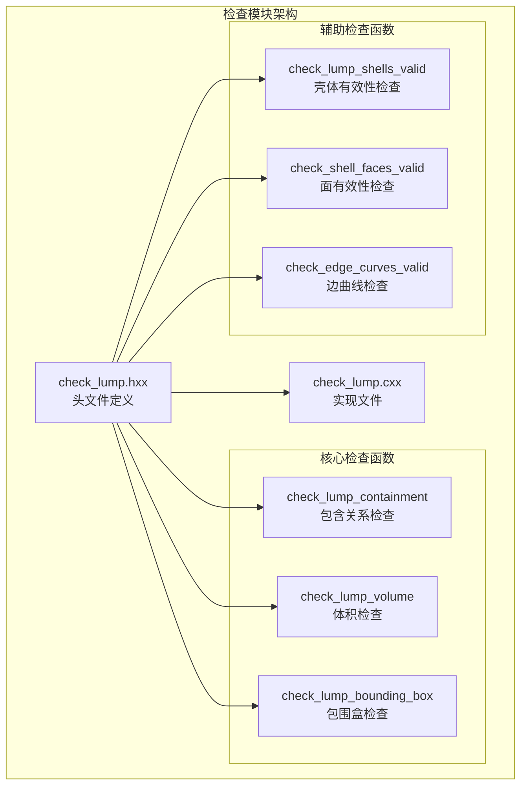
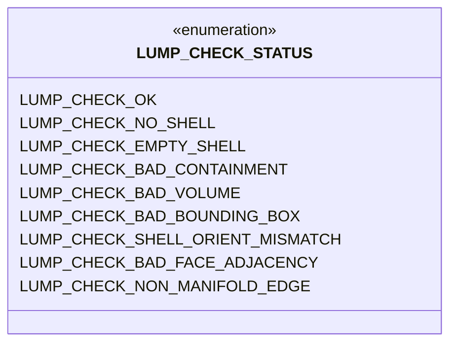
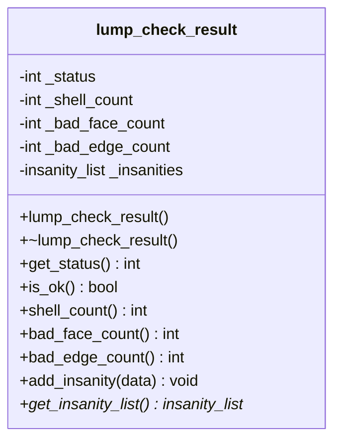
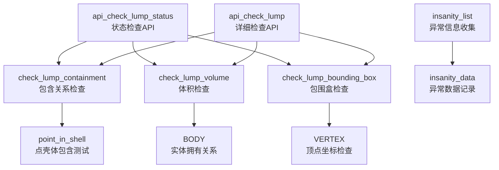
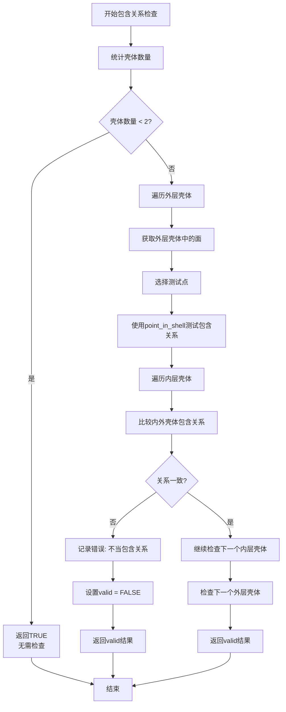
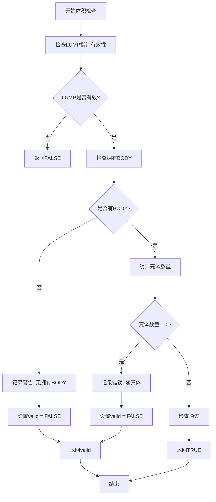
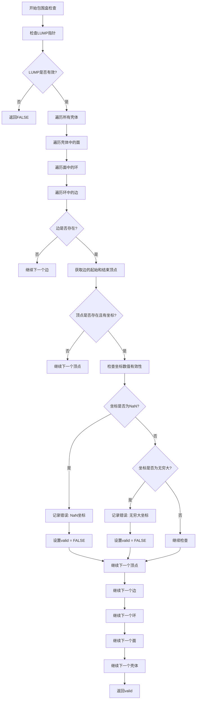
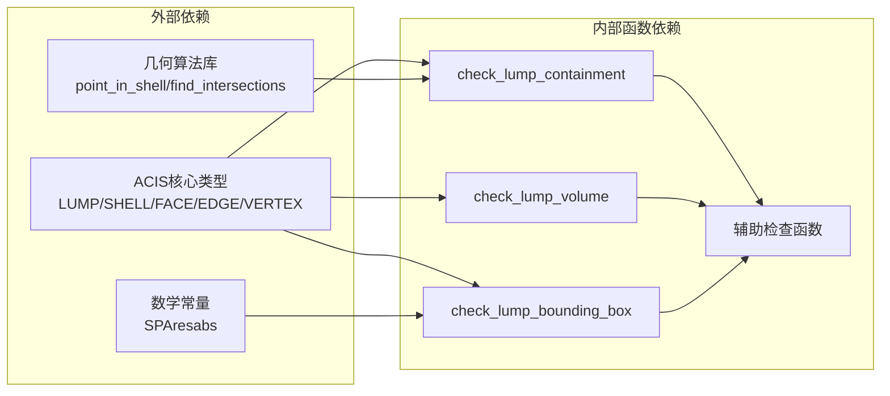

# 空间关系检查

<cite>
**本文档引用的文件**
- [check_lump.hxx](file://include/check_lump.hxx)
- [check_lump.cxx](file://src/check_lump.cxx)
</cite>

## 目录
1. [简介](#简介)
2. [项目结构](#项目结构)
3. [核心组件](#核心组件)
4. [架构概览](#架构概览)
5. [详细组件分析](#详细组件分析)
6. [依赖关系分析](#依赖关系分析)
7. [性能考虑](#性能考虑)
8. [故障排除指南](#故障排除指南)
9. [结论](#结论)

## 简介

本文件专注于ACIS几何模型中空间关系检查相关的核心函数，特别是以下三个关键函数：
- `check_lump_containment`：包含关系检查
- `check_lump_volume`：体积检查  
- `check_lump_bounding_box`：包围盒检查

这些函数在确保几何模型空间关系正确性和数值稳定性方面发挥着至关重要的作用，通过验证几何实体间的包含关系、计算和验证体积的有效性，以及检查包围盒的完整性，为后续的几何操作提供可靠的基础。

## 项目结构

该空间关系检查功能位于ACIS几何建模接口的检查模块中，采用分层架构设计：

**图表来源**
- [check_lump.hxx:50-94](file://include/check_lump.hxx#L50-L94)
- [check_lump.cxx:173-520](file://src/check_lump.cxx#L173-L520)

**章节来源**
- [check_lump.hxx:1-117](file://include/check_lump.hxx#L1-L117)
- [check_lump.cxx:1-766](file://src/check_lump.cxx#L1-L766)

## 核心组件

### 检查状态枚举

系统定义了完整的检查状态枚举，用于标识不同类型的检查结果：

**图表来源**
- [check_lump.hxx:9-25](file://include/check_lump.hxx#L9-L25)

### 检查结果类

`lump_check_result`类提供了统一的结果管理机制：

**图表来源**
- [check_lump.hxx:27-48](file://include/check_lump.hxx#L27-L48)

**章节来源**
- [check_lump.hxx:9-48](file://include/check_lump.hxx#L9-L48)

## 架构概览

空间关系检查的整体架构采用分层设计，从高级API到具体实现：

**图表来源**
- [check_lump.cxx:667-765](file://src/check_lump.cxx#L667-L765)
- [check_lump.cxx:173-520](file://src/check_lump.cxx#L173-L520)

## 详细组件分析

### check_lump_containment 包含关系检查

该函数专门负责验证几何实体间的包含关系，确保壳体层次结构的正确性。

#### 核心算法流程

**图表来源**
- [check_lump.cxx:173-238](file://src/check_lump.cxx#L173-L238)

#### 实现特点

1. **双层循环遍历**：对外层和内层壳体进行双重遍历，确保所有可能的包含关系都被验证
2. **随机采样测试点**：在每个壳体的面上选择参数空间中的测试点，提高检查效率
3. **包含关系一致性验证**：确保相邻壳体的包含关系方向正确

#### 关键实现细节

- 使用`point_in_shell`函数进行点到壳体的包含关系测试
- 对每个壳体面选择参数空间的中心点作为测试点
- 比较内外壳体对同一测试点的包含关系结果

**章节来源**
- [check_lump.cxx:173-238](file://src/check_lump.cxx#L173-L238)

### check_lump_volume 体积检查

该函数负责验证几何实体的体积有效性，确保几何模型具有合理的体积属性。

#### 检查逻辑

**图表来源**
- [check_lump.cxx:415-454](file://src/check_lump.cxx#L415-L454)

#### 检查要点

1. **实体拥有关系验证**：检查LUMP是否正确地属于某个BODY
2. **壳体数量检查**：确保几何实体至少包含一个有效的壳体
3. **空壳体检测**：防止出现没有任何几何信息的空实体

**章节来源**
- [check_lump.cxx:415-454](file://src/check_lump.cxx#L415-L454)

### check_lump_bounding_box 包围盒检查

该函数专门负责验证几何实体的包围盒完整性，确保所有顶点坐标的数值有效性。

#### 数值稳定性检查流程

**图表来源**
- [check_lump.cxx:456-520](file://src/check_lump.cxx#L456-L520)

#### 数值稳定性保障

1. **NaN检测**：严格检查所有顶点坐标的数值有效性
2. **无穷大检测**：防止出现数值溢出导致的无效几何
3. **完整遍历**：确保检查覆盖几何模型的所有顶点

**章节来源**
- [check_lump.cxx:456-520](file://src/check_lump.cxx#L456-L520)

## 依赖关系分析

空间关系检查函数之间的依赖关系体现了清晰的职责分离：

**图表来源**
- [check_lump.cxx:1-16](file://src/check_lump.cxx#L1-L16)
- [check_lump.cxx:173-238](file://src/check_lump.cxx#L173-L238)
- [check_lump.cxx:415-520](file://src/check_lump.cxx#L415-L520)

### 外部依赖分析

1. **ACIS核心类型依赖**：所有检查函数都依赖于ACIS几何建模系统的标准数据结构
2. **几何算法依赖**：包含关系检查依赖于`point_in_shell`等几何算法
3. **数值精度常量**：包围盒检查使用`SPAresabs`进行数值比较

**章节来源**
- [check_lump.cxx:1-16](file://src/check_lump.cxx#L1-L16)

## 性能考虑

### 时间复杂度分析

1. **check_lump_containment**：O(n²)，其中n是壳体数量，需要进行双重嵌套循环检查
2. **check_lump_volume**：O(n)，线性时间复杂度，主要消耗在壳体计数上
3. **check_lump_bounding_box**：O(m)，其中m是几何模型中顶点的总数

### 内存使用优化

1. **延迟检查策略**：只有在必要时才进行复杂的几何算法调用
2. **早期退出机制**：在发现错误时立即停止进一步检查
3. **最小化对象创建**：避免在检查过程中创建不必要的临时对象

### 并行化可能性

当前实现采用串行检查策略，但在某些情况下可以考虑：
- 对独立的壳体进行并行检查
- 利用现代多核处理器加速大规模几何模型的检查

## 故障排除指南

### 常见问题诊断

#### 包含关系错误
- **症状**：`check_lump_containment`返回FALSE
- **原因**：壳体层次结构不正确或包含关系方向错误
- **解决方案**：检查几何模型的布尔运算历史，重新构建正确的包含关系

#### 体积检查失败
- **症状**：`check_lump_volume`报告零壳体或无拥有BODY
- **原因**：几何模型为空或未正确关联到BODY
- **解决方案**：验证几何模型的完整性，确保正确的实体关联

#### 包围盒数值错误
- **症状**：`check_lump_bounding_box`检测到NaN或无穷大坐标
- **原因**：几何建模过程中的数值不稳定或算法错误
- **解决方案**：检查几何建模参数，重新执行建模操作

### 调试建议

1. **启用详细日志**：使用`lump_check_result`收集详细的检查信息
2. **分步调试**：分别运行三个检查函数，定位具体问题所在
3. **可视化验证**：结合几何模型的可视化工具进行人工验证

**章节来源**
- [check_lump.cxx:48-56](file://src/check_lump.cxx#L48-L56)
- [check_lump.cxx:667-765](file://src/check_lump.cxx#L667-L765)

## 结论

空间关系检查模块为ACIS几何建模系统提供了关键的质量保证机制。通过`check_lump_containment`、`check_lump_volume`和`check_lump_bounding_box`三个核心函数，系统能够：

1. **确保几何模型的拓扑正确性**：通过包含关系检查维护壳体层次结构的合理性
2. **验证几何实体的物理意义**：通过体积检查确保模型具有有效的体积属性
3. **保障数值稳定性**：通过包围盒检查防止数值异常影响后续计算

这些检查函数不仅提供了基础的几何验证能力，还为更高级的几何处理操作奠定了坚实的基础。其模块化的架构设计使得检查功能易于扩展和维护，同时保持了良好的性能特征。