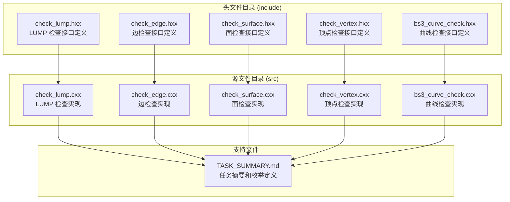
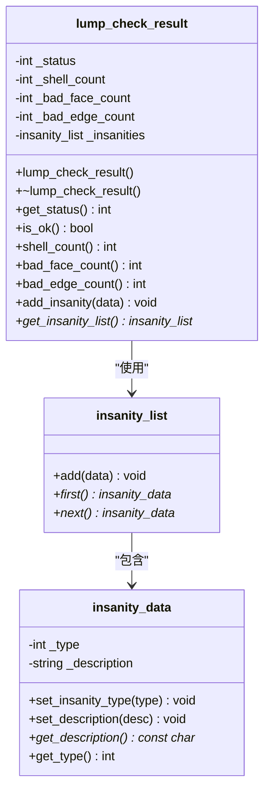
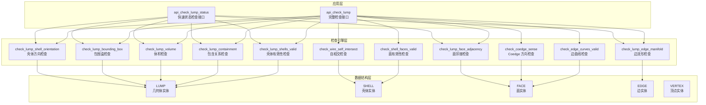
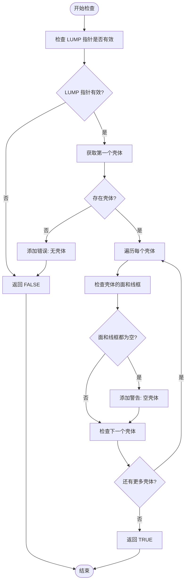
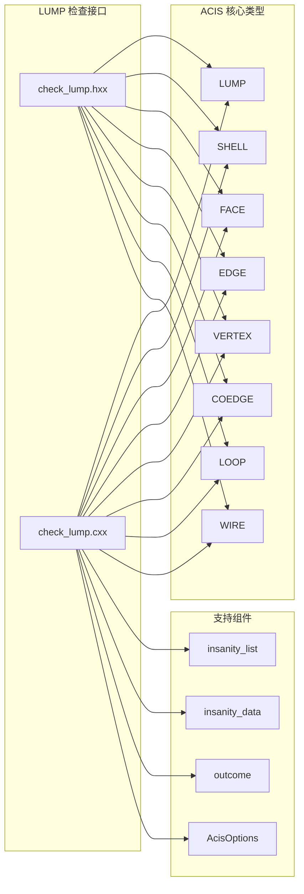

# LUMP 检查接口

<cite>
**本文档引用的文件**
- [check_lump.hxx](file://include/check_lump.hxx)
- [check_lump.cxx](file://src/check_lump.cxx)
- [check_edge.hxx](file://include/check_edge.hxx)
- [check_surface.hxx](file://include/check_surface.hxx)
- [check_vertex.hxx](file://include/check_vertex.hxx)
- [TASK_SUMMARY.md](file://TASK_SUMMARY.md)
</cite>

## 目录
1. [简介](#简介)
2. [项目结构](#项目结构)
3. [核心组件](#核心组件)
4. [架构概览](#架构概览)
5. [详细组件分析](#详细组件分析)
6. [依赖分析](#依赖分析)
7. [性能考虑](#性能考虑)
8. [故障排除指南](#故障排除指南)
9. [结论](#结论)

## 简介

LUMP 检查接口是 ACIS 几何建模库中的一个重要功能模块，专门用于验证和检查几何体的完整性。该接口提供了两种主要的检查模式：完整检查模式（api_check_lump）和快速状态检查模式（api_check_lump_status），能够检测几何体中的各种问题，包括壳体完整性、面邻接关系、边的拓扑结构等。

## 项目结构

该项目采用模块化的 C++ 设计，主要包含以下结构：



**图表来源**
- [check_lump.hxx:1-117](file://include/check_lump.hxx#L1-L117)
- [check_lump.cxx:1-766](file://src/check_lump.cxx#L1-L766)

**章节来源**
- [check_lump.hxx:1-117](file://include/check_lump.hxx#L1-L117)
- [check_lump.cxx:1-766](file://src/check_lump.cxx#L1-L766)

## 核心组件

### LUMP 检查状态枚举

LUMP 检查接口定义了完整的错误状态枚举，用于标识不同类型的几何问题：

| 枚举值 | 值 | 说明 |
|--------|-----|------|
| `LUMP_CHECK_OK` | 0 | 无错误 |
| `LUMP_CHECK_NO_SHELL` | 1<<0 | 无 Shell |
| `LUMP_CHECK_EMPTY_SHELL` | 1<<1 | 空 Shell |
| `LUMP_CHECK_SHELL_SELF_INT` | 1<<2 | Shell 自交 |
| `LUMP_CHECK_BAD_CONTAINMENT` | 1<<3 | 包含关系错误 |
| `LUMP_CHECK_INTERSECT_SHELLS` | 1<<4 | Shell 相交 |
| `LUMP_CHECK_DEGENERATE_FACE` | 1<<5 | 退化面 |
| `LUMP_CHECK_BAD_COEDGE_SENSE` | 1<<6 | Coedge 方向错误 |
| `LUMP_CHECK_NULL_EDGE_CURVE` | 1<<7 | 边曲线为空 |
| `LUMP_CHECK_NON_MANIFOLD_VTX` | 1<<8 | 非流形顶点 |
| `LUMP_CHECK_BAD_VOLUME` | 1<<9 | 体积异常 |
| `LUMP_CHECK_BAD_BOUNDING_BOX` | 1<<10 | 包围盒异常 |
| `LUMP_CHECK_SHELL_ORIENT_MISMATCH` | 1<<11 | Shell 方向不一致 |
| `LUMP_CHECK_BAD_FACE_ADJACENCY` | 1<<12 | 面邻接异常 |
| `LUMP_CHECK_NON_MANIFOLD_EDGE` | 1<<13 | 非流形边 |

### LUMP 检查结果类



**图表来源**
- [check_lump.hxx:27-48](file://include/check_lump.hxx#L27-L48)

**章节来源**
- [check_lump.hxx:9-25](file://include/check_lump.hxx#L9-L25)
- [check_lump.hxx:27-48](file://include/check_lump.hxx#L27-L48)

## 架构概览

LUMP 检查接口采用了分层架构设计，从高层的 API 接口到底层的具体检查算法：



**图表来源**
- [check_lump.cxx:58-106](file://src/check_lump.cxx#L58-L106)
- [check_lump.cxx:667-765](file://src/check_lump.cxx#L667-L765)

## 详细组件分析

### 主要接口函数

#### api_check_lump 完整检查接口

**函数签名**
```cpp
outcome api_check_lump(
    LUMP           *lump,
    lump_check_result &result,
    AcisOptions    *ao = NULL
);
```

**参数说明**
- `lump`: 指向要检查的几何体（LUMP）指针
- `result`: 对象引用，用于存储检查结果
- `ao`: 可选的 ACIS 选项参数，默认为 NULL

**返回值**
- 返回 `outcome` 类型对象，表示检查操作的整体状态
- 成功时返回 `outcome::success`
- 失败时返回包含错误信息的 `outcome` 对象

**功能特性**
- 执行完整的几何体检查流程
- 收集详细的检查结果和错误信息
- 统计各种类型的几何问题数量
- 提供详细的诊断信息

**章节来源**
- [check_lump.hxx:50-54](file://include/check_lump.hxx#L50-L54)
- [check_lump.cxx:58-106](file://src/check_lump.cxx#L58-L106)

#### api_check_lump_status 快速状态检查接口

**函数签名**
```cpp
int api_check_lump_status(
    LUMP *lump,
    int  *insanity_count = NULL
);
```

**参数说明**
- `lump`: 指向要检查的几何体（LUMP）指针
- `insanity_count`: 可选的指针，用于返回发现的问题数量

**返回值**
- 返回 `int` 类型的状态码，组合了多种检查状态
- 使用位掩码方式表示不同的错误类型
- 0 表示没有发现问题

**性能优势**
- 仅执行关键的检查步骤，跳过详细的错误收集
- 不创建详细的诊断列表，减少内存分配
- 适合需要快速判断几何体质量的场景
- 性能开销显著低于完整检查模式

**使用场景**
- 批量检查大量几何体
- 实时质量监控
- 快速过滤有问题的几何体
- 性能敏感的应用场景

**章节来源**
- [check_lump.hxx:111-114](file://include/check_lump.hxx#L111-L114)
- [check_lump.cxx:667-765](file://src/check_lump.cxx#L667-L765)

### 检查算法详细分析

#### 壳体有效性检查 (check_lump_shells_valid)

该检查确保几何体包含有效的壳体结构：



**图表来源**
- [check_lump.cxx:108-136](file://src/check_lump.cxx#L108-L136)

#### 包含关系检查 (check_lump_containment)

该检查验证多个壳体之间的包含关系是否正确：

```mermaid
sequenceDiagram
participant LUMP as LUMP 对象
participant Outer as 外壳体
participant Inner as 内壳体
participant Point as 测试点
participant Checker as 包含关系检查器
LUMP->>Outer : 获取第一个外壳体
Loop1 : Outer->>Outer : 遍历外壳体
Outer->>Inner : 获取下一个内壳体
Loop2 : Inner->>Inner : 遍历内壳体
Inner->>Point : 计算外壳体测试点
Inner->>Point : 计算内壳体测试点
Inner->>Checker : 检查包含关系
Checker-->>Inner : 返回包含关系结果
Inner->>Checker : 比较两个包含关系
alt 包含关系不一致
Inner->>Checker : 添加错误报告
end
Inner->>Inner : 检查下一个内壳体
Loop2
Outer->>Outer : 检查下一个外壳体
Loop1
```

**图表来源**
- [check_lump.cxx:173-238](file://src/check_lump.cxx#L173-L238)

**章节来源**
- [check_lump.cxx:108-238](file://src/check_lump.cxx#L108-L238)

### 错误处理机制

LUMP 检查接口采用了多层次的错误处理策略：

1. **输入验证**: 在函数入口处验证参数的有效性
2. **运行时检查**: 在检查过程中动态检测各种几何问题
3. **错误分类**: 将错误分为严重错误（ERROR_TYPE）和警告（WARNING）
4. **详细记录**: 使用 `insanity_list` 和 `insanity_data` 记录详细的错误信息
5. **状态聚合**: 将多个检查结果聚合到最终的状态码中

**章节来源**
- [check_lump.cxx:65-67](file://src/check_lump.cxx#L65-L67)
- [check_lump.cxx:114-119](file://src/check_lump.cxx#L114-L119)

## 依赖分析

LUMP 检查接口与 ACIS 几何建模库的其他组件有密切的依赖关系：



**图表来源**
- [check_lump.hxx:4-7](file://include/check_lump.hxx#L4-L7)
- [check_lump.cxx:1-16](file://src/check_lump.cxx#L1-L16)

**章节来源**
- [check_lump.hxx:4-7](file://include/check_lump.hxx#L4-L7)
- [check_lump.cxx:1-16](file://src/check_lump.cxx#L1-L16)

## 性能考虑

### 性能特征对比

| 特征 | api_check_lump | api_check_lump_status |
|------|----------------|----------------------|
| **检查范围** | 全面检查所有几何属性 | 仅检查关键属性 |
| **内存使用** | 高（创建详细诊断列表） | 低（仅统计计数） |
| **执行时间** | 较长 | 短 |
| **错误详情** | 详细诊断信息 | 状态码汇总 |
| **适用场景** | 调试和详细分析 | 快速质量评估 |

### 优化建议

1. **批量处理**: 对于大量几何体，优先使用快速检查接口
2. **选择性检查**: 根据具体需求选择合适的检查级别
3. **缓存策略**: 对于重复检查的几何体，考虑缓存检查结果
4. **并行处理**: 利用多核处理器并行检查独立的几何体

## 故障排除指南

### 常见问题及解决方案

#### 1. 函数返回 API_NULL_ARGUMENT 错误

**症状**: 检查函数返回空指针错误
**原因**: 传入的 LUMP 指针为空或不是有效的 LUMP 类型
**解决方法**: 
- 确保 LUMP 指针在调用前已正确初始化
- 验证 LUMP 对象的类型标识符

#### 2. 检查结果为空但状态码非零

**症状**: 检查结果显示没有发现错误，但状态码表明存在问题
**原因**: 快速检查模式可能遗漏了一些细节问题
**解决方法**:
- 使用完整检查接口重新检查
- 检查 `insanity_list` 中的详细诊断信息

#### 3. 性能问题

**症状**: 检查过程耗时过长
**原因**: 几何体过于复杂或包含大量面片
**解决方法**:
- 考虑使用快速检查接口
- 分批处理大型几何体
- 优化几何体结构

**章节来源**
- [check_lump.cxx:65-67](file://src/check_lump.cxx#L65-L67)
- [check_lump.cxx:671-673](file://src/check_lump.cxx#L671-L673)

## 结论

LUMP 检查接口提供了完整的几何体质量保证机制，通过两种不同的检查模式满足了不同场景的需求。完整检查模式适用于需要详细诊断信息的场景，而快速检查模式则适合性能敏感的应用。该接口的设计充分考虑了 ACIS 几何建模库的特点，提供了可靠的错误检测和处理能力。

通过合理选择检查模式和优化使用策略，开发者可以有效地利用 LUMP 检查接口来提高几何建模的质量和可靠性。