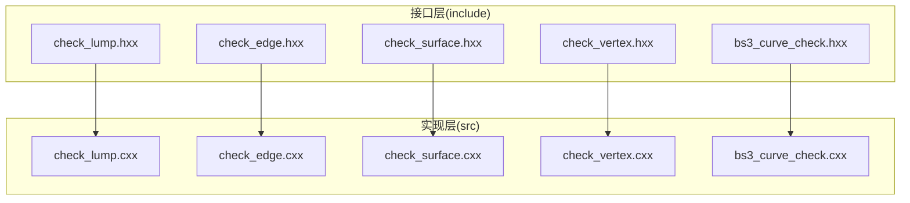
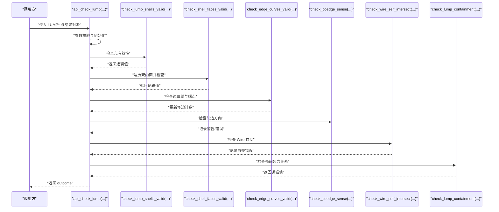
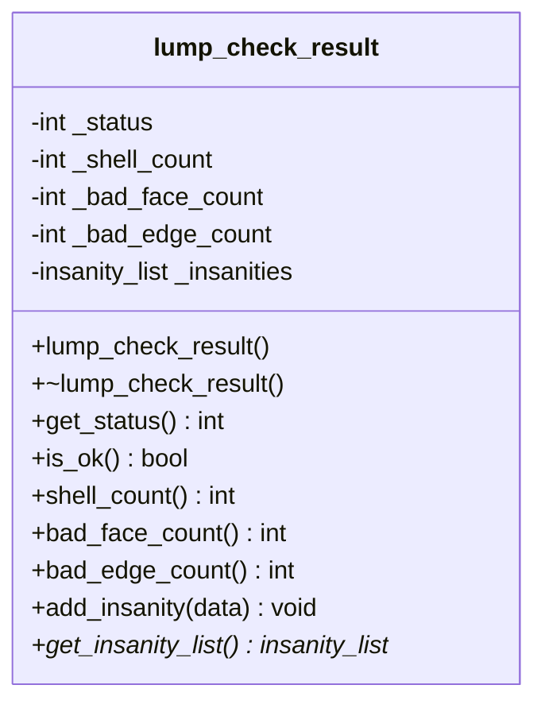
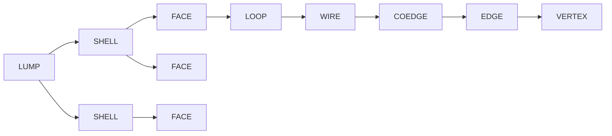
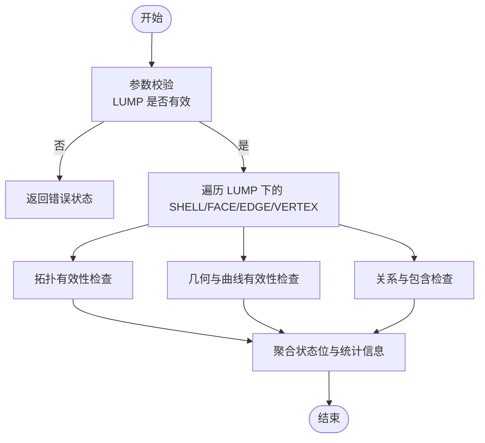
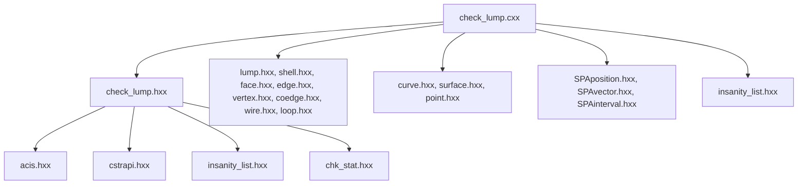

# LUMP 检查概述

<cite>
**本文档引用的文件**
- [check_lump.hxx](file://include/check_lump.hxx)
- [check_lump.cxx](file://src/check_lump.cxx)
- [check_edge.hxx](file://include/check_edge.hxx)
- [check_surface.hxx](file://include/check_surface.hxx)
- [check_vertex.hxx](file://include/check_vertex.hxx)
- [bs3_curve_check.hxx](file://include/bs3_curve_check.hxx)
- [TASK_SUMMARY.md](file://TASK_SUMMARY.md)
</cite>

## 目录
1. [简介](#简介)
2. [项目结构](#项目结构)
3. [核心组件](#核心组件)
4. [架构总览](#架构总览)
5. [详细组件分析](#详细组件分析)
6. [依赖关系分析](#依赖关系分析)
7. [性能考虑](#性能考虑)
8. [故障排除指南](#故障排除指南)
9. [结论](#结论)

## 简介
本文件为 LUMP 几何实体检查模块的概述文档，面向使用 ACIS 3D 内核进行几何建模与分析的开发者。文档系统性介绍 LUMP 检查的整体架构、13个检查函数的功能分类、状态枚举含义、检查结果类的设计原理；解释 LUMP 在 ACIS 拓扑层级中的地位及其与 SHELL/FACE/EDGE/VERTEX 等实体的关系；并提供检查流程图与状态转换说明，帮助读者快速理解 LUMP 检查的工作原理与应用场景。

## 项目结构
该模块位于 Interface 工程中，采用“按实体分层”的组织方式：
- include 目录：各几何实体检查的公共接口与状态定义
- src 目录：各实体检查的具体实现
- TASK_SUMMARY.md：模块功能与统计汇总

图表来源
- [check_lump.hxx:1-117](file://include/check_lump.hxx#L1-L117)
- [check_lump.cxx:1-766](file://src/check_lump.cxx#L1-L766)

章节来源
- [TASK_SUMMARY.md:1-306](file://TASK_SUMMARY.md#L1-L306)

## 核心组件
- 状态枚举：lump_check_status，以位掩码形式表示不同类型的检查结果或错误类别
- 结果类：lump_check_result，封装检查状态、统计信息（壳数量、坏面数量、坏边数量）与错误集合
- API 函数：
  - 详细诊断：api_check_lump(...)
  - 快速检测：api_check_lump_status(...)
- 子检查函数：围绕 LUMP 的拓扑与几何特性设计的13个具体检查逻辑

章节来源
- [check_lump.hxx:9-48](file://include/check_lump.hxx#L9-L48)
- [check_lump.cxx:18-56](file://src/check_lump.cxx#L18-L56)

## 架构总览
LUMP 检查模块遵循“统一入口 + 分层子检查”的架构模式：
- 统一入口负责参数校验、遍历 LUMP 下的 SHELL/FACE/EDGE/VERTEX 等拓扑元素
- 每个子检查函数聚焦于特定维度（拓扑连通性、几何有效性、数值稳定性）
- 结果通过 lump_check_result 或状态位返回，支持快速判断与详细诊断

图表来源
- [check_lump.cxx:58-106](file://src/check_lump.cxx#L58-L106)
- [check_lump.cxx:108-238](file://src/check_lump.cxx#L108-L238)

## 详细组件分析

### 状态枚举与语义
lump_check_status 使用位掩码，便于组合多种错误类型：
- LUMP_CHECK_OK：无错误
- LUMP_CHECK_NO_SHELL：LUMP 不包含任何 SHELL
- LUMP_CHECK_EMPTY_SHELL：壳内既无面也无线
- LUMP_CHECK_SHELL_SELF_INT：壳自身自交
- LUMP_CHECK_BAD_CONTAINMENT：壳间包含关系不一致
- LUMP_CHECK_INTERSECT_SHELLS：壳之间相交
- LUMP_CHECK_DEGENERATE_FACE：退化面
- LUMP_CHECK_BAD_COEDGE_SENSE：共边方向错误
- LUMP_CHECK_NULL_EDGE_CURVE：边曲线为空
- LUMP_CHECK_NON_MANIFOLD_VTX：非流形顶点
- LUMP_CHECK_BAD_VOLUME：体积异常
- LUMP_CHECK_BAD_BOUNDING_BOX：包围盒异常
- LUMP_CHECK_SHELL_ORIENT_MISMATCH：壳方向不一致
- LUMP_CHECK_BAD_FACE_ADJACENCY：面邻接异常（存在自由边）
- LUMP_CHECK_NON_MANIFOLD_EDGE：非流形边（边的共边计数为奇数）

章节来源
- [check_lump.hxx:9-25](file://include/check_lump.hxx#L9-L25)

### 检查结果类设计原理
lump_check_result 提供统一的结果封装：
- 状态字段：整型位掩码，支持 is_ok() 判断与 get_status() 查询
- 统计字段：壳数量、坏面数量、坏边数量，便于快速概览
- 错误集合：insanity_list，用于收集详细的诊断信息
- 访问器：add_insanity(...) 与 get_insanity_list()，便于扩展与调试

图表来源
- [check_lump.hxx:27-48](file://include/check_lump.hxx#L27-L48)

章节来源
- [check_lump.hxx:27-48](file://include/check_lump.hxx#L27-L48)
- [check_lump.cxx:18-56](file://src/check_lump.cxx#L18-L56)

### LUMP 在 ACIS 拓扑中的地位
- LUMP 是 BODY 的容器，通常由一个或多个 SHELL 组成
- SHELL 由 FACE 组成，FACE 由 LOOP 和 WIRE 组成
- EDGE 由 COEDGE 连接，VERTEX 作为端点
- LUMP 检查需要从 LUMP 层级向下遍历到 SHELL/FACE/EDGE/VERTEX，确保拓扑连通性与几何有效性

图表来源
- [check_lump.cxx:108-238](file://src/check_lump.cxx#L108-L238)

章节来源
- [check_lump.cxx:108-238](file://src/check_lump.cxx#L108-L238)

### 13个检查函数的功能分类
- 拓扑有效性类
  - check_lump_shells_valid：壳是否存在、是否空壳
  - check_shell_faces_valid：面是否有效（表面存在、环有共边）
  - check_lump_face_adjacency：面邻接完整性（自由边检测）
  - check_lump_edge_manifold：边流形性（边的共边计数为偶数）
- 几何与曲线有效性类
  - check_edge_curves_valid：边曲线、端点、顶点点几何有效性
  - check_coedge_sense：共边方向一致性（警告级别）
  - check_wire_self_intersect：Wire 自交检测
- 关系与包含类
  - check_lump_containment：多壳间的包含关系一致性
- 体积与包围盒类
  - check_lump_volume：壳数量与体积有效性
  - check_lump_bounding_box：包围盒数值有效性（NaN 检测）

章节来源
- [check_lump.hxx:56-109](file://include/check_lump.hxx#L56-L109)
- [check_lump.cxx:108-665](file://src/check_lump.cxx#L108-L665)

### API 设计与调用模式
- 详细诊断 API：api_check_lump(...) 返回 outcome，同时填充 lump_check_result，适合需要完整诊断信息的场景
- 快速检测 API：api_check_lump_status(...) 返回状态位，适合批量筛查与快速判断

图表来源
- [check_lump.cxx:58-106](file://src/check_lump.cxx#L58-L106)
- [check_lump.cxx:667-765](file://src/check_lump.cxx#L667-L765)

章节来源
- [check_lump.hxx:50-114](file://include/check_lump.hxx#L50-L114)
- [check_lump.cxx:58-106](file://src/check_lump.cxx#L58-L106)
- [check_lump.cxx:667-765](file://src/check_lump.cxx#L667-L765)

## 依赖关系分析
- 头文件依赖：各检查模块均包含 acis.hxx、cstrapi.hxx、insanity_list.hxx、chk_stat.hxx 等基础头文件
- 拓扑遍历：LUMP 检查依赖 LUMP/SHELL/FACE/EDGE/VERTEX/COEDGE/WIRE/LOOP 等 ACIS 类型
- 几何评估：依赖 CURVE/SURFACE/POINT 与 SPAposition/SPAvector/SPAinterval 等数学工具
- 错误报告：insanity_list/insanity_data 用于收集与输出诊断信息

图表来源
- [check_lump.hxx:4-7](file://include/check_lump.hxx#L4-L7)
- [check_lump.cxx:1-16](file://src/check_lump.cxx#L1-L16)
- [TASK_SUMMARY.md:282-293](file://TASK_SUMMARY.md#L282-L293)

章节来源
- [check_lump.hxx:4-7](file://include/check_lump.hxx#L4-L7)
- [check_lump.cxx:1-16](file://src/check_lump.cxx#L1-L16)
- [TASK_SUMMARY.md:282-293](file://TASK_SUMMARY.md#L282-L293)

## 性能考虑
- 遍历复杂度：LUMP 检查涉及多层嵌套遍历（SHELL→FACE→LOOP→WIRE→COEDGE），时间复杂度与实体规模呈线性关系
- 自交检测：find_intersections 对每条边对进行参数域求交，最坏情况下为 O(N^2)，建议在大规模模型中启用阈值或采样策略
- 数值稳定性：包围盒与点坐标检查包含大量浮点比较，需注意容差设置与 NaN/Inf 检测
- 并发优化：当前实现为顺序遍历，可考虑按 SHELL/FACE 级别并行化以提升吞吐量

## 故障排除指南
- 常见错误定位
  - LUMP_CHECK_NO_SHELL：确认 LUMP 是否正确构造，SHELL 是否被正确添加
  - LUMP_CHECK_BAD_CONTAINMENT：检查多壳之间的包含关系是否一致，必要时调整壳的方向
  - LUMP_CHECK_BAD_FACE_ADJACENCY：修复自由边问题，确保每条边都有配对的共边
  - LUMP_CHECK_NON_MANIFOLD_EDGE：检查边的共边计数，避免奇数个共边
  - LUMP_CHECK_NULL_EDGE_CURVE：确认 EDGE 的 CURVE 是否已正确绑定
- 诊断信息获取
  - 使用 api_check_lump(...) 获取详细诊断列表，结合 sanity_list 输出逐条排查
  - 使用 api_check_lump_status(...) 快速判断主要错误类别，再针对性深入

章节来源
- [check_lump.hxx:50-114](file://include/check_lump.hxx#L50-L114)
- [check_lump.cxx:667-765](file://src/check_lump.cxx#L667-L765)

## 结论
LUMP 检查模块通过统一的 API 与清晰的状态位设计，提供了从拓扑到几何的全方位质量保障。其13个子检查函数覆盖了壳有效性、面邻接完整性、边流形性、曲线与点几何有效性、包含关系一致性以及体积与包围盒等关键维度。配合 ACIS 的强类型拓扑结构，该模块能够稳定地支撑复杂几何体的质量控制与后续处理流程。