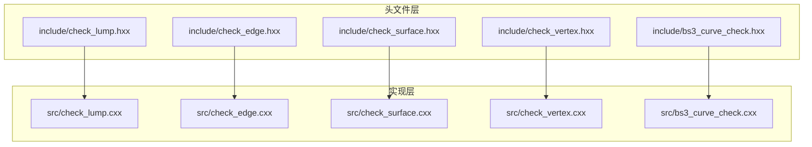
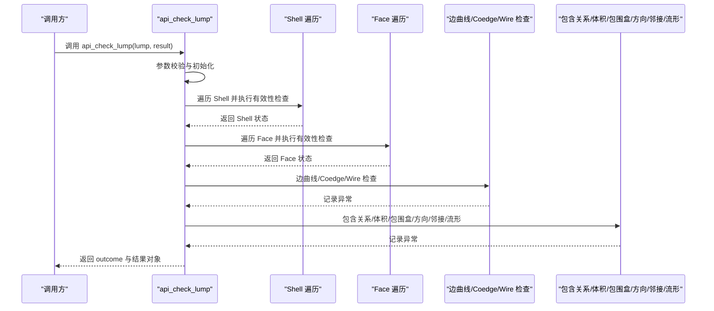
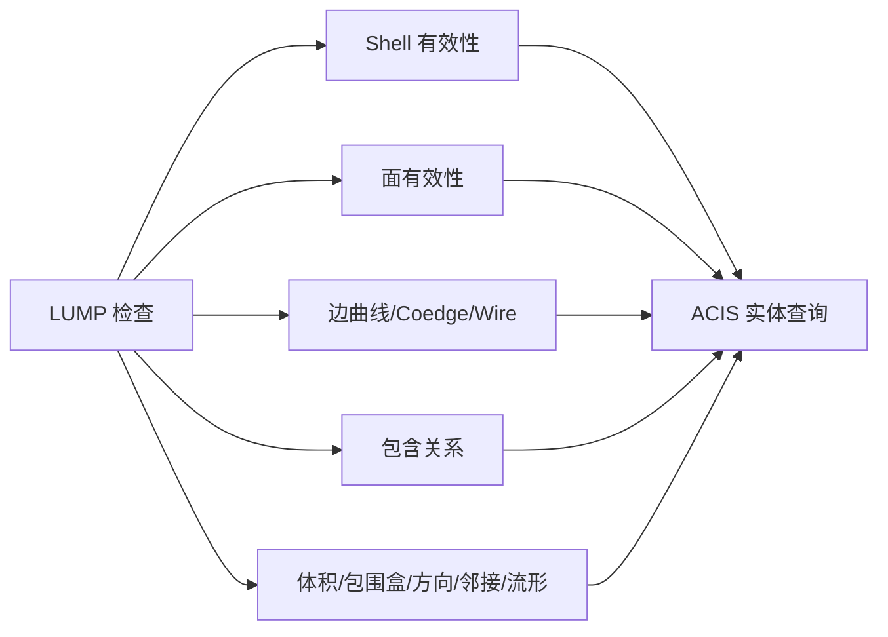

# LUMP 检查模块

<cite>
**本文引用的文件**
- [check_lump.hxx](file://include/check_lump.hxx)
- [check_lump.cxx](file://src/check_lump.cxx)
- [check_edge.hxx](file://include/check_edge.hxx)
- [check_edge.cxx](file://src/check_edge.cxx)
- [check_surface.hxx](file://include/check_surface.hxx)
- [check_surface.cxx](file://src/check_surface.cxx)
- [check_vertex.hxx](file://include/check_vertex.hxx)
- [check_vertex.cxx](file://src/check_vertex.cxx)
- [bs3_curve_check.hxx](file://include/bs3_curve_check.hxx)
- [bs3_curve_check.cxx](file://src/bs3_curve_check.cxx)
</cite>

## 目录
1. [简介](#简介)
2. [项目结构](#项目结构)
3. [核心组件](#核心组件)
4. [架构总览](#架构总览)
5. [详细组件分析](#详细组件分析)
6. [依赖关系分析](#依赖关系分析)
7. [性能考量](#性能考量)
8. [故障排查指南](#故障排查指南)
9. [结论](#结论)
10. [附录](#附录)

## 简介
本文件面向 LUMP（体）几何实体的拓扑与几何一致性检查模块，系统化梳理了 LUMP 检查的 13 项子检查函数，覆盖 Shell 有效性、面有效性、包含关系、边曲线有效性、Coedge 方向、Wire 自交、体积、包围盒、Shell 方向、面邻接、边流形等关键维度。文档从实现原理、数据结构、处理流程、ACIS API 使用模式、错误诊断到状态枚举与实际应用案例进行完整阐述，帮助读者快速理解并高效使用该模块。

## 项目结构
模块采用“按实体类型分层”的组织方式：
- 头文件位于 include 目录，定义状态枚举、结果类与对外接口
- 实现位于 src 目录，按实体类型拆分：LUMP、EDGE、SURFACE、VERTEX、BS3_CURVE
- 各实体检查均提供两类入口：
  - 面向用户的高层 API（如 api_check_lump、api_check_edge 等）
  - 面向内部的子检查函数（如 check_lump_shells_valid、check_edge_curve 等）

图表来源
- [check_lump.hxx](file://include/check_lump.hxx)
- [check_lump.cxx](file://src/check_lump.cxx)
- [check_edge.hxx](file://include/check_edge.hxx)
- [check_edge.cxx](file://src/check_edge.cxx)
- [check_surface.hxx](file://include/check_surface.hxx)
- [check_surface.cxx](file://src/check_surface.cxx)
- [check_vertex.hxx](file://include/check_vertex.hxx)
- [check_vertex.cxx](file://src/check_vertex.cxx)
- [bs3_curve_check.hxx](file://include/bs3_curve_check.hxx)
- [bs3_curve_check.cxx](file://src/bs3_curve_check.cxx)

章节来源
- [check_lump.hxx](file://include/check_lump.hxx)
- [check_lump.cxx](file://src/check_lump.cxx)

## 核心组件
- LUMP 检查结果类：封装检查状态、统计信息与异常列表
- LUMP 检查状态枚举：以位掩码形式表达多种错误/警告类别
- 子检查函数族：针对 Shell、面、边、Coedge、Wire、体积、包围盒、方向、邻接、流形等维度逐一校验
- 对外 API：统一入口，遍历实体层次并汇总结果

章节来源
- [check_lump.hxx](file://include/check_lump.hxx)
- [check_lump.cxx](file://src/check_lump.cxx)

## 架构总览
LUMP 检查的整体流程如下：
- 输入 LUMP 指针，进行空指针与类型校验
- 遍历所有 Shell，执行 Shell 有效性检查
- 遍历每个 Shell 的 Face，执行面有效性检查
- 针对每个 Face，检查边曲线、Coedge 方向、Wire 自交
- 执行包含关系检查（多 Shell 的内外包含一致性）
- 执行体积、包围盒、Shell 方向、面邻接、边流形等专项检查
- 统计异常数量并生成状态位图

图表来源
- [check_lump.cxx](file://src/check_lump.cxx)

章节来源
- [check_lump.cxx](file://src/check_lump.cxx)

## 详细组件分析

### LUMP 检查状态枚举与结果类
- 状态枚举：以位掩码形式表达 13 类错误/警告，便于组合与判定
- 结果类：保存状态位、Shell/Face/Edge 数量统计、异常列表
- API：提供带选项参数的高层检查入口与仅返回状态的便捷入口

章节来源
- [check_lump.hxx](file://include/check_lump.hxx)
- [check_lump.cxx](file://src/check_lump.cxx)

### 子检查函数详解

#### 1) Shell 有效性检查
- 检查 LUMP 是否包含 Shell；若无 Shell，记录错误
- 遍历 Shell，若某 Shell 既无 Face 又无 Wire，记录警告
- 返回布尔值表示整体有效性

章节来源
- [check_lump.cxx](file://src/check_lump.cxx)

#### 2) 面有效性检查
- 遍历 Shell 中的 Face，检查面是否关联有效表面
- 遍历 Face 的 Loop，检查 Loop 是否存在 Coedge
- 返回布尔值表示整体有效性

章节来源
- [check_lump.cxx](file://src/check_lump.cxx)

#### 3) 包含关系检查
- 统计 Shell 数量，若小于 2 直接返回
- 对每对外壳，采样点判断其在对方外壳中的包含关系
- 若内外包含关系不一致，记录错误

章节来源
- [check_lump.cxx](file://src/check_lump.cxx)

#### 4) 边曲线有效性检查
- 遍历 Face 的 Loop，遍历 Coedge
- 检查 Edge 是否存在、Curve 是否存在、顶点是否为空、顶点坐标是否有效
- 返回布尔值表示整体有效性

章节来源
- [check_lump.cxx](file://src/check_lump.cxx)

#### 5) Coedge 方向检查
- 遍历 Face 的 Loop 与 Coedge
- 比较 Coedge 与其 Partner 的 Sense，若相同则记录警告
- 返回布尔值表示整体有效性

章节来源
- [check_lump.cxx](file://src/check_lump.cxx)

#### 6) Wire 自交检查
- 遍历 Wire 的 Coedge，两两比较不同 Edge 的参数范围
- 计算交点，排除端点相交的情况，其余记录错误
- 返回布尔值表示整体有效性

章节来源
- [check_lump.cxx](file://src/check_lump.cxx)

#### 7) 体积检查
- 检查 LUMP 是否拥有 Body；若无记录警告
- 统计 Shell 数量，若为 0 记录错误
- 返回布尔值表示整体有效性

章节来源
- [check_lump.cxx](file://src/check_lump.cxx)

#### 8) 包围盒检查
- 遍历 LUMP 下所有顶点，检查其坐标是否为 NaN
- 若发现 NaN 坐标，记录错误
- 返回布尔值表示整体有效性

章节来源
- [check_lump.cxx](file://src/check_lump.cxx)

#### 9) Shell 方向检查
- 遍历 Shell 的 Loop 与 Coedge，统计正向与反向 Coedge 数量
- 当前实现未直接设置错误状态，保留扩展空间

章节来源
- [check_lump.cxx](file://src/check_lump.cxx)

#### 10) 面邻接检查
- 遍历 Face 的 Loop 与 Coedge
- 若某 Coedge 缺少 Partner，记录警告
- 返回布尔值表示整体有效性

章节来源
- [check_lump.cxx](file://src/check_lump.cxx)

#### 11) 边流形检查
- 遍历 Face 的 Loop 与 Coedge，统计某 Edge 上 Coedge 的总数
- 若总数为奇数或非偶数倍（具体规则见实现），记录警告
- 返回布尔值表示整体有效性

章节来源
- [check_lump.cxx](file://src/check_lump.cxx)

#### 12) 高层 API：api_check_lump
- 入口函数，负责组织上述子检查的执行顺序与结果汇总
- 返回 outcome 与结果对象，支持可选的 ACIS 选项参数

章节来源
- [check_lump.cxx](file://src/check_lump.cxx)

#### 13) 状态聚合：api_check_lump_status
- 逐项执行各子检查，统计异常数量
- 将异常描述映射到对应的状态位，返回整型状态位图

章节来源
- [check_lump.cxx](file://src/check_lump.cxx)

### 辅助实体检查（用于理解上下文）
为便于理解 LUMP 检查的上下文，以下实体检查也提供简要说明（非 LUMP 专属，但常与 LUMP 检查协同工作）：

- 边（EDGE）检查：包括空边、曲线、顶点、退化、参数范围、闭合性、Coedge 方向、评估、拟合公差、长度、G1 连续性、包围盒、参数归一化等
- 面（FACE/SURFACE）检查：包括空面、评估、参数范围、连续性、奇点、闭合、拟合公差、BSpline 特性、自交、法向一致性、G2 连续性、UV 坐标、面积退化、周期性等
- 顶点（VERTEX）检查：包括点有效性、边有效性、边曲线、重合、边方向、流形、包围盒、法向一致性、公差、尖角等
- 曲线（BS3_CURVE）检查：包括空曲线、阶次、控制点、节点向量、评估、参数范围、闭合、拟合公差、退化、导数、节点重数、凸包、变差递减性质、包围盒、弧长等

章节来源
- [check_edge.hxx](file://include/check_edge.hxx)
- [check_edge.cxx](file://src/check_edge.cxx)
- [check_surface.hxx](file://include/check_surface.hxx)
- [check_surface.cxx](file://src/check_surface.cxx)
- [check_vertex.hxx](file://include/check_vertex.hxx)
- [check_vertex.cxx](file://src/check_vertex.cxx)
- [bs3_curve_check.hxx](file://include/bs3_curve_check.hxx)
- [bs3_curve_check.cxx](file://src/bs3_curve_check.cxx)

## 依赖关系分析
- LUMP 检查依赖 ACIS 几何内核的实体类型与查询接口（如 Shell、Face、Edge、Coedge、Wire、Point、Curve、Surface 等）
- 异常记录通过统一的异常列表（insanity_list）管理，便于后续诊断与输出
- 检查函数之间存在层次依赖：LUMP 检查调用 EDGE/SURFACE/VERTEX/BS3_CURVE 的子检查作为辅助

图表来源
- [check_lump.cxx](file://src/check_lump.cxx)

章节来源
- [check_lump.cxx](file://src/check_lump.cxx)

## 性能考量
- 遍历复杂度：LUMP 检查涉及多层嵌套遍历（Shell→Face→Loop→Coedge→Edge→Wire），时间复杂度与实体规模呈线性或更高阶增长
- 交点计算：Wire 自交检查中对 Edge 对进行交点求解，建议在大规模模型中限制采样密度或采用加速结构
- 异常聚合：字符串匹配用于状态映射，建议在高频场景下缓存映射表以降低开销
- 内存管理：异常列表动态分配，注意及时释放避免泄漏

## 故障排查指南
- 常见错误定位
  - “无 Shell”：确认 LUMP 是否正确构造
  - “空面/空 Coedge”：检查面与 Loop 的拓扑完整性
  - “边曲线为空/顶点为空/坐标为 NaN”：检查 Curve/Vertex/Point 的几何数据
  - “Coedge 与 Partner 方向相同”：修正拓扑方向一致性
  - “Wire 自交”：检查边的参数范围与几何形状
  - “包含关系不一致”：检查多 Shell 的内外包含逻辑
  - “非流形边”：确保每条边的 Coedge 数量满足流形条件
- 诊断建议
  - 使用 api_check_lump_status 获取状态位图，结合异常列表定位问题
  - 对于复杂模型，优先缩小检查范围（仅检查特定 Shell 或 Face）
  - 关注警告与错误的优先级，优先修复错误类问题

章节来源
- [check_lump.cxx](file://src/check_lump.cxx)

## 结论
LUMP 检查模块通过 13 项子检查函数实现了对体几何的全面拓扑与几何一致性验证，覆盖 Shell、面、边、Coedge、Wire、包含关系、体积、包围盒、方向、邻接与流形等关键维度。模块采用清晰的层次化设计与统一的异常记录机制，便于集成与扩展。建议在工程实践中结合状态位图与异常列表进行问题定位，并根据模型规模优化检查策略以提升性能。

## 附录

### LUMP 检查状态枚举对照表
- LUMP_CHECK_OK：无错误
- LUMP_CHECK_NO_SHELL：LUMP 无 Shell
- LUMP_CHECK_EMPTY_SHELL：Shell 既无 Face 又无 Wire
- LUMP_CHECK_SHELL_SELF_INT：Shell 自交（由 Wire 自交检查触发）
- LUMP_CHECK_BAD_CONTAINMENT：包含关系不一致
- LUMP_CHECK_INTERSECT_SHELLS：Shell 间相交（当前实现未直接设置此位）
- LUMP_CHECK_DEGENERATE_FACE：退化面（当前实现未直接设置此位）
- LUMP_CHECK_BAD_COEDGE_SENSE：Coedge 与其 Partner 方向相同
- LUMP_CHECK_NULL_EDGE_CURVE：边曲线为空
- LUMP_CHECK_NON_MANIFOLD_VTX：顶点非流形（当前实现未直接设置此位）
- LUMP_CHECK_BAD_VOLUME：体积相关问题
- LUMP_CHECK_BAD_BOUNDING_BOX：包围盒坐标异常
- LUMP_CHECK_SHELL_ORIENT_MISMATCH：Shell 方向不一致
- LUMP_CHECK_BAD_FACE_ADJACENCY：面邻接缺失（自由边）
- LUMP_CHECK_NON_MANIFOLD_EDGE：边非流形（Coedge 数量不符合流形规则）

章节来源
- [check_lump.hxx](file://include/check_lump.hxx)

### 实际应用案例
- 模型导入后批量检查：调用 api_check_lump_status，根据状态位图决定是否允许进入后续建模流程
- 修复后回归验证：对修复后的 LUMP 再次运行 api_check_lump，确认异常已消除
- 大规模装配体检查：按部件拆分执行 LUMP 检查，汇总全局状态位图与异常列表