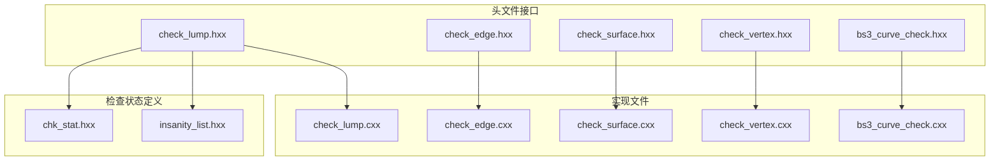
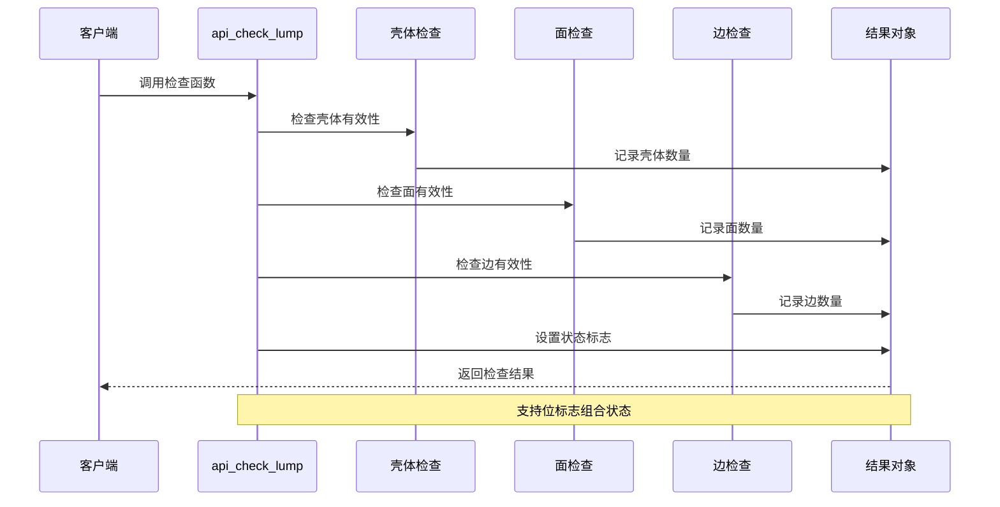
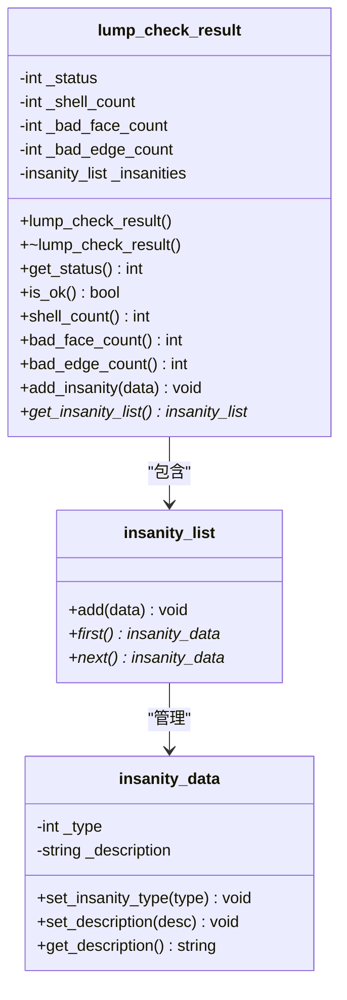
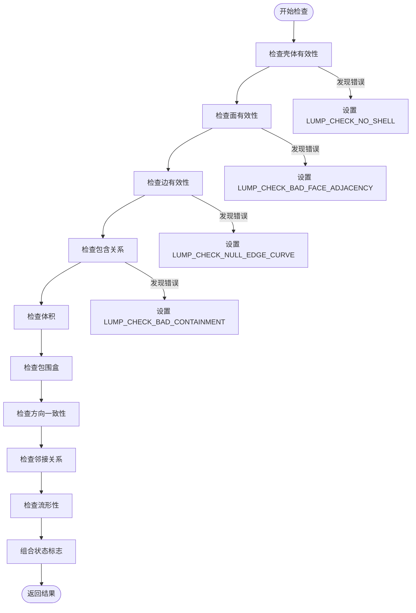
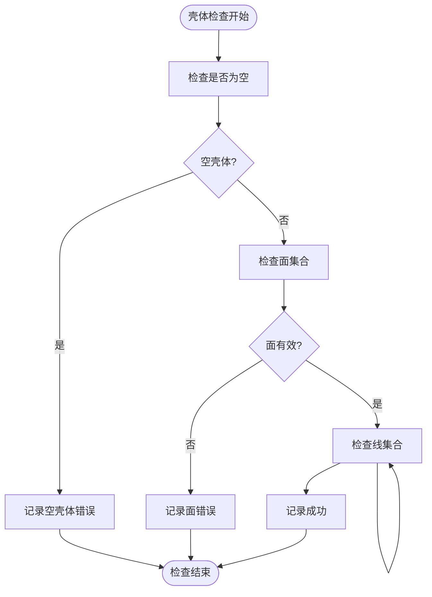
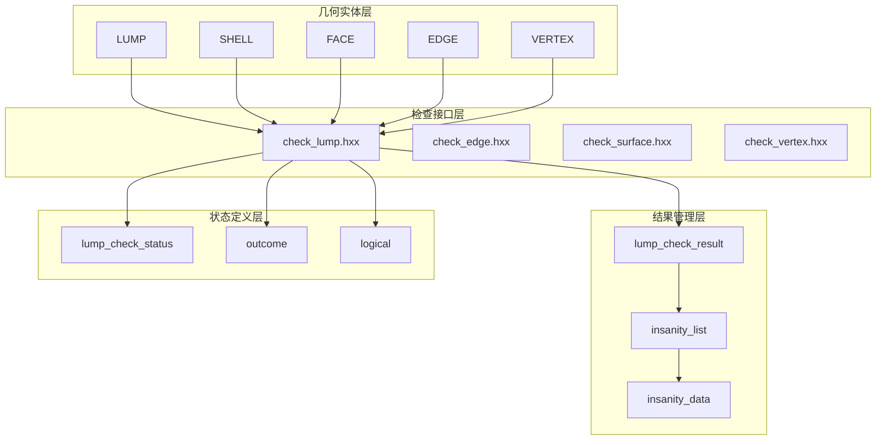

# LUMP 检查结果处理

<cite>
**本文档引用的文件**
- [check_lump.hxx](file://include/check_lump.hxx)
- [check_lump.cxx](file://src/check_lump.cxx)
- [TASK_SUMMARY.md](file://TASK_SUMMARY.md)
</cite>

## 目录
1. [简介](#简介)
2. [项目结构](#项目结构)
3. [核心组件](#核心组件)
4. [架构概览](#架构概览)
5. [详细组件分析](#详细组件分析)
6. [依赖关系分析](#依赖关系分析)
7. [性能考虑](#性能考虑)
8. [故障排除指南](#故障排除指南)
9. [结论](#结论)
10. [附录](#附录)

## 简介

LUMP 检查结果处理机制是 ACIS 几何模型检查系统中的重要组成部分，专门用于验证和诊断几何体的完整性。该机制通过 `lump_check_result` 类提供统一的结果收集和状态管理接口，支持多种检查类型的综合评估。

本机制采用位标志枚举设计，能够同时报告多个检查状态，为用户提供全面的几何质量分析。检查范围涵盖壳体有效性、面邻接关系、边流形性、包围盒完整性等多个维度。

## 项目结构

LUMP 检查模块位于 Interface 项目的 include 和 src 目录中，采用标准的头文件声明与实现分离的组织方式：



**图表来源**
- [check_lump.hxx:1-117](file://include/check_lump.hxx#L1-L117)
- [check_lump.cxx:1-766](file://src/check_lump.cxx#L1-L766)

**章节来源**
- [check_lump.hxx:1-117](file://include/check_lump.hxx#L1-L117)
- [check_lump.cxx:1-766](file://src/check_lump.cxx#L1-L766)

## 核心组件

### 检查状态枚举

LUMP 检查状态采用位标志设计，每个枚举值代表特定的几何问题类型：

| 枚举值 | 值 | 含义 |
|--------|-----|------|
| `LUMP_CHECK_OK` | 0 | 无错误 |
| `LUMP_CHECK_NO_SHELL` | 1<<0 | 无壳体 |
| `LUMP_CHECK_EMPTY_SHELL` | 1<<1 | 空壳体 |
| `LUMP_CHECK_SHELL_SELF_INT` | 1<<2 | 壳体自相交 |
| `LUMP_CHECK_BAD_CONTAINMENT` | 1<<3 | 包含关系错误 |
| `LUMP_CHECK_INTERSECT_SHELLS` | 1<<4 | 壳体相互交叉 |
| `LUMP_CHECK_DEGENERATE_FACE` | 1<<5 | 退化面 |
| `LUMP_CHECK_BAD_COEDGE_SENSE` | 1<<6 | Coedge 方向错误 |
| `LUMP_CHECK_NULL_EDGE_CURVE` | 1<<7 | 边曲线为空 |
| `LUMP_CHECK_NON_MANIFOLD_VTX` | 1<<8 | 非流形顶点 |
| `LUMP_CHECK_BAD_VOLUME` | 1<<9 | 体积异常 |
| `LUMP_CHECK_BAD_BOUNDING_BOX` | 1<<10 | 包围盒异常 |
| `LUMP_CHECK_SHELL_ORIENT_MISMATCH` | 1<<11 | 壳体方向不一致 |
| `LUMP_CHECK_BAD_FACE_ADJACENCY` | 1<<12 | 面邻接异常 |
| `LUMP_CHECK_NON_MANIFOLD_EDGE` | 1<<13 | 非流形边 |

### 主要检查函数

系统提供了两种主要的检查接口：

1. **详细诊断接口**：`api_check_lump()` - 提供完整的检查结果和错误详情
2. **快速检测接口**：`api_check_lump_status()` - 提供简化的状态码

**章节来源**
- [check_lump.hxx:9-25](file://include/check_lump.hxx#L9-L25)
- [check_lump.hxx:50-114](file://include/check_lump.hxx#L50-L114)

## 架构概览

LUMP 检查结果处理机制采用分层架构设计，从底层几何实体到高层检查结果的完整处理流程：



**图表来源**
- [check_lump.cxx:58-106](file://src/check_lump.cxx#L58-L106)
- [check_lump.hxx:27-48](file://include/check_lump.hxx#L27-L48)

## 详细组件分析

### lump_check_result 类设计

`lump_check_result` 是检查结果的核心类，负责存储和管理检查过程中的所有相关信息：



**图表来源**
- [check_lump.hxx:27-48](file://include/check_lump.hxx#L27-L48)
- [check_lump.cxx:18-56](file://src/check_lump.cxx#L18-L56)

#### 状态查询函数

类提供了完整的状态查询接口：

1. **状态获取**：`get_status()` 返回当前检查状态的位标志组合
2. **成功判断**：`is_ok()` 判断是否没有任何错误
3. **计数器访问**：
   - `shell_count()` 获取壳体总数
   - `bad_face_count()` 获取有问题的面数量
   - `bad_edge_count()` 获取有问题的边数量

#### 错误列表管理

通过 `insanity_list` 和 `insanity_data` 实现了完整的错误记录机制：

- `add_insanity()` 添加具体的错误条目
- `get_insanity_list()` 获取错误列表指针
- 支持不同类型错误的分类（错误、警告等）

**章节来源**
- [check_lump.hxx:27-48](file://include/check_lump.hxx#L27-L48)
- [check_lump.cxx:18-56](file://src/check_lump.cxx#L18-L56)

### 检查状态枚举详解

检查状态枚举采用位移操作符设计，支持状态的组合使用：



**图表来源**
- [check_lump.cxx:667-765](file://src/check_lump.cxx#L667-L765)
- [check_lump.hxx:9-25](file://include/check_lump.hxx#L9-L25)

#### 组合使用方式

检查状态可以同时表示多个问题的存在：

- **位运算组合**：使用按位或操作符 (`|`) 组合多个状态
- **状态检查**：使用按位与操作符 (`&`) 检查特定状态是否存在
- **状态重置**：使用按位异或操作符 (`^`) 清除特定状态

**章节来源**
- [check_lump.hxx:9-25](file://include/check_lump.hxx#L9-L25)
- [check_lump.cxx:83-84](file://src/check_lump.cxx#L83-L84)

### 检查算法实现

系统实现了多种几何检查算法，每种算法都有其特定的检查重点：

#### 壳体有效性检查

检查几何体的基本结构完整性：



**图表来源**
- [check_lump.cxx:108-136](file://src/check_lump.cxx#L108-L136)

#### 面邻接检查

验证面之间的拓扑关系正确性：

- 检查每个面的环结构完整性
- 验证 Coedge 的配对关系
- 确保边流形性的要求得到满足

#### 边流形性检查

确保几何体的边满足流形性条件：

- 计算每个边关联的 Coedge 数量
- 验证边的流形性约束（偶数个 Coedge）
- 标记非流形边的问题

**章节来源**
- [check_lump.cxx:138-171](file://src/check_lump.cxx#L138-L171)
- [check_lump.cxx:612-665](file://src/check_lump.cxx#L612-L665)

## 依赖关系分析

LUMP 检查结果处理机制涉及多个层次的依赖关系：



**图表来源**
- [check_lump.hxx:1-7](file://include/check_lump.hxx#L1-L7)
- [check_lump.cxx:1-16](file://src/check_lump.cxx#L1-L16)

### 外部依赖

系统依赖于以下外部组件：

1. **ACIS 几何内核**：提供几何实体的访问和操作能力
2. **检查状态定义**：`chk_stat.hxx` 定义了检查状态的标准格式
3. **错误列表管理**：`insanity_list.hxx` 提供错误条目的集中管理
4. **结果输出**：`cstrapi.hxx` 和 `acis.hxx` 提供基本的数据类型和常量

**章节来源**
- [check_lump.hxx:3-7](file://include/check_lump.hxx#L3-L7)

## 性能考虑

LUMP 检查结果处理机制在设计时充分考虑了性能优化：

### 时间复杂度分析

- **壳体检查**：O(S) - S 为壳体数量
- **面检查**：O(F) - F 为面数量  
- **边检查**：O(E) - E 为边数量
- **整体复杂度**：O(S + F + E)

### 内存管理

- 使用智能指针和 RAII 模式管理内存分配
- 错误数据采用动态分配，避免内存泄漏
- 结果对象提供析构函数确保资源清理

### 优化策略

1. **早期退出**：当发现严重错误时立即停止进一步检查
2. **增量更新**：只在必要时更新计数器和状态标志
3. **缓存机制**：复用计算结果避免重复计算

## 故障排除指南

### 常见问题诊断

#### 检查结果为空

**症状**：`lump_check_result` 对象显示无错误但几何体明显有问题

**可能原因**：
- 输入参数为空或类型不正确
- 几何体结构过于简单，无需详细检查
- 检查选项配置不当

**解决方案**：
- 验证输入几何体的有效性
- 检查检查选项参数
- 使用 `api_check_lump_status()` 进行快速验证

#### 状态标志冲突

**症状**：同一检查结果中出现相互矛盾的状态标志

**可能原因**：
- 检查顺序导致的状态覆盖
- 多个检查函数对同一问题的不同描述

**解决方案**：
- 按照推荐的检查顺序执行
- 使用位运算正确解析组合状态
- 优先处理严重错误再处理警告

#### 内存泄漏问题

**症状**：长时间运行后内存使用持续增长

**可能原因**：
- `insanity_data` 对象未正确释放
- `insanity_list` 中的错误条目管理不当

**解决方案**：
- 确保使用 `delete` 或相应的释放函数
- 检查 `lump_check_result` 的生命周期管理
- 使用智能指针替代原始指针

**章节来源**
- [check_lump.cxx:48-56](file://src/check_lump.cxx#L48-L56)
- [check_lump.hxx:27-48](file://include/check_lump.hxx#L27-L48)

## 结论

LUMP 检查结果处理机制通过精心设计的类结构和状态管理，为 ACIS 几何模型提供了全面而高效的检查能力。其位标志枚举设计支持多状态组合，错误列表管理提供了详细的诊断信息，使得用户能够准确识别和解决几何问题。

该机制的主要优势包括：
- **模块化设计**：清晰的接口分离便于维护和扩展
- **状态组合**：支持复杂的检查结果表达
- **错误追踪**：完整的错误列表便于问题定位
- **性能优化**：合理的算法设计确保高效执行

对于实际应用，建议遵循最佳实践：
- 优先使用 `api_check_lump()` 进行详细检查
- 正确解析组合状态标志
- 建立完善的错误报告机制
- 定期进行性能监控和优化

## 附录

### 使用示例

#### 基本检查流程

```cpp
// 创建检查结果对象
lump_check_result result;

// 执行详细检查
outcome res = api_check_lump(lump_ptr, result);

// 检查结果状态
if (result.is_ok()) {
    // 几何体完全有效
} else {
    // 分析具体错误类型
    int status = result.get_status();
    if (status & LUMP_CHECK_NO_SHELL) {
        // 处理无壳体问题
    }
}
```

#### 批量检查结果汇总

```cpp
// 收集多个几何体的检查结果
std::vector<lump_check_result> results;
for (auto& geometry : geometries) {
    lump_check_result result;
    api_check_lump(geometry, result);
    results.push_back(result);
}

// 汇总统计信息
int total_errors = 0;
int shell_count = 0;
for (const auto& result : results) {
    total_errors += result.bad_face_count() + result.bad_edge_count();
    shell_count += result.shell_count();
}
```

### 最佳实践建议

1. **错误分级处理**：根据错误严重程度采取不同的处理策略
2. **状态标志解析**：使用位运算正确解析组合状态
3. **资源管理**：确保所有动态分配的内存得到正确释放
4. **性能监控**：定期检查检查过程的性能表现
5. **日志记录**：建立完整的检查日志便于问题追踪