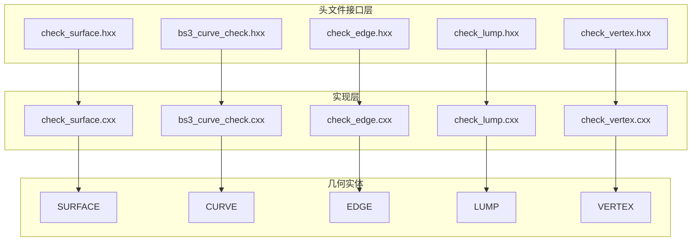
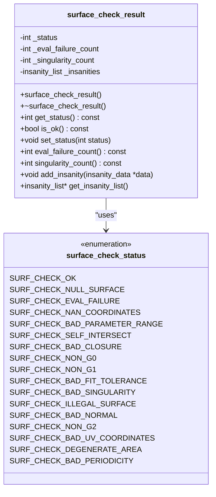
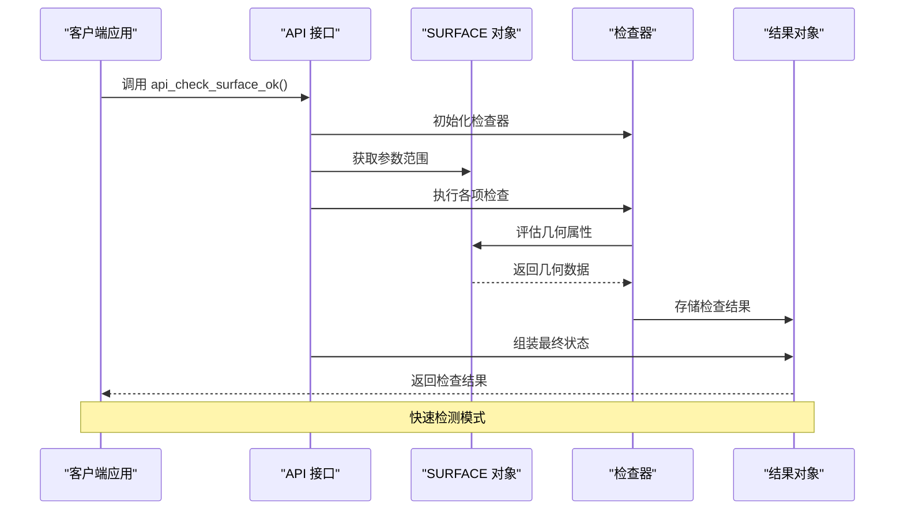
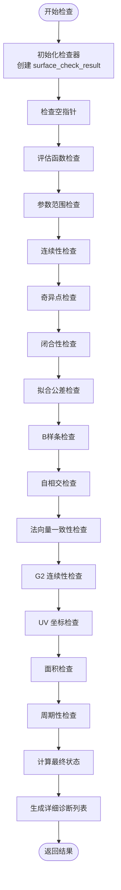
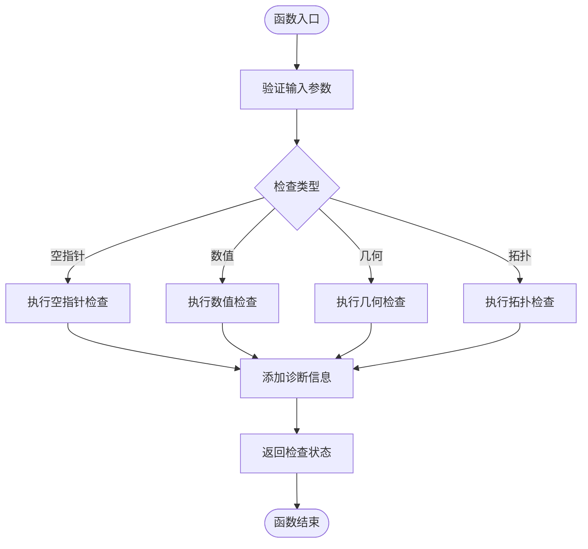
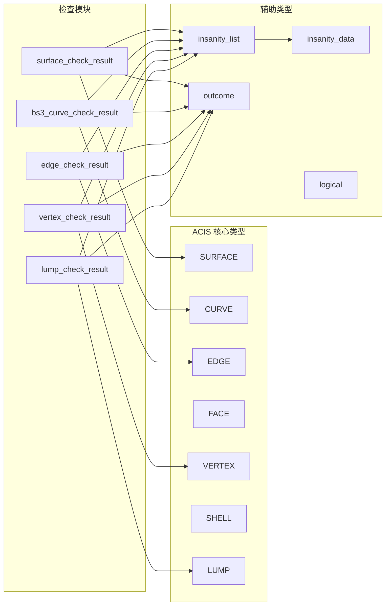

# SURFACE 检查使用示例

<cite>
**本文档引用的文件**
- [check_surface.hxx](file://include/check_surface.hxx)
- [check_surface.cxx](file://src/check_surface.cxx)
- [bs3_curve_check.hxx](file://include/bs3_curve_check.hxx)
- [bs3_curve_check.cxx](file://src/bs3_curve_check.cxx)
- [check_edge.hxx](file://include/check_edge.hxx)
- [check_edge.cxx](file://src/check_edge.cxx)
- [check_lump.hxx](file://include/check_lump.hxx)
- [check_lump.cxx](file://src/check_lump.cxx)
- [check_vertex.hxx](file://include/check_vertex.hxx)
- [check_vertex.cxx](file://src/check_vertex.cxx)
</cite>

## 目录
1. [简介](#简介)
2. [项目结构](#项目结构)
3. [核心组件](#核心组件)
4. [架构概览](#架构概览)
5. [详细组件分析](#详细组件分析)
6. [依赖关系分析](#依赖关系分析)
7. [性能考虑](#性能考虑)
8. [故障排除指南](#故障排除指南)
9. [结论](#结论)

## 简介

SURFACE 检查模块是 ACIS 几何建模库中的重要组成部分，提供了全面的表面几何质量检查功能。该模块能够检测各种几何问题，包括参数范围异常、连续性问题、奇异点、自相交、法向量一致性等。通过使用 `surface_check_result` 类和相关的检查函数，开发者可以轻松集成几何验证到他们的应用程序中。

本指南将详细介绍 SURFACE 检查模块的使用方法，包括快速检测和详细诊断两种模式，并提供实际的使用示例和最佳实践建议。

## 项目结构

SURFACE 检查模块采用清晰的分层架构设计，主要包含以下组件：

**图表来源**
- [check_surface.hxx:1-133](file://include/check_surface.hxx#L1-L133)
- [check_surface.cxx:1-1075](file://src/check_surface.cxx#L1-L1075)

**章节来源**
- [check_surface.hxx:1-133](file://include/check_surface.hxx#L1-L133)
- [check_surface.cxx:1-1075](file://src/check_surface.cxx#L1-L1075)

## 核心组件

### surface_check_result 类

`surface_check_result` 是 SURFACE 检查的核心结果类，负责存储检查状态和诊断信息：

**图表来源**
- [check_surface.hxx:29-49](file://include/check_surface.hxx#L29-L49)

### 主要检查函数

模块提供了多种检查函数，涵盖不同的几何特性：

| 检查类型 | 函数名称 | 功能描述 |
|---------|----------|----------|
| 基础检查 | `check_surface_null` | 检查表面指针有效性 |
| 评估检查 | `check_surface_evaluation` | 验证表面评估函数 |
| 参数范围 | `check_surface_parameter_range` | 检查参数范围有效性 |
| 连续性检查 | `check_surface_continuity` | 验证 G0 连续性 |
| 奇异点检测 | `check_surface_singularity` | 识别奇异点 |
| 封闭性检查 | `check_surface_closure` | 验证边界闭合性 |
| 拟合公差 | `check_surface_fit_tolerance` | 检查拟合容差 |
| B样条检查 | `check_bspline_surface` | 验证 B样条表面 |
| 自相交检测 | `check_surface_self_intersection` | 识别自相交 |
| 法向量一致性 | `check_surface_normal_consistency` | 验证法向量一致性 |
| G2 连续性 | `check_surface_g2_continuity` | 检查 G2 连续性 |
| UV 坐标 | `check_surface_uv_coordinates` | 验证 UV 坐标 |
| 面积退化 | `check_surface_area_degenerate` | 检测面积退化 |
| 周期性 | `check_surface_periodicity` | 验证周期性 |

**章节来源**
- [check_surface.hxx:49-131](file://include/check_surface.hxx#L49-L131)
- [check_surface.cxx:146-1075](file://src/check_surface.cxx#L146-L1075)

## 架构概览

SURFACE 检查模块采用模块化设计，支持两种主要的使用模式：

**图表来源**
- [check_surface.cxx:49-144](file://src/check_surface.cxx#L49-L144)

### 详细诊断模式

对于需要深入分析的场景，可以使用详细的诊断模式：

**图表来源**
- [check_surface.cxx:49-144](file://src/check_surface.cxx#L49-L144)

## 详细组件分析

### surface_check_result 类详解

`surface_check_result` 类提供了完整的检查结果管理功能：

#### 状态管理
- `get_status()`: 获取当前检查状态
- `is_ok()`: 判断是否通过所有检查
- `set_status(int)`: 设置检查状态

#### 统计信息
- `eval_failure_count()`: 评估失败次数
- `singularity_count()`: 奇异点数量

#### 诊断信息管理
- `add_insanity(insanity_data*)`: 添加诊断信息
- `get_insanity_list()`: 获取诊断列表

### 检查函数实现模式

所有检查函数都遵循统一的实现模式：

**图表来源**
- [check_surface.cxx:146-220](file://src/check_surface.cxx#L146-L220)

### 错误处理机制

模块实现了多层次的错误处理机制：

1. **输入验证**: 检查空指针和无效参数
2. **异常捕获**: 使用 try-catch 处理评估异常
3. **状态标记**: 通过位掩码标记不同类型的错误
4. **诊断记录**: 详细记录每个发现的问题

**章节来源**
- [check_surface.hxx:29-49](file://include/check_surface.hxx#L29-L49)
- [check_surface.cxx:10-144](file://src/check_surface.cxx#L10-L144)

## 依赖关系分析

SURFACE 检查模块与 ACIS 几何库有紧密的依赖关系：

**图表来源**
- [check_surface.hxx:4-8](file://include/check_surface.hxx#L4-L8)
- [check_surface.cxx:1-9](file://src/check_surface.cxx#L1-L9)

**章节来源**
- [check_surface.hxx:4-8](file://include/check_surface.hxx#L4-L8)
- [check_surface.cxx:1-9](file://src/check_surface.cxx#L1-L9)

## 性能考虑

### 检查复杂度分析

| 检查类型 | 时间复杂度 | 空间复杂度 | 说明 |
|---------|-----------|-----------|------|
| 基础检查 | O(1) | O(1) | 简单的指针和属性检查 |
| 评估检查 | O(n²) | O(1) | 在参数网格上采样评估 |
| 连续性检查 | O(1) | O(1) | 边界位置比较 |
| 奇异点检测 | O(n²) | O(1) | 导数计算和角度分析 |
| 自相交检查 | O(n⁴) | O(1) | 区域内点对距离计算 |
| 法向量检查 | O(n²) | O(1) | 导数和法向量计算 |

### 优化策略

1. **采样密度控制**: 可以根据需要调整采样密度来平衡精度和性能
2. **早期退出**: 发现严重问题时立即停止进一步检查
3. **缓存机制**: 对于重复检查的几何体，可以缓存中间结果
4. **并行处理**: 对于独立的检查任务，可以考虑并行执行

## 故障排除指南

### 常见问题及解决方案

#### 表面为空指针
- **症状**: `SURF_CHECK_NULL_SURFACE` 状态
- **原因**: 传入了空的 SURFACE 指针
- **解决方案**: 在调用检查函数前验证指针有效性

#### 数值异常
- **症状**: `SURF_CHECK_NAN_COORDINATES` 或 `SURF_CHECK_EVAL_FAILURE`
- **原因**: 几何计算过程中出现 NaN 或 Inf
- **解决方案**: 检查输入几何的数值稳定性

#### 参数范围问题
- **症状**: `SURF_CHECK_BAD_PARAMETER_RANGE`
- **原因**: 参数范围为空或无效
- **解决方案**: 验证表面的参数化定义

#### 自相交检测
- **症状**: `SURF_CHECK_SELF_INTERSECT`
- **原因**: 表面在参数空间中有重叠区域
- **解决方案**: 使用几何修复工具进行修复

### 调试技巧

1. **启用详细诊断**: 使用 `get_insanity_list()` 获取详细的错误信息
2. **逐步检查**: 分别调用单项检查函数以定位具体问题
3. **可视化输出**: 将诊断信息转换为可视化的几何标记
4. **日志记录**: 记录检查过程中的关键步骤和参数

**章节来源**
- [check_surface.cxx:146-1075](file://src/check_surface.cxx#L146-L1075)

## 结论

SURFACE 检查模块为 ACIS 几何建模提供了强大而灵活的质量保证工具。通过 `surface_check_result` 类和丰富的检查函数，开发者可以：

1. **快速集成**: 提供简单易用的 API 接口
2. **全面覆盖**: 涵盖几何质量检查的主要方面
3. **灵活配置**: 支持不同粒度的检查需求
4. **详细诊断**: 提供丰富的错误信息和统计数据

该模块特别适用于 CAD 数据质量控制、几何模型预处理、几何修复前的诊断等应用场景。通过合理使用这些工具，可以显著提高几何建模的可靠性和效率。

建议在实际项目中：
- 建立标准化的检查流程
- 实施适当的错误处理和恢复机制
- 定期更新检查参数以适应新的需求
- 结合具体的业务场景定制检查策略