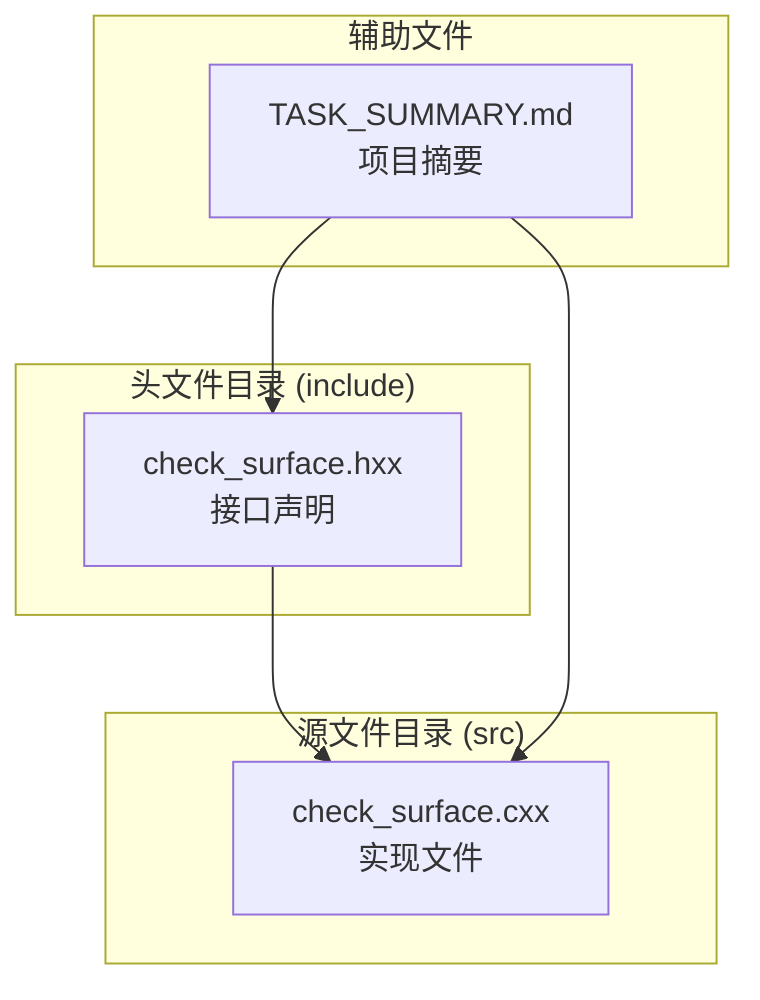
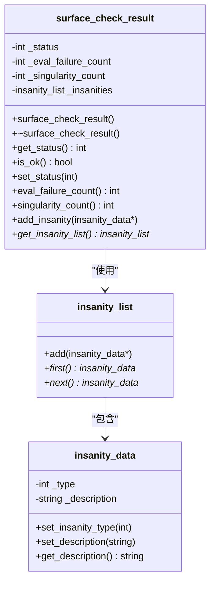
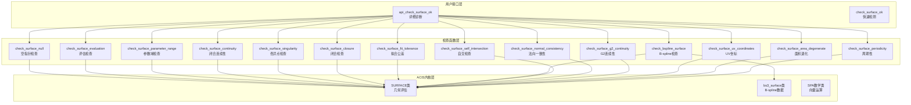
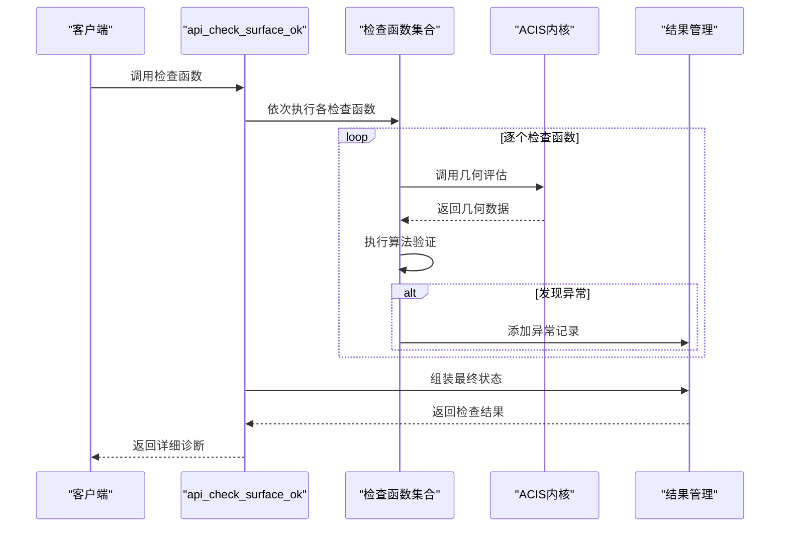
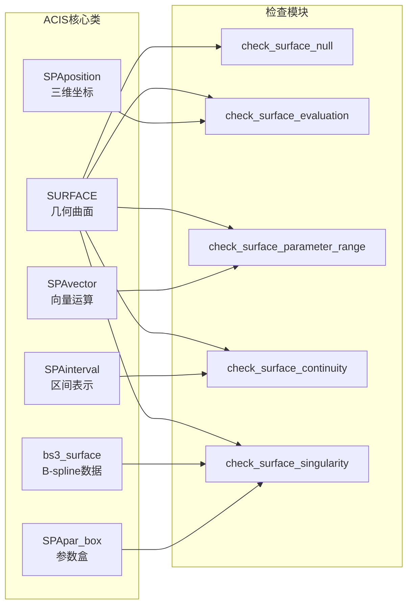

# SURFACE 检查函数详解

<cite>
**本文档引用的文件**
- [check_surface.hxx](file://include/check_surface.hxx)
- [check_surface.cxx](file://src/check_surface.cxx)
- [TASK_SUMMARY.md](file://TASK_SUMMARY.md)
</cite>

## 目录
1. [简介](#简介)
2. [项目结构](#项目结构)
3. [核心组件](#核心组件)
4. [架构概览](#架构概览)
5. [详细组件分析](#详细组件分析)
6. [依赖关系分析](#依赖关系分析)
7. [性能考虑](#性能考虑)
8. [故障排除指南](#故障排除指南)
9. [结论](#结论)

## 简介

SURFACE 检查模块是基于 ACIS 3D 几何内核开发的曲面质量验证系统，包含16个核心检查函数，用于全面评估曲面的几何正确性和数值稳定性。该模块提供了快速检测和详细诊断两种模式，支持对曲面进行从基础属性到高级连续性的全方位质量检查。

本模块采用面向对象的设计模式，通过继承和组合的方式实现统一的检查框架，能够处理各种类型的几何曲面，包括 B-spline 曲面、NURBS 曲面和其他参数化曲面。

## 项目结构

SURFACE 检查模块采用标准的头文件声明与源文件实现分离的组织方式：

**图表来源**
- [check_surface.hxx:1-133](file://include/check_surface.hxx#L1-L133)
- [check_surface.cxx:1-1075](file://src/check_surface.cxx#L1-L1075)

**章节来源**
- [check_surface.hxx:1-133](file://include/check_surface.hxx#L1-L133)
- [TASK_SUMMARY.md:162-206](file://TASK_SUMMARY.md#L162-L206)

## 核心组件

### 枚举状态定义

模块定义了完整的错误状态枚举体系，涵盖16种不同的检查失败类型：

| 枚举值 | 值 | 说明 |
|--------|-----|------|
| `SURF_CHECK_OK` | 0 | 无错误 |
| `SURF_CHECK_NULL_SURFACE` | 1<<0 | 曲面为空 |
| `SURF_CHECK_EVAL_FAILURE` | 1<<1 | 评估失败 |
| `SURF_CHECK_NAN_COORDINATES` | 1<<2 | NaN/Inf坐标 |
| `SURF_CHECK_BAD_PARAMETER_RANGE` | 1<<3 | 参数域异常 |
| `SURF_CHECK_SELF_INTERSECT` | 1<<4 | 自交 |
| `SURF_CHECK_BAD_CLOSURE` | 1<<5 | 闭合异常 |
| `SURF_CHECK_NON_G0` | 1<<6 | G0连续性问题 |
| `SURF_CHECK_NON_G1` | 1<<7 | G1连续性问题 |
| `SURF_CHECK_BAD_FIT_TOLERANCE` | 1<<8 | 拟合公差异常 |
| `SURF_CHECK_BAD_SINGULARITY` | 1<<9 | 奇异点 |
| `SURF_CHECK_ILLEGAL_SURFACE` | 1<<10 | 非法曲面 |
| `SURF_CHECK_BAD_NORMAL` | 1<<11 | 法向异常 |
| `SURF_CHECK_NON_G2` | 1<<12 | G2连续性问题 |
| `SURF_CHECK_BAD_UV_COORDINATES` | 1<<13 | UV坐标异常 |
| `SURF_CHECK_DEGENERATE_AREA` | 1<<14 | 面积退化 |
| `SURF_CHECK_BAD_PERIODICITY` | 1<<15 | 周期性异常 |

### 结果管理类

`surface_check_result` 类提供了统一的结果管理和状态跟踪机制：

**图表来源**
- [check_surface.hxx:29-49](file://include/check_surface.hxx#L29-L49)

**章节来源**
- [check_surface.hxx:9-27](file://include/check_surface.hxx#L9-L27)
- [check_surface.hxx:29-49](file://include/check_surface.hxx#L29-L49)

## 架构概览

### 整体架构设计

**图表来源**
- [check_surface.cxx:49-144](file://src/check_surface.cxx#L49-L144)
- [check_surface.hxx:51-125](file://include/check_surface.hxx#L51-L125)

### 检查流程序列图

**图表来源**
- [check_surface.cxx:49-144](file://src/check_surface.cxx#L49-L144)

**章节来源**
- [check_surface.cxx:49-144](file://src/check_surface.cxx#L49-L144)

## 详细组件分析

### 空指针检查 (check_surface_null)

**理论基础**: 确保传入的曲面指针有效，避免空指针访问导致的程序崩溃。

**实现算法**: 
- 检查输入指针是否为NULL
- 如果为空，创建错误记录并返回FALSE
- 否则返回TRUE

**ACIS内核调用**: 直接指针检查，无需内核调用

**参数要求**: 
- `surface`: SURFACE* 指针
- `ilist`: insanity_list* 指针

**返回值含义**:
- TRUE: 指针有效
- FALSE: 指针为空

**典型应用场景**: 
- 所有检查函数的前置条件验证
- 数据预处理阶段的安全检查

**章节来源**
- [check_surface.cxx:146-159](file://src/check_surface.cxx#L146-L159)

### 评估检查 (check_surface_evaluation)

**理论基础**: 验证曲面在参数空间中的数值稳定性，确保评估过程不会产生NaN或Inf值。

**实现算法**:
- 获取参数范围并生成采样网格
- 对每个采样点调用曲面评估函数
- 检查返回坐标的数值有效性
- 捕获评估异常并记录错误

**ACIS内核调用**: 
- `surface->param_range()`: 获取参数范围
- `surface->eval_position()`: 计算三维坐标

**参数要求**: 同上

**返回值含义**: 同上

**典型应用场景**: 
- 几何建模后的质量验证
- 数值计算前的数据预检

**章节来源**
- [check_surface.cxx:161-220](file://src/check_surface.cxx#L161-L220)

### 参数域检查 (check_surface_parameter_range)

**理论基础**: 验证曲面参数域的有效性，确保参数范围合理且数值稳定。

**实现算法**:
- 获取U、V参数范围
- 检查范围是否为空
- 验证边界值的数值有效性
- 检测退化的参数范围

**ACIS内核调用**: `surface->param_range()`

**参数要求**: 同上

**返回值含义**: 同上

**典型应用场景**: 
- 曲面定义的合法性检查
- 参数化曲面的质量评估

**章节来源**
- [check_surface.cxx:222-275](file://src/check_surface.cxx#L222-L275)

### 闭合连续性检查 (check_surface_continuity)

**理论基础**: 验证标记为闭合的曲面在边界处的位置连续性。

**实现算法**:
- 检查U、V方向的闭合标记
- 在边界位置计算对应点的坐标
- 比较边界点距离是否超过容差

**ACIS内核调用**: 
- `surface->closed_u()/closed_v()`: 查询闭合状态
- `surface->eval_position()`: 计算边界点

**参数要求**: 同上

**返回值含义**: 同上

**典型应用场景**: 
- 曲面拼接质量检查
- 环形或管状曲面验证

**章节来源**
- [check_surface.cxx:277-336](file://src/check_surface.cxx#L277-L336)

### 奇异点检查 (check_surface_singularity)

**理论基础**: 检测曲面参数空间中的奇异点，即局部退化的区域。

**实现算法**:
- 计算参数导数向量
- 通过叉积长度与向量模长比值判断奇异点
- 检查相邻点的距离变化

**ACIS内核调用**: `surface->eval_derivs()`

**参数要求**: 同上

**返回值含义**: 同上

**典型应用场景**: 
- 曲面局部变形检测
- 奇异几何特征识别

**章节来源**
- [check_surface.cxx:338-403](file://src/check_surface.cxx#L338-L403)

### 闭合检查 (check_surface_closure)

**理论基础**: 验证曲面闭合标记与实际几何形状的一致性。

**实现算法**:
- 检查U、V方向的闭合状态
- 在参数域中心附近选择测试点
- 比较对应边界点的几何一致性

**ACIS内核调用**: 同连续性检查

**参数要求**: 同上

**返回值含义**: 同上

**典型应用场景**: 
- 曲面拓扑正确性验证
- 闭合曲面（如球面）检查

**章节来源**
- [check_surface.cxx:405-464](file://src/check_surface.cxx#L405-L464)

### 拟合公差检查 (check_surface_fit_tolerance)

**理论基础**: 验证曲面的拟合公差设置是否合理。

**实现算法**:
- 获取曲面拟合公差
- 检查公差值的符号和大小范围
- 标记异常的公差设置

**ACIS内核调用**: `surface->fit_tolerance()`

**参数要求**: 同上

**返回值含义**: 同上

**典型应用场景**: 
- 数值精度控制
- 几何模型质量标准

**章节来源**
- [check_surface.cxx:466-493](file://src/check_surface.cxx#L466-L493)

### B-spline 检查 (check_bspline_surface)

**理论基础**: 验证B-spline曲面的数学定义完整性。

**实现算法**:
- 检查曲面类型是否为B-spline
- 验证阶数和控制点数量的关系
- 检查相邻控制点的几何关系

**ACIS内核调用**: 
- `surface->identity()`: 获取曲面类型
- `surface->base_surface()`: 获取B-spline数据

**参数要求**: 同上

**返回值含义**: 同上

**典型应用场景**: 
- B-spline建模质量检查
- NURBS曲面定义验证

**章节来源**
- [check_surface.cxx:495-576](file://src/check_surface.cxx#L495-L576)

### 自交检查 (check_surface_self_intersection)

**理论基础**: 检测曲面内部的自相交现象。

**实现算法**:
- 将参数域划分为网格单元
- 检查每个单元四个角点映射到三维空间的距离
- 通过距离阈值判断潜在自交

**ACIS内核调用**: `surface->eval_position()`

**参数要求**: 同上

**返回值含义**: 同上

**典型应用场景**: 
- 曲面几何复杂度分析
- 自由形态曲面验证

**章节来源**
- [check_surface.cxx:578-650](file://src/check_surface.cxx#L578-L650)

### 法向一致性检查 (check_surface_normal_consistency)

**理论基础**: 验证曲面法向量的连续性和稳定性。

**实现算法**:
- 计算参数导数向量的叉积得到法向量
- 检查法向量的数值有效性
- 验证法向量的方向一致性

**ACIS内核调用**: `surface->eval_derivs()`

**参数要求**: 同上

**返回值含义**: 同上

**典型应用场景**: 
- 渲染前的几何准备
- 物理仿真前的表面质量检查

**章节来源**
- [check_surface.cxx:652-719](file://src/check_surface.cxx#L652-L719)

### G2 连续性检查 (check_surface_g2_continuity)

**理论基础**: 验证曲面在边界处的二阶连续性（曲率连续）。

**实现算法**:
- 检查闭合曲面的边界连续性
- 在边界附近取对称点计算二阶导数
- 比较边界处的曲率变化

**ACIS内核调用**: `surface->eval_derivs()`

**参数要求**: 同上

**返回值含义**: 同上

**典型应用场景**: 
- 高质量曲面建模
- 汽车外表面等美学曲面

**章节来源**
- [check_surface.cxx:721-804](file://src/check_surface.cxx#L721-L804)

### UV 坐标检查 (check_surface_uv_coordinates)

**理论基础**: 验证参数空间坐标的有效性。

**实现算法**:
- 生成参数空间采样网格
- 检查每个参数点的数值有效性
- 捕获NaN和Inf值

**ACIS内核调用**: 无直接几何调用

**参数要求**: 同上

**返回值含义**: 同上

**典型应用场景**: 
- 参数化映射质量检查
- 纹理映射前的UV坐标验证

**章节来源**
- [check_surface.cxx:806-848](file://src/check_surface.cxx#L806-L848)

### 面积退化检查 (check_surface_area_degenerate)

**理论基础**: 检测曲面面积过小的退化情况。

**实现算法**:
- 在参数域内进行数值积分
- 计算法向量的模长并累加
- 与容差阈值比较判断退化

**ACIS内核调用**: 
- `surface->eval_derivs()`: 计算法向量
- 数值积分计算

**参数要求**: 同上

**返回值含义**: 同上

**典型应用场景**: 
- 薄片或细长曲面检测
- 几何建模错误识别

**章节来源**
- [check_surface.cxx:850-895](file://src/check_surface.cxx#L850-L895)

### 周期性检查 (check_surface_periodicity)

**理论基础**: 验证曲面周期性与闭合性的逻辑一致性。

**实现算法**:
- 检查周期性标记与闭合状态的矛盾
- 分别验证U、V方向的周期性一致性
- 标记不合理的周期性配置

**ACIS内核调用**: 
- `surface->periodic_u()/periodic_v()`: 查询周期性
- `surface->closed_u()/closed_v()`: 查询闭合性

**参数要求**: 同上

**返回值含义**: 同上

**典型应用场景**: 
- 环形曲面验证
- 周期性几何特征检查

**章节来源**
- [check_surface.cxx:897-948](file://src/check_surface.cxx#L897-L948)

## 依赖关系分析

### ACIS内核依赖

**图表来源**
- [check_surface.cxx:1-9](file://src/check_surface.cxx#L1-L9)

### 外部依赖关系

模块依赖于以下ACIS组件：
- **几何内核**: SURFACE、bs3_surface类
- **数学运算**: SPAposition、SPAvector、SPAinterval
- **容差系统**: SPAresabs、SPAresnor常量
- **错误报告**: insanity_list、insanity_data类

**章节来源**
- [check_surface.hxx:4-7](file://include/check_surface.hxx#L4-L7)
- [TASK_SUMMARY.md:282-293](file://TASK_SUMMARY.md#L282-L293)

## 性能考虑

### 时间复杂度分析

| 检查函数 | 时间复杂度 | 主要因素 |
|----------|------------|----------|
| 空指针检查 | O(1) | 直接指针比较 |
| 评估检查 | O(n²) | n×n采样网格 |
| 参数域检查 | O(1) | 单次查询 |
| 连续性检查 | O(1) | 固定次数评估 |
| 奇异点检查 | O(n²) | n×n采样网格 |
| 闭合检查 | O(1) | 固定次数评估 |
| 拟合公差检查 | O(1) | 单次查询 |
| B-spline检查 | O(m+n) | m、n为控制点数量 |
| 自交检查 | O(n⁴) | 网格划分和距离计算 |
| 法向一致性 | O(n²) | n×n采样网格 |
| G2连续性 | O(n) | n次边界评估 |
| UV坐标检查 | O(n²) | n×n采样网格 |
| 面积退化 | O(n²) | 数值积分 |
| 周期性检查 | O(1) | 固定查询 |

### 空间复杂度分析

- **静态检查**: O(1) - 使用固定大小的临时变量
- **网格采样**: O(n²) - 存储采样点和中间结果
- **错误记录**: O(k) - k为发现的异常数量

### 优化建议

1. **自适应采样**: 根据曲面复杂度动态调整采样密度
2. **并行计算**: 利用多线程并行处理独立采样点
3. **缓存机制**: 缓存重复计算的结果
4. **早期退出**: 在发现严重错误时提前终止检查

## 故障排除指南

### 常见错误类型及解决方案

#### 几何评估失败
**症状**: 评估异常或返回NaN/Inf值
**原因**: 参数超出定义域、数值不稳定
**解决**: 检查参数范围，调整求解器设置

#### 参数域异常
**症状**: 参数范围为空或包含非法值
**原因**: 曲面定义错误或数据损坏
**解决**: 重新定义曲面参数，修复数据

#### 奇异点检测
**症状**: 局部退化或尖锐特征
**原因**: 控制点分布不当或几何病态
**解决**: 重新布置控制点，改善几何形状

#### 自交问题
**症状**: 曲面内部交叉
**原因**: 建模错误或参数化冲突
**解决**: 修改几何定义，调整参数映射

### 调试技巧

1. **逐步检查**: 从基础检查开始，逐级深入
2. **可视化**: 使用图形工具查看几何形状
3. **参数扫描**: 改变关键参数观察响应
4. **日志记录**: 详细记录检查过程和结果

**章节来源**
- [check_surface.cxx:146-159](file://src/check_surface.cxx#L146-L159)
- [check_surface.cxx:161-220](file://src/check_surface.cxx#L161-L220)

## 结论

SURFACE 检查模块通过16个精心设计的检查函数，为ACIS几何内核提供了全面的曲面质量保证机制。该模块具有以下特点：

**完整性**: 覆盖从基础属性到高级连续性的全方位检查
**可靠性**: 基于ACIS内核的精确几何计算
**可扩展性**: 模块化设计便于添加新的检查类型
**实用性**: 提供快速检测和详细诊断两种模式

该模块适用于各种CAD/CAM应用，特别是需要高质量几何模型的工程设计和制造领域。通过系统的质量检查，可以显著提高几何建模的可靠性和后续加工的精度。