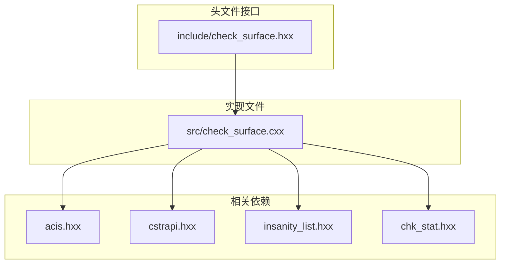
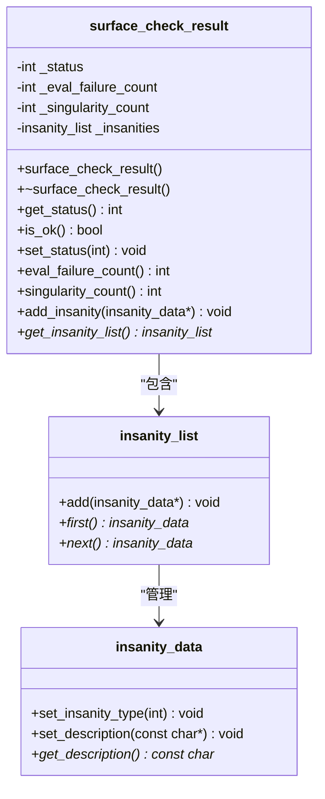
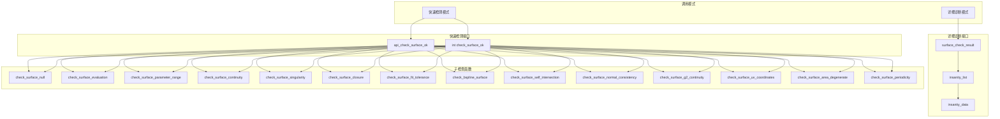
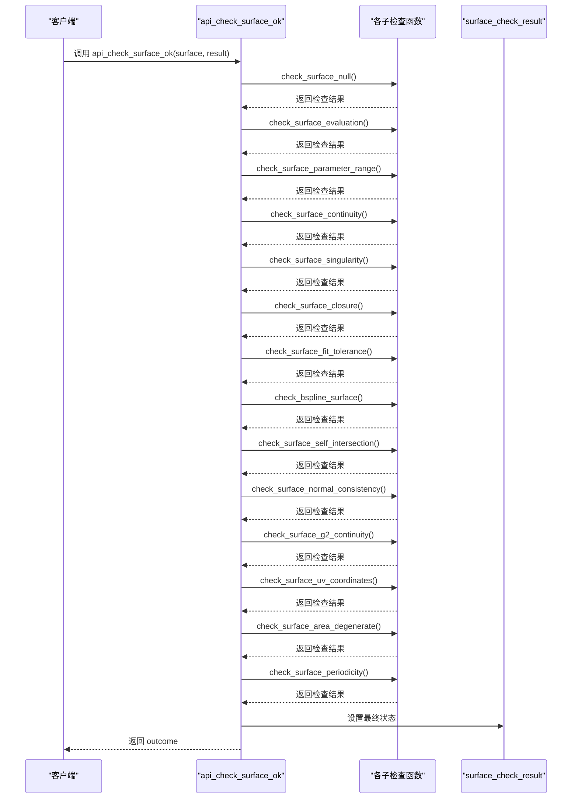
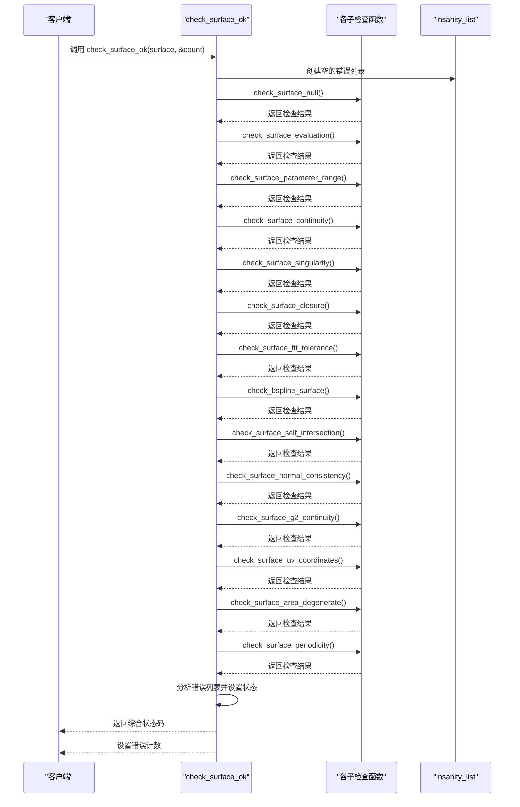
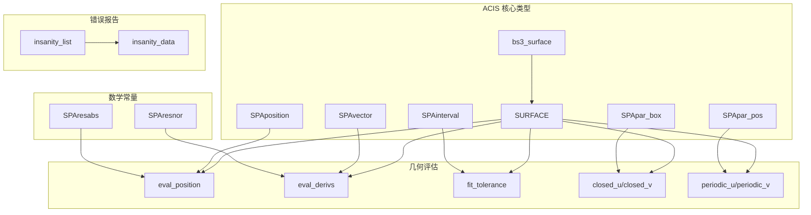

# SURFACE 检查接口说明

<cite>
**本文档引用的文件**
- [check_surface.hxx](file://include/check_surface.hxx)
- [check_surface.cxx](file://src/check_surface.cxx)
- [TASK_SUMMARY.md](file://TASK_SUMMARY.md)
</cite>

## 目录
1. [简介](#简介)
2. [项目结构](#项目结构)
3. [核心组件](#核心组件)
4. [架构概览](#架构概览)
5. [详细组件分析](#详细组件分析)
6. [依赖关系分析](#依赖关系分析)
7. [性能考虑](#性能考虑)
8. [故障排除指南](#故障排除指南)
9. [结论](#结论)

## 简介

SURFACE 检查接口是 ACIS 几何模型验证系统的重要组成部分，专门用于检测和诊断曲面几何的有效性和质量。该接口提供了两种检测模式：快速检测模式（返回状态码）和详细诊断模式（返回完整的结果对象），能够全面检查曲面的各种属性和约束条件。

本接口基于枚举驱动的状态检查机制，通过一系列独立的子检查函数对曲面进行多维度验证，包括几何有效性、拓扑正确性、连续性要求等多个方面。

## 项目结构

SURFACE 检查模块采用标准的头文件声明与实现分离的组织方式：

**图表来源**
- [check_surface.hxx:1-133](file://include/check_surface.hxx#L1-L133)
- [check_surface.cxx:1-10](file://src/check_surface.cxx#L1-L10)

**章节来源**
- [check_surface.hxx:1-133](file://include/check_surface.hxx#L1-L133)
- [check_surface.cxx:1-10](file://src/check_surface.cxx#L1-L10)

## 核心组件

### surface_check_status 枚举

surface_check_status 是 SURFACE 检查模块的核心状态标识符，采用位掩码方式定义各种错误状态：

| 枚举值 | 值 | 含义 | 描述 |
|--------|-----|------|------|
| `SURF_CHECK_OK` | 0 | 无错误 | 表示曲面完全有效 |
| `SURF_CHECK_NULL_SURFACE` | 1<<0 | 曲面为空 | 输入曲面指针为 NULL |
| `SURF_CHECK_EVAL_FAILURE` | 1<<1 | 评估失败 | 几何评估过程中发生异常 |
| `SURF_CHECK_NAN_COORDINATES` | 1<<2 | NaN/Inf坐标 | 计算结果包含 NaN 或无穷大 |
| `SURF_CHECK_BAD_PARAMETER_RANGE` | 1<<3 | 参数域异常 | 参数范围无效或退化 |
| `SURF_CHECK_SELF_INTERSECT` | 1<<4 | 自交 | 曲面存在自相交现象 |
| `SURF_CHECK_BAD_CLOSURE` | 1<<5 | 闭合异常 | 闭合性标记与实际不符 |
| `SURF_CHECK_NON_G0` | 1<<6 | G0连续性 | G0 连续性不满足 |
| `SURF_CHECK_NON_G1` | 1<<7 | G1连续性 | G1 连续性不满足 |
| `SURF_CHECK_BAD_FIT_TOLERANCE` | 1<<8 | 拟合公差异常 | 拟合公差值异常 |
| `SURF_CHECK_BAD_SINGULARITY` | 1<<9 | 奇异点 | 发现奇异点 |
| `SURF_CHECK_ILLEGAL_SURFACE` | 1<<10 | 非法曲面 | 曲面类型非法 |
| `SURF_CHECK_BAD_NORMAL` | 1<<11 | 法向异常 | 法向量计算失败 |
| `SURF_CHECK_NON_G2` | 1<<12 | G2连续性 | G2 连续性不满足 |
| `SURF_CHECK_BAD_UV_COORDINATES` | 1<<13 | UV坐标异常 | UV参数坐标无效 |
| `SURF_CHECK_DEGENERATE_AREA` | 1<<14 | 面积退化 | 曲面面积接近零 |
| `SURF_CHECK_BAD_PERIODICITY` | 1<<15 | 周期性异常 | 周期性与闭合性不匹配 |

### surface_check_result 类

surface_check_result 是详细诊断模式下的核心数据容器类，负责存储检查结果和错误信息：

**图表来源**
- [check_surface.hxx:29-49](file://include/check_surface.hxx#L29-L49)

**章节来源**
- [check_surface.hxx:9-27](file://include/check_surface.hxx#L9-L27)
- [check_surface.hxx:29-49](file://include/check_surface.hxx#L29-L49)
- [check_surface.cxx:10-47](file://src/check_surface.cxx#L10-L47)

## 架构概览

SURFACE 检查接口采用分层架构设计，提供两种不同的调用模式：

**图表来源**
- [check_surface.hxx:51-130](file://include/check_surface.hxx#L51-L130)
- [check_surface.cxx:49-144](file://src/check_surface.cxx#L49-L144)

## 详细组件分析

### 快速检测接口 api_check_surface_ok

api_check_surface_ok 提供简化的检查接口，适合需要快速判断曲面质量的场景：

**函数签名路径**: [check_surface.hxx:51-55](file://include/check_surface.hxx#L51-L55)

**参数说明**:
- `surface`: 输入的 SURFACE 指针，必须非空
- `result`: 输出的 surface_check_result 对象引用
- `ao`: 可选的 AcisOptions 参数，用于配置检查选项

**返回值**:
- 返回 outcome 对象，包含操作状态和结果信息

**调用流程**:

**图表来源**
- [check_surface.cxx:49-144](file://src/check_surface.cxx#L49-L144)

**章节来源**
- [check_surface.cxx:49-144](file://src/check_surface.cxx#L49-L144)

### 详细诊断接口 check_surface_ok

check_surface_ok 提供完整的检查接口，返回详细的错误状态和统计信息：

**函数签名路径**: [check_surface.hxx:127-130](file://include/check_surface.hxx#L127-L130)

**参数说明**:
- `surface`: 输入的 SURFACE 指针，必须非空
- `insanity_count`: 可选的输出参数，返回发现的错误数量

**返回值**:
- 返回 surface_check_status 枚举值，表示综合检查结果状态

**调用流程**:

**图表来源**
- [check_surface.cxx:950-1074](file://src/check_surface.cxx#L950-L1074)

**章节来源**
- [check_surface.cxx:950-1074](file://src/check_surface.cxx#L950-L1074)

### 子检查函数详解

#### 基础检查函数

| 函数名 | 功能描述 | 返回值 | 主要检查内容 |
|--------|----------|--------|-------------|
| `check_surface_null` | 空指针检查 | logical | 验证输入曲面是否为 NULL |
| `check_surface_evaluation` | 几何评估检查 | logical | 检查曲面评估过程中的异常 |
| `check_surface_parameter_range` | 参数域检查 | logical | 验证参数范围的有效性 |
| `check_surface_continuity` | 连续性检查 | logical | 检查曲面的 G0 连续性 |
| `check_surface_singularity` | 奇异点检查 | logical | 检测曲面的奇异点 |
| `check_surface_closure` | 闭合性检查 | logical | 验证曲面闭合标记的正确性 |
| `check_surface_fit_tolerance` | 拟合公差检查 | logical | 检查拟合公差的合理性 |
| `check_bspline_surface` | B样条曲面检查 | logical | 验证 B样条曲面的完整性 |
| `check_surface_self_intersection` | 自交检查 | logical | 检测曲面自相交现象 |
| `check_surface_normal_consistency` | 法向一致性检查 | logical | 验证法向量的一致性 |
| `check_surface_g2_continuity` | G2连续性检查 | logical | 检查曲面的 G2 连续性 |
| `check_surface_uv_coordinates` | UV坐标检查 | logical | 验证 UV 参数坐标的有效性 |
| `check_surface_area_degenerate` | 面积退化检查 | logical | 检测曲面面积退化问题 |
| `check_surface_periodicity` | 周期性检查 | logical | 验证周期性与闭合性的匹配 |

**章节来源**
- [check_surface.cxx:146-948](file://src/check_surface.cxx#L146-L948)

## 依赖关系分析

SURFACE 检查接口依赖于多个 ACIS 核心组件和数学库：

**图表来源**
- [check_surface.hxx:4-7](file://include/check_surface.hxx#L4-L7)
- [check_surface.cxx:2-9](file://src/check_surface.cxx#L2-L9)

**章节来源**
- [check_surface.hxx:4-7](file://include/check_surface.hxx#L4-L7)
- [check_surface.cxx:2-9](file://src/check_surface.cxx#L2-L9)

## 性能考虑

### 时间复杂度分析

各个子检查函数的时间复杂度如下：

- **基础检查函数**: O(1) - 执行常数时间检查
- **采样检查函数**: O(n²) - 使用网格采样进行检查，其中 n 为采样密度
- **B样条检查函数**: O(m×k) - m 为控制点数量，k 为检查次数
- **整体检查流程**: O(n²) - 由最耗时的采样检查决定

### 内存使用

- **surface_check_result**: 固定大小的对象，包含少量整型成员和一个错误列表
- **insanity_list**: 动态增长的错误列表，内存使用与发现的错误数量成正比
- **临时变量**: 每个检查函数使用固定数量的局部变量

### 优化建议

1. **采样密度调整**: 根据曲面复杂度动态调整采样密度
2. **早期退出**: 在发现严重错误时提前终止检查
3. **缓存机制**: 对重复计算的结果进行缓存
4. **并行处理**: 对独立的检查任务进行并行执行

## 故障排除指南

### 常见错误类型及处理

| 错误类型 | 状态码 | 触发条件 | 处理建议 |
|----------|--------|----------|----------|
| 空指针错误 | SURF_CHECK_NULL_SURFACE | 输入曲面为 NULL | 检查输入参数有效性 |
| 评估失败 | SURF_CHECK_EVAL_FAILURE | 几何评估抛出异常 | 检查曲面几何定义 |
| NaN/Inf坐标 | SURF_CHECK_NAN_COORDINATES | 计算结果包含 NaN 或 Inf | 检查参数范围和数值稳定性 |
| 参数域异常 | SURF_CHECK_BAD_PARAMETER_RANGE | 参数范围无效 | 修正曲面参数定义 |
| 自交现象 | SURF_CHECK_SELF_INTERSECT | 发现自相交 | 重新构建曲面几何 |
| 连续性问题 | SURF_CHECK_NON_G0/G1/G2 | 连续性不满足 | 检查曲面拼接和参数化 |
| 奇异点 | SURF_CHECK_BAD_SINGULARITY | 发现奇异点 | 分析曲面退化区域 |
| 面积退化 | SURF_CHECK_DEGENERATE_AREA | 面积接近零 | 检查曲面形状和尺寸 |

### 调试技巧

1. **启用详细诊断**: 使用 api_check_surface_ok 获取完整的错误列表
2. **逐步检查**: 逐个调用子检查函数定位具体问题
3. **参数范围检查**: 验证曲面参数范围的合理性
4. **数值精度**: 检查计算过程中的数值稳定性

**章节来源**
- [check_surface.cxx:146-948](file://src/check_surface.cxx#L146-L948)

## 结论

SURFACE 检查接口提供了全面而高效的曲面几何验证能力，通过两种不同的调用模式满足不同场景的需求。其基于枚举驱动的设计使得状态检查清晰明确，而详细的诊断功能则为问题定位和修复提供了有力支持。

该接口的主要优势包括：

1. **完整性**: 覆盖了曲面几何验证的各个方面
2. **灵活性**: 支持快速检测和详细诊断两种模式
3. **可扩展性**: 基于子检查函数的模块化设计便于功能扩展
4. **可靠性**: 基于 ACIS 核心库的稳定实现

在实际应用中，建议根据具体需求选择合适的调用模式，并结合错误报告进行针对性的问题修复和优化。