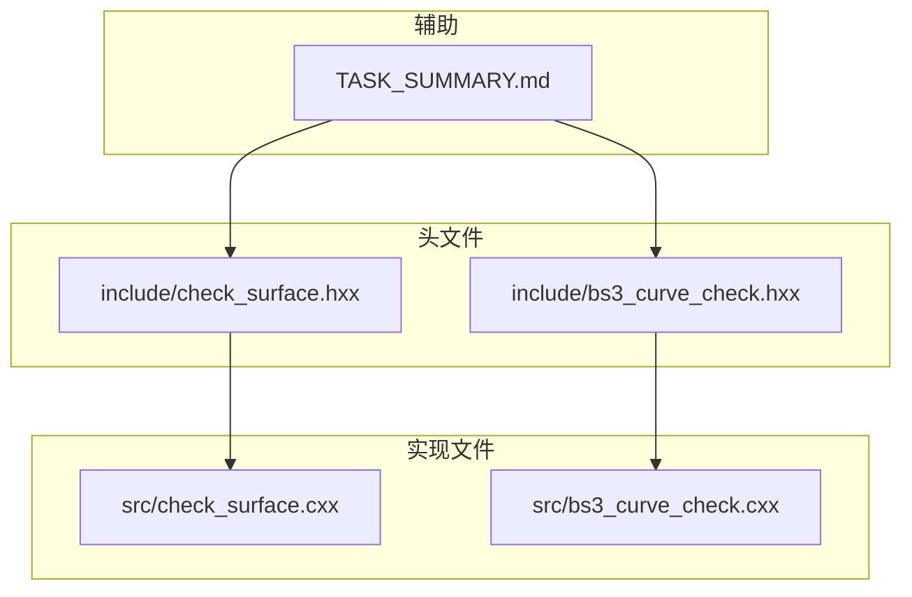
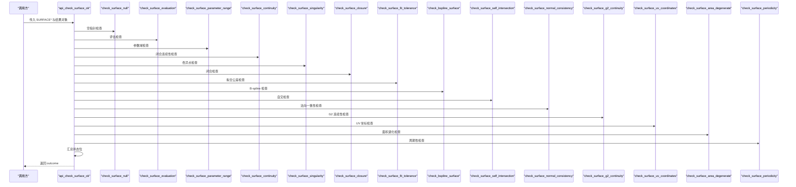
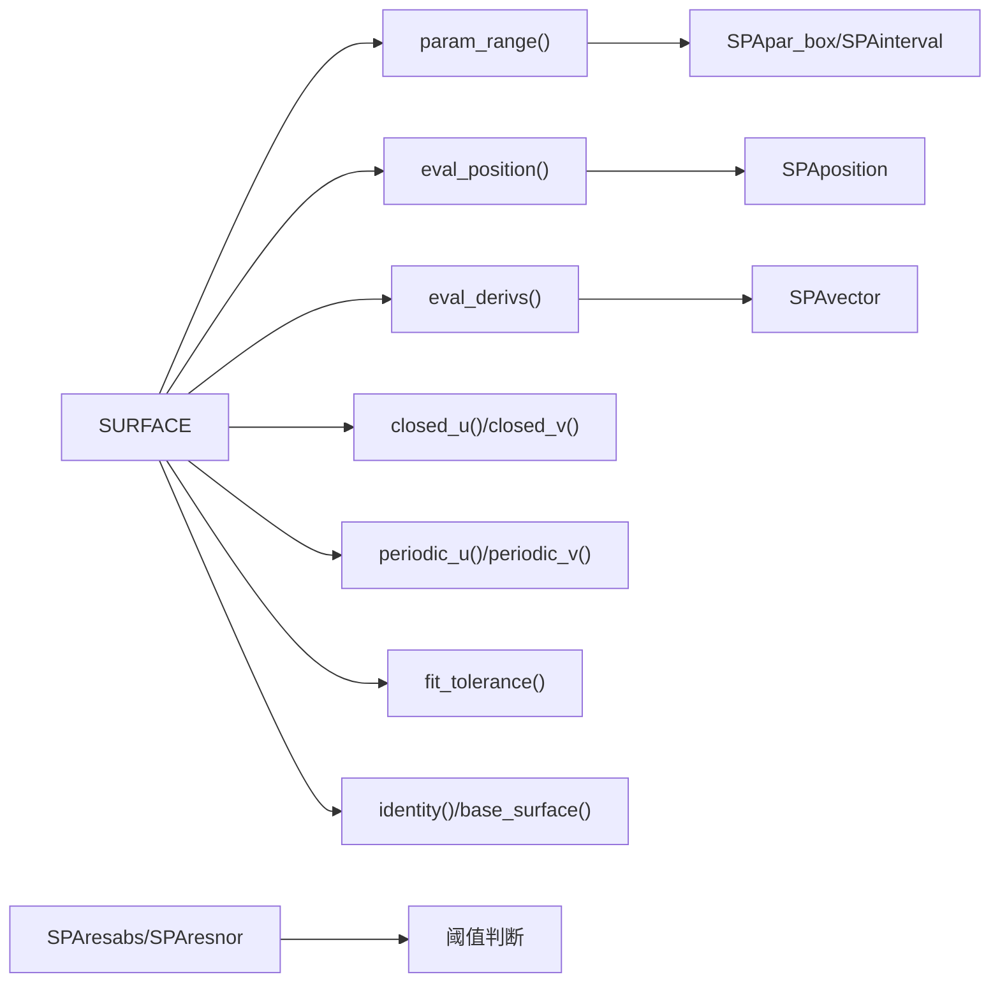

# SURFACE 检查模块

<cite>
**本文档引用的文件**
- [check_surface.hxx](file://include/check_surface.hxx)
- [check_surface.cxx](file://src/check_surface.cxx)
- [bs3_curve_check.hxx](file://include/bs3_curve_check.hxx)
- [bs3_curve_check.cxx](file://src/bs3_curve_check.cxx)
- [TASK_SUMMARY.md](file://TASK_SUMMARY.md)
</cite>

## 目录
1. [简介](#简介)
2. [项目结构](#项目结构)
3. [核心组件](#核心组件)
4. [架构总览](#架构总览)
5. [详细组件分析](#详细组件分析)
6. [依赖分析](#依赖分析)
7. [性能考虑](#性能考虑)
8. [故障排查指南](#故障排查指南)
9. [结论](#结论)
10. [附录](#附录)

## 简介
本文件面向 SURFACE 几何实体检查模块，系统性梳理并解释 16 个子检查函数的理论基础、实现算法、ACIS 内核调用方式与数值稳定性考量，并提供调试技巧与最佳实践。该模块遵循统一的“快速检测（int）+ 详细诊断（outcome + 结果对象）”双模式设计，支持对空指针、评估、参数域、闭合连续性、奇异点、闭合、拟合公差、B-spline、自交、法向一致性、G2 连续性、UV 坐标、面积退化、周期性等维度进行严格校验。

## 项目结构
- 头文件层：定义状态枚举、结果类与对外接口声明
- 实现层：按顺序执行各子检查，收集“异常数据”，汇总为位掩码状态
- 相关模块：BS3_CURVE 检查作为 B-spline 曲面的基础能力参考

图表来源
- [check_surface.hxx:1-133](file://include/check_surface.hxx#L1-L133)
- [check_surface.cxx:1-1075](file://src/check_surface.cxx#L1-L1075)
- [bs3_curve_check.hxx:1-138](file://include/bs3_curve_check.hxx#L1-L138)
- [bs3_curve_check.cxx:1-1011](file://src/bs3_curve_check.cxx#L1-L1011)
- [TASK_SUMMARY.md:1-306](file://TASK_SUMMARY.md#L1-L306)

章节来源
- [check_surface.hxx:1-133](file://include/check_surface.hxx#L1-L133)
- [check_surface.cxx:1-1075](file://src/check_surface.cxx#L1-L1075)
- [bs3_curve_check.hxx:1-138](file://include/bs3_curve_check.hxx#L1-L138)
- [bs3_curve_check.cxx:1-1011](file://src/bs3_curve_check.cxx#L1-L1011)
- [TASK_SUMMARY.md:162-206](file://TASK_SUMMARY.md#L162-L206)

## 核心组件
- 状态枚举：surface_check_status，涵盖 16 个检查维度的状态位
- 结果类：surface_check_result，封装状态位、统计计数与异常列表
- 对外接口：
  - 快速检测：check_surface_ok
  - 详细诊断：api_check_surface_ok
- 子检查函数族：按功能划分的 16 个逻辑函数，返回 logical 并通过 insanity_list 报告问题

章节来源
- [check_surface.hxx:9-131](file://include/check_surface.hxx#L9-L131)

## 架构总览
整体流程采用“主控函数串行调用各子检查”的模式，子检查负责：
- 参数有效性前置判断（空指针）
- 关键几何属性与容差检查
- 数值稳定性与边界条件处理
- 异常捕获与描述字符串生成
- 汇总到 surface_check_result 的状态位与异常列表

图表来源
- [check_surface.cxx:49-144](file://src/check_surface.cxx#L49-L144)

章节来源
- [check_surface.cxx:49-144](file://src/check_surface.cxx#L49-L144)

## 详细组件分析

### 空指针检查（check_surface_null）
- 目标：确保输入 SURFACE* 非空
- 行为：空则记录 ERROR 级别“空指针”异常，返回 FALSE；否则返回 TRUE
- 适用场景：所有子检查前的通用前置校验

章节来源
- [check_surface.cxx:146-159](file://src/check_surface.cxx#L146-L159)

### 评估检查（check_surface_evaluation）
- 目标：验证表面在参数网格上的位置评估是否成功且数值有效
- 方法：
  - 在参数范围均匀采样若干点
  - 调用内核接口计算位置坐标
  - 检测 NaN/Inf 或异常抛出
- 数值稳定性：
  - 使用 try/catch 捕获内核异常
  - 一旦发现异常立即短路返回
- 输出：ERROR 级别“评估失败/NaN/Inf”

章节来源
- [check_surface.cxx:161-220](file://src/check_surface.cxx#L161-L220)

### 参数域检查（check_surface_parameter_range）
- 目标：确认参数区间有效且非退化
- 方法：
  - 获取参数箱与 U/V 区间
  - 检查区间长度是否小于容差阈值（警告）
  - 检查区间端点是否为 NaN/Inf（错误）
- 数值稳定性：使用 SPAresabs 与 SPAresnor 作为阈值基准

章节来源
- [check_surface.cxx:222-275](file://src/check_surface.cxx#L222-L275)

### 闭合连续性检查（check_surface_continuity）
- 目标：当表面标记为闭合时，验证边界位置一致
- 方法：
  - 若 closed_u 或 closed_v，则在中点处取两边界点
  - 计算两点位置距离并与容差比较
- 注意：仅在标记闭合时进行，避免误报

章节来源
- [check_surface.cxx:277-336](file://src/check_surface.cxx#L277-L336)

### 奇异点检查（check_surface_singularity）
- 目标：识别参数空间中的奇异区域（导数叉积过小）
- 方法：
  - 在网格上采样，计算一阶导数 du/dv
  - 计算 sinθ = |du×dv| / (|du||dv|)，若过小则判定潜在奇异
  - 结合两点位置变化进一步确认
- 数值稳定性：使用 SPAresabs 和 SPAresnor 作为阈值

章节来源
- [check_surface.cxx:338-403](file://src/check_surface.cxx#L338-L403)

### 闭合检查（check_surface_closure）
- 目标：验证闭合标记与实际边界一致
- 方法：
  - 选择参数域中心作为测试点
  - 分别沿 U/V 方向对比两端点位置
  - 不一致则记录 ERROR 级别“闭合不匹配”
- 与“闭合连续性检查”的区别：前者关注边界位置一致性，后者关注参数域闭合标记

章节来源
- [check_surface.cxx:405-464](file://src/check_surface.cxx#L405-L464)

### 拟合公差检查（check_surface_fit_tolerance）
- 目标：检查拟合公差的合理性
- 方法：
  - 检查是否为负（错误）
  - 是否过大（警告）

章节来源
- [check_surface.cxx:466-493](file://src/check_surface.cxx#L466-L493)

### B-spline 检查（check_bspline_surface）
- 目标：针对 B-spline 曲面的阶数、控制点、边界相邻顶点等进行校验
- 方法：
  - 确认类型为 B-spline
  - 校验阶数与控制点数量关系
  - 检查相邻控制顶点是否重合（警告）
- 与 BS3_CURVE 检查的关系：B-spline 曲面的控制点与曲线的控制点检查思路一致

章节来源
- [check_surface.cxx:495-576](file://src/check_surface.cxx#L495-L576)

### 自交检查（check_surface_self_intersection）
- 目标：检测参数域内是否存在自交风险
- 方法：
  - 将参数域划分为若干矩形网格
  - 计算四角映射到空间后的最大边距
  - 若最大边距远大于参数域面积，结合中心与角点距离判断可能自交
- 数值稳定性：使用参数域面积作为尺度归一化

章节来源
- [check_surface.cxx:578-650](file://src/check_surface.cxx#L578-L650)

### 法向一致性检查（check_surface_normal_consistency）
- 目标：确保法向量在参数域内稳定且有效
- 方法：
  - 采样网格计算 du/dv，法向 n = du×dv
  - 归一化后检查 NaN/Inf
  - 异常则记录 ERROR 级别“法向异常”
- 与“奇异点检查”的关系：二者均依赖导数，但法向一致性更关注法向稳定性

章节来源
- [check_surface.cxx:652-719](file://src/check_surface.cxx#L652-L719)

### G2 连续性检查（check_surface_g2_continuity）
- 目标：在闭合边界处检查 G1 连续性（G2 更强，此处实现为 G1）
- 方法：
  - 在 U/V 缝两侧取极近点，分别计算一阶导数
  - 比较左右导数差与容差，超限则记录 WARNING
- 适用场景：闭合曲面的缝合质量评估

章节来源
- [check_surface.cxx:721-804](file://src/check_surface.cxx#L721-L804)

### UV 坐标检查（check_surface_uv_coordinates）
- 目标：确保参数空间坐标有效
- 方法：
  - 在网格上检查 u/v 是否为 NaN/Inf
  - 发现即记录 ERROR 级别“UV 坐标异常”

章节来源
- [check_surface.cxx:806-848](file://src/check_surface.cxx#L806-L848)

### 面积退化检查（check_surface_area_degenerate）
- 目标：检测曲面面积接近零的退化情况
- 方法：
  - 在参数域内采样，计算法向量积分得到近似面积
  - 若面积过小则记录 WARNING

章节来源
- [check_surface.cxx:850-895](file://src/check_surface.cxx#L850-L895)

### 周期性检查（check_surface_periodicity）
- 目标：验证周期性与闭合性的逻辑一致性
- 方法：
  - 若周期性为真而未闭合，或闭合为真而周期性为假，记录 WARNING
- 与“闭合检查”的关系：周期性是闭合的更强约束

章节来源
- [check_surface.cxx:897-948](file://src/check_surface.cxx#L897-L948)

### 快速检测与详细诊断
- 快速检测（check_surface_ok）：串行调用各子检查，累计异常计数，汇总状态位
- 详细诊断（api_check_surface_ok）：除快速检测外，还将异常描述映射到状态位，便于上层分类处理

章节来源
- [check_surface.cxx:950-1075](file://src/check_surface.cxx#L950-L1075)

## 依赖分析
- ACIS 内核接口依赖：
  - SURFACE::param_range、eval_position、eval_derivs、closed_u、closed_v、periodic_u、periodic_v、fit_tolerance、identity/base_surface 等
  - SPApar_box、SPAinterval、SPAposition、SPAvector、SPAresabs、SPAresnor 等数学与容差常量
- 数据结构依赖：
  - insanity_list/insanity_data：用于收集与传递异常信息
- 与其他模块的关系：
  - BS3_CURVE 检查提供了 B-spline 相关的检查范式（阶数、节点向量、控制点等），可作为 B-spline 曲面检查的参考

图表来源
- [check_surface.cxx:172-220](file://src/check_surface.cxx#L172-L220)
- [check_surface.cxx:288-333](file://src/check_surface.cxx#L288-L333)
- [check_surface.cxx:475-492](file://src/check_surface.cxx#L475-L492)
- [check_surface.cxx:509-575](file://src/check_surface.cxx#L509-L575)

章节来源
- [check_surface.cxx:172-575](file://src/check_surface.cxx#L172-L575)

## 性能考虑
- 采样密度与时间权衡：多数检查采用规则网格采样，采样越多越精确但耗时增加
- 异常短路：一旦发现严重异常（如 NaN/Inf、异常抛出），立即返回，避免无效计算
- 容差阈值：合理设置 SPAresabs/SPAresnor，避免过度敏感导致误报
- 并行化潜力：当前实现为串行，未来可在独立采样点之间探索并行化（需注意线程安全与异常处理）

## 故障排查指南
- 常见问题定位
  - “评估失败/NaN/Inf”：优先检查参数域与内核接口调用，确认输入参数合法
  - “闭合不匹配”：检查边界位置与闭合标记一致性
  - “奇异点”：关注导数叉积接近零的区域，必要时细化采样
  - “自交”：观察参数域网格映射到空间后的几何形态
  - “法向异常”：检查导数计算与归一化过程
  - “拟合公差异常”：确认容差设置是否合理
- 调试建议
  - 使用详细诊断模式（outcome + 结果对象）获取异常列表
  - 逐步注释子检查，定位具体问题来源
  - 手工构造边界案例（如尖锐边缘、退化区域）进行回归测试

章节来源
- [check_surface.cxx:186-215](file://src/check_surface.cxx#L186-L215)
- [check_surface.cxx:199-207](file://src/check_surface.cxx#L199-L207)
- [check_surface.cxx:362-398](file://src/check_surface.cxx#L362-L398)
- [check_surface.cxx:608-646](file://src/check_surface.cxx#L608-L646)
- [check_surface.cxx:677-714](file://src/check_surface.cxx#L677-L714)

## 结论
SURFACE 检查模块通过 16 个子检查函数覆盖了从几何到数值、从拓扑到容差的关键维度，既保证了高精度，又兼顾了性能与可维护性。其统一的状态位与异常列表设计，使得上层能够灵活地进行快速检测或详细诊断。建议在工程实践中结合业务需求调整采样密度与阈值，并持续完善边界案例的回归测试。

## 附录

### SURFACE 检查状态枚举详解
- SURF_CHECK_OK：无错误
- SURF_CHECK_NULL_SURFACE：空指针
- SURF_CHECK_EVAL_FAILURE：评估失败
- SURF_CHECK_NAN_COORDINATES：坐标包含 NaN/Inf
- SURF_CHECK_BAD_PARAMETER_RANGE：参数域异常
- SURF_CHECK_SELF_INTERSECT：自交
- SURF_CHECK_BAD_CLOSURE：闭合异常
- SURF_CHECK_NON_G0：非 G0 连续性（由其他检查隐含）
- SURF_CHECK_NON_G1：非 G1 连续性
- SURF_CHECK_BAD_FIT_TOLERANCE：拟合公差异常
- SURF_CHECK_BAD_SINGULARITY：奇异点
- SURF_CHECK_ILLEGAL_SURFACE：非法曲面
- SURF_CHECK_BAD_NORMAL：法向异常
- SURF_CHECK_NON_G2：非 G2 连续性（实现为 G1）
- SURF_CHECK_BAD_UV_COORDINATES：UV 坐标异常
- SURF_CHECK_DEGENERATE_AREA：面积退化
- SURF_CHECK_BAD_PERIODICITY：周期性异常

章节来源
- [check_surface.hxx:9-27](file://include/check_surface.hxx#L9-L27)

### 子检查函数一览（按功能分组）
- 基础校验
  - 空指针检查：check_surface_null
  - 评估检查：check_surface_evaluation
  - 参数域检查：check_surface_parameter_range
- 几何与拓扑
  - 闭合连续性：check_surface_continuity
  - 闭合检查：check_surface_closure
  - 自交检查：check_surface_self_intersection
  - 面积退化：check_surface_area_degenerate
  - 周期性：check_surface_periodicity
- 数值与导数
  - 奇异点：check_surface_singularity
  - 法向一致性：check_surface_normal_consistency
  - G2（G1）连续性：check_surface_g2_continuity
  - UV 坐标：check_surface_uv_coordinates
- B-spline 特有
  - B-spline 检查：check_bspline_surface

章节来源
- [check_surface.hxx:57-125](file://include/check_surface.hxx#L57-L125)
- [TASK_SUMMARY.md:188-205](file://TASK_SUMMARY.md#L188-L205)