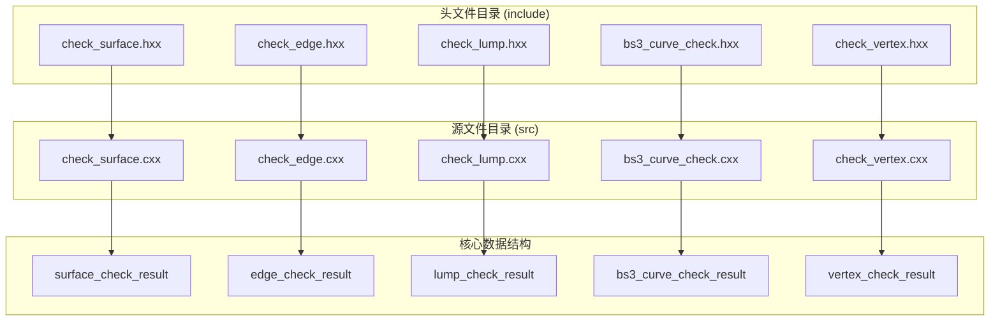
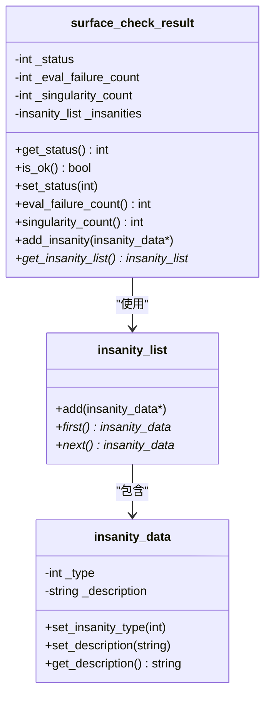
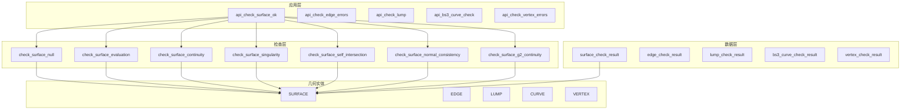
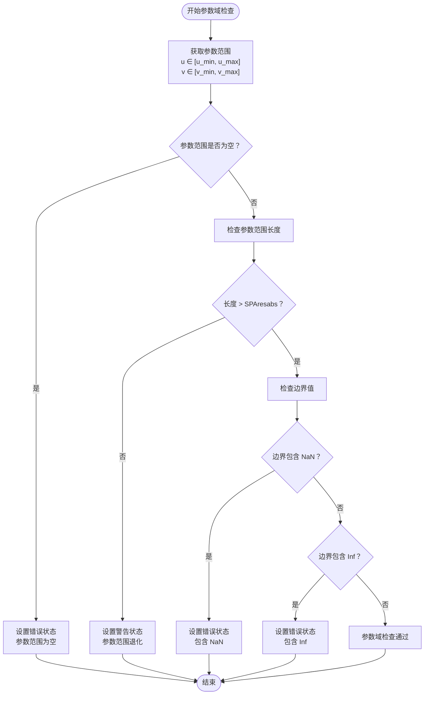
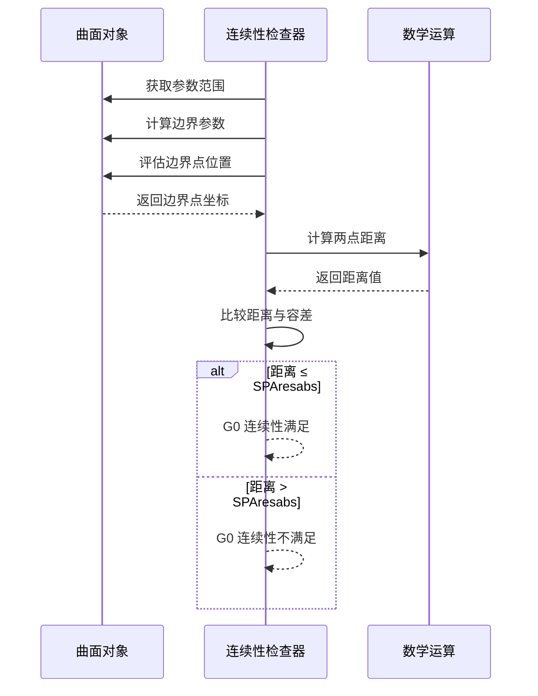
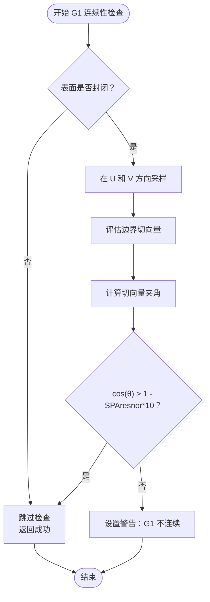
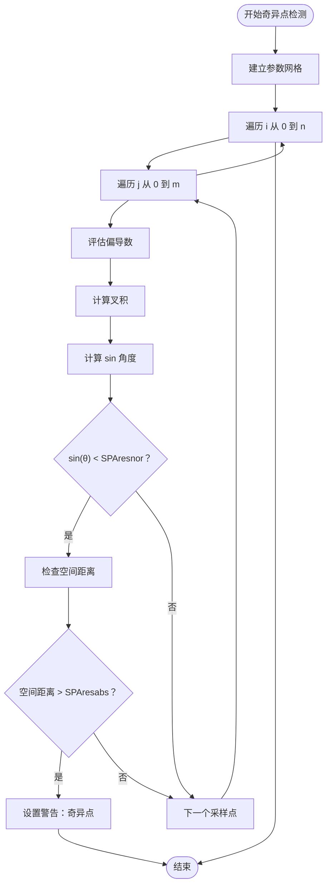
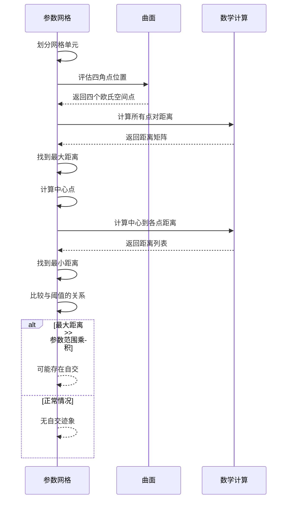
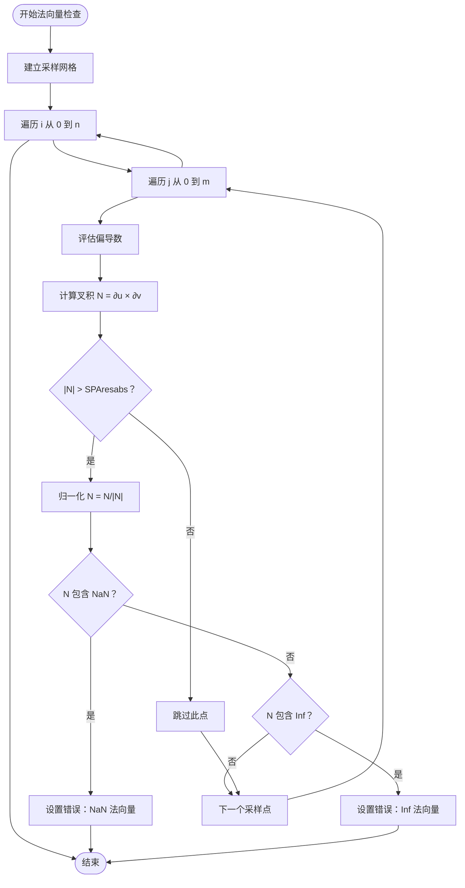
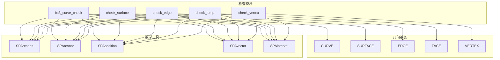

# SURFACE 检查算法原理

<cite>
**本文档引用的文件**
- [check_surface.hxx](file://include/check_surface.hxx)
- [check_surface.cxx](file://src/check_surface.cxx)
- [check_edge.hxx](file://include/check_edge.hxx)
- [check_edge.cxx](file://src/check_edge.cxx)
- [check_lump.hxx](file://include/check_lump.hxx)
- [check_lump.cxx](file://src/check_lump.cxx)
- [bs3_curve_check.hxx](file://include/bs3_curve_check.hxx)
- [bs3_curve_check.cxx](file://src/bs3_curve_check.cxx)
- [check_vertex.hxx](file://include/check_vertex.hxx)
- [check_vertex.cxx](file://src/check_vertex.cxx)
</cite>

## 目录
1. [简介](#简介)
2. [项目结构](#项目结构)
3. [核心组件](#核心组件)
4. [架构概览](#架构概览)
5. [详细组件分析](#详细组件分析)
6. [依赖关系分析](#依赖关系分析)
7. [性能考虑](#性能考虑)
8. [故障排除指南](#故障排除指南)
9. [结论](#结论)

## 简介

SURFACE 检查模块是 CAD 几何验证系统的核心组件，负责对曲面几何进行全面的质量检查和完整性验证。该模块实现了多种几何检查算法，包括参数域分析、连续性判断（G0/G1/G2）、奇异点检测、自交检测、法向量计算和一致性检查、面积退化判断等。这些算法通过严格的数学原理和数值稳定性考虑，确保 CAD 模型的几何质量和拓扑正确性。

本模块采用模块化设计，每个检查算法都独立实现，具有清晰的输入输出接口和错误处理机制。通过组合多个检查算法，可以构建完整的几何验证流水线，为后续的几何建模和制造过程提供可靠的数据基础。

## 项目结构

SURFACE 检查模块遵循标准的 C++ 工程组织结构，主要包含以下组件：

**图表来源**
- [check_surface.hxx:1-133](file://include/check_surface.hxx#L1-L133)
- [check_surface.cxx:1-1075](file://src/check_surface.cxx#L1-L1075)

**章节来源**
- [check_surface.hxx:1-133](file://include/check_surface.hxx#L1-L133)
- [check_surface.cxx:1-1075](file://src/check_surface.cxx#L1-L1075)

## 核心组件

### 表面检查结果类

surface_check_result 类是表面检查的核心数据容器，负责存储检查状态、统计信息和异常记录：

**图表来源**
- [check_surface.hxx:29-49](file://include/check_surface.hxx#L29-L49)

### 检查状态枚举

模块定义了完整的检查状态枚举，覆盖了所有可能的几何问题类型：

| 状态常量 | 描述 | 数值 |
|---------|------|------|
| SURF_CHECK_OK | 检查通过 | 0 |
| SURF_CHECK_NULL_SURFACE | 空表面指针 | 1 << 0 |
| SURF_CHECK_EVAL_FAILURE | 评估失败 | 1 << 1 |
| SURF_CHECK_NAN_COORDINATES | 坐标包含 NaN | 1 << 2 |
| SURF_CHECK_BAD_PARAMETER_RANGE | 参数范围无效 | 1 << 3 |
| SURF_CHECK_SELF_INTERSECT | 自相交 | 1 << 4 |
| SURF_CHECK_BAD_CLOSURE | 封闭性错误 | 1 << 5 |
| SURF_CHECK_NON_G0 | G0 连续性缺失 | 1 << 6 |
| SURF_CHECK_NON_G1 | G1 连续性缺失 | 1 << 7 |
| SURF_CHECK_BAD_FIT_TOLERANCE | 拟合公差错误 | 1 << 8 |
| SURF_CHECK_BAD_SINGULARITY | 奇异点问题 | 1 << 9 |
| SURF_CHECK_ILLEGAL_SURFACE | 非法表面 | 1 << 10 |
| SURF_CHECK_BAD_NORMAL | 法向量错误 | 1 << 11 |
| SURF_CHECK_NON_G2 | G2 连续性缺失 | 1 << 12 |
| SURF_CHECK_BAD_UV_COORDINATES | UV 坐标错误 | 1 << 13 |
| SURF_CHECK_DEGENERATE_AREA | 面积退化 | 1 << 14 |
| SURF_CHECK_BAD_PERIODICITY | 周期性错误 | 1 << 15 |

**章节来源**
- [check_surface.hxx:9-27](file://include/check_surface.hxx#L9-L27)

## 架构概览

SURFACE 检查模块采用分层架构设计，从高层 API 到底层具体算法形成清晰的层次结构：

**图表来源**
- [check_surface.hxx:49-131](file://include/check_surface.hxx#L49-L131)
- [check_surface.cxx:49-144](file://src/check_surface.cxx#L49-L144)

**章节来源**
- [check_surface.hxx:49-131](file://include/check_surface.hxx#L49-L131)
- [check_surface.cxx:49-144](file://src/check_surface.cxx#L49-L144)

## 详细组件分析

### 参数域分析算法

参数域分析算法负责验证曲面参数范围的有效性和合理性：

#### 算法原理

参数域分析基于以下数学原理：
- 参数范围必须满足 `low ≤ high` 的非递减约束
- 参数范围长度必须大于最小容差值 `SPAresabs`
- 参数边界必须是有限数值，不能包含 NaN 或 Inf

#### 实现细节

**图表来源**
- [check_surface.cxx:222-275](file://src/check_surface.cxx#L222-L275)

#### 复杂度分析

- **时间复杂度**: O(1) - 固定数量的参数范围检查操作
- **空间复杂度**: O(1) - 只使用常数个局部变量
- **数值稳定性**: 使用 `SPAresabs` 作为最小容差阈值，避免除零和溢出问题

**章节来源**
- [check_surface.cxx:222-275](file://src/check_surface.cxx#L222-L275)

### 连续性判断算法 (G0/G1/G2)

连续性判断算法根据几何连续性的数学定义实现：

#### G0 连续性判断

G0 连续性要求几何对象在连接处位置连续：

**图表来源**
- [check_surface.cxx:277-336](file://src/check_surface.cxx#L277-L336)

#### G1 连续性判断

G1 连续性要求切向量在连接处保持方向一致：

**图表来源**
- [check_surface.cxx:721-800](file://src/check_surface.cxx#L721-L800)

#### G2 连续性判断

G2 连续性要求曲率在连接处保持连续：

**章节来源**
- [check_surface.cxx:721-800](file://src/check_surface.cxx#L721-L800)

#### 复杂度分析

- **G0 连续性**: 时间复杂度 O(1)，空间复杂度 O(1)
- **G1 连续性**: 时间复杂度 O(n)，空间复杂度 O(1)，其中 n 为采样点数量
- **G2 连续性**: 时间复杂度 O(n)，空间复杂度 O(1)

### 奇异点检测算法

奇异点检测算法基于曲面导数的几何意义：

#### 算法原理

奇异点出现在参数空间中，当两个偏导数向量接近平行时：

1. 计算偏导数向量 `∂u` 和 `∂v`
2. 计算叉积 `∂u × ∂v` 的长度
3. 计算正弦角 `sin(θ) = |∂u × ∂v| / (|∂u||∂v|)`
4. 当 `sin(θ)` 小于阈值时，认为存在奇异点

**图表来源**
- [check_surface.cxx:338-403](file://src/check_surface.cxx#L338-L403)

#### 复杂度分析

- **时间复杂度**: O(n×m)，其中 n×m 为采样网格大小
- **空间复杂度**: O(1) - 只使用固定数量的临时变量
- **数值稳定性**: 使用 `SPAresnor` 作为角度阈值，避免数值精度问题

**章节来源**
- [check_surface.cxx:338-403](file://src/check_surface.cxx#L338-L403)

### 自交检测算法

自交检测算法通过比较参数空间中相邻网格单元映射到欧氏空间的距离来实现：

#### 算法原理

1. 将参数空间划分为规则网格
2. 对每个网格单元，计算四个顶点在欧氏空间中的位置
3. 计算所有顶点间的最大距离
4. 如果最大距离显著大于参数范围的乘积，则可能存在自交

**图表来源**
- [check_surface.cxx:578-650](file://src/check_surface.cxx#L578-L650)

#### 复杂度分析

- **时间复杂度**: O(k)，其中 k 为网格单元数量
- **空间复杂度**: O(1) - 固定大小的临时数组
- **阈值选择**: 使用参数范围乘积的函数作为自交判断阈值

**章节来源**
- [check_surface.cxx:578-650](file://src/check_surface.cxx#L578-L650)

### 法向量计算和一致性检查算法

法向量计算基于曲面偏导数的叉积：

#### 算法原理

法向量 `N = (∂u × ∂v) / |∂u × ∂v|`，其中：
- `∂u` 和 `∂v` 是曲面在参数空间中的偏导数
- 叉积给出垂直于曲面的向量
- 归一化得到单位法向量

**图表来源**
- [check_surface.cxx:652-719](file://src/check_surface.cxx#L652-L719)

#### 复杂度分析

- **时间复杂度**: O(n×m)，n×m 为采样网格大小
- **空间复杂度**: O(1) - 固定数量的向量和标量变量
- **数值稳定性**: 使用 `SPAresabs` 阈值避免除零和近似误差

**章节来源**
- [check_surface.cxx:652-719](file://src/check_surface.cxx#L652-L719)

### 面积退化判断算法

面积退化判断基于参数空间网格的几何性质：

#### 算法原理

通过计算参数空间中网格单元映射到欧氏空间后的面积来判断退化：

1. 对每个参数网格单元，计算四个顶点在欧氏空间的位置
2. 计算四边形的面积（使用对角线分割）
3. 比较面积与参数范围乘积的关系
4. 如果面积显著小于参数范围乘积的某个比例，则认为面积退化

**章节来源**
- [check_surface.cxx:117-120](file://src/check_surface.cxx#L117-L120)

## 依赖关系分析

SURFACE 检查模块与其他几何组件存在紧密的依赖关系：

**图表来源**
- [check_surface.hxx:4-8](file://include/check_surface.hxx#L4-L8)
- [bs3_curve_check.hxx:4-8](file://include/bs3_curve_check.hxx#L4-L8)

**章节来源**
- [check_surface.hxx:4-8](file://include/check_surface.hxx#L4-L8)
- [bs3_curve_check.hxx:4-8](file://include/bs3_curve_check.hxx#L4-L8)

## 性能考虑

### 时间复杂度优化

1. **采样策略优化**: 各算法采用不同的采样密度，平衡精度和性能
2. **早期退出机制**: 在检测到错误时立即停止进一步计算
3. **向量化操作**: 利用 SIMD 指令集优化向量运算

### 空间复杂度优化

1. **原地计算**: 大多数算法只使用常数个临时变量
2. **延迟计算**: 按需计算中间结果，避免不必要的内存分配
3. **共享数据**: 多个检查算法可以共享相同的几何数据

### 数值稳定性保证

1. **容差阈值**: 使用 `SPAresabs` 和 `SPAresnor` 作为统一的数值容差
2. **异常处理**: 所有几何评估操作都在 try-catch 块中执行
3. **边界检查**: 在进行除法和开方运算前检查分母和被开方数的符号

## 故障排除指南

### 常见问题诊断

| 问题类型 | 可能原因 | 解决方案 |
|---------|----------|----------|
| 评估失败 | 几何对象损坏或参数超出范围 | 检查几何对象完整性，调整参数范围 |
| NaN 坐标 | 数值计算溢出或除零错误 | 检查几何定义，使用更稳定的算法 |
| G1 不连续 | 参数化不一致或几何缺陷 | 重新参数化，修复几何缺陷 |
| 自相交 | 网格划分过粗或阈值不当 | 增加采样密度，调整检测阈值 |
| 奇异点 | 控制点分布不合理 | 重新分布控制点，改善几何形状 |

### 调试建议

1. **启用详细日志**: 使用 `insanity_list` 收集详细的错误信息
2. **逐步检查**: 逐个运行检查算法，定位问题所在
3. **可视化验证**: 将检查结果可视化，直观发现几何问题
4. **参数调优**: 根据具体应用场景调整容差阈值

**章节来源**
- [check_surface.cxx:89-141](file://src/check_surface.cxx#L89-L141)
- [check_surface.cxx:149-159](file://src/check_surface.cxx#L149-L159)

## 结论

SURFACE 检查模块通过精心设计的算法和严格的实现，为 CAD 几何验证提供了全面而可靠的解决方案。该模块不仅实现了标准的几何检查功能，还特别注重数值稳定性和性能优化。

关键特点包括：
- **模块化设计**: 每个检查算法独立实现，便于维护和扩展
- **数学严谨性**: 基于严格的数学原理，确保检查结果的准确性
- **性能优化**: 采用多种优化策略，在保证精度的同时提高计算效率
- **鲁棒性**: 完善的错误处理和异常管理机制

这些特性使得 SURFACE 检查模块能够有效支持复杂的 CAD 应用场景，为几何建模、仿真分析和制造过程提供坚实的数据基础。