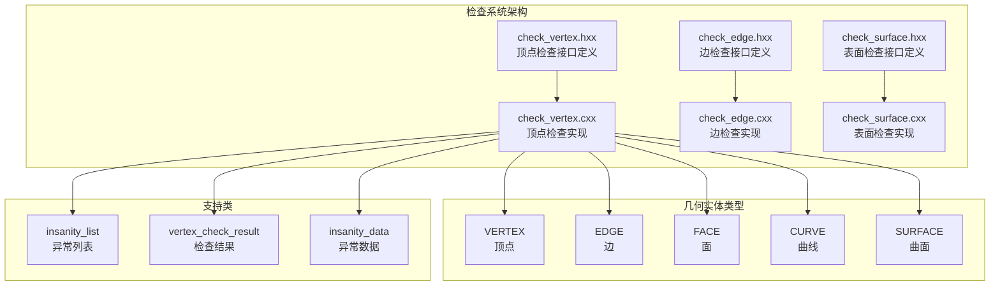
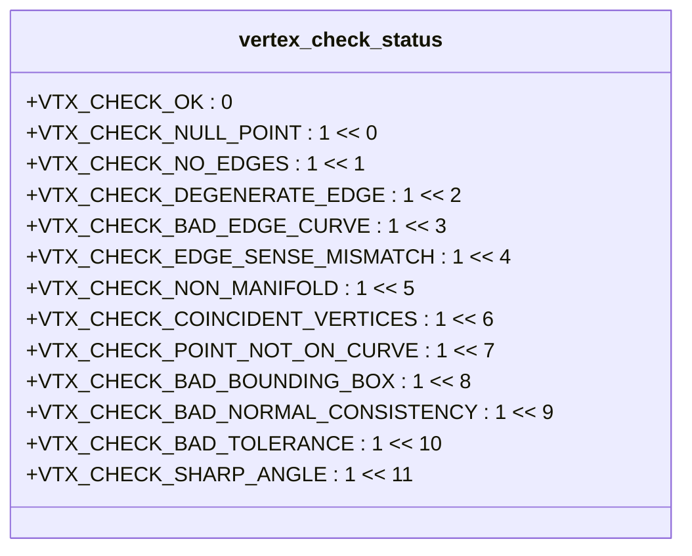
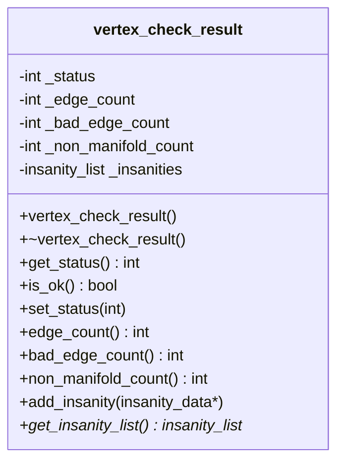
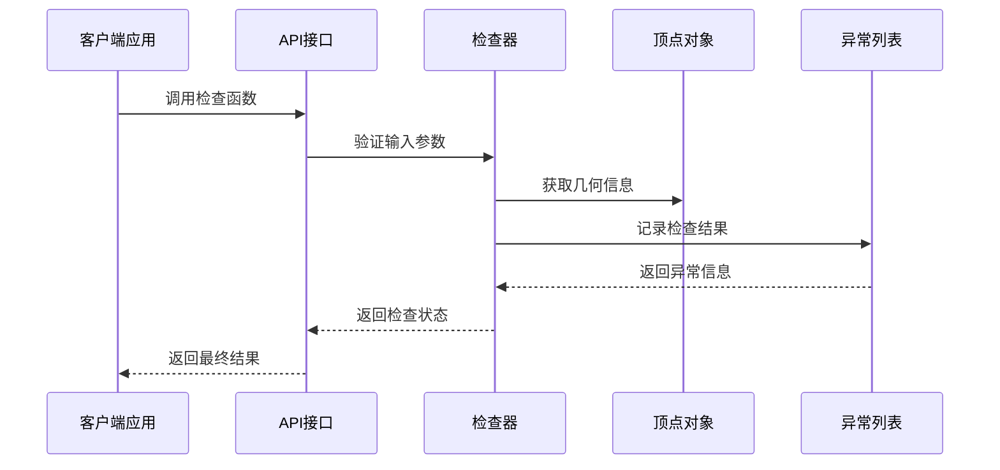
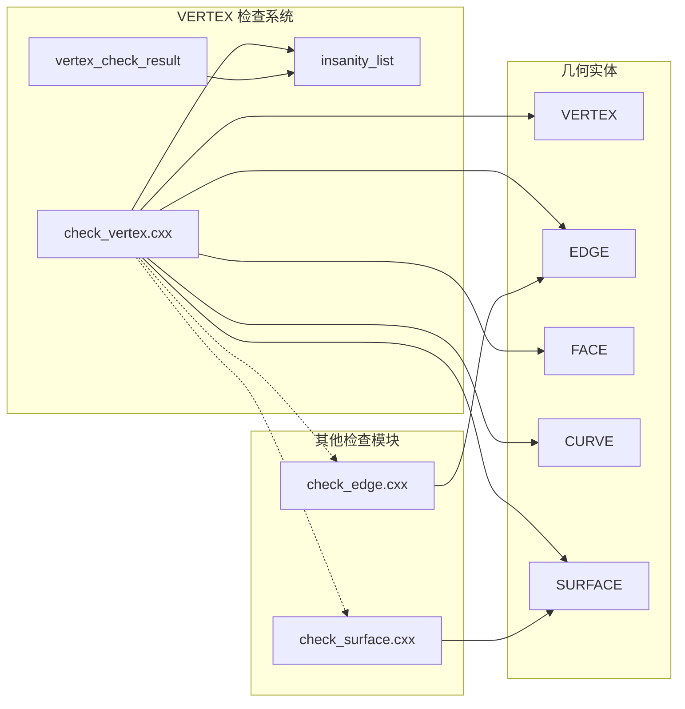

# VERTEX 检查函数详解

<cite>
**本文档引用的文件**
- [check_vertex.hxx](file://include/check_vertex.hxx)
- [check_vertex.cxx](file://src/check_vertex.cxx)
- [check_edge.hxx](file://include/check_edge.hxx)
- [check_edge.cxx](file://src/check_edge.cxx)
- [check_surface.hxx](file://include/check_surface.hxx)
- [check_surface.cxx](file://src/check_surface.cxx)
</cite>

## 目录
1. [简介](#简介)
2. [项目结构](#项目结构)
3. [核心组件](#核心组件)
4. [架构概览](#架构概览)
5. [详细组件分析](#详细组件分析)
6. [依赖关系分析](#依赖关系分析)
7. [性能考虑](#性能考虑)
8. [故障排除指南](#故障排除指南)
9. [结论](#结论)

## 简介

本文档详细介绍了 VERTEX 检查系统的12个核心检查函数，这些函数用于验证几何模型中顶点的完整性和正确性。VERTEX 检查系统是ACIS几何建模内核的重要组成部分，负责确保顶点与其关联的边、面和其他几何元素之间的拓扑和几何关系符合预期标准。

该检查系统提供了全面的验证机制，包括几何有效性检查、拓扑完整性检查、数值稳定性检查等多个维度，能够及时发现和报告几何模型中的各种问题。

## 项目结构

VERTEC 检查系统采用模块化设计，主要包含以下核心组件：



**图表来源**
- [check_vertex.hxx:1-111](file://include/check_vertex.hxx#L1-L111)
- [check_vertex.cxx:1-714](file://src/check_vertex.cxx#L1-L714)

**章节来源**
- [check_vertex.hxx:1-111](file://include/check_vertex.hxx#L1-L111)
- [check_vertex.cxx:1-714](file://src/check_vertex.cxx#L1-L714)

## 核心组件

### 检查状态枚举

VERTEX 检查系统定义了完整的状态枚举，用于标识不同的检查失败类型：



**图表来源**
- [check_vertex.hxx:9-23](file://include/check_vertex.hxx#L9-L23)

### 检查结果类

vertex_check_result 类提供了完整的检查结果管理功能：



**图表来源**
- [check_vertex.hxx:25-47](file://include/check_vertex.hxx#L25-L47)
- [check_vertex.cxx:15-57](file://src/check_vertex.cxx#L15-L57)

**章节来源**
- [check_vertex.hxx:9-47](file://include/check_vertex.hxx#L9-L47)
- [check_vertex.cxx:15-57](file://src/check_vertex.cxx#L15-L57)

## 架构概览

VERTEX 检查系统采用分层架构设计，提供了两种主要的检查接口：



**图表来源**
- [check_vertex.cxx:59-137](file://src/check_vertex.cxx#L59-L137)
- [check_vertex.cxx:611-713](file://src/check_vertex.cxx#L611-L713)

系统提供了两个主要的检查入口点：

1. **错误模式检查** (`api_check_vertex_errors`): 提供详细的异常信息和诊断数据
2. **快速检查** (`api_check_vertex`): 提供简洁的状态码返回

**章节来源**
- [check_vertex.cxx:59-137](file://src/check_vertex.cxx#L59-L137)
- [check_vertex.cxx:611-713](file://src/check_vertex.cxx#L611-L713)

## 详细组件分析

### 1. check_vertex_point_valid - 点有效性检查

**功能概述**: 验证顶点的几何点是否有效，包括坐标值的有效性和数值稳定性。

**实现原理**:
- 检查顶点指针的有效性
- 验证 POINT 对象的存在性
- 检查坐标值是否为 NaN 或无穷大
- 使用数值稳定性阈值进行比较

**参数要求**:
- `VERTEX *vertex`: 要检查的顶点指针
- `insanity_list *ilist`: 存储检查结果的异常列表

**返回值**:
- `logical`: TRUE 表示检查通过，FALSE 表示检查失败

**错误条件**:
- 顶点为空指针
- POINT 对象不存在
- 坐标值包含 NaN
- 坐标值为无穷大

**使用示例**:
```cpp
// 基本使用
insanity_list ilist;
if (check_vertex_point_valid(vertex, &ilist) == FALSE) {
    // 处理检查失败
}

// 获取详细错误信息
insanity_data *error = ilist.first();
while (error) {
    printf("错误: %s\n", error->get_description());
    error = error->next();
}
```

**常见问题解决方案**:
- 确保顶点在几何模型中正确定义
- 检查几何建模过程中的数值精度
- 验证坐标变换操作的正确性

**章节来源**
- [check_vertex.cxx:139-171](file://src/check_vertex.cxx#L139-L171)

### 2. check_vertex_edges_valid - 边有效性检查

**功能概述**: 验证与顶点关联的所有边的有效性，包括边的存在性和几何属性。

**实现原理**:
- 遍历顶点的所有关联边
- 检查每条边的起始和结束顶点
- 验证边的几何长度
- 使用全局精度阈值进行比较

**参数要求**:
- `VERTEX *vertex`: 要检查的顶点指针
- `insanity_list *ilist`: 存储检查结果的异常列表

**返回值**:
- `logical`: TRUE 表示所有边都有效，FALSE 表示存在无效边

**错误条件**:
- 顶点没有关联任何边
- 边的起始或结束顶点为空
- 边的长度过短（接近零）
- 边的几何定义不完整

**使用示例**:
```cpp
// 检查顶点边的有效性
insanity_list ilist;
if (check_vertex_edges_valid(vertex, &ilist) == FALSE) {
    // 分析具体的边问题
    analyze_bad_edges(ilist);
}
```

**常见问题解决方案**:
- 修复几何建模中的边定义错误
- 检查边的方向和拓扑连接
- 验证边的几何连续性

**章节来源**
- [check_vertex.cxx:173-230](file://src/check_vertex.cxx#L173-L230)

### 3. check_vertex_edge_curves - 边曲线检查

**功能概述**: 验证顶点与其关联边的曲线几何关系，确保顶点位于正确的曲线参数位置。

**实现原理**:
- 遍历顶点的所有关联边
- 检查边的曲线几何对象
- 验证顶点位置与曲线参数的对应关系
- 使用曲线评估函数进行精确匹配

**参数要求**:
- `VERTEX *vertex`: 要检查的顶点指针
- `insanity_list *ilist`: 存储检查结果的异常列表

**返回值**:
- `logical`: TRUE 表示所有边的曲线关系正确，FALSE 表示存在不一致

**错误条件**:
- 边的曲线对象为空
- 顶点不在曲线的起始参数位置
- 顶点不在曲线的结束参数位置
- 曲线评估失败

**使用示例**:
```cpp
// 检查边曲线的一致性
insanity_list ilist;
if (check_vertex_edge_curves(vertex, &ilist) == FALSE) {
    // 获取具体的曲线问题信息
    report_curve_mismatches(ilist);
}
```

**常见问题解决方案**:
- 重新计算曲线参数映射
- 检查曲线的参数化方式
- 验证几何建模的精度设置

**章节来源**
- [check_vertex.cxx:232-288](file://src/check_vertex.cxx#L232-L288)

### 4. check_vertex_coincident - 共点检查

**功能概述**: 检测顶点与其邻接顶点之间是否存在共点现象，即多个顶点共享相同的空间位置。

**实现原理**:
- 遍历顶点的所有邻接顶点
- 计算顶点间的空间距离
- 使用精度阈值判断是否为共点
- 标记可能的几何问题

**参数要求**:
- `VERTEX *vertex`: 要检查的顶点指针
- `insanity_list *ilist`: 存储检查结果的异常列表

**返回值**:
- `logical`: TRUE 表示没有检测到共点，FALSE 表示存在共点问题

**错误条件**:
- 两个或多个顶点具有相同的坐标位置
- 共点距离小于精度阈值但大于零
- 可能导致几何模型的拓扑问题

**使用示例**:
```cpp
// 检查共点问题
insanity_list ilist;
if (check_vertex_coincident(vertex, &ilist) == FALSE) {
    // 处理共点警告
    resolve_coincident_vertices(ilist);
}
```

**常见问题解决方案**:
- 合并重叠的顶点
- 调整几何建模的精度设置
- 检查装配过程中的对齐问题

**章节来源**
- [check_vertex.cxx:290-337](file://src/check_vertex.cxx#L290-L337)

### 5. check_vertex_edge_sense - 方向一致性检查

**功能概述**: 验证顶点处边的方向一致性，确保相邻边的同调边（coedge）方向正确。

**实现原理**:
- 遍历顶点的所有关联边
- 检查每条边的同调边集合
- 验证同调边与其伙伴同调边的方向关系
- 检测方向冲突问题

**参数要求**:
- `VERTEX *vertex`: 要检查的顶点指针
- `insanity_list *ilist`: 存储检查结果的异常列表

**返回值**:
- `logical`: TRUE 表示方向一致，FALSE 表示存在方向冲突

**错误条件**:
- 同调边与其伙伴同调边具有相同的方向
- 方向定义不明确或不一致
- 可能导致面的法向量问题

**使用示例**:
```cpp
// 检查方向一致性
insanity_list ilist;
if (check_vertex_edge_sense(vertex, &ilist) == FALSE) {
    // 修正方向问题
    fix_edge_sense_conflicts(ilist);
}
```

**常见问题解决方案**:
- 统一边的方向定义
- 检查几何建模过程中的方向一致性
- 验证装配序列的正确性

**章节来源**
- [check_vertex.cxx:339-374](file://src/check_vertex.cxx#L339-L374)

### 6. check_vertex_manifold - 流形检查

**功能概述**: 验证顶点处的流形性质，确保顶点周围的拓扑结构满足流形条件。

**实现原理**:
- 计算顶点周围面的数量
- 检查面数量的奇偶性
- 验证拓扑结构的连通性
- 标记非流形顶点

**参数要求**:
- `VERTEX *vertex`: 要检查的顶点指针
- `insanity_list *ilist`: 存储检查结果的异常列表

**返回值**:
- `logical`: TRUE 表示满足流形条件，FALSE 表示非流形

**错误条件**:
- 顶点周围面的数量为奇数且大于零
- 拓扑结构不满足流形要求
- 可能导致几何模型的拓扑问题

**使用示例**:
```cpp
// 检查流形性质
insanity_list ilist;
if (check_vertex_manifold(vertex, &ilist) == FALSE) {
    // 分析非流形结构
    analyze_non_manifold(vertex);
}
```

**常见问题解决方案**:
- 修复几何建模中的拓扑错误
- 检查面的正确连接
- 验证几何模型的完整性

**章节来源**
- [check_vertex.cxx:376-413](file://src/check_vertex.cxx#L376-L413)

### 7. check_vertex_bounding_box - 包围盒检查

**功能概述**: 验证顶点坐标的数值稳定性，确保坐标值在合理的范围内。

**实现原理**:
- 检查顶点的包围盒范围
- 验证坐标值的有限性
- 检测数值溢出或下溢问题
- 使用包围盒约束进行验证

**参数要求**:
- `VERTEX *vertex`: 要检查的顶点指针
- `insanity_list *ilist`: 存储检查结果的异常列表

**返回值**:
- `logical`: TRUE 表示坐标值有效，FALSE 表示存在数值问题

**错误条件**:
- 坐标值包含 NaN
- 坐标值为无穷大
- 包围盒计算异常
- 数值稳定性问题

**使用示例**:
```cpp
// 检查包围盒数值稳定性
insanity_list ilist;
if (check_vertex_bounding_box(vertex, &ilist) == FALSE) {
    // 处理数值不稳定问题
    handle_numerical_instability(ilist);
}
```

**常见问题解决方案**:
- 检查几何建模的数值精度
- 验证坐标变换的正确性
- 调整几何计算的精度设置

**章节来源**
- [check_vertex.cxx:415-447](file://src/check_vertex.cxx#L415-L447)

### 8. check_vertex_normal_consistency - 法向一致性检查

**功能概述**: 验证顶点处法向量的一致性，确保相邻面的法向量方向正确。

**实现原理**:
- 统计顶点相关面的数量
- 检查法向量的定义情况
- 验证法向量方向的一致性
- 标记法向量问题

**参数要求**:
- `VERTEX *vertex`: 要检查的顶点指针
- `insanity_list *ilist`: 存储检查结果的异常列表

**返回值**:
- `logical`: TRUE 表示法向量一致，FALSE 表示存在不一致

**错误条件**:
- 法向量定义缺失
- 法向量方向不一致
- 面的法向量计算错误
- 几何模型的拓扑问题

**使用示例**:
```cpp
// 检查法向量一致性
insanity_list ilist;
if (check_vertex_normal_consistency(vertex, &ilist) == FALSE) {
    // 修正法向量问题
    fix_normal_inconsistencies(ilist);
}
```

**常见问题解决方案**:
- 重新计算面的法向量
- 检查面的方向定义
- 验证几何建模的正确性

**章节来源**
- [check_vertex.cxx:449-513](file://src/check_vertex.cxx#L449-L513)

### 9. check_vertex_tolerance - 容差检查

**功能概述**: 验证顶点的容差设置，确保几何计算的精度要求得到满足。

**实现原理**:
- 检查顶点的容差值
- 验证容差值的合理性
- 检测容差设置的异常
- 使用全局容差阈值进行比较

**参数要求**:
- `VERTEX *vertex`: 要检查的顶点指针
- `insanity_list *ilist`: 存储检查结果的异常列表

**返回值**:
- `logical`: TRUE 表示容差设置有效，FALSE 表示存在异常

**错误条件**:
- 容差值为负数
- 容差值过大或过小
- 容差值为 NaN 或无穷大
- 容差设置不符合工程要求

**使用示例**:
```cpp
// 检查容差设置
insanity_list ilist;
if (check_vertex_tolerance(vertex, &ilist) == FALSE) {
    // 调整容差设置
    adjust_tolerance_settings(ilist);
}
```

**常见问题解决方案**:
- 根据几何模型调整容差设置
- 检查制造公差的要求
- 验证几何计算的精度需求

**章节来源**
- [check_vertex.cxx:515-551](file://src/check_vertex.cxx#L515-L551)

### 10. check_vertex_sharp_angle - 尖角检查

**功能概述**: 检测顶点处的尖角现象，识别几何模型中的锐角特征。

**实现原理**:
- 统计顶点关联的边数量
- 计算相邻边之间的夹角
- 检测锐角或尖角的存在
- 标记可能的几何问题

**参数要求**:
- `VERTEX *vertex`: 要检查的顶点指针
- `insanity_list *ilist`: 存储检查结果的异常列表

**返回值**:
- `logical`: TRUE 表示没有检测到尖角，FALSE 表示存在尖角问题

**错误条件**:
- 相邻边之间的夹角过小
- 几何模型存在锐角特征
- 可能影响后续的几何处理

**使用示例**:
```cpp
// 检查尖角问题
insanity_list ilist;
if (check_vertex_sharp_angle(vertex, &ilist) == FALSE) {
    // 处理尖角问题
    resolve_sharp_angles(ilist);
}
```

**常见问题解决方案**:
- 平滑几何模型的锐角
- 调整几何建模的圆角设置
- 检查设计意图的合理性

**章节来源**
- [check_vertex.cxx:553-609](file://src/check_vertex.cxx#L553-L609)

### 11. api_check_vertex_errors - 错误模式检查接口

**功能概述**: 提供详细的错误检查接口，返回完整的异常信息和诊断数据。

**实现原理**:
- 验证输入参数的有效性
- 依次调用所有检查函数
- 分析异常信息并转换为状态码
- 返回详细的检查结果

**参数要求**:
- `VERTEX *vertex`: 要检查的顶点指针
- `vertex_check_result &result`: 存储检查结果的对象
- `AcisOptions *ao`: 可选的配置选项

**返回值**:
- `outcome`: 操作结果，包含状态码和错误信息

**使用示例**:
```cpp
// 使用错误模式检查
vertex_check_result result;
outcome res = api_check_vertex_errors(vertex, result, options);
if (res.is_success()) {
    // 检查通过
    int status = result.get_status();
    if (status == VTX_CHECK_OK) {
        printf("顶点检查通过\n");
    }
}
```

**常见问题解决方案**:
- 检查输入参数的有效性
- 分析详细的异常信息
- 根据错误类型采取相应的修复措施

**章节来源**
- [check_vertex.cxx:59-137](file://src/check_vertex.cxx#L59-L137)

### 12. api_check_vertex - 快速检查接口

**功能概述**: 提供快速的顶点检查接口，返回简洁的状态码。

**实现原理**:
- 验证输入参数的有效性
- 依次调用所有检查函数
- 统计检查失败的数量
- 返回组合的状态码

**参数要求**:
- `VERTEX *vertex`: 要检查的顶点指针
- `int *insanity_count`: 可选的失败计数输出

**返回值**:
- `int`: 组合的状态码，包含所有检查结果

**使用示例**:
```cpp
// 使用快速检查
int status = api_check_vertex(vertex, &count);
if (status == VTX_CHECK_OK) {
    printf("所有检查通过\n");
} else {
    printf("检查失败数量: %d\n", count);
    // 根据状态码分析具体问题
}
```

**常见问题解决方案**:
- 检查状态码的位标志
- 使用状态码映射表分析问题类型
- 结合详细检查接口获取更多信息

**章节来源**
- [check_vertex.cxx:611-713](file://src/check_vertex.cxx#L611-L713)

## 依赖关系分析

VERTEX 检查系统与其他几何检查模块存在密切的依赖关系：



**图表来源**
- [check_vertex.cxx:1-14](file://src/check_vertex.cxx#L1-L14)
- [check_edge.cxx:1-11](file://src/check_edge.cxx#L1-L11)
- [check_surface.cxx:1-11](file://src/check_surface.cxx#L1-L11)

**章节来源**
- [check_vertex.cxx:1-14](file://src/check_vertex.cxx#L1-L14)
- [check_edge.cxx:1-11](file://src/check_edge.cxx#L1-L11)
- [check_surface.cxx:1-11](file://src/check_surface.cxx#L1-L11)

## 性能考虑

### 时间复杂度分析

各个检查函数的时间复杂度如下：

- **check_vertex_point_valid**: O(1) - 常数时间检查
- **check_vertex_edges_valid**: O(n) - n为关联边的数量
- **check_vertex_edge_curves**: O(n) - n为关联边的数量  
- **check_vertex_coincident**: O(n) - n为关联顶点的数量
- **check_vertex_edge_sense**: O(n×m) - n为边数，m为平均同调边数
- **check_vertex_manifold**: O(n×m) - n为边数，m为平均同调边数
- **check_vertex_bounding_box**: O(1) - 常数时间检查
- **check_vertex_normal_consistency**: O(n×m) - n为边数，m为平均同调边数
- **check_vertex_tolerance**: O(1) - 常数时间检查
- **check_vertex_sharp_angle**: O(n²) - n为关联边的数量

### 内存使用优化

- 使用栈分配存储临时变量
- 避免不必要的对象复制
- 及时释放动态分配的内存
- 使用智能指针管理资源

### 并行处理可能性

某些检查函数可以并行执行：
- 边的有效性检查可以在多线程环境中并行处理
- 不同顶点的检查可以并行执行
- 需要注意线程安全和资源共享问题

## 故障排除指南

### 常见错误类型及解决方案

| 错误类型 | 描述 | 解决方案 |
|---------|------|----------|
| VTX_CHECK_NULL_POINT | 顶点点几何为空 | 检查几何建模过程，确保顶点正确定义 |
| VTX_CHECK_NO_EDGES | 顶点没有关联边 | 修复几何模型的拓扑连接 |
| VTX_CHECK_DEGENERATE_EDGE | 边长度过短 | 检查几何精度设置，重新建模 |
| VTX_CHECK_BAD_EDGE_CURVE | 边曲线关系不正确 | 重新计算曲线参数映射 |
| VTX_CHECK_EDGE_SENSE_MISMATCH | 边方向不一致 | 统一边的方向定义 |
| VTX_CHECK_NON_MANIFOLD | 非流形顶点 | 修复几何拓扑结构 |

### 调试技巧

1. **启用详细日志**: 使用 `api_check_vertex_errors` 获取完整的异常信息
2. **逐步检查**: 逐个调用单个检查函数定位问题
3. **可视化分析**: 使用几何可视化工具检查顶点周围的结构
4. **数值分析**: 检查坐标值的精度和范围

### 最佳实践

1. **预防性检查**: 在几何建模过程中定期进行顶点检查
2. **渐进式修复**: 从小问题开始逐步解决复杂的几何问题
3. **版本控制**: 保留检查结果以便跟踪问题的发展
4. **性能监控**: 监控检查过程的性能，及时发现性能瓶颈

**章节来源**
- [check_vertex.cxx:59-137](file://src/check_vertex.cxx#L59-L137)
- [check_vertex.cxx:611-713](file://src/check_vertex.cxx#L611-L713)

## 结论

VERTEX 检查系统提供了全面而细致的顶点验证机制，涵盖了从几何有效性到拓扑完整性的各个方面。通过这12个专门的检查函数，开发者可以有效地识别和解决几何模型中的各种问题。

系统的设计充分考虑了实用性、可维护性和扩展性，为复杂的几何建模应用提供了可靠的质量保证机制。建议在实际应用中结合使用快速检查和详细检查接口，以获得最佳的检查效果和开发体验。

通过对这些检查函数的深入理解和正确使用，开发者可以显著提高几何模型的质量，减少后续处理过程中的问题，并提升整体的建模效率和可靠性。