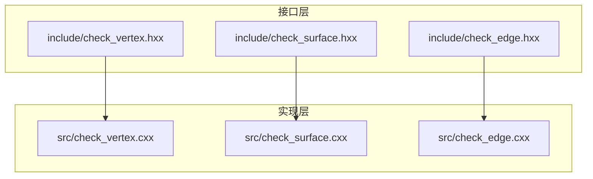
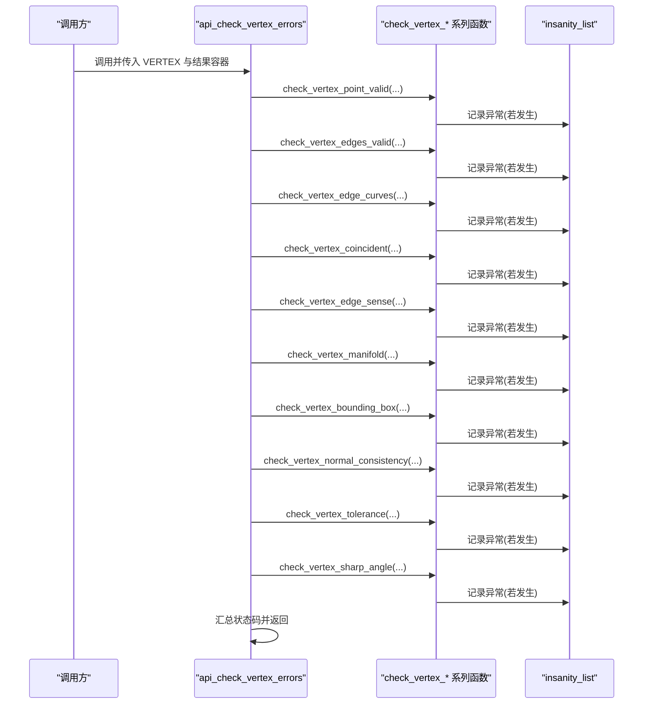
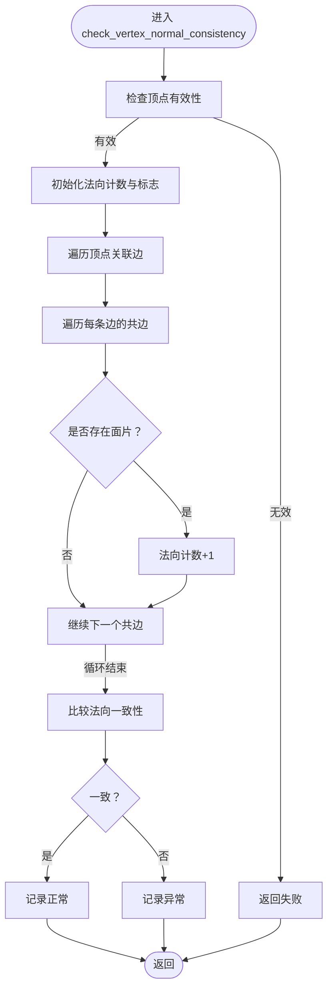
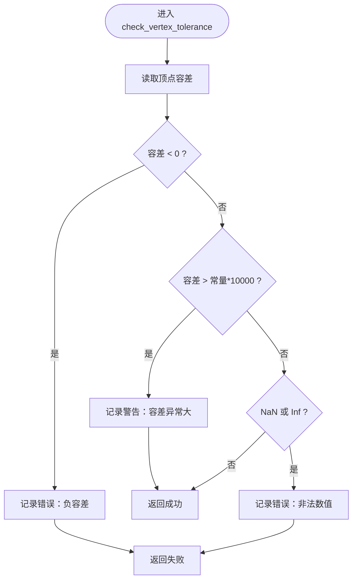
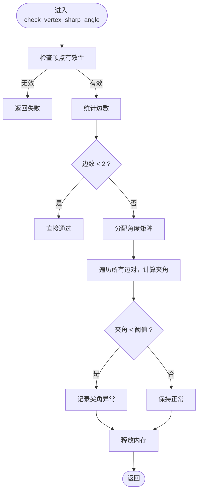
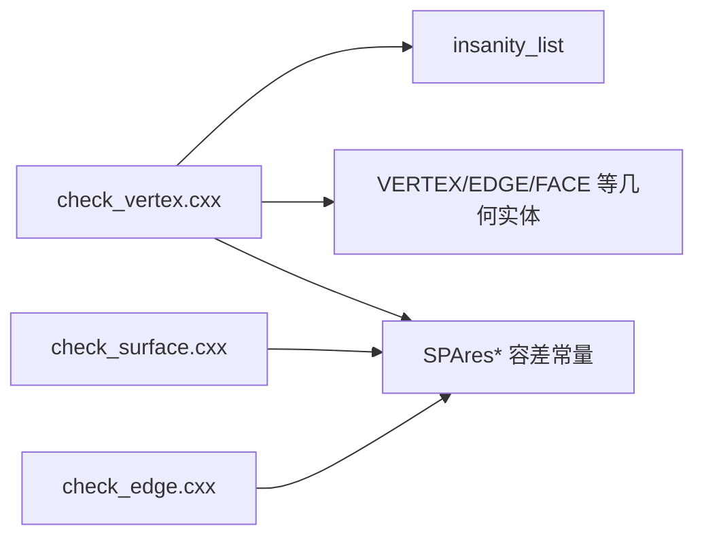

# 几何属性检查

<cite>
**本文档引用的文件**
- [check_vertex.hxx](file://include/check_vertex.hxx)
- [check_vertex.cxx](file://src/check_vertex.cxx)
- [check_surface.hxx](file://include/check_surface.hxx)
- [check_surface.cxx](file://src/check_surface.cxx)
- [check_edge.hxx](file://include/check_edge.hxx)
- [check_edge.cxx](file://src/check_edge.cxx)
</cite>

## 目录
1. [引言](#引言)
2. [项目结构](#项目结构)
3. [核心组件](#核心组件)
4. [架构总览](#架构总览)
5. [详细组件分析](#详细组件分析)
6. [依赖关系分析](#依赖关系分析)
7. [性能考虑](#性能考虑)
8. [故障排查指南](#故障排查指南)
9. [结论](#结论)
10. [附录](#附录)

## 引言
本文件聚焦 VERTEX 检查模块中与几何属性相关的三项关键检查函数：法向一致性检查、容差检查、尖角检查。我们将从几何计算原理、容差设置方法、角度计算算法以及精度控制策略等维度进行系统化阐述，并结合数值稳定性分析与工程实践建议，帮助读者在实际项目中正确使用与扩展这些检查逻辑。

## 项目结构
VERTEX 检查模块由接口头文件与实现源文件组成，同时与 EDGE/SURFACE 模块存在概念上的关联与参考。下图展示了与本主题直接相关的文件组织与职责划分：

图表来源
- [check_vertex.hxx](file://include/check_vertex.hxx)
- [check_vertex.cxx](file://src/check_vertex.cxx)
- [check_surface.hxx](file://include/check_surface.hxx)
- [check_surface.cxx](file://src/check_surface.cxx)
- [check_edge.hxx](file://include/check_edge.hxx)
- [check_edge.cxx](file://src/check_edge.cxx)

章节来源
- [check_vertex.hxx](file://include/check_vertex.hxx)
- [check_vertex.cxx](file://src/check_vertex.cxx)

## 核心组件
本节概述与几何属性检查相关的三类函数及其职责边界：
- 法向一致性检查：验证与顶点相邻面片法向方向的一致性，确保拓扑与几何方向协调。
- 容差检查：校验顶点容差的合法性与合理性，避免负值、异常大值或非数值输入。
- 尖角检查：评估顶点处相邻边构成的角度，识别过小角度带来的几何病态风险。

章节来源
- [check_vertex.hxx:90-103](file://include/check_vertex.hxx#L90-L103)
- [check_vertex.cxx:449-513](file://src/check_vertex.cxx#L449-L513)
- [check_vertex.cxx:515-551](file://src/check_vertex.cxx#L515-L551)
- [check_vertex.cxx:553-609](file://src/check_vertex.cxx#L553-L609)

## 架构总览
下图展示了调用链与数据流：上层通过 API 接口触发检查，内部按顺序执行多项子检查；每项检查将“异常”记录到统一的列表中，最终汇总状态码返回。

图表来源
- [check_vertex.cxx:59-137](file://src/check_vertex.cxx#L59-L137)
- [check_vertex.cxx:611-713](file://src/check_vertex.cxx#L611-L713)

章节来源
- [check_vertex.cxx:59-137](file://src/check_vertex.cxx#L59-L137)
- [check_vertex.cxx:611-713](file://src/check_vertex.cxx#L611-L713)

## 详细组件分析

### 法向一致性检查（check_vertex_normal_consistency）
- 目标与原理
  - 验证与顶点相邻面片的法向方向是否一致，避免出现方向冲突导致的几何病态或渲染/求交异常。
  - 实现思路：遍历与顶点关联的所有共边（coedge），提取其所属面片的法向，统计法向一致性情况。
- 关键步骤
  - 统计可参与比较的法向数量（仅当面片存在且具备有效几何时计入）。
  - 对于多法向场景，比较各法向之间的夹角或符号一致性，发现不一致则标记异常。
- 数值与稳定性
  - 使用统一的几何容差常量作为比较阈值，避免浮点误差引发误判。
  - 若法向数量不足（如仅一个或零），该检查默认视为通过。
- 工程注意
  - 当模型存在锐边或非流形拓扑时，法向一致性可能天然不满足，需结合整体拓扑与建模意图综合判断。

图表来源
- [check_vertex.cxx:449-513](file://src/check_vertex.cxx#L449-L513)

章节来源
- [check_vertex.cxx:449-513](file://src/check_vertex.cxx#L449-L513)
- [check_vertex.hxx:90-93](file://include/check_vertex.hxx#L90-L93)

### 容差检查（check_vertex_tolerance）
- 目标与原理
  - 校验顶点容差的合法性与合理性，防止负值、过大或非数值输入影响后续几何运算（如求交、投影、布尔）。
- 关键规则
  - 非负约束：容差必须非负。
  - 合理性上限：超过某个基于全局容差常量的倍数时，视为异常偏大并给出警告。
  - 数值有效性：禁止 NaN 或无穷大。
- 容差常量与阈值
  - 使用统一的全局容差常量作为比较基准，确保不同尺度模型的一致性。
- 工程注意
  - 过大的容差会掩盖几何细节，降低求交精度；过小的容差可能导致数值不稳定。应结合具体几何尺度与求解器要求设定合理范围。

图表来源
- [check_vertex.cxx:515-551](file://src/check_vertex.cxx#L515-L551)

章节来源
- [check_vertex.cxx:515-551](file://src/check_vertex.cxx#L515-L551)
- [check_vertex.hxx:95-98](file://include/check_vertex.hxx#L95-L98)

### 尖角检查（check_vertex_sharp_angle）
- 目标与原理
  - 检测顶点处相邻边构成的角度是否过小，识别可能的尖角或病态几何，避免后续网格生成、渲染或求交过程中的数值问题。
- 关键步骤
  - 统计与顶点关联的边数量，少于两条时直接跳过。
  - 构造角度矩阵（用于后续比较），当前实现预留了存储空间但未完成具体角度计算与阈值判定。
- 角度计算与阈值策略（现状与建议）
  - 现状：代码已分配二维数组用于存储边对之间的角度，但未填充实际角度值与判定逻辑。
  - 建议实现：
    - 对每条边，计算其在局部坐标系下的切向方向；
    - 使用向量夹角公式计算两向量夹角，并与预设阈值比较；
    - 阈值可采用全局角度容差常量或自适应于模型尺度的阈值；
    - 对小于阈值的角度标记为“尖角”异常。
- 数值稳定性
  - 夹角计算使用单位化后的向量，避免长度差异引入误差；
  - 使用内积/外积组合进行角度估计与正负判定，提升鲁棒性；
  - 对接近退化的向量（长度过小）进行保护，避免除零或数值溢出。

图表来源
- [check_vertex.cxx:553-609](file://src/check_vertex.cxx#L553-L609)

章节来源
- [check_vertex.cxx:553-609](file://src/check_vertex.cxx#L553-L609)
- [check_vertex.hxx:100-103](file://include/check_vertex.hxx#L100-L103)

## 依赖关系分析
- 模块内聚与耦合
  - VERTEX 检查模块内部高度内聚，围绕顶点几何属性展开；与 EDGE/SURFACE 的关系主要体现在概念层面的对比与参考（例如法向一致性在 SURFACE 层有类似实现）。
- 外部依赖
  - 统一使用几何容差常量与数值稳定性判断（NaN/Inf/有限性检查）。
  - 与 insanity_list 的交互用于集中记录异常，便于上层聚合状态码。
- 循环依赖
  - 未见循环依赖迹象；检查函数之间为单向调用关系。

图表来源
- [check_vertex.cxx](file://src/check_vertex.cxx)
- [check_surface.cxx](file://src/check_surface.cxx)
- [check_edge.cxx](file://src/check_edge.cxx)

章节来源
- [check_vertex.cxx](file://src/check_vertex.cxx)
- [check_surface.cxx](file://src/check_surface.cxx)
- [check_edge.cxx](file://src/check_edge.cxx)

## 性能考虑
- 时间复杂度
  - 法向一致性与容差检查均为线性复杂度，与边/共边数量线性相关。
  - 尖角检查当前实现存在二次内存分配，但尚未完成角度计算，整体开销取决于边数。
- 内存与资源
  - 尖角检查存在临时二维数组分配，建议在实现完整算法后及时释放，避免内存泄漏。
- 并发与批处理
  - 在批量检查场景中，建议按拓扑分区并行化独立顶点的检查任务，减少串行等待。

## 故障排查指南
- 常见问题定位
  - 容差异常：优先检查容差是否为负值、是否过大或包含非法数值。
  - 法向不一致：关注非流形拓扑或面片法向方向反转的情况。
  - 尖角：确认角度阈值设置是否合理，必要时根据模型尺度调整。
- 调试建议
  - 打印与记录异常描述字符串，结合上层状态码快速定位问题类别。
  - 对于数值异常（NaN/Inf），优先检查输入几何与参数化范围。

章节来源
- [check_vertex.cxx:515-551](file://src/check_vertex.cxx#L515-L551)
- [check_vertex.cxx:449-513](file://src/check_vertex.cxx#L449-L513)
- [check_vertex.cxx:553-609](file://src/check_vertex.cxx#L553-L609)

## 结论
法向一致性、容差与尖角检查共同构成了 VERTEX 几何属性的核心保障机制。当前实现中，法向一致性与容差检查已具备完整的逻辑框架，而尖角检查尚处于半完成状态。建议尽快完善尖角检查的算法实现与阈值策略，并在工程实践中结合模型特征与求解器要求，动态调整容差与角度阈值，以获得更稳健的几何质量控制效果。

## 附录
- 参考实现对比（法向一致性在 SURFACE 层的实现思路）
  - 表达式：使用参数导数叉积得到法向，再进行归一化与稳定性检查。
  - 参考路径：[check_surface.cxx:652-719](file://src/check_surface.cxx#L652-L719)

章节来源
- [check_surface.cxx:652-719](file://src/check_surface.cxx#L652-L719)