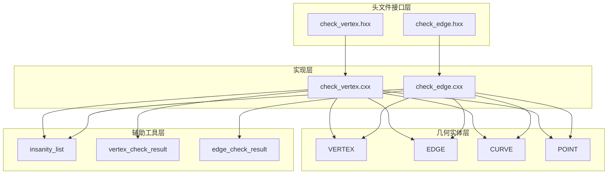
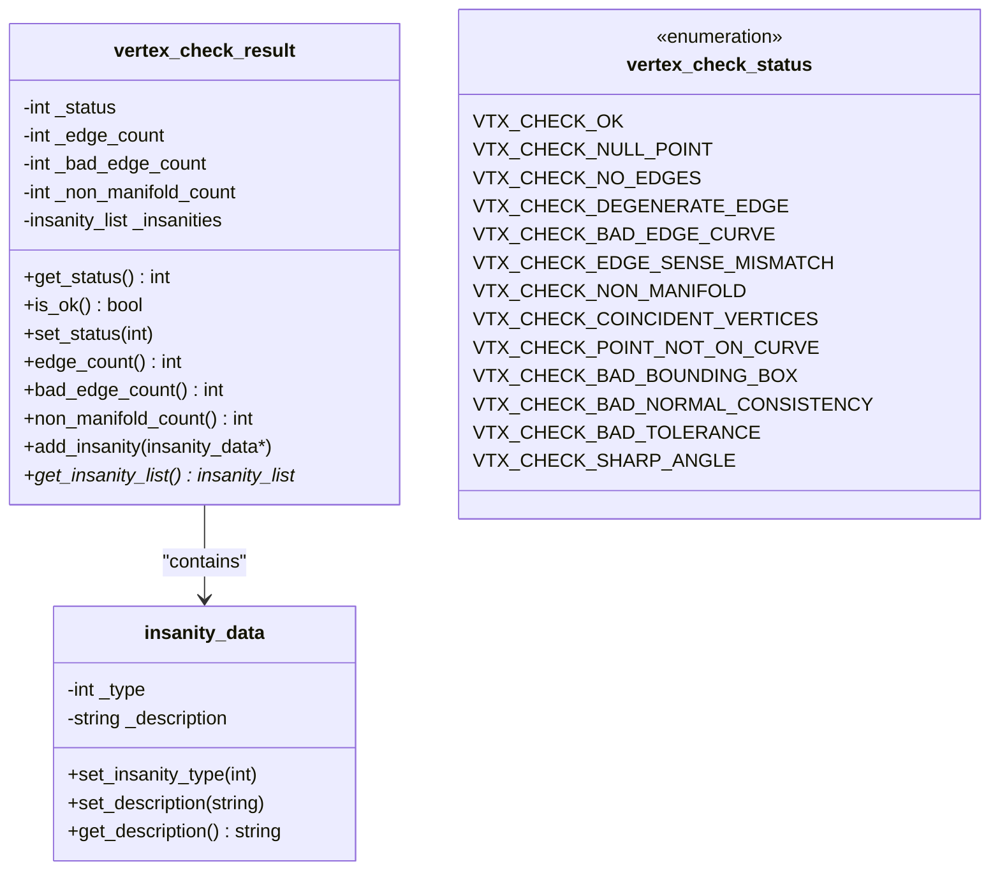
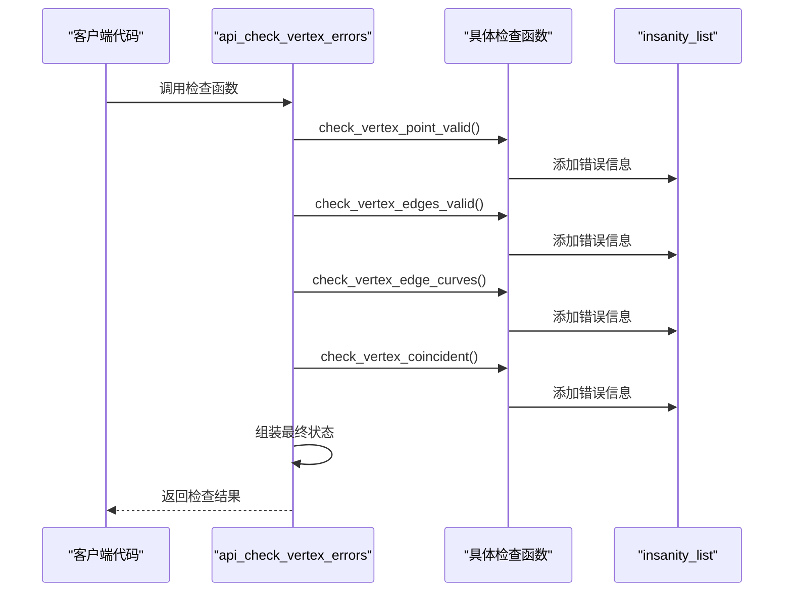
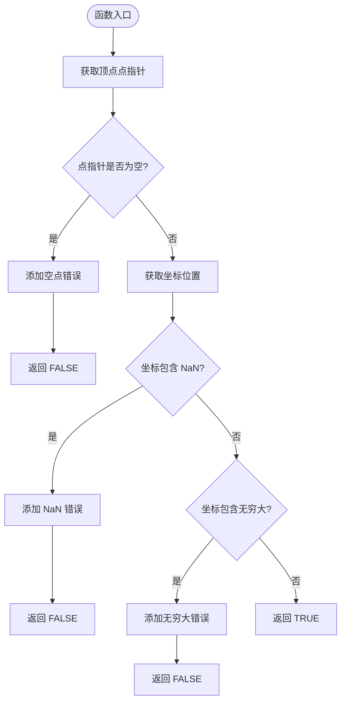
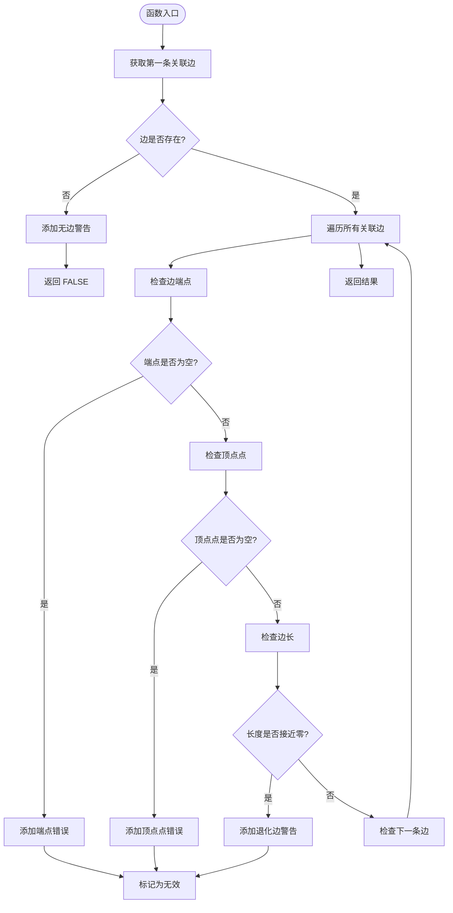
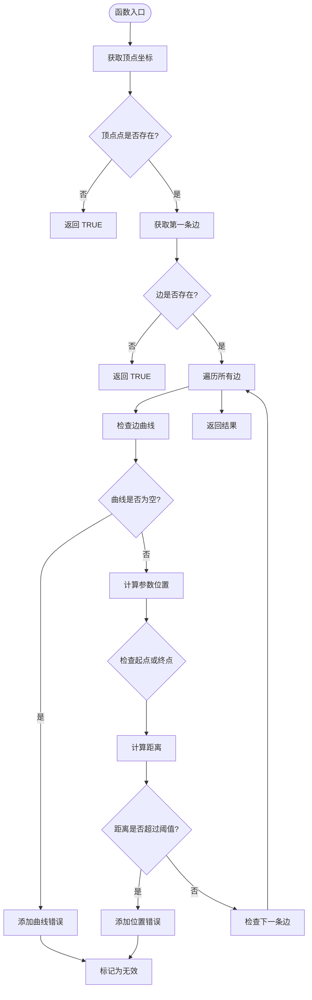
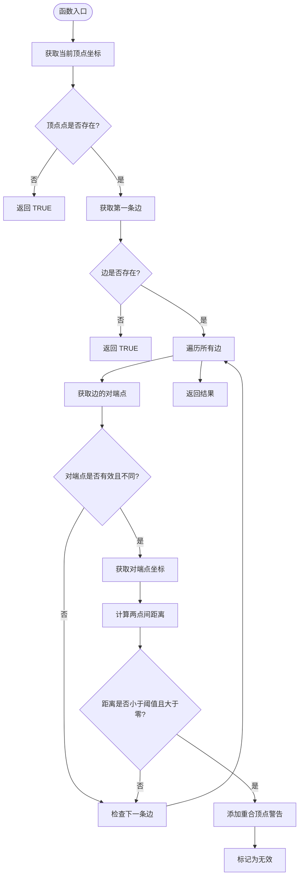
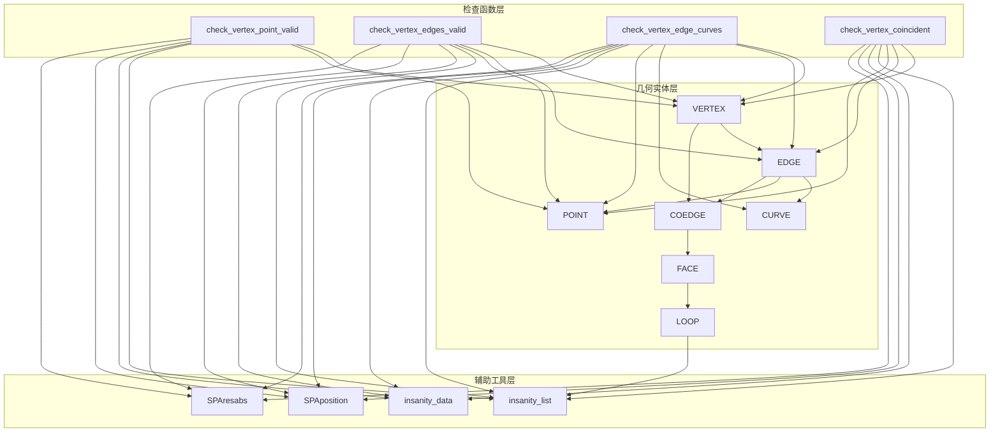

# 基础检查函数

<cite>
**本文档引用的文件**
- [check_vertex.hxx](file://include/check_vertex.hxx)
- [check_vertex.cxx](file://src/check_vertex.cxx)
- [check_edge.hxx](file://include/check_edge.hxx)
- [check_edge.cxx](file://src/check_edge.cxx)
</cite>

## 目录
1. [简介](#简介)
2. [项目结构](#项目结构)
3. [核心组件](#核心组件)
4. [架构概览](#架构概览)
5. [详细组件分析](#详细组件分析)
6. [依赖关系分析](#依赖关系分析)
7. [性能考虑](#性能考虑)
8. [故障排除指南](#故障排除指南)
9. [结论](#结论)

## 简介

本文档详细介绍了 VERTEX 检查模块中的四个核心基础检查函数。这些函数构成了几何模型质量检查系统的重要组成部分，用于验证顶点的几何属性、连接关系和拓扑正确性。通过深入分析这些函数的实现原理、参数要求、返回值含义以及错误处理机制，帮助开发者更好地理解和使用 VERTEX 检查功能。

## 项目结构

VERTEXT 检查模块采用分层架构设计，主要包含以下组件：



**图表来源**
- [check_vertex.hxx:1-111](file://include/check_vertex.hxx#L1-L111)
- [check_edge.hxx:1-130](file://include/check_edge.hxx#L1-L130)

**章节来源**
- [check_vertex.hxx:1-111](file://include/check_vertex.hxx#L1-L111)
- [check_edge.hxx:1-130](file://include/check_edge.hxx#L1-L130)

## 核心组件

VERTEXT 检查模块的核心组件包括四个主要检查函数和相关的数据结构：

### 主要检查函数

1. **check_vertex_point_valid** - 顶点点有效性检查
2. **check_vertex_edges_valid** - 边有效性检查  
3. **check_vertex_edge_curves** - 边曲线检查
4. **check_vertex_coincident** - 共点检查

### 关键数据结构



**图表来源**
- [check_vertex.hxx:25-47](file://include/check_vertex.hxx#L25-L47)
- [check_vertex.hxx:9-23](file://include/check_vertex.hxx#L9-L23)

**章节来源**
- [check_vertex.hxx:25-47](file://include/check_vertex.hxx#L25-L47)
- [check_vertex.hxx:9-23](file://include/check_vertex.hxx#L9-L23)

## 架构概览

VERTEXT 检查模块遵循统一的检查框架设计，所有检查函数都遵循相同的调用模式：



**图表来源**
- [check_vertex.cxx:59-137](file://src/check_vertex.cxx#L59-L137)

## 详细组件分析

### 函数一：check_vertex_point_valid（POINT 有效性检查）

#### 实现原理

该函数负责验证顶点的几何点是否有效，主要检查以下三个方面：

1. **空指针检查** - 验证顶点对象本身是否为空
2. **坐标有效性检查** - 检查三维坐标的数值有效性
3. **无穷大检查** - 确保坐标值不是无穷大

#### 参数要求

- `VERTEX *vertex` - 输入的顶点指针
- `insanity_list *ilist` - 存储检查结果的列表指针

#### 返回值含义

- `TRUE` - 检查通过，顶点点有效
- `FALSE` - 检查失败，存在无效点

#### 错误条件判断



**图表来源**
- [check_vertex.cxx:139-171](file://src/check_vertex.cxx#L139-L171)

#### 使用示例

```cpp
// 示例：检查单个顶点
VERTEX* vertex = get_vertex_from_model();
insanity_list ilist;

if (check_vertex_point_valid(vertex, &ilist) == FALSE) {
    // 处理错误：输出错误信息
    insanity_data* error = ilist.first();
    while (error) {
        printf("错误: %s\n", error->get_description());
        error = error->next();
    }
}
```

**章节来源**
- [check_vertex.cxx:139-171](file://src/check_vertex.cxx#L139-L171)

### 函数二：check_vertex_edges_valid（边有效性检查）

#### 实现原理

该函数验证与顶点相连的所有边是否有效，主要检查：

1. **边的存在性** - 确保顶点至少有一条关联边
2. **边端点有效性** - 检查每条边的起始和结束顶点
3. **边长度有效性** - 验证边的几何长度是否合理

#### 参数要求

- `VERTEX *vertex` - 输入的顶点指针
- `insanity_list *ilist` - 存储检查结果的列表指针

#### 返回值含义

- `TRUE` - 所有边都有效
- `FALSE` - 存在无效边

#### 错误条件判断



**图表来源**
- [check_vertex.cxx:173-230](file://src/check_vertex.cxx#L173-L230)

#### 使用示例

```cpp
// 示例：批量检查多个顶点的边
VERTEX** vertices = get_all_vertices();
int total_errors = 0;

for (int i = 0; i < vertex_count; i++) {
    if (check_vertex_edges_valid(vertices[i], &ilist) == FALSE) {
        total_errors++;
    }
}

printf("发现 %d 个边相关问题\n", total_errors);
```

**章节来源**
- [check_vertex.cxx:173-230](file://src/check_vertex.cxx#L173-L230)

### 函数三：check_vertex_edge_curves（边曲线检查）

#### 实现原理

该函数验证边的几何曲线是否正确，确保顶点位于其关联边的曲线上：

1. **曲线存在性检查** - 验证边的几何曲线是否存在
2. **参数位置验证** - 检查顶点是否位于曲线的正确参数位置
3. **起点终点区分** - 区分顶点是边的起点还是终点

#### 参数要求

- `VERTEX *vertex` - 输入的顶点指针
- `insanity_list *ilist` - 存储检查结果的列表指针

#### 返回值含义

- `TRUE` - 所有边曲线都正确
- `FALSE` - 存在曲线相关错误

#### 错误条件判断



**图表来源**
- [check_vertex.cxx:232-288](file://src/check_vertex.cxx#L232-L288)

#### 使用示例

```cpp
// 示例：检查特定顶点的曲线一致性
VERTEX* target_vertex = find_target_vertex(model);
insanity_list local_ilist;

if (check_vertex_edge_curves(target_vertex, &local_ilist) == FALSE) {
    // 分析具体的曲线问题
    insanity_data* error = local_ilist.first();
    while (error) {
        const char* desc = error->get_description();
        if (strstr(desc, "start parameter")) {
            printf("起点参数不匹配\n");
        } else if (strstr(desc, "end parameter")) {
            printf("终点参数不匹配\n");
        }
        error = error->next();
    }
}
```

**章节来源**
- [check_vertex.cxx:232-288](file://src/check_vertex.cxx#L232-L288)

### 函数四：check_vertex_coincident（共点检查）

#### 实现原理

该函数检测是否存在重合的顶点，即多个顶点共享相同的空间位置：

1. **邻接边遍历** - 检查与顶点相连的所有边
2. **对端点比较** - 对比每条边的另一个端点
3. **距离计算** - 计算顶点间的空间距离
4. **阈值判断** - 使用几何容差判断是否为重合点

#### 参数要求

- `VERTEX *vertex` - 输入的顶点指针
- `insanity_list *ilist` - 存储检查结果的列表指针

#### 返回值含义

- `TRUE` - 未发现重合顶点
- `FALSE` - 发现重合顶点问题

#### 错误条件判断



**图表来源**
- [check_vertex.cxx:290-337](file://src/check_vertex.cxx#L290-L337)

#### 使用示例

```cpp
// 示例：识别潜在的重合顶点问题
VERTEX** vertices = get_all_vertices();
vector<VERTEX*> problematic_vertices;

for (int i = 0; i < vertex_count; i++) {
    if (check_vertex_coincident(vertices[i], &ilist) == FALSE) {
        problematic_vertices.push_back(vertices[i]);
    }
}

printf("发现 %d 个可能存在重合的问题顶点\n", problematic_vertices.size());

// 进一步分析问题顶点
for (VERTEX* vertex : problematic_vertices) {
    analyze_vertex_coincidence(vertex);
}
```

**章节来源**
- [check_vertex.cxx:290-337](file://src/check_vertex.cxx#L290-L337)

## 依赖关系分析

VERTEXT 检查模块与其他组件的依赖关系如下：



**图表来源**
- [check_vertex.cxx:1-714](file://src/check_vertex.cxx#L1-L714)

**章节来源**
- [check_vertex.cxx:1-714](file://src/check_vertex.cxx#L1-L714)

## 性能考虑

### 时间复杂度分析

1. **check_vertex_point_valid**: O(1) - 只需检查单个点的坐标
2. **check_vertex_edges_valid**: O(n) - n为与顶点关联的边数
3. **check_vertex_edge_curves**: O(n) - 需要检查每条边的曲线参数
4. **check_vertex_coincident**: O(n) - 遍历所有关联边进行距离比较

### 内存使用优化

- 所有检查函数都使用栈变量，避免动态内存分配
- 在处理大量顶点时，建议复用 `insanity_list` 对象
- 对于复杂的几何计算，使用局部变量存储中间结果

### 并行处理建议

对于大规模模型检查，可以考虑：
- 将不同类型的检查函数分离到不同的线程
- 对独立的顶点集合进行并行检查
- 使用批处理方式减少函数调用开销

## 故障排除指南

### 常见错误场景

#### 场景一：空指针异常
**症状**: 检查函数返回 `FALSE` 且错误描述包含 "null" 或 "Null"
**原因**: 传入了空的顶点指针或几何实体
**解决方案**: 
- 在调用前检查指针有效性
- 确保几何模型已正确构建

#### 场景二：坐标异常
**症状**: 检测到 NaN 或无穷大坐标
**原因**: 几何计算过程中的数值不稳定
**解决方案**:
- 检查输入几何数据的质量
- 调整几何容差设置
- 重新生成有问题的几何实体

#### 场景三：退化几何
**症状**: 发现退化的边或面
**原因**: 几何构造过程中的精度问题
**解决方案**:
- 检查几何建模过程
- 调整建模参数
- 使用几何修复工具

### 调试技巧

1. **逐步检查**: 从 `check_vertex_point_valid` 开始，逐个函数验证
2. **错误分类**: 利用 `insanity_list` 中的错误类型进行分类处理
3. **阈值调整**: 根据具体应用调整几何容差参数
4. **日志记录**: 记录详细的错误信息便于问题定位

**章节来源**
- [check_vertex.cxx:59-137](file://src/check_vertex.cxx#L59-L137)

## 结论

VERTEXT 检查模块的四个核心基础检查函数提供了全面的顶点质量保证机制。通过有效的点有效性检查、边有效性验证、曲线一致性检查和共点检测，能够及时发现和报告几何模型中的各种问题。

这些函数的设计具有以下特点：
- **模块化设计**: 每个函数职责明确，便于单独测试和维护
- **错误分类**: 使用详细的错误类型标识，便于问题诊断
- **性能优化**: 采用高效的算法和数据结构，适合大规模模型检查
- **扩展性强**: 支持自定义容差和检查选项

建议在实际应用中：
- 建立完整的检查流程，按顺序执行各个检查函数
- 根据具体应用场景调整容差参数
- 建立错误处理和修复机制
- 定期更新检查规则以适应新的建模需求