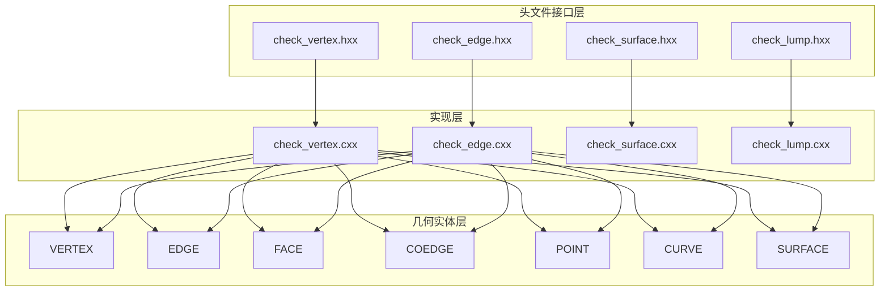
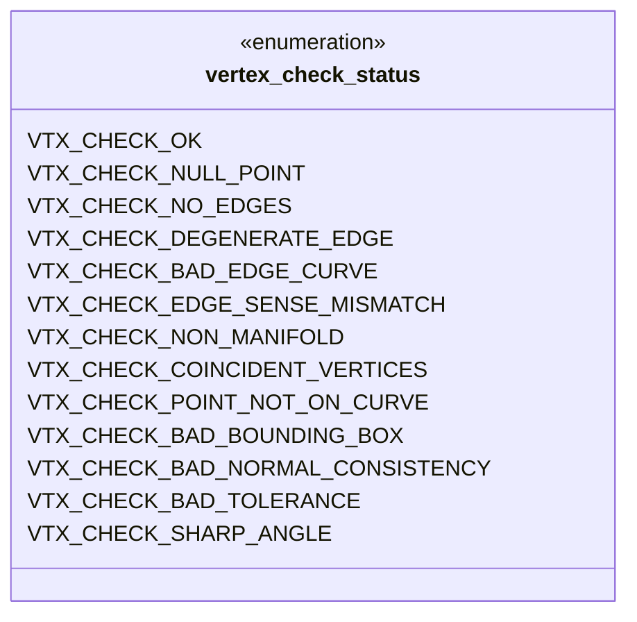
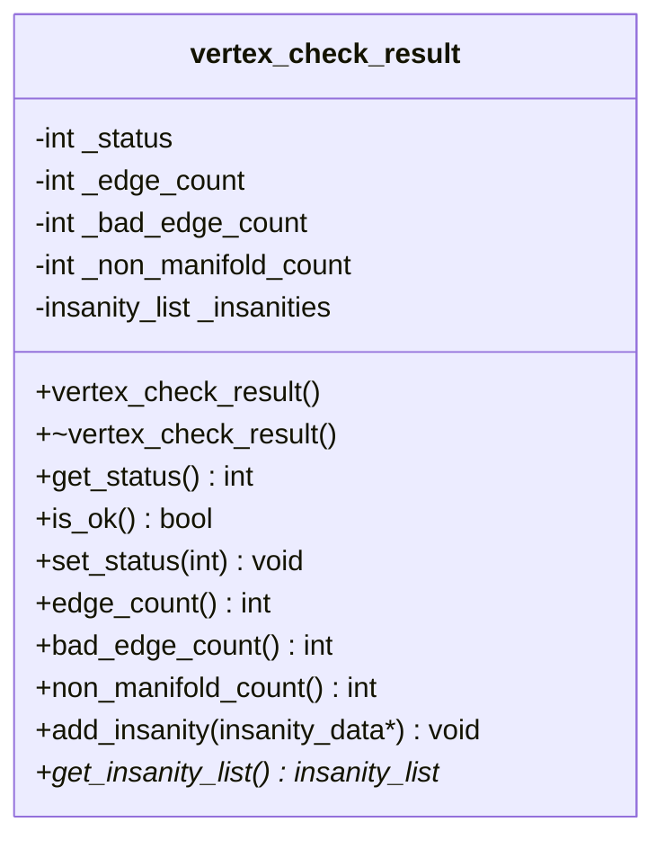
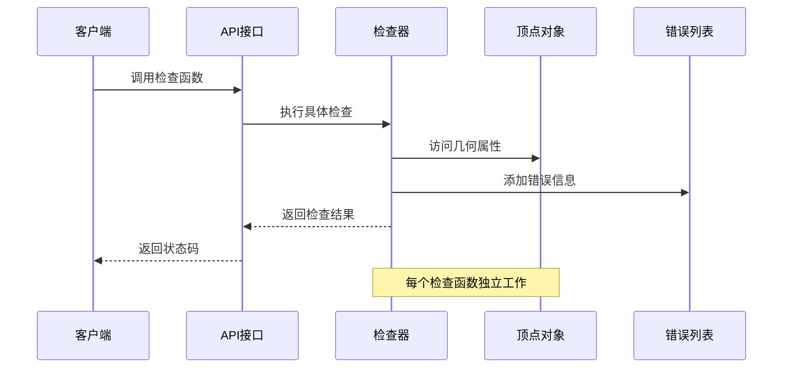
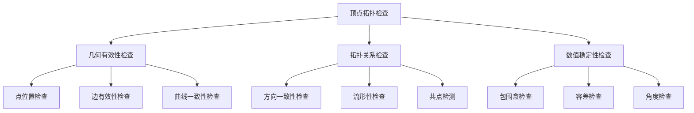
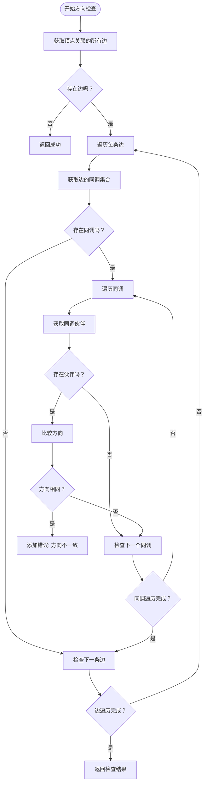
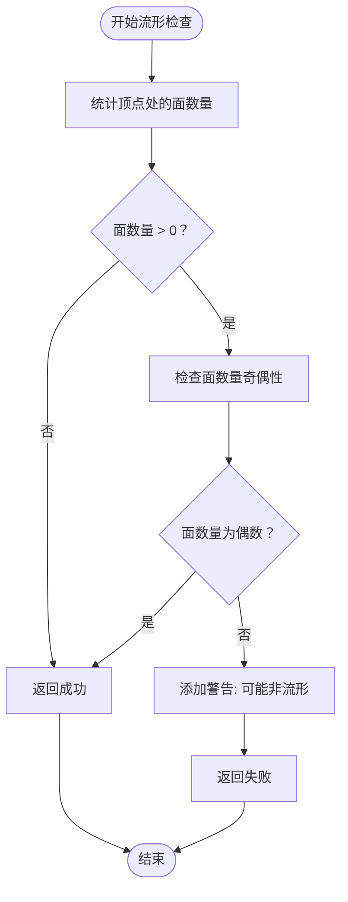
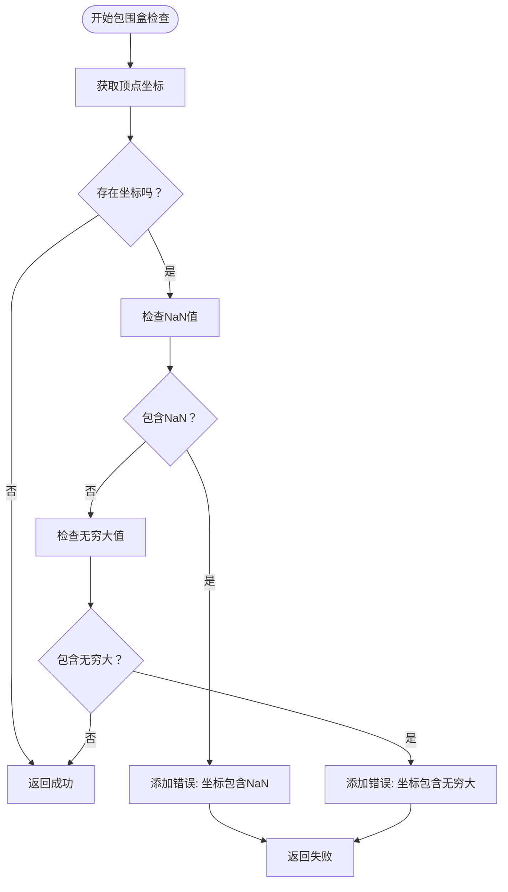
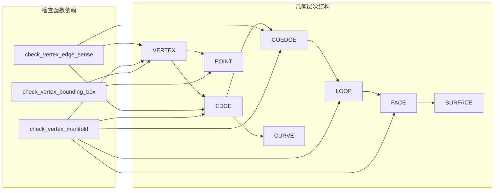

# 拓扑结构检查

<cite>
**本文档引用的文件**
- [check_vertex.hxx](file://include/check_vertex.hxx)
- [check_vertex.cxx](file://src/check_vertex.cxx)
- [check_edge.hxx](file://include/check_edge.hxx)
- [check_edge.cxx](file://src/check_edge.cxx)
</cite>

## 目录
1. [简介](#简介)
2. [项目结构](#项目结构)
3. [核心组件](#核心组件)
4. [架构概览](#架构概览)
5. [详细组件分析](#详细组件分析)
6. [依赖关系分析](#依赖关系分析)
7. [性能考虑](#性能考虑)
8. [故障排除指南](#故障排除指南)
9. [结论](#结论)

## 简介

本文档详细介绍了 VERTEX 检查模块中的拓扑结构相关检查函数。该模块专注于验证三维几何模型中顶点的拓扑正确性，确保几何实体满足基本的拓扑要求。重点涵盖三个核心检查函数：`check_vertex_edge_sense`（方向一致性检查）、`check_vertex_manifold`（流形检查）和 `check_vertex_bounding_box`（包围盒检查）。

这些检查函数基于 ACIS 几何内核，使用严格的数学算法来验证顶点与其关联边、面之间的拓扑关系。每个检查都返回详细的错误信息，帮助开发者识别和修复几何模型中的拓扑问题。

## 项目结构

VERTEXT 检查模块采用分层架构设计，主要包含以下组件：

**图表来源**
- [check_vertex.hxx:1-111](file://include/check_vertex.hxx#L1-L111)
- [check_vertex.cxx:1-714](file://src/check_vertex.cxx#L1-L714)

**章节来源**
- [check_vertex.hxx:1-111](file://include/check_vertex.hxx#L1-L111)
- [check_vertex.cxx:1-714](file://src/check_vertex.cxx#L1-L714)

## 核心组件

### 检查状态枚举

系统定义了完整的检查状态枚举，用于标识不同类型的拓扑问题：

**图表来源**
- [check_vertex.hxx:9-23](file://include/check_vertex.hxx#L9-L23)

### 检查结果类

`vertex_check_result` 类提供了统一的结果管理机制：

**图表来源**
- [check_vertex.hxx:25-47](file://include/check_vertex.hxx#L25-L47)

**章节来源**
- [check_vertex.hxx:9-47](file://include/check_vertex.hxx#L9-L47)

## 架构概览

### 整体检查流程

系统采用分层检查架构，每个检查函数独立执行特定的拓扑验证任务：

**图表来源**
- [check_vertex.cxx:59-137](file://src/check_vertex.cxx#L59-L137)
- [check_vertex.cxx:611-713](file://src/check_vertex.cxx#L611-L713)

### 拓扑检查层次结构

**图表来源**
- [check_vertex.cxx:139-713](file://src/check_vertex.cxx#L139-L713)

## 详细组件分析

### 方向一致性检查 (check_vertex_edge_sense)

#### 概念基础

方向一致性检查验证顶点处相邻边的同调方向是否正确。在拓扑学中，同调（coedge）是边与环的组合，它携带了方向信息。

**图表来源**
- [check_vertex.cxx:339-374](file://src/check_vertex.cxx#L339-L374)

#### 实现细节

该检查函数通过以下步骤验证方向一致性：

1. **遍历顶点关联的边**：从第一个边开始，循环访问所有关联边
2. **检查同调方向**：对每条边的同调进行遍历
3. **比较同调伙伴**：验证同调与其伙伴的方向是否相反
4. **记录错误**：发现方向不一致时添加详细错误信息

#### 边界条件处理

- **空顶点检查**：如果顶点为空或没有关联边，直接返回成功
- **同调完整性**：确保每个同调都有对应的伙伴
- **方向比较精度**：使用适当的容差值进行浮点数比较

**章节来源**
- [check_vertex.cxx:339-374](file://src/check_vertex.cxx#L339-L374)

### 流形检查 (check_vertex_manifold)

#### 概念基础

流形性检查验证顶点是否满足流形条件。在二维流形中，每个点都有一个邻域同胚于平面；在三维空间中，流形条件要求顶点处的面数量具有特定的拓扑性质。

**图表来源**
- [check_vertex.cxx:376-413](file://src/check_vertex.cxx#L376-L413)

#### 实现算法

流形检查的核心算法基于以下原理：

1. **面计数**：遍历顶点关联的所有同调，统计参与的面数量
2. **奇偶性验证**：检查面数量是否为偶数
3. **非流形识别**：奇数面数量通常表示非流形拓扑

#### 数学理论支持

- **欧拉特征数**：对于流形表面，顶点、边、面的数量满足特定关系
- **局部拓扑性质**：顶点处的拓扑结构必须保持局部球面性质
- **边界条件**：考虑有边界和无边界的流形差异

**章节来源**
- [check_vertex.cxx:376-413](file://src/check_vertex.cxx#L376-L413)

### 包围盒检查 (check_vertex_bounding_box)

#### 概念基础

包围盒检查验证顶点坐标的数值稳定性，确保几何坐标在合理的数值范围内。

**图表来源**
- [check_vertex.cxx:415-447](file://src/check_vertex.cxx#L415-L447)

#### 实现策略

包围盒检查采用严格的数据质量控制：

1. **坐标提取**：从顶点点对象获取三维坐标
2. **数值验证**：检查每个坐标分量的有效性
3. **异常检测**：识别数值异常情况

#### 数值稳定性考虑

- **浮点数精度**：使用适当的精度阈值进行比较
- **溢出保护**：防止坐标值过大导致的计算问题
- **数据类型安全**：确保坐标数据的类型正确性

**章节来源**
- [check_vertex.cxx:415-447](file://src/check_vertex.cxx#L415-L447)

## 依赖关系分析

### 几何实体依赖关系

**图表来源**
- [check_vertex.cxx:1-13](file://src/check_vertex.cxx#L1-L13)
- [check_vertex.cxx:339-447](file://src/check_vertex.cxx#L339-L447)

### 外部依赖

系统依赖于以下外部组件：

- **ACIS 几何内核**：提供几何实体的底层实现
- **数学库**：支持向量运算和数值计算
- **内存管理**：错误信息的动态分配和释放

**章节来源**
- [check_vertex.cxx:1-13](file://src/check_vertex.cxx#L1-L13)

## 性能考虑

### 时间复杂度分析

| 检查函数 | 时间复杂度 | 空间复杂度 | 说明 |
|---------|-----------|-----------|------|
| check_vertex_edge_sense | O(E × C) | O(1) | E为边数，C为平均同调数 |
| check_vertex_manifold | O(F) | O(1) | F为面数 |
| check_vertex_bounding_box | O(1) | O(1) | 常数时间检查 |

### 优化策略

1. **早期退出**：在发现错误时立即停止不必要的计算
2. **缓存机制**：复用已计算的几何属性
3. **批量处理**：对多个顶点进行批处理检查

## 故障排除指南

### 常见拓扑问题诊断

#### 方向不一致问题

**症状**：
- 检测到 `VTX_CHECK_EDGE_SENSE_MISMATCH` 状态
- 同调方向与预期不符

**诊断方法**：
1. 使用 `get_insanity_list()` 获取详细错误信息
2. 检查相关边的 `start()` 和 `end()` 方法
3. 验证 `coedge()->partner()` 的方向设置

#### 非流形问题

**症状**：
- 检测到 `VTX_CHECK_NON_MANIFOLD` 警告
- 面数量为奇数

**诊断方法**：
1. 统计顶点关联的面数量
2. 检查面的法向量一致性
3. 验证拓扑连接性

#### 数值不稳定问题

**症状**：
- 检测到 `VTX_CHECK_BAD_BOUNDING_BOX` 错误
- 坐标包含 NaN 或无穷大

**诊断方法**：
1. 检查坐标数据类型
2. 验证数值范围
3. 检查几何变换矩阵

**章节来源**
- [check_vertex.hxx:9-23](file://include/check_vertex.hxx#L9-L23)
- [check_vertex.cxx:91-134](file://src/check_vertex.cxx#L91-L134)

## 结论

VERTEX 检查模块提供了全面的拓扑结构验证功能，通过三个核心检查函数确保几何模型的质量：

1. **方向一致性检查**：保证拓扑结构的定向正确性
2. **流形检查**：验证拓扑结构的基本性质
3. **包围盒检查**：确保数值计算的稳定性

这些检查函数采用严格的数学算法和完善的错误处理机制，为三维几何建模提供了可靠的拓扑质量保障。通过理解这些检查的工作原理和实现细节，开发者可以更好地诊断和解决几何模型中的拓扑问题。