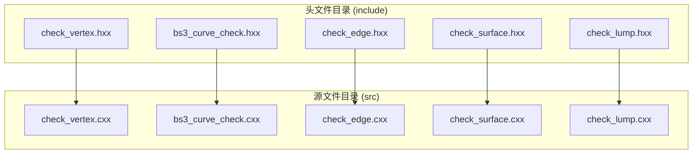
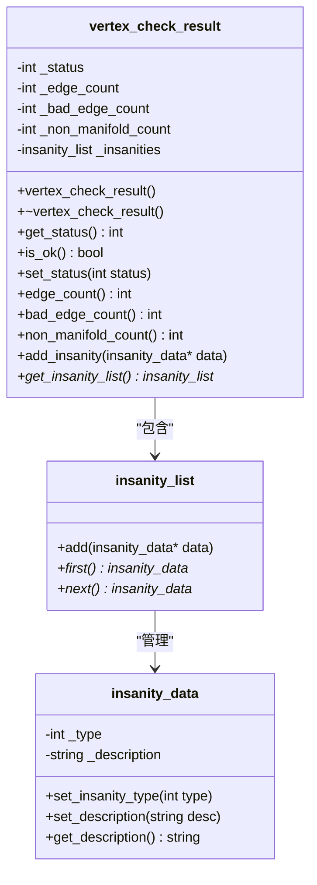
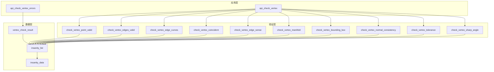
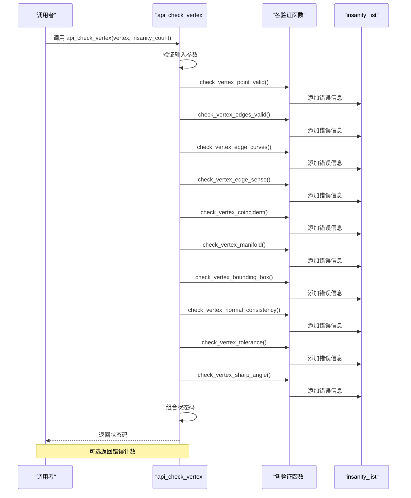
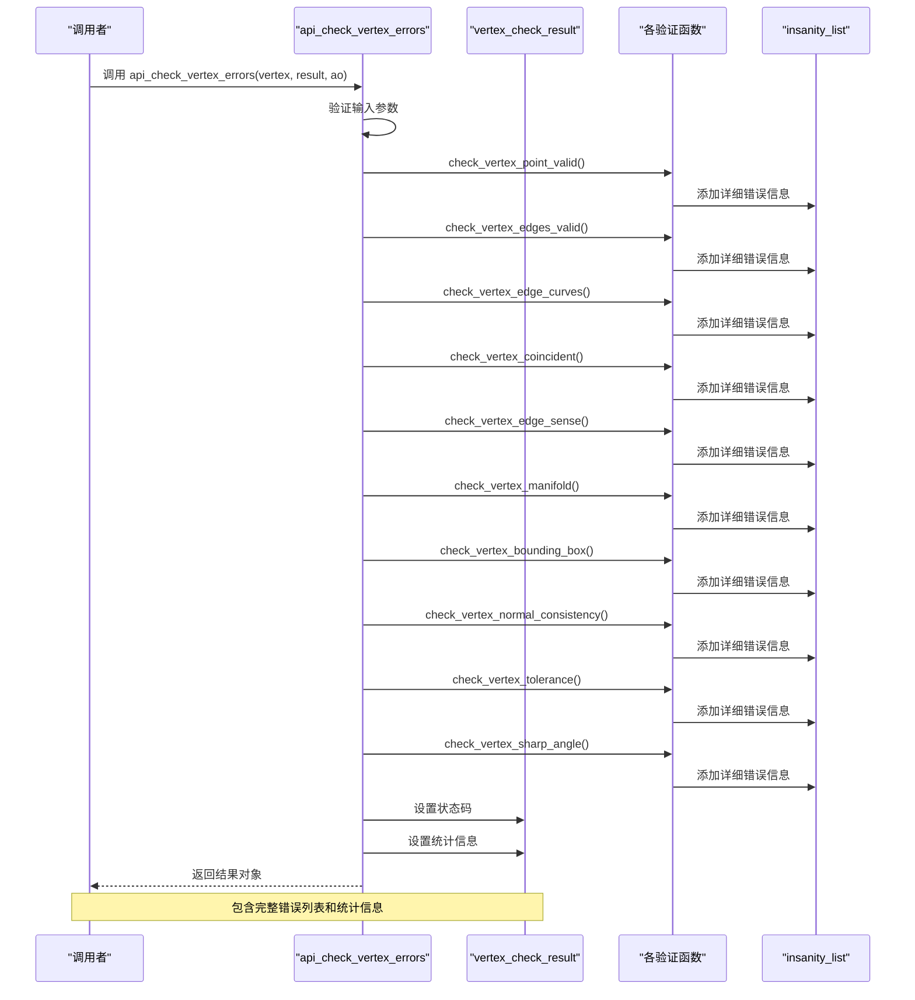
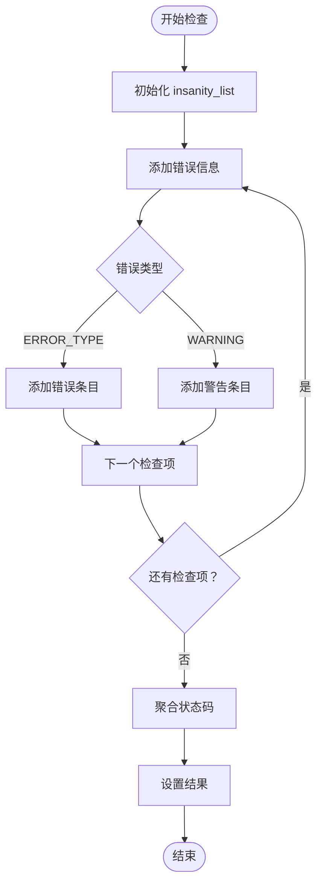
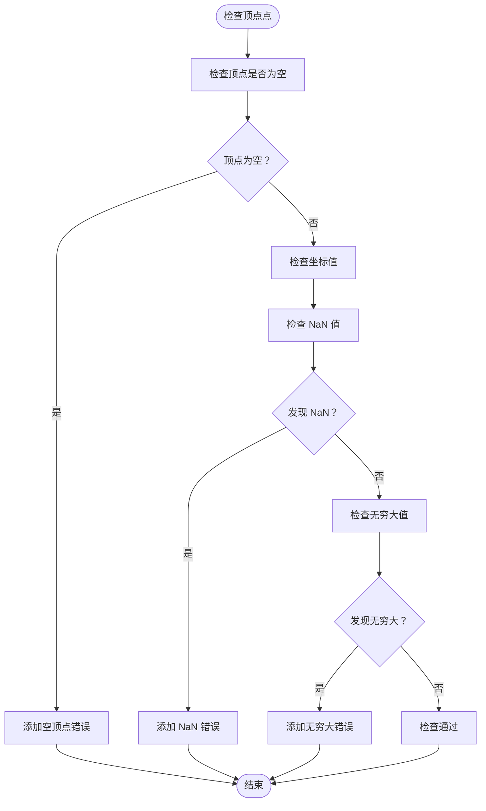
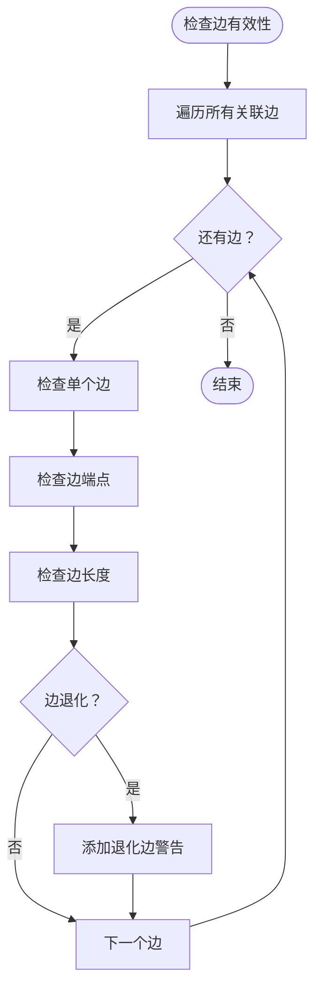
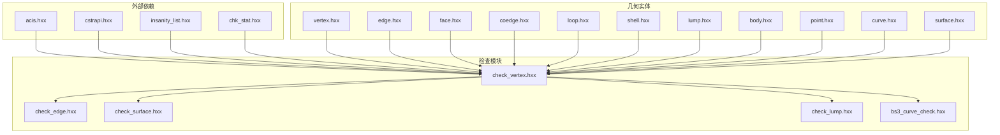

# 检查结果处理

<cite>
**本文档引用的文件**
- [check_vertex.hxx](file://include/check_vertex.hxx)
- [check_vertex.cxx](file://src/check_vertex.cxx)
- [bs3_curve_check.hxx](file://include/bs3_curve_check.hxx)
- [bs3_curve_check.cxx](file://src/bs3_curve_check.cxx)
- [check_edge.hxx](file://include/check_edge.hxx)
- [check_surface.hxx](file://include/check_surface.hxx)
- [check_lump.hxx](file://include/check_lump.hxx)
</cite>

## 目录
1. [简介](#简介)
2. [项目结构](#项目结构)
3. [核心组件](#核心组件)
4. [架构概览](#架构概览)
5. [详细组件分析](#详细组件分析)
6. [依赖关系分析](#依赖关系分析)
7. [性能考虑](#性能考虑)
8. [故障排除指南](#故障排除指南)
9. [结论](#结论)

## 简介

本文档专注于 VERTEX 检查模块的结果处理和接口使用，详细介绍两个关键接口：
- `api_check_vertex`（快速检测接口，返回状态码的简洁版本）
- `api_check_vertex_errors`（详细诊断接口，返回完整检查结果和错误列表）

文档涵盖了 `vertex_check_result` 类的使用方法、错误状态码的含义、`insanity_list` 的错误收集机制，以及 `api_check_vertex` 的参数配置。同时提供了完整的使用示例、错误处理策略和性能优化建议。

## 项目结构

VERTEXT 检查模块位于 Interface 项目的 `include` 和 `src` 目录中，采用标准的头文件声明与实现分离的组织方式：

**图表来源**
- [check_vertex.hxx:1-111](file://include/check_vertex.hxx#L1-L111)
- [check_vertex.cxx:1-714](file://src/check_vertex.cxx#L1-L714)

**章节来源**
- [check_vertex.hxx:1-111](file://include/check_vertex.hxx#L1-L111)
- [check_vertex.cxx:1-714](file://src/check_vertex.cxx#L1-L714)

## 核心组件

### vertex_check_result 类

`vertex_check_result` 是 VERTEX 检查的核心结果类，负责存储和管理检查结果：

**图表来源**
- [check_vertex.hxx:25-47](file://include/check_vertex.hxx#L25-L47)

### 错误状态码枚举

VERTEX 检查定义了完整的错误状态码体系，采用位掩码方式避免冲突：

| 状态码 | 值 | 含义 |
|--------|----|------|
| VTX_CHECK_OK | 0 | 检查通过，无错误 |
| VTX_CHECK_NULL_POINT | 1 << 0 | 顶点为空或点几何为空 |
| VTX_CHECK_NO_EDGES | 1 << 1 | 顶点没有关联边 |
| VTX_CHECK_DEGENERATE_EDGE | 1 << 2 | 边退化（长度为零） |
| VTX_CHECK_BAD_EDGE_CURVE | 1 << 3 | 边曲线无效 |
| VTX_CHECK_EDGE_SENSE_MISMATCH | 1 << 4 | 边方向不匹配 |
| VTX_CHECK_NON_MANIFOLD | 1 << 5 | 非流形顶点 |
| VTX_CHECK_COINCIDENT_VERTICES | 1 << 6 | 重合顶点 |
| VTX_CHECK_POINT_NOT_ON_CURVE | 1 << 7 | 顶点不在曲线上 |
| VTX_CHECK_BAD_BOUNDING_BOX | 1 << 8 | 包围盒无效 |
| VTX_CHECK_BAD_NORMAL_CONSISTENCY | 1 << 9 | 法向量一致性错误 |
| VTX_CHECK_BAD_TOLERANCE | 1 << 10 | 容差值无效 |
| VTX_CHECK_SHARP_ANGLE | 1 << 11 | 锐角问题 |

**章节来源**
- [check_vertex.hxx:9-23](file://include/check_vertex.hxx#L9-L23)

## 架构概览

VERTEXT 检查模块采用分层架构设计，从底层几何验证到高层结果聚合：

**图表来源**
- [check_vertex.cxx:59-137](file://src/check_vertex.cxx#L59-L137)
- [check_vertex.hxx:49-103](file://include/check_vertex.hxx#L49-L103)

## 详细组件分析

### 快速检测接口：api_check_vertex

`api_check_vertex` 提供简洁的快速检测功能，返回单一状态码：

**图表来源**
- [check_vertex.cxx:611-713](file://src/check_vertex.cxx#L611-L713)

#### 参数配置

| 参数 | 类型 | 描述 | 默认值 |
|------|------|------|--------|
| vertex | VERTEX* | 要检查的顶点指针 | 必需 |
| insanity_count | int* | 指向错误计数的指针 | NULL |

#### 返回值说明

- **VTX_CHECK_OK (0)**: 所有检查通过
- **组合状态码**: 通过按位或操作组合多个错误类型

**章节来源**
- [check_vertex.cxx:611-713](file://src/check_vertex.cxx#L611-L713)

### 详细诊断接口：api_check_vertex_errors

`api_check_vertex_errors` 提供完整的诊断信息，返回详细的检查结果：

**图表来源**
- [check_vertex.cxx:59-137](file://src/check_vertex.cxx#L59-L137)

#### 参数配置

| 参数 | 类型 | 描述 | 默认值 |
|------|------|------|--------|
| vertex | VERTEX* | 要检查的顶点指针 | 必需 |
| result | vertex_check_result& | 结果对象引用 | 必需 |
| ao | AcisOptions* | ACIS选项指针 | NULL |

**章节来源**
- [check_vertex.cxx:59-137](file://src/check_vertex.cxx#L59-L137)

### 错误收集机制：insanity_list

`insanity_list` 是错误信息的集中管理器，提供链表式的数据结构：

**图表来源**
- [check_vertex.cxx:49-57](file://src/check_vertex.cxx#L49-L57)

#### 错误类型分类

| 类型 | 值 | 描述 |
|------|----|------|
| ERROR_TYPE | 1 | 严重错误，影响几何有效性 |
| WARNING | 2 | 警告信息，可能影响质量但不影响有效性 |

**章节来源**
- [check_vertex.cxx:49-57](file://src/check_vertex.cxx#L49-L57)

### 具体验证函数分析

#### 顶点点有效性检查

验证顶点几何的有效性，包括空指针检查和坐标有效性：

**图表来源**
- [check_vertex.cxx:139-171](file://src/check_vertex.cxx#L139-L171)

#### 边有效性检查

验证顶点关联边的有效性，包括边的存在性和退化情况：

**图表来源**
- [check_vertex.cxx:173-230](file://src/check_vertex.cxx#L173-L230)

## 依赖关系分析

VERTEXT 检查模块具有清晰的依赖层次结构：

**图表来源**
- [check_vertex.hxx:4-7](file://include/check_vertex.hxx#L4-L7)
- [check_vertex.cxx:1-14](file://src/check_vertex.cxx#L1-L14)

**章节来源**
- [check_vertex.hxx:4-7](file://include/check_vertex.hxx#L4-L7)
- [check_vertex.cxx:1-14](file://src/check_vertex.cxx#L1-L14)

## 性能考虑

### 时间复杂度分析

| 检查函数 | 时间复杂度 | 空间复杂度 | 说明 |
|----------|------------|------------|------|
| check_vertex_point_valid | O(1) | O(1) | 常数时间检查 |
| check_vertex_edges_valid | O(n) | O(1) | n为关联边数量 |
| check_vertex_edge_curves | O(n) | O(1) | n为关联边数量 |
| check_vertex_coincident | O(n) | O(1) | n为关联边数量 |
| check_vertex_edge_sense | O(n) | O(1) | n为关联边数量 |
| check_vertex_manifold | O(n) | O(1) | n为关联边数量 |
| check_vertex_bounding_box | O(1) | O(1) | 常数时间检查 |
| check_vertex_normal_consistency | O(n) | O(1) | n为关联边数量 |
| check_vertex_tolerance | O(1) | O(1) | 常数时间检查 |
| check_vertex_sharp_angle | O(n²) | O(n²) | n为关联边数量，需要二维数组 |

### 内存管理优化

1. **智能指针使用**: 在可能的情况下使用智能指针管理动态分配的 `insanity_data` 对象
2. **内存池**: 对于大量重复的检查操作，考虑使用内存池减少分配开销
3. **延迟计算**: 将昂贵的计算（如角度计算）延迟到必要时执行

### 并行处理建议

对于大规模几何模型，可以考虑：
- 使用多线程并行检查不同类型的几何实体
- 实现批处理机制，一次性处理多个顶点
- 利用SIMD指令加速向量运算

## 故障排除指南

### 常见错误类型及解决方案

#### 空指针错误 (VTX_CHECK_NULL_POINT)

**症状**: 检测到 `VTX_CHECK_NULL_POINT` 状态码
**原因**: 传入的顶点指针为空或顶点的几何信息为空
**解决方案**:
1. 验证输入参数的有效性
2. 检查几何模型的完整性
3. 确保在调用检查前正确初始化几何对象

#### 退化边错误 (VTX_CHECK_DEGENERATE_EDGE)

**症状**: 检测到 `VTX_CHECK_DEGENERATE_EDGE` 状态码
**原因**: 边的长度小于容差阈值
**解决方案**:
1. 检查边的端点坐标精度
2. 调整几何模型的容差设置
3. 重新构造退化的边

#### 非流形顶点 (VTX_CHECK_NON_MANIFOLD)

**症状**: 检测到 `VTX_CHECK_NON_MANIFOLD` 状态码
**原因**: 顶点关联的面数量为奇数
**解决方案**:
1. 检查拓扑连接关系
2. 修复面的定向问题
3. 重新构建几何模型

### 调试技巧

1. **启用详细日志**: 使用 `api_check_vertex_errors` 获取完整的错误列表
2. **分步检查**: 逐个调用具体的验证函数定位问题
3. **可视化调试**: 结合几何可视化工具检查问题区域

**章节来源**
- [check_vertex.cxx:139-171](file://src/check_vertex.cxx#L139-L171)
- [check_vertex.cxx:173-230](file://src/check_vertex.cxx#L173-L230)

## 结论

VERTEX 检查模块提供了完整的几何验证解决方案，通过 `api_check_vertex` 和 `api_check_vertex_errors` 两个接口满足不同的使用场景需求。模块采用清晰的分层架构，具有良好的扩展性和维护性。

关键优势：
- **双接口设计**: 同时支持快速检测和详细诊断
- **完整的错误分类**: 清晰的状态码体系便于问题定位
- **灵活的结果管理**: `vertex_check_result` 提供丰富的统计信息
- **可扩展性**: 易于添加新的检查规则和验证逻辑

推荐使用场景：
- **生产环境**: 使用 `api_check_vertex` 进行快速质量检查
- **开发调试**: 使用 `api_check_vertex_errors` 获取详细诊断信息
- **批量处理**: 结合批处理机制进行大规模几何验证