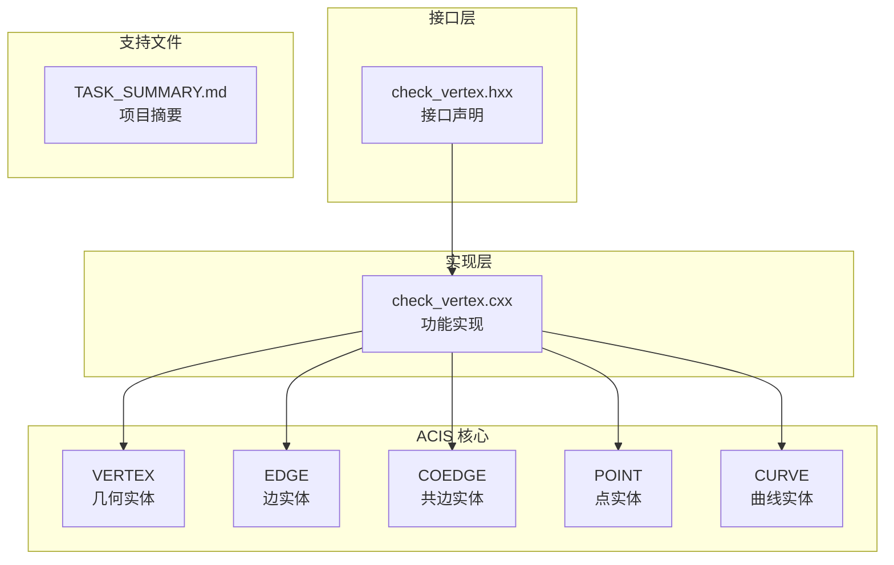
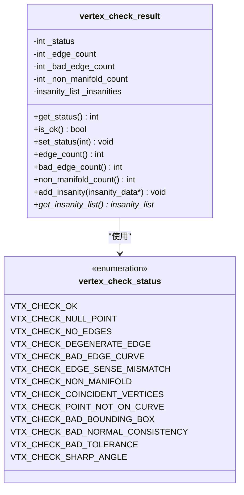
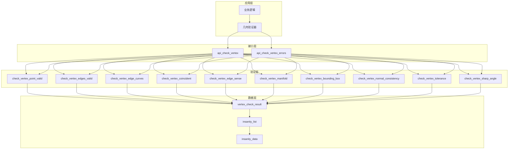
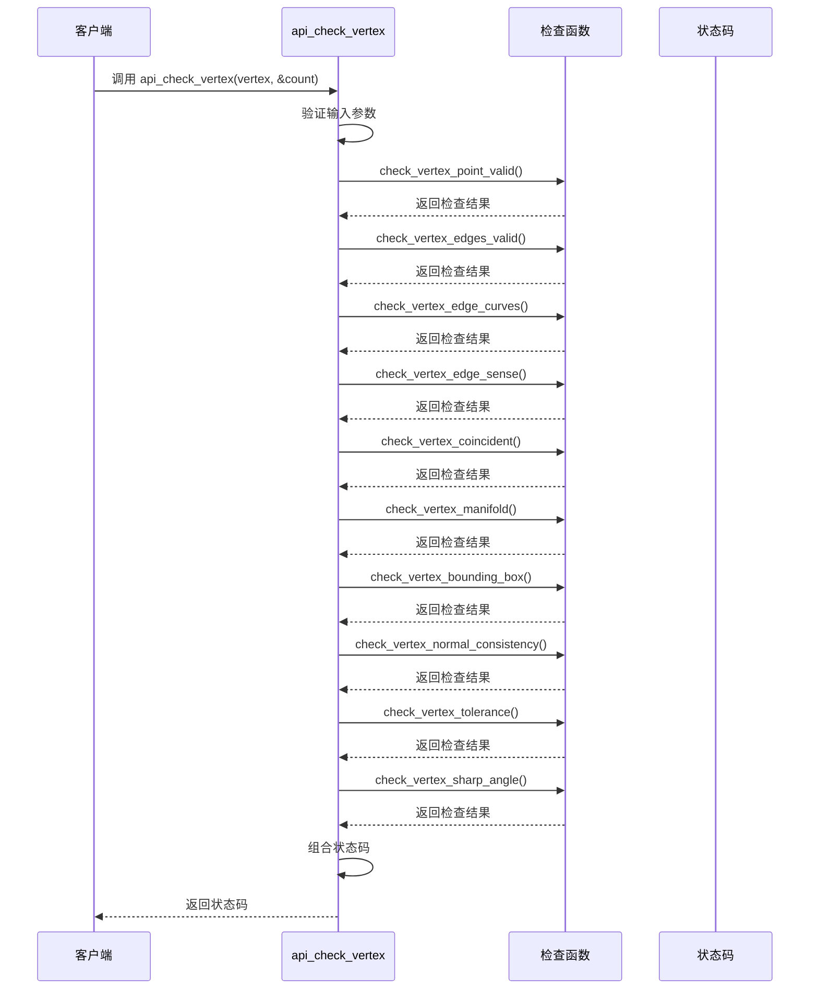
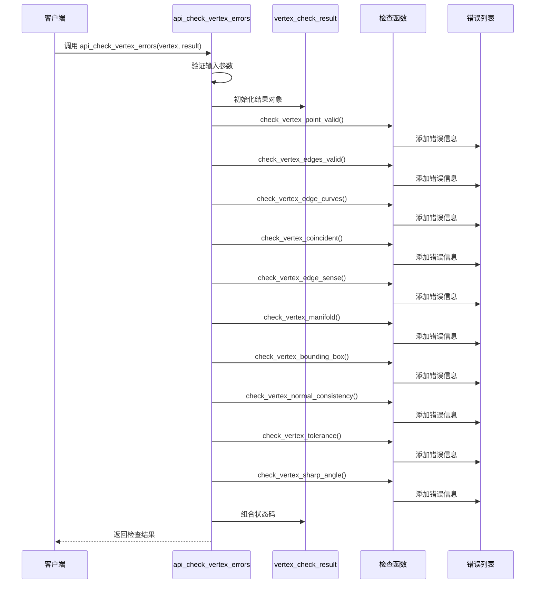
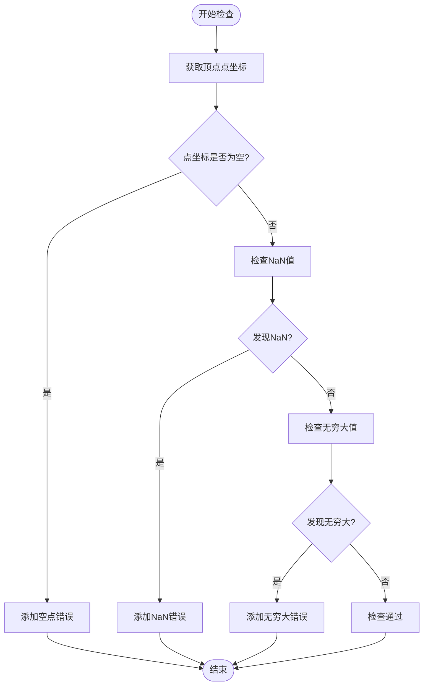
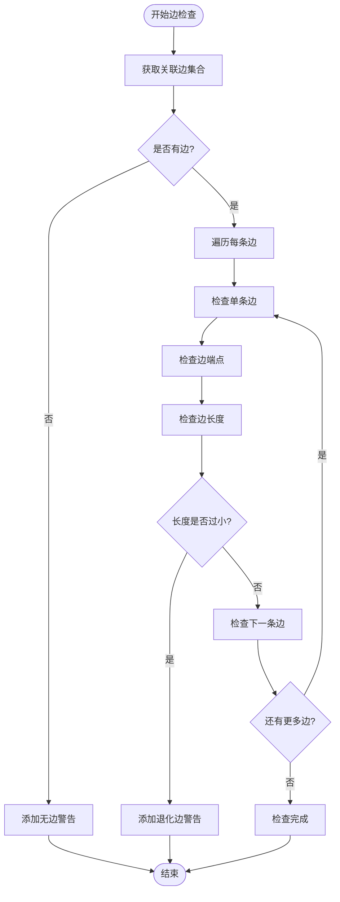
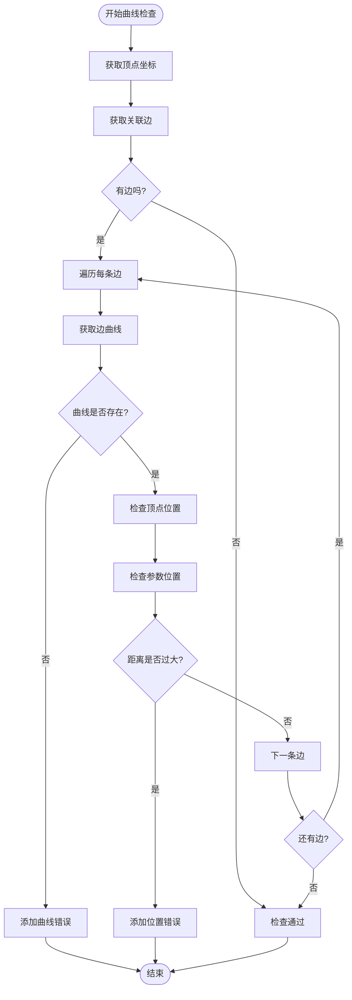
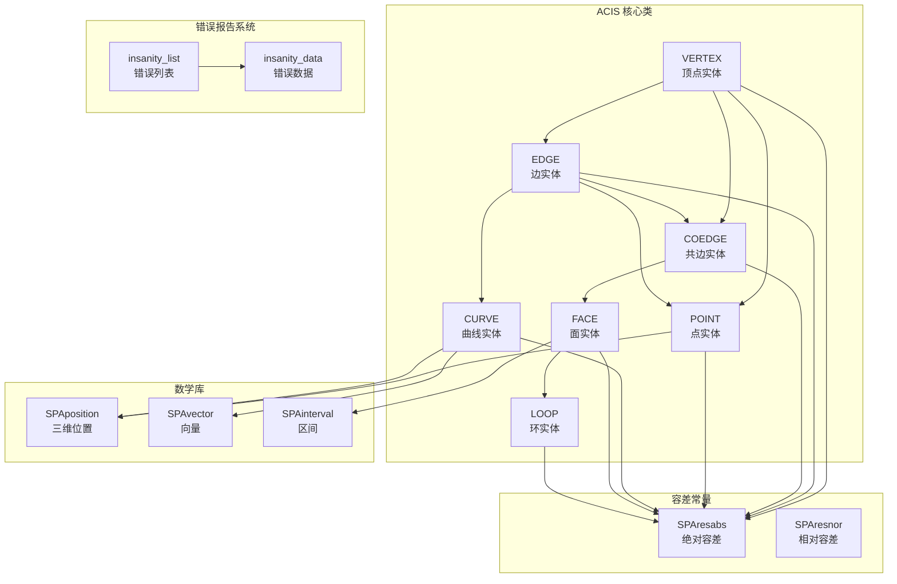

# VERTEX 检查接口

<cite>
**本文档引用的文件**
- [check_vertex.hxx](file://include/check_vertex.hxx)
- [check_vertex.cxx](file://src/check_vertex.cxx)
- [TASK_SUMMARY.md](file://TASK_SUMMARY.md)
</cite>

## 目录
1. [简介](#简介)
2. [项目结构](#项目结构)
3. [核心组件](#核心组件)
4. [架构概览](#架构概览)
5. [详细组件分析](#详细组件分析)
6. [依赖关系分析](#依赖关系分析)
7. [性能考虑](#性能考虑)
8. [故障排除指南](#故障排除指南)
9. [结论](#结论)

## 简介

VERTEX 检查接口是 ACIS 几何内核中的重要组成部分，专门用于验证几何实体 VERTEX 的完整性和有效性。该接口提供了两种检查模式：快速检测模式和详细诊断模式，能够全面评估顶点的拓扑连接性、几何有效性、数值稳定性等多个维度。

本接口实现了对 VERTEX 实体的全方位检查，包括点坐标有效性、边连接性、曲面一致性、容差设置等多个方面的验证，为 CAD/CAM 应用程序提供了可靠的几何质量保证机制。

## 项目结构

VERTE 检查接口采用模块化设计，遵循 ACIS 内核的标准架构模式：



**图表来源**
- [check_vertex.hxx:1-111](file://include/check_vertex.hxx#L1-L111)
- [check_vertex.cxx:1-714](file://src/check_vertex.cxx#L1-L714)

**章节来源**
- [check_vertex.hxx:1-111](file://include/check_vertex.hxx#L1-L111)
- [check_vertex.cxx:1-714](file://src/check_vertex.cxx#L1-L714)
- [TASK_SUMMARY.md:1-306](file://TASK_SUMMARY.md#L1-L306)

## 核心组件

### VERTEX 检查状态枚举

VERTEX 检查接口定义了完整的状态枚举体系，用于标识不同类型的检查结果：



**图表来源**
- [check_vertex.hxx:9-47](file://include/check_vertex.hxx#L9-L47)

### 主要接口函数

接口提供了两个核心函数，分别对应不同的使用场景：

1. **快速检测接口** (`api_check_vertex`)
2. **详细诊断接口** (`api_check_vertex_errors`)

**章节来源**
- [check_vertex.hxx:49-108](file://include/check_vertex.hxx#L49-L108)
- [check_vertex.cxx:59-137](file://src/check_vertex.cxx#L59-L137)
- [check_vertex.cxx:611-713](file://src/check_vertex.cxx#L611-L713)

## 架构概览

VERTEX 检查接口采用了分层架构设计，确保了良好的可维护性和扩展性：



**图表来源**
- [check_vertex.hxx:25-108](file://include/check_vertex.hxx#L25-L108)
- [check_vertex.cxx:15-713](file://src/check_vertex.cxx#L15-L713)

## 详细组件分析

### 快速检测接口 (api_check_vertex)

快速检测接口提供了简洁高效的检查方式，适合在性能敏感的应用场景中使用：

#### 接口定义与参数



**图表来源**
- [check_vertex.cxx:611-713](file://src/check_vertex.cxx#L611-L713)

#### 使用示例

```c
// 基本使用方式
int status = api_check_vertex(vertex, &insanity_count);
if (status == VTX_CHECK_OK) {
    printf("顶点检查通过\n");
} else {
    if (status & VTX_CHECK_NULL_POINT) {
        printf("顶点点坐标为空\n");
    }
    if (status & VTX_CHECK_NO_EDGES) {
        printf("顶点没有关联边\n");
    }
    if (status & VTX_CHECK_DEGENERATE_EDGE) {
        printf("存在退化边\n");
    }
    // ... 其他状态检查
}
```

**章节来源**
- [check_vertex.cxx:611-713](file://src/check_vertex.cxx#L611-L713)

### 详细诊断接口 (api_check_vertex_errors)

详细诊断接口提供了完整的错误报告机制，适合调试和问题定位场景：

#### 接口定义与参数



**图表来源**
- [check_vertex.cxx:59-137](file://src/check_vertex.cxx#L59-L137)

#### 使用示例

```c
// 详细诊断使用方式
vertex_check_result result;
outcome res = api_check_vertex_errors(vertex, result);

if (!result.is_ok()) {
    printf("检查发现 %d 个问题\n", result.bad_edge_count());
    
    insanity_list *ilist = result.get_insanity_list();
    insanity_data *entry = ilist->first();
    
    while (entry) {
        printf("错误类型: %s\n", entry->get_description());
        entry = entry->next();
    }
} else {
    printf("顶点检查完全通过\n");
}
```

**章节来源**
- [check_vertex.cxx:59-137](file://src/check_vertex.cxx#L59-L137)

### 检查函数详解

#### 点有效性检查 (check_vertex_point_valid)

验证顶点的几何点是否有效，包括空指针检查和数值有效性检查：



**图表来源**
- [check_vertex.cxx:139-171](file://src/check_vertex.cxx#L139-L171)

#### 边有效性检查 (check_vertex_edges_valid)

验证与顶点关联的所有边的有效性：



**图表来源**
- [check_vertex.cxx:173-230](file://src/check_vertex.cxx#L173-L230)

#### 曲线一致性检查 (check_vertex_edge_curves)

验证顶点在边曲线上的位置正确性：



**图表来源**
- [check_vertex.cxx:232-288](file://src/check_vertex.cxx#L232-L288)

**章节来源**
- [check_vertex.cxx:139-609](file://src/check_vertex.cxx#L139-L609)

## 依赖关系分析

VERTEX 检查接口依赖于 ACIS 内核的核心类和数据结构：



**图表来源**
- [check_vertex.cxx:1-14](file://src/check_vertex.cxx#L1-L14)

### 关键依赖说明

1. **几何实体依赖**：接口直接依赖 ACIS 的核心几何实体类
2. **数学运算依赖**：使用 SPA 数学库进行几何计算
3. **错误报告依赖**：通过 insanity_list 和 insanity_data 提供详细的错误信息
4. **容差控制依赖**：使用 SPAresabs 等容差常量进行数值比较

**章节来源**
- [check_vertex.hxx:4-8](file://include/check_vertex.hxx#L4-L8)
- [check_vertex.cxx:1-14](file://src/check_vertex.cxx#L1-L14)

## 性能考虑

### 时间复杂度分析

VERTEX 检查接口的时间复杂度主要取决于与顶点关联的边的数量：

- **点有效性检查**：O(1)
- **边有效性检查**：O(n)，其中 n 为关联边的数量
- **曲线一致性检查**：O(n)，其中 n 为关联边的数量
- **整体复杂度**：O(n)，n 为关联边数量

### 空间复杂度分析

- **快速检测模式**：O(1)，仅使用基本数据类型
- **详细诊断模式**：O(m)，其中 m 为发现的问题数量

### 性能优化建议

1. **批量检查**：对于大量顶点的场景，建议使用快速检测模式以减少内存分配
2. **条件检查**：在可能的情况下，先进行简单的预检查以避免不必要的复杂计算
3. **缓存策略**：对于重复检查的顶点，可以考虑缓存检查结果
4. **并行处理**：在多线程环境中，可以并行检查独立的顶点集合

### 最佳实践

1. **选择合适的接口**：
   - 简单验证：使用 `api_check_vertex`
   - 详细诊断：使用 `api_check_vertex_errors`
   - 批量处理：优先考虑快速检测模式

2. **错误处理策略**：
   - 对于快速检测，使用位掩码检查特定问题
   - 对于详细诊断，遍历错误列表获取完整信息
   - 合理处理返回的 outcome 结果

3. **资源管理**：
   - 注意 `vertex_check_result` 对象的生命周期
   - 及时释放 `insanity_list` 中的错误数据
   - 避免内存泄漏

**章节来源**
- [check_vertex.cxx:611-713](file://src/check_vertex.cxx#L611-L713)
- [check_vertex.cxx:59-137](file://src/check_vertex.cxx#L59-L137)

## 故障排除指南

### 常见问题及解决方案

#### 顶点为空问题

**症状**：返回 `VTX_CHECK_NULL_POINT` 状态
**原因**：传入的 VERTEX 指针为空或不是有效的 VERTEX 类型
**解决方案**：
```c
if (!vertex || vertex->identity() != VERTEX_TYPE) {
    // 处理空指针或类型错误
    return VTX_CHECK_NULL_POINT;
}
```

#### 无关联边问题

**症状**：返回 `VTX_CHECK_NO_EDGES` 状态
**原因**：顶点没有关联任何边
**解决方案**：
- 检查模型的拓扑完整性
- 验证边的创建和连接过程
- 确保正确的拓扑构建流程

#### 退化边问题

**症状**：返回 `VTX_CHECK_DEGENERATE_EDGE` 状态
**原因**：边的长度过小，接近数值精度限制
**解决方案**：
- 检查几何建模过程中的精度设置
- 调整容差参数
- 重新构建有问题的几何

#### 曲线位置错误

**症状**：返回 `VTX_CHECK_POINT_NOT_ON_CURVE` 状态
**原因**：顶点位置与边曲线参数不匹配
**解决方案**：
- 检查曲线参数范围
- 验证参数映射的正确性
- 重新计算参数值

### 调试技巧

1. **启用详细诊断**：使用 `api_check_vertex_errors` 获取完整的错误信息
2. **逐步检查**：从简单检查开始，逐步进行复杂检查
3. **边界情况测试**：特别关注极端情况和边界条件
4. **日志记录**：记录检查过程中的关键信息以便分析

**章节来源**
- [check_vertex.cxx:139-609](file://src/check_vertex.cxx#L139-L609)

## 结论

VERTEX 检查接口为 ACIS 几何内核提供了完整的顶点验证能力。通过快速检测和详细诊断两种模式，开发者可以根据具体需求选择合适的检查方式。

### 主要优势

1. **完整性**：覆盖了顶点检查的所有重要方面
2. **灵活性**：提供多种检查模式满足不同需求
3. **可扩展性**：清晰的架构设计便于功能扩展
4. **性能友好**：优化的算法设计确保高效执行

### 应用建议

1. **开发阶段**：使用详细诊断模式进行全面的质量检查
2. **生产环境**：根据性能要求选择合适的检查模式
3. **批处理任务**：优先考虑快速检测模式以提高吞吐量
4. **实时应用**：使用快速检测模式确保响应时间

该接口的设计充分体现了 ACIS 内核的工程化理念，为 CAD/CAM 应用程序提供了可靠而高效的几何验证工具。