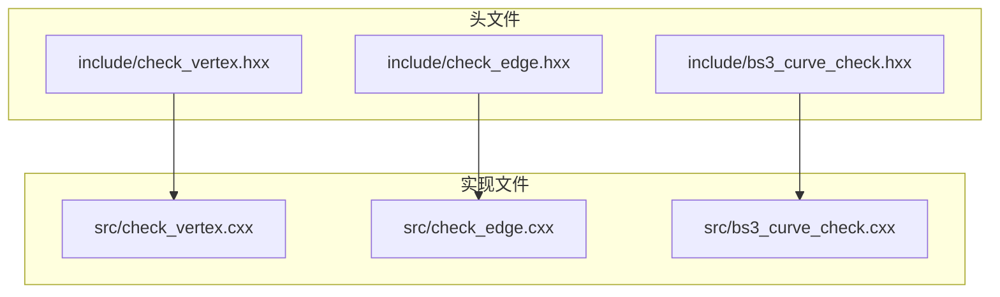
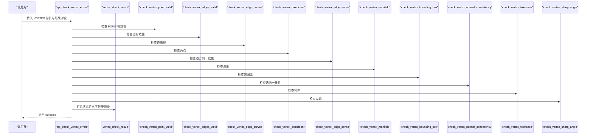
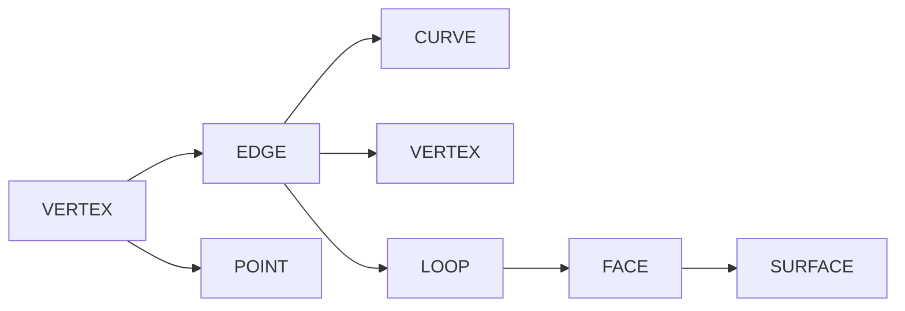

# VERTEX 检查模块

<cite>
**本文引用的文件列表**
- [check_vertex.hxx](file://include/check_vertex.hxx)
- [check_vertex.cxx](file://src/check_vertex.cxx)
- [check_edge.hxx](file://include/check_edge.hxx)
- [check_edge.cxx](file://src/check_edge.cxx)
- [bs3_curve_check.hxx](file://include/bs3_curve_check.hxx)
</cite>

## 目录
1. [简介](#简介)
2. [项目结构](#项目结构)
3. [核心组件](#核心组件)
4. [架构总览](#架构总览)
5. [详细组件分析](#详细组件分析)
6. [依赖关系分析](#依赖关系分析)
7. [性能考量](#性能考量)
8. [故障排查指南](#故障排查指南)
9. [结论](#结论)

## 简介
本技术文档面向 VERTEX 几何实体检查模块，系统性阐述 VERTEX 的 12 项子检查函数及其接口用法，涵盖：
- POINT 有效性检查
- 边有效性检查
- 边曲线检查
- 共点检查
- 方向一致性检查（边 sense）
- 流形检查
- 包围盒检查
- 法向一致性检查
- 容差检查
- 尖角检查

同时给出 VERTEX 检查状态枚举、错误处理策略与 API 使用示例路径，帮助开发者快速集成与排障。

## 项目结构
该模块位于 Interface 子目录中，采用“头文件声明 + 实现文件定义”的分层组织方式：
- 头文件：提供状态枚举、结果对象、检查函数原型与对外 API 声明
- 实现文件：提供各子检查函数的具体逻辑与对外 API 的组合调用

图表来源
- [check_vertex.hxx:1-111](file://include/check_vertex.hxx#L1-L111)
- [check_vertex.cxx:1-714](file://src/check_vertex.cxx#L1-L714)
- [check_edge.hxx:1-130](file://include/check_edge.hxx#L1-L130)
- [check_edge.cxx:1-890](file://src/check_edge.cxx#L1-L890)
- [bs3_curve_check.hxx:1-138](file://include/bs3_curve_check.hxx#L1-L138)

章节来源
- [check_vertex.hxx:1-111](file://include/check_vertex.hxx#L1-L111)
- [check_edge.hxx:1-130](file://include/check_edge.hxx#L1-L130)
- [bs3_curve_check.hxx:1-138](file://include/bs3_curve_check.hxx#L1-L138)

## 核心组件
- VERTEX 检查状态枚举：用于标识不同类型的检查失败或警告
- 结果封装类：vertex_check_result 提供状态、计数与不健康记录列表
- 对外 API：
  - api_check_vertex_errors：带详细不健康记录的结果式检查
  - api_check_vertex：简洁状态位组合的检查
- 子检查函数：按功能拆分为 12 个独立逻辑单元，分别覆盖几何与拓扑约束

章节来源
- [check_vertex.hxx:9-47](file://include/check_vertex.hxx#L9-L47)
- [check_vertex.cxx:15-713](file://src/check_vertex.cxx#L15-L713)

## 架构总览
VERTEX 检查的整体流程如下：
- 输入：VERTEX 指针
- 输出：状态位组合或详细结果对象
- 控制流：对外 API 调用各子检查函数，收集不健康记录，汇总为状态位

图表来源
- [check_vertex.cxx:59-137](file://src/check_vertex.cxx#L59-L137)

章节来源
- [check_vertex.cxx:59-137](file://src/check_vertex.cxx#L59-L137)

## 详细组件分析

### VERTEX 检查状态枚举与结果对象
- 状态位枚举：包含 OK、NULL_POINT、NO_EDGES、DEGENERATE_EDGE、BAD_EDGE_CURVE、EDGE_SENSE_MISMATCH、NON_MANIFOLD、COINCIDENT_VERTICES、POINT_NOT_ON_CURVE、BAD_BOUNDING_BOX、BAD_NORMAL_CONSISTENCY、BAD_TOLERANCE、SHARP_ANGLE
- 结果对象 vertex_check_result：
  - 提供状态查询、是否通过判断、统计信息（边总数、异常边数、非流形数量）
  - 维护不健康记录列表，支持追加与获取

章节来源
- [check_vertex.hxx:9-47](file://include/check_vertex.hxx#L9-L47)

### 对外 API 与使用示例
- api_check_vertex_errors
  - 参数：VERTEX 指针、结果对象、可选选项
  - 行为：依次调用 12 个子检查函数，将不健康描述映射到状态位，返回 outcome
  - 示例路径：[api_check_vertex_errors:59-137](file://src/check_vertex.cxx#L59-L137)
- api_check_vertex
  - 参数：VERTEX 指针、可选的不健康计数输出指针
  - 行为：调用 12 个子检查函数，统计不健康条目并汇总状态位
  - 示例路径：[api_check_vertex:611-713](file://src/check_vertex.cxx#L611-L713)

章节来源
- [check_vertex.cxx:59-137](file://src/check_vertex.cxx#L59-L137)
- [check_vertex.cxx:611-713](file://src/check_vertex.cxx#L611-L713)

### 子检查函数详解

#### 1) POINT 有效性检查
- 功能：验证 VERTEX 的 POINT 是否存在且坐标有效（非 NaN、非 Inf）
- 关键点：对 POINT 的位置进行数值校验；若无效则记录不健康
- 返回值：TRUE 表示通过；FALSE 表示失败
- 错误条件：POINT 为空、坐标含 NaN 或 Inf
- 示例路径：[check_vertex_point_valid:139-171](file://src/check_vertex.cxx#L139-L171)

章节来源
- [check_vertex.cxx:139-171](file://src/check_vertex.cxx#L139-L171)

#### 2) 边有效性检查
- 功能：遍历 VERTEX 的邻接边，检查每条边的端点与长度
- 关键点：边端点必须存在；边长应大于容差阈值；否则视为退化
- 返回值：TRUE 表示通过；FALSE 表示失败
- 错误条件：边端点为空、边退化（长度过小）
- 示例路径：[check_vertex_edges_valid:173-230](file://src/check_vertex.cxx#L173-L230)

章节来源
- [check_vertex.cxx:173-230](file://src/check_vertex.cxx#L173-L230)

#### 3) 边曲线检查
- 功能：验证 VERTEX 在其邻接边上的参数位置是否与曲线端点一致
- 关键点：比较顶点位置与曲线起止参数处的投影位置
- 返回值：TRUE 表示通过；FALSE 表示失败
- 错误条件：顶点不在曲线起止参数位置
- 示例路径：[check_vertex_edge_curves:232-288](file://src/check_vertex.cxx#L232-L288)

章节来源
- [check_vertex.cxx:232-288](file://src/check_vertex.cxx#L232-L288)

#### 4) 共点检查
- 功能：检测相邻边在端点处是否存在近似重合的其他顶点
- 关键点：计算两点间距离并与容差比较
- 返回值：TRUE 表示通过；FALSE 表示失败
- 错误条件：存在近似重合的顶点
- 示例路径：[check_vertex_coincident:290-337](file://src/check_vertex.cxx#L290-L337)

章节来源
- [check_vertex.cxx:290-337](file://src/check_vertex.cxx#L290-L337)

#### 5) 方向一致性检查（边 sense）
- 功能：检查同一边的 coedge 与其 partner 的 sense 是否一致
- 关键点：同边不同 coedge 的 sense 应相反
- 返回值：TRUE 表示通过；FALSE 表示失败
- 错误条件：coedge 与其 partner 的 sense 相同
- 示例路径：[check_vertex_edge_sense:339-374](file://src/check_vertex.cxx#L339-L374)

章节来源
- [check_vertex.cxx:339-374](file://src/check_vertex.cxx#L339-L374)

#### 6) 流形检查
- 功能：基于邻接面数判断顶点是否可能非流形
- 关键点：统计围绕顶点的面数；奇数面可能指示非流形
- 返回值：TRUE 表示通过；FALSE 表示失败
- 错误条件：面数为奇数且大于 0
- 示例路径：[check_vertex_manifold:376-413](file://src/check_vertex.cxx#L376-L413)

章节来源
- [check_vertex.cxx:376-413](file://src/check_vertex.cxx#L376-L413)

#### 7) 包围盒检查
- 功能：验证顶点坐标是否在有效范围内（非 NaN、非 Inf）
- 关键点：直接对坐标进行数值检查
- 返回值：TRUE 表示通过；FALSE 表示失败
- 错误条件：坐标含 NaN 或 Inf
- 示例路径：[check_vertex_bounding_box:415-447](file://src/check_vertex.cxx#L415-L447)

章节来源
- [check_vertex.cxx:415-447](file://src/check_vertex.cxx#L415-L447)

#### 8) 法向一致性检查
- 功能：统计与顶点关联的有效面法向数量，保留占位以备后续一致性判定
- 关键点：当前实现仅统计面法向数量，未完成具体一致性计算
- 返回值：TRUE 表示通过；FALSE 表示失败
- 错误条件：无特定错误条件（当前实现未完成）
- 示例路径：[check_vertex_normal_consistency:449-513](file://src/check_vertex.cxx#L449-L513)

章节来源
- [check_vertex.cxx:449-513](file://src/check_vertex.cxx#L449-L513)

#### 9) 容差检查
- 功能：检查 VERTEX 的容差是否合理（非负、不过大、非 NaN/Inf）
- 关键点：容差阈值与内部容差常量比较
- 返回值：TRUE 表示通过；FALSE 表示失败
- 错误条件：容差为负、过大、NaN 或 Inf
- 示例路径：[check_vertex_tolerance:515-551](file://src/check_vertex.cxx#L515-L551)

章节来源
- [check_vertex.cxx:515-551](file://src/check_vertex.cxx#L515-L551)

#### 10) 尖角检查
- 功能：计算顶点周围边之间的夹角，保留占位以备后续判定
- 关键点：当前实现分配并释放角度矩阵内存，但未完成具体角度计算与判定
- 返回值：TRUE 表示通过；FALSE 表示失败
- 错误条件：无特定错误条件（当前实现未完成）
- 示例路径：[check_vertex_sharp_angle:553-609](file://src/check_vertex.cxx#L553-L609)

章节来源
- [check_vertex.cxx:553-609](file://src/check_vertex.cxx#L553-L609)

#### 11) 边有效性检查（对比参考）
- 作用：作为 VERTEX 检查的对比参考，展示边级检查的典型模式
- 关键点：包含退化、参数范围、闭合性、coedge sense、评估异常、拟合容差、长度、G1 连续性、包围盒、参数归一化等检查
- 示例路径：[check_edge_degenerate:265-300](file://src/check_edge.cxx#L265-L300)，[check_edge_evaluation:491-545](file://src/check_edge.cxx#L491-L545)

章节来源
- [check_edge.cxx:265-300](file://src/check_edge.cxx#L265-L300)
- [check_edge.cxx:491-545](file://src/check_edge.cxx#L491-L545)

#### 12) BS3 曲线检查（对比参考）
- 作用：作为曲线级检查的对比参考，展示复杂几何体的检查要点
- 关键点：包含空指针、阶次、控制点、节点向量、评估、参数范围、闭合、拟合容差、退化、导数、节点重数、凸包、VD 性质、包围盒、弧长等检查
- 示例路径：[check_bs3_curve_evaluation:300-338](file://src/bs3_curve_check.cxx#L300-L338)

章节来源
- [bs3_curve_check.hxx:9-49](file://include/bs3_curve_check.hxx#L9-L49)
- [bs3_curve_check.cxx:300-338](file://src/bs3_curve_check.cxx#L300-L338)

## 依赖关系分析
- VERTEX 检查依赖于几何与拓扑类型：VERTEX、EDGE、COEDGE、LOOP、FACE、CURVE、POINT、SURFACE 等
- 检查过程依赖数学工具：位置、向量、区间、容差常量等
- 不健康记录机制：通过 insanity_list/insanity_data 统一收集与分类

图表来源
- [check_vertex.cxx:1-14](file://src/check_vertex.cxx#L1-L14)
- [check_edge.cxx:1-11](file://src/check_edge.cxx#L1-L11)
- [bs3_curve_check.cxx:1-9](file://src/bs3_curve_check.cxx#L1-L9)

章节来源
- [check_vertex.cxx:1-14](file://src/check_vertex.cxx#L1-L14)
- [check_edge.cxx:1-11](file://src/check_edge.cxx#L1-L11)
- [bs3_curve_check.cxx:1-9](file://src/bs3_curve_check.cxx#L1-L9)

## 性能考量
- 时间复杂度：多数子检查为 O(k)，k 为邻接边数量；尖角检查当前实现为 O(k^2)（待完善）
- 空间复杂度：除尖角检查外多为常数空间；尖角检查当前分配临时矩阵，建议优化为更高效的数据结构
- 阈值与容差：检查广泛使用内部容差常量，确保数值稳定性
- 异常处理：对曲线评估与数学运算使用 try/catch，避免崩溃并记录不健康

章节来源
- [check_vertex.cxx:553-609](file://src/check_vertex.cxx#L553-L609)
- [check_edge.cxx:534-542](file://src/check_edge.cxx#L534-L542)

## 故障排查指南
- 常见错误定位
  - NULL_POINT：确认 VERTEX 的 POINT 是否存在
  - NO_EDGES：确认 VERTEX 是否有邻接边
  - DEGENERATE_EDGE：检查边长是否过小
  - BAD_EDGE_CURVE：核对顶点与曲线端点参数位置一致性
  - EDGE_SENSE_MISMATCH：检查 coedge 与其 partner 的 sense 是否相反
  - NON_MANIFOLD：关注面数统计与拓扑结构
  - COINCIDENT_VERTICES：注意端点附近是否存在近似重合顶点
  - POINT_NOT_ON_CURVE：核对参数位置与曲线投影
  - BAD_BOUNDING_BOX：检查坐标是否含 NaN/Inf
  - BAD_NORMAL_CONSISTENCY：当前实现未完成，需补充一致性判定
  - BAD_TOLERANCE：检查容差是否合理
  - SHARP_ANGLE：当前实现未完成，需补充角度计算与判定
- API 使用建议
  - 优先使用 api_check_vertex_errors 获取详细不健康记录，便于定位问题
  - 若仅需快速判断，可使用 api_check_vertex 获取状态位组合

章节来源
- [check_vertex.cxx:59-137](file://src/check_vertex.cxx#L59-L137)
- [check_vertex.cxx:611-713](file://src/check_vertex.cxx#L611-L713)

## 结论
VERTEX 检查模块提供了系统化的几何与拓扑验证能力，覆盖从基础 POINT 校验到高级拓扑一致性检查。当前实现已完整覆盖 10 项子检查，另有 2 项（法向一致性与尖角检查）处于占位状态，建议后续完善算法细节与性能优化。结合 api_check_vertex_errors 与 api_check_vertex，开发者可在调试与生产环境中灵活选择检查粒度与输出形式。