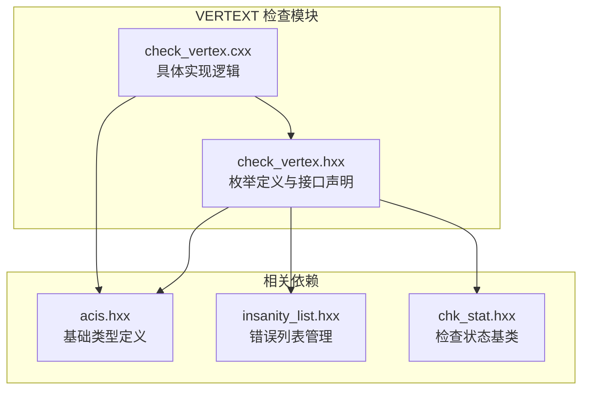
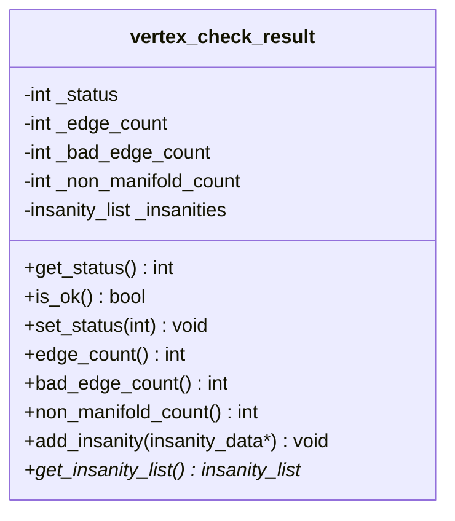
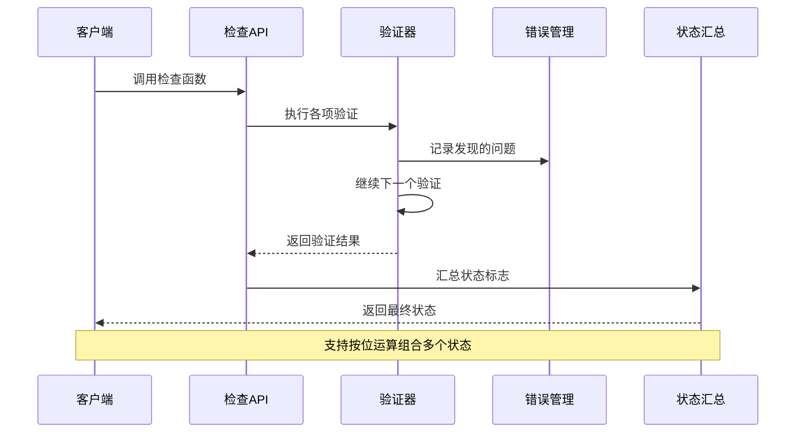
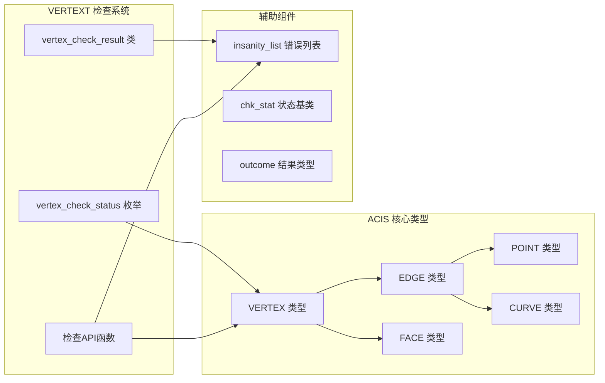

# VERTEX 检查状态枚举

<cite>
**本文档引用的文件**
- [check_vertex.hxx](file://include/check_vertex.hxx)
- [check_vertex.cxx](file://src/check_vertex.cxx)
- [TASK_SUMMARY.md](file://TASK_SUMMARY.md)
</cite>

## 目录
1. [简介](#简介)
2. [项目结构](#项目结构)
3. [核心组件](#核心组件)
4. [架构概览](#架构概览)
5. [详细组件分析](#详细组件分析)
6. [依赖关系分析](#依赖关系分析)
7. [性能考虑](#性能考虑)
8. [故障排除指南](#故障排除指南)
9. [结论](#结论)

## 简介

VERTEX 检查状态枚举系统是 ACIS 几何建模软件中的一个重要组成部分，用于验证几何体顶点的完整性和正确性。该系统通过12个不同的状态常量来标识顶点可能存在的各种问题，从基本的几何属性验证到复杂的拓扑关系检查。

本系统采用位掩码（bitmask）设计模式，允许单个检查结果同时包含多个状态标志，为几何验证提供了灵活而精确的问题诊断能力。

## 项目结构

VERTEXT 检查模块位于 Interface 目录下，采用标准的头文件声明与实现分离的组织方式：



**图表来源**
- [check_vertex.hxx:1-111](file://include/check_vertex.hxx#L1-L111)
- [check_vertex.cxx:1-714](file://src/check_vertex.cxx#L1-L714)

**章节来源**
- [check_vertex.hxx:1-111](file://include/check_vertex.hxx#L1-L111)
- [check_vertex.cxx:1-714](file://src/check_vertex.cxx#L1-L714)

## 核心组件

VERTEXT 检查系统的核心由以下三个主要组件构成：

### 1. 状态枚举定义

状态枚举使用位移操作符（1 << n）为每个状态分配唯一的二进制位，确保状态之间可以进行按位运算组合：

| 状态常量 | 二进制值 | 十进制值 | 描述 |
|---------|---------|---------|------|
| VTX_CHECK_OK | 1 << 0 | 1 | 无错误状态 |
| VTX_CHECK_NULL_POINT | 1 << 0 | 1 | 顶点点坐标为空 |
| VTX_CHECK_NO_EDGES | 1 << 1 | 2 | 顶点没有关联的边 |
| VTX_CHECK_DEGENERATE_EDGE | 1 << 2 | 4 | 边退化（长度为零） |
| VTX_CHECK_BAD_EDGE_CURVE | 1 << 3 | 8 | 边曲线几何无效 |
| VTX_CHECK_EDGE_SENSE_MISMATCH | 1 << 4 | 16 | 边方向不匹配 |
| VTX_CHECK_NON_MANIFOLD | 1 << 5 | 32 | 非流形顶点 |
| VTX_CHECK_COINCIDENT_VERTICES | 1 << 6 | 64 | 共点顶点 |
| VTX_CHECK_POINT_NOT_ON_CURVE | 1 << 7 | 128 | 顶点不在曲线上 |
| VTX_CHECK_BAD_BOUNDING_BOX | 1 << 8 | 256 | 包围盒异常 |
| VTX_CHECK_BAD_NORMAL_CONSISTENCY | 1 << 9 | 512 | 法向量一致性问题 |
| VTX_CHECK_BAD_TOLERANCE | 1 << 10 | 1024 | 容差设置异常 |
| VTX_CHECK_SHARP_ANGLE | 1 << 11 | 2048 | 尖角问题 |

### 2. 结果封装类

vertex_check_result 类提供了完整的检查结果管理功能：



**图表来源**
- [check_vertex.hxx:25-47](file://include/check_vertex.hxx#L25-L47)

### 3. 检查函数族

系统提供两套主要的检查接口：
- 错误收集模式：`api_check_vertex_errors()` 返回详细错误信息
- 快速检查模式：`api_check_vertex()` 返回状态位掩码

**章节来源**
- [check_vertex.hxx:9-23](file://include/check_vertex.hxx#L9-L23)
- [check_vertex.hxx:25-47](file://include/check_vertex.hxx#L25-L47)
- [check_vertex.hxx:49-103](file://include/check_vertex.hxx#L49-L103)

## 架构概览

VERTEXT 检查系统采用分层架构设计，实现了从底层几何验证到高层状态汇总的完整流程：



**图表来源**
- [check_vertex.cxx:59-137](file://src/check_vertex.cxx#L59-L137)
- [check_vertex.cxx:611-713](file://src/check_vertex.cxx#L611-L713)

系统的核心验证流程包括：

1. **输入验证**：检查顶点指针的有效性和类型
2. **逐项验证**：执行11种不同类型的几何验证
3. **错误收集**：将发现的问题记录到错误列表
4. **状态汇总**：根据错误描述自动设置相应的状态标志
5. **结果返回**：提供多种格式的结果输出

**章节来源**
- [check_vertex.cxx:59-137](file://src/check_vertex.cxx#L59-L137)
- [check_vertex.cxx:611-713](file://src/check_vertex.cxx#L611-L713)

## 详细组件分析

### 状态枚举详解

#### VTX_CHECK_OK (状态0)
- **触发条件**：所有验证均通过
- **用途**：表示顶点几何完全正确
- **组合使用**：通常与其他状态互斥

#### VTX_CHECK_NULL_POINT (状态1)
- **触发条件**：顶点的 POINT 对象为空或无效
- **可能原因**：
  - 顶点构造过程中出现错误
  - 内存分配失败
  - 几何数据丢失
- **解决建议**：
  - 检查顶点创建流程
  - 验证内存状态
  - 重新构建几何数据
- **预防措施**：
  - 实施严格的空指针检查
  - 添加内存泄漏检测

#### VTX_CHECK_NO_EDGES (状态2)
- **触发条件**：顶点没有任何关联的边
- **可能原因**：
  - 边界构造不完整
  - 几何模型断开
  - 数据导入错误
- **解决建议**：
  - 检查相邻面的连接性
  - 验证几何模型完整性
  - 重新生成边界信息
- **预防措施**：
  - 实施拓扑完整性检查
  - 添加边界验证机制

#### VTX_CHECK_DEGENERATE_EDGE (状态4)
- **触发条件**：边的长度小于容差阈值
- **可能原因**：
  - 数值计算误差
  - 几何退化
  - 网格质量问题
- **解决建议**：
  - 调整容差参数
  - 优化几何算法
  - 检查数值稳定性
- **预防措施**：
  - 实施长度验证
  - 添加退化检测

#### VTX_CHECK_BAD_EDGE_CURVE (状态8)
- **触发条件**：边的曲线几何无效或参数位置不正确
- **可能原因**：
  - 曲线定义错误
  - 参数范围异常
  - 几何计算失败
- **解决建议**：
  - 验证曲线定义
  - 检查参数范围
  - 重新计算几何
- **预防措施**：
  - 实施曲线有效性检查
  - 添加参数验证

#### VTX_CHECK_EDGE_SENSE_MISMATCH (状态16)
- **触发条件**：相邻边的方向不一致
- **可能原因**：
  - 拓扑方向错误
  - 边界定向问题
  - 几何构造错误
- **解决建议**：
  - 检查边的方向一致性
  - 验证拓扑关系
  - 重新定向边
- **预防措施**：
  - 实施方向一致性检查
  - 添加拓扑验证

#### VTX_CHECK_NON_MANIFOLD (状态32)
- **触发条件**：顶点处的面数量为奇数且大于0
- **可能原因**：
  - 复杂拓扑结构
  - 几何自相交
  - 不规范的几何构造
- **解决建议**：
  - 分析拓扑结构
  - 检查几何连续性
  - 重构几何模型
- **预防措施**：
  - 实施流形性检查
  - 添加拓扑约束

#### VTX_CHECK_COINCIDENT_VERTICES (状态64)
- **触发条件**：两个顶点之间的距离小于容差但不为零
- **可能原因**：
  - 数值精度问题
  - 几何重叠
  - 网格生成错误
- **解决建议**：
  - 调整合并容差
  - 检查几何重叠
  - 重新生成网格
- **预防措施**：
  - 实施重叠检测
  - 添加距离验证

#### VTX_CHECK_POINT_NOT_ON_CURVE (状态128)
- **触发条件**：顶点位置与曲线参数位置不匹配
- **可能原因**：
  - 参数映射错误
  - 几何计算偏差
  - 数值精度不足
- **解决建议**：
  - 验证参数映射
  - 检查几何计算
  - 提高数值精度
- **预防措施**：
  - 实施参数一致性检查
  - 添加位置验证

#### VTX_CHECK_BAD_BOUNDING_BOX (状态256)
- **触发条件**：包围盒包含 NaN 或无穷大值
- **可能原因**：
  - 几何数据异常
  - 计算溢出
  - 输入数据错误
- **解决建议**：
  - 检查几何数据有效性
  - 验证计算过程
  - 清理异常数据
- **预防措施**：
  - 实施边界检查
  - 添加数值稳定性验证

#### VTX_CHECK_BAD_NORMAL_CONSISTENCY (状态512)
- **触发条件**：法向量一致性检查失败
- **可能原因**：
  - 法向量计算错误
  - 拓扑不连续
  - 几何表面问题
- **解决建议**：
  - 检查法向量计算
  - 验证表面连续性
  - 修复几何问题
- **预防措施**：
  - 实施法向量验证
  - 添加连续性检查

#### VTX_CHECK_BAD_TOLERANCE (状态1024)
- **触发条件**：容差设置异常（负值、NaN、无穷大或过大）
- **可能原因**：
  - 容差配置错误
  - 数值计算问题
  - 参数设置不当
- **解决建议**：
  - 检查容差配置
  - 验证数值稳定性
  - 调整参数设置
- **预防措施**：
  - 实施容差验证
  - 添加参数范围检查

#### VTX_CHECK_SHARP_ANGLE (状态2048)
- **触发条件**：顶点处存在尖锐角度
- **可能原因**：
  - 几何锐角
  - 网格质量差
  - 数值计算不稳定
- **解决建议**：
  - 分析角度分布
  - 检查几何质量
  - 优化网格生成
- **预防措施**：
  - 实施角度检查
  - 添加质量评估

### 状态组合使用示例

VERTEXT 检查系统支持状态组合，以下是一些常见的组合场景：

#### 示例1：几何完整性检查
```
状态组合：VTX_CHECK_NULL_POINT | VTX_CHECK_NO_EDGES | VTX_CHECK_DEGENERATE_EDGE
含义：顶点为空、无边且边退化
影响：几何模型严重损坏，需要重建
```

#### 示例2：拓扑问题诊断
```
状态组合：VTX_CHECK_NON_MANIFOLD | VTX_CHECK_EDGE_SENSE_MISMATCH
含义：非流形且方向不一致
影响：拓扑结构复杂，需要重新定向
```

#### 示例3：数值稳定性问题
```
状态组合：VTX_CHECK_BAD_BOUNDING_BOX | VTX_CHECK_BAD_TOLERANCE
含义：包围盒异常且容差异常
影响：数值计算不稳定，需要调整参数
```

### 调试技巧

#### 1. 状态位检查
```cpp
// 检查特定状态是否被设置
if (status & VTX_CHECK_NULL_POINT) {
    // 处理空点问题
}

// 检查是否包含任何错误
if (status != VTX_CHECK_OK) {
    // 存在问题
}
```

#### 2. 详细错误信息获取
```cpp
// 使用错误收集模式获取详细信息
vertex_check_result result;
api_check_vertex_errors(vertex, result);

// 遍历所有发现的问题
insanity_list* errors = result.get_insanity_list();
insanity_data* entry = errors->first();
while (entry) {
    printf("问题：%s\n", entry->get_description());
    entry = entry->next();
}
```

#### 3. 性能优化建议
- **早期退出**：在发现严重错误时提前终止检查
- **缓存机制**：复用中间计算结果
- **批量处理**：对多个顶点进行批处理检查

**章节来源**
- [check_vertex.hxx:9-23](file://include/check_vertex.hxx#L9-L23)
- [check_vertex.cxx:59-137](file://src/check_vertex.cxx#L59-L137)
- [check_vertex.cxx:611-713](file://src/check_vertex.cxx#L611-L713)

## 依赖关系分析

VERTEXT 检查系统依赖于多个 ACIS 几何建模核心组件：



**图表来源**
- [check_vertex.hxx:4-7](file://include/check_vertex.hxx#L4-L7)
- [check_vertex.cxx:2-14](file://src/check_vertex.cxx#L2-L14)

系统的关键依赖关系：

1. **几何类型依赖**：直接依赖 ACIS 的几何实体类型
2. **错误管理依赖**：使用 insanity_list 进行错误收集
3. **状态管理依赖**：基于位掩码的状态管理机制
4. **结果封装依赖**：通过 vertex_check_result 提供统一的结果接口

**章节来源**
- [check_vertex.hxx:4-7](file://include/check_vertex.hxx#L4-L7)
- [check_vertex.cxx:2-14](file://src/check_vertex.cxx#L2-L14)

## 性能考虑

VERTEXT 检查系统在设计时充分考虑了性能因素：

### 时间复杂度分析
- **单次检查**：O(n)，其中 n 是顶点关联的边数
- **批量检查**：O(n*m)，其中 m 是顶点数量
- **空间复杂度**：O(k)，其中 k 是发现的问题数量

### 优化策略
1. **早期终止**：在发现严重错误时立即停止进一步检查
2. **智能缓存**：避免重复计算相同的几何属性
3. **并行处理**：对独立顶点检查进行并行化
4. **内存管理**：及时释放临时分配的内存

### 性能监控
- **检查计数**：跟踪检查执行次数
- **错误统计**：统计各类错误的发生频率
- **时间测量**：监控检查执行时间

## 故障排除指南

### 常见问题诊断

#### 1. 空指针异常
**症状**：频繁出现 VTX_CHECK_NULL_POINT
**解决方案**：
- 检查顶点创建流程
- 验证内存分配状态
- 实施空指针防护

#### 2. 拓扑错误
**症状**：VTX_CHECK_NO_EDGES 和 VTX_CHECK_NON_MANIFOLD
**解决方案**：
- 验证几何模型完整性
- 检查面与边的连接关系
- 重新生成拓扑数据

#### 3. 数值稳定性问题
**症状**：VTX_CHECK_BAD_BOUNDING_BOX 和 VTX_CHECK_BAD_TOLERANCE
**解决方案**：
- 调整容差参数设置
- 检查输入数据质量
- 实施数值稳定性验证

### 调试工具使用

#### 1. 详细日志记录
```cpp
// 启用详细错误报告
AcisOptions options;
options.set_debug_level(DEBUG_LEVEL_VERBOSE);

// 执行检查并获取详细信息
vertex_check_result result;
api_check_vertex_errors(vertex, result, &options);
```

#### 2. 错误分类分析
```cpp
// 按错误类型分类统计
map<string, int> error_count;
insanity_list* errors = result.get_insanity_list();
// 分析错误分布
```

#### 3. 可视化调试
- **几何可视化**：显示有问题的顶点和边
- **拓扑图**：展示顶点的邻接关系
- **数值图表**：显示关键参数的分布

**章节来源**
- [check_vertex.cxx:59-137](file://src/check_vertex.cxx#L59-L137)
- [check_vertex.cxx:611-713](file://src/check_vertex.cxx#L611-L713)

## 结论

VERTEXT 检查状态枚举系统是一个设计精良的几何验证框架，具有以下特点：

### 设计优势
1. **模块化设计**：清晰的状态分离和职责划分
2. **可扩展性**：支持状态组合和新状态添加
3. **性能优化**：高效的检查算法和内存管理
4. **错误友好**：详细的错误信息和诊断能力

### 应用价值
- **质量保证**：确保几何模型的完整性和正确性
- **问题定位**：快速识别和定位几何问题
- **维护支持**：为后续的几何修复提供指导
- **性能监控**：帮助识别潜在的性能问题

### 发展前景
随着几何建模技术的不断发展，VERTEXT 检查系统将继续演进，为更复杂的几何验证需求提供支持。建议关注以下发展方向：
- 更智能的错误预测和预防
- 更高效的并行检查算法
- 更丰富的可视化调试工具
- 更完善的性能监控机制

通过合理使用 VERTEXT 检查状态枚举系统，开发者可以显著提高几何建模软件的质量和可靠性，为用户提供更好的建模体验。