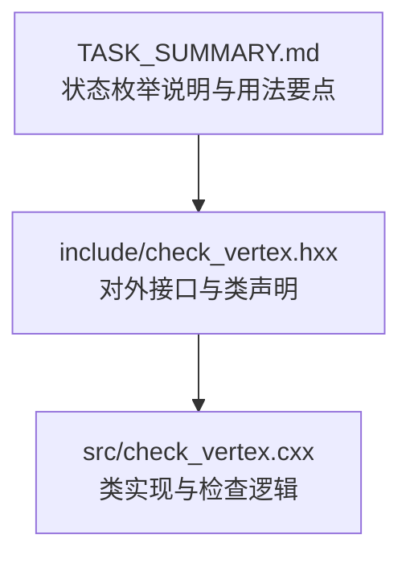
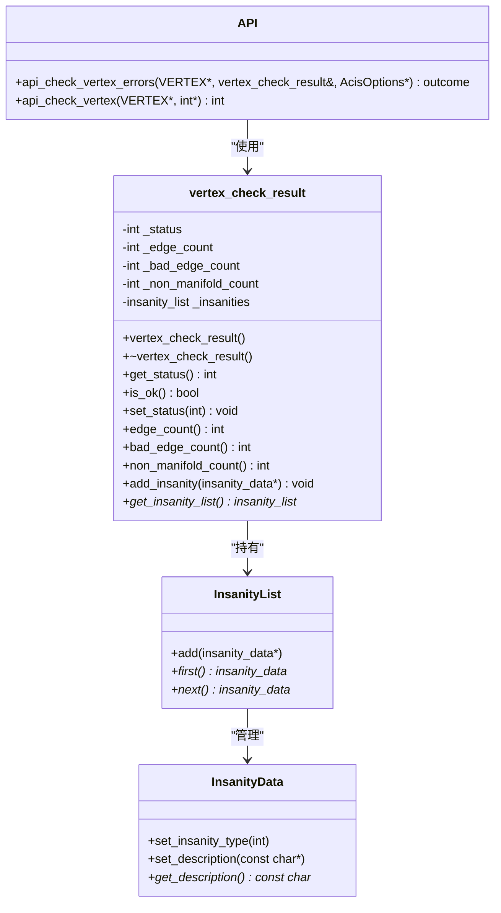
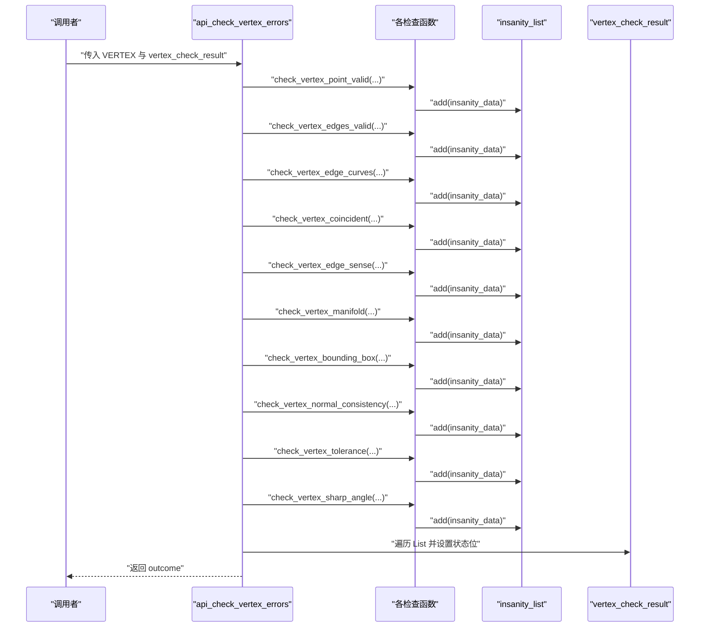
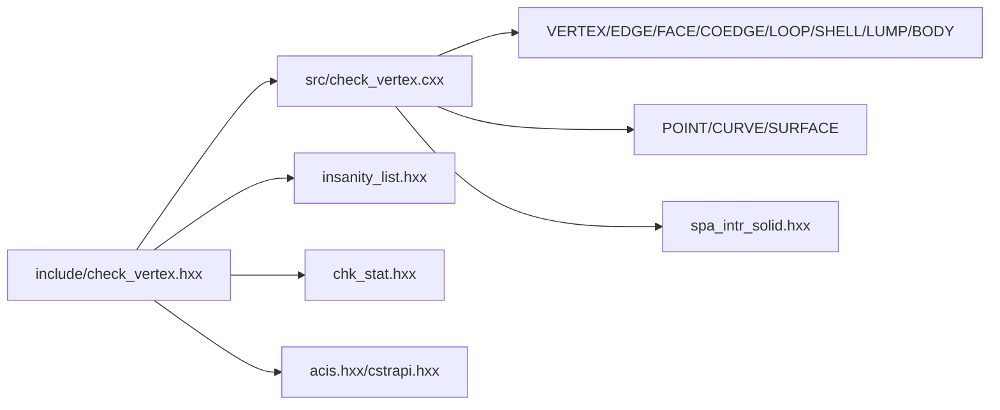

# VERTEX 检查结果处理

<cite>
**本文引用的文件**
- [check_vertex.hxx](file://include/check_vertex.hxx)
- [check_vertex.cxx](file://src/check_vertex.cxx)
- [TASK_SUMMARY.md](file://TASK_SUMMARY.md)
</cite>

## 目录
1. [简介](#简介)
2. [项目结构](#项目结构)
3. [核心组件](#核心组件)
4. [架构总览](#架构总览)
5. [详细组件分析](#详细组件分析)
6. [依赖关系分析](#依赖关系分析)
7. [性能考量](#性能考量)
8. [故障排查指南](#故障排查指南)
9. [结论](#结论)
10. [附录：使用示例与最佳实践](#附录使用示例与最佳实践)

## 简介
本技术文档面向 VERTEX 检查结果处理系统，围绕 vertex_check_result 类的设计理念、成员变量语义、公共接口方法进行深入解析，并详细说明如何通过 get_status、is_ok、edge_count、bad_edge_count、non_manifold_count 等方法获取检查结果；解释 insanity_list 的使用方式与错误收集机制；提供完整的代码示例路径，展示如何解析检查结果、处理错误信息、生成诊断报告；同时给出结果状态枚举的完整说明与错误处理的最佳实践。

## 项目结构
该模块位于 Interface 子目录下，采用“头文件声明 + 实现文件定义”的分层组织：
- 头文件 include/check_vertex.hxx：对外暴露 vertex_check_result 类、状态枚举、API 函数等。
- 实现文件 src/check_vertex.cxx：实现 vertex_check_result 的构造/析构、状态查询与设置、计数器访问、错误收集与状态汇总逻辑，以及一系列具体检查函数（如点有效性、边有效性、共点检测、方向一致性、包围盒、法向一致性、容差、尖角等）。

图表来源
- [check_vertex.hxx:1-111](file://include/check_vertex.hxx#L1-L111)
- [check_vertex.cxx:1-714](file://src/check_vertex.cxx#L1-L714)

章节来源
- [check_vertex.hxx:1-111](file://include/check_vertex.hxx#L1-L111)
- [check_vertex.cxx:1-714](file://src/check_vertex.cxx#L1-L714)

## 核心组件
- vertex_check_result 类：封装一次顶点检查的结果，包括状态位、计数器与错误列表。
- 结果状态枚举 vertex_check_status：用于表示检查结果的多种错误类型，支持按位组合。
- API 函数族：
  - api_check_vertex_errors：基于 vertex_check_result 对象执行全面检查，并将错误映射到状态位。
  - api_check_vertex：直接返回状态整型，便于快速判断。
  - 各种检查子函数：如 check_vertex_point_valid、check_vertex_edges_valid、check_vertex_edge_curves、check_vertex_coincident、check_vertex_edge_sense、check_vertex_manifold、check_vertex_bounding_box、check_vertex_normal_consistency、check_vertex_tolerance、check_vertex_sharp_angle。

章节来源
- [check_vertex.hxx:9-111](file://include/check_vertex.hxx#L9-L111)
- [check_vertex.cxx:15-137](file://src/check_vertex.cxx#L15-L137)
- [check_vertex.cxx:611-713](file://src/check_vertex.cxx#L611-L713)

## 架构总览
vertex_check_result 作为结果载体，配合一组检查函数完成对顶点几何与拓扑属性的验证。检查函数在发现异常时会向 insanity_list 添加条目，随后由 api_check_vertex_errors 或 api_check_vertex 将这些条目映射为状态位，最终形成可读的检查结果。

图表来源
- [check_vertex.hxx:25-57](file://include/check_vertex.hxx#L25-L57)
- [check_vertex.hxx:49-108](file://include/check_vertex.hxx#L49-L108)
- [check_vertex.cxx:49-137](file://src/check_vertex.cxx#L49-L137)

## 详细组件分析

### vertex_check_result 类设计与职责
- 设计理念
  - 职责单一：集中承载一次顶点检查的全部结果，包括布尔状态、数值统计与错误清单。
  - 可扩展：通过状态位组合表达多类错误，便于上层聚合与分类处理。
  - 易用性：提供 is_ok 快速判断、get_status 获取综合状态、计数器方法便于统计分析。
- 成员变量
  - _status：当前检查结果的状态位集合，对应 vertex_check_status 枚举。
  - _edge_count：参与检查的边数量（由具体实现维护）。
  - _bad_edge_count：被判定为“坏边”的数量（由具体实现维护）。
  - _non_manifold_count：非流形相关问题的数量（由具体实现维护）。
  - _insanities：insanity_list，用于收集具体的错误条目。
- 公共接口
  - get_status：返回综合状态位。
  - is_ok：当且仅当状态为 VTX_CHECK_OK 时返回真。
  - set_status：设置状态位（通常由 API 层根据错误条目汇总后设置）。
  - edge_count/bad_edge_count/non_manifold_count：返回相应计数。
  - add_insanity/get_insanity_list：向错误列表添加条目或获取列表指针。

章节来源
- [check_vertex.hxx:25-57](file://include/check_vertex.hxx#L25-L57)
- [check_vertex.cxx:15-57](file://src/check_vertex.cxx#L15-L57)

### 结果状态枚举 vertex_check_status
- 枚举项含义（节选）
  - VTX_CHECK_OK：无错误。
  - VTX_CHECK_NULL_POINT：POINT 为空。
  - VTX_CHECK_NO_EDGES：无关联边。
  - VTX_CHECK_DEGENERATE_EDGE：退化边。
  - VTX_CHECK_BAD_EDGE_CURVE：边曲线无效。
  - VTX_CHECK_EDGE_SENSE_MISMATCH：方向不匹配。
  - VTX_CHECK_NON_MANIFOLD：非流形。
  - VTX_CHECK_COINCIDENT_VERTICES：共点顶点。
  - VTX_CHECK_POINT_NOT_ON_CURVE：顶点不在曲线上。
  - VTX_CHECK_BAD_BOUNDING_BOX：包围盒异常。
  - VTX_CHECK_BAD_NORMAL_CONSISTENCY：法向不一致。
  - VTX_CHECK_BAD_TOLERANCE：容差异常。
  - VTX_CHECK_SHARP_ANGLE：尖角。
- 使用建议
  - 通过按位与判断某类错误是否存在。
  - 优先使用 is_ok 判断整体是否通过。
  - 在日志与报告中，结合 sanity_list 条目描述进行细化输出。

章节来源
- [check_vertex.hxx:9-23](file://include/check_vertex.hxx#L9-L23)
- [TASK_SUMMARY.md:79-95](file://TASK_SUMMARY.md#L79-L95)

### 错误收集与状态汇总流程
- 步骤概览
  - 调用 api_check_vertex_errors 或 api_check_vertex 执行检查。
  - 每个检查函数在发现问题时向 insanity_list 添加一条记录（包含类型与描述）。
  - API 层遍历 insanity_list，依据描述字符串的关键字映射到对应的 VTX_CHECK_* 状态位。
  - 最终设置 vertex_check_result 的状态位，供上层查询。
- 关键实现位置
  - api_check_vertex_errors：逐项调用各检查函数，并从 insanity_list 汇总状态。
  - api_check_vertex：直接返回状态整型，便于快速判断。

图表来源
- [check_vertex.cxx:59-137](file://src/check_vertex.cxx#L59-L137)

章节来源
- [check_vertex.cxx:59-137](file://src/check_vertex.cxx#L59-L137)

### 计数器与统计方法
- edge_count/bad_edge_count/non_manifold_count
  - 语义：分别表示参与检查的边总数、被判定为“坏边”的数量、非流形相关问题的数量。
  - 维护方式：在具体检查函数中对相关条件进行计数，最终汇总到 vertex_check_result。
  - 注意：实现中提供了这些方法的声明与访问器，实际计数逻辑需结合具体检查函数的实现细节。

章节来源
- [check_vertex.hxx:34-36](file://include/check_vertex.hxx#L34-L36)
- [check_vertex.cxx:37-47](file://src/check_vertex.cxx#L37-L47)

### API 使用与返回值
- api_check_vertex_errors
  - 输入：VERTEX 指针、vertex_check_result 引用、可选 AcisOptions。
  - 输出：outcome（成功/失败），同时通过 vertex_check_result 提供状态与错误列表。
  - 行为：依次调用各检查函数，将错误条目加入列表，再根据描述关键字设置状态位。
- api_check_vertex
  - 输入：VERTEX 指针、可选 insanity_count 指针。
  - 输出：状态整型（按位组合），同时可返回错误条目数量。
  - 行为：内部创建临时 insanity_list，逐项检查并汇总状态。

章节来源
- [check_vertex.hxx:49-108](file://include/check_vertex.hxx#L49-L108)
- [check_vertex.cxx:59-137](file://src/check_vertex.cxx#L59-L137)
- [check_vertex.cxx:611-713](file://src/check_vertex.cxx#L611-L713)

## 依赖关系分析
- 头文件依赖
  - include/check_vertex.hxx 依赖 acis.hxx、cstrapi.hxx、insanity_list.hxx、chk_stat.hxx。
- 内部依赖
  - src/check_vertex.cxx 依赖 VERTEX、EDGE、FACE、COEDGE、LOOP、SHELL、LUMP、BODY、POINT、CURVE、SURFACE、spa_intr_solid.hxx 等几何实体类型。
- 关系图

图表来源
- [check_vertex.hxx:4-7](file://include/check_vertex.hxx#L4-L7)
- [check_vertex.cxx:1-14](file://src/check_vertex.cxx#L1-L14)

章节来源
- [check_vertex.hxx:4-7](file://include/check_vertex.hxx#L4-L7)
- [check_vertex.cxx:1-14](file://src/check_vertex.cxx#L1-L14)

## 性能考量
- 时间复杂度
  - 每个检查函数通常与邻接边/面/共边等拓扑对象成线性关系，整体复杂度近似 O(E)（E 为邻接边数）。
- 空间复杂度
  - 主要消耗来自 insanity_list 的动态分配，数量与发现的错误条目数成正比。
- 优化建议
  - 在大规模模型中，优先使用 api_check_vertex_errors 并复用 vertex_check_result，避免重复创建对象。
  - 对于高频调用场景，可考虑缓存检查结果或延迟计算某些统计量。

## 故障排查指南
- 常见问题定位
  - 顶点为空：检查函数会在点为空或坐标含 NaN/Inf 时添加错误条目。
  - 无关联边：当顶点没有 incident edges 时标记为警告。
  - 退化边：长度过小或端点重合导致退化。
  - 边曲线无效：边的曲线为空或参数位置不匹配。
  - 方向不一致：共边 sense 相同导致方向冲突。
  - 非流形：面数统计为奇数可能指示非流形。
  - 共点顶点：端点距离小于容差阈值。
  - 包围盒异常：坐标含 NaN/Inf。
  - 法向一致性：多面共享时法向方向不一致。
  - 容差异常：容差为负或过大。
  - 尖角：角度异常（实现中存在相关检查入口，但当前版本未完全实现）。
- 排查步骤
  - 使用 is_ok 快速判断整体是否通过。
  - 通过 get_status 的按位判断定位具体错误类别。
  - 遍历 insanity_list 获取详细描述，结合几何实体进一步定位。
  - 若需要统计，使用 edge_count/bad_edge_count/non_manifold_count。

章节来源
- [check_vertex.cxx:139-709](file://src/check_vertex.cxx#L139-L709)

## 结论
vertex_check_result 类以简洁的接口与灵活的状态位组合，有效支撑了 VERTEX 检查结果的统一管理。通过 api_check_vertex_errors 与 api_check_vertex 两种 API，既能满足细粒度控制，也能满足快速判断需求。配合 insanity_list 的错误收集机制，开发者可以高效地生成诊断报告并进行后续修复。

## 附录：使用示例与最佳实践

### 如何使用 vertex_check_result 获取检查结果
- 基本流程
  - 创建 vertex_check_result 对象。
  - 调用 api_check_vertex_errors(vertex, result) 执行检查。
  - 使用 result.is_ok() 判断整体是否通过。
  - 使用 result.get_status() 获取状态位，按位判断具体错误类型。
  - 使用 result.edge_count()/bad_edge_count()/non_manifold_count() 获取统计信息。
  - 使用 result.get_insanity_list() 遍历错误条目，生成诊断报告。

章节来源
- [check_vertex.hxx:30-36](file://include/check_vertex.hxx#L30-L36)
- [check_vertex.hxx:38-39](file://include/check_vertex.hxx#L38-L39)
- [check_vertex.cxx:25-47](file://src/check_vertex.cxx#L25-L47)
- [check_vertex.cxx:55-57](file://src/check_vertex.cxx#L55-L57)

### 如何使用 insanity_list 收集与处理错误
- 添加错误条目
  - 在检查函数中，若发现异常，创建 insanity_data 并设置类型与描述，然后通过 add_insanity 或直接调用 insanity_list::add 添加。
- 遍历与汇总
  - 在 api_check_vertex_errors 中，遍历 insanity_list，依据描述字符串的关键字设置状态位。
  - 在 api_check_vertex 中，同样遍历临时列表并汇总状态。

章节来源
- [check_vertex.cxx:49-57](file://src/check_vertex.cxx#L49-L57)
- [check_vertex.cxx:90-134](file://src/check_vertex.cxx#L90-L134)
- [check_vertex.cxx:666-712](file://src/check_vertex.cxx#L666-L712)

### 代码示例（路径指引）
以下示例均以“代码片段路径”形式给出，避免直接粘贴源码内容：
- 执行检查并获取状态
  - [api_check_vertex_errors 调用与状态设置:59-137](file://src/check_vertex.cxx#L59-L137)
- 获取统计信息
  - [计数器访问器:37-47](file://src/check_vertex.cxx#L37-L47)
- 遍历错误条目生成报告
  - [遍历 insanity_list 并设置状态位:90-134](file://src/check_vertex.cxx#L90-L134)
- 快速判断
  - [is_ok 与 get_status:25-31](file://src/check_vertex.cxx#L25-L31)

### 最佳实践
- 优先使用 is_ok 进行快速判断，再按需细分状态位。
- 在日志与报告中，结合 sanity_list 的描述字符串进行人性化输出。
- 对于批量检查，复用 vertex_check_result，减少对象创建开销。
- 对于性能敏感场景，可先调用 api_check_vertex 获取整型状态，必要时再做细粒度检查。