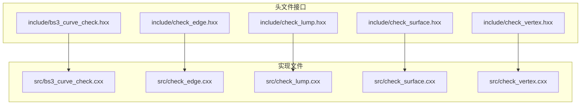
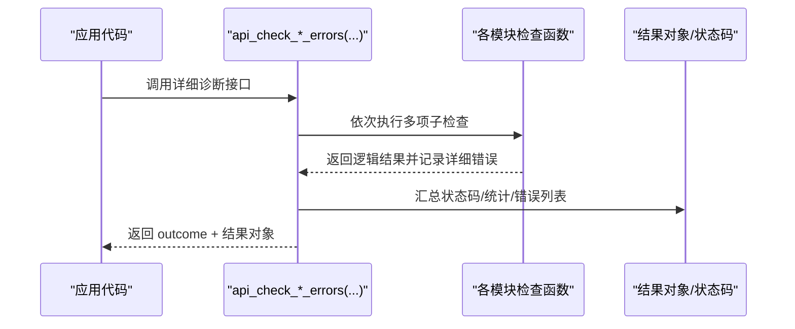
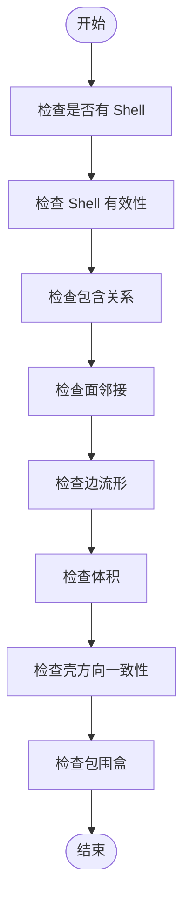
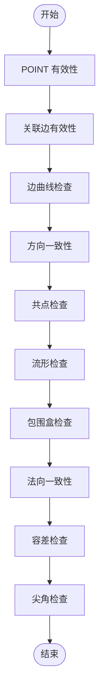
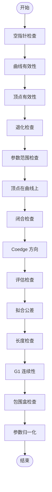
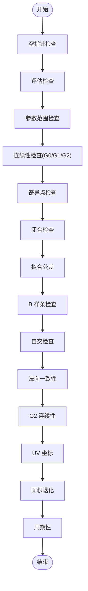
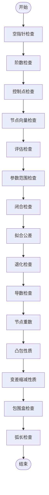
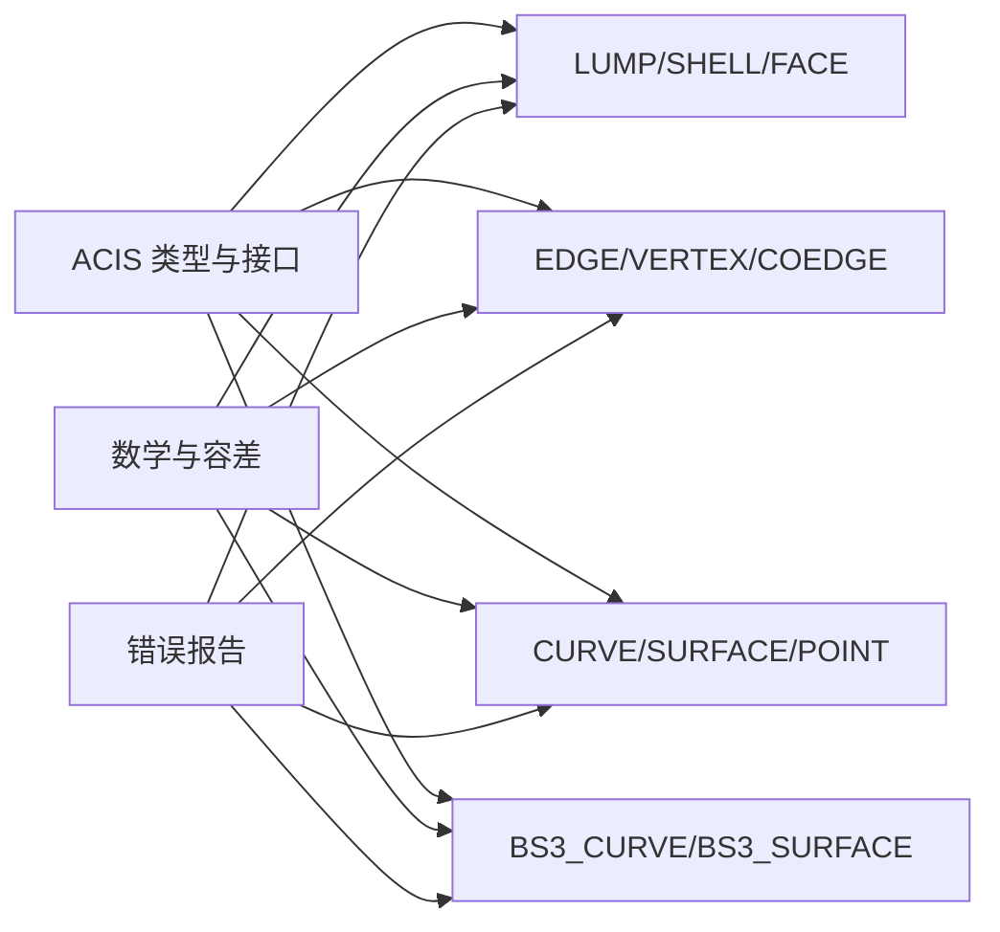

# 快速开始

<cite>
**本文引用的文件**
- [include/bs3_curve_check.hxx](file://include/bs3_curve_check.hxx)
- [include/check_edge.hxx](file://include/check_edge.hxx)
- [include/check_lump.hxx](file://include/check_lump.hxx)
- [include/check_surface.hxx](file://include/check_surface.hxx)
- [include/check_vertex.hxx](file://include/check_vertex.hxx)
- [src/bs3_curve_check.cxx](file://src/bs3_curve_check.cxx)
- [src/check_edge.cxx](file://src/check_edge.cxx)
- [src/check_lump.cxx](file://src/check_lump.cxx)
- [src/check_surface.cxx](file://src/check_surface.cxx)
- [src/check_vertex.cxx](file://src/check_vertex.cxx)
- [TASK_SUMMARY.md](file://TASK_SUMMARY.md)
</cite>

## 目录
1. [简介](#简介)
2. [项目结构](#项目结构)
3. [核心组件](#核心组件)
4. [架构总览](#架构总览)
5. [详细组件分析](#详细组件分析)
6. [依赖分析](#依赖分析)
7. [性能考虑](#性能考虑)
8. [故障排除指南](#故障排除指南)
9. [结论](#结论)
10. [附录](#附录)

## 简介
本指南面向首次接触该几何检查接口的开发者，帮助你在约 30 分钟内完成从环境准备到编写并运行第一个几何检查程序。你将学会：
- 环境与编译要求（基于 ACIS 内核）
- 编译安装步骤
- 基本使用示例：5 种几何实体类型的快速检测与详细诊断
- 常见初始化流程与错误处理模式
- 基础几何模型加载与检查流程
- 故障排除与常见问题

## 项目结构
该项目为 ACIS 3D 几何内核的几何实体检查接口，提供 5 类几何对象的快速检测与详细诊断能力：
- LUMP（实体/实体组）
- VERTEX（顶点）
- EDGE（边）
- SURFACE（曲面）
- BS3_CURVE（B 样条曲线）

头文件位于 include/，实现位于 src/；每个模块均提供两类接口：
- 快速检测接口：返回整型状态码，便于快速判断
- 详细诊断接口：返回 outcome 结果对象，携带详细错误列表

图表来源
- [include/bs3_curve_check.hxx:1-138](file://include/bs3_curve_check.hxx#L1-L138)
- [include/check_edge.hxx:1-130](file://include/check_edge.hxx#L1-L130)
- [include/check_lump.hxx:1-117](file://include/check_lump.hxx#L1-L117)
- [include/check_surface.hxx:1-133](file://include/check_surface.hxx#L1-L133)
- [include/check_vertex.hxx:1-111](file://include/check_vertex.hxx#L1-L111)
- [src/bs3_curve_check.cxx:1-150](file://src/bs3_curve_check.cxx#L1-L150)
- [src/check_edge.cxx:1-142](file://src/check_edge.cxx#L1-L142)
- [src/check_lump.cxx:1-120](file://src/check_lump.cxx#L1-L120)
- [src/check_surface.cxx:1-120](file://src/check_surface.cxx#L1-L120)
- [src/check_vertex.cxx:1-120](file://src/check_vertex.cxx#L1-L120)

章节来源
- [TASK_SUMMARY.md:1-306](file://TASK_SUMMARY.md#L1-L306)

## 核心组件
- 快速检测接口（int 返回）：用于快速判断几何对象是否满足基本条件，返回位掩码式状态码，可按位判断具体问题类别。
- 详细诊断接口（outcome + 结果对象）：返回带结果对象的 outcome，结果对象包含状态码、统计信息以及详细错误列表，适合深入定位问题。
- 检查枚举：每类几何对象定义了对应的检查状态枚举，涵盖空指针、参数范围、拟合公差、退化、自交、连续性、周期性、包围盒等维度。
- 检查结果类：封装状态码、统计计数与错误列表，支持添加与获取详细错误数据。

章节来源
- [include/bs3_curve_check.hxx:9-49](file://include/bs3_curve_check.hxx#L9-L49)
- [include/check_edge.hxx:9-46](file://include/check_edge.hxx#L9-L46)
- [include/check_lump.hxx:9-48](file://include/check_lump.hxx#L9-L48)
- [include/check_surface.hxx:9-49](file://include/check_surface.hxx#L9-L49)
- [include/check_vertex.hxx:9-47](file://include/check_vertex.hxx#L9-L47)
- [TASK_SUMMARY.md:257-279](file://TASK_SUMMARY.md#L257-L279)

## 架构总览
整体采用“模块化接口 + 细分子检查”的设计。每个模块对外暴露两类主函数：
- 详细诊断版本：api_check_*_errors(...)，返回 outcome 并填充结果对象
- 快速检测版本：api_check_* 或 check_*_ok(...)，返回整型状态码

内部通过一系列 check_* 子函数对几何对象进行多维度校验，最终汇总为状态码或详细错误列表。

图表来源
- [src/bs3_curve_check.cxx:50-150](file://src/bs3_curve_check.cxx#L50-L150)
- [src/check_edge.cxx:47-142](file://src/check_edge.cxx#L47-L142)
- [src/check_lump.cxx:50-120](file://src/check_lump.cxx#L50-L120)
- [src/check_surface.cxx:51-120](file://src/check_surface.cxx#L51-L120)
- [src/check_vertex.cxx:49-120](file://src/check_vertex.cxx#L49-L120)

## 详细组件分析

### LUMP 检查模块
- 快速检测：api_check_lump_status(...)
- 详细诊断：api_check_lump(...)
- 关键子检查：壳有效性、包含关系、面邻接、边流形、体积、方向一致性、包围盒等
- 典型状态码：无壳、空壳、壳自交、包含关系错误、相交壳、退化面、Coedge 方向错误、非流形顶点/边、体积异常、包围盒异常、方向不一致、面邻接异常等

图表来源
- [include/check_lump.hxx:50-114](file://include/check_lump.hxx#L50-L114)
- [src/check_lump.cxx:50-120](file://src/check_lump.cxx#L50-L120)

章节来源
- [include/check_lump.hxx:9-114](file://include/check_lump.hxx#L9-L114)
- [src/check_lump.cxx:1-120](file://src/check_lump.cxx#L1-L120)
- [TASK_SUMMARY.md:35-74](file://TASK_SUMMARY.md#L35-L74)

### VERTEX 检查模块
- 快速检测：api_check_vertex(...)
- 详细诊断：api_check_vertex_errors(...)
- 关键子检查：POINT 有效性、关联边、边曲线、方向一致性、共点、流形、包围盒、法向一致性、容差、尖角等

图表来源
- [include/check_vertex.hxx:49-108](file://include/check_vertex.hxx#L49-L108)
- [src/check_vertex.cxx:611-714](file://src/check_vertex.cxx#L611-L714)

章节来源
- [include/check_vertex.hxx:9-108](file://include/check_vertex.hxx#L9-L108)
- [src/check_vertex.cxx:1-120](file://src/check_vertex.cxx#L1-L120)
- [TASK_SUMMARY.md:77-113](file://TASK_SUMMARY.md#L77-L113)

### EDGE 检查模块
- 快速检测：api_check_edge(...)
- 详细诊断：api_check_edge_errors(...)
- 关键子检查：空指针、曲线有效性、顶点有效性、退化、参数范围、顶点在曲线上、闭合、Coedge 方向、评估、拟合公差、长度、G1 连续性、包围盒、参数归一化等

图表来源
- [include/check_edge.hxx:48-127](file://include/check_edge.hxx#L48-L127)
- [src/check_edge.cxx:47-142](file://src/check_edge.cxx#L47-L142)

章节来源
- [include/check_edge.hxx:9-127](file://include/check_edge.hxx#L9-L127)
- [src/check_edge.cxx:1-142](file://src/check_edge.cxx#L1-L142)
- [TASK_SUMMARY.md:116-159](file://TASK_SUMMARY.md#L116-L159)

### SURFACE 检查模块
- 快速检测：check_surface_ok(...)
- 详细诊断：api_check_surface_ok(...)
- 关键子检查：空指针、评估、参数范围、连续性（G0/G1/G2）、奇异点、闭合、拟合公差、B 样条、自交、法向一致性、G2 连续性、UV 坐标、面积退化、周期性等

图表来源
- [include/check_surface.hxx:51-130](file://include/check_surface.hxx#L51-L130)
- [src/check_surface.cxx:51-120](file://src/check_surface.cxx#L51-L120)

章节来源
- [include/check_surface.hxx:9-130](file://include/check_surface.hxx#L9-L130)
- [src/check_surface.cxx:1-120](file://src/check_surface.cxx#L1-L120)
- [TASK_SUMMARY.md:162-206](file://TASK_SUMMARY.md#L162-L206)

### BS3_CURVE 检查模块
- 快速检测：bs3_curve_check(...)
- 详细诊断：api_bs3_curve_check(...)
- 关键子检查：空指针、阶数、控制点、节点向量、评估、参数范围、闭合、拟合公差、退化、导数、节点重数、凸包性质、变差缩减性质、包围盒、弧长等

图表来源
- [include/bs3_curve_check.hxx:51-135](file://include/bs3_curve_check.hxx#L51-L135)
- [src/bs3_curve_check.cxx:50-150](file://src/bs3_curve_check.cxx#L50-L150)

章节来源
- [include/bs3_curve_check.hxx:9-135](file://include/bs3_curve_check.hxx#L9-L135)
- [src/bs3_curve_check.cxx:1-150](file://src/bs3_curve_check.cxx#L1-L150)
- [TASK_SUMMARY.md:209-254](file://TASK_SUMMARY.md#L209-L254)

## 依赖分析
- ACIS 类型与接口：LUMP/SHELL/FACE/EDGE/VERTEX/CURVE/SURFACE/POINT/BS3_CURVE 等
- 数学与容差：SPAposition、SPAvector、SPAinterval、SPApar_box、SPApar_pos、SPAresabs、SPAresnor
- 错误报告：insanity_list、insanity_data
- 结果对象：outcome（用于详细诊断接口）

图表来源
- [TASK_SUMMARY.md:282-293](file://TASK_SUMMARY.md#L282-L293)

章节来源
- [TASK_SUMMARY.md:282-293](file://TASK_SUMMARY.md#L282-L293)

## 性能考虑
- 快速检测接口优先：仅返回状态码，适合批量筛查与快速判定
- 详细诊断接口代价更高：会执行更多采样与计算，适合定位问题
- 合理选择采样密度：如曲线/曲面评估、面积积分等，可根据精度需求调整采样步长
- 异常捕获：评估过程中可能抛出异常，需做好 try/catch 与容错处理

## 故障排除指南
- 空指针与类型不匹配
  - 症状：快速检测返回对应“空”类状态码，或详细诊断返回空指针错误
  - 处理：在调用前先检查对象是否为空且类型正确
- 参数范围异常
  - 症状：参数域为空、NaN/Inf、退化区间
  - 处理：修正几何参数范围或重建几何
- 拟合公差异常
  - 症状：负值、过大或过小
  - 处理：根据业务需求设置合理容差
- 退化与自交
  - 症状：退化面/边/曲线、曲面自交
  - 处理：修复几何拓扑或重新建模
- 连续性问题
  - 症状：G1/G2 不连续、闭合处切线不匹配
  - 处理：优化曲线/曲面拼接与参数化
- 包围盒与坐标异常
  - 症状：NaN/Inf 坐标、包围盒异常
  - 处理：检查输入数据与坐标系统

章节来源
- [src/bs3_curve_check.cxx:298-347](file://src/bs3_curve_check.cxx#L298-L347)
- [src/check_edge.cxx:491-545](file://src/check_edge.cxx#L491-L545)
- [src/check_surface.cxx:806-848](file://src/check_surface.cxx#L806-L848)
- [src/check_vertex.cxx:600-609](file://src/check_vertex.cxx#L600-L609)

## 结论
本接口提供了覆盖拓扑、几何与数值有效性的完整检查体系，既可快速筛查，也可深入诊断。建议在实际工程中结合业务场景选择合适的检查粒度，并建立统一的错误收集与报告机制，以提升几何模型质量与稳定性。

## 附录

### 环境与编译要求
- 基于 ACIS 3D 内核，需要相应 SDK 与头文件路径
- 编译器需支持 C++（接口以 C++ 头文件形式提供）
- 链接时需包含 ACIS 相关库与数学/容差相关符号（如 SPAresabs、SPAresnor）

章节来源
- [TASK_SUMMARY.md:282-293](file://TASK_SUMMARY.md#L282-L293)

### 编译安装步骤（通用流程）
- 准备 ACIS 开发环境与头文件路径
- 将 include/ 下的头文件加入编译器包含目录
- 将 src/ 下的实现文件加入构建系统
- 链接 ACIS 库与数学/容差相关库
- 编译生成静态库或动态库供上层应用使用

章节来源
- [TASK_SUMMARY.md:282-293](file://TASK_SUMMARY.md#L282-L293)

### 基本使用示例（概念性流程）
以下为概念性示例，展示如何使用快速检测与详细诊断接口。请根据你的几何模型加载方式替换对象类型与参数。

- LUMP 快速检测
  - 步骤：调用 api_check_lump_status(...)，读取返回的状态码，按位判断具体问题类别
  - 参考接口：[include/check_lump.hxx:111-114](file://include/check_lump.hxx#L111-L114)
- LUMP 详细诊断
  - 步骤：构造 lump_check_result，调用 api_check_lump(...)，遍历结果中的详细错误列表
  - 参考接口：[include/check_lump.hxx:50-54](file://include/check_lump.hxx#L50-L54)
- VERTEX 快速检测
  - 步骤：调用 api_check_vertex(...)，读取状态码并统计问题数量
  - 参考接口：[include/check_vertex.hxx:105-108](file://include/check_vertex.hxx#L105-L108)
- VERTEX 详细诊断
  - 步骤：构造 vertex_check_result，调用 api_check_vertex_errors(...)，获取详细错误列表
  - 参考接口：[include/check_vertex.hxx:49-53](file://include/check_vertex.hxx#L49-L53)
- EDGE 快速检测
  - 步骤：调用 api_check_edge(...)，读取状态码并判断关键问题类别
  - 参考接口：[include/check_edge.hxx:124-127](file://include/check_edge.hxx#L124-L127)
- EDGE 详细诊断
  - 步骤：构造 edge_check_result，调用 api_check_edge_errors(...)，遍历详细错误
  - 参考接口：[include/check_edge.hxx:48-52](file://include/check_edge.hxx#L48-L52)
- SURFACE 快速检测
  - 步骤：调用 check_surface_ok(...)，读取状态码
  - 参考接口：[include/check_surface.hxx:127-130](file://include/check_surface.hxx#L127-L130)
- SURFACE 详细诊断
  - 步骤：构造 surface_check_result，调用 api_check_surface_ok(...)，获取详细错误
  - 参考接口：[include/check_surface.hxx:51-55](file://include/check_surface.hxx#L51-L55)
- BS3_CURVE 快速检测
  - 步骤：调用 bs3_curve_check(...)，读取状态码
  - 参考接口：[include/bs3_curve_check.hxx:132-135](file://include/bs3_curve_check.hxx#L132-L135)
- BS3_CURVE 详细诊断
  - 步骤：构造 bs3_curve_check_result，调用 api_bs3_curve_check(...)，获取详细错误
  - 参考接口：[include/bs3_curve_check.hxx:51-55](file://include/bs3_curve_check.hxx#L51-L55)

章节来源
- [include/check_lump.hxx:50-114](file://include/check_lump.hxx#L50-L114)
- [include/check_vertex.hxx:49-108](file://include/check_vertex.hxx#L49-L108)
- [include/check_edge.hxx:48-127](file://include/check_edge.hxx#L48-L127)
- [include/check_surface.hxx:51-130](file://include/check_surface.hxx#L51-L130)
- [include/bs3_curve_check.hxx:51-135](file://include/bs3_curve_check.hxx#L51-L135)

### 常见初始化流程与错误处理模式
- 初始化
  - 加载几何模型后，先进行类型与空指针检查
  - 对于快速检测接口，直接读取状态码；对于详细诊断接口，先构造结果对象
- 错误处理
  - 快速检测：按位判断问题类别，决定后续处理策略
  - 详细诊断：遍历结果中的详细错误列表，输出日志或报告
  - 异常捕获：在评估阶段注意 try/catch，避免崩溃

章节来源
- [src/bs3_curve_check.cxx:50-150](file://src/bs3_curve_check.cxx#L50-L150)
- [src/check_edge.cxx:47-142](file://src/check_edge.cxx#L47-L142)
- [src/check_lump.cxx:50-120](file://src/check_lump.cxx#L50-L120)
- [src/check_surface.cxx:51-120](file://src/check_surface.cxx#L51-L120)
- [src/check_vertex.cxx:49-120](file://src/check_vertex.cxx#L49-L120)