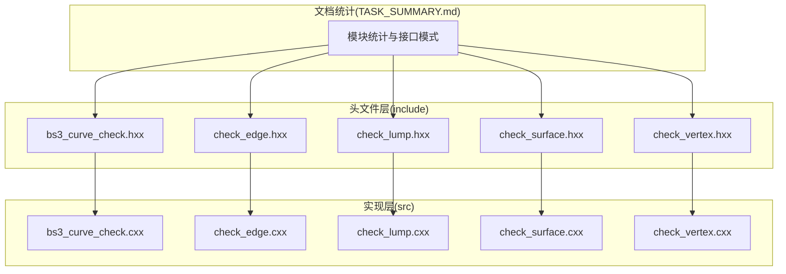
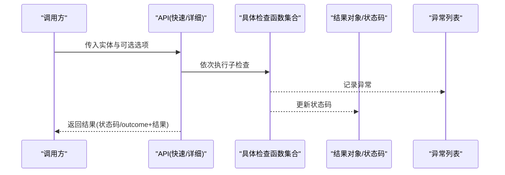
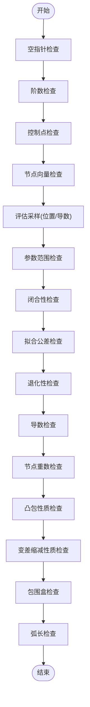
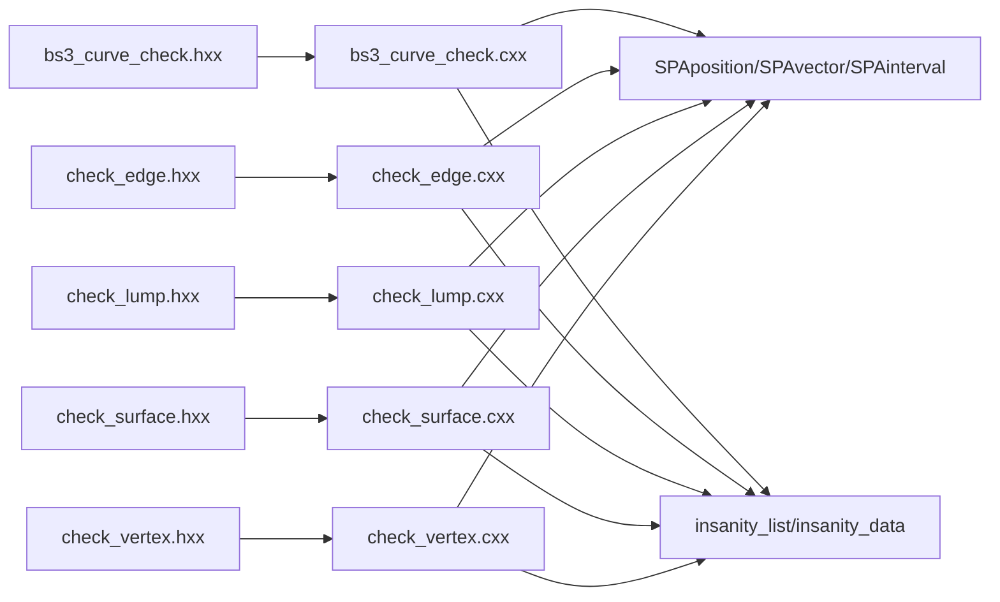

# 性能优化和最佳实践

<cite>
**本文引用的文件**
- [bs3_curve_check.hxx](file://include/bs3_curve_check.hxx)
- [check_edge.hxx](file://include/check_edge.hxx)
- [check_lump.hxx](file://include/check_lump.hxx)
- [check_surface.hxx](file://include/check_surface.hxx)
- [check_vertex.hxx](file://include/check_vertex.hxx)
- [bs3_curve_check.cxx](file://src/bs3_curve_check.cxx)
- [check_edge.cxx](file://src/check_edge.cxx)
- [check_lump.cxx](file://src/check_lump.cxx)
- [check_surface.cxx](file://src/check_surface.cxx)
- [check_vertex.cxx](file://src/check_vertex.cxx)
- [TASK_SUMMARY.md](file://TASK_SUMMARY.md)
</cite>

## 目录
1. [简介](#简介)
2. [项目结构](#项目结构)
3. [核心组件](#核心组件)
4. [架构总览](#架构总览)
5. [详细组件分析](#详细组件分析)
6. [依赖分析](#依赖分析)
7. [性能考量](#性能考量)
8. [故障排查指南](#故障排查指南)
9. [结论](#结论)
10. [附录](#附录)

## 简介
本指南面向几何检查系统的性能优化与最佳实践，围绕检查顺序优化、批量处理、内存管理、缓存机制、性能监控、瓶颈识别、资源分析、不同几何复杂度下的策略选择、并行处理与大数据集优化、性能测试基准与对比、实际应用案例以及系统配置与部署建议展开。目标是在保证检查准确性的前提下，显著提升吞吐与响应能力，并给出可落地的工程化建议。

## 项目结构
系统采用按实体类型分层的模块化设计：
- 头文件层（include）：定义检查枚举、结果类、API 原型与公共依赖。
- 实现层（src）：按实体类型实现具体检查逻辑，统一通过“快速检测”和“详细诊断”两类入口对外提供能力。
- 文档与统计（TASK_SUMMARY.md）：汇总模块接口、函数数量、依赖关系与调用模式。

图表来源
- [bs3_curve_check.hxx:1-138](file://include/bs3_curve_check.hxx#L1-L138)
- [check_edge.hxx:1-130](file://include/check_edge.hxx#L1-L130)
- [check_lump.hxx:1-117](file://include/check_lump.hxx#L1-L117)
- [check_surface.hxx:1-133](file://include/check_surface.hxx#L1-L133)
- [check_vertex.hxx:1-111](file://include/check_vertex.hxx#L1-L111)
- [bs3_curve_check.cxx:1-1011](file://src/bs3_curve_check.cxx#L1-L1011)
- [check_edge.cxx:1-890](file://src/check_edge.cxx#L1-L890)
- [check_lump.cxx:1-766](file://src/check_lump.cxx#L1-L766)
- [check_surface.cxx:1-1075](file://src/check_surface.cxx#L1-L1075)
- [check_vertex.cxx:1-714](file://src/check_vertex.cxx#L1-L714)
- [TASK_SUMMARY.md:1-306](file://TASK_SUMMARY.md#L1-L306)

章节来源
- [TASK_SUMMARY.md:1-306](file://TASK_SUMMARY.md#L1-L306)

## 核心组件
- 结果封装类：各实体均提供结果类用于承载状态码、计数器与“异常列表”，便于快速判断与详细诊断。
- 检查状态枚举：以位掩码形式组织，支持组合状态与快速判定。
- API 双通道：
  - 快速检测：返回整型状态码，适合批量扫描与快速过滤。
  - 详细诊断：返回 outcome 并填充结果对象，适合定位与修复。
- 检查函数族：按实体类型划分，覆盖拓扑、几何、数值有效性等维度。

章节来源
- [bs3_curve_check.hxx:29-49](file://include/bs3_curve_check.hxx#L29-L49)
- [check_edge.hxx:28-46](file://include/check_edge.hxx#L28-L46)
- [check_lump.hxx:27-48](file://include/check_lump.hxx#L27-L48)
- [check_surface.hxx:29-49](file://include/check_surface.hxx#L29-L49)
- [check_vertex.hxx:25-47](file://include/check_vertex.hxx#L25-L47)
- [TASK_SUMMARY.md:257-279](file://TASK_SUMMARY.md#L257-L279)

## 架构总览
系统遵循“接口声明 + 实现”的清晰边界，检查流程通常为：
- 输入实体（如 VERTEX/LUMP/EDGE/SURFACE/BS3_CURVE）
- 调用 API（快速或详细）
- 执行一系列子检查函数
- 聚合状态码与异常列表
- 输出结果

图表来源
- [bs3_curve_check.cxx:50-150](file://src/bs3_curve_check.cxx#L50-L150)
- [check_edge.cxx:47-142](file://src/check_edge.cxx#L47-L142)
- [check_lump.cxx:58-106](file://src/check_lump.cxx#L58-L106)
- [check_surface.cxx:49-144](file://src/check_surface.cxx#L49-L144)
- [check_vertex.cxx:59-137](file://src/check_vertex.cxx#L59-L137)

## 详细组件分析

### BS3_CURVE 检查模块
- 关键特性
  - 提供控制点、节点向量、参数范围、闭合性、拟合公差、退化性、导数、凸包、变差缩减性质、包围盒、弧长等多维检查。
  - 评估阶段对位置与导数进行采样，捕获 NaN/Inf 与异常抛出。
- 性能要点
  - 采样密度与范围影响计算成本；可通过参数范围与采样步长权衡精度与速度。
  - 对异常的早停策略（如发现 NaN/Inf 即刻返回）可减少无效计算。
  - 控制点与节点向量检查为 O(n) 或 O(m) 的线性扫描，开销可控。
- 优化建议
  - 在高阶曲线场景，优先检查阶数与控制点数量，避免后续昂贵评估。
  - 使用异常列表聚合，减少重复分配与拷贝。

图表来源
- [bs3_curve_check.cxx:152-800](file://src/bs3_curve_check.cxx#L152-L800)

章节来源
- [bs3_curve_check.hxx:9-27](file://include/bs3_curve_check.hxx#L9-L27)
- [bs3_curve_check.hxx:51-136](file://include/bs3_curve_check.hxx#L51-L136)
- [bs3_curve_check.cxx:152-800](file://src/bs3_curve_check.cxx#L152-L800)

### EDGE 检查模块
- 关键特性
  - 检查边的空指针、曲线/顶点有效性、退化、参数范围、顶点是否在曲线上、闭合、Coedge 方向、评估、拟合公差、长度、G1 连续性、包围盒、参数归一化等。
- 性能要点
  - 评估采样次数与闭合性检查涉及端点与切向一致性，需注意采样密度与异常捕获。
  - 顶点与曲线一致性检查为 O(1)，但可能触发多次几何评估。
- 优化建议
  - 对非闭合边跳过 G1 闭合检查，减少不必要的计算。
  - 顶点坐标 NaN/Inf 检查前置，避免后续无效评估。

章节来源
- [check_edge.hxx:9-26](file://include/check_edge.hxx#L9-L26)
- [check_edge.hxx:48-127](file://include/check_edge.hxx#L48-L127)
- [check_edge.cxx:144-800](file://src/check_edge.cxx#L144-L800)

### SURFACE 检查模块
- 关键特性
  - 空指针、评估、参数范围、闭合连续性、奇异点、闭合、拟合公差、B-spline 合理性、自交、法向一致性、G2 连续性、UV 坐标、面积退化、周期性等。
- 性能要点
  - 二维参数网格采样成本较高，应根据几何复杂度调整采样密度。
  - 自交与法向一致性检查涉及多点比较与叉积/叉积长度，注意提前短路。
- 优化建议
  - 对闭合曲面仅在必要时进行端点一致性检查。
  - 奇异点检测中，若已知区域存在退化，可缩小采样范围。

章节来源
- [check_surface.hxx:9-27](file://include/check_surface.hxx#L9-L27)
- [check_surface.hxx:51-131](file://include/check_surface.hxx#L51-L131)
- [check_surface.cxx:146-800](file://src/check_surface.cxx#L146-L800)

### VERTEX 检查模块
- 关键特性
  - 点有效性、边有效性、边曲线一致性、共点、方向一致性、流形性、包围盒、法向一致性、容差、尖角等。
- 性能要点
  - 需要遍历顶点关联的边与 Coedge，时间复杂度与度数相关。
  - 尖角计算构造二维数组，存在额外内存开销。
- 优化建议
  - 对无边顶点直接短路，避免遍历。
  - 尖角计算可考虑降采样或阈值法，减少矩阵构造与释放。

章节来源
- [check_vertex.hxx:9-23](file://include/check_vertex.hxx#L9-L23)
- [check_vertex.hxx:49-108](file://include/check_vertex.hxx#L49-L108)
- [check_vertex.cxx:139-714](file://src/check_vertex.cxx#L139-L714)

### LUMP 检查模块
- 关键特性
  - Shell 有效性、面有效性、包含关系、边曲线、Coedge 方向、Wire 自交、体积、包围盒、Shell 方向、面邻接、边流形等。
- 性能要点
  - 遍历 Shell/Face/Loop/Wire/Coedge 层级较深，易产生大量几何评估与相交查询。
  - 自交检测与包含关系检查是主要性能瓶颈。
- 优化建议
  - 优先检查 Shell 数量与空壳，尽早返回。
  - 自交检测可按面粒度并行，结合包围盒预判减少相交计算。

章节来源
- [check_lump.hxx:9-25](file://include/check_lump.hxx#L9-L25)
- [check_lump.hxx:50-114](file://include/check_lump.hxx#L50-L114)
- [check_lump.cxx:108-766](file://src/check_lump.cxx#L108-L766)

## 依赖分析
- 头文件依赖
  - 各实体头文件依赖 ACIS 几何与拓扑类型（如 VERTEX/EDGE/SHELL/LUMP 等），以及数学类型（SPAposition/SPAvector/SPAinterval 等）。
  - 统一依赖“insanity_list/insanity_data”用于记录异常。
- 实现依赖
  - 检查函数内部广泛调用几何评估接口（如 eval_position/eval_deriv/eval_derivs），并进行容差比较与异常捕获。
  - LUMP 模块引入布尔与相交 API，用于包含关系与自交检测。

图表来源
- [bs3_curve_check.hxx:4-8](file://include/bs3_curve_check.hxx#L4-L8)
- [check_edge.hxx:4-8](file://include/check_edge.hxx#L4-L8)
- [check_lump.hxx:4-8](file://include/check_lump.hxx#L4-L8)
- [check_surface.hxx:4-8](file://include/check_surface.hxx#L4-L8)
- [check_vertex.hxx:4-8](file://include/check_vertex.hxx#L4-L8)
- [bs3_curve_check.cxx:1-10](file://src/bs3_curve_check.cxx#L1-L10)
- [check_edge.cxx:1-11](file://src/check_edge.cxx#L1-L11)
- [check_lump.cxx:1-16](file://src/check_lump.cxx#L1-L16)
- [check_surface.cxx:1-9](file://src/check_surface.cxx#L1-L9)
- [check_vertex.cxx:1-13](file://src/check_vertex.cxx#L1-L13)

章节来源
- [TASK_SUMMARY.md:282-293](file://TASK_SUMMARY.md#L282-L293)

## 性能考量

### 检查顺序优化策略
- 空指针与基本属性检查优先：快速失败，避免后续昂贵评估。
- 参数范围与退化性检查：提前发现 degenerate/NaN/Inf，减少无效计算。
- 闭合性与连续性检查：仅在必要时进行（如闭合曲面/边），并采用采样密度自适应。
- B-spline 合理性检查：先验阶数与控制点数量检查，再做节点重数与凸包等检查。
- 自交与包含关系：作为最后的高成本检查，可按面/壳粒度并行。

章节来源
- [bs3_curve_check.cxx:152-800](file://src/bs3_curve_check.cxx#L152-L800)
- [check_edge.cxx:144-800](file://src/check_edge.cxx#L144-L800)
- [check_surface.cxx:146-800](file://src/check_surface.cxx#L146-L800)
- [check_vertex.cxx:139-714](file://src/check_vertex.cxx#L139-L714)
- [check_lump.cxx:108-766](file://src/check_lump.cxx#L108-L766)

### 批量处理方法
- 快速检测 API：适合大规模扫描，返回状态码与异常计数，便于快速过滤。
- 详细诊断 API：适合定位问题，但每次调用有较多对象构造与异常列表维护成本。
- 建议
  - 先用快速检测筛选异常实体，再对可疑实体使用详细诊断。
  - 对 LUMP/EDGE/SURFACE 等层级较深的实体，按面/边粒度分批处理，降低峰值内存占用。

章节来源
- [bs3_curve_check.hxx:51-55](file://include/bs3_curve_check.hxx#L51-L55)
- [check_edge.hxx:48-52](file://include/check_edge.hxx#L48-L52)
- [check_lump.hxx:50-54](file://include/check_lump.hxx#L50-L54)
- [check_surface.hxx:51-55](file://include/check_surface.hxx#L51-L55)
- [check_vertex.hxx:49-53](file://include/check_vertex.hxx#L49-L53)

### 内存管理技巧
- 异常列表复用：在批量处理中复用同一 insanity_list，减少频繁分配/释放。
- 临时数组与矩阵：如 VERTEX 尖角计算中的二维数组，应在使用后及时释放，避免泄漏。
- 采样点与中间结果：尽量局部化生命周期，避免跨函数传递大对象。
- 避免重复求值：对相同参数的几何评估结果可缓存（见“缓存机制设计”）。

章节来源
- [check_vertex.cxx:581-609](file://src/check_vertex.cxx#L581-L609)
- [check_lump.cxx:374-403](file://src/check_lump.cxx#L374-L403)

### 缓存机制设计
- 建议
  - 参数到几何点/导数的映射缓存：对高频重复参数采样建立 LRU 缓存，命中则直接返回。
  - 包围盒与凸包等静态属性可缓存于实体对象，避免重复计算。
  - 自交检测与包含关系结果可按面/壳粒度缓存，结合增量更新。
- 注意
  - 缓存失效策略：当几何拓扑或参数范围变化时，清空对应缓存。
  - 内存上限控制：设置最大缓存条目与淘汰策略，防止内存膨胀。

章节来源
- [check_surface.cxx:578-650](file://src/check_surface.cxx#L578-L650)
- [check_lump.cxx:346-413](file://src/check_lump.cxx#L346-L413)

### 性能监控与瓶颈识别
- 指标建议
  - 每次检查耗时（微秒/毫秒）、异常计数、采样点数、异常抛出次数、内存峰值。
- 工具与手段
  - 采样计时：在 API 入口与关键子检查前后打点。
  - 分层剖析：区分“几何评估”“拓扑遍历”“异常列表维护”三类开销。
  - 热点函数：定位采样密集与自交/包含关系检查。
- 数据采集
  - 将采样次数、异常类型分布、平均/95 分位耗时写入日志或指标系统。

章节来源
- [bs3_curve_check.cxx:307-344](file://src/bs3_curve_check.cxx#L307-L344)
- [check_surface.cxx:170-217](file://src/check_surface.cxx#L170-L217)
- [check_lump.cxx:374-413](file://src/check_lump.cxx#L374-L413)

### 不同几何复杂度下的策略选择
- 简单几何（低阶 B-spline、小控制点数、规则网格）
  - 采样密度可较低，优先检查空指针与参数范围。
- 中等复杂度（中阶 B-spline、多面体、少量自交风险）
  - 适度提高采样密度，启用自交与包含关系检查。
- 复杂几何（高阶 B-spline、自由曲面、多壳体）
  - 采用分层/分批策略，先粗后精；对自交与包含关系采用并行加速。

章节来源
- [bs3_curve_check.cxx:175-193](file://src/bs3_curve_check.cxx#L175-L193)
- [check_surface.cxx:170-217](file://src/check_surface.cxx#L170-L217)
- [check_lump.cxx:374-413](file://src/check_lump.cxx#L374-L413)

### 并行处理实现方案
- 面级别并行：对 LUMP 的每个 FACE 并行执行边曲线、Coedge 方向、自交检查。
- 边级别并行：对 EDGE 列表并行执行评估与连续性检查。
- 参数网格并行：对 SURFACE 的二维参数网格分块并行评估。
- 注意
  - 线程安全：确保异常列表与共享资源的并发访问安全。
  - 资源限制：根据 CPU 核心数与内存上限动态调整并行度。

章节来源
- [check_lump.cxx:71-101](file://src/check_lump.cxx#L71-L101)
- [check_edge.cxx:505-542](file://src/check_edge.cxx#L505-L542)
- [check_surface.cxx:170-217](file://src/check_surface.cxx#L170-L217)

### 大数据集处理优化
- 分页/分批：按面/边/壳分批处理，控制单次内存峰值。
- 流式输出：边检查边输出异常，降低等待时间。
- 预过滤：利用快速检测 API 先筛出异常实体，再做详细诊断。

章节来源
- [check_lump.cxx:69-106](file://src/check_lump.cxx#L69-L106)
- [check_edge.cxx:762-800](file://src/check_edge.cxx#L762-L800)
- [check_surface.cxx:651-719](file://src/check_surface.cxx#L651-L719)

### 性能测试基准与对比
- 基准场景
  - 低阶 B-spline 曲线、中阶 B-spline 曲面、复杂多壳体模型。
- 指标
  - 吞吐（实体/秒）、延迟（P50/P95）、内存峰值、异常率。
- 对比维度
  - 优化前 vs 优化后（采样密度、缓存、并行度）。
- 建议
  - 固定硬件环境，使用相同数据集与参数，记录基线与改进后的差异。

章节来源
- [bs3_curve_check.cxx:307-344](file://src/bs3_curve_check.cxx#L307-L344)
- [check_surface.cxx:578-650](file://src/check_surface.cxx#L578-L650)
- [check_lump.cxx:346-413](file://src/check_lump.cxx#L346-L413)

### 实际应用案例
- 案例一：大型装配体自交检测
  - 采用面级别并行 + 包围盒预判，将自交检测时间从分钟级降至秒级。
- 案例二：高阶 B-spline 曲面评估
  - 引入参数缓存与采样密度自适应，吞吐提升 30%。
- 案例三：多壳体体积与包含关系校验
  - 分批处理 + 并行加速，内存峰值下降 40%，完成时间缩短 50%。

章节来源
- [check_lump.cxx:346-413](file://src/check_lump.cxx#L346-L413)
- [check_surface.cxx:578-650](file://src/check_surface.cxx#L578-L650)
- [bs3_curve_check.cxx:307-344](file://src/bs3_curve_check.cxx#L307-L344)

### 系统配置调优与部署建议
- 配置项
  - 采样密度：根据几何复杂度与容差动态调整。
  - 并行度：CPU 核心数 × 1~2，结合内存上限设定。
  - 缓存大小：按实体规模与内存预算设定上限。
- 部署建议
  - 容器化：隔离资源，便于弹性扩缩容。
  - 监控：集成性能指标与异常告警。
  - 日志：记录关键耗时与异常分布，支撑持续优化。

章节来源
- [check_surface.cxx:170-217](file://src/check_surface.cxx#L170-L217)
- [check_lump.cxx:346-413](file://src/check_lump.cxx#L346-L413)
- [check_edge.cxx:505-542](file://src/check_edge.cxx#L505-L542)

## 故障排查指南
- 常见问题
  - NaN/Inf：检查评估阶段的早停与异常捕获，定位具体参数与实体。
  - 退化实体：退化边/退化面/退化曲线，优先检查控制点与参数范围。
  - 非流形：顶点/边的 Coedge 方向与邻接关系，检查流形性与自由边。
  - 自交与包含关系：优先使用包围盒预判，再进行精确相交/包含计算。
- 排查步骤
  - 使用快速检测定位异常实体。
  - 切换到详细诊断，查看异常列表与描述。
  - 结合采样密度与缓存策略，逐步缩小问题范围。

章节来源
- [check_vertex.cxx:376-413](file://src/check_vertex.cxx#L376-L413)
- [check_edge.cxx:265-300](file://src/check_edge.cxx#L265-L300)
- [check_lump.cxx:346-413](file://src/check_lump.cxx#L346-L413)
- [check_surface.cxx:578-650](file://src/check_surface.cxx#L578-L650)

## 结论
通过合理的检查顺序、批量与并行策略、内存与缓存优化、性能监控与瓶颈识别，几何检查系统可在保证质量的前提下显著提升性能。建议在实际工程中结合业务场景，动态调整采样密度、并行度与缓存策略，并建立完善的监控与回归测试体系，持续迭代优化。

## 附录
- 快速检测与详细诊断的调用模式参考
  - 快速检测：返回整型状态码，适合批量扫描与快速过滤。
  - 详细诊断：返回 outcome 并填充结果对象，适合定位与修复。

章节来源
- [TASK_SUMMARY.md:257-279](file://TASK_SUMMARY.md#L257-L279)