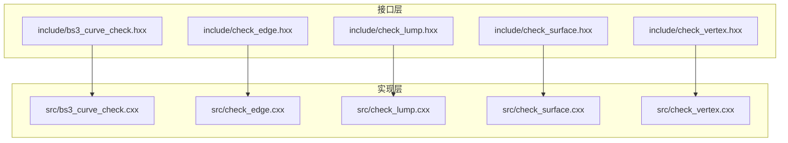
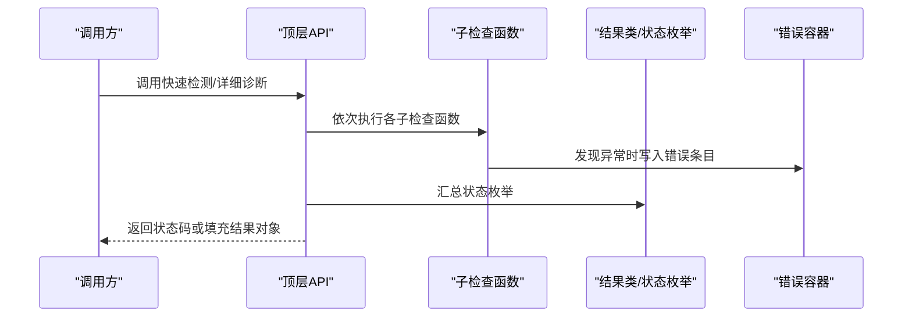
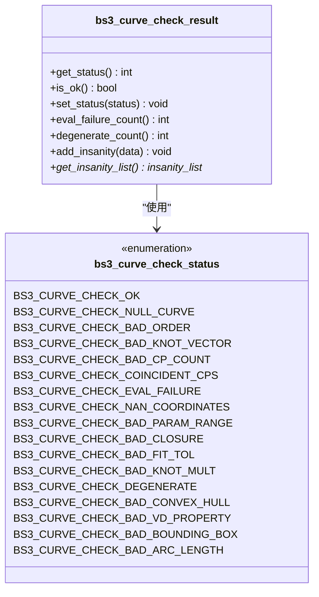
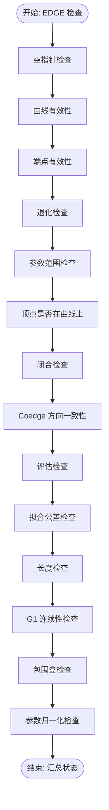
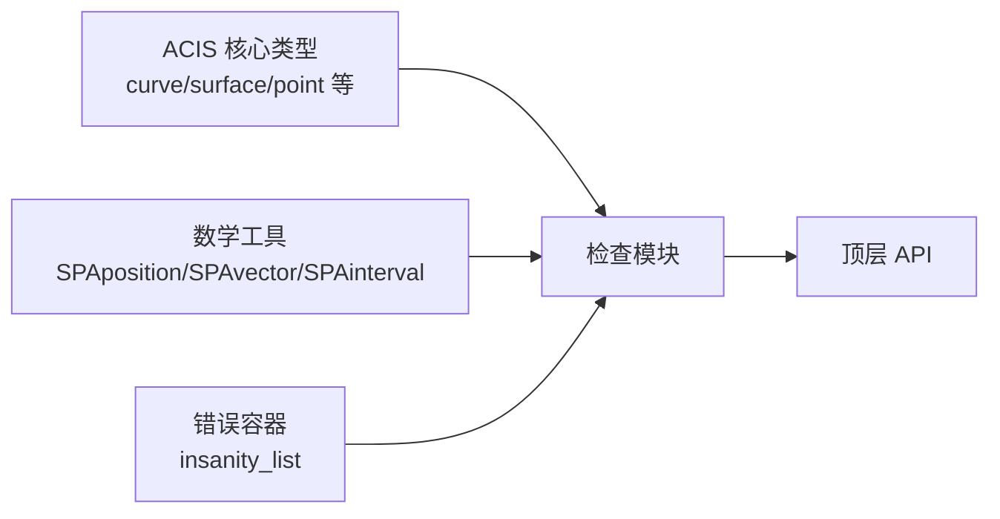

# 扩展开发指南

<cite>
**本文档引用的文件**
- [bs3_curve_check.hxx](file://include/bs3_curve_check.hxx)
- [check_edge.hxx](file://include/check_edge.hxx)
- [check_lump.hxx](file://include/check_lump.hxx)
- [check_surface.hxx](file://include/check_surface.hxx)
- [check_vertex.hxx](file://include/check_vertex.hxx)
- [bs3_curve_check.cxx](file://src/bs3_curve_check.cxx)
- [check_edge.cxx](file://src/check_edge.cxx)
- [check_lump.cxx](file://src/check_lump.cxx)
- [check_surface.cxx](file://src/check_surface.cxx)
- [check_vertex.cxx](file://src/check_vertex.cxx)
- [TASK_SUMMARY.md](file://TASK_SUMMARY.md)
</cite>

## 目录
1. [简介](#简介)
2. [项目结构](#项目结构)
3. [核心组件](#核心组件)
4. [架构总览](#架构总览)
5. [详细组件分析](#详细组件分析)
6. [依赖分析](#依赖分析)
7. [性能考虑](#性能考虑)
8. [故障排查指南](#故障排查指南)
9. [结论](#结论)
10. [附录](#附录)

## 简介
本指南面向需要为几何检查系统开发扩展的工程师，目标是帮助你在现有框架基础上：
- 添加新的几何实体类型（如新增实体类型或子类型）
- 开发自定义检查规则并接入现有检查流水线
- 理解错误报告与结果聚合机制
- 设计可维护的扩展模块，确保与现有接口兼容
- 提供部署、配置与维护更新策略建议

本项目已实现对 LUMP、VERTEX、EDGE、SURFACE、BS3_CURVE 的检查接口与实现，涵盖拓扑、几何、数值有效性等维度，并提供快速检测与详细诊断两类调用模式。

## 项目结构
项目采用“头文件声明 + 源文件实现”的分层组织，按实体类型划分模块，每个模块包含：
- 头文件：对外暴露枚举状态、结果类、API 函数原型
- 源文件：具体检查逻辑、结果聚合、错误报告

图表来源
- [bs3_curve_check.hxx:1-138](file://include/bs3_curve_check.hxx#L1-L138)
- [check_edge.hxx:1-130](file://include/check_edge.hxx#L1-L130)
- [check_lump.hxx:1-117](file://include/check_lump.hxx#L1-L117)
- [check_surface.hxx:1-133](file://include/check_surface.hxx#L1-L133)
- [check_vertex.hxx:1-111](file://include/check_vertex.hxx#L1-L111)
- [bs3_curve_check.cxx:1-1011](file://src/bs3_curve_check.cxx#L1-L1011)
- [check_edge.cxx:1-890](file://src/check_edge.cxx#L1-L890)
- [check_lump.cxx:1-766](file://src/check_lump.cxx#L1-L766)
- [check_surface.cxx:1-1075](file://src/check_surface.cxx#L1-L1075)
- [check_vertex.cxx:1-714](file://src/check_vertex.cxx#L1-L714)

章节来源
- [TASK_SUMMARY.md:9-30](file://TASK_SUMMARY.md#L9-L30)

## 核心组件
- 结果类与状态枚举：每个实体类型均提供独立的结果类与状态枚举，用于封装检查结果与错误集合
- API 函数族：提供两类调用入口
  - 快速检测：返回整型状态码，便于快速判定
  - 详细诊断：返回 outcome 并填充结果对象，包含详细错误列表
- 检查函数：按功能拆分为多个子检查函数，分别负责不同维度的校验（拓扑、几何、数值）

章节来源
- [bs3_curve_check.hxx:29-55](file://include/bs3_curve_check.hxx#L29-L55)
- [check_edge.hxx:28-52](file://include/check_edge.hxx#L28-L52)
- [check_lump.hxx:27-54](file://include/check_lump.hxx#L27-L54)
- [check_surface.hxx:29-55](file://include/check_surface.hxx#L29-L55)
- [check_vertex.hxx:25-53](file://include/check_vertex.hxx#L25-L53)
- [TASK_SUMMARY.md:257-279](file://TASK_SUMMARY.md#L257-L279)

## 架构总览
系统采用“模块化 + 组合式检查”的架构：
- 每个实体类型拥有独立的检查模块，职责清晰
- 通过统一的错误容器（insanity_list）收集检查发现的问题
- 顶层 API 将多个子检查函数串联，最终汇总到状态枚举

图表来源
- [bs3_curve_check.cxx:50-150](file://src/bs3_curve_check.cxx#L50-L150)
- [check_edge.cxx:47-142](file://src/check_edge.cxx#L47-L142)
- [check_lump.cxx:58-106](file://src/check_lump.cxx#L58-L106)
- [check_surface.cxx:49-144](file://src/check_surface.cxx#L49-L144)
- [check_vertex.cxx:59-137](file://src/check_vertex.cxx#L59-L137)

## 详细组件分析

### BS3_CURVE 检查模块
- 功能范围：针对 B 样条曲线进行全面检查，包括空指针、阶数、控制点、节点向量、评估、参数范围、闭合性、拟合公差、退化、导数、节点重数、凸包性质、变差缩减性质、包围盒、弧长等
- 关键接口
  - 顶层 API：api_bs3_curve_check
  - 快速检测：bs3_curve_check
  - 子检查函数：check_bs3_curve_* 系列
  - 结果类：bs3_curve_check_result
  - 状态枚举：bs3_curve_check_status
- 错误报告：通过 insanity_list 收集，最终映射到状态位

图表来源
- [bs3_curve_check.hxx:29-27](file://include/bs3_curve_check.hxx#L29-L27)
- [bs3_curve_check.hxx:9-27](file://include/bs3_curve_check.hxx#L9-L27)

章节来源
- [bs3_curve_check.hxx:1-138](file://include/bs3_curve_check.hxx#L1-L138)
- [bs3_curve_check.cxx:1-1011](file://src/bs3_curve_check.cxx#L1-L1011)

### EDGE 检查模块
- 功能范围：边的空指针、曲线、端点、退化、参数范围、顶点是否在曲线上、闭合、Coedge 方向、评估、拟合公差、长度、G1 连续性、包围盒、参数归一化
- 关键接口
  - 顶层 API：api_check_edge_errors
  - 快速检测：api_check_edge
  - 子检查函数：check_edge_* 系列
  - 结果类：edge_check_result
  - 状态枚举：edge_check_status

图表来源
- [check_edge.cxx:47-142](file://src/check_edge.cxx#L47-L142)

章节来源
- [check_edge.hxx:1-130](file://include/check_edge.hxx#L1-L130)
- [check_edge.cxx:1-890](file://src/check_edge.cxx#L1-L890)

### LUMP 检查模块
- 功能范围：壳有效性、面有效性、包含关系、边曲线有效性、Coedge 方向、Wire 自交、体积、包围盒、壳方向、面邻接、边流形
- 关键接口
  - 顶层 API：api_check_lump
  - 快速检测：api_check_lump_status
  - 子检查函数：check_lump_* / check_shell_* / check_edge_* 等系列
  - 结果类：lump_check_result
  - 状态枚举：lump_check_status

章节来源
- [check_lump.hxx:1-117](file://include/check_lump.hxx#L1-L117)
- [check_lump.cxx:1-766](file://src/check_lump.cxx#L1-L766)

### SURFACE 检查模块
- 功能范围：空指针、评估、参数范围、连续性、奇异点、闭合、拟合公差、B-spline 检查、自交、法向一致性、G2 连续性、UV 坐标、面积退化、周期性
- 关键接口
  - 顶层 API：api_check_surface_ok
  - 快速检测：check_surface_ok
  - 子检查函数：check_surface_* 系列
  - 结果类：surface_check_result
  - 状态枚举：surface_check_status

章节来源
- [check_surface.hxx:1-133](file://include/check_surface.hxx#L1-L133)
- [check_surface.cxx:1-1075](file://src/check_surface.cxx#L1-L1075)

### VERTEX 检查模块
- 功能范围：POINT 有效性、边有效性、边曲线、共点、方向一致性、流形、包围盒、法向一致性、容差、尖角
- 关键接口
  - 顶层 API：api_check_vertex_errors
  - 快速检测：api_check_vertex
  - 子检查函数：check_vertex_* 系列
  - 结果类：vertex_check_result
  - 状态枚举：vertex_check_status

章节来源
- [check_vertex.hxx:1-111](file://include/check_vertex.hxx#L1-L111)
- [check_vertex.cxx:1-714](file://src/check_vertex.cxx#L1-L714)

## 依赖分析
- 头文件依赖：各模块头文件依赖 ACIS 核心类型与数学工具（如 SPAposition、SPAvector、SPAinterval、SPAresabs、SPAresnor）
- 实现依赖：各模块实现依赖 ACIS 的几何与拓扑 API，以及错误报告容器（insanity_list）
- 通用组件：insanity_list 作为统一的错误收集容器，贯穿所有模块

图表来源
- [TASK_SUMMARY.md:282-293](file://TASK_SUMMARY.md#L282-L293)

章节来源
- [TASK_SUMMARY.md:282-293](file://TASK_SUMMARY.md#L282-L293)

## 性能考虑
- 采样密度与精度权衡：评估与连续性检查中存在固定采样次数，可根据模型规模调整采样密度
- 异常处理成本：异常捕获会带来额外开销，应尽量避免在热路径上频繁抛出异常
- 容差常量：合理利用 SPAresabs、SPAresnor 等容差常量，避免过严或过松导致的误判与性能问题
- 早期短路：在发现致命错误（如空指针）时尽早返回，减少后续无效计算

## 故障排查指南
- 快速定位：优先使用快速检测接口，根据状态位快速判断问题类别
- 详细诊断：使用详细诊断接口，遍历结果中的错误列表，获取具体描述与上下文
- 常见问题
  - 空指针：检查输入实体是否为空
  - 参数域异常：检查参数范围是否合法
  - 评估失败：检查几何对象是否可评估
  - 退化/非流形：检查拓扑连接是否正确
  - 容差异常：检查拟合公差与坐标是否合理

章节来源
- [bs3_curve_check.cxx:50-150](file://src/bs3_curve_check.cxx#L50-L150)
- [check_edge.cxx:47-142](file://src/check_edge.cxx#L47-L142)
- [check_lump.cxx:58-106](file://src/check_lump.cxx#L58-L106)
- [check_surface.cxx:49-144](file://src/check_surface.cxx#L49-L144)
- [check_vertex.cxx:59-137](file://src/check_vertex.cxx#L59-L137)

## 结论
本指南提供了几何检查系统扩展开发的完整蓝图：从接口规范、实现模板到错误报告与性能优化均有覆盖。遵循现有模块化与组合式检查的设计思想，可以高效地为新实体类型与自定义规则建立可维护、可扩展的检查体系。

## 附录

### 新几何实体类型添加流程（模板）
- 步骤
  1) 在 include 目录新增头文件，定义状态枚举、结果类、顶层 API 原型
  2) 在 src 目录新增实现文件，实现顶层 API 与若干子检查函数
  3) 在实现中使用 insanity_list 收集错误，并在顶层 API 中映射到状态枚举
  4) 提供两类入口：快速检测（返回状态码）与详细诊断（返回 outcome+结果对象）
  5) 在 TASK_SUMMARY.md 中补充接口清单与统计
- 接口规范要点
  - 状态枚举使用位掩码，避免冲突
  - 结果类提供 is_ok、get_status、get_insanity_list 等常用方法
  - 子检查函数返回 logical，遇到致命错误返回 FALSE
  - 顶层 API 对输入进行基本校验（如类型检查），必要时返回错误 outcome
- 实现模板参考
  - 可参照现有模块的实现风格：先做空指针与基础合法性检查，再进行几何/拓扑评估，最后汇总状态

章节来源
- [bs3_curve_check.hxx:1-138](file://include/bs3_curve_check.hxx#L1-L138)
- [check_edge.hxx:1-130](file://include/check_edge.hxx#L1-L130)
- [check_lump.hxx:1-117](file://include/check_lump.hxx#L1-L117)
- [check_surface.hxx:1-133](file://include/check_surface.hxx#L1-L133)
- [check_vertex.hxx:1-111](file://include/check_vertex.hxx#L1-L111)
- [bs3_curve_check.cxx:1-1011](file://src/bs3_curve_check.cxx#L1-L1011)
- [check_edge.cxx:1-890](file://src/check_edge.cxx#L1-L890)
- [check_lump.cxx:1-766](file://src/check_lump.cxx#L1-L766)
- [check_surface.cxx:1-1075](file://src/check_surface.cxx#L1-L1075)
- [check_vertex.cxx:1-714](file://src/check_vertex.cxx#L1-L714)

### 自定义检查规则开发方法
- 规则设计
  - 明确检查维度（拓扑、几何、数值）
  - 使用 logical 返回值与 insanity_list 记录错误
  - 合理设置容差与采样密度
- 注册机制
  - 在现有模块的顶层 API 中增加对新子检查函数的调用
  - 在状态枚举中新增对应状态位
  - 在顶层 API 的状态映射逻辑中加入新状态位
- 错误报告集成
  - 使用 insanity_list.add(insanity_data) 写入错误
  - 在顶层 API 中遍历错误列表，按描述关键字映射到状态位

章节来源
- [bs3_curve_check.cxx:50-150](file://src/bs3_curve_check.cxx#L50-L150)
- [check_edge.cxx:47-142](file://src/check_edge.cxx#L47-L142)
- [check_lump.cxx:58-106](file://src/check_lump.cxx#L58-L106)
- [check_surface.cxx:49-144](file://src/check_surface.cxx#L49-L144)
- [check_vertex.cxx:59-137](file://src/check_vertex.cxx#L59-L137)

### 插件系统设计原理与动态加载
- 当前现状
  - 代码以静态库形式组织，未见显式的动态加载机制
- 设计建议
  - 采用“接口 + 工厂”模式：定义统一的检查接口，通过工厂函数注册不同实体类型的检查器
  - 使用符号导出与链接器选项支持动态库加载（平台相关）
  - 版本号与 ABI 稳定性：通过语义化版本与稳定的接口签名保证兼容
- 注意事项
  - 避免破坏现有 API 签名
  - 统一错误容器与容差常量的使用

[本节为概念性内容，不直接分析具体文件]

### 版本兼容性保证
- 接口稳定性：保持现有 API 的返回类型与参数不变
- 状态枚举扩展：新增状态位时，保留已有位值，避免破坏既有判断逻辑
- 错误报告格式：保持 insanity_list 的使用方式不变

[本节为通用指导，不直接分析具体文件]

### 最佳实践与代码规范
- 命名规范：遵循现有命名风格（模块名 + 检查函数前缀）
- 错误处理：优先使用逻辑返回值与错误容器，避免在关键路径上抛异常
- 容差使用：统一使用 SPAresabs、SPAresnor 等常量
- 文档与注释：为每个检查函数提供简要说明，便于维护

[本节为通用指导，不直接分析具体文件]

### 测试验证方法
- 单元测试：针对每个子检查函数编写边界条件测试（空指针、NaN、Inf、退化等）
- 集成测试：使用真实几何模型验证顶层 API 的行为与状态映射
- 回归测试：在新增规则后运行现有测试集，确保不引入回归

[本节为通用指导，不直接分析具体文件]

### 部署方式、配置管理与维护更新
- 部署
  - 编译为静态库或动态库，随应用一起发布
  - 提供头文件与二进制库，确保 ABI 稳定
- 配置管理
  - 通过 AcisOptions 参数传递检查选项（如采样密度、容差阈值）
  - 在 TASK_SUMMARY.md 中记录接口变更与版本信息
- 维护更新
  - 严格遵循接口稳定性原则
  - 通过补丁或小版本升级修复问题，避免大版本破坏性变更

[本节为通用指导，不直接分析具体文件]