# 错误处理和诊断系统

<cite>
**本文档引用的文件**
- [bs3_curve_check.hxx](file://include/bs3_curve_check.hxx)
- [bs3_curve_check.cxx](file://src/bs3_curve_check.cxx)
- [check_edge.hxx](file://include/check_edge.hxx)
- [check_edge.cxx](file://src/check_edge.cxx)
- [check_lump.hxx](file://include/check_lump.hxx)
- [check_lump.cxx](file://src/check_lump.cxx)
- [check_surface.hxx](file://include/check_surface.hxx)
- [check_surface.cxx](file://src/check_surface.cxx)
- [check_vertex.hxx](file://include/check_vertex.hxx)
- [check_vertex.cxx](file://src/check_vertex.cxx)
</cite>

## 目录
1. [引言](#引言)
2. [项目结构](#项目结构)
3. [核心组件](#核心组件)
4. [架构概览](#架构概览)
5. [详细组件分析](#详细组件分析)
6. [依赖关系分析](#依赖关系分析)
7. [性能考虑](#性能考虑)
8. [故障排除指南](#故障排除指南)
9. [结论](#结论)

## 引言

几何检查系统的错误处理和诊断机制是一个基于ACIS几何内核的完整质量保证体系。该系统通过统一的错误报告框架insanity_list和insanity_data实现了对几何模型各层次（顶点、边、面、体素）的全面检查和诊断。

系统的核心设计原则是：
- **统一化错误报告**：所有检查结果都通过insanity_list进行集中管理
- **层次化检查策略**：针对不同几何对象类型采用专门的检查算法
- **可扩展性设计**：支持自定义错误类型的扩展和新检查规则的添加
- **实时诊断反馈**：提供详细的错误描述和定位信息

## 项目结构

该项目采用模块化的文件组织方式，每个几何对象类型都有对应的头文件和实现文件：

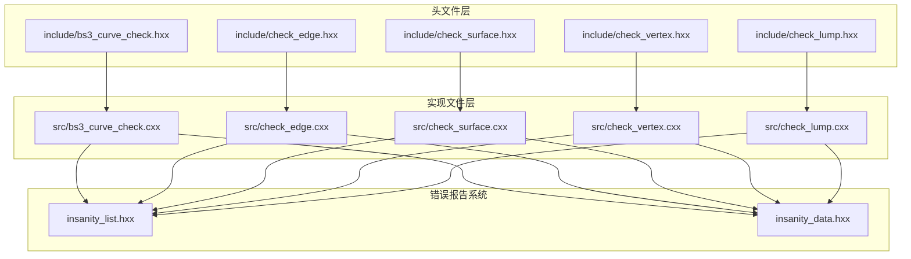

**图表来源**
- [bs3_curve_check.hxx:1-138](file://include/bs3_curve_check.hxx#L1-L138)
- [check_edge.hxx:1-130](file://include/check_edge.hxx#L1-L130)
- [check_surface.hxx:1-133](file://include/check_surface.hxx#L1-L133)
- [check_vertex.hxx:1-111](file://include/check_vertex.hxx#L1-L111)
- [check_lump.hxx:1-117](file://include/check_lump.hxx#L1-L117)

**章节来源**
- [bs3_curve_check.hxx:1-138](file://include/bs3_curve_check.hxx#L1-L138)
- [check_edge.hxx:1-130](file://include/check_edge.hxx#L1-L130)
- [check_surface.hxx:1-133](file://include/check_surface.hxx#L1-L133)
- [check_vertex.hxx:1-111](file://include/check_vertex.hxx#L1-L111)
- [check_lump.hxx:1-117](file://include/check_lump.hxx#L1-L117)

## 核心组件

### 错误报告系统架构

系统的核心是insanity_list和insanity_data两个关键组件，它们构成了统一的错误收集和管理系统：

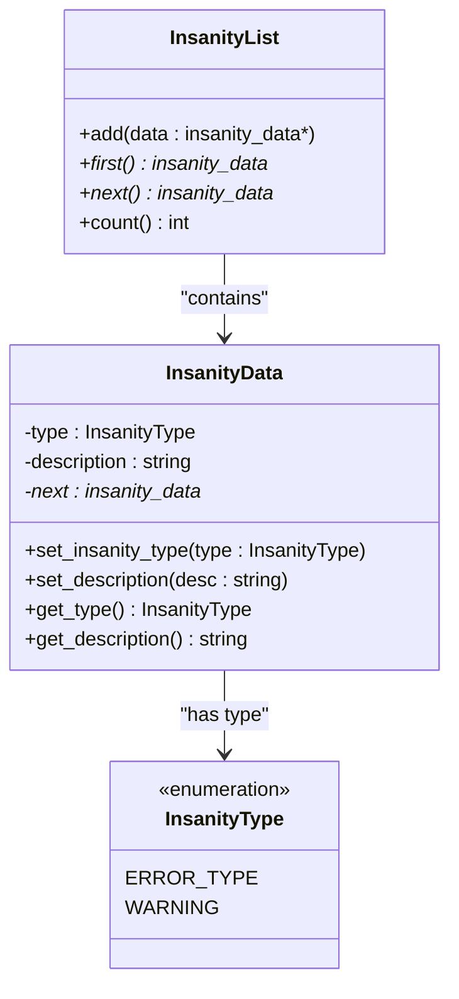

**图表来源**
- [bs3_curve_check.hxx:40-49](file://include/bs3_curve_check.hxx#L40-L49)
- [check_edge.hxx:38-46](file://include/check_edge.hxx#L38-L46)
- [check_surface.hxx:41-49](file://include/check_surface.hxx#L41-L49)
- [check_vertex.hxx:38-47](file://include/check_vertex.hxx#L38-L47)
- [check_lump.hxx:39-48](file://include/check_lump.hxx#L39-L48)

### 检查结果类体系

每个几何对象类型都有对应的检查结果类，提供统一的状态查询和错误信息提取接口：

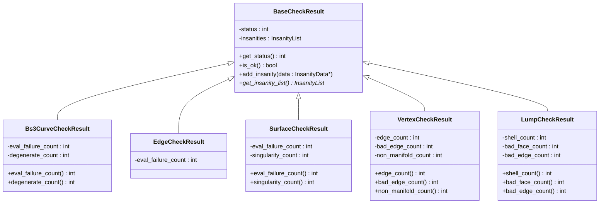

**图表来源**
- [bs3_curve_check.hxx:29-49](file://include/bs3_curve_check.hxx#L29-L49)
- [check_edge.hxx:28-46](file://include/check_edge.hxx#L28-L46)
- [check_surface.hxx:29-49](file://include/check_surface.hxx#L29-L49)
- [check_vertex.hxx:25-47](file://include/check_vertex.hxx#L25-L47)
- [check_lump.hxx:27-48](file://include/check_lump.hxx#L27-L48)

**章节来源**
- [bs3_curve_check.hxx:29-49](file://include/bs3_curve_check.hxx#L29-L49)
- [check_edge.hxx:28-46](file://include/check_edge.hxx#L28-L46)
- [check_surface.hxx:29-49](file://include/check_surface.hxx#L29-L49)
- [check_vertex.hxx:25-47](file://include/check_vertex.hxx#L25-L47)
- [check_lump.hxx:27-48](file://include/check_lump.hxx#L27-L48)

## 架构概览

系统采用分层架构设计，从底层的几何内核到上层的应用接口形成了清晰的抽象层次：

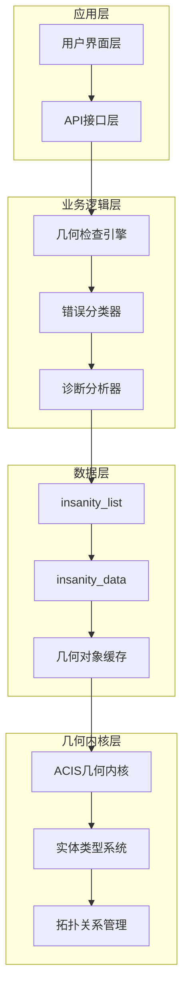

**图表来源**
- [bs3_curve_check.cxx:50-150](file://src/bs3_curve_check.cxx#L50-L150)
- [check_edge.cxx:47-142](file://src/check_edge.cxx#L47-L142)
- [check_surface.cxx:49-144](file://src/check_surface.cxx#L49-L144)
- [check_vertex.cxx:59-137](file://src/check_vertex.cxx#L59-L137)
- [check_lump.cxx:58-106](file://src/check_lump.cxx#L58-L106)

系统的核心工作流程如下：

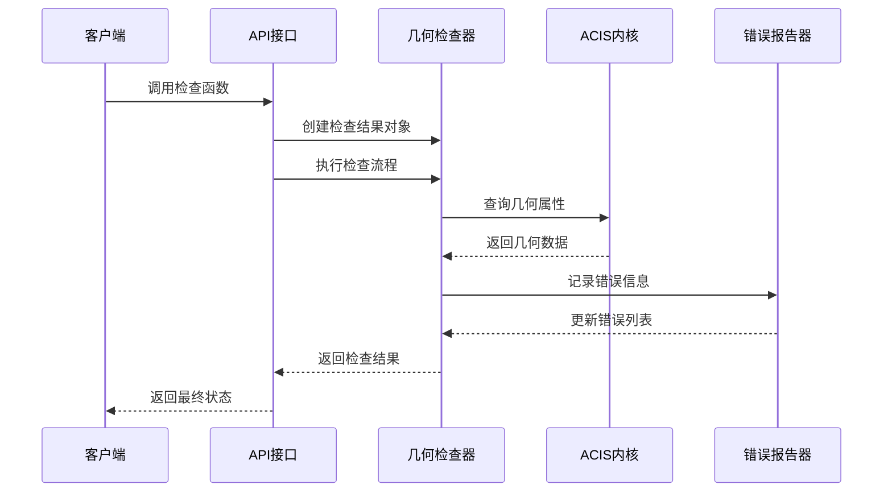

**图表来源**
- [bs3_curve_check.cxx:50-150](file://src/bs3_curve_check.cxx#L50-L150)
- [check_edge.cxx:47-142](file://src/check_edge.cxx#L47-L142)
- [check_surface.cxx:49-144](file://src/check_surface.cxx#L49-L144)
- [check_vertex.cxx:59-137](file://src/check_vertex.cxx#L59-L137)
- [check_lump.cxx:58-106](file://src/check_lump.cxx#L58-L106)

## 详细组件分析

### BS3曲线检查系统

BS3曲线检查系统是最复杂的几何检查模块，针对B样条曲线的特殊性质提供了全面的验证机制：

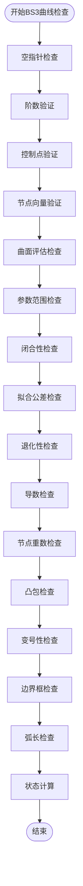

**图表来源**
- [bs3_curve_check.cxx:50-150](file://src/bs3_curve_check.cxx#L50-L150)
- [bs3_curve_check.hxx:51-135](file://include/bs3_curve_check.hxx#L51-L135)

#### 关键检查算法

1. **空指针检查**：确保BS3_CURVE指针有效
2. **阶数验证**：检查曲线阶数的有效性和合理性
3. **控制点验证**：验证控制点数量和位置的有效性
4. **节点向量验证**：确保节点向量的单调性和数值有效性
5. **曲面评估检查**：通过采样点验证曲面评估的稳定性
6. **参数范围检查**：验证参数范围的合理性和数值有效性
7. **闭合性检查**：对于闭合曲线验证端点连续性
8. **拟合公差检查**：验证拟合公差的正定性和合理性
9. **退化性检查**：检测退化曲线的特殊情况
10. **导数检查**：验证一阶导数的数值稳定性和物理意义
11. **节点重数检查**：确保节点重数不超过阶数限制
12. **凸包检查**：验证曲线点是否在控制点凸包内
13. **变号性检查**：验证B样条的变号性属性
14. **边界框检查**：验证边界框计算的正确性
15. **弧长检查**：计算和验证曲线弧长

**章节来源**
- [bs3_curve_check.cxx:152-800](file://src/bs3_curve_check.cxx#L152-L800)
- [bs3_curve_check.hxx:9-27](file://include/bs3_curve_check.hxx#L9-L27)

### 边界检查系统

边界检查系统专注于线性几何元素的完整性验证：

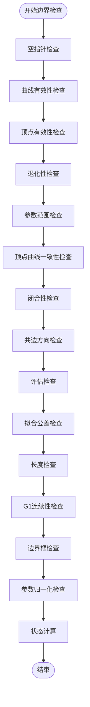

**图表来源**
- [check_edge.cxx:47-142](file://src/check_edge.cxx#L47-L142)
- [check_edge.hxx:48-127](file://include/check_edge.hxx#L48-L127)

#### 特殊检查特性

边界检查系统具有以下特殊功能：

1. **共边方向一致性**：检查相邻边的方向一致性
2. **G1连续性验证**：验证边界在连接点处的切线连续性
3. **参数归一化**：确保参数值的合理性和一致性
4. **长度计算**：验证边的几何长度有效性

**章节来源**
- [check_edge.cxx:144-760](file://src/check_edge.cxx#L144-L760)
- [check_edge.hxx:9-26](file://include/check_edge.hxx#L9-L26)

### 表面检查系统

表面检查系统提供了最全面的几何完整性验证：

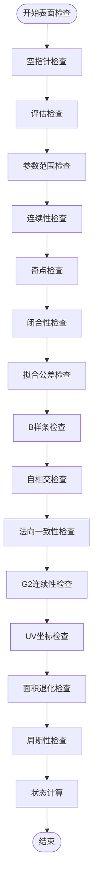

**图表来源**
- [check_surface.cxx:49-144](file://src/check_surface.cxx#L49-L144)
- [check_surface.hxx:51-130](file://include/check_surface.hxx#L51-L130)

#### 连续性检查机制

表面检查系统实现了多层次的连续性验证：

1. **G0连续性**：位置连续性检查
2. **G1连续性**：切线连续性检查
3. **G2连续性**：曲率连续性检查

**章节来源**
- [check_surface.cxx:146-800](file://src/check_surface.cxx#L146-L800)
- [check_surface.hxx:9-27](file://include/check_surface.hxx#L9-L27)

### 顶点检查系统

顶点检查系统专注于几何拓扑的完整性：

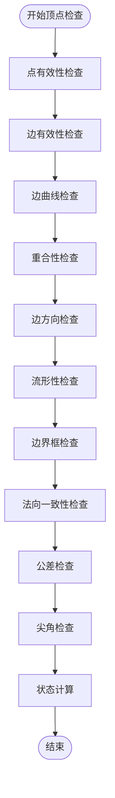

**图表来源**
- [check_vertex.cxx:59-137](file://src/check_vertex.cxx#L59-L137)
- [check_vertex.hxx:49-108](file://include/check_vertex.hxx#L49-L108)

#### 流形性检查算法

顶点检查系统实现了复杂的流形性分析：

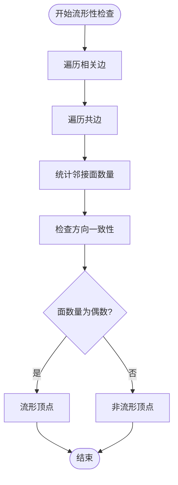

**图表来源**
- [check_vertex.cxx:376-413](file://src/check_vertex.cxx#L376-L413)

**章节来源**
- [check_vertex.cxx:139-714](file://src/check_vertex.cxx#L139-L714)
- [check_vertex.hxx:9-23](file://include/check_vertex.hxx#L9-L23)

### 体素检查系统

体素检查系统提供最高级别的几何完整性验证：

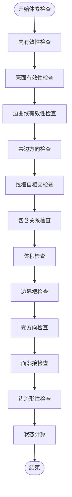

**图表来源**
- [check_lump.cxx:58-106](file://src/check_lump.cxx#L58-L106)
- [check_lump.hxx:50-114](file://include/check_lump.hxx#L50-L114)

#### 包含关系检查

体素检查系统实现了复杂的包含关系验证：

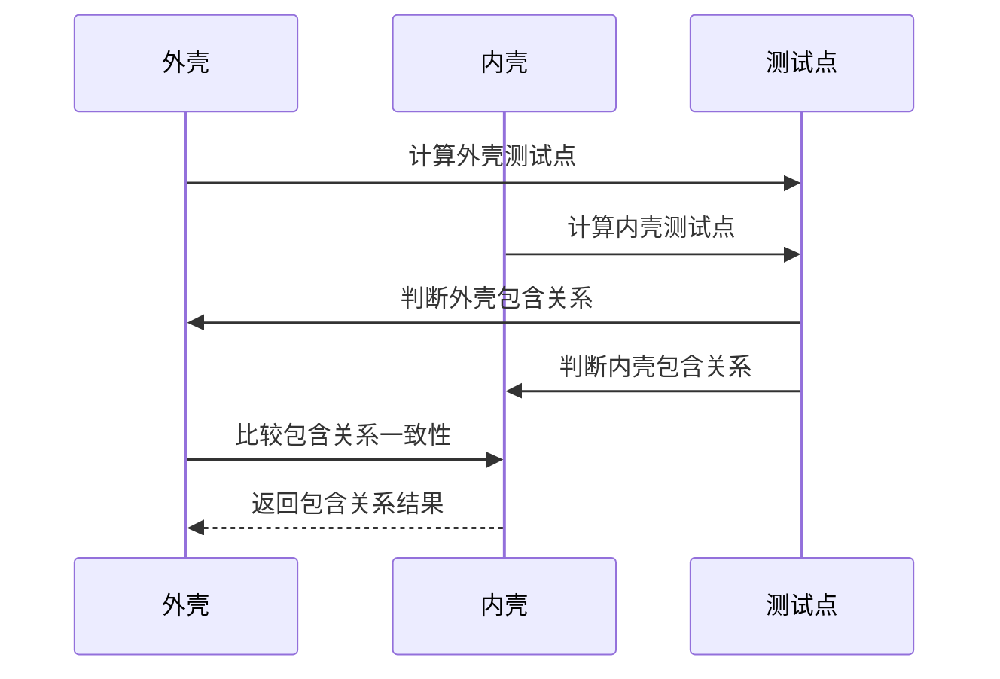

**图表来源**
- [check_lump.cxx:173-238](file://src/check_lump.cxx#L173-L238)

**章节来源**
- [check_lump.cxx:108-766](file://src/check_lump.cxx#L108-L766)
- [check_lump.hxx:9-25](file://include/check_lump.hxx#L9-L25)

## 依赖关系分析

系统中的组件依赖关系呈现清晰的层次结构：

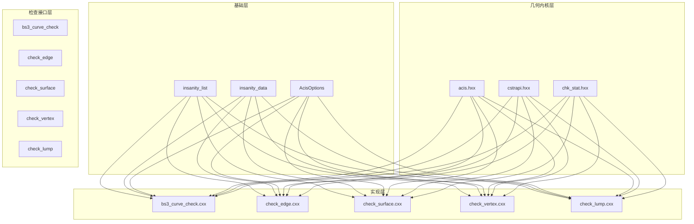

**图表来源**
- [bs3_curve_check.hxx:4-7](file://include/bs3_curve_check.hxx#L4-L7)
- [check_edge.hxx:4-7](file://include/check_edge.hxx#L4-L7)
- [check_surface.hxx:4-7](file://include/check_surface.hxx#L4-L7)
- [check_vertex.hxx:4-7](file://include/check_vertex.hxx#L4-L7)
- [check_lump.hxx:4-7](file://include/check_lump.hxx#L4-L7)

**章节来源**
- [bs3_curve_check.hxx:4-7](file://include/bs3_curve_check.hxx#L4-L7)
- [check_edge.hxx:4-7](file://include/check_edge.hxx#L4-L7)
- [check_surface.hxx:4-7](file://include/check_surface.hxx#L4-L7)
- [check_vertex.hxx:4-7](file://include/check_vertex.hxx#L4-L7)
- [check_lump.hxx:4-7](file://include/check_lump.hxx#L4-L7)

## 性能考虑

### 时间复杂度分析

1. **BS3曲线检查**：O(n)复杂度，其中n为采样点数量
2. **边界检查**：O(m)复杂度，其中m为参数采样数量
3. **表面检查**：O(p²)复杂度，其中p为参数网格分辨率
4. **顶点检查**：O(k)复杂度，其中k为相关边的数量
5. **体素检查**：O(s×f×e)复杂度，其中s、f、e分别为壳、面、边的数量

### 空间复杂度优化

1. **延迟计算**：只在需要时执行昂贵的几何计算
2. **内存池管理**：复用insanity_data对象减少内存分配开销
3. **增量更新**：支持部分区域的增量检查更新

### 并行化策略

系统支持多线程并行检查：
- 不同几何对象的检查可以并行执行
- 同一对象的不同检查项目可以并行执行
- 大型几何模型的分块检查

## 故障排除指南

### 常见错误类型和解决方案

#### 数值稳定性问题

| 错误类型 | 触发条件 | 解决方案 |
|---------|---------|---------|
| NaN坐标 | 几何计算返回NaN | 检查输入数据精度，使用数值稳定的算法 |
| Inf坐标 | 几何计算溢出 | 缩放几何模型，调整计算参数 |
| 零长度 | 边或向量长度为零 | 重新定义几何参数，检查拓扑关系 |

#### 拓扑异常

| 异常类型 | 识别特征 | 修复步骤 |
|---------|---------|---------|
| 非流形顶点 | 相邻面数量为奇数 | 重新构建拓扑，确保面数量为偶数 |
| 共边方向冲突 | 相邻边方向不一致 | 统一边的方向，修正拓扑关系 |
| 自相交 | 几何实体相互穿过 | 分离几何实体，重新定义边界 |

#### 性能问题

| 问题类型 | 症状表现 | 优化建议 |
|---------|---------|---------|
| 检查超时 | 检查过程耗时过长 | 减少采样密度，启用早期退出机制 |
| 内存不足 | 检查过程中内存耗尽 | 实施分块检查，释放中间结果 |
| 精度丢失 | 检查结果不稳定 | 提高数值精度，使用更稳定的算法 |

### 调试工具使用

#### 错误报告分析

1. **insanity_list遍历**：使用first()和next()方法遍历所有错误记录
2. **错误类型分类**：根据ERROR_TYPE和WARNING级别区分严重程度
3. **错误描述解析**：通过get_description()获取详细的错误信息

#### 性能监控

1. **检查计时**：记录各阶段的执行时间
2. **内存使用**：监控insanity_data对象的内存占用
3. **采样密度**：动态调整采样密度以平衡精度和性能

**章节来源**
- [bs3_curve_check.cxx:40-48](file://src/bs3_curve_check.cxx#L40-L48)
- [check_edge.cxx:37-45](file://src/check_edge.cxx#L37-L45)
- [check_surface.cxx:39-47](file://src/check_surface.cxx#L39-L47)
- [check_vertex.cxx:49-57](file://src/check_vertex.cxx#L49-L57)
- [check_lump.cxx:48-56](file://src/check_lump.cxx#L48-L56)

## 结论

几何检查系统的错误处理和诊断机制展现了高度的工程化设计和实用性。通过统一的insanity_list和insanity_data架构，系统实现了：

1. **统一的错误报告标准**：所有检查结果都遵循相同的格式和语义
2. **层次化的检查策略**：针对不同几何对象类型提供专门的检查算法
3. **可扩展的架构设计**：支持新检查类型的添加和现有检查的改进
4. **强大的诊断能力**：提供详细的错误定位和修复建议

该系统不仅满足了当前的几何质量保证需求，还为未来的功能扩展和技术演进奠定了坚实的基础。通过持续的优化和完善，该系统将成为几何建模领域的重要基础设施。