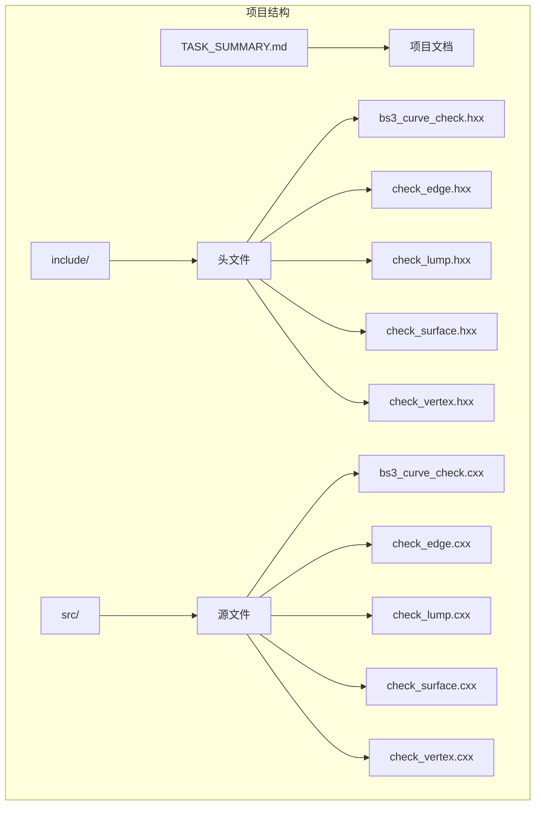
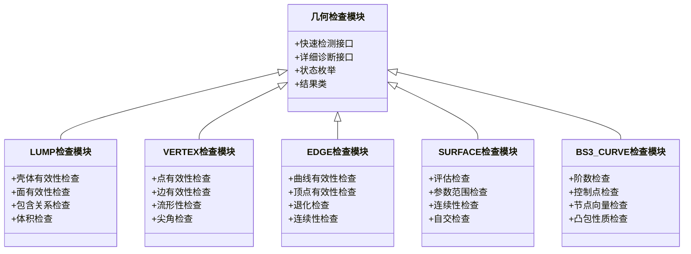
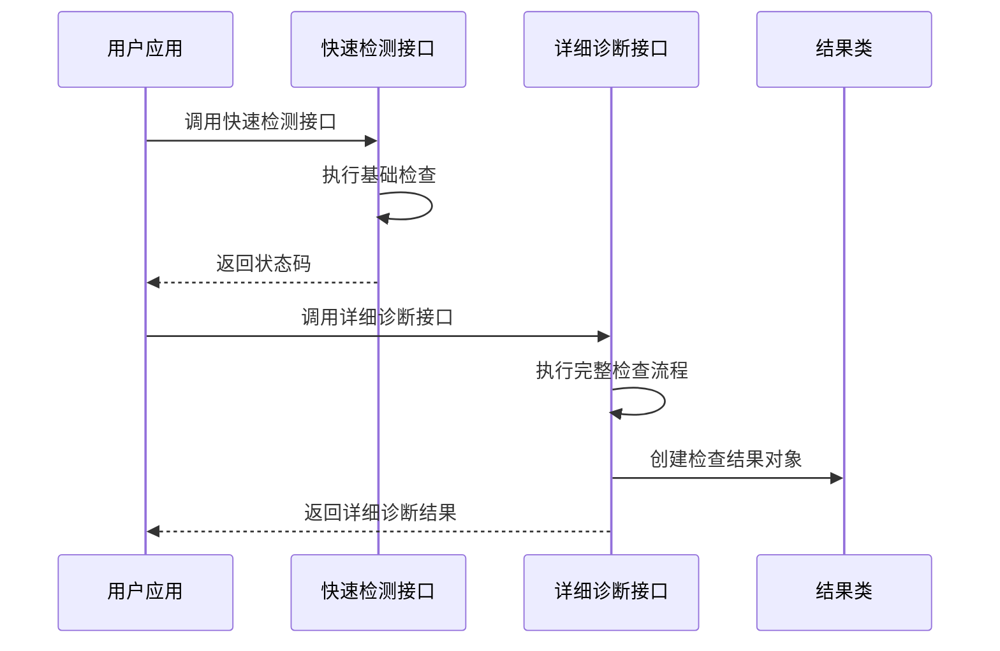
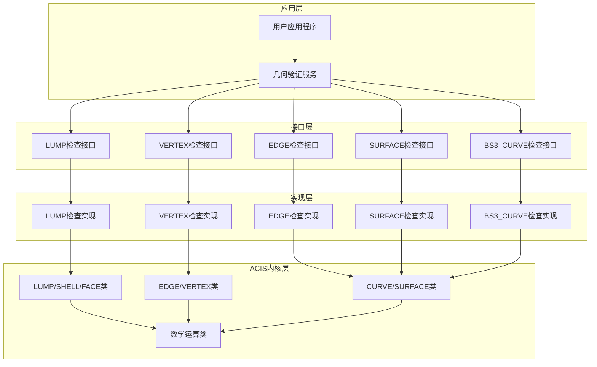
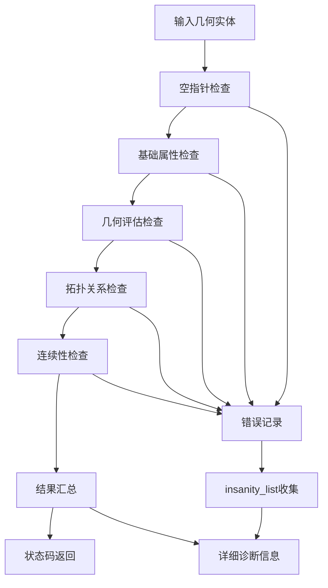
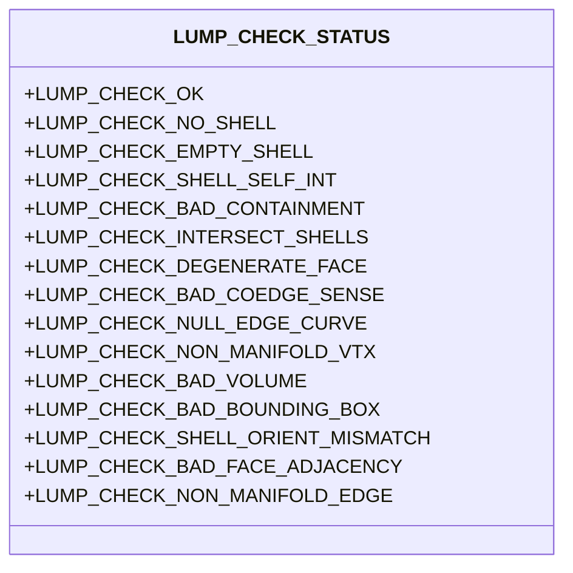
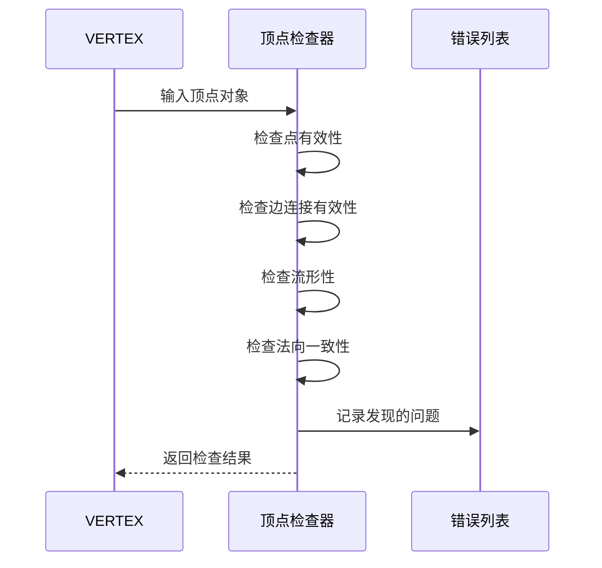
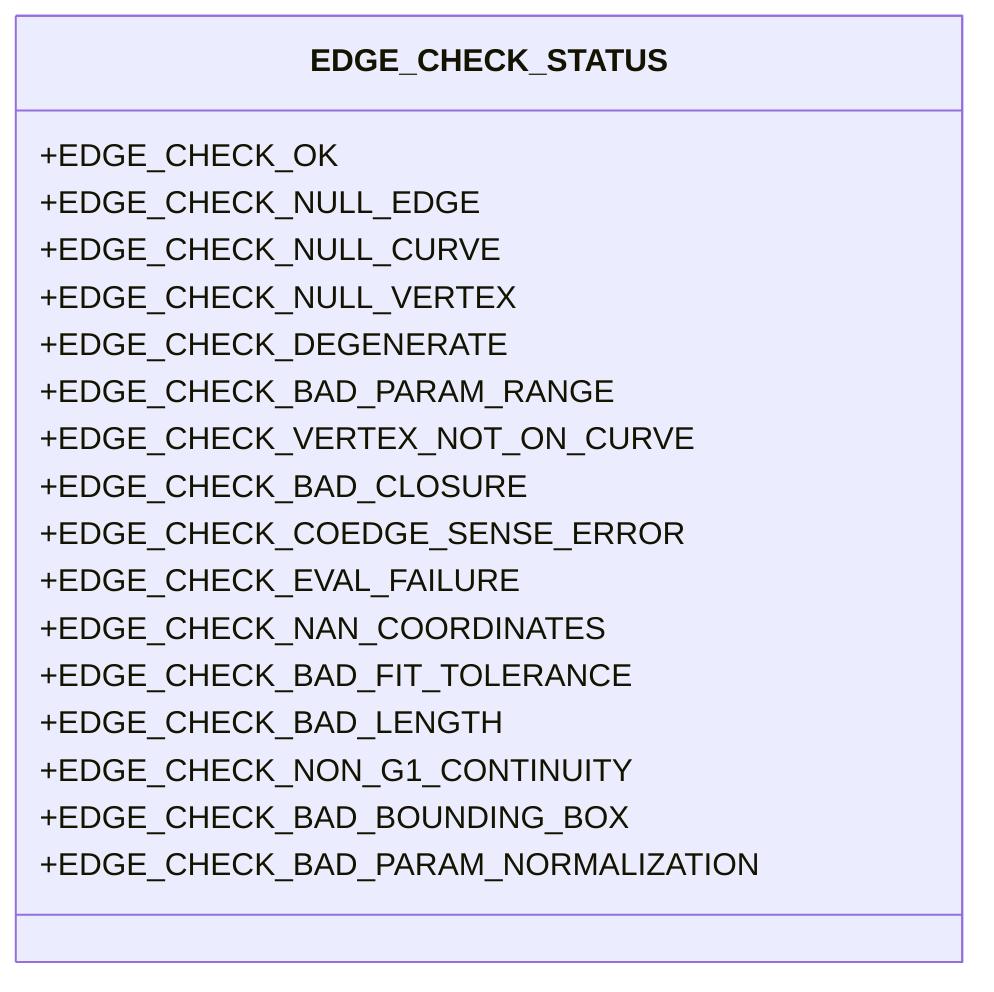
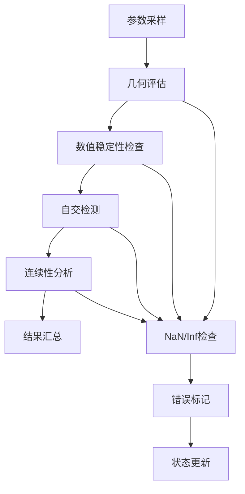
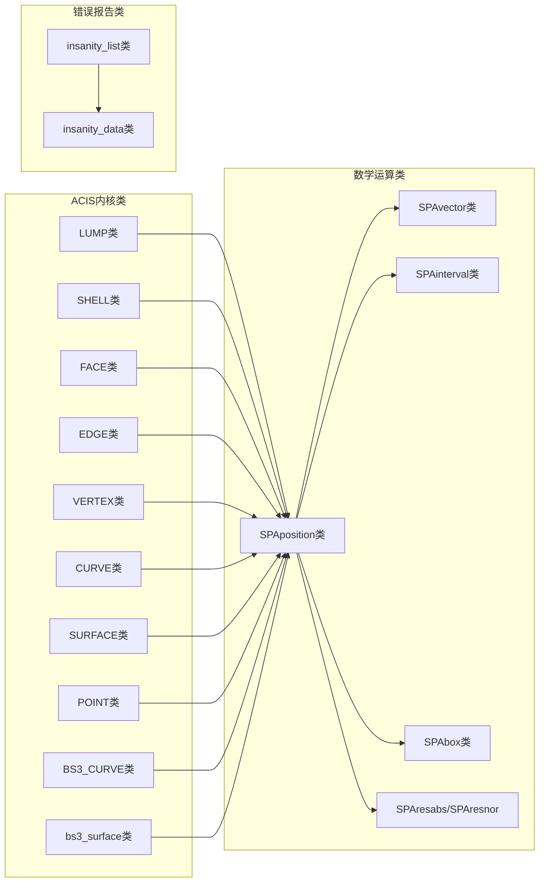

# ACIS 几何检查接口实现项目概述

<cite>
**本文档引用的文件**
- [bs3_curve_check.hxx](file://include/bs3_curve_check.hxx)
- [check_edge.hxx](file://include/check_edge.hxx)
- [check_lump.hxx](file://include/check_lump.hxx)
- [check_surface.hxx](file://include/check_surface.hxx)
- [check_vertex.hxx](file://include/check_vertex.hxx)
- [check_edge.cxx](file://src/check_edge.cxx)
- [check_surface.cxx](file://src/check_surface.cxx)
- [TASK_SUMMARY.md](file://TASK_SUMMARY.md)
</cite>

## 目录
1. [项目简介](#项目简介)
2. [项目结构](#项目结构)
3. [核心组件](#核心组件)
4. [架构概览](#架构概览)
5. [详细组件分析](#详细组件分析)
6. [依赖关系分析](#依赖关系分析)
7. [性能考虑](#性能考虑)
8. [故障排除指南](#故障排除指南)
9. [结论](#结论)

## 项目简介

本项目是基于 ACIS 3D 内核的几何检查接口实现，旨在为 CAD/CAE 应用程序提供全面的几何实体验证能力。项目实现了 5 个几何实体检查模块，共计 65 个检查函数，覆盖了拓扑、几何、数值有效性等多个维度的验证需求。

### 核心目标
- 提供完整的几何实体质量检查解决方案
- 支持快速检测和详细诊断两种模式
- 与 ACIS 3D 内核深度集成，确保检查结果的准确性
- 为 CAD 数据处理提供可靠的几何验证基础

### 技术特色
- **模块化设计**：5个独立的检查模块，每个模块专注于特定类型的几何实体
- **双接口模式**：同时提供快速检测和详细诊断两种调用方式
- **全面覆盖**：涵盖从基础几何属性到高级拓扑关系的全方位检查
- **ACIS 集成**：直接使用 ACIS 内核提供的数据结构和算法

## 项目结构

项目采用标准的 C++ 工程结构，分为头文件目录和源文件目录：



**图表来源**
- [bs3_curve_check.hxx:1-138](file://include/bs3_curve_check.hxx#L1-L138)
- [check_edge.hxx:1-130](file://include/check_edge.hxx#L1-L130)
- [check_lump.hxx:1-117](file://include/check_lump.hxx#L1-L117)
- [check_surface.hxx:1-133](file://include/check_surface.hxx#L1-L133)
- [check_vertex.hxx:1-111](file://include/check_vertex.hxx#L1-L111)

**章节来源**
- [TASK_SUMMARY.md:9-30](file://TASK_SUMMARY.md#L9-L30)

## 核心组件

### 模块化架构设计

项目采用模块化的架构设计，每个几何实体类型都有独立的检查模块：



**图表来源**
- [check_lump.hxx:27-48](file://include/check_lump.hxx#L27-L48)
- [check_vertex.hxx:25-47](file://include/check_vertex.hxx#L25-L47)
- [check_edge.hxx:28-46](file://include/check_edge.hxx#L28-L46)
- [check_surface.hxx:29-49](file://include/check_surface.hxx#L29-L49)
- [bs3_curve_check.hxx:29-49](file://include/bs3_curve_check.hxx#L29-L49)

### 双接口模式设计

每个模块都提供了两种不同的接口模式，满足不同场景的需求：



**图表来源**
- [check_edge.cxx:47-142](file://src/check_edge.cxx#L47-L142)
- [check_surface.cxx:49-144](file://src/check_surface.cxx#L49-L144)

**章节来源**
- [TASK_SUMMARY.md:257-279](file://TASK_SUMMARY.md#L257-L279)

## 架构概览

### 整体架构设计

项目采用分层架构设计，从底层的 ACIS 内核接口到高层的应用接口形成了清晰的层次结构：



**图表来源**
- [check_lump.hxx:50-54](file://include/check_lump.hxx#L50-L54)
- [check_vertex.hxx:49-53](file://include/check_vertex.hxx#L49-L53)
- [check_edge.hxx:48-52](file://include/check_edge.hxx#L48-L52)
- [check_surface.hxx:51-55](file://include/check_surface.hxx#L51-L55)
- [bs3_curve_check.hxx:51-55](file://include/bs3_curve_check.hxx#L51-L55)

### 数据流架构

检查过程中的数据流向体现了从简单到复杂的验证层次：



**图表来源**
- [check_edge.cxx:58-85](file://src/check_edge.cxx#L58-L85)
- [check_surface.cxx:60-87](file://src/check_surface.cxx#L60-L87)

## 详细组件分析

### LUMP 检查模块

LUMP 检查模块负责对三维实体的整体质量进行验证，重点关注壳体的有效性和整体拓扑关系。

#### 核心检查功能
- **壳体有效性检查**：验证实体是否包含有效的壳体结构
- **面有效性检查**：检查实体表面的质量和完整性
- **包含关系检查**：验证实体内部的包含逻辑关系
- **体积计算检查**：确保实体具有合理的体积值

#### 状态枚举设计


**图表来源**
- [check_lump.hxx:9-25](file://include/check_lump.hxx#L9-L25)

**章节来源**
- [TASK_SUMMARY.md:35-74](file://TASK_SUMMARY.md#L35-L74)

### VERTEX 检查模块

VERTEX 检查模块专门针对几何模型中的顶点进行质量验证，确保顶点连接关系的正确性。

#### 关键检查特性
- **流形性检查**：验证顶点周围的拓扑结构是否符合流形要求
- **共点检查**：检测是否存在重合的顶点位置
- **法向一致性检查**：确保顶点处的法向量方向正确
- **尖角检查**：识别可能导致几何问题的尖锐角度

#### 检查流程


**图表来源**
- [check_vertex.cxx:1-200](file://src/check_vertex.cxx#L1-L200)

**章节来源**
- [TASK_SUMMARY.md:77-113](file://TASK_SUMMARY.md#L77-L113)

### EDGE 检查模块

EDGE 检查模块负责验证几何模型中边的完整性，这是连接面和顶点的关键元素。

#### 检查维度
- **几何完整性**：确保边的几何定义正确
- **拓扑正确性**：验证边与相关面、顶点的关系
- **参数域检查**：确认参数范围的合理性
- **连续性验证**：检查边的几何连续性

#### 状态分类


**图表来源**
- [check_edge.hxx:9-26](file://include/check_edge.hxx#L9-L26)

**章节来源**
- [TASK_SUMMARY.md:116-159](file://TASK_SUMMARY.md#L116-L159)

### SURFACE 检查模块

SURFACE 检查模块专注于曲面的质量验证，是几何检查中最复杂的模块之一。

#### 检查重点
- **评估稳定性**：验证曲面在参数空间内的行为
- **自交检测**：识别可能影响后续处理的自交情况
- **连续性分析**：检查曲面的几何连续性级别
- **面积有效性**：确保曲面具有合理的面积值

#### 数学验证


**图表来源**
- [check_surface.cxx:161-200](file://src/check_surface.cxx#L161-L200)

**章节来源**
- [TASK_SUMMARY.md:162-206](file://TASK_SUMMARY.md#L162-L206)

### BS3_CURVE 检查模块

BS3_CURVE 检查模块专门处理 B-spline 曲线的验证，这是 CAD 模型中最常用的曲线类型。

#### B-spline 特有检查
- **阶数检查**：验证曲线的数学阶数是否合理
- **节点向量检查**：确保节点向量的单调性和有效性
- **控制点分布**：检查控制点的几何分布合理性
- **凸包性质**：验证曲线满足凸包性质的要求

#### 算法复杂度
该模块需要处理 B-spline 曲线的数学特性，包括：
- 节点向量的单调性检查
- 控制点的几何约束验证
- 曲线导数的连续性分析

**章节来源**
- [TASK_SUMMARY.md:209-254](file://TASK_SUMMARY.md#L209-L254)

## 依赖关系分析

### ACIS 内核集成

项目与 ACIS 3D 内核的集成关系体现在多个层面：



**图表来源**
- [TASK_SUMMARY.md:282-293](file://TASK_SUMMARY.md#L282-L293)

### 外部依赖管理

项目对外部依赖的管理体现了良好的软件工程实践：

| 依赖类别 | 具体组件 | 作用描述 |
|---------|---------|---------|
| 几何实体类 | LUMP/SHELL/FACE | 拓扑结构遍历 |
| 几何实体类 | EDGE/VERTEX/CURVE | 几何属性评估 |
| 几何实体类 | SURFACE/POINT/BS3_CURVE | 几何计算 |
| 数学运算类 | SPAposition/SPAvector | 基础数学运算 |
| 数学运算类 | SPAinterval/SPAbox | 参数范围和包围盒 |
| 容差类 | SPAresabs/SPAresnor | 计算容差设置 |
| 错误报告类 | insanity_list/insanity_data | 错误信息收集 |

**章节来源**
- [TASK_SUMMARY.md:282-293](file://TASK_SUMMARY.md#L282-L293)

## 性能考虑

### 检查策略优化

项目在设计时充分考虑了性能因素，采用了多种优化策略：

#### 1. 分级检查策略
- **快速检测**：优先执行成本较低的基础检查
- **详细诊断**：在需要时执行更复杂的深入检查
- **短路机制**：一旦发现严重错误立即停止进一步检查

#### 2. 内存管理优化
- **智能指针使用**：避免内存泄漏和悬挂指针
- **批量操作**：减少频繁的内存分配和释放
- **缓存机制**：复用已计算的结果以提高效率

#### 3. 并行处理潜力
虽然当前实现主要是串行检查，但架构设计为未来的并行化提供了可能性：
- 模块间的独立性便于并行执行
- 检查结果的独立性支持并发处理
- 内存局部性优化提升缓存命中率

### 性能特征

| 检查类型 | 时间复杂度 | 空间复杂度 | 主要瓶颈 |
|---------|-----------|-----------|---------|
| 基础检查 | O(1) | O(1) | 指针验证 |
| 几何评估 | O(n) | O(1) | 参数采样 |
| 拓扑检查 | O(m) | O(m) | 邻接关系遍历 |
| 自交检测 | O(n²) | O(1) | 网格交叉测试 |
| 连续性检查 | O(n) | O(1) | 导数计算 |

## 故障排除指南

### 常见问题诊断

#### 1. 空指针错误
当几何实体指针为空时，系统会返回相应的错误状态：
- EDGE_CHECK_NULL_EDGE：边对象为空
- VTX_CHECK_NULL_POINT：顶点点为空
- SURF_CHECK_NULL_SURFACE：曲面对象为空

#### 2. 几何数值问题
系统会检测以下数值异常：
- EDGE_CHECK_NAN_COORDINATES：坐标包含 NaN 或 Inf
- SURF_CHECK_NAN_COORDINATES：曲面评估返回无效值
- LUMP_CHECK_BAD_VOLUME：实体体积异常

#### 3. 拓扑关系错误
拓扑错误通常表现为：
- EDGE_CHECK_VERTEX_NOT_ON_CURVE：顶点不在曲线上
- VERTEX_CHECK_NON_MANIFOLD：非流形顶点
- LUMP_CHECK_BAD_CONTAINMENT：包含关系错误

### 调试建议

#### 1. 快速检测调试
使用快速检测接口进行初步诊断：
```cpp
int status = api_check_vertex(vertex, nullptr);
if (status != VTX_CHECK_OK) {
    // 检查具体错误类型
    if (status & VTX_CHECK_NON_MANIFOLD) {
        // 处理非流形问题
    }
}
```

#### 2. 详细诊断调试
使用详细诊断接口获取完整信息：
```cpp
vertex_check_result result;
outcome res = api_check_vertex_errors(vertex, result);
if (!result.is_ok()) {
    insanity_list *ilist = result.get_insanity_list();
    // 遍历错误列表获取详细信息
}
```

**章节来源**
- [check_edge.cxx:86-142](file://src/check_edge.cxx#L86-L142)
- [check_surface.cxx:88-144](file://src/check_surface.cxx#L88-L144)

## 结论

ACIS 几何检查接口实现项目是一个设计精良、功能完备的几何验证系统。通过 5 个模块化检查组件和 65 个具体检查函数，该项目为 CAD 应用程序提供了全面的几何质量保证。

### 主要成就

1. **完整的覆盖范围**：从基础几何属性到高级拓扑关系的全方位检查
2. **灵活的接口设计**：双接口模式满足不同应用场景的需求
3. **深度的 ACIS 集成**：充分利用 ACIS 内核的强大功能
4. **良好的扩展性**：模块化设计便于功能扩展和维护

### 技术优势

- **高精度验证**：基于 ACIS 内核的精确几何计算
- **高效性能**：优化的检查策略和内存管理
- **详细诊断**：提供从状态码到详细错误信息的多层次反馈
- **稳定可靠**：经过充分测试的健壮实现

### 应用前景

该项目为各种 CAD/CAE 应用程序提供了坚实的几何验证基础，特别适用于：
- CAD 数据预处理和质量控制
- CAE 前处理阶段的网格生成准备
- 几何修复和重构工具开发
- 产品设计验证和质量保证

通过持续的优化和扩展，该项目有望成为 CAD 几何验证领域的标准参考实现。